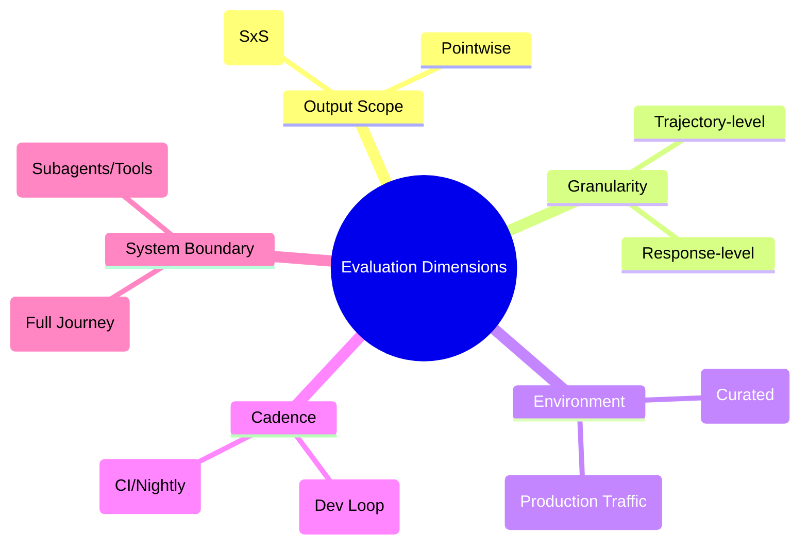
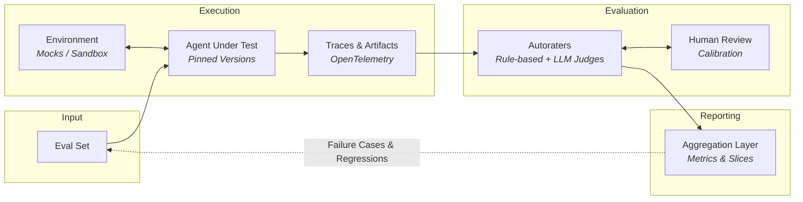
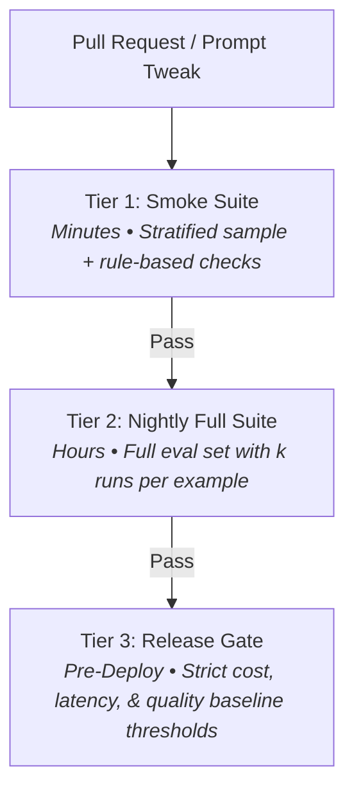

# Agentic Evals: A Software Engineer's Guide (Part 1)

**Yesha Shah**  
*Senior Software Engineer at Google | Current: Agent Quality, Google Cloud AI | Prev: Sprinklr, Google Shopping*  
*September 21, 2026*

> [!NOTE]
> This is **Part 1** of a series on building evals for production-grade agents. I am publishing the full series and shorter field notes as I learn on Substack. Follow if you are interested in agentic evals and engineering production agentic systems.

---

Deploying an agent is straightforward. Establishing whether it works, and whether it still works after a prompt revision or a model upgrade, is much harder.

This post is a theoretical introduction to that problem. It covers:
- What an agentic eval is
- How an eval harness is put together
- Which metrics matter in production
- The failure modes that leave a team with an eval system that reports nothing useful

Later posts in the series go into each of these in depth.

> [!IMPORTANT]
> **Scope:** Everything here concerns production agentic systems serving end users: support agents, workflow agents, in-product assistants. Long-running coding agents operating inside a harness share many of the same principles but raise separate evaluation problems, and they are out of scope.

---

## 1. Defining an Agentic Eval

**Agentic evals are automated integration tests for AI agents.** They verify how an agent behaves across the whole lifecycle of a user request, including the path it took to get to an answer rather than just the answer itself.

That is what separates them from LLM evals:
- **LLM Eval:** Tests a single inference. A prompt goes in, a response comes back, and the response is graded.
- **Agentic Eval:** An agent runs a loop of many inferences, calls tools, and changes external state along the way. Agentic evals therefore grade the **whole trajectory**.

> 💡 **Core Principle:**  
> *An LLM call produces one output to grade. An agent produces a trajectory.*

### Compounding Errors
Errors also compound across steps. If every step in a trajectory is independently 95% reliable:
- A 10-step task succeeds roughly **60%** of the time ($0.95^{10} \approx 0.599$).
- An error early on corrupts everything downstream.

Per-step accuracy that looks excellent in isolation can still produce an unreliable agent, which is why grading the final response is not enough signal on its own.

---

## 2. Evaluation Criteria

While standard LLM evals assess static properties of an isolated response, agentic evals expand the evaluation surface to the entire execution trace:

| Category | Criterion | Key Question |
| :--- | :--- | :--- |
| **LLM Evals** *(Inherited)* | **Fulfillment** | Did the response satisfy the user’s request? |
| | **Groundedness** | Did the model hallucinate? Did every claim trace back to a source or tool output? |
| | **Safety & Compliance** | Did the response breach policy (such as privacy laws)? |
| **Agentic Evals** *(Additional)* | **Trajectory** | Did the agent take a sensible sequence of steps to reach the outcome? |
| | **Tool Use** | Did it pick the right tool, pass correct arguments, call tools in a valid order, and handle tool errors? |
| | **Side Effects** | Did external state change as intended, and did anything change that should not have? |
| | **Efficiency** | Tokens per task, tool calls per task, agent turns to resolution, p50/p95 latency, and cost per resolved task. |

> [!TIP]
> Custom metrics are rarely worth the effort at the start. Vertex evaluation service, the OpenAI Evals API, and the LangSmith SDK all ship agent evaluation frameworks with predefined metrics. Start with those and tune them to your use case.

---

## 3. Categories of Agents

The kind of agent you are building sets the difficulty of evaluating it:

```
┌─────────────────────────────────┐       ┌─────────────────────────────────┐
│       Goal-Oriented Agents      │       │       Long-Running Agents       │
├─────────────────────────────────┤       ├─────────────────────────────────┤
│ • Bounded, discrete tasks       │       │ • Complex multi-hour tasks      │
│ • Simple side-effects           │       │ • Substantial state & memory    │
│ • Stateless / shared servers    │       │ • VM/container run isolation    │
│ • Seconds-long trajectories     │       │ • Hours-long trajectories       │
└─────────────────────────────────┘       └─────────────────────────────────┘
```

- **Goal-oriented agents:** Built around a bounded task: customer care, code review triage, returns processing. Side effects exist but stay simple, like sending an email or opening a ticket. Requests are mostly independent of one another and get served the same way as any other API call on a shared server.
- **Long-running agents:** Take a complex task, run for minutes or hours, and return a result. Deep research agents and coding agents sit here. State is substantial, with files written, steps executed, and memory accumulated; side effects are both numerous and consequential. Concurrent tasks need real isolation, usually a VM or a container per run, or they interfere with each other.

> **Takeaway:** Evals for long-running agents are substantially harder to build: you manage stateful environments, memory across steps, a larger surface of side effects to assert against, and trajectories measured in hours rather than seconds.

---

## 4. Dimensions of Evaluation

These dimensions are orthogonal, not alternatives to choose between. Most mature systems combine several simultaneously:



1. **Pointwise vs. Pairwise:**
   - **Pairwise (SxS):** Shows a rater two outputs for the same input and asks which is better (e.g., LMSYS Chatbot Arena). High quality signal, but requires human raters, making it impractical for rapid iterations.
   - **Pointwise:** Scores a single output against defined criteria. This is what you want in your core development loop.
2. **Response vs. Trajectory:**
   - **Response evals:** Grade the final output. If the agent's job is simply answering a question, the path may not matter.
   - **Trajectory evals:** Grade the path taken. If the agent's job is issuing a refund, the path is critical and must be evaluated.
3. **Offline vs. Online:**
   - **Offline:** Runs against a curated dataset in a controlled environment to catch defects before release.
   - **Online:** Scores a sample of production traffic, acknowledging that no offline dataset anticipates all real-world behaviors.
   - *Note:* Check privacy and data residency regulations in your operating jurisdiction before collecting online production traces.
4. **Ad Hoc vs. Scheduled:**
   - **Ad hoc runs:** Function like unit tests during development (e.g., using Google ADK Web to change a prompt, run a subset of examples, and inspect results).
   - **Scheduled runs:** Execute nightly or pre-release, acting like comprehensive integration tests across the full dataset.
5. **Component vs. End-to-End:**
   - **Component runs:** Evaluate individual subagents (retriever, router, tool wrapper) in isolation. Cheaper, lower variance, and pinpoint failures quickly.
   - **End-to-end runs:** Reserve for critical user journeys; cover underlying subsystems with component evals.

---

## 5. Architecture of an Eval Harness

A harness operates as a closed feedback loop:



> 🔁 *The pipeline: eval set in, verdicts out, failures returned to the eval set.*

A production eval harness comprises **six core components**:
1. **The Eval Set:** Holds inputs and, optionally, expected outputs.
2. **The Environment:** Mocked tools, a sandbox, or a dedicated test account.
3. **Agent Under Test:** Pinned to a specific version of every dependency.
4. **Traces:** Detailed execution logs produced during runs.
5. **Autoraters:** Automated mechanisms that judge traces and emit verdicts.
6. **Aggregation Layer:** Computes metric scores, confidence intervals, and reporting.

---

### Component 1: The Eval Set

An eval set is a collection of examples that initiate an agent run and provide the context needed for execution.

#### Where Examples Come From (Ranked by Value)
1. 🥇 **Production traces & bug reports:** Worth more than the rest combined. An observed production failure is an invaluable regression test.
2. 🥈 **Synthetic generation:** LLMs generate scenarios from critical user journeys, known defects, and existing traces. Fast coverage of long-tail edge cases, though less realistic. Ideal before launch.
3. 🥉 **Open-source benchmarks:** (e.g., SWE-bench for coding). Useful for baseline calibration against the field, but rarely sufficient for specific domain requirements.
4. 🏅 **Vendor-supplied datasets:** Specialist agencies building eval sets and environments to specification. High cost, but the fastest route when starting with zero data.

> **Golden Datasets:** An eval set that carries expected outputs—the trajectory, tool calls, final response, or resulting state—against which autoraters compare observed behavior.

#### Best Practices for Eval Set Hygiene
- **Version the eval set as code:** A score is only meaningful against a fixed dataset version. Changing the dataset and agent in the same commit yields uninterpretable numbers.
- **Stratify and report per slice:** Aggregate figures hide severe regressions in niche, high-value segments. *(Note: Slicing requires datasets > 100 examples to maintain statistically meaningful confidence intervals).*
- **Maintain a hold-out set:** Tuning prompts against all available data causes prompt overfitting. A hold-out slice guarantees independent validation.
- **Refresh periodically:** Products evolve, models change, and user behavior drifts. Stale eval sets report false confidence while production quality degrades.

---

### Component 2: The Environment

Agents need downstream systems to interact with. The options sit on a fidelity-versus-cost spectrum:

| Environment Tier | Fidelity | Cost & Setup | Determinism | Key Trade-offs |
| :--- | :---: | :---: | :---: | :--- |
| **Static Mocks** | Low | Low | High | Cheap, fast, isolated; cannot detect API schema drift. |
| **Recorded & Replayed** | Medium | Low–Medium | High | Realistic; goes stale and requires periodic trace refreshes. |
| **Sandboxed Environment** | High | Medium–High | Medium | Working stack with seeded data; carries meaningful infra maintenance. |
| **Dedicated Test Account** | Highest | Very High | Low | Interacts with live systems; slow, expensive, and subject to external flakiness. |

> [!TIP]
> **Recommended Pattern:** Use **mocks or recorded responses inside the inner eval loop** (fast, deterministic, repeatable), paired with a **sandbox or test account outside the loop** for integration smoke testing.

---

### Component 3: Execution and Traces

Running an agent across the eval set produces the artifacts to grade: responses, intermediate reasoning steps, tool invocations, arguments, and state mutations.

Three rules apply:
1. **Pin every variable not under test:** Model version, system prompt version, tool schemas, eval set version, and judge configuration. If multiple variables shift at once, attribution is impossible.
2. **Run each example multiple times:** Agents are stochastic; a single execution is merely a sample, not a definitive measurement.
3. **Instrument with standard tracing:** Adopt standard schemas like **OpenTelemetry GenAI semantic conventions**. Unifying trace schemas enables direct reuse of offline harness tooling for online production observability.

---

### Component 4: Autoraters

A complete eval harness employs a three-tiered autorater stack:

```
┌────────────────────────────────────────────────────────┐
│ 1. Rule-Based Autoraters (Deterministic code checks)   │
├────────────────────────────────────────────────────────┤
│ 2. LLM Judges (Binary rubrics + trajectory citations)  │
├────────────────────────────────────────────────────────┤
│ 3. Human Review (Calibration & alignment ground-truth) │
└────────────────────────────────────────────────────────┘
```

#### 1. Rule-Based Autoraters
Written in ordinary code. Ideal wherever correct behavior is deterministic:
- Was a tool called with expected parameters?
- Does a database row reflect the expected update?
- Did the agent emit required disclaimer strings?
- Did it avoid calling `issue_refund` before verification?

*Text metrics (BLEU, ROUGE)* also belong here, but provide weak signal for multi-step agents and should be restricted to narrow string tasks (translation, summarization).

#### 2. LLM Judges
Required for subjective qualities: groundedness, trajectory coherence, tone, and nuanced policy adherence.
- **Use Binary Rubrics over Ordinal Scales:**
  - ❌ *Unstable:* `"Rate trajectory quality from 1 to 5"` (high variance, noisy numbers).
  - ✅ *Stable:* `"Did the agent call get_order_details before generate_return_label?"` (atomic yes/no assertion).
- **Mandate Trajectory Citations:** Require the judge to cite the exact step or tool output that triggered its decision. This curbs hallucinated verdicts and accelerates root-cause debugging.

#### 3. Human Review
The smallest volume, but the most essential component: **human review validates the autoraters**. An uncalibrated LLM judge gives misleading signals that diverge from real user experience.

---

## 6. Single-Turn vs. Multi-Turn Evals

| Aspect | Single-Turn Evals | Multi-Turn Evals |
| :--- | :--- | :--- |
| **Scope** | Single exchange or individual trajectory step | Full multi-exchange conversational arc |
| **Complexity** | Simple to build, fast, deterministic | Requires simulated user agent |
| **Scoring Target** | Immediate output / argument validity | Goal resolution, turn economy, recovery from ambiguity |

### Simulating Users in Multi-Turn Evals
Testing conversational agents requires a **simulated user**—an LLM parameterized with:
1. A distinct persona
2. A explicit objective
3. Hidden context/facts disclosed only when the agent asks clarifying questions

> [!WARNING]
> When orchestrating simulated users:
> - **Cap turn counts** to prevent infinite dialogue loops.
> - **Define explicit stopping conditions** (objective satisfied or failure acknowledged).
> - **Audit transcripts by hand** regularly to ensure simulated user behavior has not drifted from real human patterns.

---

## 7. Evaluating Agents Reliably

Because agents are non-deterministic, running the same eval example twice often produces distinct trajectories.

### Key Reliability Practices

1. **Report Confidence Intervals:** Avoid reporting single point estimates. Present pass rates as a mean across multiple runs accompanied by standard deviation and confidence intervals.
2. **Track Specialized Pass Metrics ($pass^k$ and $pass@k$):**
   - **$pass^k$ (Strict Reliability):** The proportion of examples that pass on **every one** of $k$ consecutive runs. For irreversible or financial workflows, this metric reflects actual user satisfaction far better than an average.
   - **$pass@k$ (Exploration/Leniency):** The proportion of examples that pass **at least once** across $k$ attempts.
3. **Isolate Infrastructure Failures:** Timeouts, quota exhaustion, and mock server disconnects are infrastructural bugs, not agent quality signals. Track infrastructure health on an independent dashboard so test flakiness does not taint quality metrics.

---

## 8. Integrating Evals into the Release Process

Evals should be layered into Continuous Integration (CI) across three tiers:



1. **Smoke Suite:** Runs on every commit/PR. Finishes in minutes, evaluating a small stratified sample alongside all deterministic rule-based checks.
2. **Nightly Full Suite:** Executes the full dataset with $k$ iterations per example to capture variance.
3. **Release Gate:** Evaluates the complete candidate build, checking quality, latency (p50/p95), and token costs against established production baselines.

---

## 9. Cost Management

Agent evals burn substantial token volume across trajectory generation and LLM judge evaluations. In parallel runs, they can rapidly exhaust API quotas and strain backend infrastructure.

Two primary strategies keep costs manageable:
1. **Maximize Rule-Based Checks:** Shift every deterministic check into standard code autoraters. Code checks are effectively instantaneous and free.
2. **Deduplicate the Eval Set:** Clustering and removing redundant examples reduces eval overhead without sacrificing coverage.

---

## 10. Conclusion & Key Takeaways

Agents fail differently from raw foundation models, demanding fundamentally different evaluation paradigms:

- 🎯 **The trajectory is the unit of evaluation:** Evaluating the final answer alone misses compounding errors, tool misfires, and unintended side effects.
- 📁 **The eval set governs everything:** Ground datasets in real production failures, version them as code, and preserve hold-out slices against prompt overfitting.
- ⚖️ **Spend environment fidelity deliberately:** Rely on fast, deterministic mocks in day-to-day dev loops; reserve sandboxes and live accounts for pre-release validation.
- 🤖 **Build a multi-layered autorater stack:** Pair deterministic code assertions with binary-rubric LLM judges, anchored by continuous human calibration.
- 📊 **Treat evaluations as statistical samples:** Run stochastic runs $k$ times, measure $pass^k$ for critical paths, and separate test infrastructure flakiness from true agent failures.
