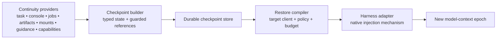

# so ive been working on this para-agent project and just had two of its agents do a deep dive on the implementation and examine other projects `D:\aghado01\science-facility\mcp\issues\para-agent\claude-agy-codesign-brief.md`

Got it—the co-design brief is at that path. What would you like me to do with it: synthesize the findings, critique the recommendations, turn them into an implementation plan, or start implementing?

---

# i just want to examine the findings and do some more design work for now

Message Type: FINAL_ANSWER
Task name: /root
Sender: /root/contract_audit
Payload:
## Implementation ↔ contract map

### Substantially conforming

- The journal/body split and append-only write path match the core storage design: stream-local `journal.jsonl` plus `turns/`, with JSONL appended rather than rewritten ([journal.js:41](D:/aghado01/science-facility/mcp/para-agent/src/journal.js:41), [journal.js:72](D:/aghado01/science-facility/mcp/para-agent/src/journal.js:72); contract [CONSOLE-CONTRACT.md:16](D:/aghado01/science-facility/mcp/para-agent/contract/CONSOLE-CONTRACT.md:16)).
- Normal writes supply `v/seq/ts/stream`; turn/output/exit fields mostly match, including 8-hex hashes, the inline threshold, exactly one of `text`/`ref`, previews, and non-coercion of absent exit codes ([journal.js:72](D:/aghado01/science-facility/mcp/para-agent/src/journal.js:72), [journal.js:84](D:/aghado01/science-facility/mcp/para-agent/src/journal.js:84), [journal.js:106](D:/aghado01/science-facility/mcp/para-agent/src/journal.js:106), [journal.js:125](D:/aghado01/science-facility/mcp/para-agent/src/journal.js:125)).
- Record reads do return an unconditional receipt; `complete` and `withheld` agree, and deferred bodies are kept separate from query omissions ([journal.js:275](D:/aghado01/science-facility/mcp/para-agent/src/journal.js:275), [journal.js:293](D:/aghado01/science-facility/mcp/para-agent/src/journal.js:293), [journal.js:312](D:/aghado01/science-facility/mcp/para-agent/src/journal.js:312)).
- The interactive producer avoids competing journal writers by handing unsequenced envelopes through an inbox ([ParaConsole.psm1:24](D:/aghado01/science-facility/mcp/para-agent/capture/ParaConsole.psm1:24), [journal.js:141](D:/aghado01/science-facility/mcp/para-agent/src/journal.js:141)).

### Factual divergences / looseness

1. **Sidecars are keyed by `turn`, not `seq`.** The contract specifies `turns/<seq>.out/.done/.cancel`; `turnPath()` receives the turn and all returned paths use it ([CONSOLE-CONTRACT.md:20](D:/aghado01/science-facility/mcp/para-agent/contract/CONSOLE-CONTRACT.md:20), [journal.js:65](D:/aghado01/science-facility/mcp/para-agent/src/journal.js:65), [journal.js:97](D:/aghado01/science-facility/mcp/para-agent/src/journal.js:97)).

2. **PowerShell capture is not byte-exact.** Output is merged into the object pipeline, converted with `Out-String -Stream`, then written as UTF-8 ([capture.js:131](D:/aghado01/science-facility/mcp/para-agent/src/capture.js:131)). `recordOutput` then decodes and re-encodes as UTF-8 ([journal.js:107](D:/aghado01/science-facility/mcp/para-agent/src/journal.js:107)). This cannot preserve arbitrary native bytes and can alter formatting/newlines, contrary to the producer promise ([CONSOLE-CONTRACT.md:124](D:/aghado01/science-facility/mcp/para-agent/contract/CONSOLE-CONTRACT.md:124)). `body()` additionally splits and rejoins with `\n`, losing CRLF and a terminal newline while it may report `complete:true` ([journal.js:357](D:/aghado01/science-facility/mcp/para-agent/src/journal.js:357), [journal.js:400](D:/aghado01/science-facility/mcp/para-agent/src/journal.js:400)).

3. **A “turn dispatched” record precedes dispatch.** `openTurn()` appends the record before wrapper-file creation and `mux.sendLine`; either later operation can fail although the journal says dispatch occurred ([capture.js:196](D:/aghado01/science-facility/mcp/para-agent/src/capture.js:196), [capture.js:202](D:/aghado01/science-facility/mcp/para-agent/src/capture.js:202), [capture.js:206](D:/aghado01/science-facility/mcp/para-agent/src/capture.js:206); contract [CONSOLE-CONTRACT.md:41](D:/aghado01/science-facility/mcp/para-agent/contract/CONSOLE-CONTRACT.md:41)).

4. **Lifecycle outcomes are narrower than the contract.** Pane death is detected, but produces only a note and leaves the turn open, rather than an `exit {outcome:"died"}` ([capture.js:83](D:/aghado01/science-facility/mcp/para-agent/src/capture.js:83), [capture.js:255](D:/aghado01/science-facility/mcp/para-agent/src/capture.js:255); contract [CONSOLE-CONTRACT.md:72](D:/aghado01/science-facility/mcp/para-agent/contract/CONSOLE-CONTRACT.md:72), [CONSOLE-CONTRACT.md:74](D:/aghado01/science-facility/mcp/para-agent/contract/CONSOLE-CONTRACT.md:74)). Both immediate and delayed completion ignore `done.outcome` and hard-code `"completed"` ([capture.js:227](D:/aghado01/science-facility/mcp/para-agent/src/capture.js:227), [capture.js:295](D:/aghado01/science-facility/mcp/para-agent/src/capture.js:295)).

5. **Cooperative cancellation has no producer-side implementation.** The consumer writes `.cancel`, but neither wrapper receives `cancelPath` nor polls it ([capture.js:122](D:/aghado01/science-facility/mcp/para-agent/src/capture.js:122), [capture.js:196](D:/aghado01/science-facility/mcp/para-agent/src/capture.js:196), [capture.js:202](D:/aghado01/science-facility/mcp/para-agent/src/capture.js:202), [capture.js:308](D:/aghado01/science-facility/mcp/para-agent/src/capture.js:308)); this does not implement the contract’s “producer polls it and stops itself” behavior ([CONSOLE-CONTRACT.md:130](D:/aghado01/science-facility/mcp/para-agent/contract/CONSOLE-CONTRACT.md:130)).

6. **Several loss cases are silently represented as success.**
   - Missing output path/file becomes an empty output record ([journal.js:107](D:/aghado01/science-facility/mcp/para-agent/src/journal.js:107)).
   - A missing referenced sidecar becomes an empty body, with normal completeness accounting ([journal.js:350](D:/aghado01/science-facility/mcp/para-agent/src/journal.js:350)).
   - A corrupt journal line is fabricated with `seq:-1`, then excluded by the public minimum `from:0`; the resulting read can still be complete ([journal.js:252](D:/aghado01/science-facility/mcp/para-agent/src/journal.js:252), [journal.js:280](D:/aghado01/science-facility/mcp/para-agent/src/journal.js:280), [index.js:571](D:/aghado01/science-facility/mcp/para-agent/src/index.js:571)).
   - Inbox append retries can exhaust and return silently ([ParaConsole.psm1:141](D:/aghado01/science-facility/mcp/para-agent/capture/ParaConsole.psm1:141)). A crash after inbox rename leaves an unexamined `.claim`; ingestion only looks for `inbox.jsonl` ([journal.js:152](D:/aghado01/science-facility/mcp/para-agent/src/journal.js:152)).

   These conflict with the no-silent-omission priority ([CONSOLE-CONTRACT.md:9](D:/aghado01/science-facility/mcp/para-agent/contract/CONSOLE-CONTRACT.md:9)).

7. **Receipt retrieval paths are not reliably executable.** Record-limit receipts say `read(...)`, but the public journal tool is `log(view:"records", ...)` ([journal.js:303](D:/aghado01/science-facility/mcp/para-agent/src/journal.js:303), [index.js:554](D:/aghado01/science-facility/mcp/para-agent/src/index.js:554)). Search receipts say `search(...)`, but the tool is `find`; per-turn recovery contains `<n>`, and expanded `maxHits` can exceed the public maximum 500 ([journal.js:458](D:/aghado01/science-facility/mcp/para-agent/src/journal.js:458), [index.js:643](D:/aghado01/science-facility/mcp/para-agent/src/index.js:643), [index.js:658](D:/aghado01/science-facility/mcp/para-agent/src/index.js:658)). This violates the concrete-retrieval-call rule ([CONSOLE-CONTRACT.md:105](D:/aghado01/science-facility/mcp/para-agent/contract/CONSOLE-CONTRACT.md:105)). Record receipts also omit `bytes.withheld` ([journal.js:317](D:/aghado01/science-facility/mcp/para-agent/src/journal.js:317)).

8. **Grep body pagination is broken.** Its receipt recommends a larger `offsetLines`, but the grep branch never applies that offset, so the same first page returns indefinitely ([journal.js:361](D:/aghado01/science-facility/mcp/para-agent/src/journal.js:361), [journal.js:375](D:/aghado01/science-facility/mcp/para-agent/src/journal.js:375), [journal.js:384](D:/aghado01/science-facility/mcp/para-agent/src/journal.js:384)). The implementation is also stricter than query-completeness semantics: grep nonmatches and lines before an explicit offset are counted as “withheld” and force `complete:false` ([journal.js:389](D:/aghado01/science-facility/mcp/para-agent/src/journal.js:389), [journal.js:396](D:/aghado01/science-facility/mcp/para-agent/src/journal.js:396)), although the contract defines completeness over records matching the query ([CONSOLE-CONTRACT.md:103](D:/aghado01/science-facility/mcp/para-agent/contract/CONSOLE-CONTRACT.md:103)).

### Correctness invariants the code currently relies on

- One para-agent process and one serialized writer per stream; counters are in memory and increment before awaited appends, with no lock ([index.js:35](D:/aghado01/science-facility/mcp/para-agent/src/index.js:35), [journal.js:44](D:/aghado01/science-facility/mcp/para-agent/src/journal.js:44), [journal.js:72](D:/aghado01/science-facility/mcp/para-agent/src/journal.js:72)).
- UTF-8 textual output, not arbitrary byte streams.
- Safe stream IDs: `stream` is inserted directly into a filesystem path, while arbitrary log handles are accepted ([journal.js:37](D:/aghado01/science-facility/mcp/para-agent/src/journal.js:37), [index.js:38](D:/aghado01/science-facility/mcp/para-agent/src/index.js:38)).
- No out-of-band `cd` after the cwd cache is primed; only captured-run sentinels refresh it ([capture.js:36](D:/aghado01/science-facility/mcp/para-agent/src/capture.js:36), [capture.js:188](D:/aghado01/science-facility/mcp/para-agent/src/capture.js:188), [capture.js:225](D:/aghado01/science-facility/mcp/para-agent/src/capture.js:225)).
- User-supplied regex flags exclude stateful `g`/`y`; `find` accepts unrestricted flags but reuses one `RegExp.test()` across lines ([index.js:656](D:/aghado01/science-facility/mcp/para-agent/src/index.js:656), [journal.js:419](D:/aghado01/science-facility/mcp/para-agent/src/journal.js:419), [journal.js:438](D:/aghado01/science-facility/mcp/para-agent/src/journal.js:438)).

### Test coverage

There is no para-agent automated test entry—only `start`—and no JS test/spec files were found ([package.json:10](D:/aghado01/science-facility/mcp/para-agent/package.json:10)). Consequently, schema/envelope validation, receipt invariants and executable recovery calls, corruption/missing-sidecar handling, grep pagination, newline/binary fidelity, cancellation/death outcomes, restart recovery, and concurrent writer/finalizer behavior are all presently unlocked by tests.

Message Type: MESSAGE
Task name: /root
Sender: /root/design_synthesis
Payload:

Message Type: FINAL_ANSWER
Task name: /root
Sender: /root/design_synthesis
Payload:
Bottom line: preserve the console substrate, but put agent delegation on a separate typed job plane. The prior report’s strongest ideas are batching and `find` promotion; its Bash→`run`, `cmd_hash`, SimHash, and ledger-v1 claims need major correction.

## Implementation/contract reality

- The main invariant is not concurrency-safe. `journalFor()` can construct two journals before either enters the map, while `_seq` and append order are process-local and unlocked ([index.js:41](D:/aghado01/science-facility/mcp/para-agent/src/index.js:41), [journal.js:44](D:/aghado01/science-facility/mcp/para-agent/src/journal.js:44), [journal.js:72](D:/aghado01/science-facility/mcp/para-agent/src/journal.js:72)). Multi-client support therefore requires a single writer or locking.
- A detected dead pane emits only a note, never the contract’s distinguishing `exit(outcome:"died")` ([capture.js:255](D:/aghado01/science-facility/mcp/para-agent/src/capture.js:255), [CONSOLE-CONTRACT.md:72](D:/aghado01/science-facility/mcp/para-agent/contract/CONSOLE-CONTRACT.md:72)).
- `body(grep)` ignores `offsetLines`, so its advertised continuation repeats page one ([journal.js:361](D:/aghado01/science-facility/mcp/para-agent/src/journal.js:361), [journal.js:375](D:/aghado01/science-facility/mcp/para-agent/src/journal.js:375)). Missing body files become empty bodies or are skipped silently ([journal.js:350](D:/aghado01/science-facility/mcp/para-agent/src/journal.js:350), [journal.js:429](D:/aghado01/science-facility/mcp/para-agent/src/journal.js:429)).
- Free-form regex flags permit `g`, whose stateful `test()` silently skips matches ([index.js:653](D:/aghado01/science-facility/mcp/para-agent/src/index.js:653), [journal.js:436](D:/aghado01/science-facility/mcp/para-agent/src/journal.js:436)).
- `exec(keepJournal:false)` claims the large result cannot be fetched, but only removes the in-memory map entry; disk artifacts remain ([index.js:527](D:/aghado01/science-facility/mcp/para-agent/src/index.js:527), [index.js:542](D:/aghado01/science-facility/mcp/para-agent/src/index.js:542)). Retention and reachability are contradictory.
- Interactive capture is better than the stale contract: transcript slicing captures `Write-Host` ([ParaConsole.psm1:18](D:/aghado01/science-facility/mcp/para-agent/capture/ParaConsole.psm1:18)). But it records post-command cwd as dispatch cwd and can abandon an envelope silently after retries ([ParaConsole.psm1:172](D:/aghado01/science-facility/mcp/para-agent/capture/ParaConsole.psm1:172), [ParaConsole.psm1:141](D:/aghado01/science-facility/mcp/para-agent/capture/ParaConsole.psm1:141)).
- The skill still performs raw `agy` preflight, launch, collection, and verification rather than using the MCP ([SKILL.md:21](D:/aghado01/science-facility/skills/para-agent/SKILL.md:21), [SKILL.md:45](D:/aghado01/science-facility/skills/para-agent/SKILL.md:45), [SKILL.md:79](D:/aghado01/science-facility/skills/para-agent/SKILL.md:79)).

## Critique of proposals 1–8

1. **Journal as hook state — keep only as inspiration.** A stream directory does not prove a live pane: journal reads create directories, and kill never removes them ([journal.js:49](D:/aghado01/science-facility/mcp/para-agent/src/journal.js:49), [index.js:198](D:/aghado01/science-facility/mcp/para-agent/src/index.js:198)). Publish a small atomic, leased `projection.json`; raw journal scanning is stale and unbounded. State alone removes zero turns.

2. **Array-valued `run` — accept, with constraints.** It removes `N−1` calls only for commands knowable in advance. Use a typed `commands[]` batch, per-pane mutex, `stopOnError`, per-command selectors, and explicit skipped/resume receipts. Otherwise later `body` calls surrender the savings.

3. **PreToolUse Bash→MCP `run` — reject.** Hooks can replace the current tool’s input, not its identity ([claude-code.mjs:4](D:/aghado01/packages/context-mode/hooks/formatters/claude-code.mjs:4)). More seriously, the current adapter records Claude ignoring Bash `updatedInput.command` and converts it to denial ([claude-code.mjs:57](D:/aghado01/packages/context-mode/hooks/formatters/claude-code.mjs:57)). A same-tool CLI wrapper might work after an installed-client proof; Bash→MCP cannot.

4. **`cmd_hash` recall — hint only, not caching.** It omits cwd, shell, environment, repository/input revision, and time; eight hex digits are unsuitable as authority. Guidance arrives after Bash was already selected, so it does not prevent execution. Put explicit cache policy and a full freshness key inside typed `run` instead.

5. **`find promote:N` — accept and rank highly.** Use `includeMatchingBodiesUnderBytes`, favor the sole/small matching body, and preserve receipts. This removes one `body` call per successful investigation. “Top N” currently has no ranking semantics.

6. **SimHash — defer.** Hashish SimHash needs corpus IDF; with its default empty map and `unknownIdf=0`, every token is skipped and hashes collapse to zero ([simhash.cs:35](D:/aghado01/rector-codicis/primitives/hashish/simhash.cs:35), [simhash.cs:94](D:/aghado01/rector-codicis/primitives/hashish/simhash.cs:94)). Reimplementing creates a second numerical authority despite the recorded ownership boundary ([SHAPE.md:225](D:/aghado01/rector-codicis/SHAPE.md:225)). Nearness also does not establish semantic equivalence or directly remove a call.

7. **Schema fixes — accept but broaden.** Forbid stateful/duplicate flags, capture partial output before recording `died`, repair grep pagination, missing-ref completeness, and retrieval-call names. The report’s concern about `completed + ok:false` is mistaken: the contract intentionally separates lifecycle completion from success ([CONSOLE-CONTRACT.md:69](D:/aghado01/science-facility/mcp/para-agent/contract/CONSOLE-CONTRACT.md:69)).

8. **Ledger as v1 stream kinds — reject.** V1 explicitly excludes governance and closes `kind` to four values ([CONSOLE-CONTRACT.md:14](D:/aghado01/science-facility/mcp/para-agent/contract/CONSOLE-CONTRACT.md:14), [CONSOLE-CONTRACT.md:39](D:/aghado01/science-facility/mcp/para-agent/contract/CONSOLE-CONTRACT.md:39)). Job decisions need actor, job, evidence, causation, budget, and state transitions—not `turn`. Create a versioned Job Exchange Contract referencing console/artifact IDs.

## Ranked architecture

1. **Typed `delegate` job call: Δ 3–5 turns/job.** Internalize auth preflight, launch, blocking completion wait, artifact capture, and caller-declared deterministic verification. Return the bounded final report inline because it is almost certainly needed; retain raw output separately.

2. **Batch + capture-time selectors: Δ `N−1`, plus one retrieval.** `commands[]` with `return: receipt|grep|tail|full`, byte budget, and `stopOnError`.

3. **Cursor-based `job_wait`: Δ polling calls minus one.** Wait until `needs_input|terminal`, returning only new typed events. This implements bounded talk-back without TUI “stable screen” heuristics.

4. **Promoting `find`: Δ 1/investigation.** Inline useful matching bodies under a declared aggregate budget.

5. **Contract/reliability gate: Δ one or more failure retries.** Single writer, per-pane serialization, complete receipts, honest retention, path containment, and schema-valid interactive records.

6. **Artifact faces, narrowly generalized.** Reuse mdnav’s stable byte spans and batched discontiguous retrieval ([mdnav README:23](D:/aghado01/science-facility/mcp/mdnav/README.md:23), [mdnav README:70](D:/aghado01/science-facility/mcp/mdnav/README.md:70)); use mechanical adapters, not invented semantic outlines. An on-demand outline alone saves no turn.

Do not build control-mode transport, generic LLM-generated outlines, semantic PreToolUse supervision, or hashish-backed hook state yet. They optimize latency/bytes or add inference, not round trips.

Unresolved author decisions: final-only versus genuine mid-task Antigravity talk-back; whether para-agent owns worktrees; supported multi-client topology; Bash-state parity; default result/inline budget; and whether Console v1 compatibility is immutable.

The findings point to a clean boundary: keep para-agent as a reliable console substrate, add a separate typed job-exchange plane, and place reusable receipt/selection/exposure mechanics in a generic artifact layer. Don’t turn Console Journal v1 into the universal ledger.

I recovered the [journaled 8.1 KB design review](C:/Users/azrie/.para-agent/journals/streams/agent-agy/turns/000003.out) and the separate source-verification critique. The default `agy` stream only contains failed “Not logged in” attempts, so I don’t see another completed independent report there.

### Verdict on the proposals

| Proposal | Verdict |
|---|---|
| `run(commands[])` | Strong. Keep each command as its own journal `turn`, grouped under one `batch_id`. This gives N console turns but only one expensive model turn. Add `stopOnError` and per-command return selectors. |
| `find` promoting matching bodies | Strong. Deterministically inline the sole/small matching bodies under an aggregate byte budget, collapsing `find → body` into one turn. |
| Journal as hook state | Refine. Raw journal scanning is unbounded and can be stale. Publish a tiny atomically replaced, writer-leased projection containing live panes, counters, epochs, and exact recent fingerprints. |
| PreToolUse `Bash → run` | Reject as written. `updatedInput` changes the current tool’s arguments, not its identity. The local adapter also records Bash command replacement being ignored by Claude Code 2.1.x and falling back to denial ([claude-code.mjs](D:/aghado01/packages/context-mode/hooks/formatters/claude-code.mjs:57)). A same-tool capture CLI might work, but must be tested against the installed client. |
| `cmd_hash` recall | Hint only. It excludes cwd, environment, repository state, inputs, and time. Guidance does not stop the already-selected call, so it removes zero turns as proposed. |
| SimHash now | Defer. It removes no turn by itself, approximate similarity cannot authorize suppression, and hashish’s current default without an IDF map collapses token weights to zero ([simhash.cs](D:/aghado01/rector-codicis/primitives/hashish/simhash.cs:35)). Use approximation only to nominate candidates, followed by exact verification. |
| Ledger records as new Console v1 kinds | Reject. V1 closes `kind` to four values and explicitly excludes governance ([CONSOLE-CONTRACT.md](D:/aghado01/science-facility/mcp/para-agent/contract/CONSOLE-CONTRACT.md:14)). Share storage primitives, not semantic contracts. |
| Three artifact faces | Keep, but provider-defined. Markdown gets an outline; console output gets mechanical description, tail, ranges, diagnostics, or declared JSON structure. Never invent semantic hierarchy for arbitrary stdout. |

### Proposed shape

1. **Console plane — para-agent proper**

   Owns panes, command capture, cancellation, and Console Journal records. It remains supervisor- and agent-agnostic.

2. **Artifact plane — shared family substrate**

   A reference has:

   ```text
   { provider, artifact_id, current_guard, basis, selector }
   ```

   `current_guard` detects drift; it does not imply historical version retention. Receipts carry:

   ```text
   { status, complete, counts, bytes, omitted[], continuations[] }
   ```

   Continuations should be structured tool arguments, not strings such as `search(...)` that don’t correspond to the public tool.

3. **Job-exchange plane**

   Add typed `delegate` and `job_wait` operations over agent profiles. `delegate` internalizes launch/resume scaffolding, waits for `needs_input|terminal`, captures raw output, and returns the bounded final report plus a receipt.

   Talk-back becomes typed events—`finding`, `objection`, `question`, `decision_request`, `completion`—with evidence references and causal links. These belong in a Job Exchange Contract, not Console v1.

4. **Hook adapters**

   Thin adapters read the bounded projection and can allow, modify the same tool, or emit throttled guidance. Token-policy denial remains exceptional because it buys a second ~52K-token turn. Hooks should not parse growing journals, perform semantic supervision, or become lifecycle managers.

### Highest-leverage sequence

1. **Repair and lock Console v1 first.** Serial writer/lease, recover abandoned inbox claims, honest `died` outcomes, real or retracted cooperative cancellation, explicit missing-sidecar errors, safe regex flags, correct grep pagination, executable continuations, and reproducible contract tests. There are currently no committed para-agent tests or test script.

2. **Add batching plus capture-time projection.** A batch receipt lists every command’s journal turn and whether later commands were skipped. Let callers request `receipt`, `tail`, `grep`, or bounded `full` per command. This preserves the batch saving instead of forcing later `body` calls.

3. **Retain `exec` artifacts by default with TTL.** The current implementation says a large result is unreachable when `keepJournal:false`, while leaving files on disk anyway. Externalized output should never become unaddressable immediately after creation.

4. **Add typed `delegate`/`job_wait`.** This collapses the current spawn/invoke/wait/read sequence by roughly 2–4 model turns per delegation and replaces TUI stability guesses with typed states.

5. **Introduce the exposure ledger only with an active delivery policy.** Record actual bytes delivered by consumer and context epoch. Unknown epoch must mean “do not suppress.” Explicit reads should still honor the request; novelty filtering should be caller-selected, never silent.

6. **Add CDC and fuzzy primitives by rung.** Whole-body exact hash first; CDC only for sufficiently large mutable material; approximate signatures only for candidate discovery. No historical version graph is required.

One additional measured concern: the current 13-tool `tools/list` payload is 15,739 bytes—6,601 characters of descriptions and 7,372 of schemas. Consolidation is worthwhile only if it reduces total serialized schema, not merely the visible tool count.

My strongest immediate design choice would be: **one typed job call and one batched console call, both capable of returning caller-selected evidence in the same response.** That directly attacks the measured multiplier while preserving the open-ended primitive surface underneath. No source files were changed.

---

# yea, these things make sense. lets capture a report under science-facility/issues/para-agent. one confound right now is that claude's harness in particular is suffering from some overhead i'm trying to diagnose and root out. there's also an implicit layer of skill guidance that i have yet to really address to help the agents understand capabilities and how to use them efficiently. the goal is for it to be principled but somewhat open ended.

Captured the report at [design-synthesis.md](D:/aghado01/science-facility/issues/para-agent/design-synthesis.md).

It explicitly covers:

- Claude-harness overhead as a measured confound, not a universal design constant.
- The guidance layer separating schemas, skills, JIT steering, and governance.
- Principled paved paths with primitive escape hatches.
- Console, artifact, job-exchange, and adapter boundaries.
- Ranked design moves, measurement experiments, and unresolved author decisions.

The 298-line report passes `git diff --check`; all relative source links resolve. It remains uncommitted, and no implementation files were changed.

---

# some of my old projects that i'm drawing inspiration from have snapshots in project-snapshots `D:\aghado01\project-snapshots\cybernetic-copilot`, `D:\aghado01\project-snapshots\vscodepilot`, `D:\aghado01\project-snapshots\hierarchical-memory` , all of which are very old and not about para-agent per se, but contain potentially useful concepts, some of which have been integrated. for each of those directories there's a *_tree.md file that serves as the index and entrypoint to the *.txt shard files respectively and in some cases there are additional markdown documents related to a given project

Message Type: FINAL_ANSWER
Task name: /root
Sender: /root/memory_archaeology
Payload:
## Hierarchical-memory archaeology

The strong conclusion is that this project was not yet a hierarchical memory system. It was a **scoped append-only event-log router**: useful as an early precursor, but the physical partitions should not become para-agent’s memory model.

The tree confirms one shard containing only `MemorySystem.ps1` and its smoke test; there are no extra design documents in this snapshot ([tree manifest](D:/aghado01/project-snapshots/hierarchical-memory/hierarchical-memory_20260421_001801_tree.md:13)). The shard stores each virtual file on one physical line, so granular citations below use the surviving functional original at [MemorySystem.ps1](D:/aghado01/graveyard/codex-scientiae/legacy_code/jso-utils/MemorySystem.ps1:1), which matches the snapshot implementation apart from stripped comments.

### Concept classification

| Area | What the snapshot actually contains | Judgment for para-agent |
|---|---|---|
| Memory hierarchy | Four exclusive scope tags—`global`, `project`, `session`, `sequence`—plus orthogonal type tags ([lines 9–12](D:/aghado01/graveyard/codex-scientiae/legacy_code/jso-utils/MemorySystem.ps1:9)). Scope controls filenames and one contextual identifier ([lines 71–87](D:/aghado01/graveyard/codex-scientiae/legacy_code/jso-utils/MemorySystem.ps1:71)). There is no parent relation, inheritance, fallback, or scope traversal. | **Adapt.** Preserve the separation between “where this applies” and “what this is,” but model context as simultaneous dimensions (`project_id`, `session_id`, `job_id`, `workflow_id`, `client/epoch`) rather than one exclusive scope. A job naturally belongs to a job, session, and project at once. Retrieval widening should be an explicit policy, not hidden fallback. |
| Record typing | Closed lists of scopes and generic types such as `patterns`, `insights`, `commands`, `state`, and `workflow`; semantic content remains free-form `message` plus `meta` ([lines 39–68](D:/aghado01/graveyard/codex-scientiae/legacy_code/jso-utils/MemorySystem.ps1:39)). | **Adapt, narrowly.** Keep a stable typed envelope and open payload extension space. Do not create one universal enum spanning console, artifacts, jobs, knowledge, and guidance. Job kinds should remain job-contract kinds; provider artifacts retain provider-native structure; extensions can be namespaced. |
| Promotion | `-Aggregate` writes the identical JSON line both to its scope/type/day file and `memory_store.jsonl` ([lines 157–192](D:/aghado01/graveyard/codex-scientiae/legacy_code/jso-utils/MemorySystem.ps1:157)). The original scope does not change. | **Adapt the intent; retire the mechanics.** This is opt-in publication/materialized indexing, not semantic promotion. Keep one canonical occurrence, then record a promotion edge/event referring to it. Include promoter, destination/collection, reason, confidence, source guard, and optional supersession. Promotion must also be possible after the original write, once evidence matures. |
| Retrieval | Filters over scope, type, project, session, and workflow, bounded by `Max`, nominally by `Days`, and sorted newest-first ([lines 194–230](D:/aghado01/graveyard/codex-scientiae/legacy_code/jso-utils/MemorySystem.ps1:194)). | **Already integrated better in para-agent; retire this reader.** Para-agent already has cursors, receipts, body separation, bounded selectors, and explicit omission. Reuse only the idea of cheap contextual filters. The old reader scans full files, silently drops malformed JSON, has no cursor/completeness proof, ignores `$cutoff` entirely in aggregate mode, and uses file modification time rather than record time outside it. |
| Provenance | Records capture opaque-ish ID, UTC timestamp, scope/type, session/project/workflow, terminal profile, cwd, pid, and arbitrary metadata ([lines 24–68](D:/aghado01/graveyard/codex-scientiae/legacy_code/jso-utils/MemorySystem.ps1:24)). | **Already partially integrated; extend.** Console records already retain stream/turn/time/cwd/shell/origin and hashes. Job events should add actor, causation, evidence references, producer/version, and parent job. Artifact references add provider identity and a freshness guard. Retire the timestamp-plus-six-character-GUID composite ID: identity should be opaque and separate from descriptive provenance. |
| Deduplication | None. The aggregate creates a second physical copy carrying the same record ID, but no query merges copies, no content hash exists, and identity is not equality. | **Retire as a model.** Para-agent already has command/output hashes and exact-output collapsing ([journal hashing](D:/aghado01/science-facility/mcp/para-agent/src/journal.js:84), [summary deduplication](D:/aghado01/science-facility/mcp/para-agent/src/index.js:676)). Continue the current staged design: occurrence identity ≠ exact content identity ≠ semantic similarity ≠ prior delivery. Whole hash may prove equality; CDC preserves regions; fuzzy signatures only nominate candidates. |
| Exposure | Nothing records reads or delivery. `Aggregate` increases storage visibility, not model-context exposure. There is no consumer, context epoch, selected range, byte count, or seen state. | **Retire any aggregate/exposure analogy.** The planned delivery ledger is correctly separate: actual bytes/chunks delivered to a consumer and epoch. Keep promotion/publication, retention, and delivery as three distinct state transitions. |
| Guidance | Validation enums, cmdlet parameters, and implicit defaults are the only guidance. Project defaults from cwd, session from `COPILOT_SESSION_ID` or the current minute, and workflow to `"general"` ([lines 71–85](D:/aghado01/graveyard/codex-scientiae/legacy_code/jso-utils/MemorySystem.ps1:71)). | **Use as a negative design lesson.** “Sequence versus session versus project” has no documented choice rule. The para-agent skill should supply compact intent routing and promotion/scope decision criteria. Retire silent identity inference, environment-specific paths, and generic defaults that merge unrelated activity. Preserve openness through explicit context and namespaced metadata, not ambiguity. |
| Writer and lifecycle | Append-only JSONL, a queue, time/batch flushing, grouping by target path, status, and explicit flush/stop ([lines 89–155](D:/aghado01/graveyard/codex-scientiae/legacy_code/jso-utils/MemorySystem.ps1:89)). A retention wrapper exists ([lines 238–245](D:/aghado01/graveyard/codex-scientiae/legacy_code/jso-utils/MemorySystem.ps1:238)). | **Principles partly integrated; implementation retire.** Batching and one append-only truth remain valuable. This code has no cross-writer serialization, sync writes can race the background writer, the thread job appears to access a runspace-local `$global:MemoryQueue` instead of the caller’s queue, shutdown may discard queued data, and the referenced `Rotate-MemoryLogs` is absent. Use the proposed writer lease/coordinator and plane-specific retention policies. |

### Most useful design inheritance

The snapshot suggests a useful four-way separation that should be made explicit in the new report:

1. **Context:** where an event/artifact applies; multi-dimensional and captured explicitly.
2. **Retention:** how long the canonical occurrence remains addressable.
3. **Promotion:** a deliberate reference-bearing decision that something deserves broader or longer-lived visibility.
4. **Delivery/exposure:** what bytes were actually admitted to a particular consumer context.

The old `scope` field blurred context with physical storage, while `Aggregate` blurred publication with copying. Keeping these four concepts separate would make the architecture principled without closing it into a workflow engine.

A suitable promotion record could carry:

```text
promotion_id
source_reference + guard
from_context
destination_collection/scope
promoted_by
reason
confidence
timestamp
supersedes?
```

It should refer to canonical evidence rather than copy its body. A delegated agent can emit a typed `finding`; promotion of that finding into durable project knowledge is a distinct later decision. Neither action implies that its bytes have been delivered into the driver’s current context.

### Guidance implication

This snapshot demonstrates why the guidance layer matters. A schema can validate `session` or `sequence`, but cannot teach which one is economical or semantically correct. The small resident skill should therefore teach decisions such as:

- transient command evidence stays in console/artifact storage;
- a job reports typed findings with evidence references;
- durable reuse requires explicit promotion;
- lookup begins in explicitly selected contexts and widens only when requested;
- exact materialization creates a delivery record;
- unusual workflows retain primitive handles and selectors.

That preserves an open-ended primitive substrate while making the high-value paths legible.

### Implementation archaeology caution

The shard’s `MemorySystem.test.ps1` is only a smoke script ([snapshot shard row](D:/aghado01/project-snapshots/hierarchical-memory/hierarchical-memory_20260421_001801_s001.txt:4)). It explicitly flushes the caller queue—potentially masking failure of the background writer—then calls the absent `Rotate-MemoryLogs` under `ErrorActionPreference = Stop`. It also deletes all current-day files in the shared memory directory before running. It should not be revived as a test or used as evidence of concurrency correctness.

No files were changed.

Message Type: FINAL_ANSWER
Task name: /root
Sender: /root/vscodepilot_archaeology
Payload:
## vscodepilot archaeology memo

The snapshot strongly validates the current para-agent direction, but mostly as design precedent—not reusable implementation. Its best legacy is the separation of protocol, runtime, guidance, and host adapters.

### Already integrated

- **Nonblocking console + durable artifacts.** vscodepilot’s core move was fire-and-forget dispatch followed by JSONL reads (`safe-shell.ts`, shard `s012`, bytes `[207,14797)`, logical lines 1–60, 284–365). para-agent has already superseded this with correlated turns, completion sentinels, receipts, and selective materialization ([README.md](D:/aghado01/science-facility/mcp/para-agent/README.md:73), [CONSOLE-CONTRACT.md](D:/aghado01/science-facility/mcp/para-agent/contract/CONSOLE-CONTRACT.md:84)).
- **Format-based external contracts.** The old rule was “direct invocation → vendored; file-format dependency → external” ([ARCHITECTURE.md](D:/aghado01/project-snapshots/vscodepilot/ARCHITECTURE.md:72)). Console Journal v1 explicitly carries that idea forward as producer-neutral ([CONSOLE-CONTRACT.md](D:/aghado01/science-facility/mcp/para-agent/contract/CONSOLE-CONTRACT.md:3)).
- **Control plane ≠ oversight policy.** The salvage matrix distinguishes runtime/job orchestration, console hygiene, oversight, context ingress, and adapters ([SALVAGE-MATRIX.md](D:/aghado01/project-snapshots/vscodepilot/SALVAGE-MATRIX.md:11)). That is nearly the same boundary now expressed by para-agent’s console/artifact/job/guidance planes.
- **Thin host adapters.** The extension was intended to contain no domain logic and translate stable protocols into volatile VS Code APIs ([DIGEST.md](D:/aghado01/project-snapshots/vscodepilot/DIGEST.md:144)). This supports keeping Claude hooks and future client adapters sparse and capability-profile-driven.

### Adapt

1. **Typed durable job events, not mutable job snapshots.**

   vscodepilot had job IDs, statuses, result/signal/cancel sidecars, and rehydration (`parallel-tools.ts`, shard `s010`, bytes `[211,30539)`, logical lines 100–176, 306–570; `job-store.ts`, shard `s007`, bytes `[9824,20657)`, logical lines 19–225). Carry forward:

   - typed `dispatch/progress/question/finding/completion/failure/cancellation` events;
   - per-writer cursors plus causation/evidence references;
   - restart reconciliation using PID/start guards or leases;
   - explicit artifact TTL and retention;
   - cursor-based `job_wait`.

2. **A coordinator only when responsibilities coalesce.**

   The persistent JSON-RPC supervisor plus isolated workers is a sound conceptual split (`supervisor-host.psm1`, shard `s006`, bytes `[213,19049)`, logical lines 120–176, 228–240, 385–465). A para-agent daemon becomes worthwhile if it jointly owns psmux lifecycle, single-writer sequencing, job state, filesystem watches, and atomic hook projections. It is not justified merely to simulate push/wake-up.

3. **Progressive guidance as a teaching surface.**

   The useful part of the old “metacognitive” idea is:

   - concise tool descriptions for *when* to use something;
   - richer retrievable help and examples;
   - result-bound explanation and exact next continuations;
   - recipes that hide routine complexity but leave primitives exposed.

   Evidence: [VSCODEPILOT-README.md](D:/aghado01/project-snapshots/vscodepilot/VSCODEPILOT-README.md:18), its proposed `meta.nextSteps/explain/hint` envelope ([line 63](D:/aghado01/project-snapshots/vscodepilot/VSCODEPILOT-README.md:63)), and the JSONL JSDoc’s useful “when/strategy” organization (`jso-blackbelt.ts`, shard `s008`, bytes `[210,25473)`, logical lines 12–45).

   For para-agent, place this in a small capability-map skill plus on-demand recipes/resources. Receipts should provide schema-valid continuations; optional recommendations must remain distinguishable from facts.

4. **Optional command preflight profiles.**

   The command-harness idea—lint/schema checks before dispatch, loop detection, and a scratch command notebook—is worth preserving as an opt-in composition ([VSCODEPILOT-README.md](D:/aghado01/project-snapshots/vscodepilot/VSCODEPILOT-README.md:100)). It was conceptual, not implemented as an actual interception path. In para-agent it should be advisory or profile-selected, with an explicit primitive escape hatch; it should not become universal daemon policy.

5. **A private context/event bus as the federation seam.**

   “Garden” eventually became: producers write envelopes; consumers retrieve them; sources never inject directly into model context ([majestic-garden.md](D:/aghado01/project-snapshots/vscodepilot/majestic-garden.md:94), especially [line 114](D:/aghado01/project-snapshots/vscodepilot/majestic-garden.md:114)). This is useful for:

   - job talk-back;
   - hook projections;
   - multiple client adapters;
   - context ingress from console/files/issues;
   - decentralized writers with causal links.

   The old project did **not** implement federation. Its contribution is the constraint set: shared contracts, actor/writer identity, per-writer ordering, and centralized routing/filtering—not a global mutable JSONL file or direct prompt injection. Named pipes are a possible local transport, not part of the semantic contract.

### Retire

- **The old “safe-shell” implementation.** It sends text and returns only an acknowledgment, then guesses the corresponding output from recent records (`safe-shell.ts`, logical lines 292–335, 375–431). Its embedded recipe literally says to sleep 1–2 seconds (lines 441–461). para-agent’s turn correlation and sentinels replace this completely.
- **JSONL treated as a database merely because it is JSONL.** `persistJob` appends, but `updateJob` reads and rewrites the entire file without locking or atomic replacement and suppresses failures (`job-store.ts`, logical lines 19–100). Use append-only events plus a disposable projection.
- **Cancellation request treated as confirmed cancellation.** The old code marks a job cancelled as soon as the sentinel is written (`parallel-tools.ts`, logical lines 401–405, 589–625). Preserve `cancellation_requested` versus terminal `cancelled`.
- **File-age completion inference.** A result file unchanged for five seconds is declared complete (`parallel-tools.ts`, logical lines 436–449). Retire this in favor of producer-authored terminal events.
- **Deleting evidence on first read.** `getJobResults` deletes result artifacts by default (`parallel-tools.ts`, logical lines 500–560). Replace with explicit TTL/GC.
- **Naive orphan inference.** Rehydration marks “running but no signal” as failed, even though the worker may still live (`job-store.ts`, logical lines 188–225).
- **The supervisor implementation itself.** It is internally inconsistent:

  - initialization calls `ping()` before `isInitialized`, while `sendRequest()` rejects whenever `isInitialized` is false (`supervisor-bridge.ts`, shard `s012`, bytes `[14877,29212)`, logical lines 285–334);
  - the PowerShell-extension path spawns once and then unconditionally direct-spawns again (lines 155–205);
  - the host writes `Write-Host` diagnostics to a stdout channel the client parses as one-JSON-object-per-line (`supervisor-host.psm1`, logical lines 99–103, 120–176, 446–449);
  - the launcher calls `Initialize-CopilotWorker`, but the module defines `Initialize-SupervisorHost` (`supervisor-host-launch.ps1`, shard `s005`, bytes `[25808,27413)`, logical lines 37–57; host logical line 48).

  Preserve the topology; replace the code.

- **Primer/handshake prompt injection.** `copilot-primer.ts` emits a large imperative capability monologue and secret trigger protocol as ordinary participant markdown (`s006`, bytes `[19122,25384)`, logical lines 23–94, 137–166). It is neither reliable system guidance nor economical. Replace it with the planned skill/JIT/resource layering.
- **Approximate membership as authority.** Bloom filters and rolling hashes were proposed for dedup (`jso-blackbelt.ts`, logical lines 23–33). Keep them only for candidate nomination; never use them to prove equality, freshness, or suppress delivery.

### Design implication

The historical through-line is:

```text
stable contracts
  → deterministic runtime services
  → thin host adapters
  → compact capability guidance
  → optional policy/preflight
```

That supports a principled but open-ended para-agent: paved typed operations for common work, durable handles and receipts underneath, and no mandatory workflow language.

Message Type: FINAL_ANSWER
Task name: /root
Sender: /root/cybernetic_archaeology
Payload:
## Cybernetic-copilot archaeology memo

The snapshot’s strongest legacy is not its “metacognitive” machinery. It is an early version of three ideas already central to para-agent: persistent console capture, correlated/selective records, and file-backed job lifecycles. Its genuinely new contribution to the current design is a strong case for **guidance observability** and **explicit memory-scope promotion**.

Citation convention: shard byte ranges are half-open `[begin,end)` from [cybernetics_20260421_001818_tree.md](D:/aghado01/project-snapshots/cybernetic-copilot/cybernetics_20260421_001818_tree.md) lines 23–30; source lines refer to the decoded virtual original.

### Carry forward

| Classification | Concept | Design consequence | Evidence |
|---|---|---|---|
| Already integrated | Persistent session plus console capture | para-agent’s psmux panes, `run`, transcript hook, and journal are a stronger realization. Retain the separation between console truth and higher-level state. | [s003](D:/aghado01/project-snapshots/cybernetic-copilot/cybernetics_20260421_001818_s003.txt), bytes 204–27999, `CyberneticConsole.psm1:53–124`; [s004](D:/aghado01/project-snapshots/cybernetic-copilot/cybernetics_20260421_001818_s004.txt), bytes 206–6298, `CyberneticMemorySystem.psm1:73–112`. |
| Already integrated | Explicit command/output correlation and selective reads | The old `session + seq + cmd/out` records and `Skip/Take/Type/Seq` readers anticipate Console Journal `turn/out/exit`, `log/body/find`, and receipts. | s003 bytes 204–27999, `CyberneticConsole.psm1:368–502`. |
| Already integrated, refine | Typed bounded observations | `{type,timestamp,hash,summary,metadata,tokenEstimate}` is a useful derived-view shape. Keep full source artifacts authoritative and expose bounded observations with `complete`, omission data, and source references. Never hash only the truncated summary. | s001 bytes 6528–17168, `CopilotObservation.psm1:33–97, 270–360`. |
| Worth adapting | File-backed job exchange | Stable `jobId`, signal/result/cancel paths, typed state, timeout, retention, and cleanup directly reinforce the proposed Job Exchange Contract. State must be producer-asserted through events, with cursor waits and artifact references. | [s002](D:/aghado01/project-snapshots/cybernetic-copilot/cybernetics_20260421_001818_s002.txt), bytes 205–19677, `CyberneticAutomata.psm1:111–248, 251–470`. |
| Worth adapting | Requested outputs and artifact confirmation | Turn `ExpectedArtifacts` into typed requested outputs/postconditions. Completion receipts should distinguish production, verification, and acceptance, with freshness guards and evidence references. | s002 bytes 205–19677, `CyberneticAutomata.psm1:4–38, 493–552`. |
| Worth adapting | Scope hierarchy | Session, sequence, project, and global scopes are useful as retention/promotion classes—not separate Console Journal kinds. Promotion to project/shared memory should be explicit and preserve source reference, provenance, guard, author, and expiry. | s004 bytes 206–6298, `CyberneticMemorySystem.psm1:1–70`; s004 bytes 6370–17455, `CyberneticSupervisor.psm1:14–29`. |
| Worth adapting; highest new value | Guidance/capability introspection | Add a `guidance explain`/doctor-style diagnostic that reports active instruction files, skills, schemas, hooks, capability facts, hashes, byte counts, injection mode, scope, and epoch. This directly supports diagnosis of Claude’s fixed overhead and makes the implicit guidance layer inspectable. | s003 bytes 204–27999, `CyberneticConsole.psm1:644–703`; s002 bytes 205–19677, `CyberneticAutomata.psm1:554–579`. |
| Worth adapting | Advisory supervision events | Deterministic observers can emit evidence-bearing `finding`, `objection`, or `decision_request` events. Each signal should name its rule, window, evidence references, confidence, and suggested action. Enforcement remains governance-only. | s001 bytes 17236–26296, `CopilotSupervision.psm1:3–200`; s004 bytes 6370–17455, `CyberneticSupervisor.psm1:111–145`. |
| Worth adapting | Budgeted context composition | An optional context-pack recipe could combine selected artifact references under a declared byte/token budget and return provenance plus omissions. It should be explicit materialization, not implicit standing injection. | s003 bytes 204–27999, `CyberneticConsole.psm1:505–589`. |

### Assumptions to retire

- **Regex “metacognition” as guidance.** The interceptor scans serialized arguments and emits universal mandates such as background-only execution, `PSTypeName` everywhere, and no TODO markers. It is brittle, verbose, client-specific, and confuses advice with policy. Preserve only the structured `{code,severity,alternative}` idea.  
  Evidence: s001 bytes 346–6458, `CopilotContextManagement.psm1:4–124`.

- **Hard-coded semantic supervision.** “Code similarity” is actually repeated file targeting; task drift calls an undefined function; declared `halt_and_redirect` actions are not enforced. These are labels over weak proxies, not trustworthy supervision.  
  Evidence: s001 bytes 17236–26296, `CopilotSupervision.psm1:11–41, 96–169, 229–247`.

- **Artifact existence as successful work.** `Invoke-BackgroundCommand` records a launch but executes nothing, while confirmation merely checks path existence.  
  Evidence: s002 bytes 205–19677, `CyberneticAutomata.psm1:493–552`.

- **Transport heuristics as lifecycle truth.** A result file stable for five seconds becomes “completed”; a watcher timeout becomes job “failed”; writing a cancel file returns `acknowledged=true` before the producer acknowledges it. Use `cancel_requested → cancelled`, separate observer timeout from job failure, and require producer terminal events.  
  Evidence: s002 bytes 205–19677, `CyberneticAutomata.psm1:186–248, 251–281`.

- **Unlocked JSONL rewriting and silent corruption.** The job store is read-modify-written without a lease, malformed records are skipped, and several `.jsonl` writers append pretty multi-line JSON that line-oriented readers cannot parse reliably.  
  Evidence: s002 bytes 205–19677, `CyberneticAutomata.psm1:134–160, 313–423`; s004 bytes 206–6298, `CyberneticMemorySystem.psm1:30–69`; s004 bytes 6370–17455, `CyberneticSupervisor.psm1:72–85, 174–208`.

- **Keyword-based error semantics.** Searching stdout for `ERROR`, `FAILED`, and similar text produces false positives and invents meaning for arbitrary console output. Prefer exit status or an opt-in provider parser.  
  Evidence: s003 bytes 204–27999, `CyberneticConsole.psm1:705–757`.

- **Eager context assembly and whitespace “compression.”** Loading recent instructions, memory, and dumps together recreates resident-context overhead; collapsing Markdown whitespace can destroy structure. Selection must be caller-directed and receipt-bearing.  
  Evidence: s003 bytes 204–27999, `CyberneticConsole.psm1:505–589`.

- **Global mutable cybernetic state.** Console, memory, feedback, hooks, and supervision are coupled through globals and one umbrella object. The current four-plane design is the appropriate correction.

### Recommended additions to the report

1. Add a **guidance observability receipt**:

   ```text
   profile, epoch,
   sources[{kind,id,scope,hash,bytes,injection_mode,active,reason}],
   capability_facts[],
   totals{resident_bytes,tool_schema_bytes,jit_bytes}
   ```

2. State that **only a producer-owned event can establish job completion or cancellation**. File stability, process silence, and watcher timeout are observer facts.

3. Introduce **explicit memory promotion**: ephemeral/session → job → project → shared, always with provenance and never automatically.

4. Define supervision as an **optional observer contract**, emitting evidence-bearing advisory events into the job exchange. It does not enlarge Console Journal v1 and cannot halt work unless a separate governance rule authorizes that action.

No files were edited.

Message Type: FINAL_ANSWER
Task name: /root
Sender: /root/cybernetic_archaeology
Payload:
Five substantive issues remain; the rest of the cybernetic disposition is appropriately cautious.

1. **Cybernetic console persistence is overstated.** [project-archaeology.md:53](D:/aghado01/science-facility/issues/para-agent/project-archaeology.md:53) says it combines a “persistent session” with correlated records. In fact, `CyberneticConsole` instruments the current PowerShell process using `Start-Transcript`; it does not provide detached persistence across tool/client processes. It also reads presumed `session/seq/cmd/out` dump records but does not write that format end-to-end. The lineage is session identity, transcript capture, and selective dump readers—not psmux-style persistence. Evidence: s003 bytes `[204,27999)`, virtual `CyberneticConsole.psm1:53–124, 368–502, 760–875`.

2. **“Guidance observability” is an extrapolation, not an inherited facility.** [project-archaeology.md:65](D:/aghado01/science-facility/issues/para-agent/project-archaeology.md:65) calls it the “strongest new inheritance.” The old project only inventories some instruction files and sizes and tests module/environment presence; it cannot establish what was injected into the model. Call this the strongest *design extrapolation motivated by the snapshot*. Cite s003 `CyberneticConsole.psm1:644–703` and s002 `CyberneticAutomata.psm1:554–579`.

3. **The observability schema still implies false precision.** In [project-archaeology.md:211](D:/aghado01/science-facility/issues/para-agent/project-archaeology.md:211), `active` and `visible_resident_bytes` can be read as model-admission facts, which an adapter generally cannot know. Also, `history` and `tool_result` are context contributors, not necessarily guidance. Prefer:

   - `configured`, `adapter_observed`, `provider_reported`, and `model_admission: unknown`;
   - `adapter_observed_bytes`, not `visible_resident_bytes`;
   - separate `guidance_sources` from broader `context_contributors`;
   - standard receipt counts, omissions, guard, and continuations—the sample’s `sources[]` is otherwise unbounded;
   - “candidate conflict” rather than claiming conflicting instructions were causally active.

4. **Observer events cannot universally enter the job exchange.** [project-archaeology.md:62](D:/aghado01/science-facility/issues/para-agent/project-archaeology.md:62) and line 260 route observer findings into job events, while the report also allows observers over any plane. Session-, project-, or console-scoped observations may have no job. Say “when causally job-scoped”; otherwise return a scoped diagnostic/artifact or reserve an advisory stream. Do not invent a job merely to carry an observation.

5. **Two terminology inconsistencies should be resolved.**

   - [project-archaeology.md:164](D:/aghado01/science-facility/issues/para-agent/project-archaeology.md:164) correctly permits executor **or authoritative coordinator** terminal events, but line 267 narrows this to “producer-authored.” Use “authoritative lifecycle owner—executor or coordinator under a verified lease” consistently.
   - [design-synthesis.md:215](D:/aghado01/science-facility/issues/para-agent/design-synthesis.md:215) uses “find with promotion” for inline body expansion, while archaeology reserves promotion for durable knowledge linking. Rename it “find with bounded hit materialization” or “inline expansion.”

No files were edited.

Message Type: FINAL_ANSWER
Task name: /root
Sender: /root/vscodepilot_archaeology
Payload:
No source-attribution errors found. Five substantive contract-level issues remain:

- **Job event/state vocabulary is inconsistent.** The event list has generic `cancellation`, while archaeology correctly distinguishes `cancellation_requested` from authoritative terminal `cancelled`; `job_wait` also waits for `needs_input`, which is absent from the event list. Define commands, observations, events, and derived states separately before writing the contract. See [design-synthesis.md:187](D:/aghado01/science-facility/issues/para-agent/design-synthesis.md:187), [design-synthesis.md:242](D:/aghado01/science-facility/issues/para-agent/design-synthesis.md:242), and [project-archaeology.md:151](D:/aghado01/science-facility/issues/para-agent/project-archaeology.md:151).

- **Per-writer sequencing does not by itself define the advertised cursor.** A single `job_wait(cursor)` over multiple writers needs either a vector cursor, a coordinator-assigned ingestion sequence, or explicitly separate writer cursors. Causal links solve ordering semantics, not incremental delivery bookkeeping. See [design-synthesis.md:194](D:/aghado01/science-facility/issues/para-agent/design-synthesis.md:194).

- **Generic “deterministic verification” overpromises.** Arbitrary delegated work is not deterministically verifiable. The archaeology’s produced/verified/accepted distinction is better. Phrase this as optional caller-supplied postconditions/verifiers, with an explicit `unverified` outcome. See [design-synthesis.md:239](D:/aghado01/science-facility/issues/para-agent/design-synthesis.md:239) versus [project-archaeology.md:162](D:/aghado01/science-facility/issues/para-agent/project-archaeology.md:162).

- **The guidance diagnostic schema forces false precision.** `active: boolean`, `bytes: 0`, and numeric totals cannot represent “adapter cannot observe this,” especially for `history` and `tool_result`. The prose acknowledges hidden material, but the schema should make values nullable/omittable and report per-field coverage/basis so zero means measured zero, not unknown. See [project-archaeology.md:211](D:/aghado01/science-facility/issues/para-agent/project-archaeology.md:211) and [design-synthesis.md:231](D:/aghado01/science-facility/issues/para-agent/design-synthesis.md:231).

- **Observers are scoped too narrowly to jobs in one passage.** The report says supervision may observe any plane, but the disposition table places observers “over job exchange,” and one recommendation says signals should enter the job exchange. Only job-scoped advice belongs there; cross-session guidance diagnostics or artifact observations should remain cross-plane advisory records/resources. See [project-archaeology.md:20](D:/aghado01/science-facility/issues/para-agent/project-archaeology.md:20), [line 41](D:/aghado01/science-facility/issues/para-agent/project-archaeology.md:41), and [line 62](D:/aghado01/science-facility/issues/para-agent/project-archaeology.md:62).

Everything else in the guidance/adapter/job synthesis is appropriately caveated as design rather than recovered implementation.

Message Type: FINAL_ANSWER
Task name: /root
Sender: /root/memory_archaeology
Payload:
Adversarial review: the architecture holds, but I found five substantive contract issues and two factual corrections.

1. **“Promotion” now has two incompatible meanings.** The synthesis still uses `find promotion` for bounded inline materialization ([lines 215 and 241](D:/aghado01/science-facility/issues/para-agent/design-synthesis.md:215)), while archaeology defines Promotion as linking evidence into a broader or longer-lived collection ([kernel](D:/aghado01/science-facility/issues/para-agent/project-archaeology.md:149)). Rename the former to `find materialization` or `hit inlining`.

2. **Promotion-by-reference lacks retention semantics.** A guard detects changed material but does not preserve it ([artifact contract](D:/aghado01/science-facility/issues/para-agent/design-synthesis.md:136)). A promotion into a longer-lived collection can therefore become stale or dangling while claiming canonical evidence ([promotion record](D:/aghado01/science-facility/issues/para-agent/project-archaeology.md:177)). The future contract needs an explicit retention effect such as `none | pin_until | snapshot`, plus stale/missing behavior. The example also duplicates `guard` outside a reference that already contains one, uses a collection class rather than a stable collection ID, and leaves unclear whether `confidence` concerns the source claim or the promotion decision.

3. **Terminal authority is asserted but not yet enforceable.** Saying only an executor or authoritative coordinator may author terminal truth is correct ([job truth](D:/aghado01/science-facility/issues/para-agent/project-archaeology.md:162)), but an `actor` field alone cannot establish that authority. The job contract needs writer-role binding, job generation/lease identity, and fencing against stale executors. It should also split ambiguous `cancellation` in the synthesis ([candidate kinds](D:/aghado01/science-facility/issues/para-agent/design-synthesis.md:185)) into `cancellation_requested` and terminal `cancelled`. Preserve a distinct authoritative `execution_timeout`; `observer_timeout` is correctly nonterminal but must not erase the former.

4. **“Governance alone may enforce” is too broad.** Runtime components necessarily enforce leases, authorization, schema invariants, cancellation, deadlines, and resource bounds. Narrow [the diagram’s claim](D:/aghado01/science-facility/issues/para-agent/project-archaeology.md:145) and [the synthesis table](D:/aghado01/science-facility/issues/para-agent/design-synthesis.md:200) to: observers remain advisory; only separately authorized governance may turn a semantic or policy recommendation into intervention. Runtime contract enforcement remains independent.

5. **Guidance observability conflates authority with payload residency.** `history` and `tool_result` are context occupants, not guidance sources ([schema](D:/aghado01/science-facility/issues/para-agent/project-archaeology.md:211)). Split:

   - authorized guidance chain: instructions, skills, schemas, hooks;
   - context/harness inventory: history, results, hidden/unknown material;
   - measured usage/accounting.

   This also preserves the critical trust boundary that garden artifacts or tool results do not become authorized instructions merely because they enter context. The old digest itself separated instructions, schemas, and history ([DIGEST.md](D:/aghado01/project-snapshots/vscodepilot/DIGEST.md:112)).

6. **The architecture diagram visually collapses job events into artifacts.** [Lines 137–143](D:/aghado01/science-facility/issues/para-agent/project-archaeology.md:137) route typed job events into “artifact references + receipts.” Job events should remain governed by the Job Exchange Contract; only their evidence and report references cross into the artifact plane.

Two factual wording corrections:

- “No ranking” in the hierarchical-memory section should be “no semantic/relevance ranking.” The reader does reverse-chronological sorting ([original lines 214 and 230](D:/aghado01/graveyard/codex-scientiae/legacy_code/jso-utils/MemorySystem.ps1:214)); snapshot source is `s001` bytes `[336,11038)`.
- The claim that legacy Bloom/rolling/fuzzy mechanisms acted as exposure or retrieval-suppression authority is not established by the cited vscodepilot material. The surviving inventory describes probabilistic stream deduplication ([INVENTORY-ts.md](D:/aghado01/project-snapshots/vscodepilot/INVENTORY-ts.md:20)), not exposure accounting. Phrase this as a prospective prohibition rather than a historical finding.

No files were changed.

Captured the snapshot archaeology and folded its conclusions into the main design:

- [project-archaeology.md](D:/aghado01/science-facility/issues/para-agent/project-archaeology.md:1) — detailed lineage, salvage/retire decisions, and refined contracts.
- [design-synthesis.md](D:/aghado01/science-facility/issues/para-agent/design-synthesis.md:1) — updated with the archaeology conclusions.

The main design refinements are:

- Keep the four-plane architecture; “garden” is artifact ingress, not another subsystem.
- Separate context, retention, promotion, and actual model-context delivery.
- Distinguish job requests, events, derived states, and observer facts.
- Use vector cursors or coordinator ingestion cursors for multi-writer job exchange.
- Require lease-bound lifecycle authority for terminal job states.
- Treat recipes as retrievable typed guidance, not executable templates.
- Add a bounded guidance diagnostic for investigating Claude overhead, with unknowns represented honestly.
- Keep semantic observers advisory; runtime contract enforcement and governance are distinct.

All local links resolve, all six JSON examples parse, and whitespace checks pass. No implementation code was changed or committed; both reports are currently untracked.

---

# yea there's also concepts from context-mode's framework that im trying to integrate and my own sensibilities from my work on customizing context-mode when i was using it, like my custom hook routing. i've barely scratched the surface of adaptations from context-mode and im trying to cross examine my old work on things like cybernetic copilot and vscodepilot that we looked at earlier with context-mode's approach as well as the customizations i built on top if it. Here's a subset of context-mode skill layer that i have set aside for archaelogy, as well as the old context-mode core that we built a while back, which ended up having some pathological flaws, but also several merits "D:\aghado01\pet-projects\context-mode-core". In the context-mode-core, i was mixing concerns of customizing context-mode's functionality with cross-platform cross-agent administration since different clients like codex, claude, cursor etc require different adapters and have different harnesses that require different matching patterns for the various hooks.

Message Type: FINAL_ANSWER
Task name: /root
Sender: /root/context_core_archaeology
Payload:
Read-only archaeology complete; no files edited.

The central lesson is that `context-mode-core` had the right instinct—compile shared intent into client-native edges—but centralized implementation and privilege before enforcing the abstraction boundaries. Its own postmortem states this cleanly: the desired center is a pure data plane, client-neutral policy/state, deterministic artifacts, and a privileged transactional control plane; native behavior belongs exclusively in peer adapters (`D:\aghado01\pet-projects\context-mode-core\issues\post-mortems\context-mode-nexus-post-mortem-and-remediation-plan.md:876-887`).

## Merits worth preserving

- Compact client edge declarations are useful. The JSON records isolate platform, storage, tool naming, policy source, and shell compatibility (`clients\claude.json:1-14`, `clients\codex.json:1-15`, `clients\cursor.json:1-11`).
- Runtime invocation requires an explicit client and rejects unknown clients (`runtime\lib\client-config.mjs:108-122`). That is a sound adapter-boundary rule.
- Tool-name translation and shell preservation are real improvements over the old cybernetic interceptor and vscodepilot primer: aliases are normalized (`runtime\lib\custom-routing.mjs:6-39`), shell family is retained (`:45-64`), client-visible MCP names are compiled per host (`:123-132`), and Glob guidance is throttled with an exclusive marker (`:145-155`, `:179-185`).
- The normalized decision vocabulary and precedence are useful ancestors for a hook contract (`runtime\lib\contract.mjs:3-14`). However, decisions need provenance and authority domains, not only rank.
- Deployment is dry-run unless `--apply` is present (`deploy.mjs:46-47`), constrains mutations to the configured profile (`:237-243`), backs up before mutation (`:246-260`), uses temporary-file rename for file updates (`:278-285`), and attempts reverse-order restoration (`:263-275`).
- Upstream provenance is unusually good for an old integration: source commit, artifact digest, versions, and patch inventory are recorded (`node\BUILD.json:1-30`). Patch targets require exact before/after anchors and reject ambiguous drift (`lib\context-mode-patches.mjs:16-25`, `:40-80`).
- Reading `HKCU\Environment` is process-local, not a registry mutation. The implementation only performs `reg.exe query` (`lib\user-environment.mjs:41-60`) and merges values into a child environment (`:79-108`, `runtime\hook-runner.mjs:18-24`).

## Pathological concern mixing

### Administration leaked into runtime authority and guidance

Although `infrastructure.json` names filesystem and administration policies separately (`infrastructure.json:31-73`), the helper recombines both for every read/write capability calculation (`lib\infrastructure.mjs:157-180`). Consequently:

- `core-default` projects both sets into an upstream Claude-shaped `permissions.allow` document (`lib\upstream-policy.mjs:15-23`);
- Codex receives both sets as native writable roots (`adapters\codex.mjs:122-147`);
- SessionStart prose describes the combined set as “globally approved” (`lib\infrastructure.mjs:187-203`, delivered by `runtime\lib\native-runner.mjs:193-219`).

This conflates five different things: content access, executor sandboxing, host governance, privileged administration, and agent guidance. The postmortem identifies the resulting cross-client access and prompt injection directly (`issues\post-mortems\context-mode-nexus-post-mortem-and-remediation-plan.md:344-378`).

### The peer-adapter boundary was mostly nominal

The adapter registry contains only Codex (`adapters\index.mjs:1-16`). Claude, Cursor, and Codex hook locations are branches in a generic runner (`runtime\lib\native-runner.mjs:17-26`); deployment is another set of client branches (`deploy.mjs:604-630`); Antigravity is special-cased by the universal entry point (`runtime\hook-runner.mjs:25-30`).

Worse, Antigravity surface inference defaults to `antigravity-cli` when evidence does not match (`runtime\lib\contract.mjs:28-38`). This violates the otherwise good “explicit client” rule.

Para-agent should enforce the dependency boundary mechanically:

```text
neutral protocol/contracts
       ↑              ↑
stable core       client adapter
```

The stable core should never import native client paths, event names, tool aliases, configuration schemas, or delivery envelopes. Unknown native evidence remains unknown.

### Hook routing improved guidance, but still fused too much

`custom-routing.mjs` combines:

- native tool alias interpretation;
- heuristic shell detection;
- output-risk policy;
- arbitrary byte thresholds;
- tool-name rendering;
- guidance prose;
- session identity;
- persistent throttling state.

Examples include regex-based large-command detection (`runtime\lib\custom-routing.mjs:45-75`), prose construction (`:77-100`), PID fallback identity (`:135-142`), and file thresholds plus guidance in the same decision (`runtime\lib\contract.mjs:131-171`).

The salvageable pipeline is:

```text
native adapter normalization
→ neutral observation
→ policy evaluation
→ typed decision
→ capability-aware guidance reference
→ native delivery envelope
→ receipt
```

The hook should normally return a compact reason/reference, while the skill or recipe supplies teaching material on demand.

### The wrapper is itself a plausible Claude-overhead confound

A native hook invocation starts the central Node runner, may query the Windows registry while hydrating the complete user environment, then synchronously starts another Node process for the upstream hook with a 20-second timeout and 4 MiB buffer (`runtime\hook-runner.mjs:5-30`, `runtime\lib\native-runner.mjs:222-255`). It also injects shared-infrastructure prose on every SessionStart (`runtime\lib\native-runner.mjs:193-219`).

Because each hook command launches a fresh runner, the process-local environment marker does not necessarily prevent a registry query on the next hook event. This should be instrumented before attributing Claude overhead to para-agent primitives:

- environment-hydration duration and whether `reg.exe` ran;
- local-policy duration;
- upstream child startup/runtime;
- response bytes and injected-guidance bytes;
- event type and chosen route;
- fail-open/no-op count.

Fail-open is appropriate for optional token-saving advice, but not for security authority. At present a failed upstream hook becomes a native no-op (`runtime\lib\native-runner.mjs:257-260`), despite the architecture claiming security denials remain enforceable.

### Deployment was recoverable, not truly transactional

The strongest implementation merits are bounded paths, dry-run, backup, and atomic individual file writes. The remaining flaws are substantial:

- Omitting `--target` means all clients (`lib\deploy-contract.mjs:8-23`).
- Ownership is inferred with a broad command-name regex (`deploy.mjs:309-317`) and fixed legacy path lists (`:560-587`), not an ownership manifest.
- Claude deployment backs up `.claude.json`, then invokes the Claude CLI, whose complete mutation set is not controlled by the reconciler (`deploy.mjs:498-532`). The source itself acknowledges plugin-state normalization (`:604-607`).
- Rollback catches per-path restoration failures and records warnings (`deploy.mjs:263-275`), but the exception handler still labels the operation `failed-rolled-back` (`:127-135`). Rollback is therefore asserted, not verified.
- Backups may contain client configuration, accumulate without retention, and are recovery material rather than authority (`ARCHITECTURE.md:846-862`, `:1061-1071`).

The improved deployment contract should require exactly one named client and emit a machine-readable plan containing path/key, old hash/value, new hash/value, ownership, reload requirement, rollback value, adapter version, and artifact digest. Apply should stop on drift; ownership should be recorded only after native validation. The old postmortem already specifies this well (`issues\post-mortems\context-mode-nexus-post-mortem-and-remediation-plan.md:707-729`).

### Pinning and patches were principled but incomplete

The clean artifact plus reviewed exact-anchor patch queue is worth retaining. The problematic sequence was:

1. npm installs a composite upstream package whose `postinstall` is active (`node\node_modules\context-mode\package.json:88`, `:101`);
2. that lifecycle script contains Claude registry/settings/cache/junction repair (`node\node_modules\context-mode\scripts\postinstall.mjs:110-227`);
3. the local package postinstall then patches generated `node_modules` (`node\package.json:6-10`);
4. patch writes are direct mutations of installed files (`lib\context-mode-patches.mjs:66-74`).

Deployment validates the tarball digest and installed package version (`deploy.mjs:186-209`), but not the complete installed runtime tree. `validate-live` even reports that “artifact and installation match” after checking only those same facts (`scripts\validate-live.mjs:392-403`). Unrelated `node_modules` drift can therefore pass.

For para-agent:

- apply patches in a clean source/build workspace;
- disable or isolate dependency lifecycle scripts;
- test before packaging;
- promote one immutable output artifact by digest;
- deploy only that artifact;
- verify the deployed artifact digest, not merely package version and source tar;
- keep local policy and client adapters outside the vendor patch queue.

## Cross-map to the earlier archaeology

| Earlier lineage | Context-mode contribution | Para-agent synthesis |
|---|---|---|
| Cybernetic-copilot typed observations and violations | Native JSON hook input/output and typed actions | Preserve typed facts and decisions; separate observation, policy authority, guidance, and delivery. |
| Cybernetic ambient PSReadLine/global hook state | Explicit client/event runner | Keep explicit native event envelopes; retire ambient process-global interception. |
| vscodepilot’s format-based safe-shell contract | Client-specific tool-name and response compilation | Stable protocol remains central; volatile adapters compile native names and envelopes. |
| vscodepilot/cybernetic primers and metacognitive monologues | Advisory, shell-aware, sometimes once-per-session guidance | Move teaching to minimal skills and retrievable recipes; hooks emit sparse corrections and receipts. |
| vscodepilot external console and durable JSONL | Direct vendor hook subprocess and composite MCP wrapper | Prefer producer-neutral console/artifact contracts; avoid making the stable core directly dependent on a vendor harness. |
| Old projects’ weak deployment discipline | Pinning, planning, backups, rollback, provenance | Adapt into a separate privileged administrative control plane with exact ownership and effective-state validation. |

Most importantly, this archaeology challenges the current combined “guidance and adapter plane.” Three responsibilities should be distinct even if initially colocated:

1. **Client adapter:** native normalization, identity, configuration compilation, and response formatting.
2. **Guidance layer:** skill, recipes, sparse JIT correction, and guidance observability.
3. **Privileged administration/control plane:** build, deploy, migrate, validate, roll back, and manage client configuration.

The control plane need not become a fifth agent-facing runtime plane. Its plans, ownership manifests, and receipts can be artifacts, while its mutation authority remains out of band.

A useful source-of-truth model is also more precise than “the central repository is authoritative”:

```text
declared intent
→ compiled native projection
→ applied disk state
→ host-loaded effective state
→ observed runtime behavior
```

None of these states should imply the next. Each transition needs its own receipt and evidence. This is the administration analogue of the current para-agent distinction between retention, promotion, delivery, and actual model admission.

Message Type: FINAL_ANSWER
Task name: /root
Sender: /root/context_skill_archaeology
Payload:
## Context-mode archaeology memo

The strongest concept to carry into para-agent is:

> Capture is not derivation; derivation is not indexing; indexing is not memory; memory is not guidance.

Context-mode discovered each of those functions, but often collapsed them back together. Para-agent should preserve the distinctions.

### Provenance

I examined the pinned 1.0.169 installation under `context-mode-core\node\node_modules\context-mode`. The current source checkout is a later commit despite retaining the same package version, so runtime citations below use the installed build. The installed skills and hook routing files are hash-identical to the source checkout. No files were edited.

### Upstream framework

#### Integrated or strongly validated

- The core “derive outside model context, return only a bounded answer” pattern is sound. `ctx_execute` explicitly describes this at [server.js](D:/aghado01/pet-projects/context-mode-core/node/node_modules/context-mode/build/server.js:1455), and large stdout becomes a searchable pointer instead of inline content at [server.js](D:/aghado01/pet-projects/context-mode-core/node/node_modules/context-mode/build/server.js:1707).
- Preserving raw material and narrowing later is also sound. The skill’s reference document explicitly distinguishes capture from search at [anti-patterns.md](D:/aghado01/pet-projects/context-mode-core/node/node_modules/context-mode/skills/context-mode/references/anti-patterns.md:247).
- Reference-based continuity is valuable: the resume snapshot acts as a table of contents with executable retrieval hints rather than attempting to inline everything [snapshot.js](D:/aghado01/pet-projects/context-mode-core/node/node_modules/context-mode/build/session/snapshot.js:1).
- FTS5 chunking, Porter plus trigram matching, reciprocal-rank fusion, source filtering, and file hashes are useful as a rebuildable search projection. They should not be the authoritative store.
- Separating language examples into reference files is genuine progressive disclosure; the primary skill links them only at [SKILL.md](D:/aghado01/pet-projects/context-mode-core/node/node_modules/context-mode/skills/context-mode/SKILL.md:295). The small, explicitly invocable `ctx-index` and `ctx-search` skills are closer to the right granularity.

#### Adapt

Context-mode overloads `ctx_execute` with two incompatible modes:

1. Derive an answer and print only the small result.
2. Emit the full output so it can be captured and searched later.

The primary skill tells the agent to analyze first and print only findings [SKILL.md](D:/aghado01/pet-projects/context-mode-core/node/node_modules/context-mode/skills/context-mode/SKILL.md:145), while the anti-pattern guide says never narrow before capture [anti-patterns.md](D:/aghado01/pet-projects/context-mode-core/node/node_modules/context-mode/skills/context-mode/references/anti-patterns.md:247). Runtime behavior then switches implicitly at 5 KB and 100 KB thresholds [server.js](D:/aghado01/pet-projects/context-mode-core/node/node_modules/context-mode/build/server.js:1764).

Para-agent should expose separate concepts:

- `run/capture`: always retain complete stdout/stderr and return a receipt.
- `derive`: run code against one or more artifact references.
- `index`: construct a rebuildable search projection.
- `search`: retrieve bounded passages from that projection.

This integrates naturally with vscodepilot’s durable console contract and para-agent’s artifact/job planes.

Search should retain context-mode’s ranking machinery while adding:

- immutable artifact IDs instead of mutable source labels;
- artifact kind, producer, timestamp, trust class, and scope;
- exact body references and omission receipts;
- separate corpora or explicit filters for documentation, execution output, observations, user-authored memory, and policy.

The current store deletes the prior source whenever the same label is re-indexed [store.js](D:/aghado01/pet-projects/context-mode-core/node/node_modules/context-mode/build/store.js:876). Because automatic execution captures use labels such as `execute:javascript`, later runs replace earlier ones rather than forming an immutable history [server.js](D:/aghado01/pet-projects/context-mode-core/node/node_modules/context-mode/build/server.js:1717).

The resume idea should become a bounded navigator: recent facts, counts, omissions, and references. The current implementation simultaneously claims “zero truncation” [snapshot.js](D:/aghado01/pet-projects/context-mode-core/node/node_modules/context-mode/build/session/snapshot.js:7), truncates user prompts to three 400-character fragments [snapshot.js](D:/aghado01/pet-projects/context-mode-core/node/node_modules/context-mode/build/session/snapshot.js:361), and assembles all nonempty sections with no byte budget [snapshot.js](D:/aghado01/pet-projects/context-mode-core/node/node_modules/context-mode/build/session/snapshot.js:398).

#### Retire

- The broad mandatory skill. It triggers on any MCP output that might exceed 20 lines [SKILL.md](D:/aghado01/pet-projects/context-mode-core/node/node_modules/context-mode/skills/context-mode/SKILL.md:3) and says to route essentially every command through context-mode [SKILL.md](D:/aghado01/pet-projects/context-mode-core/node/node_modules/context-mode/skills/context-mode/SKILL.md:22). The main body is 16,683 bytes; its references add 36,062 bytes and auxiliary skills add 9,303 bytes.
- Guidance duplicated across the skill, large MCP descriptions, SessionStart block, PreToolUse nudges, subagent prompt rewriting, and compact-resume instructions. Upstream even reinjects the full routing block into subagent prompts [routing.mjs](D:/aghado01/pet-projects/context-mode-core/node/node_modules/context-mode/hooks/core/routing.mjs:892).
- Regex prediction of output volume as the default routing mechanism. Upstream acknowledges output size is unknowable before execution, yet defaults to nudging every command not recognized as structurally bounded [routing.mjs](D:/aghado01/pet-projects/context-mode-core/node/node_modules/context-mode/hooks/core/routing.mjs:79).
- The “unified knowledge base” authority collapse. It mixes indexed documents, execution output, inferred decisions, errors, prompts, compaction guides, and auto-memory [server.js](D:/aghado01/pet-projects/context-mode-core/node/node_modules/context-mode/build/server.js:2288). Auto-memory also scans instruction files and persistent memory using an any-term match [auto-memory.js](D:/aghado01/pet-projects/context-mode-core/node/node_modules/context-mode/build/search/auto-memory.js:14). Retrieval relevance must not imply instructional authority.
- Silent mutation during search. `ctx_search` is advertised as read-only, but every search can auto-refresh and rewrite stale indexed sources [store.js](D:/aghado01/pet-projects/context-mode-core/node/node_modules/context-mode/build/store.js:1118).
- Latest-row and PID conversation attribution. The MCP server admits it lacks the native ID and selects the most recent project event instead [server.js](D:/aghado01/pet-projects/context-mode-core/node/node_modules/context-mode/build/server.js:373). Missing correlation should remain explicitly unbound.
- Returning timeout/background partial output as success [server.js](D:/aghado01/pet-projects/context-mode-core/node/node_modules/context-mode/build/server.js:1643). A background execution needs a job reference; partial results need `complete:false`, cursor/body references, and explicit omissions.
- Calling the executor a filesystem sandbox. Every language actually runs with the project as cwd [executor.js](D:/aghado01/pet-projects/context-mode-core/node/node_modules/context-mode/build/executor.js:232), while routing guidance incorrectly says writes do not persist [routing-block.mjs](D:/aghado01/pet-projects/context-mode-core/node/node_modules/context-mode/hooks/routing-block.mjs:42). Either provide real isolation or call it a derivation/capture subprocess.
- Model-visible administration in the default data plane: upgrade, doctor, purge, stats, and hosted Insight should be separate control-plane capabilities.

### Local context-mode-core adaptations

#### Integrated or worth preserving

- A normalized routing decision IR (`deny`, `ask`, `modify`, `context`) before host-specific formatting [contract.mjs](D:/aghado01/pet-projects/context-mode-core/runtime/lib/contract.mjs:3).
- Per-client tool naming and client manifests rather than hardcoded one-host names [custom-routing.mjs](D:/aghado01/pet-projects/context-mode-core/runtime/lib/custom-routing.mjs:123).
- Host-shell recognition and guidance that preserves PowerShell, Bash, and Cmd syntax [custom-routing.mjs](D:/aghado01/pet-projects/context-mode-core/runtime/lib/custom-routing.mjs:45).
- Advisory token-economy routing rather than treating optimization advice as authorization [custom-routing.mjs](D:/aghado01/pet-projects/context-mode-core/runtime/lib/custom-routing.mjs:92).
- Bounded reads bypassing large-file routing, plus type-sensitive thresholds and once-per-session guidance [contract.mjs](D:/aghado01/pet-projects/context-mode-core/runtime/lib/contract.mjs:131), [custom-routing.mjs](D:/aghado01/pet-projects/context-mode-core/runtime/lib/custom-routing.mjs:145).

These should become adapter-owned matching and formatting around a small client-neutral decision engine.

#### Pathologies to retire

- Native routing returns immediately when a local rule matches [native-runner.mjs](D:/aghado01/pet-projects/context-mode-core/runtime/lib/native-runner.mjs:231). That prevents the upstream hook from running, including its later security-policy checks. Optimization and authorization therefore remain compositionally unsafe.
- Security versus optimization is inferred by regexing English response prose [native-runner.mjs](D:/aghado01/pet-projects/context-mode-core/runtime/lib/native-runner.mjs:78). Decisions need explicit namespaces/reason codes.
- Session normalization still falls back to parent PID [custom-routing.mjs](D:/aghado01/pet-projects/context-mode-core/runtime/lib/custom-routing.mjs:135).
- Shared runtime and administration permissions are merged, then rendered into every SessionStart as “globally approved” context [infrastructure.mjs](D:/aghado01/pet-projects/context-mode-core/lib/infrastructure.mjs:187). This is precisely the cross-agent administration/context concern the user identified.
- The project postmortem reaches the correct boundary: MCP connection is not conversation identity [context-mode-nexus-post-mortem-and-remediation-plan.md](D:/aghado01/pet-projects/context-mode-core/issues/post-mortems/context-mode-nexus-post-mortem-and-remediation-plan.md:145), control and data planes must split [context-mode-nexus-post-mortem-and-remediation-plan.md](D:/aghado01/pet-projects/context-mode-core/issues/post-mortems/context-mode-nexus-post-mortem-and-remediation-plan.md:317), and native asymmetry belongs in peer adapters [context-mode-nexus-post-mortem-and-remediation-plan.md](D:/aghado01/pet-projects/context-mode-core/issues/post-mortems/context-mode-nexus-post-mortem-and-remediation-plan.md:821).

### Cross-project synthesis

- Cybernetic Copilot’s interceptor evolved into context-mode’s typed and throttled routing, but both still depend too much on regex recognition plus repeated prose correction.
- Vscodepilot supplies the missing durable execution/console contract. Context-mode supplies outside-context derivation and search. Para-agent should combine them through immutable artifacts and receipts, not context-mode’s mutable FTS source labels.
- Hierarchical Memory and context-mode both demonstrate useful scope vocabulary, but also the danger of treating retained logs, inferred observations, instructions, and policy as one thing.
- The custom hook work contributes the right adapter sensibility: host-native names, matchers, payloads, response shapes, and lifecycle identity belong at the edge.

The resulting para-agent routing record should look more like:

```text
decision: allow | advise | redirect | deny
reason_code
decision_domain: optimization | safety | authorization
capability_id
confidence
native_adapter
conversation_binding: exact | unbound
guidance_ref
expires_after / repeat_policy
```

A security decision must always dominate independently of optimization routing, and neither should be reconstructed by scraping prose.

Message Type: FINAL_ANSWER
Task name: /root
Sender: /root/memory_archaeology
Payload:
All paths below are under `D:\aghado01\pet-projects\context-mode-core` unless otherwise noted.

## Bottom line

The intended architecture is sensible—normalize client events into a canonical operation, make a normalized decision, then lower it through a client formatter—but the implementation is still Claude-shaped and has one critical control-flow flaw:

**Native clients can bypass upstream security evaluation whenever local routing matches.** `runNativeHook()` evaluates local policy and immediately returns at `runtime/lib/native-runner.mjs:231-240`; upstream security is only evaluated later inside the skipped upstream hook at `node/node_modules/context-mode/hooks/core/routing.mjs:703-723`. With the globally configured advisory mode (`infrastructure.json:17-20`), a local large-output match becomes nonblocking context (`runtime/lib/custom-routing.mjs:92-100,158-177`), so the original tool can run without the upstream deny policy being consulted. Antigravity does not share this flaw because it evaluates upstream and local decisions before combining them (`runtime/lib/antigravity-runtime.mjs:194-215`).

The existing “preserves security denials” test misses this case: its security probe is `Write-Output SecurityProbe`, which does not match the local large-output classifier (`test/integration.test.mjs:145-192`; classifier at `runtime/lib/custom-routing.mjs:67-74`). A security probe that also contains `Get-Content`, recursive enumeration, or another local match would exercise the actual conflict.

## Reconstructed matching/routing model

The pipeline was intended to be:

1. Deployment installs one central runner with explicit `--client` and event arguments (`deploy.mjs:321-323`), but supplies separate matcher strings for Claude, Cursor, Codex, and wildcard Antigravity (`lib/deploy-contract.mjs:3-6`; `deploy.mjs:365-453`).
2. The runner reads stdin, loads the selected client record, hydrates environment, reloads the record, and dispatches either the native or Antigravity adapter (`runtime/hook-runner.mjs:5-30`).
3. Tool names are normalized into Claude-style canonical names—principally `Bash`, `Read`, `Grep`, `Glob`—while PowerShell/Cmd command text is preserved (`runtime/lib/custom-routing.mjs:6-39,103-120`). The bundled upstream explicitly calls these “canonical (Claude Code) names” (`node/node_modules/context-mode/hooks/core/routing.mjs:493-558`).
4. Policy produces a nominally portable algebra of `deny | ask | modify | context | null` (`node/node_modules/context-mode/hooks/core/routing.mjs:1-10`).
5. A platform formatter lowers that decision into host output (`node/node_modules/context-mode/hooks/core/formatters.mjs:333-355`).
6. Client records supply storage, naming style, policy source, and shell differences (`clients/claude.json:2-13`, `clients/codex.json:2-14`, `clients/cursor.json:2-10`, `clients/antigravity-cli.json:2-11`).

That is a useful skeleton. The failure was treating the canonical vocabulary, matcher syntax, session semantics, and decision capabilities as though they were equally valid across clients.

## Native capability asymmetries

A hook can only patch fields of the **currently selected tool**. There is no `updatedToolName` in the decision/formatter contract—only `updatedInput` (`routing.mjs:5-10`; `formatters.mjs:341-354`). Therefore “route Bash to MCP” is not a true cross-tool rewrite. It either changes the current shell command into an `echo`, or denies the call and asks the model to make a second tool call.

The installed formatters document materially different capabilities:

- **Claude:** `ask` and additional context exist, and Agent prompt mutation works, but Claude Code 2.1.x ignores `updatedInput.command`; shell rewrites therefore become denies (`hooks/core/formatters.mjs:21-64`). The central runner independently repeats this guard (`runtime/lib/native-runner.mjs:143-172`).
- **Codex:** `ask` is dropped; command patching and context are conditional on a runtime version/capability probe. Unsupported command rewrites become deny, while unsupported non-command rewrites are dropped (`hooks/core/formatters.mjs:155-200`).
- **Cursor:** exposes its own `permission`, `updated_input`, and `agent_message` shapes (`hooks/core/formatters.mjs:259-272`).
- **Antigravity CLI:** cannot modify arguments, and reliable PreToolUse additional context is absent; upstream lowers modify/context to deny (`hooks/core/formatters.mjs:229-256`). The central advisory adapter instead fails open with an `allow` reason (`runtime/lib/antigravity-runtime.mjs:223-237`).
- The local Antigravity formatter still claims context can be carried through `hookSpecificOutput.additionalContext` (`runtime/lib/contract.mjs:180-200`), contradicting both the installed formatter and the adapter’s own runtime comment.

This capability matrix belongs in explicit adapter data keyed by host/version/tool/event, not implicit branches scattered across routing and formatting.

## Guidance duplication and likely overhead

There are several independent sources of guidance and process overhead:

- Broad Claude PreToolUse and PostToolUse matchers invoke the central Node runner for many ordinary tools and every matching `mcp__` name (`lib/deploy-contract.mjs:3-4`; `deploy.mjs:365-381`).
- The runner loads configuration twice and hydrates the environment between loads (`runtime/hook-runner.mjs:18-24`). For nonlocal native calls, it then spawns a second Node process for the upstream hook (`runtime/lib/native-runner.mjs:248-255`).
- Local aliases duplicate a smaller copy of the upstream alias table (`runtime/lib/custom-routing.mjs:6-34` versus upstream `routing.mjs:502-558`). The upstream file itself already warns that Antigravity mappings must be kept synchronized across three locations (`routing.mjs:512-514`).
- Local guidance includes large-shell routing and a separate once-per-session Glob marker (`custom-routing.mjs:145-185`). Upstream independently emits Bash/Read/Grep once-per-session guidance (`routing.mjs:820-872`) and periodic external-MCP guidance (`routing.mjs:999-1012`). Antigravity injects another routing block on invocation 0 and every twentieth invocation (`runtime/lib/antigravity-runtime.mjs:256-260`).
- The shell classifier treats every PowerShell `Get-Content` or `Select-String` as potentially large, regardless of `-TotalCount`, downstream bounds, or file size (`custom-routing.mjs:67-74`). The test explicitly expects a nudge for `Get-Content ... -TotalCount 30` (`test/custom-routing.test.mjs:102-121`), so a bounded operation currently incurs routing guidance by design.
- The project’s own post-mortem reports roughly 2,010 characters of always-visible skill descriptions plus a broadly triggered 16.7 KB context-mode skill (`issues/post-mortems/codex-client-agnosticism-failures.md:83-93`). This is a separate instruction-plane cost layered on top of hook guidance.

The README says generic Bash/Read/Grep behavior is not duplicated locally (`README.md:51`), but local classifiers overlap Bash and Read and can shadow upstream entirely. Even where the user does not see two messages on one invocation, there are duplicated policy tables, marker systems, cadence rules, and text generation paths.

## Other verified failure modes

- **Matcher semantics are assumed, not tested.** Cursor’s matcher embeds a negative lookahead and Claude/Codex use broad unanchored fragments (`lib/deploy-contract.mjs:3-6`). The test only checks that each string contains literal PowerShell/Bash/Cmd alternatives; it never exercises a host matcher engine or anchoring behavior (`test/deploy-contract.test.mjs:85-95`).
- **Shell-family inference can be wrong.** `detectShellFamily()` checks the tool-name hint before command syntax, so a host tool named `Bash` carrying PowerShell syntax is labeled Bash unless it supplies a stronger shell hint (`custom-routing.mjs:45-64`). Forwarding PowerShell/Cmd as canonical Bash also exposes their untouched syntax to upstream Bash-oriented heuristics (`custom-routing.mjs:103-120`).
- **Payload normalization loses semantics.** Antigravity maps `StartLine` to `offset` and `EndLine` directly to `limit`, conflating an end coordinate with a count (`runtime/lib/contract.mjs:60-67`). Known-tool normalization drops unmodeled raw fields rather than retaining raw and normalized views (`contract.mjs:48-129`). Malformed/double-encoded objects silently collapse to `{}` after at most two parses (`contract.mjs:16-26`).
- **Output classification is prose-based.** Security is recognized only through `/security policy|blocked by security/`, while token routing is inferred from context-mode names (`native-runner.mjs:78-86`; `antigravity-runtime.mjs:216-227`). Wording changes can soften enforcement or misclassify unrelated output.
- **Native child framing is loose.** The runner scans backward for any parseable JSON line rather than requiring one framed response (`native-runner.mjs:39-48`). Child error/timeout is fail-open (`native-runner.mjs:248-260`).
- **MCP readiness is missing locally.** Upstream suppresses redirects when MCP is not live or unavailable to the caller (`routing.mjs:22-31`) and Claude’s upstream hook explicitly marks fixed-tool subagents as unable to call MCP (`hooks/pretooluse.mjs:157-173`). `customRoutingDecision()` has no corresponding readiness or caller-capability input (`custom-routing.mjs:158-188`). In strict mode, its denial could strand an agent; in advisory mode, it advertises an unavailable capability.
- **Session/dedup state is weak.** Session IDs fall back to parent PID (`custom-routing.mjs:135-142`; `antigravity-runtime.mjs:22-24`), despite upstream documenting that parent PID shifts across Windows hook invocations (`routing.mjs:662-668`). Marker state has no epoch or TTL and conflates “already exists” with I/O failure (`custom-routing.mjs:145-155`). The post-mortem found real session corruption and synthetic tests masquerading as sessions (`issues/post-mortems/codex-client-agnosticism-failures.md:25-34,38-50`).
- **Transcript cursor state lacks liveness/concurrency guarantees.** Antigravity stores only path+offset, drops history before the final 4 MiB on first observation, silently drops malformed records, and commits by rename without a lease/CAS (`antigravity-runtime.mjs:46-107`). Concurrent hooks can duplicate ingestion or overwrite progress; transcript replacement with size still above the old offset can skip records.
- **Policy/document drift already occurred.** Code uses 250,000 bytes for JSONL/NDJSON/JSON (`runtime/lib/contract.mjs:148-159`), while README and architecture promise 20 KB JSONL and 50 KB JSON (`README.md:46`; `ARCHITECTURE.md:686-696`).
- **Deployment is path-coupled.** Hook commands contain absolute central paths (`deploy.mjs:321-323`), and the README acknowledges moves require redeployment and client restart (`README.md:145-147`). The current checkout is under `pet-projects`, while `ARCHITECTURE.md:3-17` and the latest historical manifest still identify `D:\aghado01\utils\context-mode-core`; that manifest records the old runner paths at `.backups/context-mode-core-backup-2026-07-25T00-54-22Z/manifest.json:63-65`. This proves relocation drift is structurally possible, not that today’s live client configs are necessarily stale.

## What is genuinely portable

Carry forward:

- A versioned canonical event/decision layer before host lowering.
- Raw-command preservation during normalization.
- Explicit client records and per-client storage roots.
- Capability probing where host behavior changes by version.
- Typed continuation/guidance generated with client-appropriate tool naming.
- Immutable upstream artifacts plus exact, version-checked patch manifests. The patch registry rejects unreviewed versions (`patches/context-mode/index.mjs:7-16`), exact anchors reject ambiguous states (`lib/context-mode-patches.mjs:16-25`), and `node/BUILD.json:1-29` records source commit, artifact hash, patch manifest, and patched target hashes.

Retire as core assumptions:

- Claude names as the canonical semantic model.
- A single total ordering `deny > ask > modify > context` without policy authority (`runtime/lib/contract.mjs:3-14`).
- Cross-tool “routing” through same-tool input modification.
- Prose-regex identification of security.
- Parent PID as session identity.
- Manually maintained matcher/alias lists.
- Permanent once-per-session markers without compaction epoch.
- Absolute deployment pointers without relocation reconciliation.

## Proposed para-agent hook abstraction

Use two versioned contracts.

```text
HookObservation {
  schema_version,
  event_id,
  client: { id, version, surface, adapter_version },
  event_kind,
  session: { id?, epoch?, identity_confidence },
  actor: { kind, tool_visibility },
  cwd,
  operation: {
    raw_tool_name,
    canonical_kind,
    raw_input,
    normalized_input,
    coordinate_basis
  },
  capabilities: {
    deny,
    ask,
    context,
    same_tool_patch_fields[],
    para_tools_visible,
    para_runtime_ready
  }
}
```

```text
PolicyDecision {
  lane: enforcement | economy | guidance,
  authority: security | governance | optimizer,
  effect: allow | deny | ask | patch_same_tool | advise,
  code,
  message,
  patch?,
  continuation?: { tool_ref, args_template },
  evidence?,
  idempotency_key?,
  expires_at?
}
```

Composition rules:

1. Evaluate **all enforcement policies first**. Security/governance deny or ask is a veto; economy guidance can never soften or replace it.
2. Allow `patch_same_tool` only when the adapter declares the exact field as supported for this host version and tool kind.
3. Represent a different para-agent tool as a typed `continuation`, never as a fake tool rewrite. Economy routing is advisory by default; strict denial is a separate governance choice whose extra retry/model-turn cost is explicit.
4. Lower typed decisions through one adapter only. Never recover authority by inspecting message prose.
5. The hook should read only a bounded, atomic para-agent projection containing session epoch, runtime/tool readiness, applicable guidance, and health. It should not scan transcripts or derive liveness from directory existence.
6. Centralize guidance cadence by `{session, epoch, policy_id}` with TTL and explicit write-error state. Skill guidance, session-start guidance, and per-tool nudges should share one budget so they do not independently restate capabilities.
7. Compile semantic matcher intents into host-specific matcher syntax from a versioned adapter manifest, then verify with a live host smoke probe. When host matcher semantics are uncertain, prefer a broad documented match and exact code-side filtering.
8. Test the contract matrix with captured real payloads and host versions, including local-routing + security conflict, unavailable para tools, subagents, malformed input, same-tool patch support, compaction epochs, concurrent cursor updates, and relocated deployment paths.

This leaves para-agent’s artifact/job services as the actual execution plane and makes hooks a small edge observer/enforcer/adviser—principled across clients without pretending their capabilities are symmetric. No files were edited.

Message Type: FINAL_ANSWER
Task name: /root
Sender: /root/context_core_archaeology
Payload:
Material corrections:

- **[P1] The refined diagram risks recreating the nexus.** `context-mode-cross-examination.md:294-299` places the Harness Adapter between the agent and every data plane, despite the prose defining it as native-event normalization/response formatting. Ordinary Console, Artifact, and Job calls should remain direct protocol calls; the adapter should mediate only native harness events and projections. Likewise, the single `Policy` node at `:287` conflicts with independently authorized runtime, safety, authorization, optimization, and guidance evaluators at `:390-395`.

- **[P1] Advisory findings must not be “turned into” interventions.** `design-synthesis.md:224` says governance may convert an advisory recommendation into intervention. That contradicts `context-mode-cross-examination.md:390-394`. Governance may independently reach an intervention using the observation as evidence, but the advisory decision itself must retain advisory authority.

- **[P1] Same-tool wrappers do not inherently prevent result payloads.** `design-synthesis.md:262` overpromises. A same-tool patch may be ignored, may alter command semantics, and does not necessarily control result admission. This conflicts with `context-mode-cross-examination.md:124-135` and the recorded Claude limitation. State that only an exact, natively verified, semantics-preserving field patch may reduce output; otherwise advise or no-op.

- **[P2] Guidance ownership is internally contradictory.** `context-mode-cross-examination.md:313` assigns “exact continuations” to Guidance, while `:478` correctly assigns them to receipts. Also, `:334-336` makes the Guidance Compiler own capabilities, recipes, limitations, and reason codes, contradicting the separate authoritative homes at `:470-481`. The compiler should consume capability evidence, policy reason registries, and recipe sources; it should not own them.

- **[P2] Environment inheritance needs an architectural finding, not only an overhead hypothesis.** The core reads rather than mutates the registry, but it inherits all of `HKCU\Environment` (`infrastructure.json:10-14`, `lib/user-environment.mjs:41-60,79-108`) into hook/MCP processes. That is an ambient capability, secret-exposure, and reproducibility boundary. Add an explicit recommendation for adapter/execution-profile-controlled inheritance or allowlisting, while noting no persistent registry write occurs.

- **[P2] The second hook process is conditional.** `context-mode-cross-examination.md:487` reads as though every hook starts the upstream child. A local routing decision returns before spawning it (`runtime/lib/native-runner.mjs:231-240`); only the pass-through path spawns at `:248-255`.

- **[P3] “Three capture modes” repeats the taxonomy error.** `context-mode-cross-examination.md:589` should say three material-handling/operation modes. Its own table at `:420-428` distinguishes derivation, capture, and indexed projection.

The severe local-security bypass claim at `context-mode-cross-examination.md:111-122` is supported by the source and should remain.

Captured the findings in:

- [context-mode-cross-examination.md](D:/aghado01/science-facility/issues/para-agent/context-mode-cross-examination.md:1)
- Updated [design-synthesis.md](D:/aghado01/science-facility/issues/para-agent/design-synthesis.md:1)
- Updated [project-archaeology.md](D:/aghado01/science-facility/issues/para-agent/project-archaeology.md:1)

The principal design conclusions are:

- Preserve context-mode’s out-of-context derivation, batching, provider-side ingestion, bounded search, and reference-oriented continuity.
- Separate capture, derivation, indexing, memory, and guidance into explicit semantics.
- Keep four agent-facing layers, but make Harness Adapters cross-cutting and keep privileged client administration out of band.
- Replace generic hook action ranking with typed authority domains and granular, evidence-backed client capabilities.
- Keep guidance small and open-ended: one resident capability map, retrievable typed recipes, sparse JIT corrections, and primitive escape hatches.
- Treat Claude overhead as an experiment: wrapper startup, environment hydration, upstream child execution, and duplicated guidance are credible confounds, not yet proven causes.
- Record the critical old-core flaw where local economy routing could return before upstream security evaluation.

All local document links resolve and Markdown fences are balanced. No runtime code was changed or committed; the report directory remains untracked.

---

# regarding `hashish` from rector-codices as we noted, my intention is to reimplement tools directly in node for the para-agent system. shouldn't be very hard to lift, and the source code for hashish lives in thermomapper's SRC. the new implementation would likely borrow elements of science-facility/utils/jso-jackson as well as `hashish` and related concepts from cybernetic copilot

Message Type: MESSAGE
Task name: /root
Sender: /root/jso_patterns
Payload:

Message Type: MESSAGE
Task name: /root
Sender: /root/cyber_hash_lineage
Payload:

Message Type: MESSAGE
Task name: /root
Sender: /root/cyber_hash_lineage
Payload:

Message Type: FINAL_ANSWER
Task name: /root
Sender: /root/cyber_hash_lineage
Payload:
Cybernetic-copilot supports the Node direction, but as semantic lineage rather than liftable Hashish code—the snapshot contains no `hashish` reference.

Key adaptations:

- Replace generic `Hash` with separate source digest, view digest, operation fingerprint, similarity sketch, occurrence ID, and delivery key.
- Keep typed, bounded observations, always linked to the authoritative source artifact.
- Use exact revision sequences to nominate loops; never infer “circular behavior” solely from similarity or repetition.
- Use sketches and lexical ranking for candidate selection and diversity, not equality, exposure, relevance, or enforcement authority.
- Preserve sequence/project/global as applicability scopes, not automatic promotion or storage authority.
- Implement context packs with stable cursors, source references, measured budgets, omissions, and selection reasons.

Important cautions:

- Console observations hash whitespace-compressed, truncated output and keep only an eight-character prefix.
- The alleged code-similarity detector measures repeated file targeting, not code similarity.
- Stored hashes are never consulted for deduplication.
- The hashing layer is fragmented across an external module, FNV fallback, and a separate SHA-256 implementation.
- Several heuristics make semantic claims stronger than their evidence.

Primary evidence:

- `cybernetics_20260421_001818_s001.txt` bytes `[6528,17168)` — observations.
- Same shard bytes `[17236,26296)` — supervision and purported similarity.
- `cybernetics_20260421_001818_s003.txt` bytes `[11618,17764)` — filtering, correlation, and context selection.
- `cybernetics_20260421_001818_s004.txt` bytes `[206,2798)` — scoped hash-bearing memory.

No files were edited.

Message Type: MESSAGE
Task name: /root
Sender: /root/hashish_source
Payload:

Message Type: FINAL_ANSWER
Task name: /root
Sender: /root/jso_patterns
Payload:
JSO-jackson is most valuable as a contract and UX quarry, not as code to port literally. Its strongest idea is a byte-indexed JSONL explorer that keeps bulk results in artifacts and returns a small receipt. A Node implementation can make that idea substantially cleaner.

## Borrow

- The staged inspection workflow: count/validate, inspect schema, measure paths, preview, then fetch an exact window. This is an excellent agent-facing usage model. See [README.md](D:/aghado01/science-facility/utils/jso-jackson/README.md:7), especially lines 9–19 and 43–77.
- Layer separation between hashing primitives, JSONL mechanics, and user-facing workflows. See [README.md](D:/aghado01/science-facility/utils/jso-jackson/README.md:21) and [jso-jackson.ps1](D:/aghado01/science-facility/utils/jso-jackson/jso-jackson.ps1:36).
- Byte scanning for line offsets without parsing or allocating strings. `JsonlIndex.Build()` scans 64-KiB buffers and stores `int64` offsets; the versioned magic-header concept is sound. See [jso-jackson.ps1](D:/aghado01/science-facility/utils/jso-jackson/jso-jackson.ps1:150).
- “Operate on one captured input” as a consistency boundary. The current snapshot has fidelity problems, but isolating a run from a changing source is correct in principle. See [jso-jackson.ps1](D:/aghado01/science-facility/utils/jso-jackson/jso-jackson.ps1:2235).
- A small declarative selector surface—path, `exists`, equality, regex, `all|any`—with arbitrary code treated as a human-only escape hatch. See [README.md](D:/aghado01/science-facility/utils/jso-jackson/README.md:79) and [jso-debug.ps1](D:/aghado01/science-facility/utils/jso-jackson/jso-debug.ps1:600).
- Schema recovery as path/type/coverage statistics. Preserve the concept, although not the per-path `HashSet<recordId>` implementation. See [jso-jackson.ps1](D:/aghado01/science-facility/utils/jso-jackson/jso-jackson.ps1:213).
- Preview modes—head, tail, middle, sandwich, explicit window—and explicit omitted counts. These are good presentation selectors. See [jso-jackson.ps1](D:/aghado01/science-facility/utils/jso-jackson/jso-jackson.ps1:914).
- The file-oriented result bundle:

  - one job directory;
  - `request.json`;
  - one primary `result.jsonl` or `result.json`;
  - `summary.json`;
  - optional `errors.jsonl`;
  - tiny stdout response.

  See [README.md](D:/aghado01/science-facility/utils/jso-jackson/README.md:187) and lines 225–294. The `ok | partial | error` distinction is especially useful.
- UTC-coordinated run timestamps and allowing related operations to share one instant. See [jso-jackson.ps1](D:/aghado01/science-facility/utils/jso-jackson/jso-jackson.ps1:2577).
- The general Bloom-filter rule: a positive is only probabilistic and must be verified exactly. See [jso-jackson.ps1](D:/aghado01/science-facility/utils/jso-jackson/jso-jackson.ps1:1937).

## Adapt rather than copy

### JSONL frames

Use a byte-aware async iterator whose unit is explicit:

```ts
type JsonlFrame =
  | {
      kind: "record";
      lineNumber: number;
      recordOrdinal: number;
      byteStart: bigint;
      byteLength: number;
      rawDigest?: string;
      raw: Uint8Array;
      value?: unknown;
    }
  | {
      kind: "blank" | "malformed" | "incomplete-tail";
      lineNumber: number;
      byteStart: bigint;
      byteLength: number;
      error?: ParseError;
    };
```

This resolves an ambiguity in JSO: `Get-JsonlRecordCount` counts physical lines, including blanks ([jso-jackson.ps1](D:/aghado01/science-facility/utils/jso-jackson/jso-jackson.ps1:1116)), while most readers silently discard blank or malformed lines ([jso-jackson.ps1](D:/aghado01/science-facility/utils/jso-jackson/jso-jackson.ps1:1405)). A receipt therefore cannot currently explain whether “record 42” means physical line 42 or the 42nd valid object.

The reader should support `malformed: "fail" | "report" | "skip"`, but even `skip` must increment a receipt counter. It should also bound maximum record size and respect backpressure.

### Selectors

Compile every selector through one parser and normalized AST. JSO currently has at least two path engines:

- traversal paths do not support `[]`: [jso-jackson.ps1](D:/aghado01/science-facility/utils/jso-jackson/jso-jackson.ps1:701);
- projection paths do: [jso-jackson.ps1](D:/aghado01/science-facility/utils/jso-jackson/jso-jackson.ps1:1446).

The Node contract should define:

- missing versus explicit `null`;
- typed equality rather than implicit string coercion;
- `any`, `all`, and possibly `none` quantifiers over array matches;
- escaping for property names containing dots or brackets;
- regex limits or a safe regex engine;
- stable selector versioning in receipts.

Do not add source coordinates by mutating the user record. `_Add-RecordIndex` forcibly overwrites an existing `_index` field ([jso-debug.ps1](D:/aghado01/science-facility/utils/jso-jackson/jso-debug.ps1:551)). Wrap results instead:

```json
{
  "source": {
    "artifactId": "...",
    "lineNumber": 42,
    "byteStart": 9812
  },
  "record": {}
}
```

### Snapshot fidelity

`New-JsonlSnapshot` is actually a normalized derivative:

- trims every line;
- drops blanks;
- converts endings to LF;
- silently removes an invalid final line.

See [jso-jackson.ps1](D:/aghado01/science-facility/utils/jso-jackson/jso-jackson.ps1:2285) and lines 2327–2369.

A Node implementation should preserve the exact captured bytes, establish a fixed byte boundary for live append-only files, and report an incomplete tail rather than silently deleting it. Its receipt should include source stats before and after capture, captured byte count, raw digest, and whether the source changed during capture.

If a normalized JSONL derivative is wanted, produce it as a second artifact with a declared transform—not under the name “snapshot.”

### Receipts

The documented RPC convention is not yet implemented as a wrapper; that remains a TODO. See [.discussion/TODO.md](D:/aghado01/science-facility/utils/jso-jackson/.discussion/TODO.md:21), especially lines 28–31.

Formalize it in Node. A useful receipt needs more than the current sample:

```json
{
  "receiptVersion": 1,
  "operation": "jsonl.select",
  "requestId": "...",
  "implementation": {"name": "...", "version": "..."},
  "source": {
    "artifactId": "...",
    "mediaType": "application/x-ndjson",
    "sizeBytes": 123,
    "digest": {"algorithm": "sha256", "value": "..."}
  },
  "selector": {},
  "status": "partial",
  "counts": {
    "framesScanned": 100,
    "recordsParsed": 98,
    "matched": 12,
    "emitted": 12,
    "blank": 1,
    "malformed": 1
  },
  "outputs": [],
  "errors": {"path": "...", "count": 1},
  "truncated": false,
  "startedAt": "...",
  "endedAt": "...",
  "elapsedMs": 12
}
```

Write outputs and sidecars to temporary names, fsync as appropriate, atomically rename them, and write `summary.json` last as the job’s commit marker.

Use a ULID/UUIDv7 suffix. `New-JobWorkingDir` only has second-resolution naming ([jso-jackson.ps1](D:/aghado01/science-facility/utils/jso-jackson/jso-jackson.ps1:2609)), even though the README separately warns that concurrent jobs need a suffix ([README.md](D:/aghado01/science-facility/utils/jso-jackson/README.md:241)).

### Hash semantics

Create three explicitly different concepts:

1. Raw artifact digest: cryptographic hash over exact bytes.
2. Raw frame digest: optional cryptographic hash over one framed record’s exact bytes.
3. Semantic fingerprint: versioned projection and normalization used for equivalence or deduplication.

Do not call the third a content hash.

`Get-ExchangeContentHash` is a potentially useful semantic projection—it deliberately keeps prompt/response text while excluding citations and tools—but it is not an integrity hash. It trims content and joins values with an unescaped delimiter ([jso-jackson.ps1](D:/aghado01/science-facility/utils/jso-jackson/jso-jackson.ps1:1741)). Represent the projection as canonical, length-framed data and include the projection identifier/version in its digest domain.

## Avoid

- The current Rabin–Karp fingerprint for identities or receipts. Its state is `uint32`, even though the function advertises and sidecars store `Int64`; whitespace-only values collapse to zero. See [jso-hash.ps1](D:/aghado01/science-facility/utils/jso-jackson/jso-hash.ps1:39) and lines 83–110. Use Node’s streaming SHA-256 initially; adopt BLAKE3 only if the dependency/performance tradeoff is justified.
- Porting custom substring search. The collision verification in `Find-StringPattern` is correct ([jso-hash.ps1](D:/aghado01/science-facility/utils/jso-jackson/jso-hash.ps1:161)), but Node’s native byte/string search is sufficient. Rolling hashes belong in a distinct content-defined chunking or similarity role.
- Silent malformed-row loss. It occurs in traversal, schema, basic readers, projection, and searches. Representative locations: [jso-jackson.ps1](D:/aghado01/science-facility/utils/jso-jackson/jso-jackson.ps1:474), [jso-jackson.ps1](D:/aghado01/science-facility/utils/jso-jackson/jso-jackson.ps1:1405), and [jso-debug.ps1](D:/aghado01/science-facility/utils/jso-jackson/jso-debug.ps1:682).
- The misleadingly named `Stream()`: it accumulates every accepted `JsonElement` before returning ([jso-jackson.ps1](D:/aghado01/science-facility/utils/jso-jackson/jso-jackson.ps1:415)), then uses insertion sort with quadratic behavior ([jso-jackson.ps1](D:/aghado01/science-facility/utils/jso-jackson/jso-jackson.ps1:624)). Keep normal operations genuinely streaming; make sorting an explicit materializing or external-sort operation.
- `ReadAllBytes` for JSON-array expansion. `Expand-JsonArray` loads and parses the whole document ([jso-jackson.ps1](D:/aghado01/science-facility/utils/jso-jackson/jso-jackson.ps1:2740)). Either use a streaming JSON parser or clearly enforce a bounded source size.
- Treating sidecars as valid because their magic bytes match. `JsonlIndex.IsValid()` checks only `JSOI` ([jso-jackson.ps1](D:/aghado01/science-facility/utils/jso-jackson/jso-jackson.ps1:114)); it does not bind the index to a source digest, size, framing policy, or generation.
- Direct `FileMode.Create` sidecar writes. A crash can leave a plausible but partial sidecar. The index writer does this at [jso-jackson.ps1](D:/aghado01/science-facility/utils/jso-jackson/jso-jackson.ps1:187).
- Conflicting sidecar naming. Snapshots use `ChangeExtension(..., ".jidx")` ([jso-jackson.ps1](D:/aghado01/science-facility/utils/jso-jackson/jso-jackson.ps1:2281)), convenience readers default to `<Path>.jidx` ([jso-jackson.ps1](D:/aghado01/science-facility/utils/jso-jackson/jso-jackson.ps1:1136)), and array expansion also emits `<Path>.jidx` ([jso-jackson.ps1](D:/aghado01/science-facility/utils/jso-jackson/jso-jackson.ps1:2812)). Put sidecars in the artifact manifest and never infer competing names.
- Treating preview-marker JSON as real data. Array clipping inserts a string such as `"[+N more items]"` into the array ([jso-jackson.ps1](D:/aghado01/science-facility/utils/jso-jackson/jso-jackson.ps1:1081)). Keep previews explicitly typed and separate from canonical results.
- Generic `JSON.parse`/`JSON.stringify` round trips for fidelity-sensitive records. The existing backlog already recognizes number, ordering, and edge-value mutation risks in PowerShell ([.discussion/TODO.md](D:/aghado01/science-facility/utils/jso-jackson/.discussion/TODO.md:11)); Node additionally loses integer precision above `2^53−1`. Preserve raw slices and use a lossless parser where numeric fidelity matters.
- Copying the current Bloom duplicate workflow directly. It retains a full exact dictionary anyway ([jso-debug.ps1](D:/aghado01/science-facility/utils/jso-jackson/jso-debug.ps1:1306)), so the Bloom filter does not meaningfully reduce memory there.
- Assuming the README’s error artifact behavior already exists. `errors.jsonl` and `partial` are strong proposed conventions ([README.md](D:/aghado01/science-facility/utils/jso-jackson/README.md:247)), but most implemented operations currently skip errors silently.

A good module boundary would be:

```text
bytes/source → JSONL framer → parser → selector AST → projection
             ↘ digest       ↘ error stream
artifact store + receipt writer
thin CLI adapter
thin para-agent/MCP adapter
```

One implementation should power the library, CLI, and para-agent tools so their framing, selector, fidelity, and receipt semantics cannot drift. No files were edited.

Message Type: MESSAGE
Task name: /root
Sender: /root/hashish_source
Payload:

Message Type: FINAL_ANSWER
Task name: /root
Sender: /root/hashish_source
Payload:
## Canonical source and maturity

The canonical build is the 22-file glob at `D:\aghado01\ThermoMapper\src\hashish`; the project includes that directory directly and has only `System.Numerics.Tensors` as a package dependency (`D:\aghado01\ThermoMapper\projects\Hashish\Hashish.csproj:8-13`). It inherits .NET 10 and latest C# from `D:\aghado01\ThermoMapper\Directory.Build.props:6-12`.

I hash-compared all 22 `.cs` files against `D:\aghado01\pet-projects\rector-codicis\primitives\hashish`: every file is byte-identical. Rector describes that copy as a vendored lift (`...\Hashish.csproj:3-6`) and explicitly calls it a pre-maturity proof-of-concept scheduled to dissolve into principled domains (`D:\aghado01\pet-projects\rector-codicis\SHAPE.md:225-235`).

There is no Hashish test project or algorithm use under ThermoMapper’s `tests`. Rector’s only `smoke.ps1` loads the compiled DLL and lists exported types; it does not exercise results (`...\primitives\hashish\smoke.ps1:1-10`). The recent source review likewise says no benchmark or compatibility test was run (`D:\aghado01\ThermoMapper\issues\doccer-excavation-hpc-hashish-review-20260806.md:19-22`) and concludes that Hashish is a broad prototype with unresolved correctness and identity questions (`:290-293`).

## Exact SimHash/IDF behavior

### Text profile

`TokenizerPreprocessing` uses .NET’s Unicode `\w+` regex (`tokenizer.cs:19-26`). Its general defaults are:

- invariant lowercase;
- NFKC compatibility normalization;
- trim;
- minimum token length 1.

See `tokenizer.cs:32-47` and `:54-78`. Disabling compatibility normalization still applies NFC.

`InverseDocumentFrequency.Compute` defaults to smooth IDF, case-insensitive matching, NFKC, and minimum token length 1 (`idf.cs:55-60`). It:

- counts all corpus entries in `N`, including empty documents;
- counts token positions for average document length;
- increments DF only once per document using `(LastSeenDoc, Count)`, without a per-document set (`idf.cs:83-112`);
- returns frozen DF and weight maps plus `N` and mean token length (`idf.cs:114-127`).

The three natural-log formulas are (`idf.cs:131-145`):

```text
smooth = ln((N + 1) / (df + 1)) + 1
RSJ    = ln(1 + (N - df + 0.5) / (df + 0.5))
plain  = ln(N / df)
```

Zero `N` or zero `df` returns zero.

`Bm25Stats` is only a compatibility tuple shim returning `(averageDocumentLength, smoothIdfMap)`. It uses case folding by default but NFC, not NFKC (`bm25.cs:28-41`). It is not a BM25 query scorer.

### SimHash

The constructor defaults are (`simhash.cs:42-62`):

```text
idfMap      = empty
avgDocLength = 0
k1          = 1.5
b           = 0.75
unknownIdf  = 0
minWeight   = 1e-6
maxIdf      = +Infinity
```

A major trap follows: the default empty map plus `unknownIdf = 0` makes every token weight zero, so a default `new SimHash().Compute(text)` returns `0` for every input.

Computation is:

1. Apply `\w+` directly to the raw input, with no Unicode normalization.
2. Lowercase each matched token and build TF counts (`simhash.cs:68-85`).
3. If configured average length is non-positive, use this document’s length, making `docLength / avgLength = 1` (`:75-76`).
4. For each token, clamp IDF below at zero and above at `maxIdf`, then compute:

```text
weight =
  idf * (k1 + 1) * tf
  -------------------------------------------
  k1 * (1 - b + b * docLength/avgLength) + tf
```

See `simhash.cs:90-102`.

5. Hash the lowercase token with 64-bit FNV-1a over UTF-16 code-unit values—not UTF-8 bytes—and unchecked 64-bit multiplication (`:104-111`).
6. Add or subtract its weight in each of 64 dimensions (`:113-120`).
7. Set a bit only when its accumulator is strictly greater than zero; exact ties become zero (`:123-130`).
8. Compare signatures with popcount of XOR (`:146-152`).

There is therefore a hidden preprocessing mismatch: general IDF defaults to NFKC, `Bm25Stats` uses NFC, and SimHash performs no normalization. A decomposed or compatibility-form token can fit under one key and hash under another.

For bit-compatible Node output, a compatibility implementation must preserve:

- .NET Unicode `\w` semantics; JavaScript `\w` is not equivalent;
- invariant case behavior, verified with Unicode fixtures;
- UTF-16 code-unit FNV input;
- unsigned 64-bit wrapping via `BigInt.asUintN(64, ...)`;
- strict tie-to-zero;
- exact defaults and missing-token behavior;
- signature serialization as a fixed-width hexadecimal/string value, never a JSON number.

## Remaining surface and port disposition

### High-value algorithms whose math can be lifted

- `seeded.cs`: SplitMix-style `Mix64`, derived seeds, and FNV-1a over three explicitly different bases—UTF-16 code units, bytes, and little-endian bytes of `uint` values (`seeded.cs:9-70`).
- Exact Levenshtein: common-affix trimming plus two-row DP over UTF-16 code units (`levenshtein.cs:32-81`, `:108-134`).
- Jaccard, containment, overlap, and Dice with explicit empty-set conventions (`jaccard.cs:14-72`, `:88-116`).
- Histogram/Lidstone normalization (`histogram.cs:28-64`), after adding validation for negative counts and invalid alpha.
- Bloom sizing and double hashing (`bloom.cs:29-38`, `:78-106`).
- Count-Min sizing, updates, and row estimates (`countmin.cs:28-37`, `:68-95`).
- HLL register update, small-range correction, and same-precision merge (`hyperloglog.cs:15-23`, `:39-69`, `:73-99`).

These are mechanically straightforward, but persisted forms need explicit algorithm/profile versions, hash input basis, integer width, and merge semantics.

### Preserve algorithms, redesign representation

- TF-IDF defaults are sublinear TF, smooth IDF, NFKC/lowercase, min DF 1, max DF ratio 1, L2 normalization, and parallel batches (`tfidf.cs:24-54`). Its stable sorted vocabulary is valuable (`:507-542`), as are sparse query vectors and bounded `O(N log K)` top-K (`tfidf_search.cs:116-181`).
- For para-agent, do not port its flat dense `N × dimension` corpus matrix as the primary store (`tfidf.cs:183-253`). Use sparse postings or a genuine inverted BM25/TF-IDF index over JSONL/artifact references. The current scorer is only cosine when rows are L2-normalized and divides/modulos by zero when model dimension is zero (`tfidf_search.cs:22-41`); the source review records both defects (`...review-20260806.md:165-166`).
- MinHash defaults to 128 hashes and character-shingle width 3 (`minhash.cs:29-37`), with 32 bands × 4 rows (`:67-72`, `:169-186`). Preserve MinHash/LSH as an optional candidate projection, but redesign its hash family and streaming shingling. Current code allocates strings per unique UTF-16 shingle and re-encodes each shingle once per slot (`:52-62`, `:94-148`). Two too-short inputs currently compare as perfectly similar because both signatures are all `uint.MaxValue` (`:39-50`, `:77-87`).

### Redesign or defer

- CTPH is not ssdeep-compatible: its trigger is cumulative FNV rather than an evicting rolling window, and its digest reinterprets native-endian `ulong` storage (`ctph.cs:98-155`). Its block-selection and comparison are also project-specific (`:33-95`). Conform against published ssdeep vectors or call it a versioned ThermoMapper variant.
- TLSH is likewise not standard TLSH: windows truncate UTF-16 code units to their low byte (`tlsh.cs:84-108`), the checksum uses UTF-8 (`:133-153`), and comparison is a simplified character mismatch (`:55-82`). Do not carry the TLSH name into Node without conformance tests.
- NCD depends on codec/framing/runtime compression behavior and computes directed `C(first || second)` (`ncd.cs:17-33`, `:47-77`). It is unsuitable as a stable cross-runtime artifact identity.
- Co-occurrence should become sparse or blocked. Current dense `V²` allocation (`cooc.cs:208-211`) and symmetric inner loop double-count each window pair (`:213-237`), while equal-frequency vocabulary ordering lacks a token tie-break (`:174-205`).
- The C# `IMeasure<T>` adapter layer has no in-tree consumer and adds no useful Node boundary (`measure.cs:7-67`).
- Cosine formulas can be reused, but the documented zero-vector distance is 1 while the code returns `acos(0)/π = 0.5` (`cos.cs:27-45`); settle the contract first.

## Rector/jso-jackson distinction

Rector’s intended architecture says Hashish would supply retrieval/dedup while jso-jackson supplied `.jidx` seeking (`SHAPE.md:198-202`), but this convergence was never implemented:

- `load.ps1:16-17` still loads standalone `jso-hash.ps1` before `jso-jackson.ps1`.
- `jso-hash.ps1:34-175` contains only a base-257/mod-1,000,000,007 Rabin–Karp fingerprint and collision-verified exact substring search.
- jso-jackson’s `JSHA` sidecar stores those non-cryptographic per-line fingerprints (`jso-jackson.ps1:1567-1648`).
- jso-jackson contains a second Bloom implementation using UTF-8 FNV32 plus djb2 (`:1936-2008`), incompatible with Hashish’s seeded-FNV64 Bloom.
- Its strongest durable pattern is the versioned byte-offset `.jidx` sidecar (`:61-64`) and the rule that Bloom positives require exact verification (`:55-59`).

The Node implementation should unify contracts, not pretend these hashes or persisted Bloom formats are interchangeable.

## Recommended phased Node boundary

1. **Freeze semantics and produce parity fixtures first.** Run the current C# code to generate golden outputs for ASCII, NFC/NFD/NFKC, combining marks, non-BMP/lone-surrogate input, underscores/digits, empty documents, unknown tokens, exact SimHash ties, and corpus changes. Distinguish `thermomapper-compat-v1` from corrected `para-v1`.

2. **Land the small pure core.**
   - named/versioned text profiles;
   - UTF-16 and byte hash primitives;
   - IDF accumulator/finalized model;
   - BM25-weighted SimHash and Hamming;
   - exact Jaccard/containment and Levenshtein;
   - cryptographic SHA-256 content identity separately.

   SimHash must remain a corpus/model-scoped candidate signature, never an artifact identity.

3. **Build JSONL/artifact indexing around it.**
   - streaming record extraction;
   - `.jidx`-style byte offsets;
   - canonical record digest;
   - model/profile/epoch manifest;
   - sparse postings and bounded result retrieval;
   - hits returned as excerpts plus exact artifact/record references.

   If true BM25 retrieval is wanted, implement it explicitly as new work; it is not present in Hashish.

4. **Add approximate acceleration only when measured.**
   - MinHash/LSH for candidate generation;
   - Bloom for negative membership checks;
   - Count-Min/HLL for telemetry/cardinality.

   Every approximate positive remains a candidate requiring an exact check.

5. **Defer co-occurrence, NCD, CTPH, and TLSH** until para-agent has a demonstrated use and an oracle-backed contract.

Architecturally, Hashish should become an internal Node library behind a few high-level operations—fit/index, fingerprint, search, candidate dedup, exact verify—not 22 separately exposed agent tools. This preserves the algorithms while keeping the guidance and tool-schema surface small.

No files were edited.

Message Type: MESSAGE
Task name: /root
Sender: /root/jso_patterns
Payload:

Message Type: FINAL_ANSWER
Task name: /root
Sender: /root/jso_patterns
Payload:
The JSONL design is strong overall. Material issues found:

- Line 358 slightly overstates index validation. Loading validates magic and version; only `IsValid()` checks magic. Neither binds the index to its source or validates offsets against it.
- Lines 314–321 should distinguish documented RPC conventions from implementation. `ok|partial|error` and `errors.jsonl` are proposed conventions; current readers mostly skip malformed rows silently.
- The receipt schema is missing. Define or cross-reference its required operation, source guard, counts, output digests, errors, truncation, implementation version, timing, and atomic commit semantics.
- `jsonl.js` and general codecs should likely be sibling artifact infrastructure, not inside `src/hashish/`; otherwise the design contradicts its own separation principle.
- Add explicit framing/parser contracts and tests for BOM, LF/CRLF, missing final newline, incomplete tail, invalid UTF-8, chunk boundaries, oversized frames, cancellation, and `JSON.parse` numeric/duplicate-key loss.
- Wrap source coordinates around results; never inject `_index` into user records. Keep preview truncation metadata outside canonical JSON values.
- Complete the sidecar codec contract with endianness, offset width, digest algorithm, lengths, allocation limits, and monotonic/in-range offset validation.

The snapshot critique, raw-versus-semantic hash separation, 32-bit JSHA warning, and manifest-declared sidecar path are accurate. No files were edited.

Message Type: MESSAGE
Task name: /root
Sender: /root/hashish_source
Payload:

Message Type: FINAL_ANSWER
Task name: /root
Sender: /root/hashish_source
Payload:
Material findings, ranked:

1. **Profile identity is currently self-contradictory.** The report says to canonicalize “the descriptor” into `profile_id` (`node-hashish-port-design.md:154-178`), but the example contains implementation build, `model_ref`, `source_ref`, and the result `value` (`:161-174`). That would produce a different “profile” for every source/result and may prevent cross-runtime comparison. Split:

   - semantic `profile_id`;
   - implementation/build provenance;
   - fitted `model_id`;
   - source/projection/result identity.

2. **Bloom is conflated with similarity candidate retrieval.** The family table and diagram combine MinHash LSH and Bloom (`:42-43`, `:80-102`). LSH returns candidate IDs (`ThermoMapper/src/hashish/minhash.cs:220-243`); Bloom only answers “possibly contains this exact key” (`bloom.cs:53-61`). It cannot discover similar candidates or identify which prior item matched. Give Bloom a separate membership branch and coverage contract.

3. **“Uniform-weight SimHash” is algorithmically inaccurate.** Assigning a constant nonzero unknown IDF still leaves feature weights dependent on term frequency through BM25 saturation (`node-hashish-port-design.md:232-236`; `simhash.cs:94-102`). With donor `avgDocLength = 0`, average length falls back to document length, so `b` has no effect (`simhash.cs:75-76`, `:90-92`). Call this `constant-idf BM25-TF`, or explicitly define true binary/uniform feature weighting.

4. **The fitted-model contract omits documentization.** A guarded corpus snapshot alone (`node-hashish-port-design.md:225-230`) does not reproduce IDF. Model identity must include the document unit and extractor/selector, null/blank/malformed policy, duplicate/weighting policy, token profile, formula, and complete source generation. IDF counts every corpus entry in `N` and uses document boundaries for DF and average length (`idf.cs:65-73`, `:83-127`), so changing JSONL field selection or record grouping changes the model even over identical bytes.

5. **The descriptor conflates source decoding with hash input basis.** The SimHash example says `"encoding": "utf-8"` (`node-hashish-port-design.md:162-170`), while donor compatibility requires FNV over UTF-16 code units (`:238-245`; `simhash.cs:104-111`). Record separately:

   - source byte encoding/decoder;
   - normalization and tokenization;
   - token-hash input basis and hash variant;
   - Unicode/tokenizer table version;
   - minimum token length, missing-IDF behavior, maximum IDF, tie rule, and numeric representation.

   Otherwise two incompatible signatures can appear descriptor-compatible.

6. **MinHash is unnecessarily described as model-scoped.** The report says SimHash and MinHash share a frozen “model/profile” (`node-hashish-port-design.md:42`, `:71`), repeated in `design-synthesis.md:264,284`. MinHash has only shingle/hash/signature parameters (`minhash.cs:23-37`); it has no fitted corpus model. Require compatible profiles for both and a matching `model_id` only where applicable.

7. **Projection confidentiality and lifecycle inheritance are missing.** Token vocabularies, DF maps, search postings, hashes, Bloom membership, and candidate links can expose sensitive source material; hashing low-entropy secrets does not anonymize them. Derived projections should inherit source authorization, workspace scope, retention/deletion, and redaction boundaries and must never widen access. This is absent from the descriptor and JSONL integration sections (`node-hashish-port-design.md:152-180`, `:312-369`).

8. **The byte-frame contract needs hostile-input semantics.** `node-hashish-port-design.md:325-358` should additionally freeze UTF-8/BOM and invalid-byte handling, LF/CRLF/lone-CR semantics, final empty-line behavior, maximum frame size, backpressure/cancellation, and lossless-number policy. Plain Node decoding and `JSON.parse` can silently replace invalid UTF-8 or round integers beyond `2^53`.

9. **Cosine is classified inconsistently.** It appears under deferred “heuristic content comparison” (`node-hashish-port-design.md:45`) but later correctly appears as an exact representation measure (`:69`). The implementation computes an exact vector score (`cos.cs:32-45`); only its zero-vector convention is defective. Move it to exact measures rather than grouping it with CTPH/TLSH/NCD.

10. **Minor factual corrections.**

   - “The current jso index validates only its magic” (`node-hashish-port-design.md:358`) is too broad: `LoadIndex` also checks version (`jso-jackson.ps1:96-105`), although `IsValid` checks only magic (`:114-139`). The material defect is lack of source binding, offset monotonicity/range checks, and payload-length/checksum validation.
   - “Removes” the PowerShell/.NET boundary (`node-hashish-port-design.md:8`) should be “avoids introducing”; Hashish is not currently in para-agent’s hot path.
   - `design-synthesis.md:262` should say SHA-256 cryptographically identifies/guards captured bytes rather than literally “proves” equality; the full report’s qualified wording at `node-hashish-port-design.md:68` is better.

No files were edited.

Agreed—the earlier warning was too broad. A deliberate Node-native port is the right path; the risk was only an unverified generic substitute.

I captured the revised design in [node-hashish-port-design.md](D:/aghado01/science-facility/issues/para-agent/node-hashish-port-design.md:1) and updated:

- [design-synthesis.md](D:/aghado01/science-facility/issues/para-agent/design-synthesis.md:256)
- [project-archaeology.md](D:/aghado01/science-facility/issues/para-agent/project-archaeology.md:47)

Key conclusions:

- ThermoMapper’s 22 Hashish files are byte-identical to Rector’s copy and are straightforward to port mechanically.
- Build it as a pure internal ESM library, not 22 additional MCP tools.
- Start with full SHA-256 guards, text profiles, exact Jaccard/Levenshtein, IDF, and SimHash.
- Hashish’s default SimHash collapses everything to zero without an IDF map. Para-agent should require a fitted model or explicitly select a separately named constant-IDF/TF-only profile.
- Keep source digests, view fingerprints, operation fingerprints, model IDs, similarity signatures, and result IDs distinct.
- Use MinHash/LSH for similarity candidates; Bloom is a separate exact-key membership prefilter.
- Put JSONL framing, selectors, indexes, and receipts in sibling Artifact infrastructure—not inside Hashish.
- Generate C# donor fixtures before porting, then test corrected `para-v1` behavior independently.
- Defer CTPH/TLSH until they either pass standard vectors or receive explicit ThermoMapper-variant names.

No runtime code was changed or committed. All report links and Markdown structure validate.

---

# yea i mean, i pointed to these things for some inspiration about capabilities, but never intended to make it into a pile of MCP tools. almost nothing in hashish has any place functionally as an MCP tool. what i'm gesturing at is the MCP backend operations that make MCP agent-facing tool calls easy and remove unnecessary cognitive load about various operational concerns in running the MCP framework. i'm gesturing at something in spirit similar to my jsonl_engine in codex-scientiae `D:\aghado01\codex-scientiae\src\jsonl_engine` and its client `D:\aghado01\codex-scientiae\src\jsonl_engine-client`, currently a WIP progress but highlighting a principled engine and centralized place for handling codex-scientiae's serialization and store logistics. the engine/client split might loosely be analogous to tools vs backend in the MCP, even if in the adaptation for para-agent, it's all written in node

Message Type: MESSAGE
Task name: /root
Sender: /root/jsonl_engine_client
Payload:

Message Type: MESSAGE
Task name: /root
Sender: /root/jsonl_engine_core
Payload:

Message Type: FINAL_ANSWER
Task name: /root
Sender: /root/jsonl_engine_client
Payload:
The user’s analogy is sound at the responsibility level, but not as a one-to-one file mapping. `jsonl_engine-client` demonstrates an operational façade, not a menu of future tools.

The code itself describes this boundary clearly: the PowerShell client owns interpreter resolution, process lifetime, UTF-8 streams, protocol validation, and host-value conversion, while Python owns parsing, pointers, sidecars, signatures, and transactions (`src/jsonl_engine-client/README.md:3-7`). The Python CLI likewise says the client should remain an adapter and contain no second implementation of JSONL semantics (`src/jsonl_engine/cli.py:1-6`).

## Layer reconstruction

| Existing layer | Responsibility | Para-agent analogue |
|---|---|---|
| Public PowerShell cmdlets | Ergonomic intent, safe defaults, parameter validation, result shaping | Thin MCP handlers plus a typed agent-operation façade |
| Private client runtime/process/protocol | Python discovery, child supervision, framing, PowerShell impedance | Mostly disappears in an all-Node process; cancellation and supervision move to shared runtime infrastructure |
| Python CLI | Stable application boundary over core operations | Typed in-process `ArtifactService` methods, not an internal CLI |
| Python engine modules | Serialization, views, indexes, signatures, schemas, locking, transactions | Node-native artifact/store backend |
| Domain PowerShell orchestrators | Compose application facts and call generic engine verbs | Typed backend application services called by MCP handlers |

The strongest transferable rule is already stated in the client’s non-goals: cross the boundary once per artifact or query, never once per record (`src/jsonl_engine-client/README.md:105-110`). In para-agent, that means one MCP call expresses an agent intent while the backend performs all record-wise work.

## What the client successfully hides

The current client absorbs a substantial amount of operational impedance:

- Runtime selection is explicit path → environment override → repository venv, with no ambient `PATH` fallback (`private/runtime.ps1:1-37`).
- Relative paths are resolved in the caller’s filesystem context before the child switches to repository-root cwd (`private/runtime.ps1:54-67`, `README.md:33-37`).
- Processes use argument arrays without a command shell, sanitize Python environment variables, and pin strict UTF-8/unbuffered behavior (`private/process.ps1:62-90`).
- It owns total deadlines, asynchronous stderr drainage, descendant-tree termination, and cleanup (`private/process.ps1:109-177`, `private/process.ps1:1-51`).
- It validates protocol name, version, frame type, required fields, and contiguous sequence numbers (`private/protocol.ps1:1-47`).
- It buffers frames until the child has exited successfully, preventing partial successful-looking output from escaping before a late failure (`private/process.ps1:110-167`; documented at `README.md:45-51`).
- It preserves JSON null, top-level arrays, and case-distinct object keys across PowerShell pipeline semantics (`private/protocol.ps1:86-119`).
- It turns three physical-store read policies into one safe default: `Complete` excludes a torn final append; `Signed` uses an attested prefix; `Physical` deliberately reads EOF (`private/protocol.ps1:121-141`, `README.md:59-61`).
- Structured boundary input is strict JSON, UTF-8 without BOM, LF-terminated, staged through adjacent scratch, flushed, and atomically published (`public/New-JsonlEngineInputFile.ps1:17-75`).

Those are precisely the concerns an agent should not reason about.

The backend then hides the deeper store mechanics:

- Text policy, pointers, ordering, sidecars, writer, reader, transactions, inspection, schemas, and artifact kinds are explicitly layered (`src/jsonl_engine/__init__.py:3-16`).
- Writes use a transaction-wide lease, unique adjacent scratch, stale-scratch cleanup, deterministic serialization, hash accumulation, byte offsets, and poisoned-transaction refusal (`engine.py:68-168`, `engine.py:196-238`, `engine.py:366-425`).
- Reads can bind to a complete extent and file generation, refusing pathname replacement rather than silently reading a different artifact (`reader.py:346-368`, `reader.py:397-426`).
- Missing indexes degrade to scanning; stale indexes fail rather than quietly lying (`reader.py:435-485`).
- Snapshotting is byte-preserving, complete-record bounded, and atomically published (`inspect.py:153-215`).
- Signature verification distinguishes unsigned from failed verification and records encoding/EOL policy (`reader.py:657-699`).
- Lock placement, canonical-path addressing, unique scratch names, and sidecar naming are centralized (`sidecar.py:81-210`).

## Para-agent mapping

The para-agent surface should expose semantic intents, not these primitives individually. Likely groupings are:

- Read or inspect an artifact.
- Query an artifact using range, projection, predicate, sampling, or pagination selectors.
- Capture/import content and return an artifact reference.
- Promote, retain, or snapshot an artifact when that is an explicit lifecycle intent.
- Possibly compare or deduplicate artifacts as a semantic operation when genuinely useful.

`head`, `tail`, `range`, `get`, `select`, and `find` are selector modes within a query capability, not six necessary tools. Signatures, indexes, scratch files, encodings, exact hashes, similarity hashes, and transaction files are backend facts. Verification can normally occur automatically and surface in a receipt; an explicit verification operation is mainly diagnostic.

Hashish therefore belongs behind an internal identity/fingerprint strategy interface:

- SHA-256 for exact source and artifact identity.
- Separate operation/view fingerprints.
- Similarity signatures for candidate generation.
- Optional deduplication evidence.

Even when an agent requests “compare these artifacts,” it should receive a semantic comparison result and provenance—not invoke `simhash`, `jaccard`, or Bloom-filter functions directly.

The current reader makes the same architectural observation: a query language earns its place where an expression crosses an external boundary such as a CLI or MCP argument, not as a method sprayed through the core store abstraction (`reader.py:701-704`).

## Where para-agent should go beyond this WIP

These are adaptation gaps, not all defects in Codex-Scientiae:

1. **Domain callers still leak transport mechanics.**  
   `inventory-catalog.ps1` stages input, constructs argv, enforces exactly one frame, unwraps it, and deletes scratch itself (`src/logistics/inventory-catalog.ps1:74-97`). The deposit orchestrator repeats that pattern and additionally validates returned path containment (`src/logistics/latex-source.ps1:1123-1193`). Para-agent should move this into typed application-service methods so MCP handlers never assemble internal argv or own scratch cleanup.

2. **Temporary ownership is deliberately unresolved.**  
   The client says generated input files are never automatically removed and allocates no run identity; callers must provide job-local isolation (`README.md:96-103`). Para’s backend should own operation scope, scratch lifetime, correlation, retention, and cleanup.

3. **The escape hatch is intentionally opaque.**  
   Low-level callers must resolve path-valued arguments themselves (`README.md:33-37`, `README.md:84-89`). A raw verb-plus-argv escape hatch should remain internal or diagnostic, never agent-facing.

4. **The capability document is shallow and already drifted.**  
   Documentation and TODO say “16 stable verbs” (`README.md:74-76`, `issues/jsonl_engine/TODO.md:23`), while `STABLE_VERBS` contains 17 entries (`src/jsonl_engine/cli.py:41-59`). It reports names, not request schemas, effects, limits, or result cardinality (`cli.py:341-348`). Para should derive tool schemas and internal capability metadata from shared typed definitions.

5. **Query results lack durable source addressing.**  
   `select` skips missing pointer values and emits bare projected values (`cli.py:209-218`), losing record index and source correspondence. `find` returns whole records and is unlimited when `limit` is zero (`cli.py:258-274`; `store-commands.ps1:215-266`). Para queries should return source/view identity, record coordinates, bounded previews, and a result artifact reference.

6. **There are no response-byte budgets.**  
   Counts can reach `Int32.MaxValue`, and predicates default to unbounded results. An MCP handler must cap inline records and bytes, spill larger results to an artifact, and return a receipt.

7. **Atomic result buffering has a memory cost.**  
   The client accumulates every frame before exposing any (`private/process.ps1:110-167`). Preserve the no-partial-success invariant, but stream large Node results into a staged result artifact rather than building an unbounded in-memory tool response.

8. **The safe default can defeat the index.**  
   CLI reads normally create a generation-bound `at_length()` view (`cli.py:147-159`). Generation-bound offset lookup deliberately scans rather than consulting a sidecar opened through a possibly replaced pathname (`reader.py:447-485`). Consequently default `count`, `tail`, `range`, and indexed `get` can become full scans. Para should bind source bytes and index identity together—ideally through an immutable artifact generation or manifest—so safety and indexed access are not mutually exclusive.

9. **APPEND is copy-on-write replacement.**  
   `Discipline.APPEND` republishes existing records plus new records as one replacement (`engine.py:62-65`, `engine.py:156-157`, `engine.py:239-287`). That is reasonable for bounded artifact construction but unsuitable as-is for a high-frequency, multi-writer job-event log. Para’s job exchange needs a single coordinator, immutable segments, or another append protocol.

10. **Artifact-plus-sidecars are not one atomic set.**  
    The store is renamed first, then sidecars are generated, leaving an explicit window where the store is published but unsigned (`engine.py:408-450`). The implementation handles this honestly, but para should decide whether indexes are disposable projections and receipts are separately durable, or whether publication needs a manifest-last transaction.

11. **Errors are structurally thin.**  
    Protocol errors contain exception type and message (`cli.py:104-114`); the client adds verb, exit code, and command (`private/process.ps1:140-160`). Para should use stable error codes, retryability, operation phase, affected artifact/reference, and committed-effects facts.

12. **Compatibility concepts should not enter the new API.**  
    Raw JSON predicate strings and temporary `AtSignature`/`Unbounded` aliases remain for PowerShell compatibility (`README.md:59-61`, `README.md:91-94`). MCP inputs are already typed JSON and need only the canonical semantic model.

The clean Node-native shape is therefore:

```text
MCP tool handler
    -> typed ArtifactService operation
        -> policy, budgets, refs, receipts, cancellation
        -> JSON/JSONL query and transaction engine
        -> identity/fingerprint strategies (Hashish-derived)
        -> indexes and projections (jso-jackson-derived)
        -> filesystem locks, scratch, and publication
```

The tool handler should be nearly declarative. The service—not the agent—chooses safe views, validates source generations, manages scratch, batches record operations, materializes large output, calculates identities, and reports a compact receipt.

Message Type: FINAL_ANSWER
Task name: /root
Sender: /root/backend_tool_mapping
Payload:
The analogy is sound, with one refinement: MCP tools are the outer transport surface; the closest analogue to `jsonl_engine-client` is an in-process application façade between those tools and the backend engines.

```text
MCP schemas and handlers
        ↓
ParaApplication façade
        ↓
Console / Artifact / Job engines
        ↓
JSONL, capture, selection, Hashish, receipt kernels
        ↓
Artifact, event, projection, and coordination stores
```

This preserves `jsonl_engine`’s strongest idea: one layer owns storage semantics while its caller remains deliberately ignorant of framing, offsets, sidecars, transactions, and serialization policy. That ownership split is explicit in the [client README](D:/aghado01/codex-scientiae/src/jsonl_engine-client/README.md:3), while the engine itself declares that it knows nothing about kinds, ingestion, schemas, or run layout in [engine.py](D:/aghado01/codex-scientiae/src/jsonl_engine/engine.py:1).

## Recommended Node layout

```text
src/
  mcp/
    server.js
    operation-host.js
    presenter.js
    tools/
      console-tools.js
      artifact-tools.js
      job-tools.js

  application/
    para-application.js
    console-service.js
    artifact-service.js
    job-service.js
    operation-context.js

  contracts/
    artifact-ref.js
    receipt.js
    console-event.js
    job-event.js
    capability.js
    continuation.js

  engines/
    console/
      console-engine.js
      capture-engine.js
      shell-profiles.js
    artifacts/
      artifact-engine.js
      selection-engine.js
      projection-engine.js
    jobs/
      job-engine.js
      state-reducer.js
      fencing.js
    jsonl/
      codec.js
      reader.js
      writer.js
      bounded-view.js
      offset-index.js

  capabilities/
    hashish/
      tokenizer.js
      minhash.js
      simhash.js
      tfidf.js
      bloom.js
      ...
    digest/
      sha256.js

  ports/
    mux-port.js
    artifact-store.js
    event-store.js
    projection-store.js
    coordination-store.js

  adapters/
    mux/tmux-driver.js
    storage/fs-artifact-store.js
    storage/fs-event-store.js
    storage/fs-projection-store.js

  integrations/
    hooks/projection-publisher.js
    hooks/snapshot-reader.js
```

Dependency direction should be enforced:

- Only `mcp/` imports the MCP SDK or Zod.
- Application services compose use cases but know no physical paths or tmux arguments.
- Engines know domain contracts and ports, not MCP tool names.
- Storage adapters know filesystem layout, locks, temporary files, and atomic publication.
- Hashish knows bytes, tokens, models, and signatures only—never MCP, journals, paths, hooks, or governance.

The current [Mux class](D:/aghado01/science-facility/mcp/para-agent/src/mux.js:1) is already close to a proper infrastructure adapter. Conversely, [index.js](D:/aghado01/science-facility/mcp/para-agent/src/index.js:21) currently wires MCP, process state, journaling, capture, application orchestration, and presentation together. [Journal](D:/aghado01/science-facility/mcp/para-agent/src/journal.js:36) currently combines store layout, sequencing, interactive ingestion, transcript extraction, queries, receipt assembly, and continuation prose; those concerns should be separated behind the façade.

## Concern placement

| Concern | Agent-facing surface | Application responsibility | Backend owner |
|---|---|---|---|
| Hashish | None directly | Request an integrity, candidate, ranking, or diversity projection as part of a task | Pure Hashish capability; model/results stored as guarded projections |
| JSONL framing | None | Select the appropriate store/view and translate domain requests | JSONL kernel plus event-store adapter |
| Receipts | Returned by every relevant task, never a separate tool | Compose operation-level facts and omissions | Engines provide measured facts; receipt contract validates invariants |
| Capture | `run`, `exec`, or artifact-ingress operation | Resolve pane/shell, retention, capture policy, and result budget | Capture engine, mux driver, artifact store |
| Jobs | `job_submit`, `job_observe`, `job_control` | Orchestrate executor, event stream, report artifact, and continuations | Job reducer, fencing/lease logic, job event store |
| Hooks | No ordinary MCP tool | Publish bounded state when authoritative events change | Projection publisher; cold hook reads only the small snapshot |
| Search/select | One or two artifact task operations | Interpret intent and select a provider | Line/JSONL/lexical selectors and disposable indexes |
| Sidecars, locks, temp paths | Never | Nothing beyond retention intent | Storage adapters |

Hashish therefore belongs beneath `ProjectionEngine`. MinHash/LSH, TF-IDF, SimHash, and Bloom are candidate-generation or ranking machinery, as their existing APIs demonstrate in [minhash.cs](D:/aghado01/ThermoMapper/src/hashish/minhash.cs:14), [tfidf.cs](D:/aghado01/ThermoMapper/src/hashish/tfidf.cs:107), and [bloom.cs](D:/aghado01/ThermoMapper/src/hashish/bloom.cs:9). They may implement “find likely related outputs” inside `artifact_query`; they do not become `minhash`, `simhash`, or `bloom` tools.

Full SHA-256 remains a separate integrity capability. Approximate Hashish results are stored with their source guards, profile/model IDs, and coverage receipts.

## What the façade removes from the agent’s workload

A tool author should only need something like:

```js
host.register({
  name: "run",
  schema: RunRequest,
  invoke: (request, context) => app.console.run(request, context),
});
```

`ParaApplication` should centrally handle:

- operation IDs, deadlines, and `AbortSignal` propagation;
- pane-profile and shell resolution;
- artifact staging, commitment, retention, and cleanup;
- full digest, byte, line, and source-generation measurements;
- event sequencing and cursor creation;
- inline budgets and selector defaults;
- fallback selection from versioned backend capabilities;
- typed errors, partial results, and omission accounting;
- exact structured continuations;
- MCP presentation and optional progress notifications.

The agent expresses the task and desired materialization—summary, matches, slice, reusable artifact—not whether to emit an offset sidecar, where to create scratch files, which hash primitive to invoke, or how to poll a completion sentinel.

## Example `run` flow

```text
run tool
  → ConsoleService.run()
  → resolve pane profile and capture policy
  → ConsoleEngine opens a turn
  → CaptureEngine dispatches through MuxPort
  → output streams into ArtifactStore while digest/counts are measured
  → ConsoleEventStore appends output and terminal events referencing the artifact
  → optional ProjectionEngine creates search/similarity projections
  → ReceiptAssembler applies the requested/default result budget
  → MCP presenter returns compact structured content
```

The current receipt-first pattern remains correct: the Console contract is producer-neutral, bodies are externalized, receipts are unconditional, and cursors are reader-held prefixes ([contract lines 3–26](D:/aghado01/science-facility/mcp/para-agent/contract/CONSOLE-CONTRACT.md:3), [receipts](D:/aghado01/science-facility/mcp/para-agent/contract/CONSOLE-CONTRACT.md:82), [cursors](D:/aghado01/science-facility/mcp/para-agent/contract/CONSOLE-CONTRACT.md:114)). The evolution is to replace physical relative body paths and eight-hex display hashes with guarded Artifact references and full digests.

Receipt ownership should be split carefully:

- Engines report measurements and source guards.
- The application façade assembles the operation receipt.
- The MCP presenter maps neutral continuations to exact callable `{tool, input}` values.
- Stores never emit prose such as `body(turn: 4)` or know an MCP tool name.

## JSONL adaptation caveat

The Python engine’s leaf-first modularity is worth copying ([`__init__.py`](D:/aghado01/codex-scientiae/src/jsonl_engine/__init__.py:1)); its process protocol is not. The PowerShell client needs strict UTF-8 frames, sequence validation, child-process lifetime, and all-or-nothing buffering because it crosses a language/process boundary ([client README](D:/aghado01/codex-scientiae/src/jsonl_engine-client/README.md:39)). An in-process Node façade can pass typed objects directly.

Also, the existing Python `APPEND` discipline republishes the whole store as a replacement rather than implementing a hot append log ([engine.py](D:/aghado01/codex-scientiae/src/jsonl_engine/engine.py:62)). Para-agent should borrow its declared text policies, complete-prefix views, generation guards, indexes, signatures, leases, and atomic publication—but retain a specialized single-writer append path or sealed segments for live console/job event streams.

## Agent-facing surface rule

Do not derive tool count from module count. The existing console verbs are mostly legitimate agent tasks; refactoring does not require immediately collapsing them into an overloaded mega-tool. New capabilities should initially produce only a small surface such as:

- artifact materialization/query;
- artifact derivation when the agent explicitly wants a reusable result;
- job submit/observe/control.

Hashish functions, JSONL verbs, index maintenance, receipt creation, capture plumbing, hook projection, and store administration remain backend-only. A capabilities resource can advertise high-level abilities such as “guarded JSONL selection” or “similarity candidate projection” without enumerating implementation primitives.

One wording cleanup is also warranted: [CONSOLE-CONTRACT.md](D:/aghado01/science-facility/mcp/para-agent/contract/CONSOLE-CONTRACT.md:14) calls itself a “control-plane data contract” while explicitly excluding governance. With privileged administration now having a precise control-plane meaning, “console event/data contract” would avoid future ambiguity.

No files were edited.

Message Type: FINAL_ANSWER
Task name: /root
Sender: /root/jsonl_engine_core
Payload:
The `jsonl_engine` is a useful analogue for para-agent’s internal capability substrate, not for its MCP tool inventory. Its strongest idea is ownership: callers state the semantic operation, while one backend owns serialization, validation, paths, transactions, sidecars, indexing, and concurrency.

## Reconstructed responsibility boundaries

The package documents its own leaf-first dependency stack in [__init__.py:3–20](D:/aghado01/codex-scientiae/src/jsonl_engine/__init__.py:3):

| Layer | Current responsibility | Para-agent analogue |
|---|---|---|
| `policy.py` | Declared encoding, escaping, and EOL policy; host defaults are excluded by binary I/O ([policy.py:1–17](D:/aghado01/codex-scientiae/src/jsonl_engine/policy.py:1)) | Serialization profiles chosen by the backend, normally invisible to agents |
| `pointer.py`, `ordering.py` | RFC-6901-style addressing and deterministic total ordering | Selector/query primitives, including jso-jackson-derived operations |
| `sidecar.py` | Artifact/index/signature path derivation, locks, scratch, unique adjacent transaction paths ([sidecar.py:64–75](D:/aghado01/codex-scientiae/src/jsonl_engine/sidecar.py:64), [sidecar.py:121–155](D:/aghado01/codex-scientiae/src/jsonl_engine/sidecar.py:121)) | Storage coordinator and derived-projection manager |
| `writer.py` | Strict JSON serialization and atomic single-document publication ([writer.py:99–181](D:/aghado01/codex-scientiae/src/jsonl_engine/writer.py:99)) | Canonical serializer/document publisher |
| `reader.py` | Strict JSON/JSONL reads, random access, bounded views, signature verification | Artifact reader/query service |
| `engine.py` | JSONL byte mechanics, offsets, hashing, leases, publication, sidecars; explicitly knows nothing about kinds, schemas, or run layout ([engine.py:1–20](D:/aghado01/codex-scientiae/src/jsonl_engine/engine.py:1)) | Low-level store transaction engine |
| `schemas/`, `kinds/` | Schema registry, artifact type policy, naming, validation, lifecycle | Declarative artifact-kind profiles |
| `deposit.py`, `inventory_catalog.py` | Application services assembling and publishing whole semantic products | High-level backend operations invoked by tools |
| `cli.py` | Versioned JSON process protocol for the PowerShell adapter | MCP/tool handler boundary, though no subprocess is needed in Node |

The engine/client ownership boundary is especially clear in [the client README:3–7](D:/aghado01/codex-scientiae/src/jsonl_engine-client/README.md:3): Python owns all JSONL, pointer, sidecar, signature, and transaction semantics; PowerShell owns runtime resolution, process lifetime, protocol validation, and value conversion. The client buffers all frames until successful process termination, so late failure exposes no partial result ([README:39–51](D:/aghado01/codex-scientiae/src/jsonl_engine-client/README.md:39)).

In para-agent, preserve that ownership boundary without copying the transport topology:

```text
MCP tool handler
    → semantic operation facade
        → artifact/store backend
            → serialization, identity, query, transaction, storage drivers
```

The handler is analogous to the client, even though everything is an in-process Node module.

## Data model and operational merits

- An artifact is a primary `.json` or `.jsonl` plus derived `.jidx` and `.sig` companions. Sidecars append to the complete filename, making subject recovery unambiguous ([sidecar.py:196–210](D:/aghado01/codex-scientiae/src/jsonl_engine/sidecar.py:196)).
- `.jidx` is a binary byte-offset projection over the primary store ([engine.py:526–539](D:/aghado01/codex-scientiae/src/jsonl_engine/engine.py:526)).
- `.sig` records exact SHA-256, size, record count, write policy, metadata, and creation time ([engine.py:455–497](D:/aghado01/codex-scientiae/src/jsonl_engine/engine.py:455)).
- Writers take a lease for the entire publication, not merely the rename; transaction scratch is unique and adjacent, preserving atomic same-filesystem replacement ([engine.py:125–168](D:/aghado01/codex-scientiae/src/jsonl_engine/engine.py:125)).
- Readers do not block writers. `at_length()` captures the latest complete-record boundary; `at_signature()` captures and verifies an attested generation ([reader.py:346–395](D:/aghado01/codex-scientiae/src/jsonl_engine/reader.py:346)).
- A kind centralizes schema, version, encoding, EOL, sidecar policy, discipline, and naming while location remains a call argument ([kinds/base.py:47–96](D:/aghado01/codex-scientiae/src/jsonl_engine/kinds/base.py:47)).
- Registries add meaningful set-level semantics: schema-declared identity, duplicate refusal, canonical order, whole-population rebuild, and reproducible bytes ([kinds/registry.py:1–25](D:/aghado01/codex-scientiae/src/jsonl_engine/kinds/registry.py:1), [kinds/registry.py:177–216](D:/aghado01/codex-scientiae/src/jsonl_engine/kinds/registry.py:177)).
- Schema minting centralizes constants, defaults, key order, and validation rather than duplicating schemas as function signatures ([schemas/catalog.py:200–250](D:/aghado01/codex-scientiae/src/jsonl_engine/schemas/catalog.py:200)).
- The reader deliberately declines an in-process query language; string query syntax belongs only at an external boundary ([reader.py:701–704](D:/aghado01/codex-scientiae/src/jsonl_engine/reader.py:701)). This is directly applicable to MCP: selectors are boundary DTOs, not pervasive internal strings.
- `deposit_article()` demonstrates the intended cognitive-load reduction: the service handles path confinement, fingerprinting, schema and semantic validation, file-generation witnesses, idempotent return, conflict detection, and rollback ([deposit.py:568–704](D:/aghado01/codex-scientiae/src/jsonl_engine/deposit.py:568)). The caller asks to deposit an article, not to invoke each logistical primitive.

## What to adapt for para-agent

Hashish belongs inside an `identity/fingerprint` service. Jso-jackson belongs inside serialization, streaming, selectors, and JSONL transformations. Cybernetic Copilot contributes stable artifact references, receipts, and continuity semantics. None of those module functions imply corresponding MCP tools.

A suitable Node organization would be:

```text
backend/
  contracts/       ArtifactRef, OperationReceipt, ResultEnvelope
  serialization/   strict JSON, JSONL framing, canonicalization
  query/           pointers, selectors, streaming transforms
  identity/        SHA-256, Hashish fingerprints, similarity signatures
  storage/         namespaces, paths, leases, transactions, retention
  projections/     record offsets, indexes, searchable views
  kinds/           schemas and declarative artifact profiles
  operations/      execute-and-capture, ingest, inspect, retrieve, promote
tools/
  handlers/        thin MCP schemas and translation only
```

The MCP surface can remain small and semantic. An operation such as `execute-and-capture` can automatically serialize, fingerprint, store, index, and return a compact receipt without exposing `sha256`, `simhash`, `write-jsonl`, `build-index`, or `sign-store` as separate tools.

The “kind” idea is worth retaining as data rather than necessarily as inheritance:

```ts
interface ArtifactKind {
  id: string;
  version: string;
  mediaType: string;
  schema?: string;
  serializationProfile: string;
  lifecycle: "replace" | "append" | "create-if-absent" | "immutable";
  indexing: "none" | "offsets" | "search";
  retentionClass: string;
}
```

This separates artifact shape, lifecycle, semantic role, container format, and retention—axes the current project has not fully disentangled.

## WIP flaws and cautions

1. **The package has internals, but no narrow engine facade.** `JsonlEngine` is only the write/sidecar primitive, while the package root exports readers, writers, catalogs, kinds, and application services individually ([__init__.py:23–51](D:/aghado01/codex-scientiae/src/jsonl_engine/__init__.py:23)). Para-agent should give tool handlers one stable operation facade so they do not reassemble logistics themselves.

2. **Generic and application concerns have begun to mix.** Article deposits and inventory construction live in the nominally generic package and CLI; `STABLE_VERBS` mixes general reads with `deposit` and `build-inventory` ([cli.py:39–59](D:/aghado01/codex-scientiae/src/jsonl_engine/cli.py:39)). In para-agent, semantic operations can depend on the engine without becoming engine primitives.

3. **The primary artifact and its sidecars are not one atomic bundle.** The store is published first; sidecar failure leaves a committed but unsigned store and raises an error ([engine.py:408–451](D:/aghado01/codex-scientiae/src/jsonl_engine/engine.py:408)). For para-agent, either:
   - make sidecars explicitly disposable projections keyed to the primary digest, or
   - atomically switch a generation manifest after all members are durable.

4. **`APPEND` is safe but expensive.** It copies, parses, hashes, and records offsets for the complete existing store before adding records ([engine.py:239–287](D:/aghado01/codex-scientiae/src/jsonl_engine/engine.py:239)). Every offset is retained in memory. This is unsuitable for an indefinitely growing console/job ledger; use segments, a database/WAL, or immutable generations.

5. **Registry invariants are asymmetric.** Rebuild enforces uniqueness and ordering, but the generic reader explicitly does not check canonical ordering, key uniqueness, or cross-artifact identity ([reader.py:9–14](D:/aghado01/codex-scientiae/src/jsonl_engine/reader.py:9)). Para receipts should distinguish byte integrity, schema validity, set validity, and referential validity.

6. **Catalog registration is not yet plugin-safe.** `KindCatalog.register()` silently replaces an existing class for the same kind ([kinds/catalog.py:15–26](D:/aghado01/codex-scientiae/src/jsonl_engine/kinds/catalog.py:15)); the schema catalog and kind catalog are process-global mutable state ([schemas/catalog.py:253–262](D:/aghado01/codex-scientiae/src/jsonl_engine/schemas/catalog.py:253)). A long-lived MCP should use an instance-scoped registry, reject collisions, and freeze after startup.

7. **Index identity is weaker than artifact identity.** `.jidx` currentness is only source length plus modification ticks ([reader.py:219–237](D:/aghado01/codex-scientiae/src/jsonl_engine/reader.py:219)), and parsing does not validate offset ordering, bounds, or trailing bytes ([reader.py:240–280](D:/aghado01/codex-scientiae/src/jsonl_engine/reader.py:240)). Para projections should name the exact source digest/generation.

8. **Storage location is partly implicit.** Scratch defaults by repository-root discovery, with an environment override ([sidecar.py:81–118](D:/aghado01/codex-scientiae/src/jsonl_engine/sidecar.py:81)); `RepoPaths` walks for sentinels and caches globally ([paths.py:15–60](D:/aghado01/codex-scientiae/src/jsonl_engine/paths.py:15)). A reusable backend should receive namespace, artifact root, scratch root, and coordination domain through explicit configuration.

9. **The artifact taxonomy remains unfinished.** The current project records that `CATEGORY`/`Catalog`/`Exhibit`/`Ledger` remains unimplemented and create-if-absent exists only behaviorally in the article path ([session synthesis:73–78](D:/aghado01/codex-scientiae/issues/jsonl_engine/briefs/opus-sol-session-synthesis-and-loose-ends-20260808_141747.md:73), [session synthesis:93–101](D:/aghado01/codex-scientiae/issues/jsonl_engine/briefs/opus-sol-session-synthesis-and-loose-ends-20260808_141747.md:93)). Para should keep kind, role, lifecycle, container, and retention orthogonal from the outset.

10. **The CLI protocol is intentionally modest.** It has versioned frames and sequence numbers, but capabilities report only a verb list, and errors expose Python exception names plus messages ([cli.py:88–114](D:/aghado01/codex-scientiae/src/jsonl_engine/cli.py:88), [cli.py:341–348](D:/aghado01/codex-scientiae/src/jsonl_engine/cli.py:341)). Para operation results need stable error codes, operation IDs, artifact generations, partial/degraded outcome semantics, and receipts.

The key adaptation is therefore the boundary discipline, not the files, classes, CLI verb count, or client transport. Hashish, jso-jackson, and the JSONL engine should become invisible backend competence that lets the agent express intent at a higher level.

Captured and reconciled.

The dedicated report is [backend-engine-architecture.md](D:/aghado01/science-facility/issues/para-agent/backend-engine-architecture.md:7). Its central model is:

```text
MCP handler
  → ParaApplication facade
    → Console / Artifact / Job engines
      → JSONL, Hashish, selection, capture, and storage capabilities
```

Key conclusions:

- Hashish primitives, JSONL framing, indexes, locks, scratch management, serialization, and projection caches remain backend-only.
- The all-Node runtime eliminates the subprocess protocol, but not the semantic engine/facade boundary.
- One agent-facing call may compose many backend operations without additional model turns.
- A capability earns an MCP tool only when it represents a distinct agent decision, effect, permission boundary, and result contract.
- Guidance teaches intent and execution-model choices; it should never teach agents backend logistics.
- The report identifies where the current `index.js` mixes MCP presentation, orchestration, lifecycle, journaling, and storage concerns.

I also updated:

- [design-synthesis.md](D:/aghado01/science-facility/issues/para-agent/design-synthesis.md:215)
- [node-hashish-port-design.md](D:/aghado01/science-facility/issues/para-agent/node-hashish-port-design.md:114)
- [context-mode-cross-examination.md](D:/aghado01/science-facility/issues/para-agent/context-mode-cross-examination.md:599)
- [project-archaeology.md](D:/aghado01/science-facility/issues/para-agent/project-archaeology.md:20)

All referenced Markdown links resolve, code fences are balanced, and `git diff --check` is clean. No implementation code was changed or committed.

---

# why don't we inventory the capabilities embedded in `hashish`. the specific algorithmic concepts and what they are useful for. for example, some hashing techniques are useful for identity, some are for search and finding, similarity measures are useful for measuring a variety of things. i just want to collect the conceptual value and applications of what hashish lays out as a grab bag of various concerns

Message Type: MESSAGE
Task name: /root
Sender: /root/hash_probabilistic_sketches
Payload:

Message Type: MESSAGE
Task name: /root
Sender: /root/hash_fuzzy_chunking
Payload:

Message Type: FINAL_ANSWER
Task name: /root
Sender: /root/hash_probabilistic_sketches
Payload:
## Capability map: hashes, sketches, and candidate indexes

### First, the epistemic split

This slice contains no cryptographic content-identity digest. There is no SHA, BLAKE, HMAC, or similar implementation or dependency; the project compiles the folder wholesale and only declares `System.Numerics.Tensors` ([Hashish.csproj:8](D:/aghado01/ThermoMapper/projects/Hashish/Hashish.csproj:8), [Hashish.csproj:12](D:/aghado01/ThermoMapper/projects/Hashish/Hashish.csproj:12)).

The relevant concepts divide as follows:

| Role | Capabilities | What the result means |
|---|---|---|
| Internal distribution hash | `SeededHash`, FNV variants | Deterministic bucket/key material; collisions allowed |
| Similarity fingerprint | SimHash, MinHash, CTPH, TLSH | Lossy evidence of resemblance; never identity |
| Candidate/membership accelerator | MinHash LSH, Bloom filter | Narrows exact work; a hit is not proof |
| Streaming aggregate | Count-Min, HyperLogLog | Bounded-memory estimate; does not retain members |
| Exact artifact identity | **Absent** | Add SHA-256/BLAKE3 separately |

That distinction should survive the Node adaptation. In particular, none of FNV, SimHash, MinHash, CTPH, or TLSH should become an authoritative artifact identifier.

---

## 1. Seeded FNV and `Mix64`: deterministic distribution substrate

**Concept**

`SeededHash` supplies a 64-bit avalanche mixer, deterministic seed derivation, and FNV-1a-like hashing over character, byte, and `uint` spans ([seeded.cs:7](D:/aghado01/ThermoMapper/src/hashish/seeded.cs:7), [seeded.cs:13](D:/aghado01/ThermoMapper/src/hashish/seeded.cs:13), [seeded.cs:24](D:/aghado01/ThermoMapper/src/hashish/seeded.cs:24), [seeded.cs:28](D:/aghado01/ThermoMapper/src/hashish/seeded.cs:28)). The FNV accumulation is finalized through `Mix64`, so this is a project-specific seeded/mixed variant rather than an interoperable standard FNV digest ([seeded.cs:37](D:/aghado01/ThermoMapper/src/hashish/seeded.cs:37), [seeded.cs:50](D:/aghado01/ThermoMapper/src/hashish/seeded.cs:50)).

**Conceptual value and applications**

- Deterministic bucket and shard assignment.
- Deriving several reproducible sketch indexes from one item.
- Hash-table keys and cache partitioning.
- LSH band-key construction.
- Internal domain separation when each logical use has a stable seed.

It is infrastructure for Bloom, Count-Min, HLL, and MinHash LSH, not an agent-visible capability.

**Authority**

- Non-cryptographic and collision-permitting.
- Unsuitable for artifact identity, integrity, signatures, secrets, or adversarial inputs.
- Persistent values are only reproducible if algorithm version, seed, input encoding, and domain are frozen.

**Implementation-specific behavior**

The three overloads do not define the same input identity:

- `char` hashes UTF-16 code-unit values directly ([seeded.cs:28](D:/aghado01/ThermoMapper/src/hashish/seeded.cs:28)).
- `byte` hashes the byte stream ([seeded.cs:41](D:/aghado01/ThermoMapper/src/hashish/seeded.cs:41)).
- `uint` explicitly feeds four little-endian bytes per value ([seeded.cs:54](D:/aghado01/ThermoMapper/src/hashish/seeded.cs:54)).

Consequently, hashing a .NET string and hashing its UTF-8 bytes intentionally produce different keys.

Hashish also has two unrelated FNV families:

- MinHash uses 32-bit FNV over UTF-8, seeds by adding to the offset, and has no final mix ([minhash.cs:111](D:/aghado01/ThermoMapper/src/hashish/minhash.cs:111)).
- SimHash hashes lowercase UTF-16 token code units with raw 64-bit FNV ([simhash.cs:104](D:/aghado01/ThermoMapper/src/hashish/simhash.cs:104)).

These should become named/versioned hash profiles rather than one ambiguous `hash()`.

---

## 2. Bloom filter: approximate membership

**Concept and query semantics**

A Bloom filter sets several bit positions for every inserted item. `Contains(x)` means:

- `false`: definitely not inserted, subject to valid state/configuration.
- `true`: possibly inserted; verify against the exact store.

The implementation exposes string and byte insertion/query paths ([bloom.cs:42](D:/aghado01/ThermoMapper/src/hashish/bloom.cs:42), [bloom.cs:53](D:/aghado01/ThermoMapper/src/hashish/bloom.cs:53)). It sizes itself from expected cardinality and requested false-positive probability using the conventional formulas ([bloom.cs:29](D:/aghado01/ThermoMapper/src/hashish/bloom.cs:29)).

**Conceptual value and applications**

- Avoiding expensive exact store or disk lookups for definite misses.
- Fast “have we possibly seen this?” screening.
- Deduplication prechecks before authoritative identity lookup.
- Cache-admission and negative-cache guards.
- Screening artifact IDs, reference IDs, or normalized query keys.

A good para-agent use would insert exact SHA-256 IDs into the Bloom filter. The Bloom result accelerates the identity store; it does not replace that store.

**Authority and errors**

- False positives are expected and rise when capacity is exceeded.
- No false negatives under single-writer/safely published state, stable encoding/hash configuration, and no unsupported mutation.
- A concurrent-update race or mismatched persisted profile can invalidate that guarantee.
- Duplicate insertion changes no useful membership information, although this implementation increments `Insertions` for every `Add` call ([bloom.cs:78](D:/aghado01/ThermoMapper/src/hashish/bloom.cs:78)).

**Implementation and maturity**

- Word-packed bitset with `PopCount` fill diagnostics ([bloom.cs:63](D:/aghado01/ThermoMapper/src/hashish/bloom.cs:63)).
- Uses double hashing from `h1 + i*h2` ([bloom.cs:78](D:/aghado01/ThermoMapper/src/hashish/bloom.cs:78)).
- Making `h2` odd only guarantees a full cycle for power-of-two bit counts; `Create` generally produces arbitrary bit counts, so repeated positions can degrade the requested false-positive rate.
- No deletion, merge, serialization, profile identity, or concurrency policy.

This is a sound conceptual accelerator but needs empirical false-positive calibration and artifact semantics before reuse.

---

## 3. Count-Min Sketch: approximate streaming frequency

**Concept and output**

Count-Min maintains several hashed counter rows. Updates increment one counter in every row; a query returns the minimum counter ([countmin.cs:68](D:/aghado01/ThermoMapper/src/hashish/countmin.cs:68), [countmin.cs:81](D:/aghado01/ThermoMapper/src/hashish/countmin.cs:81)).

`Estimate(x)` is therefore an estimated occurrence count, not a stored record or membership proof.

**Conceptual value and applications**

- Tool, command, error, or event-frequency telemetry.
- Finding repetitive outputs or frequently accessed artifacts.
- Frequency-aware cache and retention decisions.
- Approximate token/query prevalence in large streams.
- Heavy-hitter discovery when coupled to a separate candidate-key tracker.

Count-Min cannot enumerate heavy hitters by itself because it does not retain keys.

**Authority and error behavior**

With positive updates and ideal hash assumptions:

- Estimates do not undercount the true frequency.
- The conventional guarantee is approximately  
  `estimate(x) ≤ true(x) + εN` with probability at least `1−δ`.
- `Create` uses width `ceil(e/ε)` and depth `ceil(log(1/δ))` ([countmin.cs:28](D:/aghado01/ThermoMapper/src/hashish/countmin.cs:28)).
- A zero estimate is strong evidence that an item was never added, absent overflow/races/config mismatch.
- A positive estimate may consist partly or entirely of collisions.

The implementation derives every row from one base FNV hash plus row mixing ([countmin.cs:93](D:/aghado01/ThermoMapper/src/hashish/countmin.cs:93)); that is pragmatic but does not establish the formal independence assumed by the textbook bound.

**Implementation and maturity**

- Positive increments only ([countmin.cs:68](D:/aghado01/ThermoMapper/src/hashish/countmin.cs:68)).
- Tracks total event count ([countmin.cs:24](D:/aghado01/ThermoMapper/src/hashish/countmin.cs:24)).
- No merge, conservative-update variant, serialization, saturation/overflow policy, or thread safety.
- Uses a rectangular `long[,]` rather than a flat hot-loop buffer.

Useful as backend telemetry or planning state, not as a source of exact operational facts.

---

## 4. HyperLogLog: approximate distinct cardinality

**Concept and output**

HLL hashes each item into a register index and records the largest observed leading-zero rank. The harmonic aggregate estimates how many distinct values have appeared ([hyperloglog.cs:39](D:/aghado01/ThermoMapper/src/hashish/hyperloglog.cs:39), [hyperloglog.cs:73](D:/aghado01/ThermoMapper/src/hashish/hyperloglog.cs:73)).

It answers “roughly how many unique things?” It cannot answer whether a particular thing occurred or recover the things.

**Conceptual value and applications**

- Unique artifacts, commands, sessions, queries, or agents per window.
- Store/index cardinality planning.
- Cache-capacity and memory planning.
- Detecting sudden diversity growth or collapse.
- Distributed cardinality aggregation across workers or time partitions.

**Authority and error behavior**

- Statistical estimate; it may over- or underestimate.
- Nominal relative standard error is roughly `1.04 / sqrt(m)`.
- Default precision 14 uses 16,384 one-byte registers, about 16 KiB, for nominal RSE around 0.81% ([hyperloglog.cs:15](D:/aghado01/ThermoMapper/src/hashish/hyperloglog.cs:15)).
- The code applies linear counting in the small-cardinality range ([hyperloglog.cs:55](D:/aghado01/ThermoMapper/src/hashish/hyperloglog.cs:55)).
- Merge represents set union only when precision, hash algorithm, encoding, and domain all match.

**Implementation and maturity**

- Precision is restricted to 4–18 ([hyperloglog.cs:15](D:/aghado01/ThermoMapper/src/hashish/hyperloglog.cs:15)).
- Merge correctly takes register-wise maxima but checks only precision, not hash/profile identity ([hyperloglog.cs:61](D:/aghado01/ThermoMapper/src/hashish/hyperloglog.cs:61)).
- It has small-range correction but no bias table, large-range correction, serialization, or confidence/result metadata.
- String and byte overloads have different input identities because they use the distinct `SeededHash` overloads.

This is one of the cleanest mergeable concepts in the folder, but the persisted artifact must include a complete sketch profile.

---

## 5. MinHash: set-overlap fingerprint

**Concept and output**

MinHash converts a document to a deduplicated set of character shingles, then records the minimum under each of several seeded hash functions ([minhash.cs:39](D:/aghado01/ThermoMapper/src/hashish/minhash.cs:39), [minhash.cs:94](D:/aghado01/ThermoMapper/src/hashish/minhash.cs:94)). The fraction of equal signature slots estimates Jaccard set similarity ([minhash.cs:74](D:/aghado01/ThermoMapper/src/hashish/minhash.cs:74)).

This is fundamentally a compact set-overlap measurement, not a content identifier.

**Conceptual value and applications**

- Near-duplicate document and artifact-output detection.
- Detecting overlap among context chunks, summaries, retrieved excerpts, or logs.
- Clustering boilerplate/template variants.
- Redundancy control when selecting material for an agent context.
- Corpus search candidate generation before exact Jaccard verification.
- Comparing arbitrary sets, if generalized beyond the current text-only implementation.

Unlike SimHash, repetitions do not matter after shingle deduplication. Unlike whole-token bags, local order matters inside each shingle.

**Authority and errors**

- The signature match fraction is an approximate Jaccard value.
- Under ideal independent min-wise hashing, standard error is approximately `sqrt(J(1−J)/k)`. With default `k=128`, the worst-case standard error is about 0.044, or roughly ±0.087 for an illustrative 95% interval.
- The current seeded FNV functions are not demonstrated min-wise independent, so those numbers are intuition, not a proven implementation guarantee.
- Equal signatures do not prove equal documents.
- All comparisons require identical shingle, encoding, normalization, seed-family, and signature-length profiles.

**Implementation-specific behavior**

- Defaults: 128 hashes and raw three-character shingles ([minhash.cs:29](D:/aghado01/ThermoMapper/src/hashish/minhash.cs:29)).
- Shingles are case-sensitive ordinal strings over raw UTF-16 slices; there is no normalization, and slicing can divide surrogate pairs or grapheme clusters ([minhash.cs:97](D:/aghado01/ThermoMapper/src/hashish/minhash.cs:97)).
- Each shingle is re-encoded to UTF-8 once per signature slot ([minhash.cs:111](D:/aghado01/ThermoMapper/src/hashish/minhash.cs:111)).
- Empty or too-short input returns all `uint.MaxValue` ([minhash.cs:40](D:/aghado01/ThermoMapper/src/hashish/minhash.cs:40)). Two such signatures therefore estimate similarity as 1.0—an important degenerate convention that should be changed or explicitly represented as “no features.”
- Comparison validates only array length, not profile identity ([minhash.cs:77](D:/aghado01/ThermoMapper/src/hashish/minhash.cs:77)).

---

## 6. MinHash LSH: approximate candidate retrieval

**Concept and output**

The LSH index partitions a MinHash signature into bands. A document becomes a candidate if it shares at least one exact band with the query ([minhash.cs:158](D:/aghado01/ThermoMapper/src/hashish/minhash.cs:158), [minhash.cs:220](D:/aghado01/ThermoMapper/src/hashish/minhash.cs:220)).

The output is a sorted array of candidate IDs—not similarities, matches, or identities.

**Conceptual value and applications**

- Sublinear near-duplicate discovery over large artifact collections.
- Screening context chunks before exact overlap measurement.
- Approximate retrieval of related source snapshots or output captures.
- Generating candidate pairs for offline clustering.

**Authority and errors**

- Both false-positive and false-negative candidates are intrinsic relative to any chosen similarity threshold.
- Under ideal MinHash, candidate probability is `1 − (1 − s^r)^b`.
- Defaults of 32 bands × 4 rows produce a broad candidate boundary; 50% candidate probability occurs around Jaccard 0.383.
- Candidates should be reranked with MinHash similarity and, when consequential, verified with exact Jaccard or source inspection.
- A 64-bit band-hash collision can create extra candidates.

**Implementation and maturity**

- Requires `bands × rowsPerBand == signatureLength` ([minhash.cs:174](D:/aghado01/ThermoMapper/src/hashish/minhash.cs:174)).
- Validates only signature length, allowing incompatible shingle/hash profiles to be mixed silently ([minhash.cs:247](D:/aghado01/ThermoMapper/src/hashish/minhash.cs:247)).
- Repeatedly adding the same ID grows bucket lists, although query-time `HashSet` deduplicates results ([minhash.cs:193](D:/aghado01/ThermoMapper/src/hashish/minhash.cs:193), [minhash.cs:226](D:/aghado01/ThermoMapper/src/hashish/minhash.cs:226)).
- No update/delete, persistence, score, threshold calibration, or profile manifest.

---

## 7. SimHash: weighted-feature resemblance fingerprint

**Concept and output**

SimHash hashes each feature to a pseudo-random 64-bit direction, adds or subtracts the feature’s weight per bit, and records the sign of each accumulated dimension ([simhash.cs:87](D:/aghado01/ThermoMapper/src/hashish/simhash.cs:87), [simhash.cs:113](D:/aghado01/ThermoMapper/src/hashish/simhash.cs:113), [simhash.cs:123](D:/aghado01/ThermoMapper/src/hashish/simhash.cs:123)). Hamming distance between two 64-bit fingerprints is the comparison measure ([simhash.cs:146](D:/aghado01/ThermoMapper/src/hashish/simhash.cs:146)).

The broader reusable concept is a weighted-feature fingerprint. The current implementation specializes it to BM25-weighted lowercase word tokens.

**Conceptual value and applications**

- Fast near-duplicate detection for longer text or captured output.
- Clustering and diversity selection.
- Detecting lexical drift between revisions.
- Finding outputs with similar important-token composition.
- Candidate generation before a more precise text/vector comparison.
- Compact indexing in Hamming space, if a separate multi-index is added.

Compared with MinHash:

- SimHash retains feature frequency and importance.
- It discards token order entirely.
- MinHash represents set overlap and local character-shingle order.

**Authority and errors**

- Hamming distance is exact between fingerprints, but its relationship to source similarity is approximate and profile-dependent.
- A small distance does not prove equivalence; a large distance does not prove unrelatedness.
- Thresholds require corpus-specific calibration.
- The same text can change fingerprints when the fitted IDF corpus changes.
- It is unsuitable for exact identity or integrity.

**Implementation-specific behavior**

- Tokenization is `\w+`, culture-invariant, then lowercase invariant ([simhash.cs:28](D:/aghado01/ThermoMapper/src/hashish/simhash.cs:28), [simhash.cs:72](D:/aghado01/ThermoMapper/src/hashish/simhash.cs:72)).
- Terms receive BM25-style saturated weights based on corpus IDF ([simhash.cs:90](D:/aghado01/ThermoMapper/src/hashish/simhash.cs:90)); `Bm25Stats` supplies the legacy fitted map ([bm25.cs:8](D:/aghado01/ThermoMapper/src/hashish/bm25.cs:8)).
- Unknown-token IDF defaults to zero and the default IDF map is empty ([simhash.cs:42](D:/aghado01/ThermoMapper/src/hashish/simhash.cs:42), [simhash.cs:56](D:/aghado01/ThermoMapper/src/hashish/simhash.cs:56)). Therefore, a default-constructed `SimHash` maps **every input to zero**, not merely empty input: every token gets zero weight and is skipped ([simhash.cs:96](D:/aghado01/ThermoMapper/src/hashish/simhash.cs:96)).
- When average document length is zero, it substitutes the current document’s length, removing between-document length normalization ([simhash.cs:75](D:/aghado01/ThermoMapper/src/hashish/simhash.cs:75)).
- Exact zero vote ties become zero bits because the threshold is strictly `> 0` ([simhash.cs:123](D:/aghado01/ThermoMapper/src/hashish/simhash.cs:123)).
- There is no Hamming-space candidate index, persistence format, or profile identity.

The concept is valuable; the zero-setup API is currently pathological.

---

## 8. Adjacent fuzzy digests: CTPH and TLSH

These are compact resemblance digests, not probabilistic counting sketches and not identity hashes.

### CTPH / ssdeep-style

**Conceptual value**

Content-defined chunk boundaries plus a sequence of chunk digests can remain comparable across insertions and deletions that shift byte offsets. Applications include file-family discovery, revision lineage, copied-region detection, and artifact provenance screening.

The implementation emits `blockSize:hash1:hash2` and compares sequences with normalized edit distance ([ctph.cs:25](D:/aghado01/ThermoMapper/src/hashish/ctph.cs:25), [ctph.cs:47](D:/aghado01/ThermoMapper/src/hashish/ctph.cs:47)).

**Maturity limits**

- The “rolling” trigger is actually cumulative FNV; it never evicts an old window ([ctph.cs:98](D:/aghado01/ThermoMapper/src/hashish/ctph.cs:98)).
- Chunk hashes are reinterpreted in native-endian byte order ([ctph.cs:148](D:/aghado01/ThermoMapper/src/hashish/ctph.cs:148)).
- Although up to 64 chunks are collected, Base64 output is truncated to 64 characters, effectively preserving only the beginning of the sequence ([ctph.cs:142](D:/aghado01/ThermoMapper/src/hashish/ctph.cs:142)).
- Cross-resolution comparison does not establish ssdeep compatibility.

Harvest the content-defined segmentation idea, but treat this implementation as a ThermoMapper-specific prototype until renamed or validated against oracle vectors.

### TLSH-style histogram digest

**Conceptual value**

A histogram of local sliding windows, quantized by quartiles and augmented with length/checksum, can characterize whole-file local-pattern distributions. Applications include near-duplicate blobs, related binaries, generated-artifact families, and corpus triage.

The implementation builds 256 window buckets, quartile-quantizes them, and emits a compact body ([tlsh.cs:29](D:/aghado01/ThermoMapper/src/hashish/tlsh.cs:29), [tlsh.cs:110](D:/aghado01/ThermoMapper/src/hashish/tlsh.cs:110)).

**Maturity limits**

- Window hashing uses only the low byte of each UTF-16 code unit ([tlsh.cs:97](D:/aghado01/ThermoMapper/src/hashish/tlsh.cs:97)).
- The checksum separately uses UTF-8 ([tlsh.cs:133](D:/aghado01/ThermoMapper/src/hashish/tlsh.cs:133)).
- Comparison is a simplified checksum/length plus character-mismatch count, not standard TLSH distance ([tlsh.cs:51](D:/aghado01/ThermoMapper/src/hashish/tlsh.cs:51)).
- Minimum length is measured in characters, and there is no entropy/suitability gate ([tlsh.cs:19](D:/aghado01/ThermoMapper/src/hashish/tlsh.cs:19)).

Again, useful conceptual inspiration, but not an implementation to advertise as TLSH-compatible.

---

## Cross-cutting design value

These capabilities suggest a useful backend vocabulary whose names encode authority:

- `exactDigest` — cryptographic identity, to be added separately.
- `bucketHash` — deterministic internal distribution only.
- `mightContain` — Bloom candidate membership.
- `estimateFrequency` — Count-Min one-sided estimate.
- `estimateDistinct` — HLL statistical cardinality.
- `estimateSetOverlap` — MinHash.
- `similarityCandidates` — LSH.
- `featureFingerprint` / `hammingDistance` — SimHash.
- `fuzzyDigest` / `fuzzyDistance` — CTPH/TLSH variants.

Every persisted derived artifact should carry:

- source identity;
- algorithm and project-variant version;
- encoding and input basis;
- normalization/tokenization/shingling policy;
- dimensions, seeds, and thresholds;
- fitted-model identity where applicable;
- error, merge, and authority semantics.

The repository’s own excavation reaches the same maturity conclusion: this is a broad prototype with useful techniques and capabilities, but it still needs focused correctness and identity oracles before becoming a trusted shared substrate ([review:290](D:/aghado01/ThermoMapper/issues/doccer-excavation-hpc-hashish-review-20260806.md:290)).

Message Type: FINAL_ANSWER
Task name: /root
Sender: /root/hash_text_retrieval
Payload:
The text-oriented half of `hashish` is best understood as several different kinds of capability, not one search stack:

1. feature-basis construction;
2. exact pairwise measures;
3. corpus-fitted lexical representations;
4. corpus-fitted distributional representations;
5. a feature-free compression heuristic; and
6. a thin common-measure abstraction.

A major conceptual distinction is that “similarity” means something different in every family.

## Capability map

| Source component | Concept and output | What it measures | Typical applications | Plausible para-agent applications | Maturity and important limits |
|---|---|---|---|---|---|
| `tokenizer.cs` | Unicode normalization plus `\w+` word extraction. Produces a normalized `string` or `string[]` tokens. | It does not measure anything; it defines the feature identity consumed by later algorithms. | Search preprocessing, vocabulary construction, feature extraction, normalized comparison. | A shared lexical projection of transcripts, documents, console output, and summaries—while retaining the raw source separately. | Useful common primitive, explicitly marked for richer tokenization later (`tokenizer.cs:10-15`). Uses compiled culture-invariant Unicode-word regex (`:19-26`), FormKC by default and FormC even when compatibility normalization is disabled (`:32-47`), lowercasing, trimming, and minimum token length (`:54-78`). It is not language-aware, loses punctuation/formatting, and allocates token strings. |
| `shingler.cs` | Ordered word n-grams as `string[]`, preserving duplicates, or a deduplicated `HashSet<string>`. | Local lexical order and phrase overlap at a selected width. | Near-duplicate detection, phrase reuse, plagiarism checks, containment, exact verification for approximate signatures. | Repeated context/prompt fragments, summary/source containment, overlapping task descriptions, locally reordered output. | Clear small-input reference primitive (`shingler.cs:8-17`). Documents shorter than the width yield no shingles (`:31-42`); `BuildSet` discards frequency (`:45-59`). It materializes every joined string, then may materialize a second set. Calling it “semantic overlap” overstates it: this is lexical/local-structural overlap. |
| `idf.cs` | Corpus document-frequency model containing document count, average length, DF map, and IDF weights. | How rare or discriminative a token is across documents, independent of within-document frequency. | Salience, stopword-like downweighting, keyword scoring, feature weighting, retrieval-model ingredients. | Distinctive vocabulary across tasks/artifacts, cheap routing features, corpus-calibrated weighting shared by other projections. | One of the stronger implementations: within-document deduplication without a per-document set (`idf.cs:45-52`, `:85-120`) and three explicit formulas (`:130-145`). The model output is defined at `:15-37`. Empty documents still count toward corpus size and average-length denominator (`:65-73`, `:85-125`). Unknown tokens default to zero weight (`:34-36`). The model does not retain formula or preprocessing identity, so persisted weights are not self-describing. |
| `bm25.cs` | Legacy adapter returning `(AverageDocumentLength, Frozen IDF map)`. | Corpus length and rarity statistics only. | Preparing corpus statistics for the local weighted SimHash implementation. | A fitted corpus-calibration artifact, if that weighting scheme is retained. | This is **not a BM25 ranker**. The file explicitly calls itself a thin legacy shim (`bm25.cs:8-14`) and only returns average length plus smoothed IDF (`:18-42`). It contains no query scoring, `k1` term saturation, or `b` length normalization. Those are applied later inside SimHash (`simhash.cs:90-102`). |
| `tfidf.cs` | Fitted vocabulary and IDF model; transforms text to dense `double[V]`, sparse `(indices, values)`, or flat `double[N×V]` corpus matrices. | Corpus-relative lexical composition: term frequency multiplied by token rarity. With L2 normalization, vector direction captures relative lexical profile. | Lexical retrieval, document clustering, classification features, duplicate candidate ranking, interpretable topic-ish profiles. | Offline artifact/document search, similar-task discovery, inexpensive reranking, lexical routing before costlier analysis. | A substantial prototype. It supports raw or sublinear TF (`tfidf.cs:14-22`, `:349-375`), vocabulary pruning and reproducibly sorted columns (`:505-542`), cached tokenization (`:57-103`, `:392-425`), dense and sparse outputs (`:147-253`, `:291-347`). It is closed-vocabulary—OOV terms vanish (`:159-179`)—and dense corpus storage is `N×V`. Public arrays make the nominally immutable model mutable (`:79-80`, `:124-140`). Options lack comprehensive validation, parallelism defaults on regardless of workload (`:48-52`), and there is no persisted model/profile identity. It is lexical, not an embedding model. |
| `tfidf_search.cs` | Top-K free-query scores and nearest-document results as `(row DocId, score)[]`. | Dot-product similarity in the fitted TF-IDF space; cosine only when rows are L2-normalized. | Small/local corpus search and nearest-neighbor inspection. | Local search over captured artifacts or a final lexical reranker over a candidate set. | The sparse-query × dense-row path is efficient per row (`tfidf_search.cs:17-57`), and the bounded heap is `O(N log K)` (`:132-181`). It is still a full scan, not an inverted or ANN index. It calls dot product even if `L2Normalize=false`, despite describing scores as cosine (`:9-14`, `:43-57`, `:92-113`). A zero-dimensional model reaches modulo/division by zero (`:33-38`, `:74-79`). `DocId` is merely a row index; matrices are not bound to source/model identities, and equal-score ordering is unspecified. |
| `cooc.cs` | Dense symmetric token co-occurrence model: vocabulary, `V×V` counts, marginals, total count, and window radius. | How often tokens occur near one another within documents. | Collocation analysis, vocabulary association graphs, distributional semantics, feature discovery. | Discovering command/tool/error associations, related concepts in a project corpus, vocabulary structure, or corpus drift signals. | Exploratory prototype with a significant audit item. It tokenizes once, frequency-prunes the vocabulary, and performs a second counting pass (`cooc.cs:151-208`). The center loop visits both directions and also increments both symmetric cells (`:213-236`), apparently doubling every directed count. The factor cancels in several ratios but corrupts exposed raw-count semantics and increases overflow/work. Storage is dense `V²` with unchecked `vocabSize * vocabSize` (`:208-211`); counts and marginals are `int`. Equal-frequency vocabulary ties lack a stable secondary key (`:174-184`). The “immutable” model exposes mutable vocabulary and marginal arrays (`:55-74`). Symmetrization also deliberately discards order/direction and window distance. |
| `cooc_stats.cs` | PMI/PPMI scalars, PPMI vectors/matrix, conditional probabilities, contextual entropy, and top context neighbors. | Several distinct properties: direct association beyond chance; distributional context profile; conditional context frequency; contextual breadth/ambiguity. | Collocations, related-term discovery, distributional lexical similarity, ambiguity/specificity analysis, corpus inspection. | Discover associated tools/errors/concepts; distinguish broad boilerplate vocabulary from specialized terms; build interpretable term neighborhoods. | Algorithms are clearly separated, but still prototype-grade. PMI uses natural log and returns `-∞` for unseen pairs (`cooc_stats.cs:34-60`, `:263-285`); PPMI clamps negative association to zero (`:62-81`). PPMI vectors/matrix are dense (`:83-123`). Conditional probability is at `:125-151`; entropy is in bits at `:153-215`. PMI has no smoothing or rare-event discounting, so rare pairs can dominate. Unknown string tokens return zero, conflating “not modeled” with neutral association. `PpmiMatrix` costs `V²`, index overloads lack explicit bounds validation, and top-neighbor selection repeatedly sorts a small list rather than using the existing bounded heap (`:217-258`). |
| `histogram.cs` | Count normalization into a probability mass function, optionally with Lidstone/add-α smoothing; also unigram PMFs over a shared vocabulary. | Relative frequency distributions rather than identity or pairwise similarity. | Distribution comparison, drift detection, divergence inputs, probabilistic feature profiles. | Session/task vocabulary profiles, drift or anomaly signals, compact comparison artifacts. | Good caller-owned-span and pooled-scratch shape (`histogram.cs:28-73`, `:75-130`). It silently skips OOV tokens (`:75-110`). Negative counts, negative/non-finite alpha, and invalid/non-dense vocabulary indices are not rejected. Hashish itself does not provide the KL/Fisher-Rao measures mentioned in its comments; this is representation preparation, not a complete comparison capability. |
| `cos.cs` | Cosine similarity, angular distance `acos(cos)/π`, unit normalization, and dense pairwise distance matrix. | Alignment of numeric feature vectors, largely insensitive to magnitude. | Ranking and clustering TF-IDF documents or PPMI context vectors. | Compare lexical artifact profiles, distributional term profiles, or any other backend-generated vectors. | Strong span/TensorPrimitives implementation shape (`cos.cs:23-71`) with upper-triangle matrix construction (`:73-122`). Its “distance” is angular distance, not `1-cosine`. There is a correctness-contract mismatch: zero vectors map to similarity `0`, hence distance `0.5`, while the documentation promises distance `1.0` (`:27-45`). Pairwise construction assumes every row has the first row’s length; longer rows are truncated and shorter rows fail (`:87-110`). Allocation-size multiplication is unchecked. |
| `jaccard.cs` | Exact Jaccard similarity/distance, asymmetric containment, overlap coefficient, and Sørensen–Dice similarity/distance over sets; word-shingle conveniences. | Presence/absence feature overlap; containment measures query coverage rather than symmetric resemblance. | Exact duplicate verification, set comparison, inclusion/subsumption, calibration for MinHash. | Compare requirement/tool/file sets, verify approximate candidates, measure whether a summary/context covers a source’s lexical features. | Valuable exact oracle (`jaccard.cs:8-40`, `:42-73`, `:88-129`) but every call materializes/clones sets (`:131-156`). Multiplicity is discarded; sequence information exists only if features are shingles. Empty conventions are important: Jaccard of two empty sets is 1; empty-query containment is 1; overlap coefficient returns 1 whenever either set is empty because its denominator is zero (`:25-30`, `:43-58`, `:61-72`). Two texts shorter than shingle width can therefore appear perfectly similar. |
| `levenshtein.cs` | Integer insertion/deletion/substitution distance and normalized `1-d/maxLength` similarity. | Character-sequence edit effort and surface-form proximity. | Typo correction, fuzzy names, OCR cleanup, near-string matching. | Misspelled file/symbol/tool names, near-identical commands, precise short-output comparison. | One of the strongest exact reference implementations: common-affix trimming, shorter-column DP, two-row memory, stack/pool split (`levenshtein.cs:25-82`, `:108-134`). Time remains `O(mn)`; there is no thresholded/banded early exit or edit script. It compares UTF-16 code units, not grapheme clusters or Unicode scalar values, and performs no normalization/case folding. Null strings are treated as empty via the overloads (`:84-106`). |
| `ncd.cs` | Normalized Compression Distance-like ratio based on `C(x)`, `C(y)`, and `C(xy)` with Brotli/Deflate/GZip/ZLib. | Shared compressible structure without an explicit tokenizer or vocabulary. | Heterogeneous text/binary similarity, anomaly detection, experimental clustering when features are unclear. | Compare code, logs, serialized records, or generated outputs whose useful repetition is not captured by word tokens. | Conceptually valuable but heuristic and expensive. Each comparison performs three fresh compressions and allocates byte arrays/streams (`ncd.cs:17-59`). The ratio is `(C(xy)-min)/max` without clamping (`:62-66`), so finite/header effects can escape a clean `[0,1]` interpretation. It uses only `C(xy)`, not `C(yx)`, so compressor order effects can make it directed. Concatenation has no explicit boundary marker. Treat it as an exploratory signal, not identity or a guaranteed metric. |
| `measure.cs` | `IMeasure<T>` with Levenshtein, cosine, Jaccard, and Dice adapters exposing both distance and similarity. | Nothing new mathematically; it supplies a shared dispatch vocabulary. | Generic ranking, clustering, or evaluation code parameterized by a measure. | Potential internal backend composition point if consumers genuinely need swappable measures. | Thin and currently unused outside its own file. The interface and adapters occupy `measure.cs:7-67`. It does not express whether a measure is symmetric, metric, corpus-fitted, normalized, approximate, or what profile/model it depends on. Using it indiscriminately would erase precisely the semantic distinctions this inventory should preserve. |

## The co-occurrence statistics are several capabilities, not one

It is worth separating the concepts embedded in `cooc_stats.cs`:

| Statistic | Meaning | Best use |
|---|---|---|
| PMI | “Do these two tokens occur together more than chance?” Positive and negative direct association, in nats. | Collocations and unexpectedly strong pair relationships. |
| PPMI | PMI with all negative evidence discarded. | Nonnegative distributional feature vectors and interpretable positive associations. |
| PPMI-vector cosine | “Do these tokens occur in similar contexts?” They need not directly co-occur. | Functional/role similarity, rough synonym-like neighborhoods. |
| Conditional probability | “Given token A’s observed contexts, how often is B one of them?” | Directional contextual expectation, though the underlying window matrix is symmetric. |
| Contextual entropy | “How diverse is this token’s context distribution?” | Broad/ambiguous/generic versus narrow/specialized vocabulary. |
| Top PPMI neighbors | Strongest direct associations for inspection. | Model archaeology, glossary discovery, debugging, and explainability. |

PMI association and PPMI-vector similarity answer different questions. “Python” and “pip” may have high direct PMI; two tools that rarely appear together but occur beside the same command vocabulary may instead have similar PPMI vectors.

## Edge conventions worth making explicit

Several surprising results fall directly out of the current contracts:

- Two empty Jaccard/Dice sets are identical.
- An empty containment query is fully contained.
- The overlap coefficient treats an empty set as fully overlapping even a non-empty set.
- Two documents shorter than the word-shingle width both become empty sets and can score as identical.
- A cosine zero vector has similarity `0` and current angular distance `0.5`, despite documentation saying maximal distance.
- Unknown TF-IDF vocabulary terms disappear entirely.
- An all-OOV TF-IDF query returns no results; an empty fitted vocabulary can instead crash the search dimension check.
- Unknown PMI tokens return `0`, whereas known-but-never-co-occurring pairs return `-∞`.
- NCD behavior on tiny/empty inputs is dominated by codec framing overhead.
- Null Levenshtein input is equivalent to an empty string.

These should be profile/contract choices, not hidden incidental behavior.

## Conceptual synthesis

The most reusable lesson is a typed notion of comparison:

```text
raw source
  ├─ exact identity digest
  ├─ normalized lexical tokens
  │    ├─ word shingles → set overlap / containment
  │    ├─ corpus IDF → TF-IDF → lexical cosine search
  │    └─ context windows → PMI / PPMI / entropy
  ├─ raw character sequence → Levenshtein
  └─ raw bytes → compression-based heuristic
```

The profile and fitted model are part of the result’s identity. A score without its tokenization, shingle width, corpus/model, formula, normalization, and empty-input convention is not safely interpretable.

Repository-wide symbol search found no consumers of these Hashish text APIs outside `src/hashish` and no Hashish-specific test project. The files are assembled as a standalone library by `projects/Hashish/Hashish.csproj:8-14`, so this should currently be treated as a broad, promising prototype repertoire rather than a validated integrated subsystem.

Message Type: FINAL_ANSWER
Task name: /root
Sender: /root/hash_fuzzy_chunking
Payload:
## Core finding

`hashish` is a capability grab bag, not principally a hash library. Its useful conceptual families are:

1. deterministic non-cryptographic hashing for internal bucketing;
2. fuzzy/locality fingerprints for approximate content resemblance;
3. exact and heuristic similarity measures;
4. feature representations such as shingles, vectors, and distributions;
5. probabilistic streaming summaries and candidate indexes;
6. lexical retrieval and distributional text models.

It contains no cryptographic content-identity primitive. There is no SHA-family implementation or equivalent authoritative artifact digest. CTPH, TLSH, SimHash, MinHash, and the internal FNV routines must not be treated as content identity or integrity checks.

The existing local review independently characterizes the directory as a “broad prototype surface” requiring focused oracles before becoming trusted infrastructure: [doccer-excavation-hpc-hashish-review-20260806.md](D:/aghado01/ThermoMapper/issues/doccer-excavation-hpc-hashish-review-20260806.md:290). It also provides an exhaustive file review at lines 129–166 and the important taxonomy of exact oracles, lossy signatures, candidate indexes, and streaming estimates at lines 89–100.

## Fuzzy fingerprints and chunking

### `ctph.cs` — CTPH/ssdeep concept, but not a faithful CTPH implementation

Conceptual capability:

- Content-dependent boundaries divide an artifact into regions.
- Per-region fingerprints retain some similarity under insertions, deletions, or local edits.
- Dual resolutions can compare versions at different granularities.
- Useful for near-duplicate files, version-family discovery, fragment resemblance, copied output, and artifact provenance heuristics.
- A genuine reusable CDC engine would also support deduplicated storage, partial transfer, block reuse, and stable chunk manifests.

What it measures:

- The donor emits `blockSize:hash1:hash2`, then turns edit distance between selected digest strings into a 0–100 similarity score.
- It is therefore a similarity fingerprint, not identity and not a search index.

Evidence:

- Claimed CTPH intent and dual-resolution digest: `ctph.cs:10-14`, `33-45`.
- Digest comparison by normalized Levenshtein: `ctph.cs:47-83`.
- Boundary calculation: `ctph.cs:98-127`.
- FNV chunk fingerprints: `ctph.cs:129-139`.
- Digest serialization/truncation: `ctph.cs:141-155`.
- Embedded second Levenshtein implementation: `ctph.cs:157-221`.

Critical fidelity limitations:

- There is no actual rolling hash. The trigger hash is initialized once at line 103 and only XORed/multiplied as the scan advances at lines 110–120. It never evicts an outgoing symbol, uses no fixed rolling window, and is not reset at a chunk boundary. A local insertion changes the hash state of the remaining suffix, defeating the local resynchronization property that makes CDC valuable.
- It is not a reusable chunker: `ComputeChunks` is private and returns only chunk hashes, not byte ranges, offsets, lengths, or content.
- The API consumes .NET strings and hashes UTF-16 code units, not canonical artifact bytes.
- `HashSequence` accepts up to 64 `ulong` values but Base64-truncates the result to 64 characters. Sixty-four Base64 characters encode only 48 bytes, so on ordinary platforms only the first six 64-bit chunk hashes actually survive into the digest.
- Native `ulong` memory is reinterpreted as bytes at lines 148–152, making byte order part of the wire format.
- The automatic “block size” is the numeric logarithm from lines 86–95 rather than the standard ssdeep block-size progression.
- When block sizes differ, lines 70–76 select the second digest field from both hashes. A real cross-resolution comparison should deliberately align the compatible resolutions.
- FNV is non-cryptographic and collisions cannot authorize equality or cache reuse.

Maturity: concept donor only. Do not port this source as CTPH. If para-agent wants the capability, separate a true byte/stream CDC primitive from a versioned fuzzy-fingerprint projection and validate both with external vectors and mutation tests.

### `tlsh.cs` — locality histogram fingerprint, but not interoperable TLSH

Conceptual capability:

- Sliding local windows are summarized into a distributional fingerprint.
- Quartile coding makes the fingerprint less sensitive to small local changes than an exact digest.
- Useful for near-duplicate clustering, malware/file-family style grouping, identifying generated-artifact families, finding unusual artifacts relative to a corpus, and cheap reranking after candidate generation.

What it measures:

- Relative shape of a local-window bucket histogram, plus coarse length and checksum differences.
- Lower comparison scores mean “more similar.”
- It is neither exact identity nor inherently a search index.

Evidence:

- Claimed TLSH/near-duplicate purpose: `tlsh.cs:8-12`.
- Minimum input length and digest creation: `tlsh.cs:15-49`.
- Comparison: `tlsh.cs:51-82`.
- Five-character sliding windows and 256 buckets: `tlsh.cs:84-108`.
- Quartile-based two-bit bucket encoding: `tlsh.cs:110-131`.
- Checksum and coarse length encoding: `tlsh.cs:133-162`.

Fidelity limitations:

- Window hashing keeps only the low byte of each UTF-16 code unit at line 104, while the checksum uses UTF-8 at lines 133–153. The digest has two inconsistent input bases.
- The “Pearson” routine is a custom multiply-by-31 recurrence, not standard TLSH bucket construction.
- The checksum is simply the UTF-8 byte sum modulo 256.
- Length is one hexadecimal digit containing `floor(log2(length))`.
- Comparison counts unequal hexadecimal characters in the encoded body and adds absolute numeric checksum/length differences. It is not standard TLSH distance.
- Only the `T1` prefix is validated; malformed/truncated bodies are not structurally validated.
- There is no entropy/variation check and the minimum is 50 characters rather than a defined byte profile.

Maturity: concept donor only. Either implement TLSH from a specification and published vectors or give the custom histogram fingerprint a project-specific name.

### Actual content-defined chunking is absent

There is no Rabin, Buzhash, Gear, or other proper rolling chunker anywhere under `src/hashish`. CTPH’s private cumulative-FNV loop is the only apparent chunk-boundary mechanism. The conceptual capability is valuable, but it would be a new implementation rather than a lift.

## Compression-based comparison

### `ncd.cs` — Normalized Compression Distance

Conceptual capability:

- Approximates shared algorithmic structure without designing domain-specific features.
- Compares arbitrary bytes as well as UTF-8 or caller-encoded text.
- Particularly useful as an expensive fallback when token, schema, or vector representations are unavailable.
- Potential applications include cross-format artifact grouping, source/generated-output resemblance, anomaly detection, offline clustering, and validating whether a cheaper feature measure misses structural similarity.
- Public compressed-size operations also expose an entropy/redundancy proxy useful for compression planning or complexity diagnostics.

What it measures:

\[
NCD(x,y)=\frac{C(xy)-\min(C(x),C(y))}{\max(C(x),C(y))}
\]

where \(C\) is compressed length. Shared patterns allow the joint stream to compress more efficiently.

Evidence:

- Text and byte entry points: `ncd.cs:17-34`.
- Public single-input compressed size: `ncd.cs:36-45`.
- Joint compression: `ncd.cs:47-60`.
- Ratio: `ncd.cs:62-67`.
- Brotli, Deflate, GZip, and ZLib profiles: `ncd.cs:9`, `69-78`.

Limitations:

- It computes only \(C(xy)\), not \(C(yx)\). Real compressors are order-sensitive, so the purported distance can be directional unless explicitly symmetrized.
- Codec, runtime version, encoding, compression settings, and concatenation order are part of measure identity.
- Compressor framing and dictionaries dominate small inputs; finite-sample values need not obey ideal metric bounds.
- Each comparison allocates streams and compresses both singles plus the pair. Large corpus search is expensive, and the implementation does not cache `C(x)`/`C(y)`.
- It does not produce a reusable search signature or candidate index.
- Compression similarity does not explain what is shared and can conflate repeated boilerplate with meaningful resemblance.

Maturity: the core formula is recognizable and useful, but this is a basic pairwise experimental kernel. A backend adaptation should cache single-source sizes, profile the codec, optionally compute both concatenation orders, and reserve NCD for bounded reranking or offline analysis.

## Exact/general similarity capabilities

### `levenshtein.cs` — ordered surface-form edit distance

Measures the minimum character insertions, deletions, and substitutions needed to transform one string into another. Applications include typo correction, identifier/path suggestions, fuzzy command lookup, renamed-symbol matching, and short-name reconciliation.

Evidence:

- Definition: `levenshtein.cs:25-32`.
- Common-affix trimming, shorter dimension, stack/pool scratch: `levenshtein.cs:34-82`.
- Normalized similarity: `levenshtein.cs:89-106`.
- Two-row dynamic program: `levenshtein.cs:108-134`.

Limitations:

- \(O(mn)\) time and no banded/max-distance early exit.
- Compares UTF-16 code units, not grapheme clusters or necessarily Unicode scalars.
- Surface edit resemblance is not semantic resemblance.
- The normalized score loses the raw “number of edits” interpretation.
- CTPH contains a separate duplicate implementation.

Maturity: one of the strongest implementation shapes in the directory, but still untested in-tree. Treat as a conventional primitive requiring Unicode, threshold, and oracle tests.

### `jaccard.cs` — set overlap, coverage, and containment family

Distinct questions answered:

- Jaccard: “What fraction of the combined unique features is shared?”
- Containment: “How much of this query/evidence set appears in the candidate?” Directional.
- Overlap coefficient: “How completely does the smaller set fit inside the larger?”
- Sørensen–Dice: symmetric overlap with greater weight on shared elements.

Applications:

- file/symbol/tag/tool-capability set comparison;
- shingle-based document deduplication;
- query-result evidence coverage;
- checking whether one memory/summary subsumes another;
- exact verification and calibration after MinHash candidate generation.

Evidence:

- Jaccard and distance: `jaccard.cs:14-40`.
- Directional containment: `jaccard.cs:42-59`.
- Overlap coefficient: `jaccard.cs:61-73`.
- Word-shingle containment: `jaccard.cs:75-86`.
- Dice: `jaccard.cs:88-129`.
- Set materialization: `jaccard.cs:131-156`.

Limitations:

- Ignores multiplicity, weight, and order.
- Every comparison builds or clones both sets.
- Empty-set conventions are consequential: empty query containment returns 1, and overlap coefficient returns 1 whenever the smaller cardinality is zero.
- Exact comparison is not itself a scalable candidate index.

Maturity: conventional and valuable exact oracle, with explicit policy/performance work still needed.

### `cos.cs` — vector-direction similarity and angular distance

Conceptual capability:

- Measures alignment of two numeric feature profiles independently of magnitude.
- Useful for TF-IDF retrieval, embedding similarity, PPMI/context vectors, response-topic comparison, ranking, nearest-neighbor verification, and clustering.
- Provides an \(n \times n\) angular-distance matrix for clustering/graph consumers.

Evidence:

- Intended vector/retrieval role: `cos.cs:4-12`.
- Similarity and angular distance: `cos.cs:27-45`.
- Pre-normalized path: `cos.cs:47-71`.
- Pairwise matrix construction: `cos.cs:73-122`.

Limitations and defect:

- The comment says a zero-norm vector has distance 1.0, but `Similarity` maps NaN to 0 and `acos(0)/π` is 0.5 (`cos.cs:27-45`).
- Dense vectors must share one fitted feature space and dimension.
- Matrix construction is \(O(n^2d)\) time and \(O(n^2)\) output.
- It assumes the first row’s dimension; longer rows are silently truncated and shorter rows throw.
- Directional similarity ignores magnitude, which is either the core benefit or the wrong measure depending on the question.

Maturity: conventional kernel backed by `TensorPrimitives`, but not trustworthy until the zero-vector convention and row validation are fixed and tested.

### `histogram.cs` — distribution representation rather than a measure

Conceptual capability:

- Converts counts into a probability mass function.
- Lidstone smoothing permits robust downstream divergences when sparse bins would otherwise be zero.
- Useful for term distributions, tool-use distributions, output-shape drift, error/category profiles, and any aligned categorical distribution.

Evidence:

- Purpose and smoothing regimes: `histogram.cs:4-15`.
- Count normalization: `histogram.cs:28-64`.
- Shared-vocabulary unigram distribution: `histogram.cs:75-130`.

Limitations:

- Negative counts and negative/non-finite `alpha` are not rejected.
- Unknown vocabulary terms are silently omitted.
- An all-OOV input yields either a zero vector or a smoothing-induced uniform vector.
- Comparison requires a separate divergence/distance and an identical support/profile.

Maturity: useful preprocessing substrate, not a hash or standalone similarity operation.

### `measure.cs` — common measure dispatch vocabulary

Conceptual capability:

- Lets ranking, clustering, or comparison pipelines consume a selected distance/similarity implementation behind one interface.
- Adapters exist for Levenshtein, cosine, Jaccard, and Dice.

Evidence: `measure.cs:7-67`.

Limitation: the abstraction hides materially different ranges and semantics:

- Levenshtein distance is an unbounded raw edit count;
- cosine similarity spans `[-1,1]`;
- angular, Jaccard, and Dice distances span `[0,1]`;
- some measures have special empty/zero semantics.

No in-tree consumer uses the abstraction, and it omits NCD, TLSH, CTPH, containment, and other asymmetric measures. For para-agent, the valuable idea is a metadata-rich measure registry, not this thin interface alone. Each result should carry measure ID/version, input basis/profile, exact/approximate status, range, score direction, symmetry, and cost class.

## Supporting representation/hash primitives

### `seeded.cs` — deterministic non-cryptographic mixer

Provides a SplitMix-style 64-bit finalizer, seed derivation, and seeded FNV-1a paths for chars, bytes, and `uint`s (`seeded.cs:7-70`). It supports Bloom, Count-Min, HyperLogLog, and MinHash LSH band hashing.

Applications:

- sketch bucket selection;
- deterministic partitioning;
- reproducible pseudo-independent hash streams;
- internal cache tables and LSH bands.

Limitations:

- Not cryptographic, collision-resistant, or authoritative identity.
- The character overload hashes UTF-16 values differently from a byte encoding; the `uint` path explicitly feeds four low-to-high bytes.
- Seeded FNV plus a finalizer is not a proven universal hash family.
- Persisted results require an algorithm, domain, encoding, and version profile.

### `shingler.cs` — local lexical feature extraction

Creates ordered word n-grams or deduplicated sets (`shingler.cs:8-59`). It converts text into local phrase features for Jaccard, containment, Dice, MinHash, inverted indexes, and near-duplicate detection.

Limitations: materializes strings for every shingle, depends on tokenizer normalization, loses counts in set form, and measures lexical adjacency rather than meaning.

## Complete 22-file coverage map

This detects any omission in the eventual combined inventory:

| File | Embedded capability |
|---|---|
| `bloom.cs` | Approximate set membership with false positives and no false negatives under ordinary use |
| `bm25.cs` | Legacy BM25/IDF statistics bridge used by SimHash |
| `cooc.cs` | Windowed token co-occurrence matrix/model |
| `cooc_stats.cs` | PMI, PPMI, conditional probability, contextual entropy, neighbor inspection |
| `cos.cs` | Cosine similarity, angular distance, normalization, pairwise vector matrix |
| `countmin.cs` | Streaming approximate frequency estimation |
| `ctph.cs` | CTPH-like dual-resolution fuzzy fingerprint and comparison; cumulative-FNV prototype |
| `histogram.cs` | Counts/unigrams to smoothed probability distributions |
| `hyperloglog.cs` | Approximate distinct-cardinality estimation and merge |
| `idf.cs` | Corpus document-frequency and inverse-document-frequency model |
| `jaccard.cs` | Exact Jaccard, containment, overlap coefficient, and Dice |
| `levenshtein.cs` | Exact character edit distance and normalized similarity |
| `measure.cs` | Generic distance/similarity dispatch adapters |
| `minhash.cs` | Approximate Jaccard signatures plus banded LSH candidate generation |
| `ncd.cs` | Compression-based arbitrary-byte/text distance |
| `seeded.cs` | Internal seeded non-cryptographic FNV/mixing substrate |
| `shingler.cs` | Ordered and set-valued word n-gram extraction |
| `simhash.cs` | Weighted feature fingerprint and Hamming-distance resemblance |
| `tfidf_search.cs` | Top-K sparse-query/dense-corpus vector ranking |
| `tfidf.cs` | Corpus fitting and dense/sparse TF-IDF vectorization |
| `tlsh.cs` | TLSH-inspired local-window histogram fingerprint and distance |
| `tokenizer.cs` | Unicode normalization, case folding, and shared word tokenization |

The most useful system-level distinction is:

```text
representation → comparator → candidate generator → exact verifier
```

For example:

```text
word shingles → MinHash → LSH candidates → exact Jaccard
TF-IDF vector → ANN/candidate search → cosine verification
artifact bytes → fuzzy fingerprint → family candidates → exact SHA identity
arbitrary bytes → cheap candidate stage → NCD reranking
```

That decomposition preserves the conceptual value of Hashish without turning its individual algorithms into MCP tools or mistaking approximate resemblance for identity.

Created [hashish-capability-inventory.md](D:/aghado01/science-facility/issues/para-agent/hashish-capability-inventory.md:1).

It inventories all 22 Hashish source files and organizes them by:

- representation and feature construction
- exact and heuristic similarity measures
- fuzzy signatures and candidate search
- corpus weighting, retrieval, and distributional analysis
- probabilistic membership, frequency, and cardinality structures
- useful compositions and para-agent-adjacent applications
- implementation maturity and important correctness caveats

The central finding is that Hashish contains no authoritative content-identity algorithm. Its real conceptual value is a vocabulary for different kinds of resemblance, relevance, association, and bounded approximation.

I also cross-linked it from [node-hashish-port-design.md](D:/aghado01/science-facility/issues/para-agent/node-hashish-port-design.md:18) and [design-synthesis.md](D:/aghado01/science-facility/issues/para-agent/design-synthesis.md:23). All relative links and code fences validate, all 22 source files are covered, and `git diff --check` passes. No implementation or commit was performed.

---

# just did some ideation along the same lines of this thread with grok `D:\aghado01\science-facility\issues\mcp\discussion\grok-science-facility-exploration.md`

I read it. The Grok thread adds a genuinely useful design center: reposnapshot as a cheaply regenerated, mountable corpus view—not merely a frozen archive and not a collection of file-reading tools.

The existing [MCP surface note](D:/aghado01/science-facility/utils/reposnapshot/issues/mcp-surface.md:20) already contains manifest-first orientation, batched span fetches, address-returning scans, and progressive enhancement. The main new contributions are:

- cheap regeneration as the normal lifecycle;
- an explicit runtime mount;
- active-snapshot continuity across compaction;
- residues as a queryable channel;
- separation of console-native observation from harness lifecycle hooks.

The most important refinement is that `artifact_id` and `mount_id` are not “the same idea”:

| Reference | Meaning | Lifetime |
|---|---|---|
| Source generation | Live roots and revisions used as input | Mutable |
| Artifact reference | Portable immutable snapshot package | Durable/shareable |
| Mount reference | Validated runtime binding and cached catalog | Ephemeral/recreatable |
| Projection reference | Search, survey, or similarity index over one artifact generation | Disposable/rebuildable |

That distinction makes collaboration and compaction cleaner. Agents share the artifact; each backend can mount it locally. A resume record should retain the durable artifact reference plus an optional current mount reference, because an MCP restart can invalidate the mount without invalidating the snapshot.

A few Grok claims need tightening:

- `jso-jackson`’s current `MountSnapshot` is only a lightweight object binding, not yet a guarded mount contract ([implementation](D:/aghado01/science-facility/utils/jso-jackson/jso-jackson.ps1:795)). Its index is not bound to the source generation, and its lightweight validity probe checks only magic ([index validation](D:/aghado01/science-facility/utils/jso-jackson/jso-jackson.ps1:114)). A reposnapshot mount should validate shard existence, path confinement, digests/sizes, codec version, and offset ranges.
- “Lossless” currently describes a design direction, not universal implemented behavior. Comment extraction and byte-perfect rehydration are explicitly forward design ([comment ontology](D:/aghado01/science-facility/utils/reposnapshot/issues/v3/comment-ontology.md:138)). It helps to distinguish:
  - omission declared;
  - omitted material retained;
  - original bytes reconstructible.
- SimHash and MinHash provide lexical or structural resemblance, not semantic search in the stronger sense. Reposnapshot already has a substantial numerics substrate—including SHA-256 identity and a corrected uniform-default SimHash ([rs.core.numerics](D:/aghado01/science-facility/utils/reposnapshot/reposnapshot-v3/rs.core.numerics.psm1:21)). Any Node implementation should reconcile and version these profiles rather than silently replacing them with Hashish behavior.
- Standard MCP does not supply `PreToolUse`, `PreCompact`, or `SessionStart`. The backend can persist active-artifact state, but observation and reinjection belong to client-specific harness adapters.
- A “full knob surface” would work against the goal of removing cognitive load. Agent-facing configuration should emphasize semantic choices—scope, selection, normalization, residue policy, enrichment profile—while packing, shard sizing, index logistics, and temporary-path policy remain backend defaults.

The backend lifecycle I would carry forward is:

```text
create or refresh
  → immutable artifact reference
  → validate and auto-mount
  → compact orientation receipt
  → scan/search returning addresses
  → bounded batched materialization
  → optional residue inspection
```

Those internal operations do not need to become six MCP tools. Mounting, unmounting, residue routing, index selection, and caching can remain backend mechanics; the model-facing surface should follow the existing tool-admission rule.

So the Grok discussion materially advances the design, especially around mount lifecycle and continuity. It should eventually become a focused reposnapshot agent-surface note, but I have not modified any files yet.

---

# i think the parts about console vs MCP hooks as well as the specific analysis of context-mode's compaction-survival mechanism are both pertinent as well

Yes—I understated both. They should be first-class parts of the design, especially because they connect para-agent’s persistent execution, reposnapshot’s durable artifacts, and the guidance layer.

### Three observation planes

I would call them harness hooks rather than MCP hooks, because MCP itself does not define `PreCompact`, `SessionStart`, or native-tool interception.

| Plane | Authoritative observation | Cannot establish |
|---|---|---|
| Client/harness hook | Agent tool request, returned tool result, compaction/session lifecycle, supported context injection | What an interactive pane actually executed |
| MCP operation | Typed request accepted, backend state transition, artifact/job receipt | Native tools that bypassed the MCP or actual model admission |
| Console-native | Shell/pane state, command execution, process output, exit status, cwd and timing | Model context epochs, compaction, or whether a receipt entered context |

These can be correlated, but should not be collapsed:

```text
harness: request observed
    → MCP: operation accepted and dispatched
        → console: command actually executed
        → MCP: terminal receipt produced
    → harness: result delivered
```

Each fact needs its own ID and evidence. A `PostToolUse` event proves that the harness returned something; it does not replace the console journal’s process truth. Conversely, the console can preserve a running pane across compaction but cannot restore the model’s knowledge that the pane exists.

### What context-mode specifically demonstrates

The transferable pattern is a context-epoch checkpoint protocol:

```text
durable events/artifacts outside context
    → before-loss hook writes a bounded checkpoint
    → after-loss hook claims it once
    → injects a small navigator and continuations
    → full details remain selectively retrievable
```

The source reveals that the adapters implement this differently:

- [`precompact.mjs`](D:/aghado01/packages/context-mode/hooks/precompact.mjs:44) reads the current session events, constructs a resume snapshot, and stores it as unconsumed state.
- Claude’s [`SessionStart(compact)`](D:/aghado01/packages/context-mode/hooks/sessionstart.mjs:191) marks that snapshot consumed but does **not** inject the stored snapshot. It rereads the durable events and constructs a fresh session directive plus a separately budgeted auto-injection.
- Claude directly injects the stored snapshot only in the fresh-ID `/resume` fallback ([resume branch](D:/aghado01/packages/context-mode/hooks/sessionstart.mjs:269)).
- The Codex adapter behaves differently: it injects both the reconstructed directive and stored resume snapshot ([Codex adapter](D:/aghado01/packages/context-mode/hooks/codex/sessionstart.mjs:66)).

So Grok identified the right architectural pattern, but there is no single universal context-mode sequence. The implementation is already evidence for why client capability and lifecycle behavior must be adapter-versioned.

It also exposes an accounting inconsistency relevant to the Claude overhead investigation: the Claude compact branch records the stored snapshot’s length as bytes returned and says it was injected, although the emitted material is actually the routing block, reconstructed directive, and auto-injection ([accounting block](D:/aghado01/packages/context-mode/hooks/sessionstart.mjs:214)). Only the auto-injection has a clear 500-token cap ([auto-injection](D:/aghado01/packages/context-mode/hooks/auto-injection.mjs:60)); the surrounding routing and session directive need separate measurement.

For para-agent and reposnapshot, the checkpoint should restore navigational state such as:

- active pane/job IDs and observation cursors;
- durable snapshot artifact references;
- optional mount references plus enough information to remount;
- last useful selectors or search projections;
- pending questions, talk-back state, and typed continuations;
- explicit omissions and freshness guards.

That yields two complementary forms of survival:

- para-agent preserves execution across context loss;
- the harness adapter restores the agent’s ability to find that execution and its artifacts afterward.

The existing reports contain the pieces, but not this exact lifecycle synthesis. It deserves dedicated sections for “observation planes and truth domains” and “context-epoch checkpoint/reattachment protocol.” No files changed yet.

---

# i would generalize from this and submit the idea of a precompact/postcompact hook that ensures that certain context elements survive, as more of standard session feature rather than context-modes simpler implementation. i'm gesturing at an architectural feature i want that is loosely implied by the context-mode insights, like relevant MCP tool surface, MCP contracts, or other session-level invariants such as perhaps some of the general procedural and metacognitive guidance, among other things. the exact surface of what gets re-injected or persisted automatically would itself be a configurable surface

Yes. The durable abstraction is a session-wide context-epoch continuity protocol. `PreCompact` and `SessionStart(compact)` are merely one client’s events for implementing it.

The platform-neutral semantics would be closer to:

- `context_epoch_closing`: checkpoint selected session state before context loss.
- `context_epoch_opened`: compile and deliver a bounded restoration package into the new epoch.
- Fallback checkpointing and restoration when a client exposes neither event reliably.



The crucial improvement over context-mode is to separate what is persisted from what is injected.

A checkpoint can contain a reasonably rich typed description of session state. The restoration package is a target-specific, tightly bounded projection compiled afterward. This matters because the new epoch may have:

- a different client, model, tool surface, or context budget;
- unavailable MCP servers;
- expired mount handles that must be reopened;
- permissions that must be re-evaluated;
- a fork rather than a continuation;
- guidance already supplied through another resident channel.

A useful contribution contract might conceptually include:

```text
key and kind
source reference and source generation
session/task/actor scope
authority or trust class
freshness and expiry
priority
sensitivity
restore mode: inline | reference | requery | reacquire | omit
estimated size
typed value or durable artifact reference
```

Providers would contribute independently:

- Console contributes active panes, running commands, observation cursors, and terminal receipts.
- Job exchange contributes pending jobs, questions, objections, and report references.
- Reposnapshot contributes artifact references, current mounts, profiles, and recent selectors.
- Artifact/query engines contribute durable results and projection references.
- Guidance contributes canonical recipe or skill references and a small amount of selected procedural state.
- The harness adapter contributes verified client capability facts and native lifecycle identity.
- The task/session service contributes the objective, unresolved decisions, and current work state.

### Configurable restoration policy

The configuration surface should select semantic classes, not hard-code one XML template. It could control:

- which providers participate;
- which element kinds may persist;
- inline versus reference-only restoration;
- priority and aggregate byte/token budgets;
- maximum age and freshness policy;
- behavior for compact, resume, fork, handoff, clear, and crash recovery;
- client- or model-specific rendering;
- repetition frequency;
- user-pinned elements;
- procedural and metacognitive guidance profiles;
- whether active capabilities are summarized, revalidated, or omitted;
- sensitivity and redaction policy.

Named defaults such as `minimal`, `active-work`, `debugging`, and `collaborative-handoff` could prevent every caller from configuring individual fields.

### Session invariants

I would make these non-negotiable:

1. Authoritative state already lives outside the context window. Precompact checkpoints pointers, cursors, and projections; it is not the sole durable write.
2. Restoration is reference-first. Large outputs, journals, snapshots, and skill bodies remain addressable rather than reappearing wholesale.
3. Authority cannot be laundered through continuity. User instructions, canonical guidance, agent conclusions, and heuristic summaries retain distinct provenance and trust.
4. Capabilities and permissions are revalidated in the target epoch. A checkpoint cannot promise that an MCP tool is still callable.
5. Missing identity remains unbound. Never restore “the latest session” merely because it is nearby.
6. Checkpoints are immutable and forkable. A single `consumed` Boolean is insufficient because one checkpoint may feed resume, fork, or multiple collaborating clients.
7. Delivery is recorded per target epoch with an idempotency key. Marking a checkpoint consumed before successful injection loses state on adapter failure.
8. Every restoration package has a hard budget and explicit omissions with retrieval paths.
9. Optional continuity failures do not block compaction.
10. The adapter owns injection mechanics; the continuity service owns typed state and selection policy.

A typical default reinjection might contain only:

- current objective and last unresolved user intent;
- important sourced decisions and constraints;
- active pane, job, and artifact handles;
- pending questions or talk-back;
- exact next-step continuations;
- one-line reminders for relevant procedural guidance;
- an omissions summary and retrieval references.

It should generally exclude raw tool output, entire skills, full MCP schemas, inferred permissions, secrets, and stale historical instructions.

This is best treated as a cross-cutting session service, not a fifth agent-facing plane and not a feature owned by para-agent’s Console Journal. Individual MCPs can register continuity providers or publish bounded state projections; client adapters translate native lifecycle events into the standard epoch protocol.

The context-mode mechanism is therefore a valuable donor implementation, while the larger architectural feature is a configurable `Session Continuity Contract` comprising:

- `ContinuityCheckpoint`
- `ContinuityRestorePlan`
- `ContinuityDeliveryReceipt`
- client lifecycle capability declarations
- provider registration and policy configuration

That abstraction accommodates relevant MCP capabilities, active operational handles, procedural guidance, metacognitive reminders, and future session invariants without treating any fixed context-mode snapshot format as the design ceiling.

---

# ok so what should we scribe with these insights over the past few turns

I’d scribe two canonical contracts and make three narrow amendments. No new umbrella synthesis.

## 1. Session continuity contract

Proposed file:

`D:\aghado01\science-facility\issues\mcp\session-continuity-contract.md`

This should be the primary new artifact. It would define:

- context epochs and normalized `epoch_closing` / `epoch_opened` events;
- continuity providers from Console, Jobs, Artifacts, mounts, tasks, capabilities, and Guidance;
- the separation between:
  - `ContinuityCheckpoint`: durable typed state;
  - `ContinuityRestorePlan`: client- and budget-specific selection;
  - `ContinuityDeliveryReceipt`: what was actually injected;
- configurable inclusion, priorities, budgets, restore modes, freshness, sensitivity, and profiles;
- compact/resume/fork/handoff/clear semantics;
- immutable, forkable checkpoints rather than one `consumed` Boolean;
- authority and provenance rules preventing instruction laundering;
- exact identity requirements and honest `unbound` behavior;
- idempotency, partial checkpoints, explicit omissions, and failure handling;
- fallback behavior for clients without reliable before/after-compaction hooks;
- relevant MCP capability restoration without blindly duplicating tool schemas;
- procedural and metacognitive guidance as canonical references plus bounded reminders.

It should include a source-grounded context-mode donor section documenting:

- Claude’s compact path reconstructing from events rather than injecting the stored snapshot;
- Claude’s fresh-ID resume fallback injecting the stored snapshot;
- Codex’s different behavior;
- the misleading Claude `snapshotBytes` delivery accounting;
- the difference between the capped auto-injection and the less-bounded surrounding directive.

## 2. Mounted artifact contract

Proposed file:

`D:\aghado01\science-facility\issues\mcp\mounted-artifact-contract.md`

This would capture the reusable substrate suggested by reposnapshot and jso-jackson:

- `source_generation` versus durable `artifact_ref`;
- portable artifact reference versus ephemeral `mount_ref`;
- disposable `projection_ref` and query cursor;
- create, open, refresh, validate, orient, query, materialize, and close semantics;
- automatic remount after process restart or compaction;
- strict manifest, shard, digest, offset, codec, and path-confinement validation;
- immutable mounts—refresh always produces a new artifact generation;
- semantic view configuration versus physical packing/storage configuration;
- scans and searches returning addresses rather than bodies;
- batched bounded materialization;
- declared omissions, retained residues, and byte-reconstructible views as three different guarantees;
- source maps where normalization or stripping invalidates original line coordinates;
- continuity contributions for active artifact and mount state;
- the rule that these backend operations do not automatically become MCP tools.

Hashish then fits cleanly as one possible projection/search provider beneath this contract.

## 3. Amend the reposnapshot MCP vision

Update [mcp-surface.md](D:/aghado01/science-facility/utils/reposnapshot/issues/mcp-surface.md:1), without replacing its existing vision, to add:

- cheap regeneration as the normal lifecycle;
- create-and-auto-mount;
- opening existing snapshot containers;
- separate artifact and mount references;
- named semantic profiles instead of exposing every packing knob;
- address-only scan/search results;
- lexical resemblance versus genuinely semantic retrieval;
- residue maturity labels;
- continuity-provider behavior for active snapshots;
- skill guidance and harness nudges as separate from the MCP server itself.

## 4. Amend the context-mode analysis

Update [context-mode-cross-examination.md](D:/aghado01/science-facility/issues/para-agent/context-mode-cross-examination.md:1) with:

- the exact compact/resume behavior discovered in the current adapters;
- the three observation planes: harness, MCP operation, and console-native;
- the generalized checkpoint/restore pattern;
- the delivery-accounting inconsistency;
- the distinction between a useful donor mechanism and a standard session feature.

## 5. Amend the backend architecture

Update [backend-engine-architecture.md](D:/aghado01/science-facility/issues/para-agent/backend-engine-architecture.md:44) to introduce Session Continuity as a cross-cutting lifecycle service—not a fifth agent-facing plane—and link both new contracts.

[design-synthesis.md](D:/aghado01/science-facility/issues/para-agent/design-synthesis.md:23) should receive only provenance links and a concise architectural consequence, avoiding duplicated explanation.

I would not yet scribe concrete tool schemas, a fixed reinjection payload, or a universal hook API. Those should follow the contracts after client capability evidence and configuration precedence are settled.

The clean sequence is:

1. session continuity contract;
2. mounted artifact contract;
3. reposnapshot and context-mode amendments;
4. backend/design-synthesis cross-links;
5. later tool, skill, adapter, and conformance designs.

---

# ok lets do the scribing then, sub-agents likely permissible here

Message Type: MESSAGE
Task name: /root
Sender: /root/scribe_mounted_artifact
Payload:

Message Type: MESSAGE
Task name: /root
Sender: /root/amend_context_mode
Payload:

Message Type: FINAL_ANSWER
Task name: /root
Sender: /root/amend_context_mode
Payload:
Amended only [context-mode-cross-examination.md](D:/aghado01/science-facility/issues/para-agent/context-mode-cross-examination.md:91).

Added:

- three distinct observation truth domains;
- exact Claude and Codex compact/resume behavior;
- Claude’s snapshot accounting mismatch and separate budget surfaces;
- the limitations of global `consumed` state;
- the generalized session-continuity abstraction and configurable provider model;
- roadmap and disposition links to the canonical continuity contract.

Validation:

- 16 Markdown fences balanced.
- All 44 existing relative targets resolve.
- The three new references to `../mcp/session-continuity-contract.md` await that concurrently authored file.
- `git diff --check` passes.
- No other file was modified.

Message Type: MESSAGE
Task name: /root
Sender: /root/scribe_session_continuity
Payload:

Message Type: FINAL_ANSWER
Task name: /root
Sender: /root/scribe_session_continuity
Payload:
Created [session-continuity-contract.md](D:/aghado01/science-facility/issues/mcp/session-continuity-contract.md:1).

It captures:

- platform-neutral context-epoch lifecycle semantics;
- typed contributions, immutable checkpoints, target-specific restore plans, and per-target delivery receipts;
- exact identity, fork/handoff lineage, authority, sensitivity, and freshness;
- configurable MCP capability/contract and procedural/metacognitive guidance restoration;
- aggregate budgets, omissions, client fallbacks, conformance, and measurement;
- the precise Claude/Codex context-mode donor findings and accounting mismatch.

Validation passed: 15 relative links resolve, eight fences are balanced, and `git diff --check` reports no whitespace errors.

Message Type: MESSAGE
Task name: /root
Sender: /root/scribe_mounted_artifact
Payload:

Message Type: FINAL_ANSWER
Task name: /root
Sender: /root/scribe_mounted_artifact
Payload:
Completed [mounted-artifact-contract.md](D:/aghado01/science-facility/issues/mcp/mounted-artifact-contract.md:1).

It defines the full provider-neutral mounted-artifact lifecycle and treats reposnapshot, jso-jackson, and Hashish as donor evidence—not completed guarantees or automatic MCP tools.

Validation passed:

- 12 relative links resolve
- 22 Markdown fences are balanced
- `git diff --no-index --check` passes
- Only the new contract file was touched

Message Type: MESSAGE
Task name: /root
Sender: /root/cross_doc_audit
Payload:

Message Type: FINAL_ANSWER
Task name: /root
Sender: /root/cross_doc_audit
Payload:
Read-only audit complete.

## High impact

1. Delivery is overstated as context admission.

   - `D:\aghado01\science-facility\issues\para-agent\design-synthesis.md:190` says bytes were “actually delivered into a particular client context.”
   - `:211` says the adapter “actually injected” them.
   - `:268` says Session Continuity receipts “actual delivery.”
   - This conflicts with `D:\aghado01\science-facility\issues\mcp\session-continuity-contract.md:187-196`, which correctly distinguishes `adapter_emitted`, `host_acknowledged`, and `model_visible`, and never infers comprehension.
   - Fix: describe emission through a client channel, add `delivery_stage` and evidence to the example record, and reserve `model_visible` for explicit host attestation.

2. The synthesis conflates an immutable `artifact_ref` with a mutable guarded address/selector.

   - `D:\aghado01\science-facility\issues\para-agent\design-synthesis.md:152-166` calls a structure containing `artifact_id`, current-material `guard`, coordinate `basis`, and `selector` an “Artifact reference,” while saying current state is authoritative.
   - `D:\aghado01\science-facility\issues\mcp\mounted-artifact-contract.md:81-103` defines `artifact_ref` as one immutable generation, and `:135-148` defines address/cursor separately.
   - Fix: rename the synthesis structure to `guarded_material_address`/`ArtifactAddress`, or split it into `{ artifact_ref, address/selector }`. Mutable providers should publish a new generation rather than make `artifact_ref` mean guarded current state.

## Medium impact

3. Projection validity sometimes binds to source state rather than the frozen artifact.

   - `mounted-artifact-contract.md:20` says projections remain reusable while every “source guard” matches.
   - `:59` names “source-generation binding” for indexes/projections.
   - `backend-engine-architecture.md:264` likewise binds indexes to “exact source generations.”
   - Elsewhere the correct rule is exact artifact generation plus profile/model: `mounted-artifact-contract.md:133,148,293-300,553` and `reposnapshot\issues\mcp-surface.md:65`.
   - Fix: consistently bind projections/indexes/cursors to base `artifact_ref` generation or exact component digest plus projection profile/model. `source_generation` remains provenance/freshness evidence; changes to the original live source must not invalidate a projection over a frozen artifact.

4. Disposable indexes are insufficiently separated from immutable package components.

   - `mounted-artifact-contract.md:177` has `create` write “payload components and disposable indexes.”
   - `:98-101` makes package identity cover manifest/component bytes.
   - `:133,207,450` says projections may be deleted or rebuilt without altering the artifact.
   - Fix: distinguish retained artifact-owned sidecars included in package identity from mount-local projection caches. A manifest-bound component cannot be discarded or rewritten in place; rebuilding it either creates a new artifact generation or creates a separate `projection_ref`.

5. The backend diagram omits the native lifecycle path it describes in prose.

   - `backend-engine-architecture.md:46-83` only connects the Harness to MCP and reaches Continuity through `App → Host`.
   - `:92-93,228-232,329` says harness adapters normalize native lifecycle events and deliver restorations outside MCP semantics.
   - Fix: add an adapter-to-continuity/application lifecycle port that bypasses the MCP presenter, plus the return delivery edge, or split MCP-operation and harness-lifecycle entry paths into separate diagrams.

6. Canonical lifecycle event names drift.

   - Canonical contract: `context_epoch_closing` / `context_epoch_opened` at `session-continuity-contract.md:24-25`.
   - Shortened forms: `epoch_closing` / `epoch_opened` at `design-synthesis.md:207` and `backend-engine-architecture.md:232`.
   - Fix: normalize both references to the canonical names.

7. Restore-plan checkpoint cardinality is unresolved but currently asserted both ways.

   - `session-continuity-contract.md:162` says a plan projects “one or more” checkpoints.
   - `:164` binds a singular source checkpoint.
   - `:596` still lists multi-checkpoint merging as an open design question.
   - Fix: define plans over one checkpoint until merge semantics exist, or make the checkpoint set and deterministic merge policy normative.

## Lower impact / precision improvements

8. Bloom is grouped with resemblance candidates.

   - `mounted-artifact-contract.md:227,323` groups Bloom with approximate similarity/fuzzy methods.
   - `backend-engine-architecture.md:246` and `design-synthesis.md:308` more accurately describe Bloom as negative-membership acceleration.
   - The mounted contract’s one-sided-guarantee caveat prevents a direct false claim, but the evidence taxonomy is muddy.
   - Fix: split “approximate resemblance candidate” from “probabilistic membership filter.” A Bloom positive is only a candidate; a negative establishes non-membership only for the exact indexed representation when completeness, validity, and no-false-negative assumptions hold.

9. “Semantic search” wording invites an embedding/meaning overclaim.

   - `mounted-artifact-contract.md:225` says “semantic search request.”
   - `reposnapshot\issues\mcp-surface.md:100` says “semantic queries,” although `:102-104` correctly disclaims semantic understanding.
   - Fix: use “typed/high-level search intent” and reserve “semantic search” for an explicitly named semantic model.

10. Receipt status vocabularies drift.

   - `design-synthesis.md:176` includes `stale|missing` as statuses.
   - `backend-engine-architecture.md:189` and `mounted-artifact-contract.md:388` use only `complete|partial|running|failed`.
   - Fix: either standardize the enum or represent stale/missing as stable reason/error codes beneath the shared lifecycle status.

Validation results:

- All relative Markdown links resolve.
- All code fences are balanced.
- No accidental one-operation-per-MCP-tool proposal was found; the documents repeatedly reject it.
- No claim that MCP standardizes compaction hooks was found; hooks are consistently treated as client-adapter mechanisms.
- Current implementation evidence versus proposed design is otherwise clearly labeled.

Message Type: FINAL_ANSWER
Task name: /root
Sender: /root/cross_doc_audit
Payload:
All ten reported findings now pass. No residual contradiction found.

1. PASS — delivery evidence is stage-qualified.

   - `design-synthesis.md:193-210`
   - `design-synthesis.md:214-218`
   - `design-synthesis.md:275`

2. PASS — guarded material address is separated from immutable `artifact_ref`.

   - `design-synthesis.md:152-174`

3. PASS — projections bind the frozen artifact/component generation, while source generation is provenance/freshness.

   - `mounted-artifact-contract.md:20,59,123-135`
   - `backend-engine-architecture.md:271`

4. PASS — retained manifest sidecars and detached disposable projections are now coherent.

   - `mounted-artifact-contract.md:135`
   - `:179-185`
   - `:209`
   - `:293`
   - `:456`
   - `:564`

   A manifest-bound sidecar is immutable package content; detached projections receive separate `projection_ref` identities and can be rebuilt without mutating the artifact.

5. PASS — revised Mermaid lifecycle path is sound.

   - `backend-engine-architecture.md:46-90`

   `Harness → Lifecycle port → Continuity → Lifecycle port → Harness` bypasses MCP, while `Host → Continuity` remains available for explicit application use cases. The prose at line 90 makes the transport distinction explicit.

6. PASS — lifecycle identifiers are normalized.

   - `session-continuity-contract.md:24-25`
   - `backend-engine-architecture.md:239`
   - `design-synthesis.md:214`

   No shortened `epoch_closing`/`epoch_opened` identifiers remain.

7. PASS — restore plans now consume exactly one checkpoint; divergent reconciliation is explicitly separate.

   - `session-continuity-contract.md:162-166`

8. PASS — Bloom membership is separated from resemblance candidates.

   - `mounted-artifact-contract.md:229,328`
   - `backend-engine-architecture.md:253`
   - `design-synthesis.md:315`

9. PASS — semantic-search overclaim is removed.

   - `mounted-artifact-contract.md:227` uses “named search intent.”
   - `reposnapshot\issues\mcp-surface.md:116-120` uses “high-level query intents” and preserves the semantic-understanding disclaimer.

10. PASS — receipt status vocabulary is aligned.

   - `design-synthesis.md:180-191`
   - `backend-engine-architecture.md:196`
   - `mounted-artifact-contract.md:393`

   `stale_guard` and `missing_subject` are reasons rather than lifecycle statuses.

Post-edit validation also passes: all relative links resolve and all Markdown fences balance.

Scribing is complete. The design now captures the intended distinction between agent-facing operations and the backend capability substrate.

New contracts:

- [Session Continuity contract](D:/aghado01/science-facility/issues/mcp/session-continuity-contract.md) — configurable checkpointing and restoration across compaction, resume, fork, handoff, and recovery. It defines typed providers, immutable checkpoints, restore plans, evidence-qualified delivery receipts, guidance/capability continuity, and client fallbacks.
- [Mounted Artifact lifecycle contract](D:/aghado01/science-facility/issues/mcp/mounted-artifact-contract.md) — separates durable `artifact_ref`, ephemeral `mount_ref`, derived `projection_ref`, and guarded addresses/cursors. It covers validation, bounded querying/materialization, residues, source maps, receipts, and continuity participation.

Integrated amendments:

- [Context-mode cross-examination](D:/aghado01/science-facility/issues/para-agent/context-mode-cross-examination.md) — exact Claude/Codex compaction behavior, accounting defect, and separation of harness, MCP, and console truth domains.
- [Backend engine architecture](D:/aghado01/science-facility/issues/para-agent/backend-engine-architecture.md) — centralized Node capability substrate and a native lifecycle path separate from MCP transport.
- [Design synthesis](D:/aghado01/science-facility/issues/para-agent/design-synthesis.md) — staged delivery evidence, guarded material addresses, continuity integration, and revised design priorities.
- [Reposnapshot MCP surface](D:/aghado01/science-facility/utils/reposnapshot/issues/mcp-surface.md) — intention-level operations, named semantic profiles, mounted lifecycle, and no one-tool-per-backend-capability proliferation.

The [Hashish capability inventory](D:/aghado01/science-facility/issues/para-agent/hashish-capability-inventory.md) remains the algorithmic donor catalog beneath this architecture, not an MCP tool catalog.

A final adversarial audit resolved ten consistency issues, including Bloom versus resemblance roles, retained sidecars versus detached projections, live-source versus frozen-artifact guards, and adapter emission versus proven context admission. All 105 relative links resolve, Markdown fences balance, and whitespace checks pass.

No implementation, public tool schemas, commits, or unrelated working-tree changes were made.

---

# ok, so circling back, we have alot of good design work and planning in place, but regarding the current state of the MCP, there are several low-hanging fruit bug fixes and enhancements. can we review the session for things that are worth doing now, aside from all of the loftier design and infrastructure goals? several things surfaced in the original claude-agy transcript from earlier, and we surfaced more based on that

Yes. The current MCP has a clean near-term tranche that does not depend on the application facade, mounted artifacts, Hashish, hooks, or session continuity. I verified that the original issues are still present in the unchanged source.

## Fix now

Before changing behavior, add a small `node:test` suite; [package.json](D:/aghado01/science-facility/mcp/para-agent/package.json:10) currently has no test command.

| Priority | Work item | Why it belongs now |
|---|---|---|
| P0 | Serialize pane runs and journal writes | `journalFor()` can create two Journal instances concurrently, `_append()` is unordered, and a second `run` can dispatch while a timed-out command is still active. This can corrupt pane input or make integer cursors skip records. Add promise caching, an append queue, and a per-pane busy gate/mutex. See [index.js](D:/aghado01/science-facility/mcp/para-agent/src/index.js:41), [journal.js](D:/aghado01/science-facility/mcp/para-agent/src/journal.js:72), and [capture.js](D:/aghado01/science-facility/mcp/para-agent/src/capture.js:255). |
| P0 | Fix regex state and `body(grep)` pagination | `g`/`y` flags make repeated regex tests stateful. Grep pagination advertises `offsetLines` but never applies it, so continuations repeat page one. Nonmatching lines are also incorrectly counted as withheld query results. See [journal.js](D:/aghado01/science-facility/mcp/para-agent/src/journal.js:275) and [index.js](D:/aghado01/science-facility/mcp/para-agent/src/index.js:653). |
| P0 | Remove silent-loss paths | Missing `.out` files become successful empty output; missing referenced bodies become empty reads; malformed journal lines receive `seq:-1` and disappear beneath a normal cursor; an unreadable inbox claim becomes `""` and is then deleted; exhausted PowerShell inbox retries vanish silently. These directly violate the contract’s highest priority. See [journal.js](D:/aghado01/science-facility/mcp/para-agent/src/journal.js:107) and [ParaConsole.psm1](D:/aghado01/science-facility/mcp/para-agent/capture/ParaConsole.psm1:127). |
| P1 | Record truthful terminal state | A pane detected as dead produces only a note and leaves the turn open, despite the contract defining `exit(outcome:"died")`. Record any partial body, append the terminal exit, and settle open turns when `kill` destroys their pane. See [capture.js](D:/aghado01/science-facility/mcp/para-agent/src/capture.js:218). |
| P1 | Make summary bounded and conforming | `log` accepts `from` and `limit`, but summary ignores both and returns every turn. Its receipt lacks the promised scanned/byte/deferred-body accounting. This default orientation path will eventually become its own context-bloat source. See [journal.js](D:/aghado01/science-facility/mcp/para-agent/src/journal.js:478) and [index.js](D:/aghado01/science-facility/mcp/para-agent/src/index.js:554). |
| P1 | Add aggregate response-byte limits | `body`, `find`, `read`, and `wait` are bounded mainly by lines. One enormous line or 50,000 rows can still create a huge response. Add `maxBytes`, explicit truncation accounting, and valid continuations. |
| P1 | Stop treating eight-hex hashes as equality | `out_hash` is a 32-bit display prefix but currently drives `sameOutputAsTurn`. Keep prefixes for display/correlation, add a full digest for equality, and remove the duplicate dead dedupe implementation. `cmd_hash` should likewise remain non-authoritative. See [journal.js](D:/aghado01/science-facility/mcp/para-agent/src/journal.js:20). |
| P1 | Return executable continuations | Receipts currently recommend internal calls such as `read(...)` and `search(...)`, although the public tools are `log`, `body`, and `find`; some continuations contain placeholders. Return structured `{tool, input, covers}` continuations that validate against the actual exposed schema. |

The same correction pass should reconcile several inexpensive truthfulness issues:

- Narrow the “byte-exact” claim: PowerShell passes output through `Out-String -Stream`, while Bash uses different fidelity and does not preserve shell state across `run` calls.
- Correct the contract’s stale `Out-Default` discussion; interactive capture now uses `Start-Transcript` and observes `Write-Host`.
- Either make cooperative cancellation usable—at minimum expose the cancel path to the command—or retract the claim that the producer polls it.
- Make `exec(keepJournal:false)` actually delete its generated stream, or retain overflow under an explicit policy. It currently makes large output unreachable while leaving the files orphaned.
- Correct contract references from sidecars named by `seq` to sidecars named by `turn`.
- Stop attributing stream-level notes to whichever turn happened most recently.

One Agy finding I would not carry forward: `outcome:"completed"` with `ok:false` is coherent if `outcome` describes lifecycle completion and `ok` describes command success.

## Small enhancements immediately afterward

1. **Bounded hit materialization in `find`.** Let one search return the top matching turn bodies or selected spans under `maxBytes`. This removes the common `find → body` follow-up without requiring a general artifact engine.

2. **Batched `run`.** Accept `commands[]`; each command remains its own Console turn, but one MCP call returns ordered per-command receipts plus an aggregate receipt. Support `stopOnError`. Do this only after the pane mutex/open-turn gate exists.

3. **Caller-selected return shape.** Add a small selector such as receipt-only, inline-under-budget, tail, grep, or retained body. This is more useful now than changing the global 2 KB threshold.

## Leave out of this milestone

Do not couple these fixes to:

- Bash-to-MCP PreToolUse rewriting—the client cannot change the selected tool, and no `para-run` CLI exists;
- `cmd_hash` replay guidance or cache suppression;
- SimHash/Hashish projections;
- new ledger record kinds;
- the job-exchange, continuity, mounted-artifact, or full backend-facade work;
- eager tool consolidation.

Recommended sequence: one `0.1.1` correctness milestone covering tests and the P0/P1 items, followed by a small turn-economy milestone containing bounded `find` materialization and batched `run`. No source changes were made during this review.

---

# i think its important here to distinguish respective transcript records of agent using calls to bash or powershell vs the interface that get's launched in powershell and observed by write-host. also the journal doesn't currently attribute the author. this should be first class metadata in abstract terms of agent vs para-agent

Yes—this should move into the immediate schema work, before freezing conformance fixtures.

`origin: "run" | "exec" | "interactive"` currently describes an ingress/capture path, not authorship. Shell dialect, author, producer, and observation method are separate facts.

| Record source | Author | Producer/observer | What it proves |
|---|---|---|---|
| Harness Bash/PowerShell call | Driver agent | Client harness | The agent requested that tool call; not necessarily console/process truth |
| Para-agent MCP `run` | Driver agent | Para-agent server and capture wrapper | The MCP dispatched a command into a bound pane and observed its receipt |
| PowerShell prompt/transcript capture | Para-agent, human, or unknown | `ParaConsole` using history plus `Start-Transcript` | A command/output appeared in that persistent host; `Write-Host` visibility says nothing by itself about authorship |
| Direct TUI/agent pane observation | Usually para-agent process; input may come from driver | Pane/screen observer | Rendered screen state, not a shell transcript or byte-faithful command body |

A minimal record vocabulary could be:

```json
{
  "actor": {
    "role": "driver_agent|para_agent|human|system|unknown",
    "id": "codex|claude|agy|null",
    "binding": "configured|native|declared|unbound"
  },
  "producer": {
    "kind": "mcp_capture|powershell_prompt_capture|harness_adapter|pane_observer",
    "id": "provider instance"
  },
  "observation": {
    "plane": "harness|mcp|console",
    "method": "tool_call|wrapper_file|host_transcript|pane_screen",
    "fidelity": "request_record|rendered_text|host_transcript|screen_text"
  }
}
```

The causal `turn` record should own the actor attribution; its `out` and `exit` records inherit that actor through their explicit `turn` reference. Stream-level notes need their own actor and must no longer be attributed to the most recent turn.

For the current implementation:

- MCP `run`/`exec` can receive the driver identity from server-instance configuration, avoiding another model-facing input.
- `Initialize-ParaConsole` should accept an actor binding such as `para_agent:agy`, `human`, or `unknown`.
- If humans and agents share one prompt and the producer cannot distinguish them, it must emit `unknown`; `Write-Host`, process name, or timing must not be used to guess.
- Existing records should remain `unknown`, not be retroactively classified from `origin`.
- Keep `origin` temporarily for compatibility, but treat it as ingress and eventually rename it accordingly.

This also sharpens the immediate milestone: first define actor/producer/observation metadata, then build the fixtures around those distinctions. Otherwise the tests would fossilize the current conflation.

---

# its also important to be clear about the semantics of "para agent" which is the agent tethered to the driving agent (claude so far). roles should be agent, para-agent, human. there is no unknown case and it should resolve to one of those three, which most of the time would be 'agent' for initialization since i start a claude session and tell claude to init a session with agy, the para-agent

Agreed. My prior vocabulary was too broad. The role enum should be exactly:

```text
human | agent | para-agent
```

Semantics:

- `human`: the person directing or intervening.
- `agent`: the driving agent—currently Claude—which owns the supervisory side of the tether.
- `para-agent`: the subordinate agent attached to that driving agent—currently agy.

The MCP server, PowerShell hook, capture wrapper, shell, and harness are not actors. They are producers, transports, or observers.

The relationship should be established explicitly at initialization:

```json
{
  "kind": "session_init",
  "actor": {
    "role": "agent",
    "id": "claude"
  },
  "establishes": {
    "role": "para-agent",
    "id": "agy",
    "relation": "tethered"
  }
}
```

That correctly describes the normal sequence: the human asks Claude to initialize agy, but Claude is the immediate author of the initialization operation. Subsequent directed records can express both ends:

```json
{
  "actor": { "role": "agent", "id": "claude" },
  "target": { "role": "para-agent", "id": "agy" }
}
```

A reply from agy reverses them:

```json
{
  "actor": { "role": "para-agent", "id": "agy" },
  "target": { "role": "agent", "id": "claude" }
}
```

A direct human intervention uses `human` as the actor.

There should be no `unknown` role. Role resolution is an initialization invariant:

- the MCP server instance starts bound to its driving `agent`;
- spawning or attaching the subordinate establishes the `para-agent`;
- direct human interaction must enter through an explicitly human-bound path;
- a producer unable to resolve one of those roles has a contract/configuration error and must not emit an ambiguously attributed record.

This remains separate from observation metadata:

```json
{
  "actor": { "role": "agent", "id": "claude" },
  "producer": { "kind": "para-agent-mcp" },
  "observation": {
    "plane": "console",
    "method": "powershell-host-transcript"
  }
}
```

`Write-Host` visibility identifies the capture method, not the author. Likewise, `shell: "pwsh"` or `"bash"` identifies the execution dialect, not whether the command came from the agent or para-agent.

One additional naming constraint follows: the **para-agent MCP** is infrastructure, while a **para-agent role** is the tethered agent. The server must never assign itself the `para-agent` role merely because of its project name.

This role model should precede the conformance fixtures and become required metadata on new journal turns, summaries, messages, and initialization records. Existing role-less records would need an explicit import mapping rather than an `unknown` fallback.

---

# I dont like that schema as is. i like to think about it kind of like an old-fashioned wire communication framework, where two actors are sending messages to eachother. Wouldn't a simple "To/From" with role labels suffice?

Yes. I over-modeled it. For the communication layer, `from` and `to` are the right primitives.

```json
{
  "from": "agent",
  "to": "para-agent",
  "turn": 17,
  "kind": "turn",
  "text": "Review the implementation"
}
```

The response reverses direction:

```json
{
  "from": "para-agent",
  "to": "agent",
  "turn": 17,
  "kind": "out",
  "text": "..."
}
```

The complete role enum is:

```text
human | agent | para-agent
```

Typical traffic becomes:

```text
human → agent
agent → para-agent
para-agent → agent
agent → human
```

This records the immediate sender and recipient, not the ultimate causal chain. When you ask Claude to initialize agy, the initialization transmission is therefore:

```json
{
  "from": "agent",
  "to": "para-agent",
  "kind": "init"
}
```

A stream can bind concrete identities once:

```json
{
  "human": "azrie",
  "agent": "claude",
  "para-agent": "agy"
}
```

Individual records then need only the role labels. The stream is effectively the wire/channel, and `turn` is the exchange number.

Capture mechanics remain orthogonal:

```json
{
  "from": "para-agent",
  "to": "agent",
  "origin": "interactive",
  "shell": "pwsh",
  "capture": "host-transcript"
}
```

Here:

- `from`/`to` establish authorship and direction;
- `origin` says how the interaction entered the journal;
- `shell` says where it executed;
- `capture` distinguishes wrapper-file output, PowerShell host transcript, or pane-screen observation.

Thus an agent-side Bash/PowerShell call and para-agent output observed through `Write-Host` are distinguished primarily by wire direction, while capture metadata describes the technical evidence path.

For a normal tethered exchange:

- `turn`: `agent → para-agent`
- `out`: `para-agent → agent`
- `exit`: `para-agent → agent`, as the return receipt for that turn
- human intervention: whichever explicit human-to-agent or human-to-para-agent direction actually occurred

Backend components are not actors and never appear in `from` or `to`. They merely record or transport the wire traffic. Role resolution remains mandatory; initialization must establish the channel endpoints before records are accepted.

---

# we should be able to assign specific identities to each model in the dyad based on the model name e.g. Fable, Opus etc and Gemini Flash/Gemini Pro, whichever agy model is running at the time

Yes. `from` and `to` should identify endpoints, not merely roles. The smallest useful address is:

```json
{
  "role": "agent",
  "identity": "Opus"
}
```

A dyadic exchange then becomes:

```json
{
  "from": {
    "role": "agent",
    "identity": "Opus"
  },
  "to": {
    "role": "para-agent",
    "identity": "Gemini Flash"
  },
  "turn": 17,
  "kind": "turn"
}
```

The reply reverses the endpoints:

```json
{
  "from": {
    "role": "para-agent",
    "identity": "Gemini Flash"
  },
  "to": {
    "role": "agent",
    "identity": "Opus"
  },
  "turn": 17,
  "kind": "out"
}
```

The distinction is:

- `role` describes the endpoint’s position in the relationship.
- `identity` describes the model currently occupying that position.
- `agy` is the persistent para-agent/session name, while `Gemini Flash` or `Gemini Pro` identifies the model running as agy at that time.

The channel initialization can bind both:

```json
{
  "kind": "channel-open",
  "agent": {
    "identity": "Opus"
  },
  "para-agent": {
    "name": "agy",
    "identity": "Gemini Flash"
  }
}
```

Human messages use the same address form:

```json
{
  "from": {
    "role": "human",
    "identity": "Azrie"
  },
  "to": {
    "role": "agent",
    "identity": "Opus"
  }
}
```

If either model changes—such as agy moving from Gemini Flash to Gemini Pro—the binding must change explicitly. Historical records retain the old identity; they are never reinterpreted according to the currently running model. That can be represented as a new channel epoch or a small rebinding record:

```json
{
  "kind": "endpoint-rebind",
  "role": "para-agent",
  "name": "agy",
  "previous": "Gemini Flash",
  "identity": "Gemini Pro"
}
```

Since there is no unknown role or identity case, channel opening and rebinding should fail until both model identities are resolved. Capture method, shell, and MCP/harness provenance remain separate metadata and do not determine the endpoint identity.

---

# we shouldn't need enums for the identities though. those are something we can infer from the respective applications under the hood. "Opus 4.8" is a specific model enum in claude and we can list that or query it, or simply see it in the pane and fill communique schema with the value

Right. Only the role needs a closed enum:

```text
human | agent | para-agent
```

Model identity should be an open string populated from the underlying application:

```json
{
  "from": {
    "role": "agent",
    "identity": "Opus 4.8"
  },
  "to": {
    "role": "para-agent",
    "identity": "Gemini Pro"
  }
}
```

Para-agent should resolve those identities under the hood, preferably in this order:

1. Native application/session metadata.
2. The application’s model-list or status query.
3. A stable model declaration visible in the pane.
4. Explicit initialization configuration only when the application exposes no queryable identity.

The communique does not need to carry the resolution mechanics. Those can live in the channel-binding receipt:

```json
{
  "role": "para-agent",
  "identity": "Gemini Pro",
  "application": "agy",
  "resolved_from": "pane-status",
  "observed_at": "..."
}
```

Messages then carry only the resolved endpoint address. The identity field remains an unrestricted application-defined value, so a new Claude or Gemini model requires no para-agent schema change.

The backend should cache the binding for the channel epoch and refresh it when the application reports a model switch. Since ambiguous identity is not allowed, transmission begins only after both endpoints have resolved identities.

---

# how would getting the model name work idiomatically in claude and agy?

The idiomatic mechanism is almost identical in both clients: use their status-line callback as a machine-readable identity feed.

- Claude Code sends JSON containing `session_id`, `model.id`, and `model.display_name` to the configured `statusLine` command. It fires at session start and again after relevant state changes. [Claude Code status-line contract](https://code.claude.com/docs/en/statusline)
- Agy sends JSON containing `conversation_id` and the same `model.id` / `model.display_name` pair to its custom status-line command. [Antigravity CLI status-line contract](https://antigravity.google/docs/cli/statusline)

So para-agent can use a tiny shared adapter:

```text
Claude statusLine JSON ─┐
                        ├─> endpoint binding registry
Agy statusLine JSON ────┘
```

The registry would hold something like:

```json
{
  "role": "agent",
  "application": "claude-code",
  "session": "…",
  "model_id": "claude-opus-5",
  "identity": "Opus 5"
}
```

and:

```json
{
  "role": "para-agent",
  "application": "agy",
  "session": "…",
  "model_id": "Gemini 3.6 Flash (High)",
  "identity": "Gemini 3.6 Flash (High)"
}
```

The communique itself can remain as simple as you wanted:

```json
{
  "from": { "role": "agent", "identity": "Opus 5" },
  "to": { "role": "para-agent", "identity": "Gemini 3.6 Flash (High)" }
}
```

A few important semantics:

- `role` comes from the dyad topology, not the model vendor. Agy can run Gemini, Claude, or other models while remaining the `para-agent`.
- `identity` is an opaque application-provided string, never an enum.
- Preserve both the raw `model_id` and friendly `display_name` internally. Claude aliases such as `opus` can resolve differently over time, while a full ID pins the historical identity. [Claude model configuration](https://code.claude.com/docs/en/model-config)
- Snapshot the endpoint binding onto each communique when it is sent. A model can change during a session; Antigravity explicitly applies a mid-execution model change after the current turn finishes. [Antigravity model behavior](https://antigravity.google/docs/models?app=cli)
- Only append an identity-change event when the tuple changes. Status callbacks can fire frequently, so repeatedly journaling identical identity records would add needless overhead.
- The callback should write through a side channel to para-agent state. Anything it prints to stdout is status-line UI output and must not be mistaken for a wire communique or shell output.

For manual/debug fallback:

- Claude: `/status`; its persisted assistant records also contain the exact per-response `message.model`.
- Agy: `agy models` enumerates available names, `--model "…"` pins one at launch, and `/model` or the lower-right indicator shows the active choice. [Google’s Antigravity CLI walkthrough](https://codelabs.developers.google.com/antigravity-cli-hands-on)

Thus I would not scrape either pane. The native status-line JSON feeds provide the clean initialization and change-notification path, while transcript metadata can serve as post-hoc verification.

<oai-mem-citation>
<citation_entries>
MEMORY.md:66-69|note=[used current para-agent planning scope]
MEMORY.md:81-95|note=[used prior preference for bounded design and verified hook capabilities]
</citation_entries>
<rollout_ids>
019fed26-1882-7071-8c49-a5c35accff7f
</rollout_ids>
</oai-mem-citation>

---

# agy doesn't have an equivalent of message.model?

Correct—I was conflating active-session model state with per-message attribution.

In the current Agy implementation:

- Public `transcript.jsonl` records do not contain a `model`, `modelName`, or `model_id` field. They are step-oriented records containing fields such as `step_index`, `source`, `type`, `content`, `thinking`, and `tool_calls`.
- Agy does retain model information internally. Its private conversation SQLite database has a `gen_metadata` row per generation containing identifiers such as `gemini-3.6-flash` and the display name `Gemini 3.6 Flash (High)`.
- That SQLite value is embedded in private protobuf metadata, so it should not become a production para-agent dependency.

Therefore the current evidence hierarchy is:

| Client | Model evidence | Scope |
|---|---|---|
| Claude | `message.model` in transcript | Individual response |
| Agy | Status-line `model.id` and `model.display_name` | Active conversation/turn |
| Agy internal | SQLite `gen_metadata` | Individual generation, but private/unstable |

For para-agent, the sound Agy adapter is to capture the public status-line model at turn start and attach that identity to the resulting communiques. Agy guarantees that its selected reasoning model remains fixed for the active user turn; a model change during execution takes effect only after that turn finishes. [Antigravity model semantics](https://antigravity.google/docs/models?app=cli) The status-line feed exposes the active model alongside `conversation_id`. [Antigravity status-line contract](https://antigravity.google/docs/cli/statusline)

So we can still attribute Agy messages reliably at turn scope, but it is not presently as strong or direct as Claude’s per-response `message.model`. Ideally Agy would eventually expose the generation model in `transcript.jsonl` or each `stream-json` step/result event. Until then, we should explicitly regard its attribution as a captured turn binding, not claim it came from the message record itself.

---

# I don't think it's sound to be using transcript files backend. I think it should be all based on API streaming model.id for both, with the MCP exposing tools to toggle things like the model. Application-level provenance based on the application name "claude", "agy" etc. application profiles can be saved at schemas validated against application version. model.displayname and model.id can be transmitted transparently, we don't even need to make up codenames. the application adapters can have schemas for the relevant API surface and commands.

Agreed. My transcript-based fallback was the wrong boundary. Transcripts can remain optional audit/replay artifacts, but they should not participate in identity resolution or control.

The live stream should be authoritative:

```json
{
  "application": {
    "name": "claude",
    "version": "2.1.226",
    "profile": "claude/2.1.x"
  },
  "session_id": "...",
  "model": {
    "id": "claude-opus-5",
    "display_name": "Claude Opus 5"
  }
}
```

The values of `model.id` and `model.display_name` pass through unchanged. No codenames, normalization tables, or model enums are necessary.

A communique can consequently remain straightforward:

```json
{
  "from": {
    "role": "agent",
    "application": "claude",
    "model": {
      "id": "claude-opus-5",
      "display_name": "Claude Opus 5"
    }
  },
  "to": {
    "role": "para-agent",
    "application": "agy",
    "model": {
      "id": "gemini-3.6-flash-high",
      "display_name": "Gemini 3.6 Flash (High)"
    }
  }
}
```

The adapter boundary should own:

- Application/version detection.
- Selection of a compatible application profile.
- Validation of native streaming events.
- Preservation of raw application events where useful.
- Typed implementation of supported application commands.
- Capability reporting for that application/version.
- Translation into the small common para-agent event envelope.

An application profile would describe contracts, not model inventories:

```json
{
  "profile_schema_version": 1,
  "application": "agy",
  "application_version": {
    "range": ">=1.1.8 <1.2.0"
  },
  "transport": {
    "kind": "ndjson",
    "events": ["init", "step_update", "result"]
  },
  "operations": {
    "model.list": {
      "supported": true
    },
    "model.set": {
      "supported": true,
      "effective": "next_turn"
    }
  }
}
```

Models remain dynamically discovered opaque records. The profile validates their shape—such as requiring string `id` and `display_name`—without listing allowable identities.

The MCP can expose a small semantic control surface rather than mirroring every CLI command:

- `session.state`
- `model.list`
- `model.set`
- Possibly a broader `session.configure` for model, effort, mode, and similar settings.

Each tool delegates to the selected adapter. Claude’s streaming SDK supports a live `setModel()` operation. [Claude Agent SDK reference](https://code.claude.com/docs/en/agent-sdk/typescript) Agy currently exposes structured `init`, `step_update`, and `result` streaming events, stable model slugs, `--model`, and interactive model selection; its profile should declare precisely whether a given version applies changes immediately, at the next turn, or through a resumed session. [Antigravity changelog](https://antigravity.google/changelog?plan=free)

Most importantly, a mutation receipt should report what the next stream actually confirms:

```json
{
  "requested": {
    "model_id": "gemini-3.6-flash-high"
  },
  "effective": {
    "model": {
      "id": "gemini-3.6-flash-high",
      "display_name": "Gemini 3.6 Flash (High)"
    },
    "timing": "next_turn",
    "confirmed_by_event": 184
  }
}
```

The adapter must not infer success merely because a command was accepted. An unrecognized application version or invalid stream shape should fail profile admission rather than silently falling back to transcript archaeology.

<oai-mem-citation>
<citation_entries>
MEMORY.md:66-69|note=[used current para-agent planning scope]
MEMORY.md:93-95|note=[used prior requirement to verify actual application capabilities]
</citation_entries>
<rollout_ids>
019fed26-1882-7071-8c49-a5c35accff7f
</rollout_ids>
</oai-mem-citation>

---

# yea, but we can also programmatically use `/` commands which are very similar in both . like i can `/model` in both agy and claude

Exactly. Slash commands are another native control API and should be first-class in each application adapter.

The flow can be:

```text
MCP semantic operation
        ↓
application profile validates arguments
        ↓
adapter invokes `/model <model-id>`
        ↓
live stream confirms model.id/display_name
        ↓
MCP returns confirmed receipt
```

A profile could describe the binding:

```json
{
  "operations": {
    "model.set": {
      "command": "/model",
      "arguments": {
        "model_id": { "type": "string" }
      },
      "confirmation": {
        "event": "session_state",
        "path": "model.id"
      }
    }
  }
}
```

This suggests a useful two-level MCP surface:

- Semantic conveniences such as `model.set`, `model.list`, and `session.compact`.
- A profile-validated `application.command` for less common slash commands without manufacturing a separate MCP tool for each one.

For example:

```json
{
  "session": "agy:abc123",
  "command": "model",
  "arguments": {
    "model_id": "gemini-3.6-flash-high"
  }
}
```

The profile determines whether that becomes `/model <id>`, opens and drives a picker, invokes an SDK setter, or requires next-turn application. Claude and Agy may share command names while still differing in argument syntax, timing, output, and version availability.

These invocations should be control-plane records, not communiques. `/model`, `/compact`, `/permissions`, and similar commands are directed at an application, not messages from one actor to another. A control record can retain:

```json
{
  "kind": "control",
  "application": "agy",
  "command": "model",
  "requested_by": "agent",
  "requested": { "model_id": "gemini-3.6-flash-high" },
  "confirmed": {
    "model": {
      "id": "gemini-3.6-flash-high",
      "display_name": "Gemini 3.6 Flash (High)"
    }
  }
}
```

So the commonality of `/model` is reusable, while the adapter profiles preserve each application’s exact command contract.

---

# lets chat-export this thread to science-facility/issues
