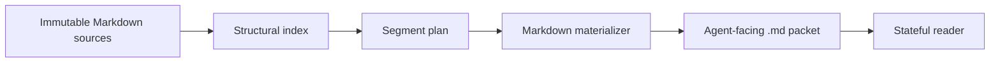

# Design stateful markdown synthesis

> if i wanted to design a skill and perhaps some associated tools for helping my agents review long and perhaps many different markdown documents systematically, in the interest of deep-dive synthesis, extracting concepts that develop over many turns of a chat thread, or reading several markdown documents converted from research paper latex/pdf source, for example, what would that look like? Simply pointing to or feeding many files together very quickly falls into the recency bias / middle amnesia /etc pitfalls and if i want detailed analysis i need the agent to systematically read in chunks, take notes and iterate through the material systematically to synthesize or extract information that isn't localized to one place in the data set. I realize that spawning sub-agents is what most people rely on here, but by virtue of my use case, i'm currently of the belief that swarms are not the best way to do this, because essentially that amounts to summarizing segments of the data set independently and shallowly, and in this case the goal depends entirely on keeping things in context over time. so even if one agent is summarizing from one segment to the next as it reads, its doing so with the full context and directives of my prompt and with understanding of the nuance here. By analogy, its kind of like when doing swendsen-wang potts simulations, where measuring observables requires respecting valid commutativity. Some things need to be accumulated, and then reduced and other things can be reduced within each cycle, depending on the measurement. And swendsen-wang, like the process im trying to describe, is stateful in a way that makes it difficult to parallelize

<details><summary>1 previous message</summary>

> I’m using the skill-creator guidance because you’re describing a reusable agent workflow, but I’ll treat this as architecture design rather than immediately scaffolding files. Your analogy points toward a single stateful reader with controlled reduction boundaries, not a map-reduce summarizer.

</details>

Yes—this should be designed as a stateful reading protocol, not as a document summarizer.

The key abstraction is:

> One agent performs an ordered sequence of evidence-grounded state transitions over a corpus.

The documents are not divided into independent jobs. Deterministic tools handle bookkeeping, chunking, persistence, retrieval, and auditing; the same agent performs all interpretive updates.

## The conceptual model

Your Swendsen–Wang analogy maps well. Different “observables” have different reduction rules:

| Information type                        | Valid treatment                                  |
| --------------------------------------- | ------------------------------------------------ |
| Counts, named entities, citations       | Commutative accumulation                         |
| Chronology, argument development        | Ordered accumulation                             |
| Definitions that change over time       | Stateful replacement with history                |
| Contradictions and conceptual tensions  | Deferred joins across observations               |
| Emergent themes and implied assumptions | Global interpretation, periodically reconsidered |
| Final synthesis                         | Only after coverage and counterevidence passes   |

A generic map-reduce workflow incorrectly treats all of these as independently reducible. Your skill should explicitly classify what can be accumulated mechanically and what must be interpreted by the continuing reader.

## Recommended architecture

I would call the skill something like `read-corpus-deeply`.

```text
~/.Codex/skills/read-corpus-deeply/
├── SKILL.md
├── agents/
│   └── openai.yaml
├── scripts/
│   ├── corpus.ps1
│   ├── build-context-pack.ps1
│   └── audit-corpus.ps1
└── references/
    ├── state-model.md
    ├── reading-protocol.md
    └── synthesis-protocol.md
```

The skill contains the procedure. It should not contain the state of any particular investigation.

Run-specific state belongs somewhere such as:

```text
<project>/.codex/corpus-runs/<run-id>/
├── manifest.json
├── study-contract.md
├── cursor.json
├── observations.jsonl
├── concepts.jsonl
├── claims.jsonl
├── unresolved.jsonl
├── checkpoints/
└── reports/
```

Your `jso-jackson` utilities are potentially a good foundation for the append-only JSONL portions.

## The state model

Avoid a single repeatedly rewritten `summary.md`. That eventually becomes a lossy telephone game.

Instead, maintain several distinct kinds of memory:

### 1. Study contract

Immutable or explicitly versioned:

- The user’s research question
- Scope and exclusions
- Desired granularity
- Definitions of important terms
- What counts as evidence
- Which observables are order-sensitive
- Required final outputs

This is loaded every cycle to prevent directive drift.

### 2. Corpus manifest

For each document:

- Stable document ID
- Path and content hash
- Document type
- Structural outline
- Reading order
- Chunk boundaries
- Conversion warnings
- Completion status

Chunk boundaries should respect headings, chat turns, equations, tables, and argument structure—not merely fixed token counts.

### 3. Append-only observation ledger

Each observation should contain something like:

```json
{
  "observation_id": "obs-00482",
  "source": {
    "document_id": "paper-03",
    "chunk_id": "paper-03.sec-4.chunk-2",
    "anchor": "§4.2 paragraphs 3–5"
  },
  "kind": "definition-change",
  "statement": "The authors broaden X from a local condition to a system-level property.",
  "evidence": ["...short source excerpt or precise anchor..."],
  "confidence": "high",
  "concept_ids": ["concept-x"],
  "created_during": "epoch-05"
}
```

This ledger is provenance, not synthesis. Entries are never silently rewritten.

### 4. Concept registry

This is the evolving interpretive state:

```text
concept-x
  Current formulation
  First appearance
  Development timeline
  Supporting observations
  Counterevidence
  Related concepts
  Unresolved ambiguity
  Status: candidate | established | contested | split | merged | superseded
```

Changes should be recorded as revisions:

> “Previous interpretation A is superseded by B because observations 481 and 482 reveal…”

That preserves intellectual development rather than replacing it invisibly.

### 5. Claims and evidence graph

Keep claims separate from concepts:

- Claim
- Supporting observations
- Contradicting observations
- Source diversity
- Confidence
- Whether it is descriptive, interpretive, or speculative
- Dependencies on other claims

This makes the final synthesis auditable and exposes conclusions supported only by the most recent document.

### 6. Unresolved and revisit queues

Record:

- Questions raised by the current material
- References to earlier passages that may need reinterpretation
- Predicted connections to look for
- Contradictions awaiting resolution
- Concepts that have not been revisited recently
- Negative evidence sought but not found

This is one of the most important defenses against recency bias.

## The reading cycle

Each chunk should be treated as an atomic transaction:

1. Load the study contract.
2. Load the current concept and claim state.
3. Load unresolved questions relevant to the next chunk.
4. Reactivate selected older concepts, including stale or weakly supported ones.
5. Read one structurally coherent chunk.
6. Extract new observations with precise anchors.
7. State how the chunk changes existing interpretations.
8. Add, revise, split, merge, or contest concepts.
9. Update claims and counterevidence.
10. Add revisit requests.
11. Validate and commit the state transition.
12. Advance the cursor only after the commit succeeds.

The crucial output of a reading cycle is therefore not “a summary of this chunk.” It is:

```text
new evidence
+ changes to persistent interpretation
+ unresolved consequences
+ provenance
```

That difference would be central to the skill instructions.

## Epoch reviews

After perhaps one document, one major section, or a configurable number of chunks, pause normal reading for an epoch review.

The agent should then:

- Reconstruct major concepts from the observation ledger
- Compare the current interpretation with earlier checkpoints
- Examine contradictions and abandoned hypotheses
- Reactivate least-recently-used concepts
- Check whether recent material has disproportionately shaped the state
- Schedule targeted rereads
- Write a new checkpoint without deleting prior checkpoints

This is analogous to separating within-cycle measurements from observables that are valid only at a larger synchronization boundary.

## The context-pack tool

The most valuable associated tool would probably be `build-context-pack`.

It would not choose the answer. It would deterministically assemble the material the agent needs for the next transition:

```text
Study contract
Current cursor and next source chunk
Canonical active concepts
Recent concept changes
Relevant unresolved questions
Selected older/stale concepts
Relevant prior evidence anchors
Current coverage warnings
Required response schema
```

Selection should combine:

- Direct concept relevance
- Explicit revisit links
- Contradictions
- Staleness
- Under-covered documents
- A small rotating sample of older state

That last component functions like spaced reactivation: it prevents concepts from disappearing simply because they have not appeared recently.

Semantic search can help locate material for rereading, but it should be an adjunct. It should not decide the traversal order or replace systematic coverage.

## Minimal tool interface

A first version does not need an MCP server or elaborate database. A PowerShell CLI backed by JSONL could expose:

```powershell
corpus init <paths> --question <file>
corpus status <run>
corpus next <run> --budget 6000
corpus commit <run> --delta <json-file>
corpus checkpoint <run>
corpus revisit <run> --concept concept-x
corpus audit <run>
corpus export <run> --format markdown
```

Responsibilities:

- `init`: inventory, hash, outline, and chunk the corpus
- `next`: construct the next context pack
- `commit`: validate IDs, anchors, schemas, and cursor movement
- `checkpoint`: materialize a recoverable state snapshot
- `revisit`: produce targeted earlier passages and interpretation history
- `audit`: detect unread material, unsupported claims, source imbalance, unresolved contradictions, and stale concepts
- `export`: generate the final evidence-backed synthesis

SQLite becomes useful later for larger corpora and graph queries, but JSONL is a good canonical record because it is inspectable, append-only, diffable, and compatible with your existing utilities.

## Important invariants for `SKILL.md`

I would make these non-negotiable:

- Never process multiple unseen chunks as though they were one unit.
- Never advance the reading cursor without recording a valid state delta.
- Never use an accumulated prose summary as the sole memory of earlier material.
- Preserve source anchors for every material observation.
- Preserve earlier interpretations when revising them.
- Distinguish evidence, interpretation, and speculation.
- Search for counterevidence before strengthening a global claim.
- Do not finalize while material remains unread or unaudited.
- Do not infer corpus coverage from successful semantic retrieval.
- Revisit earlier evidence when a later passage changes a concept’s meaning.
- For order-sensitive sources, preserve original order even if retrieval is available.
- Treat tool-generated counts and indexes as mechanical facts, not interpretive conclusions.

## Two useful operating modes

The same machinery could support:

**Developmental reading**

For chat histories, notebooks, correspondence, and evolving specifications. Emphasize chronology, revisions, terminology drift, decisions, and abandoned branches.

**Comparative corpus reading**

For research papers or related documents. Preserve each document’s internal argument first, then perform cross-document comparison. Otherwise the cross-paper ontology can flatten meaningful differences too early.

The adapters can differ, while the state transition protocol remains the same.

## What this does and does not solve

It does not give the model literally unlimited working memory. It creates an externalized, typed, auditable memory and repeatedly rehydrates the parts needed for continued reasoning.

The quality gain comes from four properties:

1. Ordered traversal
2. Persistent interpretive state
3. Explicit revision history
4. Scheduled re-grounding against primary evidence

That is much closer to maintaining a research notebook than producing hierarchical summaries—and I think it matches the stateful, non-freely-commutative process you are describing.

A sensible next step would be to build a small project-scoped prototype around one chat export or a three-paper corpus, using PowerShell plus JSONL, before deciding whether the state model warrants SQLite or a dedicated MCP-style tool.

> its important to keep in mind what jso-jackson was build for and based on. It's machinery behind the jso-jackson/claude-chat-export functionality with a bunch of IR stages and it starts from an actual jsonl chat transcript backend and transforms that into exchanges. The problem i'm trying to solve here, applied to markdown chat thread exports, inverts this and the tooling needs a way to segment markdown documents into exchanges for example, a different problem that isn't solved by jso-jackson or claude-chat-export. These tools do inform the target of segmenting the input dataset into a set of digestible and semantically meaningful chunks (prompt-reply chunks e.g. "exchanges"), but it doesn't solve the fundamental challenge here, and more over, only relates to handling the specific case of digesting chat thread content. The other main use case for my skill here is about a bunch of different academic papers rendered in markdown, in which chunking the document into canonical sections delimited by markdown headers can be useful. i'm trying to develop a format agnostic way to implement the chunking and assembly that can handle both cases naturally

<details><summary>1 previous message</summary>

> You’re right: `jso-jackson` is informative as a staged-IR precedent, not reusable ingestion machinery for this problem. I’m using the skill-creator guidance again to refine the reusable architecture, with the chunking problem treated as a format-adapter problem rather than as “JSONL tooling plus Markdown support.”

</details>

That distinction is important, and my earlier suggestion that `jso-jackson` could serve as a foundation was too broad. Its architecture is relevant; its ingestion machinery is not.

Here, Markdown is the source of record, and semantic structure may have to be reconstructed from conventions in the rendered document. The clean solution is a shared intermediate representation with format-specific adapters.

## Separate four transformations


1. **Block IR:** Lossless Markdown structure and source locations.
2. **Discourse IR:** Chat turns, exchanges, paper sections, equations, figures, etc.
3. **Reading segments:** Semantically coherent ranges independent of token budget.
4. **Context packets:** Budgeted assemblies presented to the agent.

“Chunk” should not refer to all four. Keeping those concepts separate prevents token-budget considerations from contaminating semantic parsing.

## 1. Block IR: lossless common substrate

Parse Markdown into a hierarchical block representation:

```json
{
  "node_id": "doc-02.block-184",
  "kind": "paragraph",
  "parent_id": "doc-02.section-4-2",
  "ordinal": 184,
  "source_span": {
    "start_line": 311,
    "end_line": 318
  },
  "heading_path": ["4 Results", "4.2 Finite-size scaling"],
  "content_ref": "sha256:...",
  "token_count": 137,
  "attributes": {}
}
```

The common block vocabulary might include:

- Document
- Heading
- Paragraph
- List
- Block quote
- Code block
- Equation
- Table
- Image or figure
- Horizontal rule
- Raw HTML
- Metadata block

This stage should be as lossless and interpretation-free as possible. Every later unit must resolve back to stable line ranges or byte offsets in the original Markdown.

## 2. Discourse IR: adapter-produced semantic structure

Format agnosticism should come from a common adapter contract, not from pretending that chats and papers have identical structure.

### Chat adapter

It converts Markdown conventions into:

```text
thread
└── exchange
    ├── user turn
    │   └── blocks
    ├── assistant turn
    │   └── blocks
    └── optional tool/system/event turns
```

The adapter may recognize:

- Speaker headings
- `User:` / `Assistant:` labels
- Export-specific separators
- Timestamps
- Turn identifiers
- Tool-call blocks
- Attachments
- Continuation messages
- Branch or parent information, if preserved

An exchange is then one possible semantic container—not the universal unit model.

### Academic-paper adapter

It produces something more like:

```text
paper
├── front matter
├── abstract
├── section
│   ├── subsection
│   ├── paragraphs
│   ├── theorem or proposition
│   ├── equation group
│   └── figure with caption
├── references
└── appendix
```

Markdown headings provide strong container boundaries, but a section is not necessarily a workable reading packet. A long section may require several segments, while a very short subsection may need to remain attached to its parent context.

### Generic Markdown adapter

A fallback adapter can preserve:

- Heading hierarchy
- Paragraph groupings
- Lists
- Code/equation blocks
- Structural separators

It should not invent chat roles or academic semantics without evidence.

## A common semantic-unit schema

Both specialized adapters can emit the same kind of record:

```json
{
  "unit_id": "chat-01.exchange-027",
  "document_id": "chat-01",
  "kind": "exchange",
  "semantic_role": "dialogue_exchange",
  "parent_id": "chat-01.thread",
  "children": ["chat-01.turn-053", "chat-01.turn-054"],
  "source_nodes": ["chat-01.block-201", "chat-01.block-219"],
  "boundary_before": "strong",
  "boundary_after": "strong",
  "cohesion": "high",
  "atomic": false,
  "token_count": 2840,
  "attributes": {
    "participants": ["user", "assistant"]
  }
}
```

For a paper:

```json
{
  "unit_id": "paper-04.section-3-2",
  "kind": "section",
  "semantic_role": "methods",
  "boundary_before": "strong",
  "boundary_after": "strong",
  "cohesion": "medium",
  "atomic": false
}
```

The segmenter mostly operates on boundary strength, cohesion, atomicity, and size. It does not need extensive special cases for `exchange` versus `section`.

## 3. Semantic segmentation

The segmenter should identify meaningful ranges before enforcing a context budget.

Useful boundary properties are:

- **Hard boundary:** Do not cross during ordinary linear reading, such as a document boundary.
- **Strong boundary:** Prefer to stop here, such as between exchanges or major sections.
- **Weak boundary:** Suitable fallback, such as between paragraphs.
- **Keep together:** Equation with explanation, figure with caption, prompt with its direct reply.
- **Keep with next:** Heading with the first substantive block beneath it.
- **Atomic:** Avoid splitting unless the unit itself exceeds the maximum.
- **Continuation:** The resulting segment requires inherited context.

A segment then references source units rather than duplicating them:

```json
{
  "segment_id": "paper-04.seg-019",
  "primary_units": [
    "paper-04.para-141",
    "paper-04.equation-018",
    "paper-04.para-142"
  ],
  "container": "paper-04.section-3-2",
  "continuation_of": "paper-04.seg-018",
  "semantic_context": {
    "heading_path": ["3 Method", "3.2 Cluster updates"]
  },
  "token_count": 2187
}
```

This permits the natural outcomes:

- One exchange becomes one segment.
- Several small exchanges become one segment.
- One large assistant reply is split into continuation segments.
- One paper section becomes several segments.
- Several small adjacent subsections remain together.
- An equation stays attached to the paragraphs that introduce and interpret it.

## 4. Packet assembly

A segment is corpus structure. A packet is a temporary agent input.

The assembler combines:

```text
study contract
+ persistent analytical state
+ inherited document context
+ one or more primary segments
+ selected earlier evidence
+ output/state-transition schema
```

Primary material must be distinguished from contextual material:

```json
{
  "packet_id": "run-07.packet-042",
  "primary_segments": ["paper-04.seg-019"],
  "bridge_context": [
    {
      "segment_id": "paper-04.seg-018",
      "purpose": "continuation_context",
      "count_as_new_evidence": false
    }
  ],
  "reactivated_evidence": [
    {
      "observation_id": "obs-00381",
      "purpose": "test_definition_change"
    }
  ]
}
```

That `count_as_new_evidence` distinction prevents overlap or bridge text from being analyzed twice.

## Segmentation algorithm

A practical algorithm would be:

1. Traverse semantic leaf units in canonical reading order.
2. Accumulate toward an ideal packet size.
3. Score nearby cut locations using boundary strength.
4. Penalize cuts that violate cohesion or keep-together relationships.
5. Select the best cut before the maximum budget.
6. If an atomic unit exceeds the maximum, invoke a unit-specific fallback splitter.
7. Attach inherited headings, speaker identity, and continuation information.
8. Record exactly which source units are primary versus contextual.

Conceptually:

```text
cut score
  = boundary strength
  + proximity to target size
  - cohesion violations
  - missing-context cost
  - excessive-fragmentation cost
```

A greedy algorithm with limited backtracking is probably sufficient initially. The model should not decide ordinary cut locations; it is better used only for genuinely ambiguous structural classification.

## Handling ambiguity in Markdown chat exports

Unlike the original JSONL transcript, a Markdown export may have discarded structural information. The adapter should therefore report confidence rather than silently asserting structure:

```json
{
  "classification": "assistant_turn",
  "confidence": 0.72,
  "basis": [
    "heading matched configured assistant label",
    "preceded by user-labelled section"
  ]
}
```

Chat parsing should support named dialect profiles:

```text
chat-generic
claude-markdown-export
codex-markdown-export
custom:<profile>
```

A profile defines recognizable headings, separators, metadata fields, and exchange-grouping rules. The common IR begins after this reconstruction.

## Two assembly modes

The tooling should explicitly distinguish:

### Linear reading packets

- Contiguous source material
- Canonical document order
- Used for initial ingestion
- Never driven primarily by semantic search

### Synthesis packets

- May combine noncontiguous evidence
- Organized around a concept, question, or contradiction
- Used only after systematic ingestion
- Every excerpt retains its original anchor and reading history

This prevents “format-agnostic assembly” from turning into arbitrary retrieval before the corpus has actually been read.

## Revised tool boundary

The architecture could expose:

```powershell
deepread parse <document> --adapter chat:<profile>
deepread parse <document> --adapter academic
deepread inspect-structure <document>
deepread segment <document> --policy balanced
deepread assemble-next <run> --budget <tokens>
deepread commit <run> --delta <file>
deepread assemble-revisit <run> --concept <id>
deepread audit <run>
```

Internally:

```text
Markdown parser
    ↓
adapter annotations
    ↓
common discourse IR
    ↓
policy-driven segmenter
    ↓
state-aware packet assembler
```

That is where the `jso-jackson` lineage is genuinely useful: staged lowering through inspectable IRs, stable identity, and explicit transformations. But this should be a new pipeline whose first problem is recovering and representing structure from Markdown—not an extension of the transcript JSONL transformation pipeline.

Before writing the skill itself, I would define and test three things:

1. The common discourse-unit schema.
2. The adapter contract.
3. The boundary/cohesion vocabulary consumed by the segmenter.

Once those are sound, chat exchanges and academic sections become two natural projections into the same processing model without forcing either one to masquerade as the other.

> i also don't think that JSONL is the right IR here for the reader to consume. the jso-jackson JSONL IR artifacts exist partially because the starting point is a monolithic chat JSONL iR and in part because of jso-jackson's and claude export's workflow are designed to leverage the structured input data and break it into the exchange envelopes, but what i don't want to do is feed raw jsonl chunks to the reader because that interleaves a bunch of container overhead not to mention json escape character noise, which is self-defeating and inefficient for reading. what I want is to capture segments of markdown (exchanges, section header + body) in discrete packets that can be read directly and literally wihtout a bunch of container noise and such. so even if there was jsonl intermediate machinery as part of the chunking process, the container overhead and json compaction escape bloat would need to be subtracted before it hits agent's context

<details><summary>1 previous message</summary>

> I’m applying the skill-creator guidance to this refinement as well. The important correction is to separate the machine’s segment index from the agent’s reading surface: the former may be structured data, but the latter should be materialized Markdown whose token count is measured only after all machinery has been removed.

</details>

Exactly. The machine representation and reader representation should be different artifacts.

The reader should never consume the segmentation IR. It should consume a materialized Markdown reading surface containing almost entirely original source text.

## Revised architecture



The structural index can be JSON, JSONL, SQLite, or an in-memory object. That is an implementation detail. It should usually store references to source spans—not escaped copies of the Markdown.

For example:

```json
{
  "segment_id": "paper-04.section-3-2.part-01",
  "source_path": "papers/paper-04.md",
  "start_byte": 18442,
  "end_byte": 26718,
  "start_line": 311,
  "end_line": 418,
  "kind": "section_part",
  "heading_path": ["3 Method", "3.2 Cluster updates"]
}
```

Notice that the content itself is absent. The source Markdown remains canonical.

## Materialize by slicing, not serializing

The packet materializer should:

1. Resolve the segment’s source spans.
2. Copy those spans directly from the original Markdown.
3. Preserve the Markdown byte-for-byte where possible.
4. Add only indispensable context.
5. Write a `.md` reading packet.
6. Calculate the token count from that final `.md` file.

There should be no JSON encoding and decoding of the content itself, and therefore no:

- Escaped quotes
- Literal `\n` sequences
- Repeated field names
- Object delimiters
- Content duplication
- JSON parser noise in the agent context

A segment descriptor answers where the content is. It does not contain the content.

## Separate control and reading surfaces

A reading cycle should have two conceptually different inputs:

```text
Control surface
├── study question
├── current analytical state
├── outstanding questions
└── required state-update protocol

Reading surface
└── literal Markdown source segment
```

The control surface can also be rendered as concise Markdown. There is little reason to show the agent raw state JSON unless it is debugging the machinery.

A packet directory might contain:

```text
packet-00042/
├── reading.md
├── context.md
└── packet.meta.json
```

- `reading.md`: Literal source material
- `context.md`: Concise agent-facing analytical state and instructions
- `packet.meta.json`: Machine-only provenance and bookkeeping

Only the first two are intentionally read by the agent.

## The ideal `reading.md`

For a contiguous academic section, it may simply be the original slice:

```markdown
## 3.2 Cluster updates

The transition probability can be written as ...

[remaining literal section content]
```

No wrapper is required because the heading already supplies semantic context.

For a chat exchange:

```markdown
## User

How does this interact with the previous definition?

## Assistant

The previous definition assumed ...
```

Again, if those labels exist in the source, preserve them directly.

If the chat export lacks adequate speaker labels, the adapter can add minimal synthetic framing, but generated text must be distinguishable from source text. For example:

```markdown
### User

[original source span]

### Assistant

[original source span]
```

The source spans themselves should remain unmodified.

## Contiguous and composite packets

Initial reading packets should generally be contiguous. This maximizes literalness and preserves discourse order.

A synthesis or revisit packet may need noncontiguous excerpts. In that case, a small amount of provenance framing is worthwhile:

```markdown
## paper-04.md — §3.2 Cluster updates

[literal source span]

---

## paper-07.md — §5.1 Critical behavior

[literal source span]
```

This is useful cognitive structure, not container noise. The cost is perhaps a short heading per excerpt instead of dozens of JSON keys and escaped strings.

The metadata sidecar records exact byte and line spans. The headings only orient the reader.

## Token budgeting must use the rendered view

The segmenter cannot use the token count of:

- Raw JSON records
- Unmaterialized source nodes
- The source span alone
- A hypothetical chunk before contextual headings are added

It must budget against the exact agent-facing combination:

```text
tokens(context.md)
+ tokens(reading.md)
+ tokens(fixed reading instructions)
+ reserved reasoning/output capacity
```

A reasonable tool sequence is:

```powershell
deepread plan-next <run>
deepread materialize <run> <segment-id>
deepread measure <packet-directory>
deepread show <packet-directory>
```

If materialization exceeds the budget, the segment plan is revised at a valid semantic boundary and rematerialized. Token measurement happens after rendering.

## Avoid duplicating source content in the index

I would strongly prefer an index like:

```text
documents
segments
segment_spans
relationships
reading_cursor
```

A segment can reference one or more source spans:

```text
segment-42
├── paper-04.md bytes 18442–22310
└── paper-04.md bytes 22310–26718
```

For an ordinary contiguous section this is one span. For an exchange reconstructed from unusual Markdown structure, it might be several spans.

This could live in SQLite, compact JSON, or another internal representation. SQLite becomes attractive because it avoids generating a large escaped textual duplicate of the corpus, but the central design property is span referencing rather than the storage technology.

## Literalness invariants

I would put these directly in the skill:

- Keep original Markdown files immutable.
- Store source references rather than escaped source bodies in machine metadata.
- Materialize primary reading text from original source spans.
- Never feed segment index records to the reader during ordinary operation.
- Never wrap Markdown source in JSON for agent consumption.
- Never place the entire Markdown packet inside a code fence.
- Mark generated context separately from literal source.
- Count tokens only after producing the final agent-facing packet.
- Treat repeated bridge material as context, not newly read evidence.
- Preserve exact provenance outside the reading surface.
- Provide a content-only display mode for normal reading.
- Expose internal metadata only when inspecting or debugging the pipeline.

## More precise terminology

It would help to reserve distinct names:

- **Source:** Immutable Markdown document
- **Structural index:** Machine description of document organization
- **Semantic unit:** Exchange, turn, section, subsection, equation group, etc.
- **Segment plan:** References to source spans selected as one reading unit
- **Reading packet:** Materialized Markdown shown to the agent
- **Context pack:** Persistent analytical state accompanying the reading packet
- **State delta:** The reader’s update after processing the packet

That prevents “IR,” “chunk,” and “packet” from collapsing into one overloaded concept.

The resulting principle is:

> Structured data controls what the agent reads; it is not itself what the agent reads.

That preserves the staged-IR benefits of the `jso-jackson` family while producing a fundamentally different terminal artifact: a clean, literal, semantically bounded Markdown reading surface.

> this design makes sense. but what about a simpler form in which a procedure is developed based on natively available tools that the agent can use to breakdown and explore the data set systematically, with minimal engineering of processing tools. i'm not sure what kinds of tools are available in a harness but it might be a good first start to see how far i can take it with instructions on how to perform the task with specific references for tools to use and how to use them. essentially im suggesting internalizing alot of this instead of externalizing and coddling the agent if not necessary

<details><summary>1 previous message</summary>

> I’m using the skill-creator guidance again, this time to design the smallest viable skill rather than a processing system. I agree with the direction: begin with an operating protocol over native search, range-reading, and file-editing tools, then externalize only the failure modes that actually recur.

</details>

Yes. A procedure-first skill is probably the right first implementation.

The agent should own the semantic work: identifying meaningful units, deciding what changes its interpretation, reopening earlier material, and synthesizing across the corpus. Native tools only provide reliable navigation and durable memory.

The minimum viable design needs no parser, packet generator, JSONL, database, or custom scripts.

## Procedure-only skill

```text
~/.Codex/skills/deep-read-corpus/
├── SKILL.md
├── agents/
│   └── openai.yaml
└── references/
    ├── native-reading-recipes.md
    └── research-notebook-format.md
```

The skill body defines the reading discipline. The references provide exact shell recipes and notebook conventions.

In this Codex environment, the useful native capabilities include:

- Shell execution through PowerShell
- `rg` for file discovery and structural/search indexing
- `Get-Content` for literal Markdown reading
- File editing through `apply_patch`
- Persistent project-local scratch files
- Git, hashes, and ordinary filesystem metadata when needed

That is already enough to conduct a systematic corpus study.

## Native exploration workflow

### 1. Inventory without reading everything

```powershell
rg --files 'D:\path\to\corpus' -g '*.md'
```

Record:

- Source path
- Document type
- Intended reading order
- Approximate size
- Status
- Any known relationship to other documents

Do not concatenate the sources.

### 2. Map document structure

For academic Markdown:

```powershell
rg -n '^#{1,6}\s+' -- 'D:\path\to\paper.md'
```

This gives the section hierarchy and line boundaries without loading the paper body.

For a chat export, first inspect a small initial range:

```powershell
Get-Content -LiteralPath 'D:\path\to\chat.md' |
    Select-Object -First 160
```

Then locate likely turn boundaries according to the observed export convention:

```powershell
rg -n '^(#{1,6}\s+)?(User|Assistant|Human|System)\b' -- 'D:\path\to\chat.md'
```

The agent—not a parser—decides whether the apparent boundaries really represent turns or exchanges.

### 3. Read semantic ranges directly

```powershell
$startLine = 241
$lineCount = 180

Get-Content -LiteralPath 'D:\path\to\paper.md' |
    Select-Object -Skip ($startLine - 1) -First $lineCount
```

The output is the Markdown itself. There is no container representation.

The skill should instruct the reader to:

- Prefer a complete exchange for chats.
- Prefer a complete section or subsection for papers.
- Combine very small adjacent units when closely related.
- Split an oversized unit at a subordinate semantic boundary.
- Record a continuation note when a unit must be divided.
- Reduce the requested range immediately if tool output is truncated.

Line counts are navigation aids, not fixed chunk sizes.

## Minimal durable notebook

Some external memory is still necessary because context compaction can occur and the corpus may exceed any single context window. But it can be plain Markdown maintained by the agent:

```text
<project>/.codex/deep-read/<study-name>/
├── contract.md
├── coverage.md
├── concepts.md
├── evidence.md
└── open-questions.md
```

### `contract.md`

Relatively stable:

- Research question
- Required output
- Scope and exclusions
- Important distinctions
- What constitutes evidence
- Reading order

### `coverage.md`

A simple table:

```markdown
| Source      | Unit            |   Lines | Status | Revisit |
| ----------- | --------------- | ------: | ------ | ------- |
| paper-01.md | Abstract        |   12–31 | read   | no      |
| paper-01.md | §1 Introduction |  32–144 | read   | yes     |
| paper-01.md | §2 Method       | 145–390 | active | no      |
```

This prevents selective retrieval from masquerading as comprehensive reading.

### `concepts.md`

One section per evolving concept:

```markdown
## C-007 — Collective-update interpretation

Current understanding:
...

Development:

- Initially formulated from E-018.
- Narrowed after E-041.
- Contested by E-063.

Supporting evidence:

- E-018
- E-041

Counterevidence:

- E-063

Open issue:
...
```

This is mutable interpretive state.

### `evidence.md`

Append-oriented observations:

```markdown
## E-041

- Source: `paper-03.md`
- Location: §4.2, lines 311–336
- Type: definition change
- Observation: The paper broadens ...
- Relevant concepts: C-007, C-012
- Confidence: high
```

The excerpt need not be copied unless its precise wording matters. The source remains available for rereading.

### `open-questions.md`

Track:

- Unresolved contradictions
- Passages to revisit
- Expected connections
- Alternative interpretations
- Negative evidence to seek
- Concepts not reconsidered recently

## Core reading loop

For every semantic unit, the skill should require the same cycle:

1. Check the study contract and current cursor.
2. Identify the active question for this unit.
3. Reactivate relevant earlier concepts and at least one unresolved issue.
4. Read the source range directly.
5. Record evidence with source anchors.
6. Ask what changed—not merely what the passage said.
7. Update concepts, including revisions and counterevidence.
8. Add newly created questions or revisit requests.
9. Mark the coverage entry complete.
10. Advance to the next unit.

The central prompt after each unit should be something like:

> What new evidence appeared, how does it change the developing model of the corpus, what earlier interpretation may now need revision, and what should be tested in later material?

That encourages accumulation without reducing every unit to an isolated summary.

## Periodic integration cycle

At document or major-section boundaries:

1. Review the coverage map.
2. Review concept development rather than only current formulations.
3. Reopen one or more earlier passages affected by later evidence.
4. Examine unresolved contradictions.
5. Check whether recent material is dominating the interpretation.
6. Record a short integration checkpoint.
7. Resume linear reading.

Keyword search is valuable during these revisits:

```powershell
rg -n -i -C 4 'cluster|collective update|nonlocal' -- 'D:\path\to\corpus'
```

But the skill should explicitly prohibit semantic search from replacing the initial systematic traversal. Search retrieves salient matches; it does not establish coverage.

## Instructions worth making explicit

The skill should say:

- Do not ingest the whole corpus in one call.
- Do not ask the shell to concatenate documents.
- Do not produce isolated per-chunk summaries as the primary state.
- Read in canonical order unless the study contract specifies otherwise.
- Use headings and discourse boundaries rather than arbitrary fixed windows.
- Treat tool-output truncation as an incomplete read.
- Preserve earlier interpretations when revising them.
- Distinguish source evidence from interpretation and speculation.
- Update coverage after every completed unit.
- Use searches primarily for structural mapping and targeted revisitation.
- Before final synthesis, inspect early, middle, and late evidence for every major concept.
- Do not claim completeness until the coverage file supports it.

## Progressive engineering

I would use this progression:

1. **Procedure-only:** Native shell operations plus Markdown notebook.
2. **Tiny helpers:** Add a range-reader or heading mapper only if command repetition causes mistakes.
3. **Structured indexing:** Add a segment index if manual cursor management becomes unreliable.
4. **Materialized packets:** Add an assembler only when output limits or corpus scale justify it.
5. **Database/tool service:** Only if searches, provenance, or repeated large studies demand it.

The engineering threshold should be empirical. If the procedure-only skill reliably handles the first several real corpora, much of the proposed machinery is unnecessary. If it fails, the notebook and tool traces will show exactly what needs to be externalized.

So the minimal principle becomes:

> Internalize interpretation and semantic segmentation; externalize only source navigation, coverage, provenance, and enough durable state to survive context limits.

> well, perhaps contradicting myself a bit, but i am also interested in efficiency and token economy. I dont want the agent being flooded by a bunch of unnecessary tool call and results if i can tighten the workflow with some minimally invasive affordances that make the process simpler and require less improvised reasoning while remaining robust. like a helper for building an index sidecar by enumerating markdown headers and calculating byte spans of the file for selectively reading the content from the beginning of a header to the end of the associated content body, and with the ability to specify depth so that in the chat export case, for the most common case where H1 structurally encodes user prompts and >=H2 headers occur in the reply bodies as part of the model's reply prose and are structurally irrelevant, than the helper could be configured at runtime (as a CLI kind of tool) to only index H1 under those conditions, but perhaps enumerate depth to exhaustion for the situation where the documents are markdown transfers of PDF or latex source research papers. an associated tool would be to simply query the markdown header skeleton of a document as a sort of previewing kind of functionality so given a mixture of document types, an agent can efficiently triage per document in its iterative process to decide how to treat a given document. so a combination of interactive primitive utilities and perhaps some very low level pre-processing to lubricate the skills procedures

<details><summary>1 previous message</summary>

> I’m using the skill-creator guidance to place these utilities at the right abstraction boundary. This sounds like the sweet spot: deterministic primitives for byte-accurate structure and slicing, while the skill retains control of document classification, traversal, and interpretation.

</details>

That is a strong middle ground: build a small Markdown-navigation substrate, not a corpus-processing framework.

The utilities should answer three mechanical questions cheaply:

1. What structure does this document appear to have?
2. Where are the exact byte spans of its structural units?
3. Give me one unit as literal Markdown.

Everything else remains the agent’s responsibility.

## Minimal CLI surface

A single tool with four subcommands would likely be enough:

```powershell
mdnav survey <paths>
mdnav index <file>
mdnav outline <file> [view options]
mdnav read <file> --heading <id> [extent options]
```

The names are illustrative.

### `survey`

Compact corpus-level triage:

```powershell
mdnav survey 'D:\corpus' --glob '*.md'
```

Example output:

```text
FILE                 BYTES    LINES   H1  H2  H3  H4+  POSSIBLE SHAPE
chat-01.md           842K     12840   94  317  22  0    H1-delineated
paper-clusters.md    126K      2144    1   14  39  7    hierarchical
notes.md              38K       711    8    0   0  0    flat sections
```

“Possible shape” should be a weak structural hint, not an authoritative classification. The agent decides how to treat each document.

This replaces many separate file enumeration, size, and heading-count calls.

### `index`

Build or refresh a sidecar:

```powershell
mdnav index 'D:\corpus\chat-01.md'
```

The sidecar contains metadata and byte offsets, but not escaped copies of source content.

The implementation can index all headings once. Runtime views decide which levels act as boundaries. This avoids rebuilding when the agent changes its interpretation of the document.

### `outline`

Show a compact, agent-readable skeleton:

```powershell
mdnav outline 'D:\corpus\chat-01.md' --max-level 1
```

```text
[H0001] H1  L1–138       8.4 KiB  How should the state model work?
[H0007] H1  L139–294     9.8 KiB  I disagree with the JSONL approach
[H0014] H1  L295–421     7.1 KiB  What about native tools?
```

Although the internal index may contain `H0002` through `H0006`, those lower-level headings are suppressed and treated as part of the H1 body.

For a paper:

```powershell
mdnav outline 'D:\corpus\paper.md' --max-level 6 --tree
```

```text
[H0001] H1  Title
  [H0002] H2  Abstract
  [H0003] H2  1 Introduction
  [H0004] H2  2 Model
    [H0005] H3  2.1 Hamiltonian
    [H0006] H3  2.2 Cluster construction
  [H0007] H2  3 Results
```

Useful optional columns:

- Line range
- Byte extent
- Direct-body size
- Subtree size
- Rough token estimate, if a suitable tokenizer is available

The default should stay compact.

### `read`

Return literal Markdown and nothing else:

```powershell
mdnav read 'D:\corpus\chat-01.md' `
    --heading H0007 `
    --max-level 1 `
    --extent unit
```

Standard output should be the original byte span beginning with that H1 and ending immediately before the next active H1.

No JSON wrapper, line-number prefixes, fences, or diagnostic prose should appear on standard output. Diagnostics can go to standard error.

For a paper:

```powershell
mdnav read 'D:\corpus\paper.md' `
    --heading H0006 `
    --max-level 6 `
    --extent unit
```

This returns the heading plus its direct content until the next indexed heading.

## Section extents

The tool should distinguish three useful extents:

- `body`: Content after the heading, excluding the heading itself.
- `unit`: Heading plus content until the next heading active in the selected view.
- `subtree`: Heading plus everything through its nested subsections, ending at the next heading of the same or higher rank.

For example:

```text
## 2 Model                    ← subtree starts here
introductory text             ← H2 direct body

### 2.1 Hamiltonian           ← separate H3 unit
...

### 2.2 Cluster construction  ← separate H3 unit
...

## 3 Results                  ← previous H2 subtree ends here
```

For an H1-only chat view, `unit` and `subtree` will usually be identical because H2–H6 are not active boundaries.

This distinction prevents ambiguity around “associated content body.”

## Sidecar contents

A compact sidecar might contain:

```json
{
  "schema_version": 1,
  "source": {
    "path": "D:/corpus/paper.md",
    "size_bytes": 128419,
    "content_hash": "sha256:...",
    "encoding": "utf-8",
    "newline": "crlf"
  },
  "headings": [
    {
      "id": "H0006",
      "level": 3,
      "title": "2.2 Cluster construction",
      "heading_start": 18442,
      "heading_end": 18472,
      "next_heading_start": 22681,
      "subtree_end": 26718,
      "start_line": 311,
      "parent": "H0004"
    }
  ]
}
```

The important properties are:

- Half-open byte ranges: `[start, end)`
- Stable heading IDs for the current source hash
- Parent relationships
- Heading and body boundaries
- File encoding and newline convention
- Source hash for stale-index detection
- No source body duplicated into JSON

`read` verifies the source hash before using offsets. If the file changed, it should refuse with a concise stale-index message or rebuild when explicitly requested.

## Markdown correctness

Even a low-level indexer needs a few guardrails:

- Recognize ATX headings: `#` through `######`.
- Optionally recognize Setext headings.
- Ignore heading-looking lines inside fenced code blocks.
- Respect backtick and tilde fence lengths.
- Preserve CRLF/LF and UTF-8 byte positions correctly.
- Handle a UTF-8 BOM.
- Do not interpret headings in front matter or raw blocks incorrectly.
- Preserve the selected source bytes rather than re-rendering a Markdown AST.

A small line-oriented scanner with fence awareness may be enough. Full Markdown rendering is unnecessary because the tool is locating and slicing, not transforming.

## Runtime projections rather than multiple indexes

I would index all valid headings once and let commands project different views:

```powershell
# Chat interpretation
mdnav outline chat.md --max-level 1

# Paper interpretation
mdnav outline paper.md --max-level 6

# Reconsider a document as H1/H2 structure
mdnav outline document.md --max-level 2
```

The active heading set determines unit boundaries. Lower-level headings remain literal content when excluded from the view.

This is both more flexible and cheaper than rebuilding separate H1-only and exhaustive indexes.

Named aliases could be added later:

```powershell
--view chat-h1
--view paper
```

But those should expand to transparent structural settings rather than embodying hidden semantic logic.

## Skill workflow using the primitives

The skill becomes much tighter:

1. Run `survey` once over the corpus.
2. Select a structural view for each document.
3. Run `outline` to preview its semantic skeleton.
4. Record the chosen view and reading order.
5. Use `read` to obtain one literal unit at a time.
6. Update the analytical notebook.
7. Advance using the existing outline rather than rediscovering boundaries.
8. Change the view if inspection shows that the initial classification was wrong.
9. Use `subtree` reads for targeted rereading or whole-section integration.

This removes repeated improvised commands for:

- Discovering headings
- Calculating section endings
- Counting lines
- Remembering range offsets
- Avoiding H2 boundaries in chat replies
- Detecting whether the source changed
- Reconstructing prior navigation decisions

It also reduces tool-result noise: one compact outline call and one content-only read call per semantic unit.

## Deliberate stopping point

I would initially exclude:

- Automatic document classification
- Semantic chunking by an LLM
- Embeddings
- Concept extraction
- Reading-cursor orchestration
- Notebook mutation
- Cross-document assembly
- JSON agent outputs
- Automatic synthesis packets

Those belong in the skill procedure until actual use demonstrates that another deterministic affordance is warranted.

The boundary is clean:

> `mdnav` understands Markdown structure and byte spans; the skill understands why, when, and in what order the material should be read.

> agreed on the stopping point boundaries, these are exactly the kind of things that defeat the purpose and over engineer what i'm trying to empower and lean on my reasoning agent to do with some minimalist support and framework to help it

Exactly. The division of responsibility is now clean:

- **Utility:** Deterministic Markdown structure, byte spans, outlines, and literal extraction.
- **Skill:** Reading discipline, coverage, state maintenance, and revisitation.
- **Reasoning agent:** Document classification, semantic boundaries, interpretation, and synthesis.

A useful admission test for any future feature is:

1. Is it deterministic?
2. Does it eliminate repeated mechanical work?
3. Does it reduce tool calls or context noise?
4. Does it preserve literal source material?
5. Does it avoid deciding what the material means?

If a feature fails the last test, it probably belongs in the reasoning procedure rather than the utility.

The appropriate next artifact would be a precise CLI contract plus two small fixtures—one H1-delimited chat export and one hierarchically headed research paper. That would let the byte-span and projection semantics be settled before implementing either the utility or the skill around it.

> Here's are single examples of each type of document, a structural markdown chat export `D:\aghado01\.discussion\claude-guidance-metacognition-metaphors.md` and a (albeit, rough) latex source paper markdown transfer `D:\aghado01\codex-scientiae\ingestion\_markdown\2607.06906v1-latex.md` , each of which are conceptually connected to this work

<details><summary>2 previous messages</summary>

> I’ll use these as the two concrete fixtures for the skill design. I’m applying the skill-creator workflow to inspect their real structures first; I’ll keep this read-only and focus on what the examples imply for the minimal index/outline/read contract.
>
> The fixtures already confirm the intended contrast: the chat is five large H1-delimited exchanges with unusually long prose lines, while the paper has a conventional H1/H2/H3 hierarchy. I’m checking the literal boundary behavior and Markdown edge cases now, especially whether headings inside equations/code-like regions could confuse a lightweight scanner.

</details>

These fixtures are sufficient to validate the minimalist design. I inspected them read-only; no files were changed.

## What the fixtures establish

The [chat export](./.discussion/claude-guidance-metacognition-metaphors.md:1) is:

- 21,025 bytes and 75 lines
- Five H1 headings
- No H2–H6 headings in this example
- One exchange per H1
- Each H1 contains the complete user prompt
- The unlabelled body following it is the assistant response
- Exchange sizes range from 3,509 to 4,718 bytes
- Lines are unusually long: up to 1,387 characters

An H1 projection therefore produces five excellent reading packets without further processing.

The [paper transfer](./codex-scientiae/ingestion/_markdown/2607.06906v1-latex.md:1) is:

- 59,208 bytes and 404 lines
- One H1, fifteen H2s, and twenty-two H3s
- No H4–H6 headings
- Hierarchically coherent despite rough LaTeX conversion
- Contains display equations, images, and malformed-looking converted tables that must remain literal
- Has lines as long as 2,291 characters

This confirms that byte size is more useful than line count for packet planning.

## A useful discovery: outline depth and reading depth differ

The paper should be indexed exhaustively, but it should not necessarily be read one deepest-level unit at a time.

At H2 projection, its major sections have approximate subtree sizes such as:

| Section              | Subtree bytes |
| -------------------- | ------------: |
| Abstract             |         2,306 |
| Introduction         |         6,067 |
| Related Work         |         4,246 |
| Token Economics      |         5,077 |
| Writer Agent Harness |        16,027 |
| Experimental Setup   |         3,558 |
| Results              |         7,685 |
| Discussion           |         4,483 |
| References           |         5,037 |

Most H2 sections are directly digestible. Only a few, such as “The Writer Agent Harness,” clearly benefit from descending to their H3 children.

This suggests an efficient interactive procedure:

1. Index all headings once.
2. Preview the H2 outline and subtree sizes.
3. Read manageable H2 subtrees directly.
4. Expand only oversized or especially important H2 sections into H3 units.
5. Never rebuild the index when changing granularity.

That is substantially more efficient than either fixed-depth chunking or blindly issuing one tool call per heading.

## Fixture-driven CLI refinements

These examples justify a few precise affordances.

### Compact titles by default

Because the chat’s H1 headings are entire prompts, some exceed a thousand characters. The outline must truncate displayed titles:

```text
[H0003] H1  4.50 KiB  but maybe an important element of what i'm getting at...
```

The stored title remains complete. An optional `--full-titles` can expose it when needed.

### Report direct and subtree sizes

Paper parent headings sometimes have almost no direct prose:

```text
## Token Economics at the Orchestration Layer

### The bill for one agentic task
```

Other H2 headings contain substantial introductory material before their first H3. Therefore an outline should show both:

```text
[H0005] H2  direct=47 B    subtree=4.96 KiB  Token Economics...
[H0020] H2  direct=1.27 KiB subtree=7.50 KiB Results
```

The agent can avoid pointless heading-only reads without skipping meaningful section preambles.

### Support scoped outline expansion

For token economy:

```powershell
mdnav outline paper.md --max-level 2
mdnav outline paper.md --under H0009 --max-level 3
```

The second command expands only “The Writer Agent Harness,” rather than repeating the paper’s complete skeleton.

### Preserve literal bytes

The paper’s equations, LaTeX residue, relative image references, and converted tables reinforce that `read` must slice the original file rather than parse and re-render it:

```powershell
mdnav read paper.md --heading H0009 --extent subtree
```

Output should begin with the original heading and preserve everything through the selected extent exactly.

## Revised minimal command set

The fixture-backed surface is now:

```powershell
# Corpus triage
mdnav survey <paths> --glob '*.md'

# Build or refresh a complete structural index
mdnav index <file>

# Preview a projected structure
mdnav outline <file> --max-level <1-6>
mdnav outline <file> --under <heading-id> --max-level <1-6>

# Read literal source
mdnav read <file> --heading <id> --extent unit
mdnav read <file> --heading <id> --extent body
mdnav read <file> --heading <id> --extent subtree
```

For these examples:

```powershell
# Five chat exchanges
mdnav outline `
  'D:\aghado01\.discussion\claude-guidance-metacognition-metaphors.md' `
  --max-level 1

# Paper overview
mdnav outline `
  'D:\aghado01\codex-scientiae\ingestion\_markdown\2607.06906v1-latex.md' `
  --max-level 2
```

## Conceptual fit

The fixtures are also unusually good thematic tests.

The chat itself develops:

- Guidance as a cognitive standard library rather than a `main()`
- The Leonard/Memento problem of state reconstruction
- Provenance as protection against corrupted rolling interpretation
- Context activation and avoiding conventional solution basins
- Principles and warnings as preferable to overly prescriptive rules

The paper argues that harness design determines token economics by controlling what enters context and how often.

Together they describe the intended system from both sides:

> Give the reasoning agent a small cognitive standard library and an economical context-navigation harness, while leaving the interpretive process under its control.

The next concrete design artifact should now be a short CLI behavioral specification built around these exact fixtures, including expected outline rows and byte-exact `read` results. That would make the implementation testable without expanding its scope.

> also, with respect to tooling, something i did in codex-scientiae's earlier iterations was develop some code for creating table of contents for markdown files based on header structure and i think some of this is conceptually relevant here if if i'm not trying to import the code alluded to in this report `D:\aghado01\codex-scientiae\issues\reboot\gemini-toc-generation-legacy-code.md`. you can read that document in order to contextualize and locate the source code it points to under `D:\aghado01\codex-scientiae\src\**` in order to weigh in on adapting this concept into the skill we are developing here

<details><summary>2 previous messages</summary>

> I’ll trace the report into the referenced legacy implementation, then evaluate which ideas belong in the minimalist `mdnav` substrate versus which should remain outside the skill. I’m using the skill-creator guidance because the question is now about selectively adapting existing project code into the skill design; I’ll keep the inspection read-only.
>
> The report points to two different legacies: the finalizer’s TOC rendering is mostly output-specific, while `md-repair.ps1` already contains a byte-indexed Markdown line scanner and fence-aware heading inventory very close to the primitive we need. I’m checking its tests and limitations before deciding whether it should be adapted, extracted, or merely used as a design reference.

</details>

The legacy code is highly relevant, but only one layer is a strong adaptation candidate.

The report accurately identifies three related implementations, but they solve different problems. For this skill, the useful lineage is the byte-indexed Markdown scanner in `md-repair.ps1`, not the TOC generator or semantic section-recovery pipeline.

## What is worth adapting

The strongest foundation is:

- [`Get-MdLineIndex`](./codex-scientiae/src/audits/md-repair.ps1:31): Builds an LF/CRLF-aware line index over raw UTF-8 bytes.
- [`Get-MdHeadings`](./codex-scientiae/src/audits/md-repair.ps1:117): Finds ATX headings while ignoring fenced code and returns line, byte offset, length, level, raw text, and normalized text.
- [`Set-MdSpan`](./codex-scientiae/src/audits/md-repair.ps1:142): Demonstrates exact byte-addressed access and stale-anchor protection.
- [Existing tests](./codex-scientiae/tests/md-repair.Tests.ps1:20): Verify offsets across multibyte and SMP Unicode and ignore headings inside code fences.

I executed `Get-MdHeadings` against both fixtures:

- Chat: five H1 headings
- Paper: one H1, fifteen H2s, twenty-two H3s
- All headings were correctly retained

So the existing scanner already proves the central premise on the two real documents.

The useful conceptual inheritance is:

> Decode lines for recognition, but use byte offsets for identity and literal retrieval.

That is exactly right for `mdnav`.

## What should not come with it

### TOC rendering

[`finalize.ps1`](./codex-scientiae/src/finalize.ps1:192) produces a navigable Markdown `## Contents` block from already structured chunk records. Its indentation logic is conceptually relevant, but most of the implementation is not:

- It starts from structured JSONL chunks.
- It converts recovered `section_level` values into Markdown heading levels.
- It generates GitHub anchor slugs.
- It writes into the target document.
- It handles bibliography routing and other publication concerns.

`mdnav` does not need anchors because it can address headings by stable local IDs and byte spans. It should never rewrite the source merely to make it navigable.

### TOC repair

[`Update-MdContents`](./codex-scientiae/src/audits/md-repair.ps1:201) is closer because it reparses Markdown, but it still exists to regenerate a rendered TOC and modify the document. Its useful part is its consumption of `Get-MdHeadings`; the rewriting behavior should stay behind.

### Proto-TOC semantic recovery

[`sections.ps1`](./codex-scientiae/src/codex-membrane/sections.ps1:1) should not be adapted. It:

- Infers hierarchy from section numbering
- Classifies Introduction, Methods, Results, and similar roles
- Detects running heads and figure labels
- Uses typography and source-IR metadata
- Attempts bibliography and zone recovery

That logic exists because the upstream source structure is uncertain. Our utility begins after Markdown heading structure already exists. Importing these heuristics would cross the stopping-point boundary and make the utility decide what the document means.

## Recommended extraction strategy

I would use the legacy scanner as a design reference and selectively extract its low-level mechanics into an independent general-purpose utility—probably under:

```text
D:\aghado01\utils\mdnav\
```

The skill would call that utility but remain responsible for the reading procedure.

I would not dot-source `codex-scientiae/src/audits/md-repair.ps1` directly because that would couple a general reading utility to:

- Corpus-repair classifications
- Mutation functions
- Publication conventions
- MCP exposure
- Repository-specific evolution

Instead, adapt approximately this conceptual core:

```text
Get-MdLineIndex
    ↓
Get-MdHeadingIndex
    ↓
Get-MdOutline
    ↓
Get-MdSectionSpan
    ↓
Read-MdSection
```

## What the new heading record needs

The existing heading record has the correct beginning:

```text
line
offset
length
level
text
raw
```

The navigation index should add:

```text
id
heading_end
parent_id
next_heading
subtree_end
```

It should omit:

```text
verdict
reason
fix
```

Those belong to document repair, not navigation.

The complete index can record all valid headings. Runtime projection determines which headings act as boundaries:

```powershell
mdnav outline chat.md --max-level 1
mdnav outline paper.md --max-level 2
mdnav outline paper.md --under H0009 --max-level 3
```

## Improvements needed over the legacy scanner

The existing code is a good nucleus, but it is not yet a general Markdown indexer.

Its fence handling currently toggles on lines beginning with triple backticks. A navigation version should additionally:

- Support tilde fences.
- Track the opening fence character and length.
- Require an appropriate matching closing fence.
- Handle files with and without trailing newlines.
- Make UTF-8 BOM behavior explicit.
- Optionally recognize Setext headings.
- Preserve optional closing ATX hashes correctly.
- Compute section and subtree ends.
- Verify source hashes before using a sidecar.
- Return content-only output from `read`.

The tests should retain the existing multibyte/SMP coverage and add:

- CRLF and LF fixtures
- UTF-8 BOM behavior
- Final line without newline
- Backtick and tilde fences
- Heading-like text inside fences
- Long H1 prompts
- H1-only projection over nested H2–H6 headings
- Direct-body versus subtree extents
- Byte-exact extraction of equations and Unicode
- Stale sidecar detection

## A particularly useful legacy principle

`Set-MdSpan` accepts an expected value so stale byte offsets fail rather than corrupting the file. `mdnav` is read-only, but the equivalent principle should remain:

```text
sidecar source hash
+ source byte length
+ indexed encoding
```

Before reading a span, the tool checks that the source still matches the indexed version. If not, it reports that the index is stale and asks for or performs a refresh according to an explicit option.

## Skill integration

The skill should not explain the scanner implementation. It should teach the agent the cognitive use of the primitives:

```text
SURVEY
  Inspect document sizes and heading distributions.

ORIENT
  Preview a projected outline and select a reading depth.

DIVE
  Read one literal unit or subtree.

SURFACE
  Update analytical state and provenance.

REORIENT
  Expand or collapse outline depth according to the discovered structure.

REVISIT
  Re-read an earlier byte-addressed section when later evidence changes its meaning.
```

That vocabulary is especially fitting because the chat fixture itself argues for a cognitive standard library rather than a prescribed `main()`.

One operational detail surfaced during inspection: the current shell blocked dot-sourcing the legacy PowerShell file until process-local execution-policy bypass was applied. A proper utility launcher using the designated portable PowerShell installation would avoid teaching agents to improvise around execution policy.

Overall recommendation:

> Extract the byte-indexing idea and its Unicode tests; do not import the TOC renderer, repair classifier, semantic section recovery, document mutation, or MCP wrapper.

That gives the new skill a mature, already-tested mechanical foundation without inheriting the architectural commitments of `codex-scientiae`’s ingestion and repair system.

> yea the idea wasn't to mutate the documents the way that code gets used in codex-scientiae legacy source, only that the machinery could be repurposed for perhaps writing transient artifacts to a temporary working directory as part of the skills infrastructure, informing the design and implementation. I was alluding to something like a TOC sidecar with byte spans earlier with this codex-scientiae source material on my mind

<details><summary>1 previous message</summary>

> Understood—the legacy relevance is the pattern “derive a navigational projection from immutable Markdown,” with the projection written into disposable skill working state. I’m using the skill-creator guidance to pin down that artifact boundary and lifecycle, not to carry over any document-repair behavior.

</details>

Yes—that makes the intended lineage much clearer. The legacy TOC code is precedent for deriving a navigational projection, while the new system writes that projection into disposable working state rather than back into the source document.

A run could use:

```text
~/.Codex/tmp/deep-read/<run-id>/
├── sources.json
├── indexes/
│   ├── <source-hash>.json
│   └── ...
├── outlines/
│   ├── <source-hash>.h1.md
│   ├── <source-hash>.h2.md
│   └── ...
└── packets/
    └── current.md
```

Or, when persistence and project visibility are desirable:

```text
<project>/.codex/deep-read/<run-id>/
```

The roles are distinct:

- `index.json`: Machine-only complete heading index and byte spans.
- `outline.md`: Transient agent-readable TOC projection at a selected depth.
- `current.md`: Optional literal source slice currently being examined.
- Original source: Immutable and always authoritative.

An index entry would hold enough information to derive different TOCs without rescanning:

```json
{
  "id": "H0009",
  "level": 2,
  "title": "The Writer Agent Harness",
  "line": 98,
  "heading_start": 17800,
  "heading_end": 17829,
  "next_heading_start": 17829,
  "subtree_end": 33827,
  "parent": "H0001"
}
```

The agent would not read this JSON. It would request a projection:

```powershell
mdnav outline paper.md --max-level 2
```

The utility could materialize or return:

```markdown
# Outline: 2607.06906v1-latex.md

- [H0002] Abstract — 2.25 KiB
- [H0003] Introduction — 5.92 KiB
- [H0004] Related Work — 4.15 KiB
- [H0005] Token Economics at the Orchestration Layer — 4.96 KiB
- [H0009] The Writer Agent Harness — 15.65 KiB
- [H0014] Experimental Setup — 3.47 KiB
```

Then:

```powershell
mdnav read paper.md --heading H0009 --extent subtree
```

would either emit the literal span directly or write it to `packets/current.md`.

The important properties are:

- Sidecars are derived and disposable.
- They contain no duplicated document body.
- Multiple outline depths can be projected from one complete index.
- Reading always slices the original Markdown.
- Source hashes invalidate stale indexes.
- The skill controls artifact creation and cleanup.
- Durable analytical notes are separate from transient navigation artifacts.

This is essentially a non-mutating, byte-addressed TOC cache. It borrows the most valuable idea from the legacy code—externalized structural navigation—while reversing its direction:

```text
Legacy:
structured ingestion state → TOC inserted into deliverable

New:
immutable Markdown → transient TOC/index beside the reading process
```

That is a natural and appropriately minimal piece of skill infrastructure.

> well importantly i do want to support multi-document review and synthesis, potentially involving heterogenous sets of documents that could include both papers and related chat threads, which informs the shape and routines around generating IR artifacts that naturally handle multiple documents. it makes sense to treat documents on an individual basis with artifact filename conventions, tools and skill design coordinated accordingly and in a principled fashion that doesn't know in advance what is included in a request. there's an implied atomic structure here, and also the reality that a given review over many documents will involve discovery of the document set, which is an aspect that can be partially handled by supporting automation to reduce cognitive load and token waste on the part of the agent. i like the idea of projecting from one complete index but its important i think to not forget that a bunch of hierarchical markdown header structure inside of the reply prose bodies in a chat thread are categorically different than in a research paper markdown. maybe this can be handled in the projection layer and logistics, but i want to make sure that the skill handles this nuance appropriately and effectively

<details><summary>1 previous message</summary>

> I’m treating this as a two-level design now: a corpus run that discovers and coordinates documents, and a per-document view that assigns semantic meaning to the otherwise syntax-only heading index. The chat/paper distinction needs to be persisted as part of each document’s view—not inferred anew on every read and not reduced to one corpus-wide depth setting.

</details>

The complete heading index should be format-neutral, but every document needs its own persistent reading view. A corpus-wide `--max-level` would be wrong.

The correct atomic structure is:

```text
Review run
└── Document
    ├── Immutable source
    ├── Complete syntactic heading index
    ├── Agent-selected semantic view
    └── Reading units projected through that view
```

## Corpus-run artifacts

A heterogeneous review could use:

```text
<working-dir>/<run-id>/
├── corpus.json
├── survey.md
├── documents/
│   ├── D001--claude-guidance--b4000a41/
│   │   ├── source.json
│   │   ├── headings.json
│   │   ├── view.json
│   │   └── outline.md
│   └── D002--harness-effect--057fcd58/
│       ├── source.json
│       ├── headings.json
│       ├── view.json
│       └── outline.md
└── notes/
    ├── coverage.md
    ├── evidence.md
    ├── concepts.md
    └── open-questions.md
```

Document IDs are run-local and concise. The short hash prevents basename collisions and identifies the indexed source version.

`corpus.json` records:

- Included documents
- Resolved paths
- Content hashes
- Document IDs
- Index status
- Selected view
- Review status

The analysis notebook can then use compact anchors such as:

```text
D001:H0003
D002:H0012
```

with the underlying byte spans resolved mechanically.

## Discovery without semantic overreach

A single command should discover and index candidate Markdown files within user-provided scope:

```powershell
mdnav corpus init `
    --run-dir '<working-dir>' `
    --path 'paper-a.md' `
    --path 'chat-a.md' `
    --path 'related-documents'
```

This automation may:

- Resolve explicit files and scoped directories
- Apply inclusion and exclusion globs
- Assign document IDs
- Hash sources
- Index headings
- Record sizes and heading distributions
- Produce a compact survey

It should not decide conceptual relevance or silently expand beyond the provided scope.

Example `survey.md`:

```markdown
| ID   | Document                                   |  Bytes |  H1 |  H2 |  H3 | H4+ |
| ---- | ------------------------------------------ | -----: | --: | --: | --: | --: |
| D001 | claude-guidance-metacognition-metaphors.md | 21,025 |   5 |   0 |   0 |   0 |
| D002 | 2607.06906v1-latex.md                      | 59,208 |   1 |  15 |  22 |   0 |
```

This gives the agent one compact corpus-level orientation call instead of repeated filesystem and heading searches.

## Syntactic index versus semantic view

The complete `headings.json` means only:

> These lines are syntactically Markdown headings.

It does not mean every heading is a navigable corpus unit.

That semantic distinction belongs in `view.json`.

### Chat-delimiter view

For a chat where H1 marks user prompts:

```json
{
  "mode": "delimiter",
  "boundary_levels": [1],
  "nested_heading_policy": "embedded",
  "default_extent": "unit"
}
```

Meaning:

- Every H1 begins an exchange.
- The exchange ends at the next H1 or EOF.
- H2–H6 remain literal content inside the reply.
- Nested headings are rhetorical organization within the response.
- The skill should not descend into them as independent review units by default.

This is stronger than merely specifying `--max-level 1`. It preserves the categorical interpretation of lower-level headings.

The agent may still request an embedded-heading outline for orientation inside an unusually large exchange, but doing so does not redefine those headings as corpus-level units.

### Paper-hierarchy view

For a research paper:

```json
{
  "mode": "hierarchy",
  "navigable_levels": [1, 2, 3, 4, 5, 6],
  "default_read_level": 2,
  "nested_heading_policy": "navigable",
  "descent_policy": "adaptive"
}
```

Meaning:

- Heading relationships represent the paper’s document hierarchy.
- H2 sections are the default reading scale.
- H3 subsections can be expanded when an H2 subtree is too large or analytically important.
- Parent preambles and child subsections remain distinguishable.
- Descending into deeper headings is a normal navigation operation.

### Generic delimiter view

Some documents may use H2 or another selected level as flat record separators:

```json
{
  "mode": "delimiter",
  "boundary_levels": [2],
  "nested_heading_policy": "embedded"
}
```

This keeps the tool format-agnostic without forcing everything into either “chat” or “paper.”

## Agent-selected, then persisted

The skill should follow this triage routine per document:

1. Read the corpus survey.
2. Preview a compact top-level outline.
3. Inspect one representative unit if the structure remains ambiguous.
4. Select a semantic view.
5. Persist the view.
6. Reuse it for subsequent outline and read operations.

The utility supports the decision; the agent makes it. Once selected, the agent does not repeatedly spend context and reasoning reconstructing the same structural interpretation.

Example:

```powershell
mdnav view set --run <run> --doc D001 `
    --mode delimiter --boundary-level 1 --nested embedded

mdnav view set --run <run> --doc D002 `
    --mode hierarchy --default-level 2 --nested navigable
```

## View-aware operations

Commands then operate through each document’s configured view:

```powershell
mdnav outline --run <run> --doc D001
mdnav read    --run <run> --doc D001 --unit H0003

mdnav outline --run <run> --doc D002
mdnav outline --run <run> --doc D002 --under H0009 --depth 1
mdnav read    --run <run> --doc D002 --unit H0012
```

For `D001`, `H0003` resolves to an entire H1-delimited exchange, including all lower headings in the response.

For `D002`, `H0012` resolves according to the paper hierarchy and may be read as direct content or as a subtree.

## Multi-document reading discipline

The skill should preserve two kinds of state:

### Document-local state

- Coverage within that document
- Its argument or conversational trajectory
- Local terminology
- Internal contradictions
- Interpretation of its structure

### Corpus-global state

- Concepts crossing documents
- Agreements and tensions
- Developments from chats into papers or vice versa
- Evidence provenance
- Open comparisons
- Emerging synthesis

This prevents cross-document synthesis from prematurely flattening each document’s internal logic.

A reasonable cycle is:

```text
orient corpus
→ choose next document
→ enter its configured view
→ read one local unit
→ update document-local understanding
→ update corpus-global concepts
→ return to corpus coverage map
```

The same agent carries both layers.

## Minimal tool boundary

The mechanical utility may handle:

- Candidate discovery within explicit scope
- Per-document hashing
- Complete heading indexing
- Compact survey generation
- View persistence
- Projected outlines
- Literal byte-span reading
- Stale-index detection

The reasoning agent continues to handle:

- Inclusion relevance
- Document-type interpretation
- View selection
- Reading order
- Whether to descend
- Cross-document relationships
- Evidence evaluation
- Synthesis

The key design principle is:

> Index headings syntactically once; interpret their navigational meaning separately and locally for each document.

That naturally supports mixed corpora without either treating chat reply headings as paper sections or suppressing meaningful research-paper hierarchy.

> i dont think there should be much corpus wide parameters. --max-depth on enumerating header structure is one knob where the distinctions between research paper source materials and chat threads becomes explicit, because of the aforementioned nuance with hierarchical markdown embedded in model reply prose blocks of exchanges is different than the global structure of a research paper's headers, even if the markdown header structure in both cases can be informative and useful here

<details><summary>2 previous messages</summary>

> Agreed—my proposed corpus-level `view` configuration introduced more orchestration than the utility needs. I’m using the skill-creator guidance to simplify the boundary again: discovery may enumerate documents, but structural parameters should be applied independently to each document by the skill.
>
> <details><summary>Ran a command</summary>
>
> - Ran `Get-Content -Raw -LiteralPath 'C:\Users\azrie\.codex\skills\.system\skill-creator\SKILL.md' | Out-Null; Write-Output 'skill-creator instructions loaded'`
>
> </details>

</details>

Yes. The corpus should be a collection of independently addressable documents, not a configured processing object with shared behavioral parameters.

My earlier `corpus init` plus persistent view machinery was too orchestration-heavy.

## Simpler division

### Corpus-level functionality

Only mechanical discovery and inventory:

```powershell
mdnav discover <paths> --glob '*.md' --output <working-dir>
```

It may:

- Enumerate Markdown files within explicit scope
- Assign short document IDs
- Record paths, hashes, and sizes
- Build an independent complete heading index for each document
- Produce a compact document inventory

It should not choose:

- A shared maximum depth
- A document mode
- A reading order
- A segmentation policy
- A common projection

### Document-level functionality

Every structural operation names one document and supplies its own projection:

```powershell
mdnav outline chat.md  --max-depth 1
mdnav outline paper.md --max-depth 6
```

`--max-depth` has straightforward mechanical semantics:

- `1`: H1 headings are active structural boundaries.
- `2`: H1 and H2 are active.
- `3`: H1 through H3 are active.
- `6`: Exhaustive ATX heading structure.

Headings deeper than the selected depth remain literal source content. They do not disappear from the complete index or the source; they simply do not delimit units in that projection.

## Why this captures the chat/paper distinction

For the chat export:

```powershell
mdnav outline `
  'claude-guidance-metacognition-metaphors.md' `
  --max-depth 1
```

Each H1 begins a prompt/reply exchange and ends at the next H1. Any H2–H6 headings written inside the assistant response remain part of that exchange’s prose.

For the paper:

```powershell
mdnav outline `
  '2607.06906v1-latex.md' `
  --max-depth 6
```

The complete paper hierarchy becomes visible because those lower-level headings have document-global structural significance.

The tool does not need to know that one document is a chat and another is a paper. The reasoning agent understands that distinction and expresses it through the depth parameter.

## Query-time projection

Each document gets one complete syntactic index:

```text
D001/
├── source.json
└── headings.index.json

D002/
├── source.json
└── headings.index.json
```

Different projections are calculated from that index:

```powershell
mdnav outline D001 --max-depth 1
mdnav outline D002 --max-depth 2
mdnav outline D002 --max-depth 3
```

They may optionally be cached as transient artifacts:

```text
D001/outline.depth-1.md
D002/outline.depth-2.md
D002/outline.depth-3.md
```

But they are derived views, not persistent semantic declarations.

## Span behavior follows the selected depth

The same parameter must be applied when reading:

```powershell
mdnav read chat.md `
    --heading H0003 `
    --max-depth 1 `
    --extent unit
```

This returns H0003 through the byte preceding the next H1. H2–H6 headings inside that range remain included.

For the paper:

```powershell
mdnav read paper.md `
    --heading H0012 `
    --max-depth 3 `
    --extent unit
```

This ends at the next H1, H2, or H3 because all three levels are active in that projection.

This keeps outline and read semantics consistent.

## Local expansion remains possible

Lower-level chat headings may still be informative without being exchange boundaries. The agent could inspect them locally:

```powershell
mdnav outline chat.md `
    --within H0003 `
    --max-depth 6
```

That answers:

> How did this particular response organize its prose?

It does not alter the primary H1 exchange structure or imply that those reply headings are peers of the user prompts.

Likewise, the agent might begin a paper at depth two and selectively expand one section:

```powershell
mdnav outline paper.md --max-depth 2
mdnav outline paper.md --within H0009 --max-depth 3
```

## Skill responsibility

The skill keeps a lightweight document inventory such as:

```markdown
| ID   | Source               | Primary depth | Rationale                           |
| ---- | -------------------- | ------------: | ----------------------------------- |
| D001 | claude-guidance...md |             1 | H1 delimits exchanges               |
| D002 | 2607.06906...md      |   2 initially | Paper sections; descend selectively |
```

This records the agent’s current navigation decision without turning it into tool-level corpus configuration. The agent can revise it at any time.

The resulting principle is:

> Discovery is corpus-wide; structure, projection, and reading are document-local.

That preserves heterogeneous multi-document review while keeping the utility primitive, composable, and reasoning-agent-directed.

> ok so reviewing over this session the converging design lets review the emerging spec for the skill design and associated navigational tools, codify the skills procedural design given the primitives we've been designing and guiding principles that we've discussed, remembering that ultimately the requests from the user can be open-ended and we are exposing a framework for performing open-ended investigative/research/synthesis analysis over a requested set of files which might be defined as a specific list of files, a directory containing documents of interest

<details><summary>2 previous messages</summary>

> I’m using the skill-creator guidance to consolidate the session into an implementable specification rather than adding more architecture. I’ll codify the procedural “cognitive standard library,” the minimal `mdnav` contract, the multi-document discovery path, and the invariants that protect deep synthesis without imposing a fixed analysis shape.
>
> <details><summary>Ran a command</summary>
>
> - Ran `Get-Content -Raw -LiteralPath 'C:\Users\azrie\.codex\skills\.system\skill-creator\SKILL.md' | Out-Null; Write-Output 'skill-creator instructions loaded'`
>
> </details>

</details>

## Converged design specification v0.1

Provisional names:

- Skill: `investigate-markdown-corpus`
- Navigation utility: `mdnav`

The system empowers one reasoning agent to conduct open-ended investigation, research, interpretation, and synthesis across one or many Markdown documents without loading the corpus wholesale or reducing it to independent summaries.

The tools expose structure and literal source spans. The skill supplies a stateful investigative discipline. The agent retains semantic control.

## 1. Scope

Supported requests include:

- A single long Markdown document
- An explicit list of Markdown files
- A mixture of files and directories
- A directory containing documents of interest
- Chat-thread exports
- Academic papers transferred from LaTeX or PDF sources
- Heterogeneous collections combining those forms
- Open-ended questions whose relevant concepts and relationships are not known in advance

The framework must not assume a fixed output such as “summarize every document.” The user’s investigative question determines what is measured, tracked, compared, and ultimately synthesized.

## 2. Governing principles

### Attention is the investigative instrument

Expose source material at a deliberate semantic grain. Do not flood the reader with the entire corpus or with machine-oriented container formats.

### Structure informs navigation without determining meaning

Markdown headings provide deterministic access points. The reasoning agent decides what those headings mean in each document.

### Documents remain independent structural atoms

Discovery is corpus-wide. Structural projection and reading depth are document-local.

### The source remains authoritative

Never mutate source documents. Derived indexes, outlines, and reading packets are disposable projections.

### Preserve provenance across interpretation

Durable claims and concept revisions must remain traceable to document and section anchors.

### Accumulate according to the observable

Treat different analytical products differently:

- Mechanical facts may be accumulated commutatively.
- Chronology and conceptual development require ordered accumulation.
- Contradictions and relationships may require deferred comparison.
- Emergent interpretations require periodic global reconsideration.
- Final synthesis follows coverage and counterevidence review.

### Guidance is a cognitive standard library

Offer reusable investigative operations rather than a rigid `main()` procedure. Let the agent select and combine them according to the question and material.

## 3. Explicit non-goals

The utility must not perform:

- Automatic document classification
- Semantic chunking by a model
- Summarization
- Concept extraction
- Relevance ranking
- Embedding generation
- Reading-order selection
- Notebook mutation
- Cross-document synthesis
- Automatic document repair
- Source rewriting
- TOC insertion
- Reading-cursor orchestration
- Agent delegation
- MCP wrapping unless later justified

These remain reasoning responsibilities or future additions supported by observed need.

## 4. Atomic model

```text
Review
├── Requested source scope
├── Discovered document inventory
├── Document D001
│   ├── Immutable Markdown source
│   ├── Complete heading index
│   ├── Zero or more projected outlines
│   └── Literal reading units
├── Document D002
│   └── ...
└── Investigative state
    ├── Coverage
    ├── Evidence
    ├── Developing concepts
    ├── Questions and contradictions
    └── Integration checkpoints
```

Document-local anchors are namespaced:

```text
D001:H0003
D002:H0012
```

The sidecar resolves those identifiers to exact source byte spans.

## 5. Working artifacts

Navigation artifacts are transient:

```text
~/.Codex/tmp/investigate-markdown/<run-id>/
├── inventory.md
├── documents/
│   ├── D001--claude-guidance--b4000a41/
│   │   ├── source.json
│   │   ├── headings.index.json
│   │   └── outline.depth-1.md
│   └── D002--harness-effect--057fcd58/
│       ├── source.json
│       ├── headings.index.json
│       ├── outline.depth-2.md
│       └── outline.depth-3.md
└── packets/
    └── current.md
```

If a review must survive sessions, its analytical state may live in:

```text
<project>/.codex/reviews/<run-id>/
```

Navigation indexes remain reproducible and disposable. Analytical notes may be durable.

The skill should avoid creating a large file hierarchy unnecessarily. A small investigation may need only:

```text
review-state.md
```

A large investigation may separate evidence and concept history when the combined notebook becomes inefficient.

## 6. `mdnav` utility contract

### Discover

```powershell
mdnav discover <file-or-directory>... `
    --glob '*.md' `
    --recursive `
    --work-dir <path>
```

Responsibilities:

- Respect only user-provided scope.
- Resolve explicit files and directory members.
- Deduplicate resolved paths.
- Assign concise run-local document IDs.
- Record source path, byte length, hash, and heading counts.
- Build one complete heading index per document.
- Produce a compact inventory.
- Avoid emitting document bodies.

It does not decide which discovered documents are conceptually relevant. The agent reviews the inventory and user request.

### Index

```powershell
mdnav index <file> --work-dir <path>
```

Responsibilities:

- Read source bytes without modifying them.
- Recognize valid Markdown headings outside code fences.
- Record byte and line locations.
- Compute parent relationships and structural extents.
- Record source hash, size, encoding, and newline form.
- Reuse a valid sidecar when possible.
- Reject or refresh stale sidecars explicitly.

The sidecar contains no duplicated source body.

### Outline

```powershell
mdnav outline <file-or-document-id> `
    --max-depth <1-6> `
    [--within <heading-id>] `
    [--out <path>]
```

`--max-depth` is document-local and query-local:

- `1`: H1 headings are active.
- `2`: H1–H2 are active.
- `6`: H1–H6 are active.

Headings below the selected depth remain literal content inside the enclosing unit.

Default output is concise Markdown or plain text:

```text
[H0005] H2  direct=47 B      subtree=4.96 KiB  Token Economics...
[H0009] H2  direct=29 B      subtree=15.65 KiB The Writer Agent Harness
[H0014] H2  direct=23 B      subtree=3.47 KiB  Experimental Setup
```

Defaults:

- Truncate exceptionally long heading titles.
- Show full titles only when requested.
- Report direct and subtree sizes.
- Avoid raw JSON output unless explicitly requested for debugging.

`--within` permits local exploration. For example, the agent may preserve H1 exchanges globally while examining H2 headings within one unusually structured response.

### Read

```powershell
mdnav read <file-or-document-id> `
    --heading <id> `
    --max-depth <1-6> `
    --extent <body|unit|subtree> `
    [--out <path>]
```

Extents:

- `body`: Begin after the heading line.
- `unit`: Begin at the heading and end at the next heading active under the chosen maximum depth.
- `subtree`: Begin at the heading and end at the next active heading of the same or higher rank.

Standard output must contain only literal Markdown source bytes. Put diagnostics on standard error.

If `--out` is supplied, write the exact materialized reading packet there.

### Documents without usable headings

To preserve systematic coverage:

- Represent content before the first active heading as `PREAMBLE` when nonempty.
- Represent a headingless document as a single `BODY` unit.
- Include trailing content in the last active unit.
- Never silently omit bytes because a document lacks the expected structure.

## 7. Heading-index behavior

The initial implementation should adapt the legacy byte-indexing principles:

- Scan raw bytes.
- Decode lines only for structural recognition.
- Address content using half-open byte spans: `[start, end)`.
- Handle LF and CRLF.
- Preserve UTF-8 and multibyte Unicode.
- Recognize backtick and tilde fences.
- Track the opening fence character and length.
- Ignore heading-like text inside fences.
- Preserve raw heading text.
- Treat source hashes as stale-index guards.

ATX headings H1–H6 are the required initial syntax. Setext support can follow if encountered in real corpora; the initial tool should at least detect and report probable unsupported Setext headings rather than silently giving a misleading outline.

## 8. Per-document depth semantics

The skill selects depth independently for every document.

For an H1-delimited chat:

```powershell
mdnav outline chat.md --max-depth 1
mdnav read chat.md --heading H0003 --max-depth 1 --extent unit
```

H2–H6 headings inside the model response remain part of the exchange prose.

For a paper:

```powershell
mdnav outline paper.md --max-depth 2
mdnav outline paper.md --within H0009 --max-depth 3
```

The agent can begin at major sections and descend selectively.

The skill may record:

```markdown
| ID   | Source         | Working depth | Structural interpretation                 |
| ---- | -------------- | ------------: | ----------------------------------------- |
| D001 | chat-export.md |             1 | H1 delimits exchanges                     |
| D002 | paper.md       |             2 | Major paper sections; descend selectively |
```

This is investigative state, not corpus-wide utility configuration.

## 9. Procedural cognitive standard library

### ORIENT

Establish:

- The user’s question
- Requested output
- Source scope
- Desired depth
- Whether development order matters
- What kinds of evidence or relationships may matter

Discover the document set, inspect the compact inventory, and preview document outlines without ingesting bodies unnecessarily.

### FRAME

Translate the request into an evolving measurement plan:

- Which observations are local to a passage?
- Which must preserve temporal or argumentative order?
- Which require comparison across documents?
- Which hypotheses should remain provisional?
- What counterevidence would weaken the emerging interpretation?

Avoid forcing an ontology before encountering the material.

### PLAN

Choose:

- Initial document order
- Working depth per document
- Whether to read a whole subtree or descend
- Minimal analytical state needed to preserve continuity

Treat the plan as revisable.

### DIVE

Read one semantically coherent unit as literal Markdown.

Before reading, reactivate:

- The active research question
- Relevant developing concepts
- Applicable unresolved questions
- Any earlier interpretation that this unit may test

Use attention on the source rather than on metadata containers.

### SURFACE

After a dive, record:

- Material evidence and its anchor
- What changed in the developing interpretation
- Which earlier ideas gained or lost support
- Contradictions or ambiguities
- Questions to carry forward
- Coverage progress

Do not make an isolated passage summary the primary durable state.

### INTEGRATE

At natural boundaries—major section, document, thematic epoch—reconsider:

- The document’s internal trajectory
- Concept development over time
- Cross-document relationships
- Early evidence in light of later material
- Counterevidence and abandoned interpretations
- Whether recent material has become disproportionately salient

Build new checkpoints from evidence and revision history rather than recursively compressing the latest summary.

### REVISIT

Return to earlier anchored passages when:

- A later passage changes a definition
- Two sources appear to disagree
- A concept has not been reconsidered recently
- A global claim depends too heavily on recent evidence
- The agent needs to distinguish the user’s idea from a model reply’s elaboration
- An inferred relationship lacks direct support

Search may locate candidates, but it must not substitute for systematic coverage.

### ADJUDICATE

Before final synthesis:

- Audit requested-source coverage.
- Inspect evidence from early, middle, and late portions.
- Test major claims against counterevidence.
- Distinguish observed, inferred, and speculative claims.
- Preserve unresolved ambiguity.
- Verify cross-document claims against their source anchors.
- Identify exclusions and unread material honestly.

### DELIVER

Shape the response around the user’s request rather than around the mechanics of the workflow.

Provide:

- The requested synthesis or analysis
- Source-grounded support
- Important tensions and uncertainties
- Coverage qualifications when material was excluded or unread
- Navigation artifacts only when useful to the user

## 10. Default analytical state

For a modest review, use one concise Markdown notebook:

```markdown
# Study contract

# Document plan and coverage

# Developing concepts

# Evidence anchors

# Contradictions and open questions

# Integration checkpoints
```

Concept entries should preserve revision:

```markdown
## C-004 — Guidance as cognitive infrastructure

Current formulation:
...

Development:

- Initially observed in D001:H0002.
- Refined by D001:H0003.
- Economically grounded by D002:H0006.

Counterevidence or limitations:
...

Open question:
...
```

This is more useful than a chain of segment summaries because it records conceptual change.

## 11. Warnings embedded in the skill

- Whole-corpus ingestion invites attention dilution and middle amnesia.
- Repeatedly summarizing summaries causes provenance and nuance loss.
- Semantic search finds what the reader already knows to ask for.
- A Markdown heading’s semantic role is document-dependent.
- Chat reply headings may organize prose without delimiting exchanges.
- Fluent model replies are not evidence that the user adopted their proposals.
- Recent material can silently redefine the interpretation of earlier material.
- Durable notes prime future reasoning; hypotheses must not be recorded as facts.
- Excessive procedural machinery can displace the reasoning the system exists to support.

## 12. Proposed skill frontmatter

```yaml
---
name: investigate-markdown-corpus
description: Systematically investigate, review, and synthesize one or many Markdown documents using structure-aware navigation, iterative evidence notes, coverage tracking, conceptual revision, and targeted rereading. Use for long Markdown files, chat-thread exports, academic papers transferred from LaTeX or PDF, mixed document collections, or directories of documents where loading everything together would cause context dilution, recency bias, middle amnesia, or shallow independent summaries.
---
```

## 13. Initial acceptance criteria

Using the two supplied fixtures:

- The chat index finds five H1 headings.
- A depth-one projection yields five complete exchange units.
- The exchange units cover the source without overlap or content loss.
- The paper index finds one H1, fifteen H2s, and twenty-two H3s.
- Depth-two and depth-three outlines derive from the same complete index.
- Reading any unit reproduces the exact original source bytes.
- Equations, long lines, images, and LaTeX residue remain unchanged.
- Changing a source invalidates its prior index.
- Neither indexing nor reading modifies the source.

This is now sufficiently converged to implement as a small skill plus a narrow PowerShell utility without committing to the larger processing architecture we deliberately excluded.
