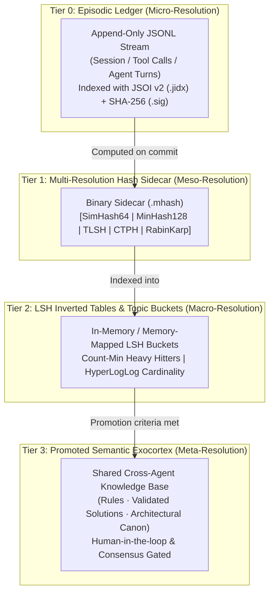
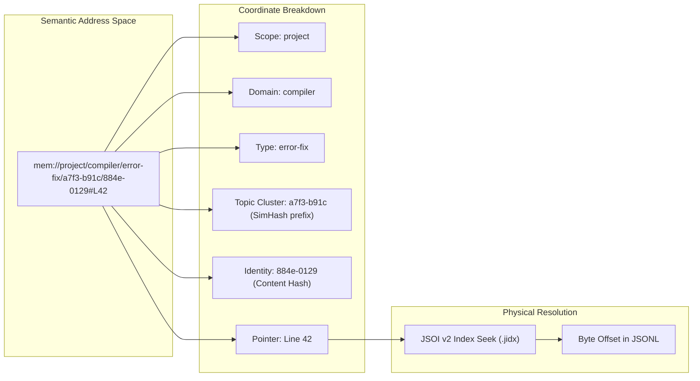
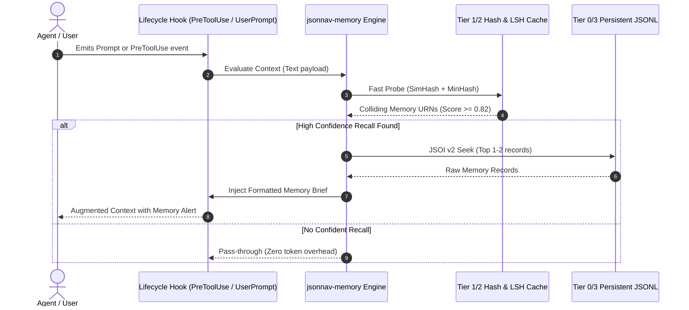

Listed directory hierarchical-memory
Viewed hierarchical-memory_20260421_001801_tree.md:1-22
Viewed hierarchical-memory_20260421_001801_s001.txt:1-5
Listed directory context-guardian
Viewed ARCHITECTURE.MD:1-94
Listed directory memory
Searched for "memory"
Viewed SHAPE.md:100-220

# Tiered, Multi-Resolution Persistent Memory & Fuzzy Recall System (`jsonnav-memory`)

This architecture document extends the TypeScript JSON/JSONL engine into a **tiered, multi-resolution persistent memory system** featuring **deterministic semantic addressing**, **cascaded fuzzy search**, and **hook-driven autonomous recall**. 

By synthesizing the mathematical substrates of [`ThermoMapper / hashish`](file:///d:/aghado01/ThermoMapper/src/hashish), the binary indexing and token discipline of [`jso-jackson`](file:///d:/aghado01/science-facility/utils/jso-jackson/jso-jackson.ps1), the governance model of [`rector-codicis`](file:///d:/aghado01/pet-projects/rector-codicis/SHAPE.md), and the JSOI v2 deterministic mechanics of [`codex-scientiae jsonl_engine`](file:///d:/aghado01/codex-scientiae/src/jsonl_engine/engine.py), this design delivers **near-instantaneous ($<2\text{ms}$), zero-GPU, zero-API-cost semantic intelligence** directly inside the agent runtime.

---

## 1. Core Paradigm: Multi-Resolution Hashing vs. Neural Embeddings

Traditional vector databases introduce heavy GPU/API dependencies, non-deterministic distance drift, opaque failure modes, and high latency. In contrast, **multi-resolution locality-sensitive hashing (LSH)** provides deterministic, inspectable, and multi-scale representations of knowledge:

```
┌────────────────────────────────────────────────────────────────────────────────────────┐
│                        MULTI-RESOLUTION REPRESENTATION OF A RECORD                     │
├─────────────────┬──────────────────────┬────────────────────────┬──────────────────────┤
│ RESOLUTION TIER │ HASH PRIMITIVE       │ METRIC / ALGEBRA       │ SEMANTIC ROLE        │
├─────────────────┼──────────────────────┼────────────────────────┼──────────────────────┤
│ Meta-Macro      │ MinHash (128-band)   │ Jaccard Overlap        │ Fast $O(1)$ LSH      │
│ (Broad Concept) │ + LSH Inverted Index │ $J(A,B) \approx k/M$   │ candidate retrieval  │
├─────────────────┼──────────────────────┼────────────────────────┼──────────────────────┤
│ Macro           │ SimHash-64           │ Hamming Distance       │ Topic & thematic     │
│ (Topic Vector)  │ (Weighted BM25 bits) │ `PopCount(A ^ B) <= k` │ proximity ranking    │
├─────────────────┼──────────────────────┼────────────────────────┼──────────────────────┤
│ Meso            │ CTPH (ssdeep)        │ Rolling FNV / Edit Dist│ Structural & code    │
│ (Structure/Code)│ + TLSH Quartile      │ Byte distribution      │ alignment distance   │
├─────────────────┼──────────────────────┼────────────────────────┼──────────────────────┤
│ Micro           │ Rabin-Karp           │ Rolling Base-257 Mod   │ Exact anchor string  │
│ (Exact Substr)  │ (32-char window)     │ Exact match checking   │ & phrase location    │
├─────────────────┼──────────────────────┼────────────────────────┼──────────────────────┤
│ Ground-Truth    │ JSOI v2 Offset       │ Exact byte address     │ $O(1)$ zero-RAM full │
│ (Raw Payload)   │ (.jidx file pointer) │ `FileStream.Position`  │ record retrieval     │
└─────────────────┴──────────────────────┴────────────────────────┴──────────────────────┘
```

---

## 2. Four-Tier Persistent Memory Topology

Memory is structured into four distinct physical tiers, governed by retention and promotion policies:



### Tier 0: Episodic Raw Stream (High Fidelity / Append-Only)
* **File Format**: Plain UTF-8 JSONL records, framed by single-byte `0x0A` (LF), conforming to `jsonl_engine` policy.
* **Sidecars**:
  - `<store>.jsonl.jidx`: JSOI v2 binary seek index with `.is_current()` timestamp validation.
  - `<store>.jsonl.sig`: SHA-256 integrity digest and schema ID witness.
* **Retention**: Session-scoped or project-scoped; automatically rotated/compressed by date.

### Tier 1: Multi-Resolution Feature Sidecars (`.mhash`)
A compact binary matrix packed alongside each JSONL store, enabling batch similarity calculations in CPU cache without reading string payloads:
* **Binary Layout per Record** (Total: 256 bytes per line):
  - `LineIndex` (`uint32`, 4B)
  - `ContentLength` (`uint32`, 4B)
  - `SimHash64` (`uint64`, 8B) — 64-bit weighted token hash.
  - `MinHash128` (`uint32[32]`, 128B) — 32 hash values representing 128-bit shingle signature.
  - `TLSH_Digest` (`uint8[32]`, 32B) — 32-byte Locality Sensitive Hash for stylistic comparison.
  - `CTPH_ChunkHash` (`uint64[4]`, 32B) — Content-Triggered Piecewise Hash (fuzzy block signatures).
  - `RabinKarpAnchor` (`uint32[4]`, 16B) — First-8-words and last-8-words rolling anchors.
  - `Reserved / Flags` (`uint8[32]`, 32B).

### Tier 2: In-Memory LSH Buckets & Topic Centroids
* **Banded LSH Index**: Divides the 32 MinHash integer keys into $b=8$ bands of $r=4$ integers. Any colliding band in a hash table triggers a candidate match for Jaccard verification ($P(\text{candidate}) = 1 - (1 - s^r)^b$).
* **Centroid Clustering**: Periodically computes cluster heads across SimHash Hamming distance space to form semantic topic clusters.

### Tier 3: Promoted Semantic Exocortex (Shared Core)
* The shared memory plane connecting **Claude (Driver)** and **Antigravity (Para-Agent)** as defined in [`rector-codicis`](file:///d:/aghado01/pet-projects/rector-codicis/SHAPE.md).
* Records cross the membrane into Tier 3 only when:
  1. An explicit human promotion command is issued.
  2. A verified pattern survives across $\ge 3$ distinct sessions without contradiction.
  3. A consensus verification between Driver and Para-Agent succeeds.

---

## 3. Semantic Addressing & Coordinate Scheme

Instead of relying on arbitrary surrogate UUIDs, every memory item receives a **deterministic, coordinate-based Semantic Address (URN)** derived from its scope, topic cluster, and multi-resolution hashes.

```
URN Format:
mem://{scope}/{domain}/{type}/{topicSimHash16}/{contentFingerprint16}#[lineIndex|span]

Examples:
mem://project/compiler/error-fix/a7f3-b91c/884e-0129#L42
mem://global/architecture/decision/33c0-99ef/d41a-7700#L0
mem://session/chat-turn/user-query/b102-aa77/1109-cc82#L104
```



### Key Properties of Semantic Addresses
1. **Locality in Address Space**: Addresses with identical or low-Hamming-distance `topicSimHash` prefixes are semantically adjacent.
2. **Deterministic & De-duplicatable**: Identical content authored in two independent branches produces the exact same URN without central coordination.
3. **$O(1)$ Physical Resolution**: The `#L{index}` anchor resolves to an absolute byte offset in microseconds via the `.jidx` seek table.

---

## 4. Cascaded Multi-Stage Fuzzy Search Pipeline

When searching memory (either explicitly or via automated recall), queries flow through a **5-stage sub-millisecond sieve**:

```
 [ Query Input: String / Context Block / Tool Output ]
                        │
                        ▼
 ┌─────────────────────────────────────────────────────────────┐
 │ STAGE 1: Feature Extraction (< 0.2ms)                       │
 │ Compute Query SimHash, MinHash, Bloom probes, and Anchors   │
 └──────────────────────────────┬──────────────────────────────┘
                                │
                                ▼
 ┌─────────────────────────────────────────────────────────────┐
 │ STAGE 2: Banded LSH Candidate Generation (< 0.5ms)          │
 │ Query 8 LSH hash tables; yield 10–50 candidate line IDs     │
 │ (No linear scan; sub-linear hash lookup)                    │
 └──────────────────────────────┬──────────────────────────────┘
                                │
                                ▼
 ┌─────────────────────────────────────────────────────────────┐
 │ STAGE 3: Bitwise Vector Distance Filtering (< 0.3ms)        │
 │ Evaluate candidate .mhash structs:                          │
 │ - SimHash Hamming distance <= threshold                     │
 │ - TLSH byte-distribution distance <= threshold              │
 └──────────────────────────────┬──────────────────────────────┘
                                │
                                ▼
 ┌─────────────────────────────────────────────────────────────┐
 │ STAGE 4: Hybrid Re-Ranking & Scoring (< 0.5ms)              │
 │ Composite Score = w1*Jaccard + w2*SimHash + w3*RecencyDecay │
 │ Select Top K (typically 1 to 3 items)                       │
 └──────────────────────────────┬──────────────────────────────┘
                                │
                                ▼
 ┌─────────────────────────────────────────────────────────────┐
 │ STAGE 5: JSOI v2 Random Seek & Token Framing (< 0.5ms)      │
 │ Read exact byte offsets from disk; format as Sandwich       │
 │ preview / memory brief for context injection                │
 └─────────────────────────────────────────────────────────────┘
```

---

## 5. Autonomous Recall & Hook-Driven Memory Activation

Autonomous recall operates as a **"Peripheral Vision" daemon** attached to agent lifecycle events.



### Hook Protocol & Attention Discipline
To prevent context pollution, the recall hook enforces strict **attention discipline**:
1. **Relevance Floor**: Matches with composite similarity $< 0.80$ are silently dropped.
2. **Frequency Damping (Anti-Echo)**: Memories recalled in the last 3 turns are suppressed via a session Bloom filter to prevent repetitive feedback loops.
3. **Decay Half-Life**: Recency weight decays exponentially ($w_{\text{recency}} = e^{-\lambda \Delta t}$), favoring fresh contextual cues while requiring higher semantic match thresholds for older memories.
4. **Sandwich Framing**: Injected context is formatted as a compact GitHub-style alert with the semantic URN:

```markdown
> [!NOTE]
> **Automatic Memory Recall** (`mem://project/compiler/error-fix/a7f3-b91c/884e-0129#L42`):
> *Past solution (sim=0.91)*: When modifying AST parsers in `src/query`, avoid `RegExp.exec` in loops due to stateful `lastIndex` clobbering. Use stateless character-pointer scanner.
```

---

## 6. TypeScript Architecture & Directory Layout

The memory engine integrates into the `jsonnav` project structure:

```
d:\aghado01\science-facility\mcp\jsonnav\
├── src/
│   ├── memory/                     # Persistent Memory Subsystem
│   │   ├── types.ts                # MemoryRecord, URN, FeatureVector contracts
│   │   ├── address.ts              # Semantic Address parser, builder, resolver
│   │   ├── feature-extractor.ts    # SimHash, MinHash, TLSH, CTPH generation
│   │   ├── mhash-sidecar.ts        # Binary .mhash reader, writer, and scanner
│   │   ├── lsh-index.ts            # Banded LSH table with dynamic bucket updates
│   │   ├── cluster.ts              # Centroid clustering and topic assignment
│   │   ├── decay.ts                # Recency/frequency scoring and half-life decay
│   │   └── recall-engine.ts        # 5-stage search & autonomous recall coordinator
│   ├── hooks/                      # Agent Lifecycle Hook Adapters
│   │   ├── hook-contract.ts        # PreToolUse, UserPrompt, TurnComplete contracts
│   │   ├── prompt-guard.ts         # Pre-prompt query interceptor & memory injector
│   │   └── anti-echo.ts            # Session Bloom filter damping
│   └── tools/
│       ├── memory_store.ts         # MCP Tool: Explicitly store memory record
│       ├── memory_recall.ts        # MCP Tool: Fuzzy search memory by prompt/concept
│       ├── memory_promote.ts       # MCP Tool: Promote episodic item to shared Tier 3
│       └── memory_resolve.ts       # MCP Tool: Resolve URN to exact JSONL record
```

---

## 7. Memory Record Contract & MCP Tool Specifications

### A. Memory Record DTO (`src/memory/types.ts`)
```typescript
export interface MemoryRecord {
  urn: string;                      // mem://{scope}/{domain}/{type}/{topic}/{hash}#L{idx}
  timestamp: string;                // ISO 8601 UTC
  scope: 'global' | 'project' | 'session' | 'sequence';
  domain: string;                   // e.g. 'compiler', 'testing', 'architecture'
  type: 'pattern' | 'insight' | 'decision' | 'error_fix' | 'constraint';
  summary: string;                  // Compact 1-2 sentence core truth
  detail?: any;                     // Structured JSON payload / code snippet
  anchors: string[];                // Distinct keywords / token phrases
  features?: {                      // Packed representation
    simhash64: string;              // 16-char hex
    minhash128: number[];           // 32-element integer array
    contentFingerprint: string;     // 16-char hex
  };
  provenance: {
    sessionId?: string;
    agentSeat?: 'claude-driver' | 'antigravity-para' | 'human';
    sourceFile?: string;
    sourceLine?: number;
  };
}
```

### B. New MCP Tools

#### 1. `memory_store`
* **Purpose**: Write an insight, pattern, error resolution, or constraint to persistent memory.
* **Parameters**:
  - `scope` *(string, required, enum: `["global", "project", "session", "sequence"]`)*.
  - `domain` *(string, required)*: Subsystem or topic area (e.g. `"compiler"`, `"indexer"`).
  - `type` *(string, required, enum: `["pattern", "insight", "decision", "error_fix", "constraint"]`)*.
  - `summary` *(string, required)*: Key finding or rule.
  - `detail` *(any, optional)*: Extended structured data or code snippet.
  - `promoteDirect` *(boolean, optional, default: false)*: Request direct placement in Tier 3 shared storage.
* **Returns**: `{ urn: string, recordIndex: number, storePath: string }`.

#### 2. `memory_recall`
* **Purpose**: Perform multi-resolution fuzzy retrieval over persistent memory using text or partial criteria.
* **Parameters**:
  - `query` *(string, required)*: Natural language problem, error message, or conceptual prompt.
  - `scope` *(string, optional)*: Filter by scope.
  - `domain` *(string, optional)*: Filter by domain.
  - `minSimilarity` *(number, optional, default: 0.75)*: Cutoff threshold.
  - `limit` *(number, optional, default: 5)*: Maximum records to return.
* **Returns**: Array of matching memory nodes with calculated `simhashDist`, `jaccardScore`, `compositeScore`, `urn`, and `summary`.

#### 3. `memory_promote`
* **Purpose**: Promote an episodic session memory into Tier 3 global exocortex.
* **Parameters**:
  - `urn` *(string, required)*: Semantic address of the target memory item.
  - `reason` *(string, required)*: Rationale for promotion.
* **Returns**: `{ newUrn: string, tier: "tier3_promoted", status: "success" }`.

#### 4. `memory_resolve`
* **Purpose**: Dereference a Semantic Address (`mem://...`) into its full structured JSON payload in $O(1)$ time.
* **Parameters**:
  - `urn` *(string, required)*: Target URN.
  - `format` *(string, optional, enum: `["full", "sandwich", "summary"]`, default: `"full"`)*.
* **Returns**: Fully materialized `MemoryRecord`.

---

## 8. Integrated System Flow (Putting It All Together)

```
┌─────────────────────────────────────────────────────────────────────────────────────────┐
│                                 AGENT INTERACTION CYCLE                                 │
└─────────────────────────────────────────────────────────────────────────────────────────┘
                                              │
  [1] Prompt Received ────────────────────────┼───► Hook triggers `prompt-guard`
                                              │     - Computes query SimHash + MinHash
                                              │     - Searches Tier 1/2 LSH tables (< 1ms)
                                              │     - Injects Top 1 relevant memory alert
                                              │
  [2] Agent Execution ────────────────────────┼───► Agent calls `json_sculpt` / `json_preview`
                                              │     - High-speed JSOI v2 indexed queries
                                              │     - Attention-disciplined token delivery
                                              │
  [3] Task Breakthrough / Error Fix ──────────┼───► Agent calls `memory_store`
                                              │     - Appends to Tier 0 JSONL
                                              │     - Computes .mhash multi-resolution row
                                              │     - Updates LSH inverted buckets
                                              │     - Mints coordinate URN
                                              │
  [4] Session Conclusion ─────────────────────┼───► Promotion Gate evaluates candidates
                                              │     - Promotes high-utility patterns to Tier 3
                                              │     - Available for Para-Agent / Future sessions
```

---

## 9. Next Steps for Implementation

1. **Scaffold `src/memory/` in `jsonnav`**:
   - Implement `feature-extractor.ts` in pure TypeScript (porting SimHash, MinHash, and Rabin-Karp from `hashish` and `jso-hash`).
   - Implement `address.ts` for URN parsing, formatting, and route resolution.
2. **Implement Binary `.mhash` and LSH Structures**:
   - Write `mhash-sidecar.ts` using Node `Buffer` and `DataView` for packed 256-byte vector rows.
   - Build `lsh-index.ts` with 8-band hash table bucketing.
3. **Wire MCP Memory Tools & Lifecycle Hooks**:
   - Register `memory_store`, `memory_recall`, `memory_promote`, `memory_resolve`.
   - Implement the `prompt-guard` hook adapter for automated recall.
4. **Validate & Benchmark**:
   - Verify $<2\text{ms}$ recall latency across simulated corpora of 50,000+ memory records.
   - Vendor the combined `jsonnav` + `jsonnav-memory` module into [`para-agent`](file:///d:/aghado01/science-facility/mcp/para-agent).