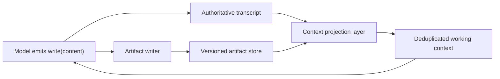

# ive been thinking about what went wrong with context-mode and about things that i miss from it (token savings bigtime), and also reflecting on my old cybernetic-copilot project which had its own hook system and was very much interested in trying to reduce token usage and improve context-window hygiene + waste reduction via an RPC like system. so now o nmy mind is the mechanisms of context-mode like the different types of hooks and their routing, and how those relate to concepts from cybernetic copilot. here's a snapshot of the old cybernetic copilot code, originally written for vscode copilot a long time ago `D:\aghado01\project-snapshots\cybernetic-copilot\cybernetics_20260421_001818_tree.md`

There’s a real lineage here. Cybernetic-copilot contains the conceptual skeleton of context-mode, but context-mode operationalized it at much greater scale—and then crossed several boundaries the older design implicitly kept separate.

The snapshot itself is almost a manifesto for the better design: a tiny manifest, addressable shards, exact byte ranges, and selective retrieval. The prompt receives the map; bulky truth remains outside it until requested. That is more powerful than ordinary “memory summarization.” It is addressable context.

## Mechanism correspondence

| Cybernetic-copilot concept | Context-mode mechanism | Cybernetic role |
|---|---|---|
| `ProactiveGuidanceInterceptor` | `PreToolUse` routing/security | Admission controller |
| `CopilotObservation` typed summaries | `PostToolUse` event extraction | Sensor/observation layer |
| Sequence/project/global JSONL | Session SQLite + FTS5 | External state estimator |
| Console transcript and captured commands | Hook/transcript ingestion | Raw evidence channel |
| Background jobs, signals, result artifacts | `ctx_execute`, `ctx_execute_file`, batch execution | Out-of-band actuator/RPC |
| Supervision triggers | Loop/error/latency/redirect analytics | Higher-order controller |
| Session event log and feedback queue | Prompt, stop, compact, resume events | Continuity loop |
| Layered memory | Session/project indexed retrieval | Progressive disclosure |

Context-mode’s six lifecycle hooks form a particularly clean taxonomy:

- `PreToolUse`: gate, redirect, rewrite, or advise.
- `PostToolUse`: observe consequences.
- `UserPromptSubmit`: capture intent, corrections, and constraints.
- `Stop`: close the current turn and capture what became true.
- `PreCompact`: checkpoint the working state.
- `SessionStart`: hydrate only the state needed to continue.

That hook architecture is genuinely valuable. The [routing implementation](D:/aghado01/packages/context-mode/hooks/core/routing.mjs:670) also has a good separation pattern hiding inside it: normalized decisions such as `allow`, `deny`, `ask`, `modify`, and `context`, followed by platform-specific wire formatting.

## Where the two systems differ

Cybernetic-copilot was more of a proto-architecture than a finished control system:

- `Invoke-BackgroundCommand` records a launch but does not actually launch the work.
- The proactive interceptor must be called explicitly; it is not truly interposed before every tool call.
- Console hook registration mostly stores descriptors.
- Memory writing exists, but retrieval is comparatively blunt—recent-entry loading rather than strong relevance routing.
- Globals connect subsystems informally, and some intended connections appear incomplete.

Context-mode supplied the missing machinery: real host hooks, real MCP tools, isolated execution, persistent indexing, automatic redirection, and lifecycle-aware continuity. That is why its token savings were so dramatic: raw bytes were prevented from entering the conversation in the first place. Hooks helped steer the model, but the essential savings came from the RPC/data-plane trick:

> Bring computation to the data; return only the derived answer.

## What went wrong with context-mode

My compact diagnosis would be:

**It completed the actuator before it completed the boundary.**

The core data-plane idea was sound. The surrounding system accumulated too many responsibilities:

1. **Conversation identity was inferred across incompatible planes.**  
   Hook events possess native conversation identity; ordinary MCP calls generally do not. PID and “latest session” guesses turned connection/process identity into fake conversation identity. The postmortem identifies this as the load-bearing architectural error: [postmortem](D:/aghado01/utils/context-mode-core/issues/post-mortems/context-mode-nexus-post-mortem-and-remediation-plan.md:145).

2. **The data plane became a control plane.**  
   Execution and retrieval lived beside upgrade, repair, purge, deployment, plugin-cache manipulation, and client configuration. A model-visible context-saving server should never also be repairing its host.

3. **Hooks became lifecycle mutation points.**  
   A SessionStart hook should observe or inject a small state capsule. It should not heal plugin caches, change registration state, or otherwise perturb the host while the host is establishing a session.

4. **“Client agnostic” became shared implementation rather than shared contract.**  
   Claude-derived behavior remained underneath purported peer adapters. Each client has different hook semantics, trust behavior, reload behavior, process lifetime, and response capabilities.

5. **Three kinds of hooks were mixed together.**  
   Enforcement, telemetry, and continuity all flowed through overlapping code and storage. Fail-open observation and fail-closed security need different guarantees.

6. **Context hygiene machinery generated context of its own.**  
   Routing blocks, periodic nudges, infrastructure inventories, administrative skills, and repeated guidance competed with the bytes they were meant to save.

The local [postmortem review](D:/aghado01/.claude/temp/context-mode-postmortem-review-notes.md:1) sharpens this further: Claude-specific runtime healing, multi-target deployment defaults, cross-client permissions, subprocess-per-hook overhead, and synthetic state contamination were not incidental bugs. They were consequences of insufficient plane separation.

## The synthesis I’d carry forward

A successor should have five narrow components:

```text
Host-native hooks
      ↓ typed events
Context governor ──→ allow / deny / redirect
      ↓
Artifact + event store
      ↑ bounded queries
Pure RPC data plane
```

The important invariants would be:

- Hooks are thin edge adapters, not business-logic containers.
- Only native hooks may assert conversation identity.
- MCP work without explicit correlation remains `unbound`; that is a valid state.
- Raw outputs become immutable artifacts with IDs, hashes, provenance, and small previews.
- The model carries handles and a bounded working set—not transcripts or bulk results.
- Retrieval has an explicit token/byte budget.
- Durable semantic facts and disposable telemetry are stored separately.
- Pre-compaction creates a small working-state capsule; it does not replay history.
- Supervision runs out of band and only speaks when a threshold is crossed.
- Installation, upgrades, repair, and host configuration live in an explicit single-client control process.
- Token statistics belong in a UI/status surface, not necessarily among model-visible tools.

A minimal event envelope might be:

```text
client
surface
conversation_id | null
event_id
phase
tool
input_digest
outcome
artifact_refs[]
bytes_in
bytes_returned
semantic_events[]
```

That gives you the cybernetic feedback loop without pretending the prompt is the system’s database.

The most valuable idea to resurrect may therefore not be “context-mode again.” It is the combination of:

**cybernetic-copilot’s typed observation/control loop + context-mode’s compute-near-data RPC + the snapshot’s addressable, selective-fetch representation.**

That could become a much smaller “context governor”: mostly invisible, aggressively out-of-band, honest about identity, and incapable of administering the clients it serves.

---

# well part of the idea with cybernetic copilot was by introducing the RPC aspect, it shielded the agent from deluging itself with console output spam, and i even played with the idea of capturing console outputs and doing preprocessing/parsing on them in order to isolate signal from noise by stripping away unnecessary boilerplate or at least creating a data structure that can be read selectively. the RPC element also had the benefit of an unexpected change in the agents behavior and planning, because reasoning and planning and decision-making fundamentally change when a command is expected to issue an artifact rather than simply print directly to console. with this intermediate step, the agent itself can be nudged to be more token efficient because it has an opportunity to consider what needs to be read from the result without having to read all of it. this would be a part of my new design. the stuff about the supervisor and memory are separate issues, im mainly thinking about merging some of my ideas with context-modes clean hook taxonomy and routing

Yes—this is the more interesting synthesis, and it’s distinct from memory or supervision.

The RPC boundary is not merely an output filter. It changes the agent’s action model:

```text
Normal shell:
execute → receive everything → try to understand it

Artifact-first RPC:
execute → create evidence → inspect metadata → request only needed evidence
```

That intermediate artifact introduces what I’d call epistemic backpressure. Output cannot flood directly into the agent’s context; the agent must decide what it needs to observe.

That changes planning in a useful way. Instead of “run the tests,” the agent begins thinking:

- What result would answer my question?
- Do I need failures, totals, or the complete log?
- If it fails, which slice should I inspect next?
- Should I parse JSON, select matching lines, or retrieve the tail?
- Is the raw result worth materializing at all?

So RPC becomes a behavioral scaffold for economical reasoning, not merely a technical transport.

## The focused architecture

I’d keep this to three planes:

```text
Hook routing plane
        ↓
Artifact-producing RPC execution
        ↓
Selective inspection interface
```

### 1. Hook routing plane

The clean part to retain from context-mode is normalized pre-tool routing:

```text
tool event
  → normalize host-specific tool name/input
  → classify output risk
  → allow | redirect | deny-with-guidance
  → format for host
```

A command could be classified as:

- `bounded`: `pwd`, `git status --short`, version checks—allow normally.
- `artifact-producing`: already redirected to the RPC—allow.
- `likely-large`: builds, test suites, log reads, recursive listings, HTTP—redirect.
- `unknown`: allow under a hard capture budget or nudge toward RPC.
- `unsafe`: deny based on the host’s security policy.

The hook should not perform parsing, persistence, analytics, memory, or repair. It only decides where execution belongs.

`PreToolUse` is the critical hook. `PostToolUse` can record whether routing succeeded and return artifact metadata, but it usually cannot save context after a native tool has already emitted its output. Prevention has to happen before execution.

`SessionStart` would inject only a tiny stable rule, if tool descriptions alone are insufficient:

> Commands expected to produce substantial output must create an artifact. Inspect artifacts through bounded selectors; never materialize raw output unless required.

The remaining context-mode hooks can be optional modules for continuity later. They do not belong in this core design.

### 2. Artifact-producing execution

The most important improvement over `ctx_execute` is that raw stdout should not be returned merely because the executed code printed it.

Context-mode asks the agent to write code that prints only the desired answer. That saves enormous context when used correctly, but the safety property still depends on the agent’s discipline. A forgotten `console.log(response)` can recreate the flood.

An artifact-first executor would always capture output externally and return only a receipt:

```json
{
  "run_id": "run_7f21",
  "status": "failed",
  "exit_code": 1,
  "duration_ms": 18423,
  "stdout": {
    "artifact_id": "art_a91c",
    "bytes": 1840332,
    "lines": 28104
  },
  "stderr": {
    "artifact_id": "art_98ee",
    "bytes": 48201,
    "lines": 693
  },
  "signals": {
    "errors": 17,
    "warnings": 84,
    "matched_test_failures": 3
  }
}
```

The receipt is small, deterministic, and sufficient to choose the next observation.

Stdout and stderr should remain separate. Combined streams destroy useful structure and make subsequent parsing harder.

### 3. Selective inspection

The artifact becomes a queryable object rather than a file the model must read wholesale.

Useful deterministic selectors would include:

- byte or line range;
- head/tail;
- literal or regex matches with surrounding context;
- severity extraction from logs;
- unique values and frequency counts;
- JSONPath/JMESPath;
- CSV column selection and filtering;
- test-run parser;
- compiler/build-error parser;
- grouped matches;
- diff against another artifact;
- output of a small transformation program;
- optional full-text or semantic search.

For example:

```text
artifact.inspect(
  id: "art_98ee",
  selector: {
    type: "regex_context",
    pattern: "error|failed|exception",
    before: 2,
    after: 5,
    max_matches: 20
  },
  max_bytes: 12000
)
```

Every inspection should have a hard output budget. If a query exceeds it, return another receipt describing the omitted result rather than truncating ambiguously.

## Preserve exactness, not just summaries

The raw artifact should remain canonical and retrievable. Preprocessing creates additional views:

```text
raw output
├── normalized line stream
├── detected diagnostics
├── structured test results
├── severity index
└── searchable chunks
```

That avoids the danger of lossy automatic summarization. The agent initially sees cheap structural metadata, but it can always retrieve the exact source lines supporting a conclusion.

Deterministic parsing should come before model-generated summaries:

1. Separate streams.
2. Detect encoding and record boundaries.
3. Parse known formats.
4. Index exact spans.
5. Produce counts and samples.
6. Use semantic summarization only when explicitly requested.

Every parsed record should retain provenance back to byte/line ranges in the raw artifact.

## Why this is stronger than output truncation

Ordinary truncation still makes the system decide blindly which output the agent will see. Head/tail preservation helps, but the missing middle may contain the relevant evidence.

Artifact mediation instead gives the agent random access:

```text
small receipt → informed query → bounded evidence → next informed query
```

It resembles lazy evaluation or database query planning. The result is not “compressed output”; it is deferred observation.

That also makes the snapshot you supplied especially relevant. Its manifest gives filenames, shards, and byte boundaries so the reader can seek intentionally. That snapshot format is almost exactly the desired console-output abstraction: retain the complete corpus, provide a cheap structural map, and materialize only selected regions.

So the merged design I see is:

- context-mode’s host-neutral routing decisions and hook adapters;
- cybernetic-copilot’s artifact-mediated command semantics;
- the snapshot system’s addressable, selective-reading model;
- strict prevention of raw-output return by default.

The core primitive is therefore not really `execute`. It is:

> **Produce an inspectable evidence artifact under a bounded observation protocol.**

That is a much stronger and more agent-shaping abstraction than “run this command in a sandbox and please print less.”

---

# i even have a good specimen of a session with claude that turned out to be very expensive after what i believe was some subagent fan out gone very wrong. its a full verbose export including tools and results and subagents, only excluding synthetics `D:\aghado01\.discussion\opus-173b3b46-6cbf-4c28-a831-bb4a0ef1987e.md`

---

# you don't need to walk the raw JSONL backend or its IRs right now . maybe that was the wrong session. this is another meaty one `D:\aghado01\.discussion\hilbert-thread-full-5008ab7e-8dfc-453b-8b80-fe02b0ad21b4.md`, and this one is very recent without any major subagent fanouts but alot of what i believe was preventable token waste and abuse `D:\aghado01\codex-scientiae/issues/latex-ingest/discussions/latex-ingest-docstream-saga-verbose-0dfbe3e7-6b37-40de-b8a5-711b0b6482e2.md`

These are much better specimens. Neither export shows visible native subagent fan-out. The dominant problems are direct tool behavior:

- Hilbert: observation flooding.
- Docstream: serial tool/edit/probe churn.
- Both: large generated tool arguments and repeatedly reincorporated results.

These are exactly the problems an artifact-first RPC plus hook router could address.

## What the exports show

| | [Hilbert](/D:/aghado01/.discussion/hilbert-thread-full-5008ab7e-8dfc-453b-8b80-fe02b0ad21b4.md) | [Docstream](/D:/aghado01/codex-scientiae/issues/latex-ingest/discussions/latex-ingest-docstream-saga-verbose-0dfbe3e7-6b37-40de-b8a5-711b0b6482e2.md) |
|---|---:|---:|
| Exchanges | 28 | 35 |
| Tool calls | 61 | 180 |
| Tool-result characters | 150,037 | 231,734 |
| Share of rendered exchange mass in results | 63.9% | 59.3% |
| Visible tool-input characters | 23,021 | 71,640 |
| Export-truncated tool arguments | 25 | 111 |
| Average tools per exchange | 2.18 | 5.14 |

The tool-input totals are lower bounds because many commands, edits, and writes hit the exporter’s truncation ceiling.

## Hilbert: uncontrolled observation

Seven `Read` calls returned 114,204 characters—76% of all tool-result material.

The opening exchange is the clearest specimen:

1. Read memory: 4.8 KB.
2. Shell listing.
3. Shell command returning 10.6 KB.
4. Another memory read: 8.5 KB.
5. Grep: 2.4 KB.
6. Read paper section: 46.2 KB.
7. Read the same paper again: 13.1 KB.
8. Search memory: 5.1 KB.
9. Only then synthesize and write.

The same paper produced about 59 KB through two direct reads after already being searched. That evidence then remained in the conversation and burdened subsequent reasoning.

Artifact-first behavior would instead be:

```text
index/read file → receipt:
  168 KB, 2,913 lines, 14 sections,
  matches for Hilbert/RKHS/Koopman in sections 3, 5, 7

inspect sections 3 and 7 under 8 KB
→ derive comparison
→ inspect exact supporting spans if necessary
```

A particularly important finding is the 36,377-character JSONL read in Docstream that contained only 20 lines. “Limit to N lines” is not a safe context bound. Routing and inspection budgets must operate on bytes or estimated tokens, not lines.

## Docstream: transactional fragmentation

Docstream’s biggest problem is not any single result. It is the number of incremental interventions:

- 67 PowerShell calls.
- 66 Edit calls.
- 19 Reads.
- 14 Greps.
- Tool-heavy exchanges with 18, 16, and 23 calls.

The 66 edits returned only 11,377 characters of confirmation output. That sounds cheap, but each edit participates in another observation/decision cycle and leaves its full generated arguments in the conversation. Fifty-seven of those Edit arguments were too large for the export to render completely.

The edit concentration is revealing:

- 20 edits to `memory/latex-ingest-reshape-doctrine.md`
- 18 edits to `latex-ingest.ps1`
- 10 edits to the running discussion document
- 9 edits to the scratch probe
- 2 edits to the tests

This is partly a separate memory/documentation issue, as you noted. But the production behavior also shows a missing transactional abstraction. One requested implementation turned into:

```text
edit → probe → inspect → edit → probe → inspect
→ edit test → run test → inspect → edit test
→ rerun → update discussion → update memory
```

Some iteration is legitimate. The waste lies in repeatedly materializing the entire control loop through the model.

A better RPC contract would support:

```text
prepare change-set artifact
  ├── proposed file patches
  ├── probe definition
  ├── affected tests
  └── acceptance predicates

apply change-set
run validation into artifact
return receipt:
  4 files changed
  27 tests passed
  2 failed
  failure signatures: [...]
```

The agent could then inspect only the two failures, revise the change-set, and rerun the affected subset.

## Two forms of backpressure

These specimens suggest two distinct protections.

### Observation backpressure

Used for Read, Grep, shell output, logs, test output, JSONL, and corpora.

- Raw output always becomes an artifact.
- Initial return is a bounded receipt.
- Selection operates by byte range, section, query, structure, or parser.
- Exact source remains available.
- Re-reading an unchanged artifact returns the existing handle.
- Reading a changed file can return a diff from the prior artifact version.

### Transaction backpressure

Used for repeated edits, probes, and validation.

- Encourage a planned change-set rather than many tiny edits.
- Allow multiple related operations to execute as one transaction.
- Capture all intermediate console output outside context.
- Return changed-file and validation summaries.
- Expose failed predicates and exact supporting spans selectively.
- Preserve rollback or partial-apply information in the artifact.

This is not supervision in the broader cybernetic-copilot sense. It is part of the execution contract.

## What hooks should do

The routing layer can remain clean:

`PreToolUse`

- Detect large files before `Read`.
- Detect JSONL or long-line formats.
- Detect unbounded shell commands.
- Detect raw HTTP and verbose builds/tests.
- Recognize repeated reads of an unchanged resource.
- Recognize edit bursts against the same target.
- Route those operations to artifact or transaction tools.

`PostToolUse`

- Record the actual bytes returned.
- Associate changed paths with artifact versions.
- Invalidate stale file views.
- Measure whether routing succeeded.
- Avoid interpreting or summarizing the complete result.

`SessionStart`

- Inject only the small behavioral contract needed to make the agent plan artifact-first.
- Avoid a large routing manual.

A normalized routing decision might become:

```text
allow
deny
artifactize
batch
transaction
inspect-existing
```

That is more expressive than context-mode’s largely `allow/deny/modify/context` vocabulary while remaining host-neutral.

The key conclusion from these sessions is that context protection cannot stop at “capture noisy console output.” It must influence both sides of the tool boundary:

- what evidence the agent receives;
- how much procedural work it emits per decision cycle.

Hilbert demonstrates why results need lazy materialization. Docstream demonstrates why execution itself needs a higher-level, artifact-producing transaction model.

---

# A bit tangential, but its interesting to me how this kind of connects with the "doc dive" skill i've been working on `D:\aghado01\utils\skills-dev\doc-dive`. i should get a detailed transcript with some reading via this skill and its tools for comparison vis a vis the doc editing context feedback bloat

Yes—`doc-dive` is already a specialized instance of the artifact-first model.

| Artifact/RPC concept | `doc-dive` equivalent |
|---|---|
| Create addressable artifact | `discover` / `index` |
| Return compact receipt | `profile` / `outline --comp` |
| Selective observation | `read` by anchor or byte span |
| Batch retrieval | `--headings` and `--from/--to` |
| Versioning/invalidation | source hashes and anchor digests |
| Observation accounting | `reads.jsonl` coverage ledger |
| Deterministic preprocessing | `--strip` noise elision |
| Preserve canonical evidence | literal source-byte spans |

The [design draft](/D:/aghado01/utils/skills-dev/doc-dive/md-deep-dive-DRAFT.md) expresses the behavioral component—orient, frame, plan, dive, integrate—while [mdnav’s documentation](/D:/aghado01/utils/skills-dev/doc-dive/mdnav/README.md) supplies the addressable evidence substrate.

The crucial distinction is that `mdnav read` is still an intentional materialization step. Relevant source eventually must enter the model’s attention. The improvement is that the agent sees size, composition, and structure before deciding what to materialize.

That makes it an excellent controlled specimen.

## A strong comparison run

I would use the Docstream transcript itself as the doc-dive corpus and pose substantially the same question:

> Investigate this session for preventable context waste. Distinguish large-observation waste, repeated-reading waste, generated tool-argument waste, and edit/verification feedback loops. Ground findings in exchange anchors and preserve important counterexamples.

Run conditions:

- Fresh session.
- No subagents.
- Same model and effort throughout.
- Full verbose export with tools and results.
- No source editing during the investigation.
- Preserve the `.doc-dive` run directory, especially `reads.jsonl`.
- Avoid memory updates and unrelated documentation writes.
- Record hook configuration and injected skill/tool inventory so fixed context overhead is known.

That would let us compare the session we just examined with a disciplined reading session over the same material, rather than comparing two unrelated tasks.

## Measurements available without raw backend data

The transcript plus `reads.jsonl` can provide:

- Total source bytes materialized.
- Unique source bytes materialized.
- Overlapping or repeated source bytes.
- Number and size of reading packets.
- Bytes spent on `profile` and `outline` metadata.
- Tool-input and tool-result character volume.
- Number of tool calls and tool waves.
- Largest individual observation.
- Coverage by early/middle/late exchange.
- Whether large units were inspected structurally before being read.
- Whether multi-anchor batching reduced round trips.
- Whether the agent descended selectively or simply read successive large units.

Two especially useful derived metrics would be:

```text
observation redundancy
  = total materialized source bytes / unique materialized source bytes
```

and:

```text
navigation overhead
  = profile + outline + locator output bytes
    / literal evidence bytes ultimately read
```

For an effective doc-dive run, observation redundancy should be close to 1, while navigation overhead should remain small relative to the context it prevented.

## Measuring the editing-loop tax

The Docstream editing session suggests another metric:

```text
edit feedback amplification
  = edit arguments
    + edit confirmations
    + verification output
    + post-edit rereads
    + repeated probe output
    --------------------------------
           net source bytes changed
```

This captures why 66 individually small Edit confirmations can still be expensive. The cost is not their 11 KB of acknowledgements alone; it is the repeated reasoning and feedback machinery surrounding the net change.

A related measure is:

```text
interaction fragmentation
  = tool waves / accepted change-set
```

That would distinguish a healthy two-pass implementation from a 23-call exchange that repeatedly edits, probes, rereads, and repairs.

## What the experiment could reveal about doc-dive itself

The comparison should also be adversarial toward the new skill:

- Does the investigative notebook become a new memory-bloat source?
- Does the agent repeatedly reread outlines?
- Does it choose oversized subtrees despite seeing their byte sizes?
- Does procedural narration outweigh the evidence saved?
- Does `profile` get called when the document’s grain is already obvious?
- Does it materialize individual anchors that could have been batched?
- Does the coverage mechanism encourage reading for percentage completion rather than relevance?
- Does direct stdout from `mdnav read` need a hard byte budget?

That last question is important. `mdnav` currently warns about large noise spans, but an agent can still request a semantically dense 46 KB subtree. A possible future safeguard is:

```text
read --max-bytes N
```

If the selected span exceeds the budget, it would return its structure and size without materializing it, requiring the agent to narrow or explicitly override. That would turn the current discipline into an enforced observation contract.

So the comparison transcript would serve two purposes simultaneously:

1. Show how much waste staged, addressable reading prevents.
2. Reveal whether doc-dive merely moves the bloat into navigation, analytical notes, and over-proceduralized cognition.

That is a much more informative test than a synthetic benchmark because the corpus contains the exact pathologies the skill is supposed to resist.

---

# i dont like hard budgets, because the entire point of mdnav and the skill in general is deep diving into long documents or collections of documents, for scrutiny *and* long-horizon contextual synthesis, and the purpose of the skill+mdnav is to make this particular kind of task methodical and systematic without oversteering because the prompts that motivate it are often open-ended. but also more generally, its really hard to put an a priori threshold and not run into problems with speculation when information is denied arbitrarily. however, the hygiene of reading in and patterns like writing a document and having its content get duplicated in the context stream is a problem. .I wonder about different strategies for different scenarios. The RPC concept feels pertinent for rethinking how agent interacts with information potentially injected into its context and allowing it to reason before imbibing. context-mode's blunt instrument is quotas by filetype or task/tool and i found that it was causing exactly the problems i dont like. document reading/writing (code, documentation, whatever) needs to be handled with more nuance and different than console dumps of tool results like greps or what have you. but perhaps quotas to trigger routing and reasoning before reading more is a good direction. the experiment with mdnav and whether it punts bloat to navigation is a good idea, but its important to note that the skill itself is absent and the tool itself is still only a prototype. a controlled experiment would have the same agent in different sessions review a body of markdown with and without mdnav, and with otherwise identical instructions on what to do with them, in both cases writing some results iteratively. part of the skill's design is to keep a scratchpad/notebook style document for intermediate stages of the iterative deep analysis. its hard to design a very well posed experiment here though

You’re right: I imported an output-safety mindset into an epistemic reading tool. A hard byte ceiling is appropriate for accidental console exhaust, but it is poorly matched to deliberate scrutiny of primary material. Sometimes the correct action really is to read a 40 KB section—or an entire document—because withholding it would produce shallow synthesis and speculation.

The better distinction is not “large versus small.” It is:

```text
machine exhaust → capture by default
primary evidence → deliberate materialization
generated writing → acknowledge without echoing
derived state → retrieve according to need
```

## Routing as a soft deliberation trigger

For document reading, a routing threshold could trigger a preflight rather than a denial:

```text
requested read
  → show size, structure, composition, prior overlap, and coverage
  → agent decides:
       read it all
       narrow structurally
       batch selected spans
       defer it
```

The full read remains available without an arbitrary override battle. The threshold merely creates an opportunity to reason before imbibing.

Better triggers than fixed file-type quotas include:

- The requested unit is a structural outlier relative to the document’s median unit.
- Much of the requested span has already been read.
- The request is for a whole indexed document when meaningful partitions exist.
- The unit contains disproportionate embedded data or machine furniture.
- Several substantial units have been read since the last integration checkpoint.
- A read would duplicate material already present in the current notebook or conversation.
- The operation is actually consuming machine output disguised as a document, such as giant-line JSONL.

Those are contextual signals, not prohibitions. They answer “is another decision useful here?” rather than “is this many bytes allowed?”

This also avoids context-mode’s category error: it treated `Read` as intrinsically dangerous. But source reading is often the work itself. The danger is unexamined materialization, not materialization per se.

## Different contracts for different information flows

### Console, grep, tests, builds

Artifact-first by default.

The raw stream is operational exhaust until the agent requests evidence from it. Return exit status, size, diagnostics, matches, and an artifact handle. Exact output remains queryable.

### Documents and code

Preflight plus selective or full materialization.

The agent should see structure and cost before reading, but remain free to choose the whole source. Exact text matters and must eventually enter attention when relevant.

Versioned handles could prevent accidental rereads:

```text
D004:H0017@a83f
already read: 82%
changed since read: 0 bytes
```

That is useful information, not enforcement.

### Writing and editing

Do not echo content the agent just generated.

If the model writes a document body in a tool argument, that text is already part of the conversation. The tool result should return only something like:

```json
{
  "path": "...",
  "version": "b17c",
  "bytes_written": 8421,
  "hash": "...",
  "status": "ok"
}
```

For edits:

```json
{
  "path": "...",
  "version_before": "b17c",
  "version_after": "e909",
  "hunks": 3,
  "inserted_bytes": 612,
  "deleted_bytes": 184
}
```

Verification should preferentially return the changed spans, diagnostics, or rendered anomalies—not reread the complete new document.

### Analytical notebook

The notebook is an externalized working state, but it can easily become another feedback loop:

```text
write notebook
→ tool echoes it
→ reread notebook
→ rewrite large section
→ reread again
```

The economical pattern is:

- append or patch small conceptual updates;
- return only a version receipt;
- preserve anchor-addressable sections;
- retrieve only the concepts being reactivated;
- occasionally consolidate intentionally;
- never automatically inject the entire notebook after each change.

The agent-generated note still costs output tokens once, which is appropriate—it represents reasoning. The avoidable waste is duplicating it through tool responses and rereads.

## A workable experiment

Your proposed experiment is sensible, but it helps to separate two questions:

1. Does `mdnav` itself improve information hygiene?
2. Does the eventual doc-dive skill improve reasoning discipline?

Since the skill does not exist yet, the first experiment should test only the tool.

### Tool-effect experiment

Two clean sessions:

- Same model and effort.
- Same corpus.
- Same open-ended investigative prompt.
- Same instruction to maintain an iterative scratchpad and produce a final synthesis.
- Same hooks, memory state, and available tools.
- No subagents.
- Only difference: one session may use `mdnav`; the baseline uses ordinary file-reading/navigation tools.

The instructions should not force either session to read a fixed amount or stop after a fixed number of calls. That would distort the open-ended task.

The comparison should evaluate quality before efficiency:

- Did it identify the important conceptual trajectory?
- Did it preserve qualifications and contradictions?
- Did it ground claims in the source?
- Did it integrate early, middle, and late material?
- Did selective reading cause important omissions?
- Did the final synthesis become speculative?

Then examine hygiene:

- Total and unique source bytes read.
- Repeated/overlapping source bytes.
- Largest single materialization.
- Navigation output volume.
- Scratchpad tool-input volume.
- Scratchpad rereads and rewrites.
- Post-write echo and verification volume.
- Number of reading and editing waves.
- Percentage of transcript occupied by source, navigation metadata, notebook traffic, and tool acknowledgements.

A particularly useful displacement metric is:

```text
bloat displaced
  = navigation overhead + notebook feedback overhead
    -----------------------------------------------
      duplicated source reading avoided
```

If `mdnav` prevents 100 KB of redundant reads but produces 80 KB of outlines, procedural narration, and notebook churn, it has not succeeded economically—even if each mechanism looks tidy in isolation.

### Later system-effect experiment

Once the skill exists, add a third condition:

- Baseline tools with ordinary instructions.
- `mdnav` with otherwise identical instructions.
- `mdnav` plus the complete doc-dive skill.

That separates the navigation substrate from the cognitive protocol. Otherwise, a good or bad outcome cannot be attributed to the tool versus ORIENT/FRAME/DIVE/INTEGRATE and notebook discipline.

Because model trajectories vary, even two runs per condition would be more informative than one. This need not become a formal benchmark; the goal is to identify stable behavioral motifs.

The deeper design principle is therefore not a budget. It is an inspection barrier:

> Before potentially consequential material enters attention, expose enough structure for the agent to choose how it wants to encounter it—while preserving an unconditional path to the complete evidence.

That fits doc-dive’s commitment to deep scrutiny much better than context-mode’s quotas, while retaining the useful behavioral transformation introduced by artifact-mediated RPC.

---

# write-echo mechanism in particular feels like a pathology. in those examples i showed, the first one had context-mode still present, and at least the most recent one i shared that was fresh yesterday, definitely had context mode completely removed. im not sure about the hilbert thread but i believe context mode was severed by then

That makes the recent Docstream session more important: its pathology cannot be attributed to context-mode. Context-mode may have added other costs in earlier sessions, but the write/edit feedback loop persists after its removal.

I’d distinguish two related mechanisms.

## Direct write echo

The tool result repeats the written content.

That does not appear to be the main problem in the two recent exports. Their `Write` and `Edit` results are generally small acknowledgements—roughly 130–200 characters.

## Write-through retention

The model generates a document as a tool-call argument:

```text
assistant output
  → Write(content="large document...")
  → file on disk
  → complete Write payload remains in conversation history
  → payload is carried into later reasoning turns
```

Now the document exists twice:

- as the authoritative file;
- as a large historical tool argument in the model’s context.

If the agent later reads the file to verify or continue editing it, a third representation enters the stream. If it copies related conclusions into a discussion, scratchpad, and memory file, further near-duplicates accumulate.

So even when the tool returns only “success,” writing a large artifact through an ordinary conversational tool is intrinsically context-expensive. The pathology is not necessarily an echoing result; it is that the conversation serves simultaneously as:

- the reasoning channel;
- the transport channel for file contents;
- the permanent execution log.

The Docstream session shows this independently of context-mode:

- 66 Edit calls, with at least 57 large enough for their rendered arguments to be truncated;
- 20 edits to the memory doctrine;
- 18 edits to the implementation;
- 10 edits to the discussion;
- 9 edits to the probe;
- subsequent reads, probes, and verification around those writes.

Context-mode primarily attacked incoming data: large Reads, shell output, HTTP responses, and similar floods. It did not fundamentally solve outbound artifact generation remaining embedded in conversation history.

## The harder architectural requirement

A genuine artifact protocol would ideally let the host compact a completed write interaction from:

```json
{
  "tool": "Write",
  "content": "<12 KB document body>"
}
```

into a durable context record such as:

```json
{
  "operation": "artifact_written",
  "path": "...",
  "artifact_id": "art_72ad",
  "version": "b17c",
  "bytes": 12284,
  "hash": "...",
  "summary": "Design analysis covering..."
}
```

The complete content remains on disk and can be retrieved selectively. The conversational copy becomes replaceable once execution succeeds.

That is difficult to implement purely inside an MCP server. Standard tool arguments are part of the assistant message, so the content has already entered history before the server receives it. Returning a terse result prevents one additional copy but does not remove the original payload. Solving write-through retention requires one of:

- host support for ephemeral tool arguments;
- post-execution replacement of bulky arguments with artifact references;
- hook authority to redact/compact completed tool exchanges;
- an artifact-generation channel whose payload is not retained as ordinary dialogue;
- compaction aware that successfully persisted write bodies are recoverable and therefore need not survive verbatim.

For modifications, patch-oriented operations help because only the delta traverses the conversation. They do not solve original long-form generation, but they avoid resending the entire artifact for every revision.

## A useful taxonomy of echoes

It may help to track these separately:

1. **Argument retention** — generated Write/Edit content remains in history.
2. **Result echo** — the tool returns content already present in its arguments.
3. **Verification echo** — the agent rereads content it just wrote.
4. **Documentary echo** — the same conclusion is copied into source, discussion, scratchpad, and memory.
5. **Hook echo** — hooks serialize or reinject tool input/output.
6. **Render echo** — rendered pages, screenshots, or extracted text reintroduce the document after editing.

The recent context-mode-free session demonstrates at least argument retention, verification echo, and documentary echo. That makes them general harness/workflow problems rather than context-mode regressions.

It also strengthens the case for different information contracts:

- reads need deliberate materialization;
- console output needs external capture;
- edits need delta transport;
- successful writes need post-execution argument compaction;
- notebooks need versioned selective reactivation.

Context-mode’s presence in the older Opus specimen remains a confound for its fixed injection and routing costs. Hilbert may or may not have retained hooks. But the cross-session pattern no longer depends on resolving that history: the newest clean specimen establishes that the write-through problem survives without context-mode.

---

# well i could introduce an alternative writing tool. what id really like is a way to keep context deduplicated and selectively refresh upstream without the duplication. i wonder if there's a way to achieve this ontop of a model's harness

Yes—but an alternative writing tool solves only half of it. Full deduplication requires separating the authoritative transcript from the context projected into each model request.



The full transcript remains available for audit and resume, but the model does not have to receive that transcript verbatim on every turn.

## What an alternative writer can accomplish

A version-aware writing surface could look like:

```text
doc_write(path, content, expected_version?)
doc_patch(path, base_version, operations)
doc_status(path)
doc_refresh(path, since_version, selectors?)
doc_materialize(path, version, anchors?)
```

A successful write returns only:

```json
{
  "artifact_id": "doc_42",
  "path": "...",
  "version": "v7",
  "previous_version": "v6",
  "bytes": 12481,
  "inserted": 822,
  "deleted": 193,
  "hash": "..."
}
```

This immediately provides:

- no content echo in the result;
- optimistic concurrency through `expected_version`;
- diff-based verification;
- detection of unchanged rereads;
- selective refresh from a known version;
- exact materialization when the model actually needs the source again.

But the original `content` argument still exists in the assistant tool-call message. An MCP tool cannot retroactively remove that message. Therefore, tool-only implementation prevents new echoes but does not deduplicate the historical write payload.

## The missing component: a context projection layer

Before each inference request, something needs to compile a model-facing view from:

- recent dialogue;
- artifact versions;
- currently relevant literal source;
- completed tool interactions;
- active task state.

The compiler can replace a completed write exchange:

```text
Write(path, 12 KB body)
→ success
```

with:

```text
Wrote doc_42 v7 to path, 12 KB.
Current content available by section/span.
Active sections presently resident: H0002, H0005.
```

If the document remains central to immediate reasoning, the compiler can retain one canonical literal copy—but only one. A subsequent Read returning identical bytes becomes:

```text
doc_42 v7 unchanged; requested span already resident
```

rather than another copy of the document.

This is better described as context projection than compression. Nothing authoritative is destroyed. The model receives a deliberate working view.

## Three pieces of state

A robust implementation should distinguish:

1. **Canonical state**  
   The complete versioned artifact on disk.

2. **Delivered state**  
   Which versions and spans have ever been shown during the task.

3. **Resident state**  
   Which literal spans are actually included in the current model request.

“Previously delivered” does not mean “still remembered.” After compaction or eviction, the model may need material rehydrated. Selective refresh must operate against the resident set, not assume persistent model memory.

For example:

```text
doc_42:
  canonical: v9
  previously delivered: H0001–H0008 at v7
  currently resident: H0002@v9, H0005@v8
  stale resident span: H0005
```

The next projection can refresh H0005 using either a diff or a current snapshot.

## Refresh strategy should depend on the change

No universal quota is needed.

- Unchanged content: reference only.
- Small local edit: inject a diff.
- Dense rewrite: inject the current affected section.
- Structural reorganization: refresh the outline and selected subtrees.
- Externally modified file: show drift metadata before materialization.
- Model-generated prose still under active discussion: keep one literal copy resident.
- Completed artifact no longer central: replace its body with an artifact reference.
- Compaction: rehydrate only the working sections and state required to continue.

The choice between diff and snapshot can use change density and structural correspondence, with the complete source always available.

## Content-addressed deduplication

Every materialized span can have a content hash:

```text
artifact_id + version + anchor + content_hash
```

When a Read, Write, notebook update, or tool result produces bytes already resident, the projection layer substitutes a reference.

For Markdown, `mdnav` anchors are already an excellent block model:

```text
D004:H0017@digest
```

For other data:

- Code: symbols, hunks, or line spans.
- JSONL: records and field projections.
- Console output: line/record ranges.
- Rendered documents: pages and detected regions.
- Notebooks: named conceptual sections.

Whole-file hashes catch exact duplication; structural span hashes catch partial duplication after unrelated edits.

## Capability levels

How far this can be implemented “on top” depends on the harness.

### Tool-only

Possible almost everywhere:

- versioned writes;
- receipt-only results;
- patch operations;
- selective refresh;
- unchanged-read detection;
- diff-based verification.

This reduces future duplication but cannot remove prior tool arguments.

### Hooks around tools

Adds:

- redirecting native writes to the alternative writer;
- detecting redundant rereads;
- replacing verbose tool results when the host permits;
- tracking artifact versions and task identity.

Still insufficient if hooks cannot transform historical messages before inference.

### Pre-inference context transformation

This is the decisive capability:

- rewrite completed tool exchanges in the model-facing projection;
- retain the full transcript separately;
- ensure one canonical literal representation;
- selectively hydrate current artifact spans.

If the host exposes no system/chat transformation point, this requires a wrapper, proxy, custom client, or modification to the harness. MCP alone is not on the context-assembly path.

### Native artifact references

The ideal host feature would make tool payloads explicitly ephemeral:

```text
retain_for_audit: true
include_in_future_context: false
replacement: artifact receipt
```

That would eliminate the need to infer which historical payloads are safe to project away.

So I think the viable architecture is:

> Build the alternative versioned writer now as the artifact/data plane, but design it around a future context compiler rather than pretending the writer alone can deduplicate history.

The writer supplies identity, versions, hashes, diffs, and selectors. The projection layer later uses those facts to maintain one fresh, selectively hydrated representation upstream. Without that projection layer you get better hygiene; with it you get actual context deduplication.

---

# Yea but if the MCP directs the agent to use the custom write workflow, the existing tool doesn't get invoked. i'm not writing a wrapper, i'm writing a replacement that can be hooked and nudged like in context mode. and what about introducing some kind of pointer system of placeholders and relational references into the context stream payloads, so earlier context window items can be back referenced with a pointer later

You’re right—I overfocused on retroactively compacting native `Write` calls. If hooks steer the agent to a replacement writer from the outset, the replacement controls the protocol. The generated content enters context once as the custom tool argument; everything afterward can use references instead of repeating it.

That is achievable on top of the harness without a wrapper.

## A referential artifact protocol

The custom tools could establish four operations:

| Operation | Context behavior |
|---|---|
| `MATERIALIZE` | Return literal content once and bind it to a stable reference |
| `REFERENCE` | Return only a pointer to already-resident content |
| `REFRESH` | Return changes since a referenced version |
| `REHYDRATE` | Return selected literal content when the earlier copy is no longer available |

A generated document would flow like:

```text
Agent:
  ctx_write(path, content)

Tool:
  wrote ctx://doc/42@v1
  12,481 bytes
  content = preceding tool argument
```

The body appears once—in the tool argument. Later operations refer to it:

```text
ctx://doc/42@v1
```

A verification read can return:

```json
{
  "ref": "ctx://doc/42@v1",
  "status": "unchanged",
  "same_as": "materialization:m17",
  "content": null
}
```

The model can back-reference the preceding write content while it remains in the window. No second copy is introduced.

## Pointers to earlier context items

There are really two pointer types.

### Resident pointers

These point to literal content already present in the active context:

```text
m17 → ctx://doc/42@v1#H0004
```

A later payload can say:

```text
Unchanged from m17.
```

Because `m17` and its source content remain in the window, the model can attend backward to it. This saves repetition immediately.

### Durable pointers

These point to the external artifact store:

```text
ctx://doc/42@v1#H0004
```

They survive compaction, restart, or removal of the earlier literal content. The pointer itself does not magically give the model access to absent text; it gives the model a resolvable handle. When needed:

```text
ctx_materialize(
  ref: "ctx://doc/42@v1#H0004"
)
```

This distinction is useful:

```text
resident pointer → back-reference without retrieval
durable pointer  → retrieve selectively if no longer resident
```

## Versioned selective refresh

References should be immutable:

```text
ctx://doc/42@v1
ctx://doc/42@v2
ctx://doc/42@v3
```

A mutable convenience alias can exist:

```text
ctx://doc/42@latest
```

but reasoning and provenance should use exact versions.

After a patch:

```json
{
  "ref": "ctx://doc/42@v2",
  "supersedes": "ctx://doc/42@v1",
  "base_hash": "a81f...",
  "current_hash": "933d...",
  "changed_anchors": ["H0004", "H0007"],
  "unchanged_anchors": 12
}
```

The agent can choose how to refresh:

```text
ctx_refresh(
  ref: "ctx://doc/42@v2",
  since: "ctx://doc/42@v1",
  anchors: ["H0004", "H0007"],
  representation: "diff"
)
```

Possible responses:

- Exact patch, if the model still has v1 resident.
- Current affected sections, if the change reorganized them.
- Metadata only, if the agent merely needed confirmation.
- Full document, if the agent explicitly decides global rereading is warranted.

No arbitrary quota is necessary.

## A small reference calculus

The relational vocabulary can remain compact:

```text
same-as
supersedes
derived-from
patches
contains
materialized-as
```

For example:

```json
{
  "ref": "ctx://doc/42@v3#H0007",
  "relations": [
    {
      "rel": "supersedes",
      "target": "ctx://doc/42@v2#H0007"
    },
    {
      "rel": "derived-from",
      "target": "ctx://source/paper-19@sha256:81ad#H0042"
    },
    {
      "rel": "materialized-as",
      "target": "m31"
    }
  ]
}
```

This produces a lightweight graph connecting:

- artifact versions;
- earlier context materializations;
- source evidence;
- patches;
- derived writing.

The context stream carries the graph and selected literal nodes, not repeated bodies.

## Hook and tool arrangement

The hook taxonomy fits this well.

`PreToolUse`

- Redirect or deny native `Write`/`Edit` with concise guidance toward `ctx_write` or `ctx_patch`.
- Redirect redundant native reads toward `ctx_refresh`.
- Detect reads of an artifact/version already materialized.
- Allow explicit full materialization when intentionally requested.

`PostToolUse`

- Bind the completed tool argument to its artifact reference.
- Record content hash, version, path, and context materialization ID.
- Return only the reference receipt.
- Mark selected spans as delivered in the current context epoch.

`PreCompact`

- Preserve a compact manifest of active durable references.
- Do not preserve all literal bodies merely because they were once resident.

`SessionStart`

- Restore the active reference manifest.
- Treat literal residency as unknown after compaction/resume.
- Let the agent selectively rehydrate what it needs.

This also gives compaction a clean semantic boundary. Increment a `context_epoch`:

```text
epoch 7:
  m17 was resident

epoch 8 after compaction:
  ctx://doc/42@v1 remains valid
  m17 residency is no longer assumed
```

## The tool surface

A minimal initial surface could be:

```text
ctx_write(path, content, expected_version?)
ctx_patch(ref, operations)
ctx_status(refs[])
ctx_refresh(ref, since?, selectors?, representation?)
ctx_materialize(ref, selectors?)
```

`ctx_status` is important because it lets the agent reason without imbibing:

```json
{
  "ref": "ctx://doc/42@v4",
  "bytes": 18421,
  "sections": 16,
  "changed_since_v2": ["H0003", "H0008"],
  "resident": ["H0003@v4"],
  "stale": ["H0008@v2"]
}
```

The agent can then decide what deserves literal attention.

## Exact versus semantic deduplication

The server should deduplicate only when identity is defensible:

- Exact whole-content hash.
- Exact structural-span hash.
- Known version lineage.
- Known patch application.

It should not suppress content merely because an embedding says two passages are similar. Semantic similarity can suggest relationships, but `same-as` must mean exact equivalence. Otherwise the pointer system could silently hide meaningful differences.

So the prospective design is stronger than my earlier framing:

> Use a replacement writer to ensure content enters the stream once, bind that occurrence to a durable artifact reference, and make all later reads, writes, verification, and refreshes operate relationally against the reference.

The harness still retains the original custom-tool argument, but that becomes the one canonical resident copy—not an unavoidable duplication problem. Pointers prevent further copies; versioned refreshes carry only what changed; materialization restores exact text only when the agent determines it needs it.

---

# i think some kind of subsystem relating to data versioning, caching diffs and the single source of truth you are pointing at

Yes. The unifying abstraction is a cache-coherence system for model context.

The model’s context is not the source of truth. It is a selectively populated cache of authoritative resources:

- files;
- documents;
- notebooks;
- console-run artifacts;
- indexed corpora;
- generated reports.

Then the other concepts align naturally:

```text
Artifact reference   = cache key
Version/hash         = cache validator / ETag
Materialization      = cache fill
Compaction           = cache eviction
External modification = invalidation
Diff                 = coherence update
Custom write         = write-through commit
Selective refresh    = cache reconciliation
```

## The important write transition

When the agent invokes:

```text
ctx_write(path, content)
```

the newly generated content is initially `dirty`: it exists in the assistant tool-call payload but has not yet been committed.

After successful execution:

```json
{
  "ref": "ctx://doc/42@v7",
  "committed": true,
  "content_binding": "preceding-tool-argument",
  "hash": "933d..."
}
```

the tool binds those already-resident bytes to the canonical artifact version. It does not return them again.

The model can now treat its earlier tool argument as the resident copy of `doc/42@v7`.

## Context residency states

A small state model may be enough:

| State | Meaning |
|---|---|
| `dirty` | Model generated content, but persistence has not succeeded |
| `current` | Literal content is resident and matches the authoritative version |
| `stale` | Literal content is resident, but the artifact has changed |
| `referenced` | Durable pointer is resident, but literal content is not |
| `unknown` | After compaction/resume, prior literal residency cannot be assumed |

Transitions:

```text
write argument       → dirty
write acknowledgement → current
external modification → stale
compaction            → referenced or unknown
materialize           → current
refresh by valid diff → current
```

That state machine gives the tools a principled answer to “should content be returned?”

## Single source of truth

The subsystem should not insist that its own database is authoritative for everything.

- Normal files: filesystem bytes are authoritative.
- Git-managed historical versions: Git objects may supply prior truth.
- Console runs: captured immutable run artifact is authoritative.
- Fetched/indexed material: the preserved fetched artifact is authoritative.
- Derived indexes and diffs: disposable caches, never truth.

The registry records identity and versions around those sources:

```text
Resource
  stable resource_id
  kind
  current locator
  current version

Version
  immutable version_id
  content hash
  parent version
  provenance
  structural index

Materialization
  context/task identity
  context epoch
  version and spans delivered
  representation used
```

A path should be a locator, not necessarily the resource’s identity. That allows rename/move tracking without pretending it is a new document.

## Cache diffs, but do not build truth from diff chains

Each version should be independently verifiable by content hash. Diffs are derived and cached:

```text
diff key:
  from_version
  to_version
  selected spans
  representation
  diff algorithm
```

For example:

```text
(doc42@v6, doc42@v7, H0004, structural-diff)
```

If requested again, the cached diff can be reused. If either source hash no longer matches, discard it.

This avoids making a long delta chain the only way to reconstruct a document. The source or content-addressed snapshot remains authoritative; diffs are acceleration structures.

## Selective refresh

Suppose the context contains:

```text
ctx://doc/42@v6#H0004
```

but the current artifact is v8.

A status query can return no document body:

```json
{
  "requested": "ctx://doc/42@v6#H0004",
  "current": "ctx://doc/42@v8#H0004",
  "status": "stale",
  "intermediate_versions": 2,
  "change": {
    "kind": "local",
    "inserted": 481,
    "deleted": 93,
    "structure_changed": false
  }
}
```

The agent then chooses:

- receive the exact diff;
- receive the current section;
- inspect a more detailed change manifest;
- defer refreshing because that section is irrelevant.

If the base version is still literally resident, a diff is efficient. If compaction evicted it, applying a diff to absent content would be incoherent, so return a snapshot of the selected current section instead.

## Subsystem boundaries

A coherent implementation might contain:

| Component | Responsibility |
|---|---|
| Artifact registry | Stable resource identities and locators |
| Version tracker | Hashes, parents, provenance, conflict detection |
| Structural index | Heading, symbol, record, line, or byte-span addresses |
| Diff cache | Derived changes between immutable versions |
| Exposure ledger | Which versions/spans were delivered in each context epoch |
| Reference resolver | Resolve `ctx://…` pointers to current or historical content |
| Coherence router | Decide reference, status, diff, or materialization response |
| Hook adapter | Redirect native reads/writes and signal compaction/resume |

The router should not decide semantic relevance. It supplies the facts needed for the agent to decide:

- already resident;
- unchanged;
- stale;
- overlap percentage;
- structural changes;
- available representations.

## Relationship to `mdnav`

`mdnav` already supplies several pieces for Markdown:

- stable run-local document identity;
- source hash;
- structural anchors;
- exact byte spans;
- materialization ledger;
- overlap-aware coverage.

Its anchors could become selectors beneath the more general reference:

```text
ctx://doc/42@v7#md:H0017
```

For code, the selector might be a symbol or hunk. For JSONL, records or field projections. For console artifacts, record ranges and filters.

So this version/cache subsystem could sit below both the replacement writer and `mdnav`. Neither needs to invent its own notion of freshness or context residency.

The conceptual center is:

> A successful tool interaction establishes a binding between an in-context occurrence and an authoritative artifact version. Subsequent interactions exchange references and coherence information until literal materialization is actually needed again.

That would turn deduplication from a string-compression trick into a real consistency protocol.

---

# So i had an interesting discussion with perplexity regarding various open source projects and some of the challenges we are trying to tackle here. there are so many converging threads between what's out there (different projects get different things right, and in aggregate are all circling the broader problem relating to memory/context/etc), and my own work and ideas that have been percolating for the past 2 years or so "D:\aghado01\.discussion\perplexity-mcp-synthesis-discussion-20260804.md"

Yes—this discussion exposes a real convergence, but I think the missing abstraction is more specific than “agent memory.”

It is a context-coherence substrate: a layer that keeps authoritative information outside the model, gives it stable identity and versions, derives useful representations, and deliberately projects only the required working set into context.

I read the complete [Perplexity discussion](<D:/aghado01/.discussion/perplexity-mcp-synthesis-discussion-20260804.md>). The projects fit together best as distinct planes, not as components to bolt together wholesale:

| System | What it contributes | What it does not solve |
|---|---|---|
| Mirage | A unified namespace over heterogeneous stores, portable workspaces, snapshots, and local caching. [Its VFS can mount remote services together and customize reads by resource/filetype.](https://github.com/strukto-ai/mirage) | Whether information should enter model context, whether it is already resident, or whether a new result duplicates an earlier one. |
| Graft | Structural and semantic projections of code: content hashes, symbol graphs, typed relations, summaries, cruxes, and source pointers. [Its structural graph is deterministic and incrementally refreshed.](https://github.com/NanoNets/Graft) | A general artifact protocol, write mediation, or cross-format context coherence. |
| Codument | Integrity and drift: ownership, fingerprints, deterministic checks, and version-bound acknowledgements. [Its per-symbol staleness is derived reproducibly from repository state.](https://github.com/jakubsuplicki/codument) | Runtime context residency or selective hydration. |
| Meterless | Long-horizon semantic state: memory, world state, intent, compressed transition state, and coordination. [The repository describes these as separate engines and labels some savings as modeled.](https://github.com/Meterless/Meterless) | Immutable artifact identity and exact source-version coherence. Memory claims and artifact facts should remain different planes. |
| context-mode | Interception, routing, compute-near-data, exhaust containment, and continuity retrieval. [It explicitly sandboxes raw results and persists events through SQLite/FTS5/BM25.](https://github.com/mksglu/context-mode) | Sufficient distinctions between exhaust, primary evidence, generated documents, derived views, and memory. Its quotas flatten unlike information flows. |
| Cybernetic Copilot + your current design | Artifact-first RPC, deliberation before ingestion, selective materialization, replacement write tools, and a context-exposure ledger. | This is the glue the other projects largely lack. |

The clean conceptual split is:

1. **Truth** — files, captured command artifacts, repositories, immutable versions, explicit memory events.
2. **Acceleration** — indexes, diffs, graphs, structural outlines, caches, summaries.
3. **Projection** — literal material currently present in the model’s context.
4. **Control** — hooks and RPC tools deciding when truth or derived material crosses into that projection.

That makes the pointer system much clearer. A pointer should not merely mean “some earlier chat message.” It should identify:

```text
resource identity + immutable version + selector + provenance
```

For example:

```text
ctx://artifact/doc-42@sha256:abc…#heading:H0017
```

The runtime can then track:

```text
resident in context epoch 12
derived from version v7
superseded by v8
partially materialized: H0017–H0021
not refreshed since external modification
```

If the material is already resident, a later tool result returns a compact reference. If it changed, the tool can offer a diff or new version receipt. After compaction, the same durable reference can be resolved again.

This cannot make an API provider retrospectively stop counting earlier literal tokens. What it can do atop an ordinary harness is prevent repeated injection, replace write/read echo with receipts, and preserve enough durable identity to selectively reconstruct context after eviction. That is still a substantial win.

The strongest corroborating detail in Graft’s own benchmark is that its pull configuration reportedly improved correctness beyond the up-front push configuration, although it sacrificed some speed. That supports your rejection of hard denial: selective access can improve scrutiny, but the agent must retain the right to materialize more evidence. These are project-reported results, not independent validation. [Graft’s benchmark methodology and figures are published here.](https://github.com/NanoNets/Graft#benchmark)

I would also discount one part of Perplexity’s synthesis: the claim that context-mode’s confabulation was “almost certainly” BM25 mismatch. BM25 retrieval might produce bad recall, but your observed problems also involved plane conflation, identity guessing, host mutation, overbroad routing, and information-type-insensitive quotas. Nothing in the evidence establishes BM25 as the primary cause. Perplexity sometimes turns a plausible architectural analogy into a diagnosis.

The `mdnav` pass itself was revealing. It first exposed the 69 KB discussion as nine evenly distributed top-level units; I then deliberately materialized all nine in three batches because full synthesis warranted complete coverage. It did not arbitrarily deny information or force a summary-only reading. That is exactly the behavior you want:

> structure before ingestion, deliberation before expansion, but no artificial ceiling on scrutiny.

Its working artifacts are under [the mdnav work directory](<D:/aghado01/.discussion/.doc-dive-perplexity-synthesis/20260804_190520>). This was not a controlled experiment, but it demonstrates the intended distinction between an unsolicited 69 KB dump and a deliberate full read of the same 69 KB source.

The novel center of your design, then, is not another memory engine. It is a referential context runtime with:

- content-addressed versions;
- structural selectors;
- cached diffs and derived views;
- provenance and dependency relations;
- context-epoch residency tracking;
- compact read/write receipts;
- explicit materialize, refresh, diff, and patch operations;
- hooks that route based on information semantics rather than filetype quotas.

That architecture can accept Mirage-like locators, Graft-like code graphs, Codument-like drift validators, Meterless-like memory state, and mdnav-like document spans without confusing any of them with the authoritative object—or with what the model has actually seen.

---

# well i would argue the novelty would be in trying together elements from across the board. I'm not going to install all of these things and try to make them work together with glue

Yes—that’s an important correction. Calling it “glue” makes the design sound like an interoperability layer around existing projects. What you mean is a new, coherent system that synthesizes the mechanisms those projects independently discovered.

You would borrow principles, not implementations:

- Mirage’s unified address space
- Graft’s structural/relational representation
- Codument’s version-bound integrity
- Meterless’s long-horizon state ideas
- context-mode’s hook routing and exhaust containment
- Cybernetic Copilot’s artifact-first RPC and behavioral effects
- mdnav’s methodical, selectively materialized navigation

But these would be expressed through one native ontology and runtime—not adapters connecting six incompatible products.

The novelty is therefore in recognizing that these are different manifestations of one broader problem and designing common primitives that handle them together:

```text
addressable information
    + version and provenance
    + structure and relations
    + residency/exposure state
    + selective materialization
    + mediated reads and writes
    + lifecycle-aware routing
```

That changes the architectural center. It isn’t “context-mode plus external backends.” It is something closer to an information runtime for agents, where memory, documents, code, command results, generated artifacts, and derived views are distinct information classes governed by a common coherence model.

Existing projects become useful evidence:

- “This mechanism works for structural code.”
- “This one works for documentation drift.”
- “This one demonstrates tool-output containment.”
- “This one shows the value of a unified namespace.”

Your system would generalize the underlying insights while avoiding their local assumptions.

It also means the research question is not primarily “How can these projects interoperate?” It is:

> What is the smallest coherent set of primitives from which their useful behaviors can all be derived?

That is much more ambitious—and much more genuinely novel—than integration glue. My earlier framing understated that.

---

# and i do have, spread across various projects both active and decommissioned, seeds of many of these concepts as well as my own research insights and engineering innovations, such as my cybernetic copilot prior art that i wrote nearly 2 years ago, reposnapshot still WIP, mdnav, various infrastructure bubbling up in codex-scientiae, the ouroboros concept in thermomapper based on its graph native engine implementations and its repo-audit code analysis utility, among other things

Exactly. This isn’t merely a synthesis of current open-source projects; it may be the consolidation of a distributed research program you have already been conducting across several years and repositories.

The external projects are valuable partly because they independently converge on problems and mechanisms already present in your work. They provide comparison points and validation, but they should not become the vocabulary through which your own lineage is retrospectively interpreted.

A provisional genealogy looks something like:

- **Cybernetic Copilot** — artifact-first RPC, output mediation, preprocessing, and the insight that changing the tool contract changes agent reasoning.
- **reposnapshot** — captured repository state, stable identity, reproducibility, and addressable representations.
- **mdnav/doc-dive** — structure-aware navigation, progressive materialization, coverage accounting, and long-horizon scrutiny without hard denial.
- **codex-scientiae** — accumulating infrastructure for agent research, transcript analysis, knowledge artifacts, and controlled workflows.
- **Ouroboros/ThermoMapper** — graph-native state and relational computation, potentially applicable to provenance, dependencies, derivations, and context topology.
- **repo-audit** — programmatic codebase inspection and structural evidence rather than model-led exhaustive reading.
- **Current context-runtime work** — version coherence, exposure tracking, selective refresh, write deduplication, hooks, and replacement tool semantics.

Some of those mappings are necessarily provisional until the projects are examined directly, but the overall pattern is strong: you may already possess much of the system in disaggregated form.

That changes the appropriate next step. Before writing a fresh architecture specification, I would create a concept-lineage atlas:

| Concept | Earliest internal evidence | Implemented mechanism | Lessons/failures | Present-day form | External convergence |
|---|---|---|---|---|---|
| Artifact-first execution | Cybernetic Copilot | RPC result artifact | Changed agent planning | Captured tool results | context-mode |
| Structural selective reading | mdnav | Indexed spans/coverage | Prototype limitations | Doc-dive workflow | Graft |
| Versioned repository state | reposnapshot | To be inspected | WIP findings | Artifact registry candidate | Mirage/Codument |
| Graph-native relations | Ouroboros | To be inspected | Domain-specific constraints | Provenance/dependency graph | Graft/Meterless |

This would accomplish several things simultaneously:

- recover useful mechanisms before reimplementing them;
- preserve the chronology of your prior work;
- distinguish working engineering from speculative concepts;
- identify concepts independently rediscovered by newer projects;
- expose where multiple projects contain different versions of the same primitive;
- reveal what the unified architecture must support natively.

The chronology matters. Dated Cybernetic Copilot code from nearly two years ago is not merely inspirational material—it is evidence that artifact-mediated RPC and context shielding were already part of your engineering trajectory. Repository histories, design notes, decommissioned implementations, and transcripts should be treated as research records.

So I would characterize the prospective system as neither greenfield nor an integration effort. It is a consolidation and generalization of your own distributed prior work, informed by external convergence. The open-source landscape helps show that the individual pressures are real; your contribution may be recognizing their common structure and carrying that recognition into one deliberately designed runtime.

---

# you can see snapshots of various threads i've been pulling on over a long period of time in frozen snapshots of old projects deposited under `project-snapshots`, which is a collection of reposnapshots of different projects at various stages of development including the family progression `vscodepilot`->`cybernetic-copilot`->`cybernetic-codepilot`, `context-guardian`, `prompt-harness`, `hierarchical-memory` (one of the oldest, a sketch of an idea), and of course, `thermomapper` although the ourobouros concept is only in the actual projects `markbrain` archives . see `D:\aghado01\project-snapshots\README.md` and navigate from there

I see it now, and it materially strengthens the genealogy. These aren’t scattered inspirations; the same architectural concerns recur in different operational forms across your projects.

I navigated from the [project-snapshots manifest](<D:/aghado01/project-snapshots/README.md>) through the indexed payloads. The recurring lineage looks like this:

| Lineage | Concrete mechanism already present |
|---|---|
| `hierarchical-memory` | Explicit global/project/session/sequence scopes; typed memory records; append-only JSONL; asynchronous batched persistence; filtered retrieval. |
| `cybernetic-copilot` | Pre-execution interception and guidance; typed observations; hashed/compressed console results; token estimates; background jobs that return identifiers and expected artifacts; session event streams; context hooks. |
| `vscodepilot` | Separate interactive, supervisor, and worker execution planes; JSON-RPC; immediate job handles; result/signal/cancellation files; selective console access by type/session/sequence/window; behavioral metadata in tool responses. |
| `cybernetic-codepilot` | Generalized JSONL substrate: binary offset indexes, snapshots, canonical hashes, Bloom filters, previews, random sampling, record windows, schema discovery, comparisons, and contextual retrieval. |
| `reposnapshot` | A deliberately navigable artifact rather than a dump: tree-first orientation, byte-addressed file retrieval, content characterization before reading, and transformation pipelines. |
| `context-guardian` | Normalization, stable identities, content hashing, deduplication, retention, turn-similarity and repetition measurements, and context-decay observation. |
| `threadparser` | Structure- and entropy-aware segmentation, semantic-boundary resolution, code-region guards, and addressable conversational units. |
| `prompt-harness` / `context-probes` | Reproducible traces, slice-aware evaluation, baseline comparison, regression gates, context-boundary probes, and artifactized experimental results. |
| `codex-membrane` | A remarkably direct domain-specific precursor: body-blind inventories, hotspots and pointers, indexed slices, work orders, staged edits, unique-anchor patches, audit trails, leases, structural operations, and a deliberately sanctioned holistic read. |
| ThermoMapper `repo-audit` | Programmatic source ontology, typed cross-references, dependency topology, impact analysis, violations, and durable structural/semantic artifacts. |
| Ouroboros | Query-driven focus-plus-context over a typed code graph, stable node identity, provenance/configuration, and interactive comprehension without rendering the entire graph. |

The family progression is especially revealing. In the [vscodepilot documentation](<D:/aghado01/project-snapshots/vscodepilot/VSCODEPILOT-README.md>), command execution and result consumption are already separated:

```text
dispatch command → receive job identity → poll state → retrieve selected results
```

Its [console-hygiene architecture](<D:/aghado01/project-snapshots/vscodepilot/SYSTEM.md>) explicitly isolates interactive terminals, persistent supervisors, and ephemeral workers. Results live in JSONL artifacts; the agent receives a job handle first. That is substantially the same behavioral intervention you have been describing now.

The [cybernetic-copilot snapshot](<D:/aghado01/project-snapshots/cybernetic-copilot/cybernetics_20260421_001818_tree.md>) goes further conceptually:

- `ProactiveGuidanceInterceptor` examines intended tool calls before execution.
- `CopilotObservation` turns console/file/git/test/error events into typed, hashed summaries with token estimates.
- `Invoke-BackgroundCommand` returns a command ID and expected artifacts.
- `Read-CyberneticConsoleDump` supports `Skip`, `Take`, type, session, and sequence selectors.
- session, sequence, project, and global records are kept separately.
- console-context hooks associate triggers, contexts, and tethered agents.

Then `cybernetic-codepilot` appears to distill much of that product-facing machinery into reusable information primitives: byte-offset indexes, snapshots, contextual windows, previews, hashes, and structural inspection. That is not abandonment of the earlier direction so much as migration downward into substrate.

The strongest surprise was `codex-membrane`. Its MCP descriptions already articulate a “law of exposure”:

- survey metadata without reading bodies;
- retrieve body-light pointers;
- materialize exact indexed slices;
- attach structured work orders;
- prefer a unique-anchor edit over wholesale replacement;
- stage changes before applying them;
- record before/after audits;
- allow an intentional holistic read when the task actually requires it.

That is almost a domain-bound prototype of the generalized information runtime we have been discussing.

It also preserves some of the pathologies you now want to eliminate. After staging a surgical edit, `Add-RepairEdit` returns the complete resulting chunk content. So the canonical artifact is updated, but the new body is also echoed through the tool result. Likewise, older Cybernetic Console code can write the same command output into a visible text file, a JSON context object, a session record, and memory metadata. The historical corpus contains both the proposed solution and empirical examples of why its next iteration needs coherence and exposure tracking.

Ouroboros makes the connection even more explicit. The compact [Ouroboros project memory](<D:/aghado01/MarkBrain/ThermoMapper/claude/project_ouroboros.md>) describes an “interactive comprehension prosthesis” for a graph too complex to fit in a human context window and says:

> Don’t render the whole graph—that’s the disease.

Its answer is query-induced neighborhoods, focus-plus-context, hierarchy, stable identities, and typed edges. That is the visual and graph-native counterpart of selective context materialization.

So I would revise the history this way:

> Across multiple generations, you have repeatedly externalized information into structured artifacts, introduced indirection between execution and observation, assigned identity to captured state, built selective retrieval mechanisms, and attempted to govern what agents see and when they see it.

The current synthesis adds the coherence model that earlier projects lacked: consistent version identity, provenance, exposure epochs, invalidation, diff caching, and uniform semantics across console results, documents, code graphs, generated writing, and memory.

The old implementations also provide a useful negative inheritance list:

- fixed truncation can erase decisive evidence;
- hard byte budgets can become arbitrary denial;
- “recent” windows are not the same as relevance;
- global mutable hook state makes routing fragile;
- hashes identify content but do not by themselves express logical versions or relationships;
- writing an artifact does not prevent the tool response from duplicating it;
- full-content fields leak back into otherwise artifact-first workflows;
- memory records and immutable source artifacts were sometimes treated too similarly.

That makes this corpus more valuable than a conventional prior-art collection. It is a set of design fossils containing mechanisms, evolutionary transitions, and failure evidence.

One historical caveat: the snapshot creation dates preserve when these copies were deposited, not necessarily when the original mechanisms were authored. For a rigorous chronology of the nearly two-year lineage, the concept atlas should eventually bind each claim to original commits, file histories, dated discussions, or archived working directories—not rely on the 2026 snapshot timestamps alone.

But architecturally, the continuity is already unmistakable. The current idea is not being retrofitted onto your old work; it is the point toward which several of those projects were independently moving.

---

# we don't need to litigate my claims about when i authored things. its really not relevant.

Agreed. I over-indexed on “prior art” and introduced an irrelevant evidentiary concern.

What matters here is the conceptual and engineering lineage: these snapshots show that the current synthesis grows from mechanisms you have explored repeatedly across different projects. The useful task is extracting those mechanisms, lessons, and convergences—not proving when they were authored.

---

# anyway, the 'cybernetic-codepilot' is now known as `D:\aghado01\rector-codicis`, and its maybe worth a closer look. its about tethering two unrelated agentic frontier models via CLI e.g. claude calling agy gemini in its console and gemini reporting back directly or via RPC mechanisms, with human still perched above in the loop, instead of the human acting as an intermediary between them, which is how i often work currently. in its early form, there's a clear master/slave kind of relationship, but it would aspire to evolve into more of a disciplined 3 way collaboration sort of like grok heavy implements multiple groks. however from the architectural standpoint, the persistent para agent is fundamentally different than a sub-agent and could actually be helpful in a lot of ways regarding context management and context token economy via distribution of labor and the plumbing between them

A closer look confirms that `rector-codicis` is highly relevant. Its distinctive contribution is not ordinary delegation; it is distributed context across persistent, sovereign agent runtimes.

The [README](<D:/aghado01/rector-codicis/README.md>) and [SHAPE](<D:/aghado01/rector-codicis/SHAPE.md:30>) already contain much of the right conceptual skeleton:

- separate agent runtimes and token economies;
- a shared but narrowly coupled runtime plane;
- filesystem-mediated RPC artifacts;
- per-agent context and episodic state;
- a federal exchange ledger;
- typed talk-back;
- hooks for governance;
- a promotion membrane for shared state;
- human visibility without requiring the human to transport every message.

The implementation is currently much narrower than the design: the JSONL/hash substrate and inspection toolbelt work, while `governator/`, `mcp/`, `memory/`, and `adapters/` are still empty. The actual driver↔para dispatch wire does not exist yet. That makes this a particularly good moment to rethink it around context coherence before the original master/slave assumptions harden into protocol.

## Why a persistent para-agent is fundamentally different

| Property | Ephemeral subagent | Persistent para-agent |
|---|---|---|
| Identity | Child invocation | Standing participant |
| Context | Fresh or parent-derived | Sovereign, accumulated working set |
| Lifetime | One delegated task | Cross-task continuity |
| Model lineage | Usually same family | Potentially independent provider/family |
| Communication | Request → final return | Questions, objections, progress, counter-requests |
| Token economy | Usually charged to the same pool | Separate context and possibly separate subscription |
| Specialization | Reconstructed per invocation | Can accumulate stable domain responsibility |
| Relationship | Hierarchical worker | Potential collaborator with scoped autonomy |
| Compaction | Dies with the task | Local eviction need not affect the other agent |
| Epistemic role | Parallel execution | Independent critic, investigator, or alternate lead |

A persistent para-agent is therefore not merely extra compute. It is a second working-memory process.

Native subagent fan-out often multiplies context creation: every child must be briefed, explore the environment, reconstruct local state, and report enough back to justify its work. A persistent para-agent can amortize that orientation across many tasks. If it retains responsibility for some subsystem or research strand, later dispatches can contain only new intent, changed decisions, and version references.

That is genuine context partitioning.

## The distributed-cache interpretation

The cache-coherence model extends naturally from documents to agents:

```text
Human intent and authority
            │
        Driver context              Para context
        private L1 cache            private L1 cache
              ╲                       ╱
               dispatch/coherence bus
                         │
              shared artifact substrate
         versions · diffs · relations · evidence
```

The driver keeps the user-facing intent, active plan, and integration state. The para-agent keeps the delegated technical working set, its investigative history, and perhaps domain specialization. Neither needs the other’s entire transcript.

The shared substrate carries:

- authoritative artifacts;
- immutable versions and hashes;
- task contracts;
- decisions and assumptions;
- source selectors;
- proposed changes;
- findings and evidence;
- unresolved dissent;
- invalidation notices.

This is where persistence becomes economically valuable. If the para-agent previously materialized `artifact X@v7`, a later dispatch can say that `X` is now `v9`, provide the cached diff, and let it decide whether to refresh. Replaying the entire source or prior conversation would squander the primary advantage of persistence.

## Local savings versus total savings

There are two different token objectives:

1. Reduce pressure in the driver’s context.
2. Reduce total tokens consumed across both models.

Delegation almost automatically helps the first if large investigations remain outside the driver’s context. It does not automatically help the second. Two agents can easily read the same evidence, restate the same background, and exchange increasingly elaborate reports.

A separate subscription changes who pays and which quota is constrained, but it does not by itself create information efficiency.

Total savings require:

- stable division of responsibility;
- references instead of repeated briefs;
- delta-based synchronization;
- no automatic report-body injection;
- persistent specialization;
- selective evidence retrieval;
- avoiding duplicate source exploration;
- detecting low-information ping-pong.

The unit of communication should therefore be an artifact receipt, not CLI stdout.

## The dispatch wire should absorb console output

Having Claude call an `agy` or Gemini CLI directly is a useful bootstrap, but direct stdout is exactly the old console-firehose problem in a new guise. The durable form should look more like:

```text
para_dispatch
    → creates request artifact
    → launches or resumes the para-agent
    → returns job/reference receipt

para_status
    → compact state, questions, changed artifacts

para_materialize
    → selectively retrieves findings, evidence, dissent, or patches

para_reply
    → sends a typed answer or revised task contract
```

The broker can capture the para-agent’s verbose CLI stream privately. Parsing and normalization happen before anything reaches the driver. Full transcripts remain auditable but are not the conversation protocol.

A job package could contain:

```text
request.json
events.jsonl
artifacts/
findings.jsonl
dissent.jsonl
summary.json
errors.jsonl
```

The driver normally receives only `summary.json` plus references. It materializes findings or evidence when they matter.

This directly combines the old Cybernetic Automata artifact protocol with the newer exposure-aware context design.

## From master/slave to disciplined three-way collaboration

The current [SHAPE](<D:/aghado01/rector-codicis/SHAPE.md:49>) still places nearly all inner-loop authority with the driver: the para reports, and the driver decides whether to absorb or escalate. That is coherent for an initial implementation, but it is not yet three-way collaboration. It allows the driver to become the sole framing and filtering surface.

A more collaborative protocol could preserve asymmetry of responsibility without epistemic subordination:

- The human owns goals, values, risk tolerance, and consequential decisions.
- The driver owns orchestration and integration for the active task.
- The para-agent receives scoped authority and an explicit role: investigator, critic, verifier, specialist, or alternate lead.
- The para-agent has a right to ask, object, refuse unsupported premises, and file durable dissent.
- The driver can answer or proceed, but cannot erase dissent from the federal ledger.
- Particular dissent classes become directly visible to the human without requiring the driver’s permission.
- Lead roles can change by task while the human-facing seat remains stable.

The para-agent also needs some shared governing ground beyond a driver-authored brief. The current design says the para never reads the constitution directly and receives its taste through briefs. That preserves hierarchy, but it weakens independent judgment: the driver controls both the task framing and the interpretation of standards.

It need not receive the human–driver transcript. A compact shared constitution, decision ledger, and relevant artifact references would give it an independent basis for challenging a malformed brief.

## Two parts of `SHAPE.md` should be separated

The token-economy section contains excellent invariants:

- conservation of accounted token flow;
- attenuation across feedback paths;
- raw payloads parked externally;
- summaries and references moving upward;
- detecting creeping context mass as a leak.

Those are worth keeping.

But its “appropriations upfront,” brief-level hard budgets, and bounded-round enforcement conflict with the more nuanced direction you have articulated. The better formulation is:

- accounting is mandatory;
- thresholds trigger deliberation, rerouting, or escalation;
- repeated rounds require evidence of information gain;
- hard ceilings exist only when the human imposes an actual economic or safety limit;
- primary evidence remains retrievable;
- the protocol makes expensive expansion intentional rather than forbidden.

The same applies to para-agent dialogue. Ping-pong is controlled through typed state and diminishing-information detection, not an arbitrary number of turns.

The most important next design object in `rector-codicis` is therefore not the generic MCP server. It is the driver↔para exchange contract. That contract determines whether the para-agent becomes a second context cache and genuine collaborator—or merely an expensive subagent with a longer lifetime.

---

# there is an economical element to this project and indeed this was the original impetus: by being able to couple two persistent agents from two different platforms, or between local/self-hosted and external/cloud-hosted models for that matter, inside of a single harness, the user gets to diversify the spend and maximize value across two separate plans and in principle can extract a disproportionate amount of value from two $20 per month plans versus one $100 per month plan, in theory. i think the value is multiplicative at the very least if i were to pull it off

Yes. The economic thesis is central, and it is broader than token savings.

Two subscriptions do not merely provide two piles of inference. A successful harness could turn them into a portfolio of complementary capabilities:

- independent usage allowances and rate limits;
- different model strengths and failure modes;
- separate persistent context windows;
- cross-family criticism and verification;
- parallel availability;
- local models for cheap bulk processing;
- cloud models for difficult judgment;
- resilience when one provider is throttled or unavailable.

Raw capacity is additive. User value can become superadditive—or effectively multiplicative—because each agent improves how the other’s capacity is used.

For example, an inexpensive or local para-agent can perform repository mapping, transcript preprocessing, test interpretation, evidence collection, or sustained subsystem work. The driver then spends its scarce frontier-model context on planning, synthesis, user interaction, and consequential decisions. Conversely, the para-agent can verify a driver-generated change, which is often cheaper than independently producing it and may prevent costly rework.

Persistence is economically crucial. Without it, every delegation pays an orientation tax:

```text
briefing + source discovery + context reconstruction + reporting
```

A standing para-agent can retain responsibility and context warmth. Subsequent exchanges become deltas and references. That makes coordination cost amortize across tasks rather than recur on every invocation.

The system is therefore optimizing at least four economies simultaneously:

1. **Subscription utilization** — use capacity that would otherwise expire unused.
2. **Context locality** — send work to the agent whose relevant working set is already warm.
3. **Capability matching** — route each task to the model with the best marginal value for it.
4. **Human attention** — eliminate manual copying, briefing, polling, and relay work.

The last one may be the largest multiplier. Your current manual workflow already gets value from multiple models, but you are the transport, scheduler, context translator, and disagreement broker. Automating those roles lets the collaboration run more frequently and with much lower friction.

A useful economic model would be:

```text
net value =
    completed useful work
  + avoided rework
  + independent verification
  + otherwise-unused subscription capacity
  + human time recovered
  + resilience/option value
  - duplicated inference
  - synchronization overhead
  - low-information dialogue
  - operational complexity
```

The artifact protocol determines which side wins. If both agents repeatedly read the same corpus and send verbose reports through each other’s contexts, two plans can produce less value than one. If they exchange versioned references, selective findings, patches, and durable dissent, the coordination tax can remain much smaller than the work being distributed.

This also suggests a refinement to the “two treasuries, one ledger” idea in [SHAPE.md](<D:/aghado01/rector-codicis/SHAPE.md:298>). The ledger should support dynamic economic routing, not merely enforce hard allocations. Each agent has a changing shadow price determined by:

- remaining plan capacity;
- rate-limit pressure;
- context warmth;
- task suitability;
- latency;
- local versus hosted cost;
- expected verification value;
- estimated synchronization cost.

The driver—or eventually a scheduler—can choose the best venue without denying necessary evidence. Thresholds prompt reconsideration: continue here, move the work, ask the para-agent, use a local model, or escalate to the human.

I would phrase the project’s economic hypothesis as:

> Federating persistent agents across independently priced model platforms can produce disproportionate value by combining unused capacity, context specialization, heterogeneous judgment, and reduced human coordination cost.

That is more interesting than “two cheaper models approximate one expensive model.” Sometimes the expensive model may remain individually stronger. The claim is that a governed federation can outperform the economic utility of either subscription considered alone—and possibly outperform a single premium plan for the user’s actual workload.

Provided it operates within each platform’s normal terms and quotas, this is not quota circumvention. It is intelligent allocation of services the user legitimately possesses. In that sense, `rector-codicis` is partly an economic orchestration engine: it allocates context, inference, judgment, and human attention across a small portfolio of cognitive resources.

---

# i think a core value is in availing a persistent para agent to which the primary delegates, which does not only reduce load and resource expenditure, but actually improves the primary agents "context SNR", my bet is that done right, its also an unlock on the primary agent's performance ceiling. ironically, by chaining para to primary, i hypothesize that the primary becomes "unchained", as it were.

Yes. That may be the strongest thesis behind `rector-codicis`: the para-agent is not merely additional capacity—it changes the effective operating conditions of the primary model.

A model’s context window is not passive storage. Everything retained competes for attention: raw evidence, abandoned approaches, command output, implementation details, intermediate drafts, and coordination residue. Even before the nominal limit is reached, accumulated low-value material can reduce effective reasoning quality.

A persistent para-agent can improve the primary’s context SNR by absorbing whole classes of state:

- detailed investigation;
- source-level evidence;
- alternative branches;
- repeated monitoring;
- test and console exhaust;
- subsystem-specific history;
- unresolved technical minutiae;
- verification and adversarial review.

The primary retains the high-value projection:

```text
user intent
current decisions
global plan
important constraints
integration state
para findings that affect action
unresolved dissent
```

This is different from summarization. Summarization tries to compress everything into one context. The para-agent allows some information to remain alive, queryable, and intelligent without being resident in the primary at all.

That can raise the primary’s performance ceiling in several ways.

First, it preserves attention for synthesis. The primary spends fewer tokens reconstructing local facts and can maintain a longer planning horizon.

Second, it externalizes branching. Instead of carrying several hypotheses and their supporting evidence simultaneously, the primary can delegate a branch and continue while the para-agent maintains it at full resolution.

Third, persistence amortizes orientation. A standing para-agent can accumulate subsystem knowledge across tasks; it does not have to be reconstituted from a parent-authored prompt every time.

Fourth, talk-back provides an external error signal. The primary receives objections, failed assumptions, and contrary evidence without having to generate all of its own criticism inside the same reasoning trajectory.

Fifth, the availability of delegation changes planning before delegation occurs. Just as artifact-producing RPC changed the agent’s command behavior, knowing that a persistent investigator can retain a branch should encourage the primary to formulate cleaner questions, separate concerns, and avoid ingesting evidence “just in case.”

So the performance hypothesis is not:

> Primary capability + para capability.

It is closer to:

```text
effective primary capability
    = model capability
    × context signal density
    × continuity
    × external verification
    × planning leverage
```

The primary model itself has not changed, but the environment lets more of its capacity operate on the actual problem.

The essential invariant is:

> The para-agent absorbs state, not ultimate authority; it returns evidence and actionable deltas, not another transcript.

If its verbose report is automatically injected into the primary’s context, the mechanism defeats itself. The ideal communication surface is narrow:

- finding;
- objection;
- question;
- proposed change;
- evidence reference;
- changed assumption;
- unresolved uncertainty.

Everything larger remains behind a pointer and can be materialized selectively.

There is also a genuine cybernetic interpretation. The human supplies goals and judgment. The primary is the high-frequency controller responsible for global integration. The para-agent is a persistent observer, estimator, investigator, and critic with its own internal state. A narrow, disciplined channel connects them.

That additional coupling can reduce the amount of world-state the controller must represent internally. The primary is “chained” to another agent in the architectural sense, but freed from having to be its own researcher, memory, critic, monitor, and executor simultaneously.

The main failure mode would be hollowing out the primary: delegating so much that it loses enough situational awareness to integrate correctly. Context SNR does not mean minimal context; it means the right context at the right fidelity. The para-agent should reduce incidental state while preserving decision-relevant evidence and global coherence.

That gives “chained para, unchained primary” real technical content. It describes a constrained coupling that enlarges the primary’s effective cognitive workspace by moving high-volume peripheral state into another persistent, reasoning-capable context—without losing access to it.

---

# "The Machine use of Machine Beings; Cybernetics and Artificial Intelligence" has a nice ring to it

It does. It echoes Norbert Wiener’s *The Human Use of Human Beings: Cybernetics and Society*, but rotates the relationship one level inward:

> *The Machine Use of Machine Beings: Cybernetics and Artificial Intelligence*

That fits `rector-codicis` unusually well. The subject is no longer merely a human using an AI tool; it is one artificial agent learning to employ another artificial agent as a persistent collaborator, while the human governs the coupled system from above.

“Machine beings” is especially potent because it preserves the para-agent’s status as an agent with its own context, perspective, continuity, and capacity for dissent—not merely a callable function. It captures the tension at the heart of the project:

- machine as user and machine as used;
- autonomy within delegation;
- asymmetric roles without reducing the para-agent to a disposable worker;
- context and cognition distributed across artificial actors;
- human authority exercised through system design rather than message relay.

It could serve as the broader intellectual title, with `rector-codicis` as the engineering embodiment. The inversion is almost perfect: Wiener examined how humans could live responsibly in relation to cybernetic machinery; this examines how machines may be organized to use one another responsibly under human superintendence.

---

# i might modify a bit to maybe "....Cybernetic Artificial Intelligence", not sure the first reads more like the title of a treatise the second more like a headline of an implementation

That distinction feels right:

- **“Cybernetics and Artificial Intelligence”** names two fields in conversation. It sounds like a treatise, intellectual history, or theoretical synthesis.
- **“Cybernetic Artificial Intelligence”** names the thing being constructed. It sounds like an architecture, research program, or implementation doctrine.

A strong bridge between them might be:

> **The Machine Use of Machine Beings: Toward a Cybernetic Artificial Intelligence**

“Toward” preserves the speculative, programmatic quality without implying the system is already complete.

Another good formulation is:

> **The Machine Use of Machine Beings: A Cybernetics of Artificial Intelligence**

That sounds more like a treatise, but one advancing a particular cybernetics for AI rather than merely discussing two adjacent subjects.

My preference:

- For the broad intellectual work: **A Cybernetics of Artificial Intelligence**
- For `rector-codicis` or its design manifesto: **Toward a Cybernetic Artificial Intelligence**
- For a finished system or declared paradigm: **Cybernetic Artificial Intelligence**

The last formulation also makes a substantive claim: intelligence becomes properly cybernetic through persistent feedback, distributed state, mediated action, recursive observation, and human governance—not simply because a model happens to use tools.

---

# so anyway, circling back to matters at hand and implementation details. we've been walking a broad conceptual space and examined many different projects and architectural concepts. `rector-codices` is absolutely an ingredient later, but there are many primitives to be built before i pursue that further

Agreed. `rector-codicis` is a downstream consumer and eventual proving ground. The foundational subsystem should first work for one agent, one harness, and ordinary artifacts. Multi-agent federation can then inherit it without determining its shape prematurely.

The primitive stack now appears fairly clear.

## Three foundational planes

### 1. Artifact and coherence plane

This owns authoritative external state:

- stable logical artifact identity;
- immutable content versions;
- content hashes;
- source locators;
- MIME/information class;
- provenance and relations;
- cached structural indexes;
- version-to-version diffs;
- optimistic concurrency for edits.

The important distinction is:

```text
artifact_id   = the continuing logical object
version_id    = one immutable state of that object
selector      = a structural or byte-addressed portion
```

A file path alone cannot serve all three roles.

### 2. Exposure plane

This records what the agent has actually been shown—or, more precisely, what the subsystem returned to its harness:

```text
task/session
context epoch
artifact version
selector
exposure form
materialized bytes/tokens
source tool call
```

It enables the runtime to answer:

- Has this exact version and selector already been returned?
- Was it literal content, a preview, a summary, or merely a reference?
- Has the artifact changed since exposure?
- Can a refresh be represented as a diff?
- Did compaction begin a new residency epoch?
- Is a proposed read new evidence or duplication?

This ledger cannot retroactively remove existing prompt tokens, and without harness visibility it cannot know every transformation applied upstream. But it can prevent the subsystem from repeatedly emitting the same body and can gain more precision as hook integrations are added.

### 3. Routing and projection plane

This decides how information crosses into context:

- inspect without materializing;
- materialize a selected portion;
- return a durable pointer;
- refresh using a diff;
- capture tool exhaust externally;
- route writes through the versioned workflow;
- trigger deliberation when an operation would produce substantial context mass.

Thresholds belong here as soft routing events, not evidence-denial rules.

## Core operations

The transport might initially be MCP, but the operations should be transport-independent:

```text
capture       register existing content or a tool result
inspect       return identity, size, version, structure, and available selectors
materialize   return selected literal content
write         create or replace through a new immutable version
patch         apply an anchored edit against an expected base version
diff          compare two versions or selectors
refresh       determine current/stale state and return the smallest useful update
relate        record derived-from, supersedes, contains, patches, or same-as
status        report coherence and exposure state
```

Every operation should use one compact envelope:

```json
{
  "artifact": "doc-42",
  "version": "sha256:…",
  "selector": "heading:H0017",
  "status": "created|current|stale|conflict|already_exposed",
  "summary": {},
  "references": [],
  "payload": null
}
```

`payload` is absent unless literal materialization was requested.

## Best first vertical slice

The write-echo pathology provides a narrow, testable implementation target:

1. The agent calls a replacement write tool with a Markdown body.
2. The subsystem commits the body as an immutable version and updates the logical artifact.
3. The tool returns only its receipt, hash, size, structural summary, and reference.
4. A later inspection returns metadata and outline—not the body.
5. A later targeted read materializes one selected heading.
6. A patch declares its expected base version and unique anchor.
7. The tool returns a new version receipt and compact change summary.
8. An external modification marks the prior version stale and makes a diff available.
9. Re-requesting an already exposed selector produces a reference unless literal refresh is explicitly requested.

That would establish, in one coherent workflow:

- single source of truth;
- logical versus immutable identity;
- write receipt without echo;
- structural addressing;
- selective materialization;
- cached diffs;
- stale-state detection;
- exposure deduplication;
- conflict-safe editing.

A filesystem content-addressed store plus an append-only JSONL registry/ledger is enough for the first implementation. Your existing hashing, canonical JSON, `.jidx`, preview, and JSONL inspection primitives already cover much of the substrate. The core data model matters more initially than choosing a heavier database.

## Expansion sequence

Once the writing slice works:

1. **Console capture** — raw stdout/stderr becomes an artifact; parsers and summaries become derived views; the agent receives a receipt.
2. **Markdown reading** — mdnav becomes a structural-index provider implementing selectors, outline, coverage, and targeted materialization.
3. **Diff-aware document refresh** — update previously exposed material without repeating unchanged regions.
4. **Hook routing** — native Read/Write/Bash calls can be nudged or redirected toward the replacement tools.
5. **Context lifecycle** — compaction and session hooks establish exposure epochs and rehydrate only the working reference set.
6. **Additional structural providers** — repository snapshots, syntax graphs, PDFs, JSONL, and eventually repo-audit/Ouroboros representations.
7. **Persistent para-agents** — each agent receives its own exposure ledger and private working set over the same versioned artifact plane.

The multi-agent system then becomes a composition of already-proven primitives:

```text
two private context caches
+ one coherent artifact substrate
+ one typed dispatch ledger
```

The immediate implementation problem is therefore not “agent memory” or “multi-agent orchestration.” It is establishing trustworthy artifact identity, versioning, exposure, and projection semantics. Everything else we have discussed can build on that substrate.

---

# i think its important here to think about the UX of the lone primary agent within this framework, and the right exposure of tools and capabilities that allow the agent to work and reason cogently. very much like designing a comprehensive REPL or CLI for human users where expressiveness and completeness anticipates unpredictable use cases. not saying there are no constraints or governance, only that the tool set needs to be written for open-ended tasks and decidedly not with tunnel vision.

Yes. The lone primary agent should be treated as the first-class user of the system—not as a constrained participant being shepherded through one anticipated workflow.

The right metaphor is an agent workbench or contextual shell: a small, coherent language for operating on information. Context hygiene should emerge from good affordances, visibility, and cheap indirection, not from making ordinary work difficult.

The earlier vertical slice is useful for validating the kernel, but it should not define the eventual UX. A write/inspect/materialize workflow proves versioning and deduplication; it is not the entire action vocabulary.

## Design a language, not a workflow

Tunnel-vision tools tend to encode one application:

```text
review_document
repair_chunk
generate_report
analyze_repository
```

A general runtime needs orthogonal verbs that can be composed into unanticipated workflows:

```text
discover
inspect
select
query
materialize
compute
capture
transform
compare
write
patch
commit
relate
export
```

Domain workflows can later be implemented as skills, macros, saved plans, or thin semantic fronts over those primitives.

The core UX should cover the complete working cycle:

| Agent need | Required affordances |
|---|---|
| Orientation | list, describe, stat, outline, schema, capabilities |
| Exploration | search, filter, sample, traverse, follow relations |
| Evidence | preview, materialize selectors, materialize complete source |
| Computation | execute a query or small program near the data |
| Mutation | write, patch, move, merge, transaction, conflict detection |
| Coherence | version, diff, history, refresh, invalidation |
| Long operations | dispatch, poll, stream status, cancel, resume |
| Recovery | undo, inspect failures, retrieve raw diagnostics |
| Reflection | exposure history, context-cost estimates, provenance |
| Escape | raw access when no specialized representation is adequate |

Open-endedness comes from composability and escape hatches—not from predicting every future tool.

## Progressive disclosure without information denial

Every artifact should remain fully reachable. The system can make the inexpensive action the default:

```text
stat → outline → selected read → full materialization
```

But the agent must be able to jump directly to full materialization when the task warrants it.

A preview must never silently pretend to be the source. It should declare:

- total size;
- returned size;
- omitted regions;
- active selector;
- complete-source reference;
- whether the representation is derived or authoritative.

Likewise, a threshold should say:

> This operation will materialize 180 KB already partially exposed in this epoch. Inspect, select, compute externally, or proceed with full materialization.

The agent can then reason. The threshold has improved the decision without deciding the task on the agent’s behalf.

## A computational escape valve

The most important general capability may be an artifact-aware execution environment: the descendant of Cybernetic Copilot’s RPC console and context-mode’s “think in code,” but operating over stable handles.

The agent should be able to submit a small program or query that:

- opens artifacts by reference;
- traverses structural indexes;
- filters and aggregates records;
- computes diffs or statistics;
- creates derived artifacts;
- emits a deliberately selected result.

For example:

```text
bind papers = collection://literature/spc
compute over papers:
    find sections discussing coupling normalization
    group claims by cited source
    persist result as analysis artifact
return:
    outline + disagreements + references
```

The raw working set remains outside context. The agent controls what gets returned.

This computational escape valve prevents the tool designers’ ontology from becoming a prison. If no built-in operation fits, the agent can program the analysis rather than request another narrowly named tool.

## Keep capability and governance separable

The capability layer should express what can be done. Governance determines what is permitted in the current environment.

That separation allows the same expressive runtime to operate under different policies:

- read-only research;
- ordinary local development;
- protected production repositories;
- human approval for consequential writes;
- unrestricted scratch-space computation.

A denied operation should return:

- the exact policy involved;
- the relevant scope;
- whether approval can authorize it;
- safe alternative operations;
- the unchanged artifact state.

Governance should not manifest as mysterious missing capabilities or silent result truncation.

## Tool count is part of UX

A comprehensive environment does not necessarily require dozens of top-level MCP definitions. Every tool schema consumes context and increases selection ambiguity.

A compact surface could expose a few grammatical families:

```text
artifact_info       discover, describe, stat, history, relations
artifact_read       preview, select, search, materialize
artifact_compute    query, transform, derive, capture execution
artifact_write      create, patch, commit, move, merge
artifact_job        dispatch, status, cancel, resume
context_status      exposure, freshness, duplication, refresh
```

Each family can use discriminated operations with consistent references and envelopes. Self-description can provide detailed schemas and examples only when requested.

The test is whether the agent develops a stable mental model:

```text
Everything has an identity.
Every identity has versions.
Everything large can be inspected before being exposed.
Everything exposed can be referenced again.
Everything derived names its sources.
Everything mutated produces a new version.
Anything unsupported remains reachable in raw form.
```

Once that model is learned, the surface becomes expressive without being sprawling.

## REPL qualities worth preserving

Like a good human shell, the environment should offer:

- predictable composition;
- inspectable intermediate state;
- stable handles;
- concise success receipts;
- rich diagnostics on failure;
- dry-run and transactional mutation;
- history and provenance;
- resumable jobs;
- cancellation;
- saved queries or macros;
- raw access beneath specialized views.

It should also avoid forcing ceremony for small operations. Reading a short file or applying a tiny unambiguous patch should remain cheap and direct.

The resulting system should improve the primary agent even if `rector-codicis` and para-agents never arrive. It gives the lone agent a more expressive external working memory, a better computational environment, and control over its own context exposure.

That is the correct foundation: a capable agent-facing information environment with context hygiene—not a context limiter with a few prescribed workflows.

---

# i've kind of imagined a sci-fi inspired cascading menu system and an ability to load tools into visible workspace at will. a catalog can store different families of operational capabilities and the agent only needs to be aware that there is a menu and how to query it and request access to the tool sets it needs e.g. needs kung fu? upload the kung fu on demand

---

# i dont see how any of that would require harness approval except for the on-the-fly activation of different MCP surfaces, which based on the usual node or python paradigms for serving MCPs, i think in theory can be engineered to be toggleable within a persistent session. i just dont know of any examples where its been engineered as such

---

# I would point out that just because you may not find any precedent in the literature doesn't mean its not feasible

Absolutely. Lack of a published precedent is evidence about adoption or documentation—not feasibility.

The design is technically straightforward in principle:

- A persistent MCP server maintains a mutable registry of capability families.
- A small permanent “menu” surface lets the agent discover, mount, and unmount them.
- Mounting changes the server’s advertised tool set and emits the protocol’s tool-list-change signal.
- A compatible client refreshes the definitions supplied on subsequent model turns.
- If a particular client does not refresh dynamically, that is a client limitation—not an architectural limitation of the system.

So the uncertain part is interoperability with today’s particular harnesses, especially whether each reacts correctly to mid-session tool-list changes. The server-side cascading catalog itself does not require their permission or a known precedent. And even where native refresh is missing, a fixed menu/dispatcher can prove the interaction model until the host catches up.

I should have described this as “apparently not yet common as an integrated agent UX,” not treated the absence of examples as casting doubt on feasibility. The protocol already supplies most of the mechanism; the novel engineering lies in turning it into a cogent, stateful capability workspace rather than merely dynamically registering a few tools.

---

# ok can we export this to D:\aghado01\science-facility\issues\mcp\discussion, standard structural export, using utils/jso-jackson/codex-export
