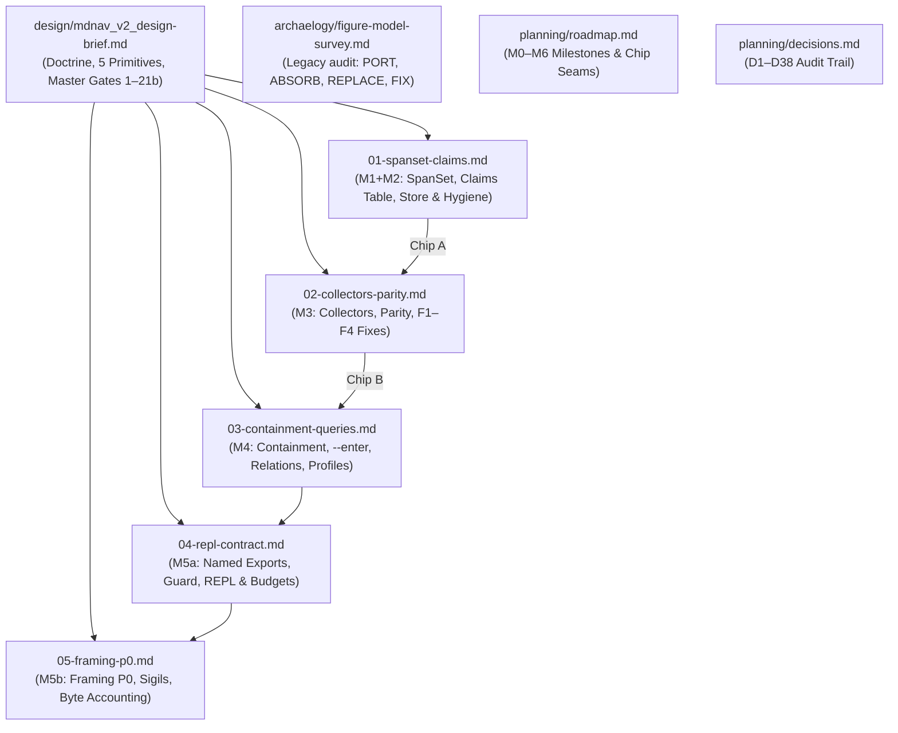

Listed directory mdnav_v2
Listed directory briefs
Listed directory planning
Listed directory design
Listed directory discussion
Viewed mdnav_v2_design-brief.md:1-330
Viewed decisions.md:1-52
Listed directory archaelogy
Viewed roadmap.md:1-306
Viewed 01-spanset-claims.md:1-160
Viewed 02-collectors-parity.md:1-131
Viewed 03-containment-queries.md:1-188
Viewed 04-repl-contract.md:1-154
Viewed 05-framing-p0.md:1-273
Viewed figure-model-survey.md:1-108

I have completed a thorough, end-to-end read-through and structural audit of the [design brief](file:///d:/aghado01/science-facility/issues/mdnav_v2/design/mdnav_v2_design-brief.md), the planning documents ([roadmap.md](file:///d:/aghado01/science-facility/issues/mdnav_v2/planning/roadmap.md), [decisions.md](file:///d:/aghado01/science-facility/issues/mdnav_v2/planning/decisions.md), [figure-model-survey.md](file:///d:/aghado01/science-facility/issues/mdnav_v2/archaelogy/figure-model-survey.md)), and all five implementation briefs ([01-spanset-claims.md](file:///d:/aghado01/science-facility/issues/mdnav_v2/briefs/01-spanset-claims.md) through [05-framing-p0.md](file:///d:/aghado01/science-facility/issues/mdnav_v2/briefs/05-framing-p0.md)).

---

### Executive Summary

The execution plan is **exceptionally well-engineered, mathematically grounded, and execution-ready**. 

The decomposition (decisions [D36](file:///d:/aghado01/science-facility/issues/mdnav_v2/planning/decisions.md#L49), [D37](file:///d:/aghado01/science-facility/issues/mdnav_v2/planning/decisions.md#L50), [D38](file:///d:/aghado01/science-facility/issues/mdnav_v2/planning/decisions.md#L51)) successfully separated high-altitude design canon from discrete, sequential phase briefs without losing any specifications or creating drift. Every phase has clear dependencies, distinct deliverables, and unambiguous test gates linked back to the master list.

---

### 1. Document Architecture & Seam Integrity

- **Canon vs. Execution Briefs:** Relocating the design canon to [mdnav_v2_design-brief.md](file:///d:/aghado01/science-facility/issues/mdnav_v2/design/mdnav_v2_design-brief.md) ensures that `briefs/` contains only single-milestone executable specifications.
- **Legacy Oracle Strategy:** The figure model ([skills/doc-dive/mdnav/mdnav.mjs](file:///d:/aghado01/science-facility/skills/doc-dive/mdnav/mdnav.mjs)) remains untouched. Capturing test baselines and stdout/stderr goldens across the 3.5 MB corpus in **M0** guarantees that "nothing currently working is discarded" ([D1](file:///d:/aghado01/science-facility/issues/mdnav_v2/planning/decisions.md#L13)) is empirically verifiable.
- **Clean Chip Seams:**
  - **Chip A (M0–M3):** Parity milestone. Ports old scanner semantics into the new claims architecture, then swaps in the new collectors to close F1–F4 defects under full golden equivalence.
  - **Chip B (M4–M5b):** Expansion milestone. Adds containment re-entry, relations, profiles, REPL/paging contracts, and stream framing.

---

### 2. Phase-by-Phase Assessment

#### [Phase 01 — `SpanSet`, Claims Table, Stores, Hygiene Layout](file:///d:/aghado01/science-facility/issues/mdnav_v2/briefs/01-spanset-claims.md) (M1 + M2)
- **Strengths:** 
  - `SpanSet` is decoupled into a standalone `span-set.mjs` with property tests tested against a brute-force bitmap oracle (Gate 2).
  - Columnar in-memory claims table layout (`starts[]`, `ends[]`, `kinds[]`, `sources[]`, `levels[]`, `priorities[]`, `ruleIds[]`, `containers[]`, `info[]`) enforces consistent coordinates across collectors.
  - Replaces per-run index accretion with a clean separation: corpus-scoped `index/` (stable `Dnnn` IDs) vs run-scoped `<stamp>/reads.jsonl` ([D15](file:///d:/aghado01/science-facility/issues/mdnav_v2/planning/decisions.md#L27)).
  - Whitelists `parseArgs` upfront to eliminate greedy boolean consumption (F4 fix).
- **Assessment:** **Rock-solid.** Populating the table initially via ported legacy scanners in M2 keeps the golden diff zero before the collector refactor in M3.

#### [Phase 02 — Collectors: State-Machine + Rule, Parity with F1–F4 Fixed](file:///d:/aghado01/science-facility/issues/mdnav_v2/briefs/02-collectors-parity.md) (M3)
- **Strengths:**
  - Unifies construct discovery under delimiter geometry: **Boundary** (partition), **Toggle** (prefix-parity XOR fold), and **Pair** (strict-stack pairing).
  - Replaces fragile regex fencing with CommonMark block start/end conditions 1–7.
  - Fixes F1 by scoping rule collectors over `Total \ coverage(fence ∪ html-comment ∪ frontmatter)` by default.
  - Fixes F2 by sharing a single break regex (`-{3,}|\*{3,}|_{3,}`) between `profile` and `--by breaks`.
- **Assessment:** **High confidence.** Exiting Chip A at Gate 16 (with only F1/F2 deltas permitted) isolates parser changes from query/containment additions.

#### [Phase 03 — Containment, Relations, Profiles, Generalized Queries](file:///d:/aghado01/science-facility/issues/mdnav_v2/briefs/03-containment-queries.md) (M4)
- **Strengths:**
  - **Source-Coordinate Re-entry:** Structural collectors re-enter region claim windows without derived masters or OffsetMaps ([D12](file:///d:/aghado01/science-facility/issues/mdnav_v2/planning/decisions.md#L24)).
  - **The `--enter` Knob:** Preserves heading ordinal stability (`Hnnnn`) while controlling activation via container transparency ([D11](file:///d:/aghado01/science-facility/issues/mdnav_v2/planning/decisions.md#L23)).
  - **Relations as Keyed Joins:** Core Markdown pairings (`footnote`, `link-ref`, `anchor` with GitHub-slugger deduplication, and `contains`) are computed at query time with residue tracking.
  - **Profiles as Data:** Encodes reader dispositions (`default`, `chat-export`) as JSON policies rather than hardcoded logic ([D3](file:///d:/aghado01/science-facility/issues/mdnav_v2/planning/decisions.md#L15), [D4](file:///d:/aghado01/science-facility/issues/mdnav_v2/planning/decisions.md#L16)).
- **Assessment:** Correctly fixes the previous roadmap drift by placing Gate 12 (`coverage` after strip) in M4 where the suppression algebra is active.

#### [Phase 04 — Exports, REPL / Paging / Budget Contract](file:///d:/aghado01/science-facility/issues/mdnav_v2/briefs/04-repl-contract.md) (M5a)
- **Strengths:**
  - Named exports (`Corpus`, `Doc`, `SpanSet`, `Selection`, `loadRules`, `loadProfile`, `materialize`, `Ledger`) wrapped in a win32-safe `isMain` guard.
  - Enforces the REPL contract: all queries return `{total, rows}` with mandatory `limit/offset` paging; previews are capped at the engine layer (Gates 17, 19).
  - Over-budget `materialize` returns a **plan** (zero bytes + narrowing anchors) rather than dumping content into the caller's context (Gate 18).
- **Assessment:** Provides a clean, minimal foundation for the eventual `server.mjs` without polluting the core engine.

#### [Phase 05 — Stream Framing P0 (Sigil Emission, Byte Accounting)](file:///d:/aghado01/science-facility/issues/mdnav_v2/briefs/05-framing-p0.md) (M5b)
- **Strengths:**
  - **P0 Scope Discipline:** Focuses strictly on atomic per-tool-result framing (`§` document unit, `¶` turn, `…` elision, `⁂` close) rather than prematurely solving multi-tool stream interleaving ([D35](file:///d:/aghado01/science-facility/issues/mdnav_v2/planning/decisions.md#L48)).
  - **Decoupled Trajectory:** Builds against the shared sigil direction without blocking on external spec freezes with `para-agent` ([D37](file:///d:/aghado01/science-facility/issues/mdnav_v2/planning/decisions.md#L50)).
  - **Strict Byte Accounting:** Mandates `Buffer.byteLength` throughout (accounting for 2-byte `§`/`¶` and 3-byte `…`/`⁂`) to prevent off-by-one budget drift (Gate 21b).
- **Assessment:** Well-bounded and resilient.

---

### 3. Master Exit Gate Verification Matrix

Every gate defined in [mdnav_v2_design-brief.md](file:///d:/aghado01/science-facility/issues/mdnav_v2/design/mdnav_v2_design-brief.md#L230-L323) is accounted for with 1:1 parity across the roadmap and implementation briefs:

| Gate | Description | Milestone | Brief | Verification Mechanism |
| :--- | :--- | :---: | :---: | :--- |
| **1** | Existing acceptance tests pass unchanged (F1/F2 inverted) | M0/M2/M3 | [01](file:///d:/aghado01/science-facility/issues/mdnav_v2/briefs/01-spanset-claims.md), [02](file:///d:/aghado01/science-facility/issues/mdnav_v2/briefs/02-collectors-parity.md) | `test/acceptance.mjs` against `MDNAV_BIN` |
| **2** | `SpanSet` algebra vs. brute-force bitmap oracle (≥200 sets) | M1 | [01](file:///d:/aghado01/science-facility/issues/mdnav_v2/briefs/01-spanset-claims.md) | Property-based unit test suite |
| **3** | Claims table, `MemoryStore`/`SidecarStore`, schema 3, hygiene layout | M2 | [01](file:///d:/aghado01/science-facility/issues/mdnav_v2/briefs/01-spanset-claims.md) | Invalidation, ID stability & run pruning tests |
| **4** | Rule collector line/whole scoping & bad rule syntax failure | M3 | [02](file:///d:/aghado01/science-facility/issues/mdnav_v2/briefs/02-collectors-parity.md) | Scope bounding & load error assertion tests |
| **5** | Fenced `data:` URI and `
` survive `--strip all` | M3 | [02](file:///d:/aghado01/science-facility/issues/mdnav_v2/briefs/02-collectors-parity.md) | Triage notes & strip test fixture |
| **6** | Multi-line `<!-- … -->` claim elided, `#` inside not a heading | M3 | [02](file:///d:/aghado01/science-facility/issues/mdnav_v2/briefs/02-collectors-parity.md) | HTML comment multi-line fixture |
| **7** | `# x` inside a code fence is not a heading | M3 | [02](file:///d:/aghado01/science-facility/issues/mdnav_v2/briefs/02-collectors-parity.md) | Regression test fixture |
| **8** | Nested heading in `
`/`>` active only under `--enter` | M4 | [03](file:///d:/aghado01/science-facility/issues/mdnav_v2/briefs/03-containment-queries.md) | Partition invariant test under `(depth, enter)` |
| **9** | `***` and `----` break segmentation parity | M3 | [02](file:///d:/aghado01/science-facility/issues/mdnav_v2/briefs/02-collectors-parity.md) | Shared break regex assertion test |
| **10** | Footnotes & link-ref relations, dangling refs, `read --only` | M4 | [03](file:///d:/aghado01/science-facility/issues/mdnav_v2/briefs/03-containment-queries.md) | Footnote fixture & `marks --resolve` test |
| **10b**| Generic basis (`--by fence`, `--by pattern:`) & partition invariant | M4 | [03](file:///d:/aghado01/science-facility/issues/mdnav_v2/briefs/03-containment-queries.md) | Byte-for-byte tiling assertion per basis |
| **11** | `read --only` reconstruction (`--only K` ⊕ `--strip K` = unit) | M4 | [03](file:///d:/aghado01/science-facility/issues/mdnav_v2/briefs/03-containment-queries.md) | Exact byte reconstruction assertion |
| **12** | `coverage` accounting with kept citation labels | M4 | [03](file:///d:/aghado01/science-facility/issues/mdnav_v2/briefs/03-containment-queries.md) | Ledger read minus elided coverage math |
| **13** | `discover --recursive .` ≡ `discover . --recursive` | M2 | [01](file:///d:/aghado01/science-facility/issues/mdnav_v2/briefs/01-spanset-claims.md) | Flag order equivalence test |
| **14** | Unmodified `read` byte fidelity covenant | M2 | [01](file:///d:/aghado01/science-facility/issues/mdnav_v2/briefs/01-spanset-claims.md) | Exact source span byte comparison |
| **15** | `import('./mdnav.mjs')` resolves without running CLI | M5a | [04](file:///d:/aghado01/science-facility/issues/mdnav_v2/briefs/04-repl-contract.md) | ESM programmatic import test |
| **16** | 3.5 MB real corpus golden equivalence (with named deltas) | M0/M2/M3/M4 | [01](file:///d:/aghado01/science-facility/issues/mdnav_v2/briefs/01-spanset-claims.md)–[03](file:///d:/aghado01/science-facility/issues/mdnav_v2/briefs/03-containment-queries.md) | Binary golden diff runner |
| **17** | `select`/`partition`/`marks` honour `limit/offset` + `total` | M5a | [04](file:///d:/aghado01/science-facility/issues/mdnav_v2/briefs/04-repl-contract.md) | Paging & slicing unit tests |
| **18** | `materialize` over `maxBytes` returns zero-byte plan + anchors | M5a | [04](file:///d:/aghado01/science-facility/issues/mdnav_v2/briefs/04-repl-contract.md) | Budget refusal test |
| **19** | Engine-level preview cap on table query fields | M5a | [04](file:///d:/aghado01/science-facility/issues/mdnav_v2/briefs/04-repl-contract.md) | Truncation & snippet bounding tests |
| **20** | CLI exposes `--max-bytes` and `--limit/--offset` | M5a | [04](file:///d:/aghado01/science-facility/issues/mdnav_v2/briefs/04-repl-contract.md) | CLI argument pass-through test |
| **21** | Framing round-trip & `--sigils legacy-comment` golden identity | M5b | [05](file:///d:/aghado01/science-facility/issues/mdnav_v2/briefs/05-framing-p0.md) | Round-trip header parser test |
| **21b**| Byte accounting: total bytes == Σ headers + Σ content_bytes | M5b | [05](file:///d:/aghado01/science-facility/issues/mdnav_v2/briefs/05-framing-p0.md) | Header buffer byte-length assertions |

---

### 4. Key Implementation Watchpoints

When executing these briefs, the following critical implementation details from the briefs and survey should be kept front-of-mind:

1. **UTF-8 Byte Length vs. Char Length (Phase 05):**
   In JavaScript, `str.length` counts UTF-16 code units (where `§` is length 1). All framing arithmetic and budget checks must use `Buffer.byteLength(str, 'utf8')` (`§` is 2 bytes, `…`/`⁂` are 3 bytes).
2. **CommonMark HTML Block Termination (Phase 02):**
   Types 6 and 7 terminate on the **first blank line**, *never* on a matching closing tag. This prevents unclosed tags in malformed HTML transcripts from swallowing the remainder of the file.
3. **GFM Slug Deduplication Ordering (Phase 03):**
   Duplicate heading titles must receive suffixes (`-1`, `-2`, etc.) in **strict document ordinal order** so `#fragment` references resolve to the correct occurrence.
4. **Windows Path Normalization for `isMain` (Phase 04):**
   Drive letter casing and slash direction vary across `import.meta.url` and `process.argv[1]`. Use `realpathSync.native()` with case-insensitive comparison on Windows.

---

### Conclusion

The execution plan is complete, tightly cross-referenced, and ready to begin at **M0** (capturing legacy goldens) and **M1** (implementing [01-spanset-claims.md](file:///d:/aghado01/science-facility/issues/mdnav_v2/briefs/01-spanset-claims.md)).