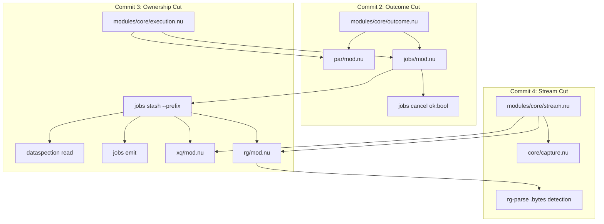

Viewed grok-engine-fixes-plan.md:1-285
Listed directory nushell-mcp
Viewed composition-v1.md:1-292
Viewed sol-engine-fixes.md:1-156
Listed directory nushell-mcp
Listed directory modules
Listed directory core
Viewed mod.nu:1-219
Viewed mod.nu:1-505
Viewed capture.nu:1-59
Viewed failure.nu:1-20
Viewed mod.nu:1-89
Viewed mod.nu:1-180
Viewed par-jobs-v1.nu:1-100
Viewed par-jobs-v1.nu:100-250
Viewed par-jobs-v1.nu:251-454
Viewed xq-v1.nu:1-155
Viewed rg-v1.nu:1-100
Viewed rg-v1.nu:101-224
Listed directory dataspection
Viewed mod.nu:1-61
Viewed dataspection-v1.nu:1-100
Viewed dataspection-v1.nu:200-287

An audit of the design robustness, semantic correctness, layering, and implementation footguns in [grok-engine-fixes-plan.md](grok-engine-fixes-plan.md) follows.

---

### Executive Verdict

**The plan is sound, robust, and properly scoped.** It faithfully operationalizes [composition-v1.md](../briefs/composition-v1.md) and addresses the root causes diagnosed in [sol-engine-fixes.md](sol-engine-fixes.md). 

The 3-cut sequence cleanly decouples outcome projection, execution context/quarantine authority, and binary stream sizing into incremental, testable units without creating circular dependencies.

---

### 1. Architecture & Design Strengths

1. **Strict separation of Lifecycle (`status`) and Domain Outcome (`ok`):**
   - Today's harvest bug (`jobs-apply` setting `status: failed` whenever `msg.ok == false`) drops the payload for domain failures.
   - Distinguishing `returned: bool` (did closure complete without throwing?) from `ok: bool` (is the returned outcome successful?) ensures that domain failures receive `status: completed, ok: false` and retain their payload in `$env.JOBS`, keeping progressive disclosure (`jobs read` / `jobs fetch`) fully functional.
2. **Execution Context Matrix:**
   - Identifying `foreground` (owner), `job` (background job), and `worker` (`par` thread) eliminates two insidious bugs:
     - Environment mutations in Rayon threads disappearing, leading to phantom tags.
     - Non-owning workers or background jobs calling `job recv` on `JOBS_MBOX` and permanently stealing messages from the foreground mailbox.
3. **Registry-Owned Tag Allocation (`jobs stash --prefix`):**
   - Moving from client-predicted tags (`jobs list | length` / `jobs-next-seq`) to atomic foreground allocation resolves tag collision races across parallel workers and removes `jobs list` imports from query wrappers.
4. **Binary-Aware Stream Sizing:**
   - Replacing the lossy `utf8-bytes` (which caught errors and returned `0`, bypassing output caps for binary outputs) with typed `stream bytes` closes the disclosure cap leak for binary/mixed streams.

---

### 2. Deep Audit of the 3 Implementation Cuts

#### Commit 2: `outcome.nu` + `par`/`jobs` Composition + `cancel`
- **`outcome project` Contract:**
  - Record: Top-level boolean `ok`. If `ok: false`, lifted error string (fallback `"failed"`).
  - Table / List: Every item is a record with boolean `ok` $\rightarrow$ aggregate with `all`. Outer error: `"<n> of <total> failed"`.
  - Empty or non-outcome value $\rightarrow$ `{declared: false, ok: true, error: null}`.
  - **No recursion:** Arbitrary subfields (`value`, `meta`, `findings`) are ignored.
- **`par`:** Retains the full failure value in `row.value` (including `tag`, `retrieve`, `meta`), sets `row.ok: false`, and lifts `row.error`.
- **`jobs-apply`:** Sets `row.status: "completed"`, `row.ok: $proj.ok`, and stores the full `$msg.output` on the row.
- **`jobs cancel`:** Uniformly returns `{ok: bool, cancelled: bool, job_id: int, ...}` across all paths (missing, non-running, running, non-owner).

#### Commit 3: `execution.nu` + Registry Authority
- **Detection Rules:**
  - `(job id) != 0` $\rightarrow$ `kind: "job", owns_registry: false, in_job: true`.
  - `$env.NU_EXEC_WORKER == "1"` $\rightarrow$ `kind: "worker", owns_registry: false, in_job: ($env.NU_EXEC_IN_JOB == "1")`.
  - Else $\rightarrow$ `kind: "foreground", owns_registry: true, in_job: false`.
- **The 3-Context Behavior for Over-Cap Output:**
  - **Foreground Owner:** Stash with `--prefix`, return confirmed `tag`.
  - **Background Job (including `par` inside job):** Return full streams inline (`truncated: false`), no stash, no tag.
  - **Foreground Worker:** Return `ok: false, truncated: false` (or `disclosed: false`), no tag, error advising wrapping in `jobs spawn`.

#### Commit 4: `stream.nu` + `process capture` + Ripgrep Bytes
- **`stream bytes`:**
  - String $\rightarrow$ `str length --utf-8-bytes`.
  - Binary $\rightarrow$ `bytes length`.
  - Other $\rightarrow$ `{ok: false, bytes: null, error: ...}`, never defaulting to 0.
- **`process capture`:**
  - `ok: true` represents successful spawn and capture, regardless of child exit code.
  - `ok: false` is reserved for spawn failures (binary missing, permissions, etc.).
  - Preserves forwarded `args` and diagnostic `trace` on all failure paths.
- **`rg-parse` Encoding Detection:**
  - If a JSON event has `data.path.bytes` or `data.lines.bytes` without text, `rg-parse` returns an explicit unsupported encoding failure, preventing `file: ""` and `match: ""`.

---

### 3. Footguns & Implementation Nuances

| Area | Potential Footgun | Recommended Resolution |
|---|---|---|
| **Nushell Table/List Types** | In Nushell, heterogeneous lists of records have describe `list<record>` or `list<any>`, while uniform tables have `table<...>`. Checking `describe =~ '^table'` will miss valid record lists. | In `outcome project`, validate rows with: `$val \| all {\|r\| (($r \| describe) \| str starts-with "record") and ("ok" in ($r \| columns)) and (($r.ok \| describe) == "bool") }` |
| **Worker `$env` Restoration** | If `par` mutates `$env` directly to set the worker marker and an unhandled error occurs, the marker might leak into the caller's scope. | Use Nushell's `with-env { NU_EXEC_WORKER: "1", NU_EXEC_IN_JOB: (if $in_job { "1" } else { "0" }) } { ... }` inside `par main`. Scoping is guaranteed and restored even on throws. |
| **Mailbox Protection Gate** | If any internal helper inside `jobs.nu` calls `jobs-harvest` or `jobs-drain`, a worker could invoke it. | Guard the entry point of `jobs-harvest` and `jobs-drain` with: `if not (execution context).owns_registry { return }` Non-owners safely inspect `$env.JOBS` snapshot only. |
| **Prefix Allocation Collisions** | When finding the smallest `n >= 0` for `$prefix:<n>`, checking `seq` is insufficient if prior tags were created out of order (e.g. `--tag rg:2`). | Compute candidates against existing tags in `$env.JOBS`: `mut n = 0; loop { let c = $"($prefix):($n)"; if not ($c in $existing_tags) { return $c }; $n = $n + 1 }` |
| **`jobs emit` in Job Context** | If `jobs emit` runs inside a background job, `par emit` might truncate findings if over cap, but `jobs emit` cannot stash. | `jobs emit` should check `if (execution context).in_job { ... }` and return the envelope with findings inline (`truncated: false`, no tag). |
| **Missing Binary Spawn Errors** | `complete` on Windows returns localized OS errors (e.g., `"The system cannot find the file specified"`). Relabeling non-matching errors might break existing tests expecting `"not found: <cmd>"`. | Check for substrings `"not found"`, `"cannot find"`, or `"executable not found"`. If matched, normalize to `$"not found: ($cmd)"`; otherwise preserve the raw error. |
| **Existing Suite Assertions** | `tests/par-jobs-v1.nu` line 340 asserts `assert-eq $auto.tag "stash:1"`. Under prefix allocation starting at 0, an auto-tag on an empty prefix namespace produces `stash:0`. | As noted in the plan, update this assertion to verify prefix format and fetchability rather than `seq` equality. |

---

### 4. Layering & Repo Hygiene Checklist

- [x] **Layering A Compliance:** `core/outcome.nu`, `core/execution.nu`, and `core/stream.nu` import no higher modules (`par`, `jobs`, `dataspection`, `xq`, `rg`).
- [x] **Façade Boundary:** `dataspection/mod.nu` re-exports none of the three new core units.
- [x] **Commit Hygiene:** Follows the pointed commit sequence; does not touch dirty snapshot files (`reposnapshot`); stages only explicit `mcp/nushell-mcp/...` and `issues/nushell-mcp/...` paths.
- [x] **Documentation & Adapter Parity:** Updates docstrings, references (`jobs.md`, `search.md`), and the 3 client adapters (`~/.claude`, `~/.grok`, `~/.codex`) alongside each cut.

The plan is ready to execute.