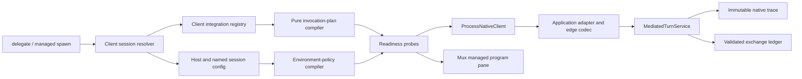

The implementation should run in five bounded waves, with at most three workers plus the root integrator. Grok is added only after the client-agnostic substrate and existing clients have crossed onto it.

No swarm has been dispatched yet.

## Starting point

- Baseline commit: `e426a4a` on `main`, four commits ahead of `origin/main`.
- Manifest gate verified now: **17 suites / 165 passed / 0 failed, skipped, or cancelled**.
- Grok: `1.0.4 (d846eb93d9)`, resolved through `PATH`.
- Current adapter profiles: Claude and Codex verified; AGY intentionally unverified.
- Two unrelated `issues/mcp/discussion` changes appeared concurrently after the baseline check. They will remain untouched through named-path staging.

## Target architecture

The separations are load-bearing:

- Application adapter: prompt codec, native events, correlation, terminal evidence, reply assembly.
- Client integration profile: executable, modes/surfaces, arguments, stdio topology, workspace policy, supported session controls, readiness recipes.
- Host binding: executable override and named environment sources; never committed secrets.
- Session profile: named, client-agnostic policy resolved into client-specific flags/environment.
- Invocation plan: immutable per-turn command, cwd, input carrier, environment, readiness result, and redacted receipt.
- Process and mux backends: execution only; they do not interpret client semantics.

The domain layer will consume neutral objects through a `ClientConfigProvider` interface. JSON Schema/JSON will be the first package and host-file provider because Ajv is already authoritative, but the backend will not depend on JSON as the only future configuration syntax.

## Public surface

Existing calls remain compatible.

- `delegate` gains optional `cwd` and `sessionProfile`.
- `application` remains the client selector for now, avoiding an unnecessary API rename.
- `delegate` will never accept arbitrary environment values or secrets.
- `spawn` gains a managed shape using `client` plus `sessionProfile`, mutually exclusive with raw `command`.
- Raw `spawn(command, env)` remains an explicit console escape hatch.
- Named session profiles compile semantic policy such as workspace access, memory, subagents, web access, and tool exposure. Unsupported mappings fail closed rather than being silently ignored.

Configuration precedence is frozen as:

1. Package client defaults.
2. Host binding.
3. Named session profile.
4. Explicitly allowed operation controls.
5. Client CLI flags, where the client documents them as authoritative.

## Wave 0 — Contract and Grok evidence freeze

Three read-only lanes:

| Worker                 | Assignment                                                                                                                                    |
| ---------------------- | --------------------------------------------------------------------------------------------------------------------------------------------- |
| `grok-protocol`        | Capture Grok 1.0.4 help, inspect output, version, exact headless stream shape, terminal event, session identity, and prompt-carrier behavior. |
| `integration-contract` | Adjudicate adapter versus integration versus host/session configuration responsibilities and current transcript implications.                 |
| `environment-security` | Freeze Windows environment inheritance, casing, secret handling, workspace anchoring, stdio, prompt-file lifecycle, and receipt redaction.    |

Root-owned output:

- `mcp/para-agent/contract/CLIENT-INTEGRATION-CONTRACT.md`
- Grok 1.0.4 fixture matrix.
- Configuration precedence and failure vocabulary.
- Exact decision between stdin and `--prompt-file`; the prompt must never enter argv.
- Explicit Windows sandbox status. Grok’s sandbox cannot be claimed as enforcement without evidence.

The only external side effect is one minimal, tool-disabled Grok turn for version-labelled native-stream evidence. It will create a normal Grok session artifact and consume a small model call.

Exit gate:

- Prompt transport is byte-exact and evidenced.
- Native terminal/reply assembly is understood.
- Environment and secret invariants are frozen.
- Grok remains unverified if any required evidence is absent.

Commit: `para-agent: freeze client integration contract`

## Wave 1 — Client-agnostic substrate

Parallel, exclusive ownership:

| Worker               | Owned implementation                                                                         |
| -------------------- | -------------------------------------------------------------------------------------------- |
| `client-registry`    | Integration/host/session schemas, registry, cross-profile validation, fake profiles.         |
| `environment-config` | Configuration providers, environment compiler, precedence, redaction, stable policy digests. |
| `invocation-core`    | Launch-plan compiler, readiness runner, stdio topology, prompt carrier and cleanup.          |

Likely new paths:

- `src/client-registry.js`
- `src/client-config.js`
- `src/environment-policy.js`
- `src/invocation-plan.js`
- `src/readiness.js`
- `src/prompt-carrier.js`
- `src/clients/`
- `src/schemas/client-integration.schema.json`
- `src/schemas/client-host-config.schema.json`
- `src/schemas/client-session-profile.schema.json`

Required tests:

- Invalid, duplicate, or cross-incompatible profiles fail startup atomically.
- Windows environment names are treated case-insensitively; collisions reject.
- Required variables, explicit unset, inheritance, and precedence work deterministically.
- Secret values never appear in receipts, errors, traces, snapshots, or test output.
- Host paths are absent from public receipts.
- Hostile Unicode prompt bytes survive stdin/file transport exactly.
- Prompt content never appears in argv.
- Temporary prompt files are contained and cleaned on success, spawn failure, timeout, and cancellation.
- Readiness handles missing executable, timeout, malformed result, and version drift.
- Equivalent configuration produces a stable digest.

Exit gate: the new layer works entirely against fake clients without changing production mediation.

Commit: `para-agent: add client integration substrate`

## Wave 2 — Atomic runtime cutover and existing-client migration

Root owns shared runtime wiring:

- Split command construction out of [adapters.js](D:/aghado01/science-facility/mcp/para-agent/src/adapters.js).
- Update the adapter schema so adapters retain native transport/event semantics but no executable authority.
- Inject the client registry and invocation planner into [mediated-turn.js](D:/aghado01/science-facility/mcp/para-agent/src/mediated-turn.js).
- Extend [native-client.js](D:/aghado01/science-facility/mcp/para-agent/src/native-client.js) to consume the compiled cwd/environment/input plan without mutating the parent environment.
- Wire managed client spawning through [index.js](D:/aghado01/science-facility/mcp/para-agent/src/index.js).
- Add a typed, non-secret invocation descriptor to durable acceptance and terminal exchange records.
- Run readiness before durable acceptance so an unprovisioned client creates no accepted exchange.

Three profile workers:

| Worker             | Exclusive profiles                                                                |
| ------------------ | --------------------------------------------------------------------------------- |
| `claude-migration` | Claude adapter, integration profile, environment declarations, conformance tests. |
| `codex-migration`  | Codex equivalents.                                                                |
| `agy-migration`    | AGY equivalents while preserving fail-closed/unverified mediation.                |

Critical invariant: there must never be two active command authorities. The adapter-command removal and all three integration profiles land in one atomic wave commit.

Exit gate:

- Existing `delegate` behavior remains compatible.
- Claude/Codex fixtures remain exact.
- AGY still fails closed.
- Managed and raw pane modes are distinct.
- Invocation configuration is durably attributable without values or host topology.
- Original 165 tests plus new suites pass.

Commit: `para-agent: migrate clients onto integration substrate`

## Wave 3 — Grok 1.0.4 implementation

| Worker             | Assignment                                                                                                                                  |
| ------------------ | ------------------------------------------------------------------------------------------------------------------------------------------- |
| `grok-native`      | Grok adapter profile, native fixture, event mappings, terminal detection, and an edge codec if streamed reply chunks require concatenation. |
| `grok-integration` | Grok executable/mode profile, environment declaration, workspace anchoring, readiness and session-policy projections.                       |
| `grok-e2e`         | Independent conformance, MCP round-trip, live-gate harness, and prompt/reply digest verification.                                           |

Grok’s initial mediated mode should use:

- Headless `streaming-json`.
- `--verbatim`.
- No memory, subagents, or web access for the conformance pilot.
- A read-only tool surface.
- Explicit permission policy.
- Correct project cwd so `AGENTS.md`, `.mcp.json`, skills, and compatibility sources load.
- `grok inspect --json` as a no-model provisioning probe.
- Exact version gating on `1.0.4`.

Only observed facts are enabled:

- Model identity remains absent if the stream does not expose it.
- Tool/reasoning capabilities remain false unless captured.
- Native session/request IDs are recorded only from native events.
- Windows sandbox enforcement remains `unsupported` or `unknown`, even if a sandbox flag is passed.
- Questionable variables from the install note are not admitted into the runtime profile without evidence.

Exit gate:

- `grok/1.0.4` passes the common adapter and integration suites.
- Final reply reconstruction is exact, including streamed chunks.
- Version drift fails before acceptance.
- A real read-only Grok turn passes prompt, terminal, trace, receipt, and reply-digest checks.
- No repo mutation occurs during the live pilot.

Commit: `para-agent: add verified grok 1.0.4 client`

If the live stream or prompt carrier fails conformance, the Grok profile lands only as unverified while Waves 1–2 remain useful and green.

## Wave 4 — Cross-client hardening and release audit

| Worker                   | Assignment                                                                                                              |
| ------------------------ | ----------------------------------------------------------------------------------------------------------------------- |
| `security-audit`         | Secret/path leaks, environment collisions, prompt artifacts, cancellation, process cleanup, unsupported sandbox claims. |
| `extensibility-audit`    | Prove a fake fifth client can be added through profiles/codec only, without changing backend event semantics.           |
| `release-reconciliation` | README, contract, Grok notes, skill examples, generated status, and exact verification boundaries.                      |

Release gates:

- No client executable, flags, environment names, or native event names leak into the generic service layer.
- No broad client configuration mutation is performed by the runtime.
- Configuration deployment remains separate from mediation.
- Manifest coverage includes every new suite.
- Bounded runner reports zero failures, skips, cancellations, aborts, or count mismatch.
- Existing live Windows gate and the new live Grok gate pass separately.
- Reports distinguish implemented, bounded-verified, live-verified, unverified, and deferred.
- Root stages named paths only and commits to `main`.

Commit: `para-agent: harden client integration release`

## Explicitly deferred

This implementation leaves extension seams for, but does not absorb:

- Native resume/continue operations.
- Async exchange handles and wake signals.
- ACP/app-server control-mode transports.
- Session Continuity and reconstructed GGUF context.
- Shared-MCP deployment/projection.
- Addressable length-prefixed context framing.
- Personas and general swarm guidance redesign.
- Privileged edits to Claude, Cursor, Codex, Grok, or other global client configuration.

Those become consumers of the client registry once its launch, environment, provisioning, and receipt contracts are trustworthy.
