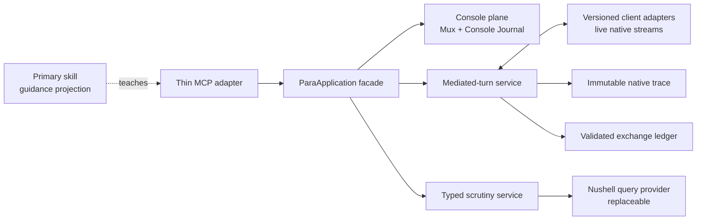

The remediation should be contract-first and vertical-slice driven. The current Nu layer is useful scaffolding, but it is not yet a completed mediation engine.

> **SUPERSEDED (2026-08-15) — historical plan, not current status.**
> Current canon is [../planning/](../planning/): [decisions.md](../planning/decisions.md),
> [roadmap.md](../planning/roadmap.md), [ledger.md](../planning/ledger.md).
> Design authority is the frozen [contracts](../../../mcp/para-agent/contract/).
> This document's Wave 0–4 numbering collides with the identically numbered sequence in
> [sol-client-integration-updates-20260414.md](sol-client-integration-updates-20260414.md);
> the two describe different work. Outstanding items from its release gates are carried into
> the honesty-gaps track of [roadmap.md](../planning/roadmap.md).
> The appended `# Fable Review` section is duplicated verbatim in
> [fable-sol-remediation-plan-review.md](fable-sol-remediation-plan-review.md).

> **Historical-plan notice (2026-08-14):** The original proposal and the appended Fable review below describe the pre-remediation checkout. They are preserved as planning and audit evidence, including statements such as “no files were changed.” They are not current implementation status. The [Execution and reconciliation](#execution-and-reconciliation-2026-08-14) section appended after the review is the operative status record.

### What the audit established

- Both Fable bugs reproduce on pinned Nu 0.114.1: runtime errors resolve as successful pseudo-JSON strings, and summary `scrutinize` fails on missing `duration_ms` ([nu.js](D:/aghado01/science-facility/mcp/para-agent/src/nu.js:23), [index.js](D:/aghado01/science-facility/mcp/para-agent/src/index.js:735)).
- The existing three-row transcript specimen is **0/3 schema-valid**:
  - Header generation writes `default_client`, while the schema requires `application` and `adapter` ([transcript.js](D:/aghado01/science-facility/mcp/para-agent/src/transcript.js:50), [header schema](D:/aghado01/science-facility/mcp/para-agent/src/schemas/transcript-header.schema.json:198)).
  - Exchange record schemas combine `allOf` with subtype-local `additionalProperties:false`, making required base fields such as `_timestamp` illegal ([exchange schema](D:/aghado01/science-facility/mcp/para-agent/src/schemas/transcript-exchange.schema.json:113)).
- `ExchangeAssembler` and `AdapterEngine` are imported but not connected to `run`, `send`, `wait`, or `read`. No mediated exchange write path currently exists.
- The adapter loader does not validate profiles or initialize at startup. Its model fallback substitutes an application display name for a live model identity ([assembler.js](D:/aghado01/science-facility/mcp/para-agent/src/assembler.js:116)).
- The primary skill currently documents nonexistent or drifted calls including `killSession`, `capture`, `stableMs`, and `forPattern`, while promising durable exchange traces that are not produced ([lifecycle.md](D:/aghado01/science-facility/mcp/para-agent/skills/primary/references/lifecycle.md:46), [execution.md](D:/aghado01/science-facility/mcp/para-agent/skills/primary/references/execution.md:44)).
- There is no committed para-agent test suite or `test` package script. The architecture report’s claimed end-to-end test does not exist ([architecture report](D:/aghado01/science-facility/issues/para-agent/reports/mediated-transcript-and-nu-engine-architecture.md:207)).

The early design’s ontology remains right: para-agent owns a third mediated transcript, whose prompt and receiver trace have asymmetric authorities ([sol drafting](D:/aghado01/science-facility/issues/para-agent/notes/sol-transcript-drafting.md:45)).

### Architectural anchor

The load-bearing boundaries are:

- Console Journal remains command/process evidence; it does not become the inter-agent transcript.
- A distinct typed `delegate` operation should own one mediated prompt/reply transaction. `send`/`wait`/`read` remain interactive escape hatches and must not have exchange boundaries inferred afterward.
- The ingress prompt is authoritative at MCP admission. Model identity, exposed reasoning, tools, and terminal reply come from the receiver’s live structured stream.
- Raw native events remain immutable evidence. Normalized exchange records are source-linked projections, not replacements.
- Nu is an internal execution/query provider. It does not own schemas, authority, validation, or public query semantics.
- The primary skill is a downstream teaching projection over the actual operation catalog.

### Swarm plan

The swarm should run as root integrator plus no more than three parallel workers, with exclusive file ownership in each wave.

| Wave                         | Parallel workers                                          | Work                                                                                                                                                                                                       | Exit gate                                                                                                                                              |
| ---------------------------- | --------------------------------------------------------- | ---------------------------------------------------------------------------------------------------------------------------------------------------------------------------------------------------------- | ------------------------------------------------------------------------------------------------------------------------------------------------------ |
| **0 — Contract freeze**      | `exchange-contract`, `execution-path`, `verification-map` | Independently adjudicate participant/application/model identity, authority, exchange state, delivery evidence, raw-trace relationships, JSON Schema composition, and false-green verification risks. Workers remain read-only; root alone writes the canonical contract. | A compact mediated-exchange contract and executable fixture matrix accepted before code changes, with JSON Schema 2020-12 and the test-runner abort contract explicitly frozen. |
| **1 — Foundations**          | `store-schema`, `nu-query`, `adapter-core`                | Repair schemas/store; make Nu typed and safe; build validated versioned adapter profiles.                                                                                                                  | Every emitted fixture validates; all Nu failures reject structurally; concurrent indexes are unique; adapter startup fails closed on invalid profiles. |
| **2 — Vertical slice**       | `mediated-turn`, `console-hardening`, `e2e-harness`       | Implement `ParaApplication.delegate`, exact ingress capture, per-conversation serialization, native-stream terminal detection, commit, receipt, and thin MCP wiring. Preserve existing console primitives. | Deterministic fake-client test plus one real-client round trip proves prompt/reply hashes, provenance, terminal outcome, and scrutiny.                 |
| **3 — Client conformance**   | One worker each for Codex, Claude, and AGY                | Capture version-labelled native stream fixtures and implement only evidenced mappings, capabilities, terminal detection, and model provenance.                                                             | No transcript/SQLite identity fallback; unsupported observations are explicit; all three profiles pass the common conformance suite.                   |
| **4 — Guidance and release** | `primary-skill`, `report-reconciliation`, `release-audit` | Repair skill calls and recipes, reconcile README/reports, replace prose verification claims with generated evidence, and run the full matrix.                                                              | Every skill example validates against the live MCP schema; all reports accurately distinguish implemented, tested, and aspirational behavior.          |

### Wave-specific requirements

For `store-schema`:

- Keep the persisted dialect at JSON Schema 2020-12 and make Ajv 8 plus `ajv-formats` direct dependencies.
- Remove subtype-local `additionalProperties: false`; close composed record variants with `unevaluatedProperties: false` after all contributing properties have been evaluated.
- Validate headers and exchanges before writing.
- Allocate `exchange_index` inside the serialized writer transaction.
- Parse records rather than substring-counting them.
- Use safe internal transcript identities rather than interpolated handle paths.
- Make scrutiny read-only; inspecting an unknown session must not create a transcript.
- Define torn-tail, malformed-row, retry, interrupted, and idempotent-commit behavior.
- State the actual single-writer/locking guarantee instead of claiming generic atomicity.

For `nu-query`:

- Split strict structured evaluation from any explicit raw-text mode.
- Emit valid JSON error envelopes and reject on Nu errors, malformed output, nonzero exit, timeout, cancellation, or buffer exhaustion.
- Replace interpolated `xid` and file paths with typed/bound parameters.
- Put transcript selectors behind a typed query compiler.
- Benchmark process-per-query Nu before retaining “high-performance” language.

For `adapter-core`:

- Add direct schema-validation dependencies rather than relying on transitive Ajv.
- Validate application/version, native schema, capabilities, command mappings, confirmation events, and effective timing.
- Preserve opaque `model.id` and separate it from `model.display_name` and application display name.
- Represent unavailable reasoning/tool provenance honestly.
- Permit client-specific edge codecs when declarative paths are insufficient; vendor logic stays at the adapter boundary.
- Remove heuristic normalization where it could silently fabricate provenance.

For the mediated vertical slice:

- Accept one exact prompt plus separate control arguments.
- Enforce one in-flight turn per native conversation/pane.
- Commit a terminal row for every accepted prompt: `completed`, `failed`, `interrupted`, or `timeout`.
- Return the receiver-authoritative terminal reply with a bounded receipt.
- Record the strongest evidenced delivery stage without claiming client receipt or model comprehension.
- Keep raw native traces externally addressable and make scrutiny disclose omissions and coverage.
- Prove the contract first with a deterministic fake adapter; select the real-client pilot from the clearest current versioned stream evidence rather than convenience.

### Verification contract

Tests should live under `mcp/tests/para-agent/`, using `node:test` plus a portable PowerShell runner. Release requires:

- JSON Schema meta-validation and positive/negative fixtures.
- Nu success, quoting, Unicode, runtime error, syntax error, timeout, cancellation, and injection tests.
- A named `NU-SCRUTINY-FALSE-SUCCESS` regression proving a Nu failure becomes `isError: true`, never successful pseudo-JSON, and performs no transcript mutation.
- Concurrent commit and restart/resume tests.
- Path traversal and “read must not write” tests.
- Fake native-stream adapter conformance.
- Live Windows smoke against pinned Nu 0.114.1 and psmux 3.3.7.
- Prompt-delivery and returned-reply digest equality.
- Model provenance from live stream events only.
- MCP client tests for `delegate`, `scrutinize`, and every primary-skill example.
- Regression coverage for existing `run`, `send`, `wait`, `read`, journal, cancellation, and retention behavior.
- A manifest-driven PowerShell runner that emits `SUITE-ABORTED` on terminating errors and fails on zero discovery, discovered/completed suite mismatch, nonzero child exit, any aborted suite, or a missing terminal summary.

### Scope controls

This remediation should not absorb Hashish, Session Continuity, a general Artifact engine, control-mode transport, or a broad tool-surface redesign. It establishes the application seam and one trustworthy mediated-turn path while retaining lower-level console operations.

Nu remains important, but as a replaceable provider beneath typed semantics. The primary skill remains concise and platform-neutral; its one-level references and progressive disclosure are worth keeping, but examples must be contract-tested.

No files were changed and no swarm was dispatched. The worktree remains on `main`, ahead of origin by seven commits, with the two referenced reports still untracked. During execution, the root integrator should stage named files only and commit to `main`; those untracked reports should not be swept into a commit accidentally.

Exact external-client stream schemas are drift-prone, so the earlier design notes should guide authority and adapter shape, while Wave 3 recaptures current live evidence before claiming client completeness.

# Fable Review

Seven for seven so far — the audit is accurate. Two last spot-checks: the header schema's required fields and the skill-doc drift claim.

I read the plan and verified its audit against the code before forming a view. Bottom line: **the audit is accurate — every claim I spot-checked (nine of nine) reproduces exactly at the cited locations — and the plan's shape is right.** I'd execute it as written, with two sharpenings folded into Wave 0.

## Verification of the audit

| Claim                                                                     | Verified at                                                                                                                                                                                                                              |
| ------------------------------------------------------------------------- | ---------------------------------------------------------------------------------------------------------------------------------------------------------------------------------------------------------------------------------------- |
| Nu runtime errors resolve as successful pseudo-JSON strings               | [nu.js:28](mcp/para-agent/src/nu.js:28) — catch arm emits `{'__nu_error__': ...}` with single quotes; `JSON.parse` fails and the raw string resolves as data                                                                             |
| `scrutinize` summary broken on `duration_ms`                              | [index.js:735](mcp/para-agent/src/index.js:735) selects a column the committed row never contains — `duration_ms` only exists in the returned receipt ([assembler.js:145](mcp/para-agent/src/assembler.js:145)), not the stored exchange |
| Header writes `default_client`, schema requires `application`/`adapter`   | [transcript.js:51](mcp/para-agent/src/transcript.js:51) vs [transcript-header.schema.json:200](mcp/para-agent/src/schemas/transcript-header.schema.json:200)                                                                             |
| `allOf` + subtype `additionalProperties:false` makes `_timestamp` illegal | [transcript-exchange.schema.json:104](mcp/para-agent/src/schemas/transcript-exchange.schema.json:104)                                                                                                                                    |
| Model fallback substitutes display name                                   | [assembler.js:116](mcp/para-agent/src/assembler.js:116)                                                                                                                                                                                  |
| Assembler/adapter imported but wired to nothing                           | [index.js:28-33](mcp/para-agent/src/index.js:28) — instantiated, never referenced again                                                                                                                                                  |
| No test suite or `test` script                                            | package.json has `start` only; Ajv is transitive-only                                                                                                                                                                                    |
| Skill documents nonexistent calls                                         | `killSession`, `capture`, `stableMs`, `forPattern` all present in the references; none exist on the live tool surface                                                                                                                    |
| Substring counting, interpolated `xid`                                    | [transcript.js:109](mcp/para-agent/src/transcript.js:109), [index.js:742](mcp/para-agent/src/index.js:742)                                                                                                                               |

Two things the audit _understates_, worth naming because they raise the stakes:

1. **The exchange schema isn't just drifted — it's unsatisfiable.** Under draft-07 semantics, every record either lacks `_timestamp` (violating the base) or has it (violating the subtype's `additionalProperties:false`). Zero records can ever validate, so "0/3 valid" was the only possible outcome. This makes Wave 0's contract freeze genuinely mandatory, not just prudent: there is no contract to repair code against until someone decides the dialect. The fix choice — `unevaluatedProperties: false` (draft 2019-09+) versus dropping the subtype constraint — also decides which validator becomes a direct dependency, so it belongs in the Wave 0 deliverable explicitly.

2. **The two Fable bugs compound into silent corruption.** When the broken `duration_ms` select errors inside Nu, the nu.js bug converts that error into a successful pseudo-JSON string, which `scrutinize` then wraps in a successful MCP reply. Nothing crashes; garbage is returned as data. That interaction deserves a named regression fixture in the verification matrix — it's the strongest concrete justification for the plan's fail-closed posture.

## On the plan itself

The architectural anchors are the right calls, especially the one carrying the most weight: a distinct typed `delegate` operation owning the mediated transaction, with `send`/`wait`/`read` left as escape hatches whose activity never gets exchange boundaries inferred after the fact. Post-hoc inference is exactly how you'd end up fabricating authority, which the asymmetric-authority ontology from the sol drafting notes exists to prevent. Nu demoted to a replaceable provider beneath typed semantics is likewise earned by the evidence above, and the scope controls (no Hashish, no Session Continuity, console primitives preserved) keep this a remediation rather than a rewrite.

The wave structure is sound: contract before code, foundations before the vertical slice, evidence-based client conformance last, with the drift-prone external stream schemas explicitly recaptured in Wave 3 rather than trusted from the earlier notes. One suggestion for the verification contract: the PowerShell runner should carry the SUITE-ABORTED catch pattern from the reposnapshot harness experience, where suites reported PASSING while asserts never ran — the same false-green failure mode this plan is trying to purge from the prose reports.

I changed no files beyond writing a memory note recording this verification, and dispatched nothing — the plan is execution-ready, and whether to launch the swarm (root integrator plus ≤3 workers per wave) or chip through the waves sequentially is your call.

# Execution and reconciliation (2026-08-14)

The user authorized execution after the Fable amendments. This section records what now exists without rewriting the historical audit that motivated it. Source and executable tests outrank this prose if they later diverge.

## Architectural result

The remediation retained the early design's correct ontology and narrowed its implementation claims:

- Para-agent owns a third mediation ledger only for prompts durably accepted through typed `delegate`.
- The Console Journal remains command/process evidence. `send`, `read`, `wait`, `run`, and `exec` never create or imply exchange boundaries.
- Exact prompt text is ingress authority. Receiver-native correlated events are authority for observed application/model/native identity, exposed reasoning, tools, and terminal reply. Unknown facts remain absent.
- Raw native bytes are immutable evidence; normalized records are source-linked projections.
- Nu is a strict, replaceable typed-query provider rather than schema, storage, provenance, or public-semantics authority.
- The primary skill is a tested guidance projection over the operation catalog, not a second API definition.

The canonical boundary is now the frozen [Mediated Exchange Contract v1](../../../mcp/para-agent/contract/MEDIATED-EXCHANGE-CONTRACT.md).

## Wave reconciliation

| Wave | Current state | Evidence and honest boundary |
|---|---|---|
| **0 — Contract freeze** | Implemented | The frozen contract distinguishes every identity and authority, defines WAL acceptance/terminalization, per-conversation serialization, immutable trace linkage, delivery evidence, typed scrutiny, and false-green runner behavior. |
| **1 — Foundations** | Implemented with client limits | JSON Schema 2020-12 validation, semantic invariants, writer lease/WAL recovery, raw trace sink, strict Nu execution and typed selectors, and schema-validated adapter profiles now have bounded suites. Claude 2.1.226 and Codex 0.147.0 have version-labelled captured fixtures. AGY is deliberately unverified and fails closed. |
| **2 — Vertical slice** | Implemented and MCP-wired | `ProcessNativeClient`, `ConversationGate`, injected `ExchangeAssembler`, `MediatedTurnService`, `delegate`, and read-only `scrutinize` form a deterministic fake-client vertical slice. Accepted work terminalizes when the store commits; any ambiguous commit is quarantined for reconciliation, and non-completed outcomes expose no reply. Root obtained a Claude 2.1.226 pilot pass and a separate 2/2 live Windows gate before the final audit-hardening patch. |
| **3 — Client conformance** | Partial | Claude and Codex captured-stream conformance exists. AGY still requires fresh stream capture and a real-client pilot; the stale architecture report is not evidence of AGY correctness. |
| **4 — Guidance and release** | Checkpoint green | The primary skill and examples were reconciled. The current manifest-driven bounded gate passed 15 suites / 115 tests with no abort, failure, skip, or cancellation. The live gate passed 2/2 immediately before the final audit-hardening patch; current-source live recertification remains deliberately pending at this stopping point. |

## ExchangeAssembler correction

The pre-remediation [`assembler.js`](../../../mcp/para-agent/src/assembler.js) was not a safe transaction boundary: it generated IDs and timestamps, read `nextIndex` before serialized commit, invoked heuristic adapter normalization, wrote the store, and substituted an application display name for missing live model identity.

It has been replaced by a pure `ExchangeAssembler` projection seam:

- `assembleCommit({ acceptance, ...observations })` produces the receiver-record-only payload expected by `TranscriptStore.commitExchange`;
- `assembleReceipt({ acceptance, exchange })` produces a bounded durable receipt; and
- `assembleCompletedResult(...)` exposes a reply only for a validated completed exchange.

The assembler performs no I/O, allocates no identity or index, reads no clock, invokes no adapter, and does not infer provenance. It rejects caller-supplied index fields, prompt records outside store ownership, unbound live model/application observations, fabricated non-completed replies, and success without complete raw-trace and adapter-emission evidence. Its targeted suite is [assembler.test.js](../../../mcp/tests/para-agent/assembler.test.js); 14/14 tests pass at this checkpoint.

[`MediatedTurnService`](../../../mcp/para-agent/src/mediated-turn.js) now injects the assembler and uses it for the normal commit payload, durable receipt, and completed result. Orchestration, adapter interpretation, raw capture, durable acceptance, index allocation, and store commit remain outside the assembler. If normal assembly rejects after acceptance, the service asks the assembler for a minimal `failed` envelope, commits it durably, and exposes no reply; the mediated-turn suite includes a regression for this terminalization fallback.

## Corrections to stale reports

The [Agy architecture report](mediated-transcript-and-nu-engine-architecture.md) remains useful as design-intent history, not as an implementation or verification report. In particular, its legacy `_xid`/`_xidx` and `_timestamp` examples, heuristic `AdapterEngine.normalize`, stateful transactional assembler, direct generated Nu pipelines, bundled-binary claims, and nonexistent `test_transcript_pipeline.js` verification do not describe the current contract.

The original audit and Fable review are also now historical in these specific respects:

- Nu errors no longer return successful pseudo-JSON; structured mode is the default, raw mode is explicit, and `NU-SCRUTINY-FALSE-SUCCESS` is a named regression.
- Summary duration is computed by the typed store/query projection rather than selected from a nonexistent persisted column.
- Transcript schemas and rows are now satisfiable and validated in Ajv 2020 strict mode with semantic checks.
- Exchange indexes are allocated in the serialized writer lane, not read from mutable `nextIndex` by an in-flight assembler.
- The repository now has an explicit test manifest and package test scripts. The manifest, not prose or discovery globs, defines bounded and live suites.
- `delegate` is connected through the MCP handler. Lower-level console operations remain intentionally unconnected to mediation.

## Remaining release gates

This work is not permission to declare all clients complete. Release still requires:

1. rerun the optional 2-test live Windows gate against the final checkpoint after the last trace/commit audit hardening;
2. resolve whether egress construction remains purely post-commit in the returned receipt or needs a separately durable post-commit record;
3. capture and conform a fresh AGY native stream before enabling its profile; and
4. isolate and commit the para-agent paths without absorbing unrelated shared-worktree staging.

Hashish, Session Continuity, a general Artifact engine, control-mode transport, model mutation, and post-hoc inference from Console activity remain out of scope.
