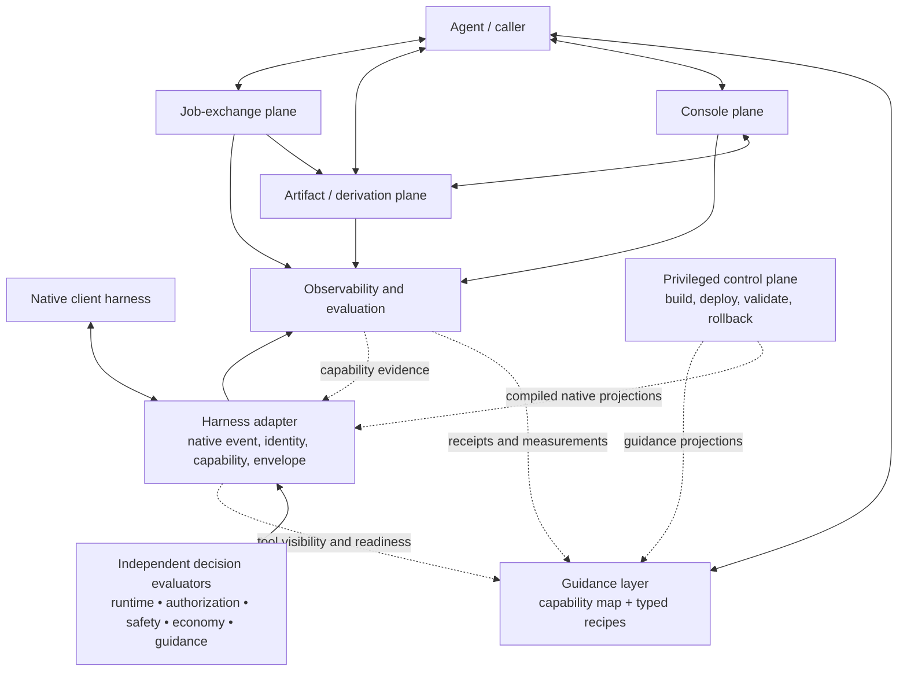

# context-mode cross-examination for para-agent

**Status:** design archaeology; no implementation authorized | **Date:** 2026-08-10
**Scope:** upstream context-mode, the local `context-mode-core` adaptations, their relationship to the older project lineages, and consequences for para-agent

## Executive finding

Context-mode contains one of the strongest implementation precedents for para-agent's intended economy: execute or inspect outside model context, preserve the full material when that is useful, and return a bounded result or a reference. Its batched execution, provider-side path ingestion, bounded search, source scoping, and reference-oriented resume ideas are worth adapting.

It also demonstrates the failure mode para-agent most needs to avoid. Context-mode repeatedly discovered distinct concerns and then recombined them:

- capture with derivation;
- derivation with indexing;
- indexing with memory;
- memory with guidance;
- guidance with routing;
- routing with authorization;
- client adaptation with cross-client administration;
- runtime data tools with privileged maintenance tools.

The resulting design lesson is:

> Capture is not derivation; derivation is not indexing; indexing is not memory; memory is not guidance; guidance is not authorization; runtime adaptation is not administration.

This refines, rather than replaces, the current para-agent synthesis. Keep four **agent-facing functional layers**—Console, Artifact, Job Exchange, and Guidance—but remove “adapter” from the fourth layer. Client adapters are cross-cutting boundary compilers. A privileged administrative control plane sits outside the agent-facing runtime.

## Evidence and version boundary

This report cross-examines four bodies of local evidence:

1. The pinned context-mode 1.0.169 installation inside [`context-mode-core/node/node_modules/context-mode`](../../../pet-projects/context-mode-core/node/node_modules/context-mode).
2. The local adaptations, deployment system, tests, architecture, and postmortems in [`context-mode-core`](../../../pet-projects/context-mode-core).
3. The current [`packages/context-mode`](../../../packages/context-mode) checkout where it exposes later implementation details or client formatters.
4. The earlier cybernetic-copilot, vscodepilot, and hierarchical-memory analysis in [`project-archaeology.md`](project-archaeology.md).

The pinned installation is the primary source for claims about the runtime that `context-mode-core` actually wrapped. The current checkout retains the same package version even though its source has advanced, which is itself a provenance warning. The skill files and routing material examined here are byte-identical between the pinned installation and current checkout; that does not imply that the entire runtimes are identical.

The old project's own final postmortem converges on the same center proposed here: a pure data plane, client-neutral policy and state, deterministic artifacts, a privileged transactional control plane, and real peer adapters at native boundaries. See [`context-mode-nexus-post-mortem-and-remediation-plan.md`](../../../pet-projects/context-mode-core/issues/post-mortems/context-mode-nexus-post-mortem-and-remediation-plan.md), especially lines 876–887.

## What context-mode got right

### 1. Out-of-context derivation is a real capability

`ctx_execute` established a useful pattern: do high-volume computation in a subprocess and emit only the requested finding. When stdout is large, the provider can retain it and return a searchable pointer instead of admitting all of it to the conversation. See the pinned [`server.js`](../../../pet-projects/context-mode-core/node/node_modules/context-mode/build/server.js), around lines 1455 and 1707.

This is complementary to para-agent rather than synonymous with it:

- para-agent supplies stateful process execution, rendered console capture, and lifecycle truth;
- an artifact/derivation provider supplies computation over guarded references;
- the caller chooses whether the desired product is a small derivation, a durable raw capture, or a reusable search projection.

### 2. Capture and later narrowing can be economical

The skill's anti-pattern reference distinguishes preserving full output from searching it later. That is valuable when the caller expects multiple questions, auditability, or replay. See [`anti-patterns.md`](../../../pet-projects/context-mode-core/node/node_modules/context-mode/skills/context-mode/references/anti-patterns.md), around lines 247–269.

It is not a universal rule. “Never narrow before capture” can be wasteful or harmful for a one-shot derivation, sensitive material, expensive retention, or a source whose full body is already durably addressable elsewhere. Para-agent should make capture intent explicit instead of inferring it from output size.

### 3. Batch execution and batch queries attack the right cost

`ctx_batch_execute` combines several commands and inline queries in one call while retaining full outputs for subsequent search. This directly supports the current para-agent proposal for `commands[]`, per-command receipts, caller-selected projections, and a single response budget.

The reusable idea is not “always use a sandbox.” It is:

```text
known operations + known selectors + one aggregate budget
→ one provider call
→ independently attributable receipts
→ exact continuations for anything omitted
```

### 4. Search is useful as a rebuildable projection

Context-mode's FTS5 store uses chunking, lexical variants, rank fusion, source filters, timelines, and file hashes. Those are good implementation ideas for an optional artifact search provider.

The index must not become canonical evidence. The pinned store replaces an earlier source when the same label is re-indexed, while automatic execution labels can be as broad as `execute:javascript`; later executions can therefore replace earlier searchable history. See [`store.js`](../../../pet-projects/context-mode-core/node/node_modules/context-mode/build/store.js), around line 876, and [`server.js`](../../../pet-projects/context-mode-core/node/node_modules/context-mode/build/server.js), around line 1717.

A para-agent search hit should resolve to an immutable or guarded artifact occurrence. Rebuilding or deleting the index must not delete the evidence.

### 5. Native asymmetry was eventually made explicit

The current formatters record material differences among clients and even among fields of one hook event. For example, the local Claude formatter records that Bash `updatedInput.command` was ignored in Claude Code 2.1.x and converts that attempted rewrite into a denial, while other tool fields and other clients have different behavior. See [`claude-code.mjs`](../../../packages/context-mode/hooks/formatters/claude-code.mjs), lines 57–100, and the other files under [`hooks/formatters`](../../../packages/context-mode/hooks/formatters).

That evidence invalidates a client-wide boolean such as `supportsModify`. Capabilities must be keyed by client version, mode, event, native tool, field, and effect.

### 6. Some deployment mechanics were unusually disciplined

The old core preserved upstream commit and artifact digests in [`BUILD.json`](../../../pet-projects/context-mode-core/node/BUILD.json), required exact patch anchors in [`context-mode-patches.mjs`](../../../pet-projects/context-mode-core/lib/context-mode-patches.mjs), defaulted the deployment command to planning unless `--apply` was supplied, bounded paths, backed up before mutation, and used temporary-file replacement for individual files.

These are worth preserving in a separate administrative system. They are not reasons to give an ordinary model-visible data-plane server cross-client mutation authority.

## Where the design became pathological

### 1. The “neutral” vocabulary remained Claude-shaped

The local wrapper maps PowerShell, Cmd, Bash, Shell, and `exec_command` into canonical `Bash`; it similarly normalizes other native tools into Claude-style `Read`, `Grep`, and `Glob`. See [`custom-routing.mjs`](../../../pet-projects/context-mode-core/runtime/lib/custom-routing.mjs), lines 6–39.

This improves local interoperability but is not a neutral semantic model. Neutral operations should name intent:

| Semantic operation | Possible native names |
|---|---|
| `shell.execute` | Bash, PowerShell, Cmd, Shell, `exec_command` |
| `file.read` | Read, file read APIs, workspace resources |
| `content.search` | Grep, search APIs, indexed query |
| `path.enumerate` | Glob, file listing APIs |
| `web.fetch` | WebFetch, browser navigation, HTTP provider |
| `agent.delegate` | Agent, task, thread, subagent APIs |
| `mcp.call` | Native or qualified MCP tool calls |

Normalization must retain the native tool name, original event shape, shell evidence, and uncertainty. Unknown evidence remains unknown; it must not default to a convenient client surface.

### 2. One action rank hid incompatible authorities

The local routing contract reduces decisions to `deny > ask > modify > context`. That is a useful formatter intermediate, but not a safe composition rule. Authorization, safety, runtime validity, token economy, and teaching have different authorities and failure policies.

The wrapper made this concrete in two dangerous ways:

- a local optimization match could return before the upstream hook's later security checks ran;
- “security policy” was distinguished from token routing by regexing English response text in [`native-runner.mjs`](../../../pet-projects/context-mode-core/runtime/lib/native-runner.mjs), around lines 78 and 231.

The first is a concrete control-flow defect, not merely an abstraction complaint. `runNativeHook()` returns a matching local decision at lines 231–240, while the upstream security evaluation it thereby skips occurs in the pinned [`routing.mjs`](../../../pet-projects/context-mode-core/node/node_modules/context-mode/hooks/core/routing.mjs), around lines 703–723. Under globally configured advisory routing, a large-output local match can become nonblocking context and allow the original tool without consulting the upstream deny policy. Antigravity takes a different path that evaluates both decisions before composition. The integration test's security probe does not match a local large-output rule, so it never tests the conflict.

Security must not depend on wording, and optimization must not acquire denial authority merely because the client cannot display advice. Every applicable enforcement policy must run before economy or teaching decisions are lowered.

### 3. Hook modification was treated like cross-tool redirection

A PreToolUse `updatedInput` changes fields for the same selected tool. It does not transform a Bash call into a para-agent MCP call. In the locally recorded Claude behavior, even Bash command replacement was ignored and had to be represented as a denial.

Therefore a hook can, only where capability evidence says so:

- allow the native call;
- block or ask under an authorized policy;
- add advice/context;
- patch a supported field of the same tool.

An alternative tool is a structured recommendation for the agent's next choice, not a hidden redirect. If optional token advice cannot be delivered, its default fallback should normally be no-op plus telemetry—not denial plus an extra model turn.

### 4. Guidance was repeatedly paid for

The pinned main skill is 16,683 bytes. Its linked references add 36,062 bytes, and the seven auxiliary skills add 9,303 bytes. The main skill triggers on nearly any MCP output that may exceed 20 lines and describes routing virtually every command through context-mode.

Other potentially resident or repeatedly injected surfaces include:

| Surface | Measured UTF-8 size | Qualification |
|---|---:|---|
| Claude `CLAUDE.md` guidance | 4,748 bytes | Client-visible when that projection is active |
| Codex `AGENTS.md` guidance | 5,280 bytes | Alternative client projection, not simultaneous with Claude by default |
| Cursor always-apply guidance | 3,730 bytes | Alternative client projection |
| SessionStart routing block | 4,085 bytes | 4,654 bytes with deferred ToolSearch bootstrap |
| Skill catalog descriptions | 2,546 characters | Exposure depends on client skill discovery |
| Main context-mode skill | 16,683 bytes | Admission depends on skill loading behavior |

Bytes are not provider tokens, and adapter-visible text is not proof of model admission. Even so, the design duplicates the same facts across config instructions, the main skill, tool descriptions, SessionStart, PreToolUse nudges, compact-resume injection, and subagent prompt rewriting. The current routing hook appends the full routing block to selected subagent prompts; see [`routing.mjs`](../../../packages/context-mode/hooks/core/routing.mjs), around line 892.

This is a credible contributor to Claude overhead and behavioral confusion, but it is not yet a causal explanation for the observed 52K-token baseline.

### 5. Deferred discovery and mandatory routing contradicted each other

The system told the agent to use context-mode tools even when those tools were deferred or absent from the callable surface. A hook cannot generally make an unlisted MCP schema callable. It can mention ToolSearch on hosts that support it, but that consumes another model turn; dynamic `tools/list` exposure remains controlled by the host.

Tool exposure, tool discovery, guidance, and routing are therefore separate design axes. A mandatory skill cannot repair an unavailable capability.

The local custom policy also did not receive MCP readiness or caller tool-visibility facts. It could therefore recommend an unavailable para/context-mode operation. A fixed-tool subagent, deferred tool surface, failed provider, and fully capable interactive agent are different routing situations and need explicit capability evidence.

The predictive classifier was deliberately broad enough to nudge even bounded PowerShell such as `Get-Content ... -TotalCount 30`. This is useful as a conservative candidate signal, but too weak to justify intervention or a claim of avoided output.

### 6. “Unified memory” collapsed evidence and authority

The searchable store combines documents, execution output, errors, prompts, inferred decisions, session summaries, and auto-memory categories. Retrieval relevance then risks being mistaken for instructional authority. See the pinned [`server.js`](../../../pet-projects/context-mode-core/node/node_modules/context-mode/build/server.js), around line 2288, and [`auto-memory.js`](../../../pet-projects/context-mode-core/node/node_modules/context-mode/build/search/auto-memory.js), around line 14.

The resume snapshot has the right table-of-contents instinct but incompatible claims: it advertises zero truncation, truncates prompt excerpts, and assembles nonempty sections without a final byte budget. See [`snapshot.js`](../../../pet-projects/context-mode-core/node/node_modules/context-mode/build/session/snapshot.js), around lines 1, 361, and 398.

For para-agent:

- a resume artifact is a bounded navigator, not standing authority;
- search corpora must carry trust class and content kind;
- an index is a derived projection;
- a remembered decision needs author, scope, freshness, and supersession;
- retrieved history never overrides current user or system instructions merely because it was ranked highly.

### 7. Conversation identity was guessed

The MCP server did not possess a portable native conversation ID and sometimes attributed activity to the latest project event; local hook state could fall back to the parent PID. See [`server.js`](../../../pet-projects/context-mode-core/node/node_modules/context-mode/build/server.js), around line 373, and [`custom-routing.mjs`](../../../pet-projects/context-mode-core/runtime/lib/custom-routing.mjs), lines 135–142.

MCP connection, hook process, operating-system process, conversation, task, and context epoch are different lifetimes. Missing correlation must remain explicitly `unbound`. False identity corrupts metrics, guidance throttling, memory, and exposure suppression more seriously than an honest unknown does.

### 8. Search performed hidden writes

`ctx_search` was presented as read-only while stale-source refresh could rewrite the index during a query. See [`store.js`](../../../pet-projects/context-mode-core/node/node_modules/context-mode/build/store.js), around line 1118.

Refresh is legitimate, but it must be explicit in the receipt or occur in a separately governed projection-maintenance path. Query semantics should not hide mutation, network access, or source refresh.

### 9. Partial execution could masquerade as success

Timeout or background execution could return partial output through a nominally successful call. See [`server.js`](../../../pet-projects/context-mode-core/node/node_modules/context-mode/build/server.js), around line 1643.

A background continuation is a job. Partial material requires `complete:false`, lifecycle status, a cursor or body reference, omissions, and an exact continuation. This is the same truthfulness requirement already identified for para-agent's Console Journal and Job Exchange.

### 10. The executor was called a sandbox without enforcing one

The pinned executor launches languages with the project as working directory, while routing prose claimed writes would not persist. See [`executor.js`](../../../pet-projects/context-mode-core/node/node_modules/context-mode/build/executor.js), around line 232, and [`routing-block.mjs`](../../../pet-projects/context-mode-core/node/node_modules/context-mode/hooks/routing-block.mjs), around line 42.

Para-agent should distinguish:

- a capture or derivation subprocess;
- an execution profile describing cwd, environment, filesystem, network, and limits;
- a genuinely isolated sandbox backed by enforcement.

Guidance cannot supply a security boundary.

The old hydrator also queried every value under `HKCU\Environment` and merged it into child processes. This is a read, not a persistent registry mutation, but it creates an ambient capability, secret-exposure, and reproducibility boundary. Harness adapters and execution profiles should inherit only declared variables or an explicit allowlist; diagnostics may record variable names/counts but never secret values. See [`user-environment.mjs`](../../../pet-projects/context-mode-core/lib/user-environment.mjs), lines 41–108.

### 11. Runtime and administration shared one authority surface

`infrastructure.json` names filesystem and administration policies separately, but helpers recombine them. The combined roots then flow into upstream Claude permissions, Codex writable roots, and SessionStart prose describing them as globally approved. See [`infrastructure.mjs`](../../../pet-projects/context-mode-core/lib/infrastructure.mjs), lines 157–203; [`upstream-policy.mjs`](../../../pet-projects/context-mode-core/lib/upstream-policy.mjs), lines 15–23; and [`codex.mjs`](../../../pet-projects/context-mode-core/adapters/codex.mjs), lines 122–147.

This conflates content access, executor sandboxing, host governance, privileged administration, and teaching. A runtime artifact provider should not be able to edit Claude, Cursor, Codex, and Antigravity configuration merely because all of those paths are centrally known.

### 12. Peer adapters were nominal

The adapter registry contains only Codex. Claude and Cursor behavior is embedded in generic runtime and deployment branches, while Antigravity receives special handling elsewhere. See [`adapters/index.mjs`](../../../pet-projects/context-mode-core/adapters/index.mjs) and [`native-runner.mjs`](../../../pet-projects/context-mode-core/runtime/lib/native-runner.mjs), lines 17–26.

The result was centralized files without a mechanically enforced dependency boundary. Real peer adapters must be independently testable implementations of a small contract; the stable core must not import native paths, event names, tool aliases, or response envelopes.

### 13. Deployment was recoverable, not fully transactional

Useful safeguards existed, but important gaps remained:

- omitting a target selected every client;
- ownership was inferred from regexes and legacy path lists rather than a manifest;
- invoking a native client CLI admitted mutations outside the reconciler's exact write set;
- rollback errors became warnings while the operation could still be labeled rolled back;
- validation checked source artifact/version facts, not a digest of the complete deployed runtime tree;
- dependency lifecycle scripts performed host-specific repair before the local patch queue ran.

The administrative redesign should promote one immutable, tested build artifact by digest, require one explicit target, stop on drift, record ownership only after native validation, and separately verify applied disk state, host-loaded state, and observed runtime behavior.

### 14. Tests certified the wrapper more strongly than reality warranted

Synthetic session identifiers and formatter fixtures did not establish behavior for native new/resume/fork/compaction lifecycles, process reuse, concurrency, client reload, or production storage isolation. The project postmortems also record upstream failures being broadly qualified and test data entering live stores.

Contract tests should include unknown identity, unsupported effects, headless versus interactive mode, version drift, hook timeouts, process concurrency, exact rollback verification, and isolated client homes. A passing formatter fixture must not be reported as host-level capability proof.

Matcher strings also need live-host probes. Existing tests checked for literal alternatives but did not execute the Claude, Cursor, or Codex matcher engines, so anchoring, lookahead support, and qualified MCP-name behavior remained assumptions. Normalization tests must retain raw payloads as well: one Antigravity mapping treated an end-line coordinate as a line count, illustrating how a nominally canonical shape can silently change meaning.

Policy values also drifted across surfaces: runtime code used a 250 KB threshold for JSONL, NDJSON, and JSON, while the README and architecture described 20 KB for JSONL and 50 KB for JSON. Thresholds, capability facts, reason codes, and matcher intent need one typed source that is compiled into documentation, tests, and client projections.

### 15. Counterfactual savings were reported as facts

Routing metrics estimated avoided bytes from fixed constants and could report the strongest “savings” when routing accomplished the least. Para-agent should label every quantity as one of:

- directly measured;
- provider-reported;
- adapter-observed;
- estimated;
- counterfactual;
- unknown.

A hash or predicted output size is not an exposure receipt, and a hypothetical byte count is not saved context.

## Cross-project synthesis

| Design concern | Cybernetic-copilot | vscodepilot | Context-mode | Para-agent disposition |
|---|---|---|---|---|
| Stateful console | Process-local transcript/interceptor | External JSONL console and safe-shell format | Mostly subprocess capture | Keep para-agent's producer-neutral console and lifecycle receipts. |
| Large-output economy | Typed observations and summaries | Durable output with later reads | Out-of-context derive, capture, search | Separate raw capture, derive, index, search, and delivery. |
| Batching | Ad hoc automation | Parallel/job tools | Batch execute plus inline queries | Add typed batches with per-operation receipts and one aggregate budget. |
| Hook routing | Regex inspection and universal mandates | Client primer and adapters | Typed hook envelopes, shell-aware local routing | Normalize at client edge; evaluate typed domains; deliver sparse advice. |
| Guidance | Primers and metacognitive policy | Handshake/primer injection | Broad mandatory skill repeated across surfaces | Small open-ended capability map plus retrievable typed recipes. |
| Memory | Scoped observations and promotion intuition | Durable logs and garden concept | Unified searchable store and resume snapshots | Bounded navigators, guarded refs, explicit trust and promotion; index remains derived. |
| Supervision | Rich but speculative detectors | Runtime supervisor terminology | Routing and auto-memory heuristics | Evidence-bearing observers; no authority without a separate policy grant. |
| Client support | Ambient PowerShell assumptions | Thin-adapter aspiration | Manifests plus partly fictional peer adapters | Enforce neutral-core/runtime-adapter boundary mechanically. |
| Administration | Little disciplined deployment | Volatile integration code | Pinning, planning, backup, repair, multi-client mutation | Retain provenance mechanics in an out-of-band privileged control plane. |

The lineages are complementary:

- vscodepilot contributes the strongest durable console and producer-neutral protocol instinct;
- context-mode contributes the strongest derivation, batching, indexing, and native-hook evidence;
- cybernetic-copilot contributes typed observations, policy vocabulary, and the warning against ambient interception;
- hierarchical-memory contributes scope vocabulary and the warning that retention, promotion, and delivery are not one operation;
- para-agent can integrate them through references and receipts without rebuilding their monoliths.

## Refined architecture

The previous phrase “guidance and adapter plane” should be retired. It joins a semantic teaching layer to a cross-cutting integration boundary.



The “independent decision evaluators” box is a contract boundary, not a required central process. Native authorization stays in the host, runtime validity stays with the enforcing provider, and optional governance, economy, and guidance evaluators retain separate authorities and failure policies. Ordinary Console, Artifact, and Job calls remain direct protocol calls; the Harness Adapter does not proxy them.

### Agent-facing functional layers

1. **Console plane:** process and pane lifecycle, commands, rendered output, journal records, and truthful partial/terminal state.
2. **Artifact/derivation plane:** guarded references, bounded materialization, raw captures, one-shot derivations, optional indexes, and delivery receipts.
3. **Job-exchange plane:** delegation, typed talk-back, causal events, lifecycle authority, evidence, and final reports.
4. **Guidance layer:** a small intent map, retrievable recipes, and sparse JIT correction. Exact current continuations belong to receipts and errors.

### Cross-cutting boundaries

**Harness adapter**

- parses a native event without discarding native evidence;
- maps it to a neutral observation;
- binds conversation and epoch only where proven;
- queries a granular capability matrix;
- formats a typed decision into the native response envelope;
- records a delivery/decision receipt.

**Execution profile**

- names shell dialect, cwd semantics, environment inheritance, filesystem access, network access, limits, and signal behavior;
- is attached to an operation rather than inferred from the client name alone;
- distinguishes a normal subprocess from an enforced sandbox;
- inherits an explicit allowlist or operation-scoped environment by default rather than every ambient user variable.

**Guidance projection compiler**

- consumes versioned capability evidence, the policy reason registry, recipe sources, and client limitations without becoming their authority;
- projects the applicable guidance into the smallest native skill/config/resource form each client supports;
- avoids placing the same fact in config, skill, tool description, hook prose, and resume memory simultaneously.

**Privileged administrative adapter**

- discovers one explicitly named client;
- plans, applies, validates, rolls back, and reports exact native mutations;
- runs outside the model-visible data plane;
- may share immutable client facts with a harness adapter, but not its mutation authority.

The control plane is not a fifth agent-facing plane. Its plans, manifests, and receipts may be artifacts; its privileges remain out of band.

## Routing contract

### Neutral observation

```json
{
  "observation_id": "opaque",
  "client": { "id": "claude", "version": "observed-or-unknown", "mode": "interactive|headless|unknown" },
  "event": "pre_tool_use",
  "native": { "tool": "Bash", "payload_guard": "hash", "event_shape": "adapter-version" },
  "operation": { "kind": "shell.execute", "shell": "powershell", "shell_confidence": 0.9 },
  "binding": { "conversation": null, "epoch": null, "quality": "unbound" },
  "capability_profile": "profile-ref",
  "time": "RFC3339"
}
```

The neutral record does not need to copy sensitive arguments into every ledger. It can retain a bounded policy view plus a guarded native body reference.

### Typed decision

```json
{
  "decision_id": "opaque",
  "policy": { "id": "large-output-advice", "version": "1" },
  "domain": "optimization|runtime|safety|authorization|guidance",
  "effect": "allow|advise|ask|same_tool_patch|block|noop",
  "authority": "advisory|runtime_contract|governance|native_authorization",
  "reason_code": "stable-code",
  "evidence": [],
  "patch": null,
  "alternative": { "capability_id": "console.run", "operation": {} },
  "fallback_if_unsupported": "noop",
  "confidence": 0.8,
  "guidance_ref": "recipe-or-limitation-ref",
  "repeat": { "scope": "epoch", "after": null }
}
```

`alternative` is not a hook transformation. `same_tool_patch` is valid only when the adapter proves support for the exact native tool field. The formatted response should retain the decision ID so observed client behavior can be reconciled with the intended decision.

### Composition rules

1. Evaluate authorization, safety, runtime validity, optimization, and guidance independently.
2. A valid authorized block dominates an optimization recommendation, but not because the word `deny` has a higher generic rank.
3. An optimization decision cannot suppress a security evaluation.
4. Unsupported advisory delivery does not silently become a block.
5. Hook failure for optional optimization fails open with telemetry. Security should primarily reside in native authorization or enforced runtime controls, with its own explicit failure policy.
6. English prose is presentation, never the source of decision domain or authority.

### Capability evidence

A capability profile needs records at this granularity:

```json
{
  "client": "claude",
  "version_range": "observed version or exact build",
  "mode": "interactive",
  "event": "PreToolUse",
  "native_tool": "Bash",
  "effect": "same_tool_patch",
  "field": "command",
  "support": "supported|unsupported|unknown",
  "evidence": "native-test-receipt-ref",
  "last_verified": "RFC3339"
}
```

Capabilities to probe separately include advice/context delivery, ask, same-tool patch by field, context-epoch notification, exact conversation identity, long-running calls, progress notifications, parallel calls, deferred tool discovery, headless behavior, and reload requirements. Cross-tool transformation should be modeled as unsupported rather than probed as a variant of same-tool patching.

## Capture, derivation, index, and memory contract

Context-mode's two competing instructions—print only the finding versus retain everything before narrowing—should become explicit operation modes:

| Mode | Canonical material | Typical use | Required receipt |
|---|---|---|---|
| One-shot derivation | Existing guarded sources; derived result may be small and ephemeral | Known calculation or summary | Inputs, code/query guard, bounded result, omissions, reproducibility facts |
| Durable raw capture | Full stdout/stderr or imported source artifact under declared retention | Audit, replay, several future questions | Artifact ref, lifecycle status, byte counts, selector continuations |
| Reusable indexed projection | Rebuildable chunks/ranks referring to canonical artifacts | Repeated cross-artifact retrieval | Index version, corpus filters, source refs, refresh/mutation facts |

`run/capture`, `derive`, `index`, and `search` should be semantically separate even if one high-level call can compose them. Search corpora should distinguish documentation, console output, job reports, observations, user-authored knowledge, and policy. A rank score confers relevance, not trust or authority.

A resume package should be a bounded artifact navigator containing recent facts, counts, explicit omissions, and typed retrieval references. It must not claim zero truncation without a budget and must not wrap retrieved historical decisions in an authority-bearing instruction tag.

## Skill and recipe design

The skill layer should help an agent choose among capabilities without closing the search space.

### Resident capability map

Keep only a small intent router:

- stateful or interactive execution → Console;
- known command sequence → batched Console run;
- large-source computation → derive against artifact references;
- expected repeated querying → durable capture plus optional index;
- delegation → Job Exchange;
- exact evidence → bounded materialization;
- unfamiliar or unsupported workflow → use primitive operations and inspect capability limitations.

This is guidance, not a mandate. Small bounded native operations remain valid when they are cheaper and semantically correct.

### Retrievable typed recipes

A recipe should declare:

```json
{
  "recipe_id": "delegate-and-verify",
  "intent": "delegate work and verify requested outputs",
  "parameters": {},
  "preconditions": [],
  "operations": [],
  "expected_receipts": [],
  "tradeoffs": [],
  "limitations": [],
  "primitive_escape_hatches": []
}
```

Recipes should not interpolate untrusted parameters into executable shell text. Usage evidence can nominate a recipe for review; frequency cannot automatically promote it into standing guidance or policy.

### One authoritative channel per fact

The semantic source may compile to several native surfaces, but each fact needs one authoritative home:

- schemas define callable structure;
- compact descriptions state selection intent;
- the skill explains composition;
- recipes carry detailed workflows;
- receipts carry current exact continuations;
- hooks emit short reason codes and references;
- client limitation resources carry versioned asymmetries;
- resume artifacts carry bounded navigational state, not duplicated policy.

Compilation can change syntax, but a client profile should select one resident carrier for a fact; other surfaces should reference it or remain deferred. This is progressive disclosure by information ownership, not merely by splitting one large document into several files.

## Claude overhead investigation

The old wrapper is itself a plausible confound. A native hook invocation starts the central Node runner and may query `HKCU\Environment`. If local routing does not return first, the pass-through path synchronously starts a second Node process for the upstream hook with a 20-second timeout and a 4 MiB buffer. See [`hook-runner.mjs`](../../../pet-projects/context-mode-core/runtime/hook-runner.mjs), lines 5–30; [`native-runner.mjs`](../../../pet-projects/context-mode-core/runtime/lib/native-runner.mjs), lines 222–255; and [`user-environment.mjs`](../../../pet-projects/context-mode-core/lib/user-environment.mjs), lines 41–108.

Because hook commands start fresh processes, a process-local “already hydrated” marker may not prevent the registry query on the next event. SessionStart also appends infrastructure prose unconditionally. These are testable hypotheses.

Instrument these phases independently:

| Phase | Evidence to record |
|---|---|
| Harness dispatch | Native event, client version/mode, dispatch-to-runner latency |
| Wrapper startup | Process startup duration and runtime version |
| Environment hydration | Duration, whether `reg.exe` ran, variables added count—not secret values |
| Local normalization/policy | Duration, matched policy IDs, bounded payload bytes |
| Upstream child | Spawn duration, execution duration, exit/timeout, stdout/stderr bytes |
| Native formatting | Chosen capability record, intended effect, formatted bytes |
| Client observation | Whether advice/patch/block was actually observed |
| Guidance injection | Source ID, unique hash, adapter-visible bytes, repeat reason |
| Failure | Fail-open/no-op count, parse failure, timeout, unsupported capability |

Run controlled workloads in this order:

1. No context-mode hook or guidance.
2. Upstream hook only.
3. Wrapper pass-through with no environment hydration or local policy.
4. Add environment hydration.
5. Add local routing.
6. Add SessionStart guidance.
7. Add the main skill and then recipes separately.
8. Test subagent and post-compaction paths independently.

Hold task, client build, mode, tool surface, and conversation shape constant. Record wall time, model turns, tool calls, adapter-visible bytes, provider-reported token categories, retries, and behavioral outcomes. Do not infer provider-hidden prompt composition from file sizes.

## Administrative architecture

The old core's provenance, planning, backup, and exact patch-anchor instincts should become a separate system with a more honest source-of-truth chain:

```text
declared intent
→ compiled native projection
→ applied disk state
→ host-loaded effective state
→ observed runtime behavior
```

No stage proves the next. Each transition needs a receipt.

An apply plan should name exactly one client and include:

- path or configuration key;
- old hash/value guard and proposed new hash/value;
- owning adapter and adapter version;
- artifact/build digest;
- privilege required;
- reload or restart requirement;
- rollback value;
- native validation procedure;
- effective-state observation.

Default behavior is read-only planning. Apply stops on drift. Backups are recovery material with retention and sensitivity handling, not authority. Build patches in a clean workspace, isolate or disable dependency lifecycle scripts, test before promotion, deploy one immutable artifact, and verify the deployed tree digest.

## Ranked disposition for para-agent

### Integrate now in the design contracts

1. Provider-neutral guarded artifact references and bounded receipts.
2. Explicit `run/capture`, `derive`, `index`, and `search` semantics.
3. Batch commands plus caller-selected projections in one request budget.
4. A neutral observation and typed policy-decision contract with authority domains.
5. Granular client capability evidence and explicit `unknown`.
6. A small open-ended guidance layer with typed, retrievable recipes.
7. Exact identity quality: native, correlated, or unbound—never PID/latest guessing.

### Adapt after the correctness substrate

1. Context-mode's FTS ranking as an optional rebuildable Artifact provider.
2. A bounded resume navigator over guarded references.
3. Sparse hook nudges that carry reason codes and guidance references.
4. Client-native guidance compilation from one semantic source.
5. Deployment provenance and rollback in a separate privileged project.

### Retire

1. Mandatory routing of virtually every command through one tool.
2. Regex prediction of output size as enforcement.
3. Cross-tool “redirects” represented through `updatedInput`.
4. Advisory guidance escalated to denial because a client lacks an advice channel.
5. Unified indexes that mix evidence, memory, instructions, and policy authority.
6. Latest-row or PID conversation attribution.
7. Model-visible upgrade, purge, hosted analytics, and administrative repair in the ordinary data plane.
8. Repeated full routing prose in config, skill, hooks, subagents, and resume state.
9. Counterfactual bytes reported as measured savings.
10. Synthetic formatter success reported as native-client capability proof.

## Consequences for the current para-agent roadmap

The near-term roadmap remains contract-first, with two refinements:

1. Rename the fourth agent-facing layer to **Guidance**. Specify the Harness Adapter and privileged Control Plane as separate boundaries.
2. Add a small **routing observation/decision and client capability contract** before implementing hook automation.

Recommended design artifact order:

1. Console v1 conformance errata and executable invariants.
2. Artifact reference/receipt contract, including the three material-handling modes.
3. Job Exchange contract.
4. Harness observation, typed decision, capability evidence, and decision receipt contract.
5. Minimal semantic guidance source plus two or three typed recipe resources.
6. Only then, an optional index provider and a separate administrative deployment design.

This ordering prevents the skill from teaching accidental APIs, prevents adapters from becoming policy engines, and prevents cross-client administration from entering the runtime merely because deployment is eventually necessary.

## Open design questions

1. Should derivation and indexing be para-agent tools, or separate Artifact providers sharing the same reference contract?
2. What is the smallest eagerly exposed high-level surface for each client, and how are primitive schemas discovered without forcing an extra turn in common workflows?
3. Which clients expose a stable conversation identity and context epoch, and which must operate honestly as unbound?
4. Which optimization decisions, if any, justify `ask` or `block` when advice delivery is unsupported? The default recommendation is none.
5. What retention defaults distinguish console capture, one-shot derivation, indexed projection, and final job reports?
6. Should the semantic guidance source live with para-agent or in a shared science-facility adapter/guidance project? The compiled client projections should not live in the para-agent stable core.
7. Which existing component should own the privileged control plane, or should that remain deferred until a second client requires a concrete deployment mutation?

Until those are decided, the safest principled direction is a small common protocol, explicit uncertainty, client-native edges, retrievable teaching material, and no hidden elevation of guidance into authority.
