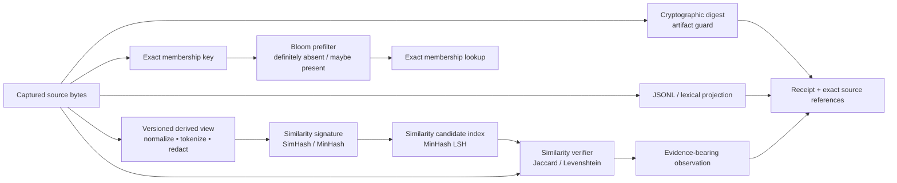

# Node-native Hashish design for para-agent

**Status:** design note; no implementation authorized | **Date:** 2026-08-10
**Scope:** a direct Node implementation derived from ThermoMapper Hashish, informed by jso-jackson and cybernetic-copilot, for use as a capability provider inside para-agent's backend engine

## Executive conclusion

A direct Node implementation is the right provider path. It avoids introducing a process, PowerShell, and .NET-loading boundary into para-agent's hot path and gives the Node backend one coherent implementation for Hashish's text models, similarity candidates, and compact projections. Exact cryptographic digests, JSONL framing, and indexes are sibling backend capabilities that may guard or consume these results; they are not part of Hashish itself.

The earlier warning against “a second JavaScript implementation” was too broad. The actual warning should be:

> Do not replace Hashish with an uncalibrated generic sketch or silently change its preprocessing, model, and integer semantics. Do build a deliberate Node-native port from the canonical source, with donor-parity fixtures and corrected para-agent profiles.

The algorithmic lift is manageable. The canonical Hashish surface is 22 C# files totaling about 129 KB, with only `System.Numerics.Tensors` as an external package dependency. The hard part is not translating loops; it is defining algorithm identity, fixing known edge cases, separating exact and approximate authority, and proving cross-runtime behavior.

The recommended shape is a pure ESM capability library internal to para-agent—not 22 new MCP tools and not an Artifact sub-API. The Artifact/query engines consume it while satisfying agent-level operations; receipts, journal summaries, search results, and bounded hook state may disclose its derived evidence without exposing its primitives.

## Source and maturity boundary

The canonical source is [`ThermoMapper/src/hashish`](../../../ThermoMapper/src/hashish). [`projects/Hashish/Hashish.csproj`](../../../ThermoMapper/projects/Hashish/Hashish.csproj) compiles that directory directly and adds only `System.Numerics.Tensors`.

The companion [`Hashish capability and application inventory`](hashish-capability-inventory.md) catalogs what each algorithmic concept measures, the questions it can answer, its plausible applications, and the limits of the donor implementation. This note narrows that broader conceptual palette to a possible Node provider design.

All 22 C# files are byte-identical by SHA-256 to the copy under [`pet-projects/rector-codicis/primitives/hashish`](../../../pet-projects/rector-codicis/primitives/hashish). The ThermoMapper location can therefore serve as the donor source while the Rector copy establishes the architectural lineage.

Maturity is lower than “compiled and loading” may suggest:

- ThermoMapper has no Hashish test project or in-tree algorithm consumer;
- Rector's [`smoke.ps1`](../../../pet-projects/rector-codicis/primitives/hashish/smoke.ps1) only loads the DLL and lists types;
- the recent [`hashish` review](../../../ThermoMapper/issues/doccer-excavation-hpc-hashish-review-20260806.md) explicitly says no benchmark or compatibility suite was run and identifies several correctness and identity questions.

The C# source is therefore both a valuable implementation donor and an oracle candidate—not an already certified specification.

## What is being ported

Hashish contains several different algorithm families:

| Family | Current components | Para-agent role |
|---|---|---|
| Hash substrate | seeded FNV variants and `Mix64` | Deterministic internal hash families with explicit input basis; never replace cryptographic artifact identity. |
| Exact representation measures | Jaccard, containment, overlap, Dice, Levenshtein, cosine after its zero-vector convention is fixed | Candidate verification and calibration over a declared representation. |
| Text preprocessing | tokenizer, word shingler, histogram | Versioned derived views shared by models and signatures. |
| Fitted text models | IDF, BM25 compatibility shim, TF-IDF, top-K search | Search/ranking projections over artifact references. |
| Similarity signatures | SimHash, MinHash | Near-duplicate candidate generation under compatible profiles; fitted model identity applies to SimHash when used, not to MinHash. |
| Similarity candidate index | MinHash banded LSH | Return IDs whose signatures share configured bands; exact similarity verification follows. |
| Probabilistic membership | Bloom | Accelerate definitely-absent/possibly-present checks for exact keys under one complete filter generation. |
| Streaming estimates | Count-Min, HyperLogLog | Approximate diagnostics and telemetry where an error contract is acceptable. |
| Heuristic content comparison | CTPH, TLSH, NCD | Deferred or renamed until their exact para-agent contract and oracle are established. |
| Distributional text analysis | co-occurrence, PMI/PPMI, contextual entropy | Deferred; current dense representation and counting semantics are not a good para-agent substrate. |

These should share descriptors and artifact conventions, not one generic `hash` field or one claim of “deduplication.”

## Three implementation targets, not one

A principled port distinguishes:

1. **`thermomapper-compat-v1`:** reproduces donor behavior exactly enough to validate the port and read any deliberately compatible persisted values.
2. **`para-v1`:** a corrected API with explicit models, validated options, stable serialization, and honest empty/unknown behavior.
3. **External-standard profiles:** used only where an algorithm name implies an external standard and published vectors pass.

Compatibility quirks should not become para-agent defaults merely because they are easy to translate. Conversely, a corrected profile must not silently claim to be bit-compatible with the donor.

Every persisted result needs an algorithm/profile identifier. A bare value such as `0x31a7...` is uninterpretable without its preprocessing, model, parameters, and input basis.

## Authority model

Hashish becomes useful when each family is allowed to prove only what it measures.

| Result class | Examples | Legitimate claim | Must not establish |
|---|---|---|---|
| Cryptographic byte digest | SHA-256 | Exact-byte integrity/equality to the strength of the digest, under one captured source boundary | Semantic equivalence, prior delivery, freshness of a mutable path after capture |
| Exact representation measure | Jaccard, Levenshtein, cosine after its zero-vector contract is fixed | Exact score over the declared token/code-unit/vector representation | Source-byte equality or semantic truth |
| Rolling/non-cryptographic fingerprint | Rabin–Karp, FNV | Fast candidate, bucket, anchor, or chunk-boundary calculation | Artifact identity without exact verification |
| Lossy similarity signature | SimHash, MinHash, CTPH/TLSH variants | Candidate similarity under compatible profiles and, where applicable, the same fitted model | Equality, freshness, automatic suppression, or policy authority |
| Probabilistic membership | Bloom | Definitely absent or possibly present only for a complete, correctly built filter generation | Confirmed presence from a positive result |
| Approximate frequency/cardinality | Count-Min, HyperLogLog | Estimate under a declared error/configuration model | Exact receipt counts, billing, lifecycle truth |
| Rank score | TF-IDF, future BM25, PPMI | Relative retrieval signal for a declared corpus and query | Trust, instructional authority, semantic correctness |

A candidate may trigger exact verification or nominate an observation. It must not silently delete, suppress, promote, block, or rewrite evidence.

## Refined data flow



The exact source remains authoritative. Views, signatures, and indexes are disposable projections that point back to it.

## Node module boundary

Start as a dependency-light internal ESM capability beneath the backend projection engine, for example:

```text
src/capabilities/hashish/
  descriptor.js       semantic profiles and typed identity references
  hash64.js           BigInt Mix64 and named FNV input bases
  text-profile.js     normalization, case, tokenization, shingles
  idf.js              accumulator and immutable fitted model
  simhash.js          profile/model-aware signature and Hamming distance
  minhash.js          signature, LSH candidates, exact-Jaccard handoff
  bloom.js            versioned membership projection
  count-min.js        approximate frequency state
  hyperloglog.js      approximate cardinality state
  exact.js            Jaccard/containment/Levenshtein
```

Backend composition belongs outside that directory:

```text
src/engines/artifacts/    artifact identity, lifecycle, and publication
src/engines/query/        selectors, projection choice, and bounded results
src/capabilities/digest/  streaming SHA-256 and exact byte verification
src/capabilities/jsonl/   framing, guarded offsets, and result coordinates
src/application/          semantic para-agent operations and receipt assembly
src/mcp/                  thin schemas, handlers, and result presentation
```

The Hashish library must not import JSONL traversal, the MCP SDK, psmux, client hooks, artifact paths, or governance code. Artifact/JSONL infrastructure may consume Hashish results through versioned provider contracts, not the reverse. If a second real Node consumer appears, the same pure library and test suite can be promoted to a shared science-facility package without changing its contracts.

### Do not expose the file list as a tool list

Implementing the algorithms in Node does not justify one MCP tool per algorithm—or even a generic `artifact_analyze` tool. That would reproduce the tool-schema overhead and require the model to assemble an internal execution plan.

Instead, ordinary backend paths may:

- calculate an exact digest while capturing an artifact;
- ensure a guarded projection while satisfying an artifact query;
- nominate and exactly verify related candidates inside a semantic comparison;
- maintain a membership accelerator when a store generation is published;
- place descriptor, coverage, and algorithm/model facts in provenance or a maintainer diagnostic.

Whether “compare artifacts” or “find related results” ever deserves an MCP operation is a separate agent-intent decision governed by the tool-admission rule in [`backend-engine-architecture.md`](backend-engine-architecture.md). Primitive library exports remain available to backend code and tests without becoming resident model-facing schemas.

## Algorithm profile and result identity

Every persisted digest, signature, model, or sketch should reference a semantic profile containing only the facts that define comparable algorithm behavior:

```json
{
  "schema_version": 1,
  "algorithm": "hashish.simhash",
  "profile": "para-v1",
  "basis": {
    "source": "derived-text",
    "source_bytes_encoding": "utf-8",
    "decoder": "utf8-fatal",
    "normalization": "NFKC",
    "case": "unicode-lower",
    "tokenizer": "unicode-word-v1",
    "unicode_data": "profile-pinned-version",
    "min_token_length": 1,
    "token_hash_basis": "utf-16-code-units",
    "token_hash_variant": "fnv1a64-no-final-mix",
    "shingles": null
  },
  "parameters": {
    "bits": 64,
    "k1": 1.5,
    "b": 0.75,
    "missing_idf": "model-required",
    "min_weight": 0.000001,
    "max_idf": "infinity",
    "numeric": "ieee754-binary64",
    "tie_rule": "strictly-positive-sets-bit"
  },
  "value_encoding": "hex-fixed-16"
}
```

Canonicalize and hash that semantic object as `profile_id`. Do not include a build, source, model, or computed value in the profile ID.

A result then carries the distinct identities:

```json
{
  "result_id": "opaque occurrence id",
  "profile_id": "sha256 of semantic profile",
  "model_ref": "fitted-model-artifact-or-null",
  "source_ref": "guarded-source-artifact",
  "implementation": { "language": "node", "version": "git-or-build-id" },
  "value": "0000000000000000"
}
```

The fitted model has its own ID over corpus guards, documentization/extraction rules, fitted parameters, vocabulary/weights, and fit profile. The source occurrence, result occurrence, optional projection generation, semantic profile, model, and implementation build are therefore independently addressable. Results may be compared only when profile and model compatibility rules agree; build provenance records which implementation produced the value without making every build a new semantic profile.

Do not serialize 64-bit signatures as JSON numbers. Node `BigInt` is appropriate for computation, but persisted values should use fixed-width hexadecimal or an explicitly endian-tagged byte string.

### Projection authorization and lifecycle

Digests are not anonymization. Token vocabularies, DF maps, postings, low-entropy hashes, Bloom membership, and candidate links may expose sensitive source facts.

Every derived model, index, signature collection, and sidecar must:

- inherit the most restrictive authorization, workspace scope, retention, and redaction boundary of its sources;
- never widen access merely because it contains hashes or aggregate state;
- enforce source authorization before candidate disclosure and materialization;
- record source generations and completeness;
- become stale, inaccessible, or deleted when its governing sources are revoked or expire, according to an explicit lifecycle rule;
- avoid cross-project fitting or candidate linkage unless that federation is deliberately authorized.

Projection metadata can be less sensitive than source bodies without being public. Its receipt should state coverage and authority scope without exposing secret values.

## Exact identity and operation fingerprints

### Artifact identity

Use Node's streaming `crypto` SHA-256 over the exact captured bytes. Store the complete digest in the Artifact layer. An eight-character prefix is suitable only for display and local orientation.

Hash the file/stream bytes before text decoding. The current journal reader loads output as UTF-8 text and hashes that string; this can identify the rendered text path but cannot become a raw-byte artifact guard until the capture/fidelity contract is corrected.

The current Console v1 fields `cmd_hash` and `out_hash` contain only eight hexadecimal characters. That is 32 bits, so they cannot be the authority for equality or suppression. The Console conformance decision should either:

- widen them before v1 is treated as immutable; or
- retain them as legacy display/correlation fields and add full cryptographic guards in the Artifact contract or a later Console version.

Byte count plus a short prefix still does not become a cryptographic identity.

### Operation fingerprint

Command text alone is a useful lookup key but not a cache key. A versioned operation fingerprint can cover an explicitly declared tuple:

```json
{
  "operation": "shell.execute",
  "shell": "pwsh",
  "command": "verbatim command",
  "cwd": "canonical path",
  "declared_environment": {},
  "input_refs": [],
  "execution_profile": "profile-id"
}
```

Repository state, undeclared environment, time, network responses, external services, and mutable paths remain freshness unknowns unless separately guarded. An identical operation fingerprint nominates prior evidence; it does not prove the new result would be identical.

### View fingerprint

Whitespace collapse, ANSI removal, timestamp redaction, prompt/response extraction, or head/tail selection creates a derived view. Hash that view under a named transform profile and preserve its source reference. Never call it the source content hash.

This corrects cybernetic-copilot's overloaded observation `Hash`, which variously covered a truncated/compressed console summary, operation details, a path-derived value, or an error string.

## SimHash: explicit model lifecycle

The donor [`simhash.cs`](../../../ThermoMapper/src/hashish/simhash.cs) is a BM25-weighted 64-bit SimHash. Its default empty IDF map and `unknownIdf = 0` give every token zero weight, so the zero-setup instance returns zero for every input.

The para API should make one of two profiles explicit:

1. **Fitted BM25-weighted profile**
   - fit IDF over a guarded, complete corpus snapshot;
   - define the document unit and extractor/selector, record grouping, null/blank/malformed handling, duplicate/weighting policy, and source generations;
   - freeze average document length, IDF formula, preprocessing, and parameters;
   - assign the model an artifact ID;
   - compute all comparable signatures under that model;
   - rebuild/recompute as a new generation when the corpus model changes.

2. **Explicit no-corpus profile**
   - choose and name its weighting exactly: for example constant IDF with BM25 term-frequency saturation, or a separately specified unweighted/TF-only SimHash;
   - assign unknown tokens an explicit nonzero treatment;
   - name it separately, for example `hashish.simhash.constant-idf-bm25.para-v1`;
   - use it for cheap within-stream candidate nomination where a fitted corpus is not justified;
   - never compare it with BM25-weighted signatures.

The donor compatibility profile must retain its exact behavior:

- .NET Unicode `\w+` token boundaries;
- invariant lowercase behavior;
- no normalization inside `SimHash.Compute`;
- FNV-1a over UTF-16 code units with unsigned 64-bit wrap;
- `k1 = 1.5`, `b = 0.75`, `minWeight = 1e-6`;
- exact accumulator ties resolve to a zero bit.

JavaScript `\w` is not equivalent to .NET Unicode `\w`. A faithful profile needs a tested Unicode tokenizer rather than a superficial regex translation.

The IDF sources also have a hidden mismatch: general IDF defaults to NFKC, the BM25 compatibility shim uses canonical rather than compatibility normalization, and SimHash itself does not normalize. `para-v1` should use one named text profile end to end; `thermomapper-compat-v1` should preserve the mismatch only for donor parity.

For persisted para signatures, define term iteration order and model-weight serialization explicitly. Floating-point accumulation order can flip a bit near zero; donor parity fixtures should include borderline cases, while `para-v1` should sort terms or otherwise make the reduction order deterministic.

## MinHash and LSH

The donor defaults to 128 signature slots, character shingles of width three, and a 32-band × 4-row candidate index. It is useful, but a direct representation lift would preserve avoidable allocation: one string per unique shingle, then one UTF-8 encoding per shingle per signature slot.

The Node design should:

- enumerate shingles without substring allocation where practical;
- hash each shingle once to a stable base value, then apply a defined hash family/permutation;
- include shingle basis, width, signature length, seed family, bands, and rows in the descriptor;
- represent insufficient-input signatures explicitly rather than as all-max values;
- deduplicate repeated document IDs in the index;
- sort candidates deterministically;
- verify nominated pairs with exact Jaccard over the same guarded shingle representation.

Two too-short donor signatures currently appear perfectly similar because both arrays contain only `uint.MaxValue`. Preserve that only in a compatibility fixture, not the corrected API.

## Bloom, Count-Min, and HyperLogLog

### Bloom

Borrow Hashish's sizing and double-hash structure, together with jso-jackson's explicit rule that a positive requires exact verification. A persisted filter needs:

- algorithm/profile and hash-input basis;
- bit count and hash count;
- expected items and requested false-positive rate;
- actual insertion count;
- source/corpus generation and coverage receipt;
- binary encoding, endianness, and checksum;
- merge compatibility rules;
- atomic write/commit behavior.

Hashish and jso-jackson currently use incompatible Bloom hash families and binary shapes. Do not load one sidecar under the other's descriptor.

A Bloom filter is useful only when it displaces meaningful exact-set memory or I/O. In jso-jackson's duplicate workflow, a complete exact dictionary is retained anyway, so the filter adds little. Measure the para-agent projection before adopting it.

### Count-Min

Use for approximate high-frequency nomination or telemetry, not exact counts. The Node port should use a flat row-major typed array, define positive-update-only behavior, integer width, overflow/saturation, merge compatibility, and empirical error tests against an exact map.

### HyperLogLog

Use for bounded cardinality telemetry where a configured error is acceptable. Persist precision, register generation, input basis, correction/profile version, and merge rules. Exact journal/receipt counts still come from the authoritative stream.

## Content-defined chunking

The existing design synthesis mentions CDC as a way to recognize unchanged regions of a large mutable artifact. Neither current CTPH nor jso-jackson's whole-content Rabin–Karp fingerprint is a safe implementation of that contract.

The donor CTPH trigger is cumulative FNV state rather than an evicting rolling window, so an insertion can perturb the remainder of the boundary sequence. jso-jackson's Rabin–Karp class contains a genuine rolling-window update, but its whole-content fingerprint uses only 32-bit state and is not an identity digest.

A para CDC profile should explicitly define:

- rolling algorithm and window;
- minimum, target, and maximum chunk sizes;
- boundary mask/pattern;
- byte input basis;
- per-chunk cryptographic digest;
- artifact-level ordered chunk manifest;
- profile version.

The rolling value chooses candidate boundaries. SHA-256 identifies each chunk. A chunk match supports reuse of that exact byte range under the same CDC profile; it does not prove semantic equivalence.

## JSONL and jso-jackson integration

jso-jackson contributes useful backend interaction and storage mechanics:

- count/validate → inspect schema → measure fields → preview → exact materialization;
- keep large results in artifacts and return small receipts;
- build byte-offset sidecars without parsing every record;
- separate hash primitives, JSONL mechanics, and user-facing workflows;
- use declarative selectors before arbitrary code;
- its README proposes `ok | partial | error`, error artifacts, and a file-oriented result bundle worth formalizing in Node.

Those status/error conventions are documented intent, not reliable current implementation behavior; existing readers often skip malformed input silently.

The Node port should improve its correctness boundaries.

### Byte frames

Use one async byte-framer that emits physical coordinates and never silently loses a row:

```text
record | blank | malformed | incomplete_tail
line number
record ordinal when applicable
byte start + byte length
raw byte slice/reference
parse error when applicable
```

`malformed: fail | report | skip` can be a caller policy, but every mode increments explicit receipt counts. Blank physical lines and valid-record ordinals remain distinct coordinate systems.

The framing contract and tests must cover UTF-8 BOM handling, LF, CRLF, and lone-CR policy, blank and final-empty physical lines, a valid last record without a terminal newline, an incomplete JSON tail, invalid UTF-8 and decoder policy, records split across read chunks, maximum frame size, cancellation, and backpressure.

Raw bytes remain authoritative. Parsed JSON is a derived view: ordinary `JSON.parse` loses integer precision above `2^53 - 1` and collapses duplicate object keys. Fidelity-sensitive selectors must preserve raw slices and either use a lossless parser or declare those limitations.

### Snapshot fidelity

Capture exact bytes up to an established boundary. Record source stats before and after, captured bytes, full digest, incomplete-tail state, and whether the live source changed during capture.

The current `New-JsonlSnapshot` trims lines, drops blanks, normalizes line endings, and drops an invalid tail from the derivative. That output is a normalized derivative, not a byte-fidelity snapshot. A Node normalizer can still produce such an artifact, but it needs a separate reference and transform descriptor.

### Guarded offset sidecars

Borrow the `.jidx` magic/version/offset concept, then add:

- source artifact ID and full digest;
- captured size/generation;
- framing policy;
- line/record coordinate definitions;
- digest algorithm, endianness, offset width, header/payload lengths, and index entry count;
- monotonic/in-range offset validation and allocation/count limits before reading payloads;
- payload checksum;
- atomic temporary write and rename;
- a manifest-declared sidecar path rather than competing filename inference.

The current lightweight jso validity probe checks only magic, while its loader checks magic and version. Neither path binds the index to source size, digest, or generation, nor establishes offset validity against that source. That is insufficient for artifact-addressed retrieval.

### Result and receipt framing

Do not add coordinates by mutating a parsed user record. Wrap the value:

```json
{
  "source": {
    "artifact_id": "opaque",
    "line": 42,
    "record_ordinal": 40,
    "byte_range": { "start": "9812", "length": 317 }
  },
  "value": {}
}
```

Preview markers and omitted counts also live beside `value`; never insert sentinel strings into canonical arrays or objects.

A JSONL/index operation receipt should minimally contain:

```json
{
  "receipt_version": 1,
  "request_id": "opaque",
  "operation": "jsonl.select",
  "implementation": { "name": "para-agent", "version": "build-id" },
  "source": { "artifact_id": "opaque", "bytes": 0, "digest": "sha256:..." },
  "selector_or_profile": {},
  "status": "complete|partial|failed",
  "counts": {
    "physical_frames": 0,
    "valid_records": 0,
    "blank": 0,
    "malformed": 0,
    "matched": 0,
    "emitted": 0
  },
  "outputs": [{ "ref": {}, "media_type": "application/x-ndjson", "bytes": 0, "digest": "sha256:..." }],
  "errors": { "ref": null, "count": 0 },
  "truncated": false,
  "started_at": "RFC3339",
  "ended_at": "RFC3339"
}
```

Write outputs and sidecars to temporary paths, flush as required, atomically rename them, and write the terminal receipt or `summary.json` last as the operation's commit marker.

### Hash sidecars

Keep separate sidecars or typed sections for:

1. raw per-frame cryptographic digests;
2. semantic/view fingerprints;
3. similarity signatures;
4. candidate-index state.

jso-jackson's current `JSHA` sidecar stores a nominal Int64 whose underlying Rabin–Karp state is only 32 bits. It must not be silently adopted as an artifact-digest format.

## Cybernetic-copilot integration

Cybernetic-copilot supplies useful semantic shapes but no Hashish implementation to lift.

Keep:

- typed bounded observations;
- literal evidence and source references;
- per-type metadata;
- stable session/sequence correlation;
- scoped context-pack selection;
- repeated revision patterns as advisory loop candidates.

Correct:

- replace generic `Hash` with occurrence ID, exact source digest, view digest, operation fingerprint, similarity signature, and delivery key as distinct fields;
- hash complete authoritative material, not only a truncated summary;
- label rough token counts as estimates;
- report the literal observation—such as `same guarded path selected N times`—instead of claiming circular reasoning;
- keep scope as applicability metadata, not automatic promotion or authority;
- return selection reasons, budgets, omissions, and guarded references for context packs.

The old “code similarity” detector did not compare code; it counted repeated targeting of the same file and derived a score. A real Hashish sketch can improve candidate evidence, but the result remains advisory until separately authorized governance evaluates it.

## Hook integration

Node-native algorithms eliminate a language bridge inside the persistent para-agent server. They do not make arbitrary stateless hook work free.

Recommended division:

- the persistent server computes exact digests and optional projections during or after capture;
- a projection builder creates bounded, atomic hook-readable state;
- the hook reads only exact keys, readiness facts, and already-computed candidate metadata needed for a decision;
- expensive tokenization, model fitting, LSH construction, or JSONL scanning never occurs synchronously in PreToolUse;
- hook output remains a typed advisory or authorized decision, not a similarity-driven denial.

If a hook starts a fresh Node process, process startup remains part of its latency even though the hash kernel is native JavaScript. Benchmark end-to-end hook time, not only function-call time.

## Conformance strategy

### 1. Freeze the donor

Record:

- ThermoMapper source commit;
- SHA-256 of every donor file;
- compiler/runtime version;
- fixture-generator version;
- algorithm/profile manifest.

### 2. Generate donor-parity fixtures

Use the current C# implementation to emit fixtures for:

- empty, whitespace, short, and very long inputs;
- ASCII, NFC/NFD/NFKC, combining marks, underscores, digits, BMP, non-BMP, and lone surrogates;
- string/byte/`uint` hash bases and overflow edges;
- unknown tokens and empty IDF maps;
- exact SimHash accumulator ties;
- MinHash insufficient input and parameter grids;
- Bloom bit positions;
- Count-Min tables and estimates;
- HyperLogLog registers, estimates, and merges;
- exact Jaccard/containment and Levenshtein.

Node compatibility tests should consume checked-in fixtures without requiring .NET. An optional regeneration/differential harness may invoke the donor locally.

### 3. Test corrected para profiles independently

Use mathematical/property oracles:

- exact measures against brute-force or hand-calculated cases;
- Bloom no-false-negative behavior under complete construction plus measured false-positive rates;
- Count-Min non-underestimation for positive updates, error distribution, merge, and saturation;
- HyperLogLog error envelopes and merge equivalence;
- MinHash calibration against exact Jaccard and LSH recall/precision distributions;
- SimHash invariance/calibration under one frozen model;
- deterministic ties, serialization, and round trips;
- raw source/index/sidecar guard mismatch and corruption cases.

### 4. Test external standards separately

CTPH and TLSH should either pass published interoperability vectors or use explicit project-variant names. Donor parity does not establish standard compliance.

### 5. Benchmark only after correctness

Measure allocation, throughput, and latency across short/long, ASCII/Unicode, sparse/dense, repetitive/high-entropy, and adversarial inputs. Compare:

- streaming versus materialized hashing;
- exact set versus Bloom-assisted lookup;
- linear candidate scan versus LSH;
- synchronous server-path work versus background projection building;
- end-to-end hook latency with and without projection reads.

## Recommended implementation sequence

### Phase 0 — contract and fixtures

1. Define descriptor, profile, model, source-guard, and value encodings.
2. Generate donor fixtures and record source provenance.
3. Decide the Console short-hash compatibility posture.

### Phase 1 — exact and shared substrate

1. Streaming SHA-256 and full artifact guards.
2. Named byte/UTF-16 `Mix64` and FNV primitives.
3. Versioned text profiles and tokenizer parity tests.
4. Exact Jaccard/containment and Levenshtein.
5. JSONL byte framing and guarded offset indexes.

### Phase 2 — similarity candidates

1. IDF accumulator and immutable model artifact.
2. BM25-weighted donor-compatible SimHash.
3. Explicit no-corpus para profile with a precisely named weighting rule.
4. MinHash/LSH with exact Jaccard verification.
5. Optional Bloom projection after a measured need.

### Phase 3 — retrieval and telemetry

1. Sparse lexical postings and bounded top-K retrieval over artifact refs.
2. Count-Min and HyperLogLog where approximate metrics have named consumers.
3. Context-pack ranking/diversity experiments with measured budgets and selection receipts.

### Deferred

- standard TLSH or ssdeep-compatible CTPH;
- donor-specific CTPH/TLSH unless historical digest compatibility is required;
- NCD as a broad search primitive;
- dense co-occurrence/PPMI matrices;
- a generic measure abstraction without a real consumer;
- worker-thread parallelism before single-thread benchmarks justify it.

## Consequences for para-agent design

1. A Node-native Hashish port is now an intended implementation direction, not a rejected shortcut.
2. Approximate signatures remain derived Artifact projections; they do not add Console Journal kinds.
3. Full cryptographic artifact guards should precede fuzzy dedup work.
4. Console summaries may report `near_output_candidates`, but must retain exact source references, model/profile identity, score/distance, and candidate wording.
5. Hook projections may include already-computed fingerprints or membership state, but hooks do not compute large models or infer suppression authority.
6. Search/index projections should share the Artifact receipt and guard contract with JSONL/Markdown/console providers while remaining backend capabilities.
7. The port should reduce runtime overhead without expanding the agent-facing tool/schema surface or asking the agent to select algorithms.

## Open decisions

1. Is `thermomapper-compat-v1` required as a public persisted profile, or only as a private conformance oracle?
2. Should the first useful near-output profile be frozen-IDF BM25 weighting, an explicit constant-IDF/TF-only profile, or both?
3. May Console v1 widen its short digest fields before external stabilization, or must full guards live only in the Artifact layer/v2?
4. Should the pure ESM library begin under `mcp/para-agent/src/capabilities/hashish`, or become a shared science-facility package only after a second real Node consumer appears?
5. Which first concrete workload justifies MinHash/LSH or Bloom beyond an exact map and linear scan?
6. Is real content-defined chunking needed in the first Artifact contract, or should the contract reserve its descriptor while implementation waits for a large mutable-file workload?

These choices affect sequencing, not the core direction: direct Node implementation, explicit algorithm identity, exact evidence beneath approximate candidates, and no language bridge in para-agent's normal path.
