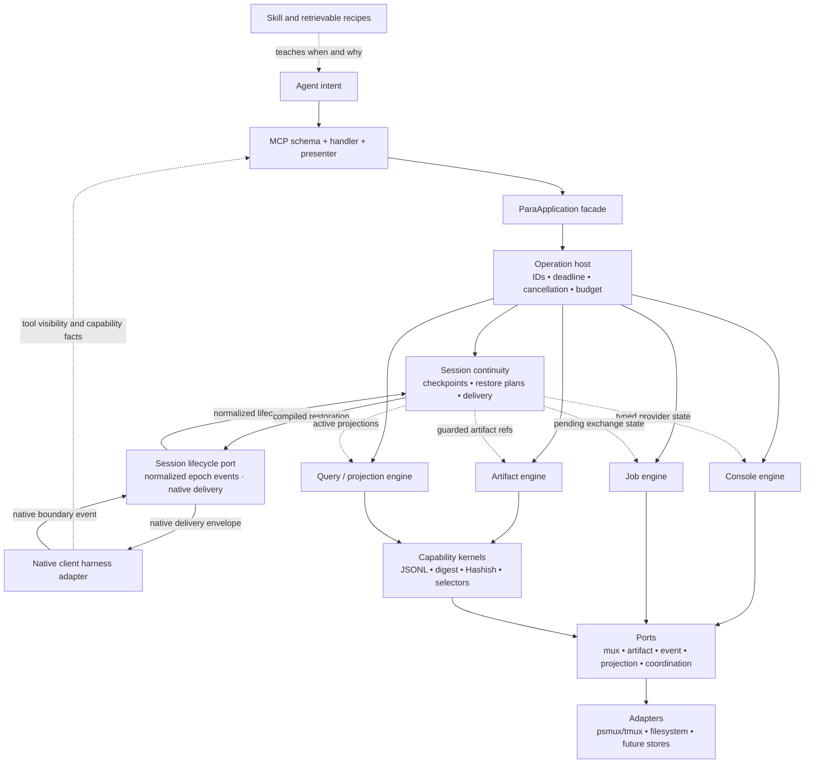

# para-agent backend engine and agent-facing surface

**Status:** design note; no implementation authorized | **Date:** 2026-08-10

**Scope:** adapt the architectural lesson of Codex-Scientiae's `jsonl_engine` and `jsonl_engine-client` to para-agent's all-Node runtime, while locating Hashish, jso-jackson, capture, journals, receipts, and store logistics beneath the MCP surface

## Clarified direction

The older projects and Hashish are sources of backend capabilities and design vocabulary. They are not proposals for a corresponding set of MCP tools.

That distinction is stronger than “keep the tool count small.” Most of Hashish has no direct agent-facing meaning at all. Tokenization, fitted IDF state, SimHash, MinHash bands, Bloom membership, byte offsets, serialization policy, scratch placement, locks, digests, and projection caches are implementation machinery. An agent should express an intention such as “run this and return the failing test evidence,” “query these captured results,” or “compare these artifacts.” The backend may perform many internal operations to satisfy that intention without making the agent plan or call them.

The useful analogy from Codex-Scientiae is:

> one component owns artifact and store semantics; a narrow consumer-facing boundary makes those semantics easy to use and prevents every caller from rebuilding the operational logistics.

For para-agent, the target is not a literal Python-engine/PowerShell-client port. It is a stable in-process application facade over Node backend engines. MCP handlers are one adapter to that facade.

This does not add another agent-facing functional plane to Console, Artifact, Job, and Guidance. It places a capability substrate beneath the first three. Guidance explains when to use an agent operation; the backend makes the operation mechanically safe and economical once selected. Session Continuity is likewise a cross-cutting lifecycle service: it checkpoints typed contributions from those planes and compiles a bounded restoration for a new context epoch without becoming a memory or policy plane.

## What `jsonl_engine` and its client actually separate

Codex-Scientiae currently has more than an engine/client split. It has four distinguishable responsibilities:

| Existing component | Actual responsibility | Para-agent analogue |
|---|---|---|
| Python engine modules | JSON/JSONL policy, parsing, byte views, indexes, signatures, schemas, locking, and transactions | Node backend engines and capability kernels |
| Python CLI | A stable application boundary over engine operations | Typed in-process service methods; no CLI required in the hot path |
| Private PowerShell client | Runtime discovery, process lifetime, strict protocol validation, host-value conversion, deadlines, and cleanup | Mostly disappears in one Node process; the surviving concerns belong to a shared operation host |
| Public PowerShell cmdlets | Ergonomic parameters, safe defaults, cardinality checks, and result shaping | Thin MCP handlers calling an application facade |

The ownership statement is explicit in the [`jsonl_engine-client` README](../../../../codex-scientiae/src/jsonl_engine-client/README.md): Python owns parsing, pointers, sidecars, signatures, and transactions; the client owns the cross-runtime impedance. The package's [`__init__.py`](../../../../codex-scientiae/src/jsonl_engine/__init__.py) also declares a leaf-first dependency map rather than presenting one undifferentiated utility module.

Several details are especially worth preserving:

- `JsonlEngine` is deliberately a byte/transaction layer and disclaims kinds, schemas, ingestion, and run layout in [`engine.py`](../../../../codex-scientiae/src/jsonl_engine/engine.py).
- artifact kinds bind declared text, validation, naming, and sidecar policy above that byte layer through [`kinds/base.py`](../../../../codex-scientiae/src/jsonl_engine/kinds/base.py);
- the private client centralizes interpreter selection, exact argument passing, environment isolation, deadlines, process-tree cleanup, UTF-8 framing, sequence validation, and all-or-nothing result release;
- the public wrappers collapse physical read modes into a safe `Complete` default and preserve JSON values across PowerShell's different pipeline semantics;
- the client explicitly says to cross the boundary once per artifact or query, never once per record.

Those are examples of operational concerns disappearing from callers. They are not a reason to expose the engine's 17 current CLI verbs as 17 para-agent tools.

## The target stack



The lifecycle path deliberately bypasses the MCP schema, handler, and presenter: a native compaction/start event is not an MCP request. The same Continuity service can also be reached through the application/operation host for explicit checkpoint, fork, handoff, or recovery use cases, but the two entry paths share semantic records rather than pretending to share a transport.

The dependency direction is load-bearing:

- only the MCP adapter imports the MCP SDK, tool schemas, or MCP content-block types;
- the application facade expresses para-agent use cases but knows no physical scratch paths or tmux argument syntax;
- engines know the shared contracts and storage ports, not public tool names;
- storage and mux adapters own platform mechanics;
- Hashish knows bytes, tokens, models, and signatures only—never MCP, journals, hooks, paths, or governance;
- the continuity service owns checkpoint, restore-plan, and delivery semantics but not native hook syntax;
- native harness adapters remain outside this stack's semantic core, normalize only lifecycle events the client actually exposes, and never gain backend store authority merely because they can observe or inject at a client boundary.

## Name the middle boundary carefully

`jsonl_engine-client` is a reasonable name for a PowerShell consumer of a Python process. In para-agent, “client adapter” already means Claude, Codex, Cursor, or another native harness edge. Reusing the word for the in-process backend consumer would make the old mixed-concern problem easier to recreate.

Use a name such as `ParaApplication`, `OperationService`, or `BackendFacade` for the middle boundary. The exact name is open; its role is not:

1. accept one typed agent-level request;
2. select and compose backend capabilities;
3. apply operation-wide deadlines, cancellation, response budgets, retention, and client-profile defaults;
4. return one neutral typed result and receipt;
5. leave MCP rendering to the outer adapter.

An in-process call removes the need for CLI strings, JSON protocol frames, interpreter discovery, and per-call process launch. It does not remove the need for an explicit semantic contract.

At the MCP edge, the intended authoring experience is approximately:

```js
registerOperation({
  name: "run",
  input: RunRequest,
  effect: "execute",
  invoke: (request, context) => para.console.run(request, context),
});
```

Registration, cancellation wiring, stable error conversion, receipt presentation, progress adaptation, and response-budget enforcement should be shared. Tool descriptions still need deliberate agent-facing prose, but names, input/output contracts, effect class, cardinality, and capability metadata should derive from one typed operation definition rather than drift across server code, diagnostics, and documentation.

## Responsibility placement

| Concern | Agent-facing operation | Application facade | Backend owner |
|---|---|---|---|
| Session and pane lifecycle | Chooses create, reuse, or destroy | Resolves the use case and authorization boundary | Console engine plus mux port |
| Command capture | Supplies command, target, and desired result shape | Chooses capture profile, retention, and response budget | Capture engine and artifact/event stores |
| JSONL framing and serialization | Never specifies it | Selects a declared artifact kind/view | JSONL kernel and store adapter |
| Locks, leases, scratch, and atomic publication | Never specifies them | Establishes operation scope and retention intent | Storage adapter and transaction engine |
| Digests and source guards | Sees relevant provenance | Requires integrity where the operation needs it | Digest capability and artifact engine |
| Hashish algorithms | No direct tool | Requests a semantic projection only when useful | Projection engine and pure Hashish capability |
| Journal ingestion and settling | Requests current or bounded evidence | Coordinates before a read | Console/event engine |
| Cursors and pagination | May pass a continuation or selector | Validates scope and effective budget | Query engine and event/artifact store |
| Receipts | Receives one unconditionally | Assembles operation-level result and omissions | Engines supply measured facts; receipt contract checks invariants |
| MCP content blocks and callable continuations | Sees native tool results | Returns neutral references and continuation intents | MCP presenter maps them to `{tool, input}` |
| Guidance | Chooses a suitable operation | May consume a client economics profile | Skill/resources and sparse harness guidance |
| Context-epoch continuity | May pin eligible work state or choose a named profile | Resolves policy, target binding, budget, and restore mode | Session Continuity service checkpoints typed provider contributions; harness adapter performs native delivery |

Correctness policy belongs below the model. “Never silently omit a malformed frame,” “do not publish a stale index,” and “do not commit a poisoned write” are engine invariants. Application policy belongs in the facade: which view serves this request, whether a final report should inline at 12 KB, or whether an optional projection is worth computing. The agent owns material choices such as the task, target, destructive effect, expected evidence, and desired result shape.

## One agent call may be a substantial backend operation

The desired simplification is not a hidden chain of MCP calls. It is one in-process operation that performs record-wise and lifecycle work without another model turn.

For example, a future `run` path can be:

```text
run(request, context)
  → resolve pane and shell profile
  → acquire the pane's execution lane
  → open a journal turn and operation scope
  → stage a semantics-preserving wrapper
  → dispatch through the mux driver
  → stream output into the artifact store while measuring digest/counts
  → publish output and terminal events
  → satisfy the requested result selector from the captured artifact
  → optionally reuse or build an already-justified projection
  → assemble receipt, artifacts, omissions, and continuation
  → present the neutral result over MCP
```

The agent should not have to choose the wrapper encoding, sentinel filename, poll interval, scratch root, journal body path, digest implementation, index path, or cleanup sequence. Those are precisely the cognitive and operational load the backend exists to absorb.

The same principle applies to other use cases:

- `delegate` can compose authentication preflight, launch/resume, observation, talk-back state, report capture, and optional postconditions;
- an artifact query can compose source binding, safe view selection, framing, bounded selection, output materialization, and a receipt;
- job observation can ingest new events, settle completed work, reduce state, and return only the novel evidence within one budget;
- interactive driving can preserve the genuinely different `send`/`wait` execution model without exposing capture implementation details.

This is open-ended composition below a small intention surface, not a closed workflow forced on every task.

## Neutral operation context and result

The application boundary needs one common operation envelope even if individual use cases have different inputs. At minimum, the context should carry:

```text
request_id
deadline and AbortSignal
caller/client capability profile reference, when known
authorization/effect context
response and materialization budget
operation-scoped scratch and correlation identity
```

The neutral result should distinguish:

```text
status: complete | partial | running | failed
typed value or summary
artifact references
measured receipt
structured continuation, when applicable
stable error code, retryability, phase, and committed-effects facts
diagnostics/provenance that were requested or materially affect interpretation
```

Do not make MCP content blocks the backend result type. Do not let stores write continuation prose such as `call body(turn: 4)`. Engines report facts; the application assembles the semantic receipt; the MCP presenter turns a neutral continuation into an exact callable tool/input pair that is valid for the currently exposed surface.

## The backend service seams

The following are logical seams, not a requirement for one class or directory per bullet:

### Console engine

Owns session/pane state, the two execution models, per-pane sequencing, dispatch, cancellation semantics, and reconciliation with the mux driver. It should not serialize MCP responses.

### Artifact engine

Owns captured bytes, immutable references, source-generation guards, lifecycle/retention, atomic publication, manifests, and exact integrity. It is the common substrate for console bodies, delegated reports, query results, and imported source material. A durable `artifact_ref` remains distinct from an ephemeral validated `mount_ref`; the shared lifecycle and validation rules are specified in the [`Mounted Artifact contract`](mounted-artifact-contract.md).

### Event and journal engine

Owns append semantics, event validation, cursors, ingestion, reduction, and complete/partial views. A live high-frequency stream should retain para-agent's single-writer append posture or use immutable segments; it should not inherit Codex-Scientiae's copy-and-rehash `APPEND` implementation.

### Job engine

Owns state transitions, leases/fencing, causal links, talk-back, terminality, report references, and observation cursors. It consumes Console and Artifact services rather than duplicating their mechanics.

### Query and projection engine

Owns bounded selectors, source coordinates, reusable derived views, cache guards, search indexes, and candidate nomination. It chooses capability providers according to a semantic request and a versioned profile. Queries return guarded addresses or bounded values; disposable mounts, projections, and cursors never replace the artifact generation that guards them.

### Operation host

Provides cross-cutting request identity, cancellation, deadline, cleanup, concurrency control, budgets, and observability. These concerns should not be reimplemented in each MCP handler.

### Session Continuity service

Owns normalized context-epoch transitions, immutable checkpoints, target-specific restore plans, and per-delivery receipts. Console, Artifact, Job, query, task, capability, and Guidance components contribute typed state without controlling reinjection. The service persists richer reference-bearing state than it normally injects; a restore compiler selects a bounded target-client projection after revalidating identity, freshness, capabilities, permissions, and handles.

Native `PreCompact`, `PreCompress`, `SessionStart`, resume, or equivalent hooks are adapter evidence for `context_epoch_closing` and `context_epoch_opened`, not the portable contract itself. Unsupported clients use continuously maintained projections plus a first-call or explicit-resume fallback. The full provider, policy, fork, authority, omission, and delivery rules live in the [`Session Continuity contract`](session-continuity-contract.md).

## Where Hashish belongs

Hashish is a provider beneath the query/projection and artifact engines. It is not an MCP product family.

| Capability family | Backend use |
|---|---|
| Exact SHA-256 integration | Artifact identity and source guards; kept separate from Hashish's non-cryptographic families |
| Tokenization, shingles, histograms | Versioned derived views used by selected projections |
| SimHash and MinHash | Near-duplicate candidate nomination under compatible profiles |
| MinHash LSH | Candidate lookup inside a projection store |
| Jaccard, containment, or Levenshtein | Exact verification over the declared derived representation |
| TF-IDF and future retrieval models | Ranking inside an artifact query |
| Bloom | Internal negative membership acceleration for one complete generation |
| Count-Min and HyperLogLog | Optional telemetry where approximation is explicitly acceptable |
| Rolling hashes or CDC | Chunk-boundary selection before cryptographic chunk identities |

None of those names needs to appear in an ordinary tool schema. If an agent asks to compare two artifacts or find related results, the application requests the relevant semantic product and the receipt records the algorithm/profile/model provenance. The agent should not orchestrate `tokenize → simhash → lsh → jaccard`, and a positive Bloom lookup should never be presented as evidence merely because the backend used it.

The detailed compatibility, authority, and model-lifecycle rules remain in [`node-hashish-port-design.md`](node-hashish-port-design.md). That report should be read as a provider design inside this engine architecture, not as a proposal for an Artifact tool catalog.

## Where JSONL and jso-jackson concepts belong

JSONL framing, byte coordinates, guarded indexes, declarative selectors, output materialization, and no-silent-omission accounting likewise belong behind the artifact/query boundary.

`head`, `tail`, `range`, `get`, `select`, and `find` are useful engine selector modes. They do not automatically deserve six MCP schemas. One artifact query can accept a typed selector and return bounded values with exact source coordinates and a materialized result reference.

The important transfer from jso-jackson and Codex-Scientiae is ownership:

- one implementation defines framing and parsing policy;
- safe defaults do not require every caller to understand torn tails or source replacement;
- indexes are disposable projections bound to an exact frozen artifact generation or component digest plus their projection profile/model; the live source generation remains provenance and freshness evidence;
- large result sets publish as artifacts rather than accumulating in an MCP response;
- physical, valid, malformed, matched, emitted, and withheld counts remain explicit;
- a manifest or terminal receipt publishes last as the operation commit marker.

## Tool admission rule

A backend capability should become a model-visible MCP tool only when all of the following are true:

1. it represents a distinct decision the agent genuinely needs to make;
2. it has a distinct effect, permission, lifecycle, or failure contract;
3. folding it into an existing operation would make that operation ambiguous or unsafe;
4. the workflow is common enough to justify resident description/schema cost and misuse risk;
5. its result cannot be expressed cleanly as a selector, option, continuation, or artifact of an existing intent.

Module count, algorithm count, and CLI verb count are not evidence for tool count.

This rule does not imply one overloaded mega-tool. The current console primitives mostly represent real differences: persistent shell execution, interactive keystrokes, observation, and destructive control are not interchangeable. Higher-level `delegate`, batched `run`, artifact query/materialization, and job submit/observe/control operations may reduce common call chains while retaining lower-level escape hatches where the agent truly needs interactive control.

An internal capability registry can describe providers, cost, limits, determinism, and availability without automatically registering MCP schemas. If capability discovery is useful to an agent, expose a compact high-level resource such as “guarded JSONL selection available,” not an eagerly resident catalog of hash primitives and storage verbs.

## Current para-agent pressure points

The current implementation already contains several good backend seams: [`Mux`](../../../mcp/para-agent/src/mux.js) is close to an infrastructure adapter, captured command output bypasses the terminal, and the Console contract establishes producer-neutral records, external bodies, unconditional receipts, and reader-held cursors.

The main entrypoint now carries too many layers at once:

- [`index.js`](../../../mcp/para-agent/src/index.js) imports the MCP SDK, constructs `Mux`, owns journal-root policy and caches, registers schemas, orchestrates use cases, and formats responses;
- `status` manually constructs and parses the tmux format;
- `exec` owns ephemeral-session naming, creation, capture, retention warnings, teardown, and cache cleanup;
- `log`, `body`, and `find` each remember to ingest the inbox and finalize open turns before reading;
- output deduplication exists both at the presentation edge and in journal code;
- [`journal.js`](../../../mcp/para-agent/src/journal.js) spans physical layout, sequencing, ingestion, queries, receipt construction, and user-facing continuation details.

These are not arguments for changing behavior immediately. They show where the application facade would remove duplication and make future capabilities cheaper to integrate without expanding `index.js` or the agent's instructions.

## Guidance should teach intent, not backend procedure

The implicit skill layer should explain the small number of choices the backend cannot make for the agent:

- persistent shell command versus interactive program;
- observe versus control;
- inline answer, bounded evidence, or retained artifact;
- wait for terminality versus return a durable continuation;
- when an explicit verifier or postcondition matters.

It should not teach agents how to select hash algorithms, maintain indexes, stage JSONL inputs, calculate scratch paths, poll sentinel files, or reconcile journal records. Repeated guidance about those mechanics would be evidence that the backend boundary is too weak.

Principled openness comes from typed selectors, optional evidence and verification requests, application-level recipes, and lower-level interactive escape hatches—not from exposing every primitive or making the agent assemble an internal execution graph.

## Suggested logical module shape

The exact filesystem layout can wait, but the dependency shape should be testable. A compact starting point is:

```text
src/
  contracts/       artifact, receipt, console event, job event, continuation, continuity
  application/     ParaApplication and use-case services
  engines/         console, artifact, event, job, query/projection, session continuity
  capabilities/    digest, Hashish-derived projections, JSONL/selectors
  ports/           mux, artifact store, event store, projection store, coordination
  adapters/        psmux/tmux and filesystem implementations
  mcp/             schemas, handlers, presenter, server startup
```

Client-harness hooks remain outside the stable engine dependency graph: they translate native lifecycle envelopes and deliver compiled restorations. The continuity provider/checkpoint/restore contracts and bounded projection publisher belong to the stable semantic core. Privileged multi-client administration remains out of band.

## What not to copy from the WIP analogue

Codex-Scientiae's engine is useful precisely because its unfinished edges are visible:

- do not retain a subprocess/JSON-lines protocol when typed objects stay inside one Node process;
- do not translate an internal CLI verb list into MCP registrations;
- do not allow a generic artifact engine to accumulate article-deposit or other domain orchestration merely because it can serialize the result;
- do not use copy-on-write whole-store `APPEND` for a live console/job event stream;
- do not accept a primary artifact and sidecars as one atomic set unless a manifest-last publication contract makes that true;
- do not buffer an unbounded successful result in memory merely to preserve all-or-nothing response semantics—stage it as an artifact, then publish the small terminal result;
- do not let temporary ownership remain a caller convention; the operation scope should own scratch, cleanup, and retention transfer;
- do not return bare projected JSON values without guarded source coordinates;
- do not expose a raw `verb + argv` escape hatch to the model.

The reusable principle is centralized semantic ownership, not the current file organization or CLI surface.

## Design sequence

No source refactor is authorized by this report. If implementation begins later, the lowest-risk sequence is:

1. freeze current MCP behavior and Console invariants with conformance fixtures;
2. introduce a neutral operation context/result and `ParaApplication` facade while existing handlers and tools remain unchanged;
3. move repeated journal settling, lifecycle, cancellation, budget, and receipt composition behind that facade;
4. establish Artifact references and storage ports before adding new derived capabilities;
5. establish normalized context-epoch identity, continuity contributions, checkpoint publication, and delivery receipts before automating reinjection;
6. add higher-level operations only where measured workflows show call-chain or misuse savings;
7. integrate exact digests first, then Hashish-derived projections only for a concrete query or comparison workload;
8. reconsider a worker or daemon boundary only when isolation, concurrency, or lifecycle requirements justify an actual process boundary.

This lets the internal architecture improve without prematurely deciding the final public tool surface.

## Decisions still open

1. What name best prevents confusion between the in-process application facade and native client/harness adapters?
2. Is the Artifact service the common owner of console bodies, delegated reports, query results, and imported sources, or do any require a genuinely different retention authority?
3. Which current console primitives remain eagerly exposed after higher-level operations exist?
4. What is the smallest typed result-selector model that covers inline summary, matches, slices, and retained artifacts without becoming a generic query language?
5. How does a client economics/capability profile influence response defaults without changing backend correctness semantics?
6. Should the live event store remain one append-only file per stream, rotate into immutable segments, or use another single-writer layout?
7. Which operation effects require manifest-last atomic publication, and which projections may be rebuilt after an honestly reported partial commit?
8. What first demonstrated workload justifies any approximate Hashish projection beyond exact digest and exact lookup?
9. Which component owns the durable continuity checkpoint store and configuration precedence when several MCP providers, a task service, and a client adapter contribute state?

Two decisions are no longer open: Hashish primitives do not become MCP tools, and the absence of a process boundary does not justify collapsing the application/engine boundary.
