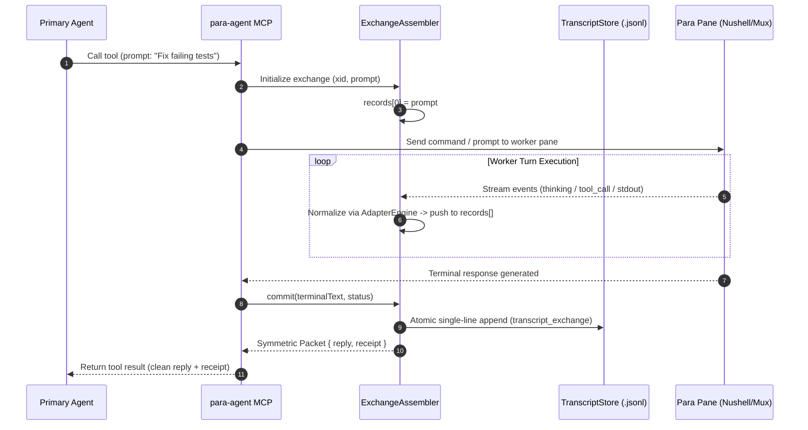

# Mediated Transcript, Client Adapters, and Nushell Engine Architecture

**Status:** Reference Architecture & Implementation Report | **Date:** 2026-08-14  
**Author:** Science Facility / para-agent R&D  
**Scope:** Replaces legacy text journals with a structured, JSONL-backed mediation transcript, data-driven client adapters, transactional `ExchangeAssembler`, and a Nushell (`NuEngine`) query substrate with progressive disclosure.

---

## 1. Executive Summary & Core Philosophy

The `para-agent` MCP server acts as an **authoritative mediation layer** between a Primary Supervisor Agent (e.g., Claude Code) and worker Para Agents (e.g., OpenAI Codex, Antigravity CLI, or headless Nushell daemons).

Rather than merely exporting raw native client transcripts or writing unstructured terminal scrapings, `para-agent` owns a third, **mediation-level transcript**:

```
Primary Native Transcript                Para Native Transcript
────────────────────────────────────     ────────────────────────────────────
Human Prompt                             Received P1
Primary Thinking                         Para Thinking & Tool Executions
MCP Tool Call { prompt: P1 }             Produced Terminal Reply R1
MCP Tool Result { reply: R1 }            Received P2
Primary Thinking                         Para Thinking & Tool Executions
MCP Tool Call { prompt: P2 }             Produced Terminal Reply R2
MCP Tool Result { reply: R2 }
Primary Final Human Response
                     │                                 │
                     └────────────────┬────────────────┘
                                      ▼
                      Para-Agent MCP Transcript (.jsonl)
       ─────────────────────────────────────────────────────────────────
       Row 0:  Transcript Header (Session, Participants, Schema Bindings)
       Row 1:  Exchange 1: Primary ──P1──► Para ──R1──► Primary (records[])
       Row 2:  Exchange 2: Primary ──P2──► Para ──R2──► Primary (records[])
```

### Key Architectural Invariants

1. **Symmetric Dialogue Cadence (`prompt -> prompt`):** The primary communication unit is clean conversational text. The terminal reply produced by the Para agent simultaneously serves as the prompt for the Primary agent.
2. **Context Window Protection via Progressive Disclosure:** Internal model reasoning traces, intermediate tool calls, and large output bodies are committed to disk; the Primary receives a lean conversational reply plus a lightweight receipt by default.
3. **Asymmetric Data Authority:**
   * **Ingress Prompt:** Authoritative from the primary MCP request.
   * **Reasoning, Tools, & Reply:** Authoritative from the receiving client adapter.
   * **Mediation Envelope:** Timings, `_xid`, and transaction status committed by `ExchangeAssembler`.
4. **All Clients are Symmetrical:** `claude`, `codex`, and `agy` are normalized identically through declarative configuration files without hardcoded branching in the engine.
5. **Nushell as Query & Runtime Substrate:** Project-local Nushell (`nu.exe`) provides cross-platform shell parity, profile isolation, and high-performance streaming projections over JSONL artifacts.

---

## 2. The 3-Tier Schema Hierarchy

All transcript artifacts and adapters conform to strict JSON Schema contracts located in [`mcp/para-agent/src/schemas/`](../../../mcp/para-agent/src/schemas/):

```
┌────────────────────────────────────────────────────────────────────────┐
│ Tier 1: Row 0 (File Root Header)                                       │
│ schema: transcript-header.schema.json                                  │
│ • Immutable session identity, schema URNs, workspace root              │
│ • Registered participant identities & default client bindings          │
├────────────────────────────────────────────────────────────────────────┤
│ Tier 2: Rows 1..N (Exchange Envelopes)                                 │
│ schema: transcript-exchange.schema.json                                │
│ • _xid, _xidx, exchange_start, exchange_end, model, effort, status     │
│ • Chronological records[] array                                        │
├────────────────────────────────────────────────────────────────────────┤
│ Tier 3: Internal Micro-Steps (Inside records[])                        │
│ • prompt: Authoritative ingress prompt delivered from primary          │
│ • thinking: Model reasoning / chain-of-thought trace                   │
│ • tool_call: Tool invocation, input parameters, and response           │
│ • response: Interim commentary or terminal response                   │
└────────────────────────────────────────────────────────────────────────┘
```

---

## 3. Declarative Client Adapter Architecture

Instead of maintaining separate schema formats for each vendor, `para-agent` defines a single meta-schema: [`client-adapter.schema.json`](../../../mcp/para-agent/src/schemas/client-adapter.schema.json). 

Concrete adapters ([`src/adapters/*.json`](../../../mcp/para-agent/src/adapters/)) are declarative mapping definitions loaded at runtime by `AdapterEngine`:

```
┌─────────────────────────┐
│ Native Client Log/Event │
└────────────┬────────────┘
             │
             ▼
┌─────────────────────────┐
│ AdapterEngine.normalize │
│   • codex.json          │ ──► Canonical Record:
│   • claude.json         │     { _type: "tool_call", tool_name, input, response }
│   • agy.json            │     { _type: "thinking", text }
└─────────────────────────┘
```

### Specimen Adapter Configuration (`adapters/codex.json`)

```json
{
  "schema_version": 1,
  "client_id": "codex",
  "display_name": "OpenAI Codex CLI",
  "provenance_mappings": {
    "thread_id": "_thread_id",
    "turn_id": "_turn_id",
    "model": "_model",
    "effort": "_effort"
  },
  "record_mappings": {
    "prompt": { "native_type": "prompt", "text_path": "text" },
    "thinking": { "native_type": "thinking", "text_path": "text" },
    "tool_call": {
      "native_type": "tool_call",
      "tool_name_path": "tool_name",
      "tool_kind_path": "tool_kind",
      "tool_use_id_path": "tool_use_id",
      "input_path": "input",
      "result_path": "response",
      "status_path": "status"
    },
    "response": { "native_type": "response", "text_path": "text", "phase_path": "phase" }
  }
}
```

---

## 4. `ExchangeAssembler` Transaction Lifecycle

The [`ExchangeAssembler`](../../../mcp/para-agent/src/assembler.js) coordinates with [`TranscriptStore`](../../../mcp/para-agent/src/transcript.js) to manage the physical lifecycle of an interaction:



### Transactional Guarantees

* **Atomic Append:** Exchange rows are staged entirely in-memory and committed as a single `\n`-delimited serialized string using Node.js `fs.appendFile`.
* **Zero Corruption on Timeout:** An interrupted turn records `status: "interrupted"` or remains stage-isolated without corrupting the durable history.
* **Row 0 Lock:** `TranscriptStore.init()` guarantees the schema-valid `transcript_header` is present before any exchange rows can be written.

---

## 5. Progressive Disclosure & Scrutiny Surface

To avoid overwhelming the Primary agent's context window while retaining total forensic auditability, `para-agent` exposes a 4-level progressive disclosure ladder:

| Level | Content Returned | Primary Token Cost | Tool Surface |
| :--- | :--- | :---: | :--- |
| **Level 0** | Pure Conversational Reply | ~50–150 tokens | Default turn response |
| **Level 1** | Exchange Receipt (`_xid`, tool count, duration) | ~30 tokens | Attached to turn receipt |
| **Level 2** | Filtered Record List (tools only, thinking only, failures) | ~100–300 tokens | `scrutinize({ xid, filter })` |
| **Level 3** | Full Forensic Step Inspection (exact diff / tool body) | On demand | `scrutinize({ xid, step })` |

### Scrutiny Tool Implementation (`src/index.js`)

Backed directly by `NuEngine`, the `scrutinize` tool runs high-speed structured queries over the physical `.jsonl` file:

```nu
# Example: Supervisor inspecting all tool calls in an exchange
open --raw session.jsonl 
  | lines 
  | each { from json } 
  | where record_type == "transcript_exchange" and exchange_id == "xid-001" 
  | get 0.records 
  | where _type == "tool_call" 
  | select tool_name status input response
```

---

## 6. Self-Contained Binary Dependencies & Multi-Profile Layout

All executable dependencies are co-located in the repository:
* **Nushell:** [`mcp/para-agent/bin/nu/nu.exe`](../../../mcp/para-agent/bin/nu/nu.exe) (v0.114.1)
* **Multiplexer:** [`mcp/para-agent/bin/mux/tmux.exe`](../../../mcp/para-agent/bin/mux/tmux.exe) (`psmux` v3.3.7)

### Three Dedicated Nushell Profiles ([`mcp/para-agent/profiles/`](../../../mcp/para-agent/profiles/))

1. **`backend/` (`env.nu`, `config.nu`):** Headless stdio daemon profile for background script evaluation via `NuEngine`. Zero ANSI, no interactive banner, no history.
2. **`para-agent/` (`env.nu`, `config.nu`, `helpers.nu`):** Worker agent pane profile. Deterministic `nu> ` prompt, banner suppressed, worker helper commands (`para-emit`, `to-j`, `para-touch`).
3. **`primary-agent/` (`env.nu`, `config.nu`, `para-cli.nu`):** Supervisor agent profile. Custom prompt (`para [supervisor]> `), `.para-agent/history.txt` history, supervisor multiplexer commands (`para-panes`, `para-sessions`, `para-peek`).

---

## 7. Verification Summary

The complete stack has been validated in end-to-end tests:
* **System CLI Discovery:** Successfully verified execution of `claude` (2.1.226), `agy` (1.1.12), and `codex` (0.147.0) inside live Nushell panes with ~160–320ms execution times.
* **Schema Inference & Validation:** Verified `Get-JsonlSchema` from `jso-jackson` on live exchange specimens.
* **Full Assembly Cycle:** Verified `ExchangeAssembler` $\rightarrow$ `TranscriptStore` $\rightarrow$ `NuEngine` scrutiny query lifecycle in `test_transcript_pipeline.js`.
