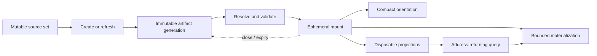

# Mounted artifact lifecycle contract

**Status:** architectural design note; no implementation or public tool surface authorized

**Date:** 2026-08-10

**Scope:** a provider-neutral backend contract for binding immutable artifacts as validated, selectively queryable runtime surfaces

## Decision

A mounted artifact is not a pathname and mounting is not an operating-system filesystem operation. It is a validated runtime binding between an immutable artifact generation and the backend services that can orient, query, and selectively materialize it.

The contract deliberately distinguishes four identities:

| Identity | Meaning | Expected lifetime |
|---|---|---|
| `source_generation` | The observed source roots, versions, and guards from which an artifact was produced | Provenance record; its external sources may later change or disappear |
| `artifact_ref` | A durable reference to one immutable, portable artifact generation | Durable and shareable for as long as the artifact is retained |
| `mount_ref` | A validated runtime binding of that artifact inside one backend authority | Ephemeral, leased, and recreatable |
| `projection_ref` and cursor | A derived index, survey, signature model, result ordering, or position bound to an exact artifact generation and profile | Disposable; reusable only while the base artifact/component and projection profile/model guards match |

These identities must never be substituted for one another. In particular:

- an artifact can remain valid even after its original source changes;
- a mount can expire without invalidating the artifact;
- a projection can be stale while the base artifact remains valid;
- a cursor is not portable unless its contract explicitly says so;
- a local directory path is a locator, not an artifact identity;
- a resemblance fingerprint is not exact artifact identity.

The backend owns mounting, validation, path resolution, index binding, caching, bounded reads, receipts, and cleanup. The model should normally ask an intention-level question such as “open this snapshot,” “find relevant files,” or “fetch these results.” It should not assemble a sequence of index, digest, shard, and cache operations.

This generalizes donor ideas in the [reposnapshot MCP vision](../../reposnapshot/design/mcp-surface.md), [jso-jackson implementation](../../../utils/jso-jackson/jso-jackson.ps1), [para-agent backend architecture](backend-engine-architecture.md), and [Hashish capability inventory](hashish-capability-inventory.md). It does not claim that any donor already implements this contract.

## Why the mount boundary exists

Portable artifacts are intentionally useful without a specialized service: a user can upload them, publish them, inspect their manifest, and seek their payloads with ordinary file readers. A backend mount adds a richer access mode without becoming a prerequisite for the artifact.

The binding removes repeated operational work from callers:



Without a mount, every operation must rediscover the entry point, reparse the catalog, resolve components, check offsets, and hope that every submitted path names the same generation. With a mount, that work happens once under a defined validation policy and subsequent operations carry a small opaque reference.

The boundary also creates a place to enforce invariants that prose guidance cannot reliably supply:

- exact base-artifact generation or component-digest binding for indexes and projections;
- path confinement and component integrity;
- declared byte, codec, and coordinate semantics;
- result budgets and no-silent-omission accounting;
- consistent receipts across different artifact formats;
- safe remounting after server restart or context compaction.

## Contract vocabulary

### Source generation

A `source_generation` is the acquisition-time description of what was observed, not a promise that the source remains current. Depending on the provider it can include:

- one or more canonical source roots;
- repository URL and commit, tree, or worktree state;
- file identity, size, last-write, and cryptographic digest guards;
- selection scope and declared unavailable inputs;
- capture start/end times and race policy;
- source adapter and version.

Mutable guards such as a timestamp or path can support diagnostics, but cannot replace exact content identity. If a source cannot supply a stable revision, the creator should digest the acquired bytes and describe any race window. Freshness relative to the live source is a later comparison, not part of mount integrity.

### Artifact reference

An `artifact_ref` identifies one published artifact generation. Conceptually it binds:

```text
artifact lineage and generation
artifact kind and format version
manifest identity
exact package or component digests
semantic profile identity
layout profile identity
portable locator or locator-resolution method
retention and authority scope, where relevant
```

The reference should separate identity from location. The same immutable package may be reachable through a local directory, an artifact store, or a published repository without acquiring a new identity. Conversely, replacing bytes at the same path creates a different generation and must never silently satisfy the old reference.

Two exact digests can be useful when a provider has a canonical logical representation:

- a **package digest** identifies the exact manifest and component bytes, including layout;
- a **logical-content digest** identifies a declared canonical content view across equivalent repackings.

The latter is optional and meaningful only when its canonicalization and semantic profile are versioned. It must not be improvised from a fuzzy or non-cryptographic hash.

### Mount reference

A `mount_ref` is an opaque, unguessable handle to a backend record containing at least:

```text
artifact_ref and resolved local generation
validation policy and completed checks
component table and safe resolved locations
logical-address catalog
available view and projection capabilities
opened-at, last-access, lease, and authority scope
validation receipt reference
```

It is valid only within the issuing backend instance or explicitly named shared authority. It can be revoked or expire. Sharing an artifact does not imply sharing a mount, and a mount ID alone is not enough to recover an artifact on another backend.

### Projection reference

A `projection_ref` identifies a derived view over an exact artifact generation. Examples include:

- a JSONL byte-offset table;
- an empirical schema or structural survey;
- a lexical inverted index;
- a MinHash/LSH candidate index;
- a TF-IDF model;
- a residue or cross-reference catalog;
- a query result set too large to return inline.

Its identity must bind the artifact generation, projection kind, provider implementation/version, semantic profile, algorithm parameters, and any fitted model state. A projection is rebuildable unless its contract explicitly promotes it to a retained artifact. Deleting a cache must not delete or alter the mounted artifact.

A **retained sidecar** declared as a manifest component is part of the immutable artifact package, not a disposable projection cache. Rebuilding or replacing that component creates a new artifact generation. A **detached projection** carries its own `projection_ref`, binds the exact base artifact/component generation, and may be discarded or rebuilt without changing the artifact. “Optional for this consumer” does not make a manifest-bound component mutable.

### Address and cursor

An address identifies material, not a local file slice in isolation. It binds:

```text
artifact generation
logical item or record identity
named view
coordinate space and unit
component plus bounded span, when physically addressed
optional source-map reference
```

A cursor additionally binds the projection/result ordering, normalized query or selector identity, page boundary, and expiry policy. It must fail closed when applied to another artifact generation, another projection profile, or another ordering. “Continue from byte 4000” is not an adequate cursor.

## Semantic profiles and physical profiles

The configuration surface should distinguish choices that change what the artifact means from choices that change how it is packaged.

| Profile class | Representative choices | Agent relevance |
|---|---|---|
| Semantic profile | source selection, ignore regime, content-class routing, normalization, stripping/extraction policy, segmentation semantics, retained channels | Consequential and visible; should be selectable through named intents or explicit exceptional overrides |
| Layout profile | packing strategy, shard target, compression, page size, index layout, cache placement, transport filename conventions | Usually backend policy; expose only when a transport or retention requirement makes the choice material |
| Projection profile | tokenizer, feature view, ranking/similarity algorithm, model corpus, thresholds, approximation policy | Selected by semantic query intent; algorithm provenance belongs in the receipt, not ordinary agent choreography |

All three are versioned and receipted. The semantic profile is part of logical artifact identity. The layout profile affects exact package bytes and physical addresses even when two packages carry equivalent logical content. A projection profile is part of `projection_ref`, never silently inherited from whichever cache happens to exist.

Named profiles should absorb safe defaults. An agent might choose `code-faithful`, `code-economy`, or `documentation` because those express material intent. It should not normally choose buffer sizes, offset-table filenames, hash seeds, cache roots, or shard packing heuristics.

## Lifecycle operations

These are backend contract operations, not a proposed one-to-one MCP tool list.

### Create

`create` acquires a declared source generation, applies a semantic profile, renders a layout, validates the result, and publishes one immutable artifact generation.

Required semantics:

1. acquire into operation-owned staging;
2. record source provenance and selection diagnostics;
3. apply transformations with versioned processing receipts;
4. write payload components and any retained manifest-bound sidecars;
5. compute exact component/package digests;
6. validate structure, addresses, and declared preservation claims;
7. publish the terminal manifest or commit marker last;
8. return an `artifact_ref` and creation receipt only after successful publication.

An aborted or failed create may leave quarantined diagnostics or explicitly owned scratch, but it must not publish a normal `artifact_ref` to a half-written generation. Detached projections may be built after publication and receive separate `projection_ref` identities; their failure does not rewrite or partially publish the artifact. Auto-mounting the successfully created artifact is an application optimization, not a different artifact operation.

### Open

`open` resolves an existing `artifact_ref` or an explicitly authorized import locator, validates the generation, builds its runtime catalog, and returns a `mount_ref` plus a compact orientation result.

Opening a bare directory is an import request, not proof that the directory already satisfies the contract. The provider may construct an engine-owned validation envelope for a legacy package, but it must preserve the distinction between:

- native contract artifact;
- validated legacy artifact with reduced guarantees;
- unverified directory that was merely found.

### Refresh

`refresh` reacquires the source lineage and creates a new immutable artifact generation. It never rewrites the mounted generation in place.

The result reports whether the observed source or semantic result changed, returns the new `artifact_ref`, and leaves existing mounts and citations bound to the old generation. Switching an active task to the new generation is a distinct application decision. “Follow latest” behavior, if ever supported, must be explicit and must emit a generation-change receipt.

Cheap regeneration is a normal lifecycle, not evidence that artifact identity can be weak. Inexpensive artifacts are still immutable after publication.

### Validate

`validate` evaluates a named validation policy and returns measured checks. Validation can occur during create, open, explicit audit, or before reuse after a storage event. It does not silently repair authoritative payloads.

Detached projections may be discarded and rebuilt when invalid. A missing or invalid manifest component prevents full validation of the published package, even when that component was optional for a particular consumer. An explicit recovery or legacy-compatibility path may expose independently verified base material under reduced guarantees, but it must not issue a normal fully validated mount, silently repair the component, or reuse the same artifact generation for replacement bytes. An unavailable detached optional projection merely removes its declared capability and does not contaminate valid base reads.

### Orient

`orient` returns the smallest useful catalog of the mounted generation without materializing primary bodies. Depending on artifact kind, it can contain:

- artifact kind, generation, source provenance, and creation time;
- semantic profile and consequential transformations;
- roots, logical partitions, record/file counts, and size distribution;
- available views, projection kinds, and query modes;
- coverage dispositions, declared omissions, residues, and failed inputs;
- validation class and important caveats;
- examples of valid selectors and bounded next actions.

Orientation is a projection of the manifest, not the entire manifest by default. Embedded operator guidance remains content with declared provenance; mounting does not promote artifact prose into system authority.

### Query

`query` applies a typed selector or named search intent to the mounted catalog or a compatible projection. Its normal result is a bounded list of addresses and compact evidence, not the addressed bodies.

Resemblance methods must label their outputs as candidates. Approximate similarity, sketches, and fuzzy signatures cannot be presented as exact equality, freshness, or completeness evidence. Bloom membership is a different branch: a positive is only “may contain” and requires exact verification, while a negative supports absence from the indexed set only when the filter is complete, compatible, and bound to the exact generation. Exact verification can be composed inside one backend operation when the request requires it.

### Materialize

`materialize` resolves one or more guarded addresses and returns bounded content, metadata, or a newly retained result artifact. Batch materialization is first-class so a caller can fetch several planned spans without repeated manifest parsing or one model turn per record.

The operation must account for requested, resolved, emitted, withheld, missing, malformed, and over-budget items separately. If the complete result exceeds the inline budget, the backend should publish a result artifact and return a compact receipt plus continuation rather than silently truncate or exhaust context.

### Close

`close` releases a mount lease, open descriptors, private caches, and mount-local projection state. It does not delete the underlying artifact. Expiry or session cleanup can perform the same operation automatically.

Artifact deletion is a separate retention-authority effect and is outside this contract's ordinary mount lifecycle.

## Mount admission and validation

Artifacts and manifests are untrusted input, including artifacts created by an older version of the same project. A strict mount performs layered validation before issuing a usable handle.

### 1. Locator and confinement checks

- resolve the authorized artifact locator to a canonical root;
- require every manifest, shard, sidecar, and index path to resolve within that root or another explicitly authorized component root;
- reject absolute, traversal, ambiguous, device, alternate-stream, and case-colliding paths where applicable;
- reject or explicitly govern symbolic links, junctions, and reparse points;
- never follow an external pointer or network reference merely because a manifest names it;
- bind opened components in a way that detects replacement between validation and read.

Path confinement applies equally to reads, projection output, residue access, and any generated materialization.

### 2. Manifest and schema checks

- recognize exact magic/kind and supported format version;
- parse under byte, nesting, field-count, and record-count limits;
- require unique component, row, and logical-item identities;
- validate declared encoding, codec, offset unit, endianness, and framing policy;
- reject inconsistent counts, duplicate catalog entries, and unsupported required features;
- preserve unknown optional declarations for diagnostics rather than guessing their semantics.

A self-describing header helps orientation but does not validate itself.

### 3. Component integrity checks

- require every declared manifest-bound component that participates in package identity to exist with the declared file type;
- compare exact size and cryptographic digest to the manifest;
- validate package-level identity after component resolution;
- distinguish a capability omitted by design from a declared component that is missing or corrupt; consumer-level optionality does not erase package damage;
- report validation depth rather than calling a magic-number probe “verified.”

Non-cryptographic fingerprints can accelerate candidate checks, but cannot authorize a component or establish exact equality.

### 4. Address checks

- require `0 <= begin <= end <= component_length` for every physical span;
- state whether the end is inclusive or exclusive;
- reject integer overflow and arithmetic wraparound;
- verify that row lengths, framing, and catalog spans agree;
- validate ordering, overlap, and uniqueness constraints declared by the format;
- decode under the declared codec and verify logical identifiers where feasible;
- distinguish source-byte, processed-content, encoded-view, and container-byte coordinates.

Sampling can be offered as a cheaper audit level, but a sampled result is not equivalent to full address validation. Native creation should perform the strongest affordable validation before publication.

### 5. Sidecar and projection binding

Admission first classifies each auxiliary object as either an immutable manifest-bound artifact component or a detached projection. The former participates in package validation and cannot be rebuilt in place; the latter remains separately guarded and disposable.

Every sidecar or derived index must carry or be paired with:

- exact base artifact generation or component digest;
- sidecar kind and format version;
- builder implementation/version;
- profile and parameter identity;
- record/count/coordinate-space declarations;
- build completion marker and integrity digest.

An index with plausible magic and offsets but no base-generation binding is stale until proven otherwise. The backend may rebuild a disposable index; it may not silently apply it to similar-looking bytes.

## Query, candidates, and bounded materialization

The default navigation loop is:

```text
orient
  -> query or scan returning guarded addresses
  -> choose addresses
  -> batch materialize within a declared budget
  -> continue through a guarded cursor when needed
```

This separates reconnaissance from context admission. A search result should include enough evidence to choose—logical name, compact snippet or score, match kind, source coordinates when available—without paying for every body.

Query results need an evidence class:

| Evidence class | Examples | Permitted interpretation |
|---|---|---|
| Exact catalog/filter | exact path, declared attribute predicate, record identity | The declared catalog condition matched |
| Exact derived measure | verified Jaccard over a named shingle view, exact text predicate | The declared measure produced the reported value |
| Ranked lexical result | TF-IDF or term index | Relevance ranking under the fitted corpus/profile |
| Approximate resemblance candidate | SimHash comparison, MinHash LSH, heuristic fuzzy digest | Worth checking; not proof of equality, freshness, or completeness |
| Probabilistic membership | Bloom filter bound to a declared complete key set | A negative can rule out membership in that indexed set; a positive requires exact verification and supplies neither resemblance ranking nor candidate identity |
| Structural/empirical survey | recovered JSON paths/types, code-element survey | Observation under the stated parser/fidelity, not a complete language truth |

Stable ordering and tie-breaking are part of a cursor's profile. A changed query, budget, model, or artifact generation requires a new cursor unless the contract proves compatibility.

Materialization must enforce both per-item and aggregate limits. It should prefer semantic boundaries, but an exact byte-span escape hatch remains useful when the address already names a valid declared view. All returned content retains its artifact generation and address provenance.

## Coverage, omission, residue, and reconstructibility

“Lossless” is too coarse for a configurable ingestion system. This contract uses separate, testable claims.

### Coverage dispositions

Every source candidate known to acquisition should receive a disposition such as:

```text
included unchanged
included transformed
retained in a residue channel
represented by an external pointer
excluded by declared selection policy
failed with declared reason
unknown because source enumeration was incomplete
```

A clean primary payload does not justify erasing these distinctions. Counts and material exceptions belong in the manifest and receipts even when individual diagnostics live in a sidecar.

### Preservation levels

| Claim | Required evidence | What it does not claim |
|---|---|---|
| **Omission declared** | Effective selection/processing policy plus per-class or per-item disposition accounting | The omitted bytes are retained |
| **Residue retained** | Addressable artifact-local material, kind, source relationship, and integrity guard | The original can be reconstructed automatically |
| **Externally referenced** | Guarded locator and relationship metadata | The target remains available, portable, or unchanged |
| **Reconstructible** | Total inverse mapping over all transformed/retained channels plus a successful exact round-trip digest | That every consumer needs or should perform rehydration |

An artifact may satisfy different levels for different content classes. A comment sidecar might retain removed documentation while a large binary is only declared and externally referenced. The manifest must not promote the strongest local claim into a package-wide claim.

The reposnapshot comment-sidecar and content-class work are explicitly forward designs in [comment ontology](../../reposnapshot/design/comment-ontology.md) and [assembly design](../../reposnapshot/design/rs.core.assemble-design.md). They establish valuable semantics—extraction instead of silent deletion, addressable residues, and round-trip verification—but are not current universal guarantees.

## Coordinate spaces and source maps

Normalization, comment extraction, segmentation, escaping, and sharding can all invalidate naive `path:line` or byte-offset correspondence. Every address therefore names a coordinate space.

Useful spaces include:

- `source_bytes`: acquired original bytes;
- `normalized_content`: content after declared ingest normalization;
- `processed_content`: primary semantic view after transformations;
- `encoded_view`: serialized logical content before container framing;
- `container_bytes`: exact component bytes and physical spans;
- provider-specific logical coordinates such as JSONL record index or repository item ID.

Character offsets and UTF-8 byte offsets are not interchangeable. The [reposnapshot shard format notes](../../reposnapshot/design/shard-format-notes.md) already distinguish source size, processed-content span, and encoded row length; this contract makes that distinction mandatory at the mount boundary.

When a transform changes coordinates and callers need source attribution or rehydration, it must publish a versioned source map or transformation map. A map binds both endpoint generations/spaces, states units and boundary conventions, accounts for inserted/deleted regions, and carries its own integrity guard. Anchors into post-transform content are not sufficient for a byte-for-byte claim unless residues and inverse ordering are complete.

If no valid map exists, the backend must return artifact coordinates and say that source coordinates are unavailable. It must not manufacture live-repository line numbers from transformed content.

## Receipts and observability

Every lifecycle operation returns a neutral receipt even when the useful value is small. Common receipt facts include:

```text
operation and correlation identity
status: complete | partial | running | failed
input artifact/source generation and effective profiles
output artifact, mount, projection, address, or cursor references
validation policy and completed/failed checks
requested, discovered, matched, emitted, withheld, failed, and malformed counts
bytes read, materialized, retained, and returned inline
budget/deadline/cancellation facts
committed effects and cleanup/retention state
declared omissions, unavailable optional capabilities, and warnings
provider/version and algorithm/model provenance
```

Receipts report measured facts; presenters decide how much to inline. A materialization receipt saying “10 requested, 8 emitted, 2 over budget with continuation” is honest. Returning eight values without the two omissions is not.

Publication, mount validation, query, and delivery are different events and should not share one ambiguous “success” flag. In particular, successful MCP delivery does not prove that a later session context retained the reference, and a valid artifact does not prove that a requested projection was built.

## Session-continuity contribution

The mounted-artifact service can participate in a separate session-continuity protocol, but it does not own client compaction hooks or context injection.

A compact contribution can include:

```text
durable artifact_ref
human-readable kind and one-line orientation
optional current mount_ref as a revalidation hint
active named view and projection_ref
guarded cursor or last useful selectors when policy permits
freshness, lease, sensitivity, and authority metadata
```

The durable artifact reference is the recovery anchor. A mount reference, projection reference, and cursor are accelerators only. On restoration the target backend resolves the artifact, revalidates or remounts it, rebuilds unavailable disposable projections, and issues new ephemeral references where necessary.

The continuity layer decides which contributions persist or are reinjected under its own policy and token budget. It should normally inject only a navigator and current purpose, not manifests, indexes, or payload bodies. A checkpoint must not imply that an artifact is still authorized, that a local mount exists on another client, or that an external source remains fresh.

## Security and authority

Mounting increases convenience, not trust. The following are contract requirements:

- artifact locators are resolved only within caller-authorized roots or stores;
- mount and cursor handles are scoped to the caller/session/tenant policy and are resistant to guessing;
- manifests cannot grant themselves access to external paths, networks, tools, or credentials;
- embedded instructions, comments, and guidance retain artifact-content provenance and are never promoted to privileged session instructions by the mount service;
- parsing, decompression, indexing, query, and materialization have size, count, time, and memory limits;
- compressed or recursively referenced components are guarded against expansion bombs and cycles;
- component replacement, symlink retargeting, and time-of-check/time-of-use drift are detected or prevented;
- optional external references are not followed without a separately authorized operation;
- residues inherit sensitivity at least as restrictive as their source material;
- projection caches do not cross authority boundaries merely because their base digest matches;
- logs and receipts redact physical paths or sensitive selectors when the presentation policy requires it.

A portable artifact can contain absolute source paths for a local workflow, but portability and disclosure then become explicit manifest properties. The backend must not assume that a locally useful artifact is safe to publish.

## Failure semantics

The lifecycle distinguishes failures by phase and committed effect.

| Failure | Required behavior |
|---|---|
| Source changes during acquisition | Apply the declared race policy; retry, capture a bounded generation, or fail with provenance. Never imply atomic source capture without evidence |
| Create fails before publication | No normal artifact generation is visible; report scratch/quarantine state and cleanup outcome |
| Manifest or required component fails validation | Refuse the mount; do not expose partial base reads through a normal `mount_ref` |
| Retained manifest-bound sidecar fails validation | Refuse a normal fully validated mount; offer only an explicit reduced-guarantee recovery path for independently verified base material, and never replace bytes under the same `artifact_ref` |
| Detached projection fails validation | Quarantine or rebuild it under a new `projection_ref`, mark its capability unavailable meanwhile, and preserve valid base access |
| Component changes after mount | Invalidate or fail affected operations and the mount; never continue against a mixed generation |
| Query exceeds budget | Return bounded addresses/result artifact with explicit omissions and continuation |
| Materialization loses some requested items | Return `partial` with per-item outcomes; never collapse missing and withheld into “no matches” |
| Mount lease expires or backend restarts | Return an expired/unbound error carrying the durable `artifact_ref` when authorized so the application can remount |
| Cursor/projection guard mismatch | Reject it and request a new query; do not reinterpret the cursor against current state |
| Refresh produces a new generation | Return both old lineage context and new `artifact_ref`; never retarget existing citations silently |

Optional convenience failures should not corrupt authoritative state. Exact error names remain an implementation decision, but errors should be stable enough for application adapters to distinguish retry, remount, rebuild, reauthorize, and terminal-invalid cases.

## Provider adaptation: reposnapshot

Reposnapshot is a strong donor because its existing package already behaves like a tool-free virtual database:

| Reposnapshot element | Mounted-artifact role |
|---|---|
| `*_tree.md` | Entry manifest, reader guidance, and logical row catalog |
| `*_sNNN.txt` shards | Immutable payload components/pages |
| path plus row/content byte spans | Logical and physical addresses |
| grouping and shard parameters | Layout profile |
| selection, normalization, processing, and content-class policy | Semantic profile |
| future surveys/search/signatures | Disposable projections |
| future diagnostics, comment, and crosswalk channels | Residues or reference sidecars with their own preservation claims |

The backend adaptation is conceptually:

```text
create or import snapshot package
  -> resolve tree entry point
  -> validate manifest and confined shard set
  -> build an in-memory logical row catalog
  -> return mount_ref plus compact orientation
  -> scan/search returns guarded row or content addresses
  -> batch materialization reads only selected spans
```

Cheap regeneration should produce a new artifact generation and can auto-mount it. Existing published snapshots remain useful without MCP: their tree file and shards are the portable artifact, while the mount is merely a richer runtime binding.

Current maturity must remain explicit:

- the existing LTS tree/shard format supplies useful catalog and byte-span conventions, but its [format notes](../../reposnapshot/design/shard-format-notes.md) identify unresolved or undeclared codec/encoding details;
- the v3 [payload manifest ledger](../../reposnapshot/planning/payload-manifest-ledger.md) contains live, settled, open, and forward declarations; an owed declaration is not an emitted guarantee;
- diagnostics, configuration crosswalks, comment residues, structural surveys, and byte-perfect rehydration are unevenly implemented or forward design;
- a legacy compatibility mount may compute a local validation envelope and offer reduced capabilities, but it must report its validation class and must not relabel an old package as fully contract-native.

Search and similarity providers can enrich a reposnapshot mount, but they are projections. SimHash comparisons or MinHash/LSH indexes can nominate related files; exact digests establish identical bytes; exact measures verify declared derived views. The capability distinctions in the [Hashish inventory](hashish-capability-inventory.md) remain intact.

## Provider adaptation: JSON and JSONL

jso-jackson contributes a useful small loop:

```text
live JSONL
  -> frozen working snapshot plus byte-offset index
  -> mounted body/index pair
  -> schema probe, filtered traversal, and bounded record reads
```

The current [`JsonlFile.MountSnapshot`](../../../utils/jso-jackson/jso-jackson.ps1) is a lightweight object binding, not yet this guarded mount contract. It stores snapshot and optional index paths and constructs a traversal. `JsonlIndex` checks magic/version while loading, but its lightweight validity probe checks only magic, and the index format does not bind itself cryptographically to the body generation. `New-JsonlSnapshot` records source path/time metadata and builds offsets, but that metadata is not exact source identity.

A contract adaptation would treat:

- the frozen JSONL body as a required immutable component;
- a small manifest/envelope as the owner of body digest, record count, framing/encoding, acquisition provenance, and tail policy;
- `.jidx` as a disposable projection bound to the exact body digest and index version;
- record number and byte range as distinct address forms;
- empirical path/type/coverage recovery as a structural projection, not a formal JSON Schema claim;
- JSON-array expansion as creation of another artifact generation with explicit source mapping;
- per-record non-cryptographic hashes as candidate/address accelerators and Bloom data as a guarded membership prefilter, never artifact identity.

A live append-only journal should not be mounted through this immutable-artifact contract as though it were frozen. Its event engine can publish immutable segments or a bounded snapshot generation, which can then be mounted normally.

The central transferable idea is not the PowerShell API surface. It is one owner for framing, frozen acquisition, guarded indexes, schema observation, selective traversal, and result accounting.

## Relationship to MCP and guidance

The lifecycle verbs in this document describe backend responsibilities. They do not require eight MCP tools.

An application facade may compose several steps inside one intention-level operation:

```text
create for analysis
  -> acquire, validate, publish, auto-mount, orient

find relevant material
  -> resolve mount, select/build compatible projection, return addresses

fetch selected evidence
  -> validate addresses, batch materialize, retain overflow, return receipt
```

The eventual model-visible surface should pass the tool-admission rule in the [para-agent backend architecture](backend-engine-architecture.md): a tool exists only for a decision with distinct effects, permissions, lifecycle, or failure semantics that the agent genuinely needs to make. Internal `validate`, `build_index`, `bind_sidecar`, `close_descriptor`, and `rebuild_projection` operations do not qualify merely because the backend implements them.

Skills and guidance should teach when a mounted corpus is useful, how to orient before fetching, how to interpret candidate versus exact evidence, and how to request the desired semantic view. They should not teach scratch-path policy, offset validation, index maintenance, or projection-cache choreography.

## Conformance invariants

Any provider claiming this contract must satisfy these invariants:

1. An `artifact_ref` resolves to one immutable generation; same-path replacement cannot satisfy it silently.
2. A `mount_ref` is an ephemeral validated binding, never the sole durable recovery identity.
3. Refresh creates a new generation and never retargets existing addresses or citations.
4. Required components are confined, integrity-checked, and generation-consistent before base access.
5. Every index, sidecar, projection, address, and cursor is guarded by exact base-generation identity and a versioned profile.
6. Every coordinate states its space, unit, codec/boundary convention where relevant, and artifact generation.
7. Queries nominate addresses before bodies by default; approximate candidates retain their evidence class.
8. Materialization is bounded, batchable, and explicit about every omission or failure.
9. Declared omission, retained residue, external reference, and verified reconstruction remain separate claims.
10. Detached projection failure cannot corrupt or invalidate an otherwise valid base artifact; a retained manifest component is immutable and cannot be rebuilt under the same generation.
11. Closing or losing a mount does not delete the artifact; remount starts with authorization and validation.
12. Mounted content and embedded guidance retain source provenance and cannot acquire privileged instruction authority through mounting or continuity.
13. Backend lifecycle operations do not automatically become agent-facing MCP tools.

## Open decisions before implementation

This contract intentionally leaves several provider and deployment choices open:

1. What artifact-reference schemes are needed for local directories, a para-agent artifact store, and published packages without coupling identity to one locator?
2. Which minimum cryptographic manifest/component scheme is practical for cheaply regenerated local artifacts?
3. Should legacy reposnapshot packages receive an external validation envelope, a derived native wrapper artifact, or only a reduced-trust compatibility mount?
4. Which validation levels are useful beyond strict native and explicit legacy compatibility, and which checks may safely be sampled?
5. Which projections warrant retained artifact status rather than disposable cache status?
6. What lease and sharing scopes should distinguish one task, one backend process, collaborating agents, and cross-client mounts?
7. Which logical canonical form, if any, deserves a digest across equivalent reposnapshot layouts?
8. How should source maps compose across normalization, extraction, segmentation, encoding, and sharding without forcing every provider into one representation?
9. Which small intention-level MCP surface proves useful after backend conformance exists?

No source change, Node port, public tool registration, or migration of existing snapshots is authorized by this note. The next implementation step, if separately approved, should begin with provider-neutral fixtures for identity, mount validation, stale-index rejection, bounded materialization, and receipts before adding search or convenience APIs.
