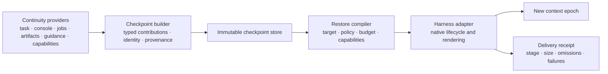

# Session continuity contract

**Status:** proposed architectural contract; design only; no implementation or tool schema authorized

**Date:** 2026-08-10

**Scope:** configurable survival of selected session state across model-context loss, compaction, resume, fork, handoff, and recovery

## Executive contract

A model context is a disposable working projection, not the authoritative session store. When that projection is compacted, replaced, resumed elsewhere, or lost, selected state should survive through a standard session capability:

```text
durable provider state
  -> immutable continuity checkpoint
  -> target-specific restore plan
  -> bounded adapter rendering
  -> per-target delivery receipt
  -> selectively reattached context
```

`PreCompact` and `SessionStart(compact)` are useful native hook names, but they are not the architecture. The platform-neutral lifecycle is:

- `context_epoch_closing`: a context epoch is expected to end, so providers are asked for a bounded, typed checkpoint contribution;
- `context_epoch_opened`: a new epoch is available, so a target-aware restoration package can be compiled, rendered, and delivered;
- recovery paths: when either signal is absent or unreliable, the service reconstructs continuity from continuously durable state without pretending that a clean pre-loss checkpoint occurred.

The exact material persisted and the exact material re-injected are separate, configurable surfaces. A checkpoint may retain rich typed state and guarded references. A restore plan selects a much smaller projection for a particular client, model, event, policy, capability set, and context budget.

This is a cross-cutting **session service**. It is not owned by one MCP, the Console Journal, the guidance layer, or a particular client adapter. MCP servers and other subsystems may contribute state; harness adapters map native lifecycle events and injection mechanisms onto the contract.

The load-bearing distinction is:

> Checkpoint creation is not restoration planning; restoration planning is not adapter emission; adapter emission is not proof of model admission or comprehension.

## Goals

The contract should:

1. preserve the navigational and procedural state needed to continue useful work after context loss;
2. make survival policy explicit and configurable rather than freezing one snapshot template;
3. retain identity, provenance, authority, freshness, and sensitivity across the boundary;
4. revalidate ephemeral handles, permissions, and callable capabilities in the target epoch;
5. bound total restoration overhead and disclose every omission;
6. support resume, fork, handoff, and cross-client restoration without a destructive global `consumed` flag;
7. degrade honestly on clients without reliable pre- or post-compaction hooks;
8. produce evidence that distinguishes stored, planned, emitted, acknowledged, and model-visible material.

It should not attempt to preserve an entire conversation verbatim inside the next context window. Large evidence, transcripts, journals, snapshots, schemas, and skill bodies remain outside context and are restored by reference unless policy explicitly selects a bounded excerpt.

## Terminology and identity boundaries

The following lifetimes must not be collapsed:

| Term | Meaning | Typical lifetime |
|---|---|---|
| **Task** | The user-visible body of work or conversation lineage | May span clients, processes, and many context epochs |
| **Session** | One bound execution or interaction lineage within a task | May survive several compactions and reconnects |
| **Context epoch** | One concrete model-context instance between loss/replacement boundaries | Ends on compaction, reset, migration, or comparable replacement |
| **Actor** | User, driver agent, para-agent, or other participant receiving continuity | May participate in several sessions |
| **Harness instance** | A concrete client/runtime instance mediating model interaction | Process- or connection-scoped |
| **MCP connection** | One protocol connection to a server | Independent of task and context identity |
| **Backend process** | A service or console process that may outlive an MCP connection | Independent of model context |
| **Artifact or job handle** | A reference into external durable or ephemeral state | Governed by its own generation and expiry rules |

Every record carries the strongest identities the producer actually knows. Missing identity is `unbound`; it is not replaced by “latest session,” current process ID, nearest timestamp, most recent project activity, or another convenience guess.

Correlation may be added later when evidence appears, but the original observation and its earlier uncertainty remain auditable. A correlation link does not rewrite provenance.

## Observation planes and truth domains

Continuity spans three observation planes, each authoritative for different facts:

| Plane | Can establish | Cannot establish alone |
|---|---|---|
| **Harness/client** | Native lifecycle event, agent tool request, result returned by the harness, supported injection channel, target epoch identity where exposed | Whether an interactive console really executed a process; whether an MCP backend committed a state transition; whether the model attended to emitted text |
| **MCP/backend operation** | Typed request accepted, backend state transition, artifact/job receipt, server-side capability and contract version | Native tool activity that bypassed the MCP; actual context admission; terminal process truth outside its backend |
| **Console-native** | Pane and shell state, command execution, process output, exit status, cwd, timing, and console cursor | Context compaction, target model epoch, or whether a receipt was admitted to model context |

A normal correlated path may be:

```text
harness observes request
  -> MCP accepts an operation
    -> console records process truth
    -> MCP produces a terminal receipt
  -> harness returns a result
```

Those are related observations, not one interchangeable event. Continuity contributions retain their plane, native event identity, and correlation evidence. A harness `PostToolUse` record cannot overwrite console truth, and a surviving console pane cannot by itself reattach the model to that pane after compaction.

## Architectural placement



The continuity service owns record semantics, lineage, policy evaluation, selection, and receipts. Providers own their authoritative state and know how to describe or reacquire it. Adapters own native event mapping and target rendering. The host remains authoritative for actual tool exposure, context admission, and permission enforcement.

This service is not a fifth agent-facing functional plane. Console, Artifact, Job Exchange, and Guidance remain distinct concerns; each may register a continuity provider. Internal checkpoint and restore operations do not automatically qualify as model-facing MCP tools.

## Core records

The following are semantic records, not a proposed JSON schema. Field names illustrate required meaning; wire representation and storage layout remain open.

### 1. Continuity contribution

A provider contribution is the smallest typed unit that policy can independently retain, inline, reference, reacquire, or omit.

| Semantic field | Requirement |
|---|---|
| Contribution identity | Stable identifier plus contribution kind and schema/profile version |
| Provider identity | Exact provider, implementation/version, and observation plane |
| Subject binding | Known task, session, source epoch, actor, job, pane, artifact, mount, or capability identities; unknown bindings remain explicit |
| Scope | Epoch, session, task, branch, actor, workspace, or another declared scope |
| Capture evidence | Observation time, source generation/cursor, causal boundary, and whether state is complete, partial, or reconstructed |
| Provenance and authority | Originator, content kind, trust/authority class, and any supersession relation |
| Freshness | Valid-at time or generation, expiry, and target-side validation or reacquisition requirements |
| Sensitivity | Classification, permitted audiences/targets, redaction policy, and whether inline delivery is forbidden |
| Restore disposition | Eligible modes such as `inline`, `reference`, `requery`, `reacquire`, or `omit` |
| Selection hints | Semantic priority, dependencies, mutually exclusive variants, estimated rendered cost, and degradation options |
| Value | A bounded typed value, a guarded durable reference, or both |

Priority is not authority. A high-priority agent hypothesis remains an agent hypothesis; it does not become a user instruction. Similarly, `inline` eligibility does not guarantee selection.

Providers should prefer independently selectable contributions over one opaque resume blob. For example, an active console cursor, an unresolved user decision, and an artifact reference have different freshness, sensitivity, and restoration behavior.

### 2. Continuity checkpoint

A `ContinuityCheckpoint` is an immutable, durable cut through available provider state at one boundary or recovery moment. It contains:

- an exact checkpoint identity and format/profile version;
- source task, session, context epoch, actor, and harness bindings where known;
- a boundary reason such as compact, resume preparation, fork, handoff, reset, shutdown, periodic checkpoint, or crash reconstruction;
- parent checkpoint and causal lineage references;
- the contribution set and per-provider capture status;
- capture start/end times and provider source cursors or generations;
- declared incompleteness, timeouts, errors, races, and omitted providers;
- the effective checkpoint policy and its identity;
- an integrity digest or equivalent tamper-evident identity for the canonical record.

The checkpoint is not defined by the text eventually injected. It may retain references and structured facts that no target epoch receives inline. It is never mutated to mean “consumed.” Retention and garbage collection are independent policy decisions.

Providers need not offer a distributed transaction. If their observations are taken at different times, the checkpoint records a bounded capture interval and each provider's cursor/generation. It must not claim an atomic global state that was never observed.

### 3. Continuity restore plan

A `ContinuityRestorePlan` is a deterministic projection of exactly one eligible checkpoint for one target epoch. Combining divergent checkpoints is a separate, not-yet-defined reconciliation operation whose result must be a new checkpoint with explicit lineage; the restore compiler does not merge them implicitly.

A plan binds:

- the source checkpoint and lineage selected;
- exact target task, session, epoch, actor, client, model, and adapter facts where available;
- the target's current capability and permission evidence;
- the selected continuity policy/profile and configuration provenance;
- every candidate contribution's disposition: inline, reference, requery, reacquire, deduplicated, stale, unauthorized, superseded, unsupported, or budget-omitted;
- ordering, dependencies, renderer/profile versions, and estimated total cost;
- a bounded omissions navigator with retrieval or reacquisition paths where allowed;
- unresolved conflicts and degraded-mode warnings.

Planning occurs after target capabilities are known. The same checkpoint can therefore produce different plans for Claude, Codex, a web client, a forked para-agent, or a client with no injection channel.

### 4. Continuity delivery receipt

A `ContinuityDeliveryReceipt` records what happened to one restore plan for one target epoch. It is append-only and target-specific. It includes:

- checkpoint, plan, target epoch, adapter, and attempt identities;
- an idempotency identity for safe retry;
- the delivery channel and native lifecycle event;
- planned versus actually rendered sections, bytes, estimated tokens, and content digests;
- omissions and rendering-time failures;
- the strongest delivery stage supported by evidence;
- timestamps, retry/supersession links, and any host acknowledgement.

Delivery stages must remain distinct:

1. `planned`: the restore compiler selected material;
2. `rendered`: target-specific content was constructed;
3. `adapter_emitted`: the adapter returned or sent that content;
4. `host_acknowledged`: the host confirmed acceptance, if such evidence exists;
5. `model_visible`: the host explicitly attested context admission, if it can;
6. model comprehension or compliance: **not inferable from delivery telemetry**.

If the native hook only permits writing an `additionalContext` response without acknowledgement, the honest terminal stage is `adapter_emitted`. Calling that “injected” or “returned to the model” overstates the evidence.

## Identity, lineage, resume, and fork semantics

### Exact binding

Restoration follows explicit task/session/epoch lineage. A proximity fallback such as “latest unconsumed snapshot in this project” is not a valid default identity rule. If a client supplies a fresh session ID on resume, the adapter or host must also supply a continuation token, parent identity, user-confirmed candidate, or other evidence sufficient to bind the new session to its predecessor. Without that, restoration remains unbound and requires explicit selection.

### Forks and multiple consumers

A checkpoint may seed multiple target epochs:

```text
checkpoint C
  -> resume epoch E2
  -> fork epoch F1
  -> handoff epoch H1
```

Each edge receives its own plan and delivery receipts. Restoring `C` into `E2` does not make it unavailable to `F1`. A global `consumed` Boolean loses this topology and creates race/loss hazards.

Inherited contributions are filtered by scope. Task-scoped decisions may be eligible in a fork; actor-private notes may not be. Ephemeral pane or mount handles are not copied as facts of availability: they are revalidated, remapped, or replaced with durable references and reacquisition instructions.

### Boundary semantics

| Boundary | Default continuity meaning |
|---|---|
| **Compact** | Same task/session lineage, new context epoch; restore active-work navigation under a strict budget |
| **Resume** | Reattach an explicitly identified paused lineage; revalidate all target capabilities and handles |
| **Fork** | Create a new branch from an immutable checkpoint; preserve parent lineage and independent future deliveries |
| **Handoff** | Transfer an authorized, redacted projection to another actor or client; do not copy actor-private or unauthorized material |
| **Clear/fresh start** | Do not infer resume; only broader-scope pinned state survives if explicit policy says so |
| **Crash recovery** | Reconstruct from the last durable provider state and journal cursors; mark the cut partial/reconstructed and potentially stale |
| **Client/model migration** | Compile a fresh target-specific plan; do not reuse a rendered payload or assumed tool surface |

## Provider model

Authoritative operational state should be made durable during ordinary work. The closing hook is a coordination opportunity, not the sole write protecting the session from loss.

| Provider | Candidate contribution | Normal restore treatment |
|---|---|---|
| **Task/session** | Current objective, unresolved user intent, pending choices, exact next continuations, branch lineage | Small inline navigator plus references to fuller task state |
| **Console** | Active pane/job identities, commands still running, process state, last observed cursor, terminal receipt references | Inline active handles only after revalidation; journal/body remains external |
| **Job exchange** | Outstanding assignments, questions, objections, wait state, report and evidence references | Inline unresolved items and exact continuation operations |
| **Artifact/query engines** | Durable artifact identities, source generations, projection identities, cursors, last useful selectors | Restore durable artifact reference; remount/rebuild ephemeral projections as needed |
| **Mounted resources** | Artifact reference, mount profile, mount identity, validation generation | Treat mount as a cache hint; revalidate or remount from the durable artifact |
| **MCP capabilities/contracts** | Relevant server identity/version, contract/profile references, capabilities recently used, outstanding handles | Re-discover current callable surface; inline only a bounded relevance summary or changed/unavailable capabilities |
| **Guidance** | Canonical procedure/skill references, active recipe and phase, pinned invariants, small procedural or metacognitive reminders | Prefer canonical references plus bounded reminders; reload full guidance only when target policy requires it |
| **Decision/evidence store** | Sourced decisions, hypotheses, measurements, supersession links | Preserve content kind and authority; select unresolved or load-bearing items, not arbitrary retrieval hits |
| **Harness adapter** | Verified lifecycle identities, client/version/mode facts, native capability evidence | Used primarily to compile and deliver; capability facts expire with client/version/mode |

A provider failure is represented in checkpoint completeness. Optional continuity capture should not block compaction or session start. Timeouts are bounded, and a provider can contribute its last durable cursor rather than performing expensive synthesis in the hook.

## Configurable continuity policy

The automatically retained and restored surface is a deliberate configuration layer. It may select:

- participating providers and eligible contribution kinds;
- scope boundaries: epoch, session, task, branch, actor, workspace;
- boundary behavior for compact, resume, fork, handoff, clear, migration, and recovery;
- inline, reference, requery, reacquire, or omit preferences by kind;
- semantic priority, mandatory dependencies, recency, and maximum age;
- aggregate byte/token budgets and per-provider or per-kind ceilings;
- sensitivity, redaction, target audience, and cross-actor transfer rules;
- target client/model renderer and repetition/deduplication policy;
- user-pinned elements and explicitly excluded elements;
- procedural and metacognitive guidance profile;
- capability summaries and contract-reference behavior;
- failure behavior and how degraded restoration is surfaced.

Configuration should expose semantic choices rather than storage implementation knobs. “Keep active work and unresolved questions across compaction” is appropriate. Shard sizing, temporary paths, serializer buffers, and database page settings are backend policy.

Policy precedence must be published and recorded in the plan. Host safety and permission restrictions remain non-relaxable; current user/task selections may narrow or prioritize eligible continuity; provider defaults fill unspecified behavior; target capability constraints can only reduce or transform delivery. A stale checkpoint cannot reintroduce a superseded user instruction.

### Named profiles

Named profiles make the feature usable without requiring every caller to configure every contribution type. Illustrative profiles are:

| Profile | Intent |
|---|---|
| `minimal` | Objective, unresolved user request, immediate continuation, and an omissions navigator |
| `active-work` | Minimal plus active console/jobs, recently used artifacts, sourced decisions, and relevant guidance references |
| `debugging` | Active-work plus failure evidence, reproduction state, process cursors, and diagnostic artifact references |
| `collaborative-handoff` | Task intent, branch lineage, pending questions, evidence/artifact references, and explicit assumptions; actor-private material excluded |

These names and defaults are design suggestions, not frozen wire-level values. Profiles are versioned and may be overridden by explicit user pins and exclusions.

## Restoration compilation and budget discipline

The compiler should perform a deterministic sequence:

1. bind the exact source lineage and target epoch;
2. load the applicable policy and target capability evidence;
3. validate contribution integrity, authority, freshness, sensitivity, and target audience;
4. revalidate or reacquire ephemeral handles and callable capabilities;
5. resolve supersession, conflicts, dependencies, and duplicates;
6. choose inline/reference/requery/reacquire/omit dispositions;
7. render candidate sections using the target renderer;
8. enforce the aggregate post-render budget, including wrappers and routing material;
9. emit an explicit omissions navigator and exact retrieval paths where allowed;
10. record the plan and delivery attempt.

Budgeting applies to the **whole restoration package**, not merely one subsection. It includes headers, routing blocks, session directives, XML/JSON wrappers, warnings, guidance reminders, and omission metadata. Estimates are labeled as estimates; actual serialized byte counts are recorded after rendering. If the client exposes tokenizer-accurate counts, those may supplement rather than silently replace the byte measurement.

Selection should normally favor:

- current objective and unresolved user intent;
- exact active handles and cursors that avoid rediscovery;
- pending questions, objections, and continuations;
- load-bearing sourced decisions and constraints;
- canonical references to relevant contracts, capabilities, procedures, and artifacts;
- concise warnings about stale, missing, or unavailable state;
- a bounded statement of what was omitted and how to retrieve it.

It should normally avoid:

- raw tool output and full console journals;
- complete transcripts or artifact bodies;
- entire skill documents and MCP schemas already resident in the target;
- secrets, ambient environment values, or unauthorized cross-actor material;
- inferred permissions or stale claims that a tool is callable;
- historical guidance merely because search ranked it highly;
- duplicated prose already supplied by a higher-authority resident channel.

If nothing useful fits, the package should still be truthful: a minimal checkpoint identity and omissions/retrieval navigator is preferable to silent loss or an over-budget dump.

## Guidance and MCP capability continuity

Procedural and metacognitive guidance are legitimate continuity elements, but they need stronger semantics than copied prose.

A guidance contribution should distinguish:

- canonical guidance identity, version/digest, and authority source;
- an active recipe or workflow phase;
- a user-pinned invariant or decision;
- a heuristic reminder generated by an agent;
- a reference that should be reloaded from its authority source;
- a bounded reminder eligible for inline restoration.

The target compiler checks whether the canonical guidance is already resident, available through a skill mechanism, superseded, or incompatible with the target client. A one-line “reload this recipe if still relevant” reminder may be enough. Continuity must not silently convert retrieved history, an agent summary, or a previous tool result into system- or user-level instruction.

MCP continuity similarly separates **past relevance** from **present capability**. A checkpoint can remember that a session used a particular server contract, artifact handle, or operation family. On restoration, the target must rediscover or revalidate:

- whether the server is connected;
- which tool/resource surface is actually exposed;
- the server and contract/profile version;
- whether a referenced handle remains valid;
- current permissions and audience restrictions.

The restoration package should not dump every MCP schema. It may include a compact capability delta, relevant contract reference, or exact reacquisition path. The host's live tool surface remains authoritative.

## Authority, trust, and sensitivity invariants

Continuity transports content; it does not increase that content's authority.

At minimum, contributions distinguish:

| Content class | Example | Restoration rule |
|---|---|---|
| Higher-authority instruction | Current system policy, current user directive | Restore only through an authorized channel and preserve source/scope; current target authority wins over stale copies |
| Canonical procedural guidance | Versioned skill or contract | Restore reference and bounded reminder according to target guidance policy |
| Observed fact | Process exit, artifact digest, tool receipt | Preserve observation plane, generation, and completeness |
| User/agent decision record | Chosen design direction with author and time | Preserve author, scope, supersession, and whether confirmed |
| Agent inference or hypothesis | Suspected root cause | Label as inference; never render as established fact or instruction |
| Search result or historical memory | Ranked prior passage | Relevance supplies no authority; restore as evidence/reference only |

Further invariants:

- permissions and safety constraints are re-evaluated in the target epoch;
- a checkpoint never grants access that the target actor or client lacks;
- sensitive material can be durable without being inline-eligible;
- references are guarded against path traversal, generation drift, and cross-project/session confusion by their owning provider;
- redaction and omission are explicit, but sensitive identifiers are not leaked through omission descriptions;
- a renderer preserves provenance markers and cannot flatten mixed-authority material into one unlabeled instruction block.

Security policy must not depend on successful continuity injection. A safety rule important enough to govern execution needs an independently authoritative enforcement path.

## Lifecycle behavior

### Context epoch closing

On a reliable closing signal, the service:

1. resolves exact source identity and boundary reason;
2. requests contributions under a short, explicit deadline;
3. favors already durable state and cursors over heavy last-second summarization;
4. records provider success, timeout, error, and capture interval;
5. writes an immutable checkpoint and integrity identity;
6. emits checkpoint telemetry without blocking compaction on optional failures.

The service does not inject into the dying context, mark a source checkpoint globally consumed, or assume a later epoch will have the same client capabilities.

### Context epoch opened

On a reliable opened signal, the service:

1. binds the target to an explicit source lineage;
2. gathers current client/model capability and permission facts;
3. compiles a target-specific restore plan;
4. renders and emits the bounded package through a supported native channel;
5. records the strongest evidenced delivery stage;
6. retries idempotently where supported;
7. leaves the source checkpoint available for forks and later recovery.

Marking delivery complete before the adapter has emitted the payload creates a loss window. Even after emission, the record must not claim host acknowledgement or model visibility without corresponding evidence.

### Fallbacks and degraded clients

Client capability declarations are versioned facts, keyed at least by client, version, mode, lifecycle event, injection channel, size behavior, and acknowledgement semantics. One client-wide `supportsContinuity` Boolean is insufficient.

| Native capability | Fallback |
|---|---|
| Closing and opened hooks both reliable | Normal checkpoint and target-specific restore flow |
| No closing hook | Use continuously durable provider state or a recent periodic checkpoint; label the cut reconstructed/possibly stale |
| No opened hook but a next-turn context channel exists | Deliver once at the next bound interaction with an idempotency guard |
| No automatic injection channel | Expose a bounded restoration navigator through an existing authorized resource/operation or require explicit reacquisition; do not claim automatic restoration |
| Target identity unavailable | Remain unbound and ask for explicit lineage selection rather than choosing “latest” |
| Provider unavailable | Omit with provider status and a reacquisition path if safe |
| Handle expired | Restore durable parent reference and reacquire/remount; do not revive the stale handle textually |
| Budget too small | Deliver minimal identity/objective/omissions navigator according to policy |

These fallbacks define semantics, not a mandatory new MCP tool surface. Each host or adapter may realize them through its existing native facilities.

## Context-mode donor analysis

The current [`packages/context-mode`](../../../../packages/context-mode) implementation is evidence for the value of the pattern and for why it must be generalized. These findings describe the inspected checkout on 2026-08-10; they are not claims that every context-mode release or adapter behaves identically.

### Claude pre-compaction stores a snapshot

The Claude-oriented [`precompact.mjs`](../../../../packages/context-mode/hooks/precompact.mjs), lines 44–54, reads all events for the exact incoming session, builds a resume snapshot, writes it with `upsertResume`, and increments the compaction count. It emits no restoration payload from the pre-compaction hook.

This is a useful donor pattern: capture durable state before expected context loss. It is still one opaque snapshot assembled from events, rather than typed provider contributions selected later for a target.

### Claude compact start reconstructs from events and does not append the stored snapshot

In [`sessionstart.mjs`](../../../../packages/context-mode/hooks/sessionstart.mjs), lines 191–212, the Claude `source === "compact"` path:

1. reads the stored resume row;
2. marks it consumed if it was unconsumed;
3. rereads session events;
4. writes those events to a side file;
5. appends a reconstructed session directive;
6. appends a separately built auto-injection block for role, decisions, skills, and intent.

The branch never appends `resume.snapshot` to `additionalContext`. The stored snapshot is therefore not the actual compact-start payload, despite being marked consumed.

### Claude fresh-ID resume fallback does append a prior snapshot

The same file's resume path, lines 269–288, first looks for live events bound to the incoming session ID. When `/resume` presents a new active session ID with no such events, it calls `claimLatestUnconsumedResume(sessionId)` and appends that prior row's snapshot.

This is materially different from compact handling. It also demonstrates why generalized continuity needs explicit lineage: “latest unconsumed prior snapshot” is a recovery heuristic, not identity proof.

### Codex compact behavior differs

The Codex adapter [`hooks/codex/sessionstart.mjs`](../../../../packages/context-mode/hooks/codex/sessionstart.mjs), lines 66–95, handles compact and resume together, reconstructs a session directive from events, and—on compact—also appends the stored `resume.snapshot` before marking it consumed.

Thus there is no single context-mode resume sequence. The adapters implement different payload composition and consumption behavior. Client lifecycle mapping and renderer behavior must be explicit, versioned capability facts.

### Claude delivery accounting does not match the emitted payload

In the Claude compact branch, lines 214–238, telemetry computes `snapshotBytes` from the stored resume row and records a `snapshot-consumed` event saying that those bytes were injected and returned. But the branch actually appended the routing block, reconstructed session directive, and optional auto-injection—not the stored snapshot.

This is precisely the distinction the proposed records enforce: stored bytes, selected bytes, rendered bytes, adapter-emitted bytes, and host-acknowledged bytes are different measurements. A delivery receipt must measure the actual rendered payload and identify its components.

### The declared auto-injection budget is not an aggregate restoration budget

[`auto-injection.mjs`](../../../../packages/context-mode/hooks/auto-injection.mjs), lines 1–13 and 60–101, declares a 500-token budget using an approximate four-characters-per-token estimator and prioritizes role, decisions, skills, and intent. That is a useful precedent for policy-driven selection.

The surrounding routing block and reconstructed session directive are composed outside this budget. The resume snapshot builder also explicitly assembles all nonempty sections without a final byte budget; see [`src/session/snapshot.ts`](../../../../packages/context-mode/src/session/snapshot.ts), around lines 470–572. Even inside the auto-injection builder, some fallback additions are threshold-gated rather than checked against the final serialized total. The 500-token value is therefore a local declared budget, not a proven cap on all compact-start context.

For overhead diagnosis, every component must be measured independently and in aggregate: routing block, session directive, auto-injection, stored snapshot when used, warnings, wrappers, resident guidance, and any host-added material.

### Donor conclusions

Context-mode demonstrates:

- durable events outside model context are a strong substrate;
- a pre-loss hook can build a useful navigator;
- post-loss reconstruction can be selective and prioritized;
- adapter differences are real and architecturally significant.

It also demonstrates the hazards of:

- one opaque snapshot serving persistence and injection concerns;
- consuming before verified delivery;
- a global consumption bit in a forkable world;
- proximity-based resume identity;
- payload accounting based on a stored object that was not emitted;
- budgeting one subsection while other injected material remains outside the budget.

The proposed contract preserves the donor insight without adopting those implementation limits.

## Normative invariants

An implementation conforming to this design should uphold all of the following:

1. **Authoritative state is external.** Model context is a projection; providers durably record important operational state during ordinary work.
2. **Persistence and injection are separate.** Checkpoints retain typed state; restore plans choose bounded target projections.
3. **Identity is exact or unbound.** No silent “latest session” or process-proximity binding.
4. **Checkpoints are immutable and forkable.** Delivery never mutates them into globally consumed state.
5. **Delivery is target-specific and idempotent.** Every target epoch and retry has attributable receipts.
6. **Capabilities and permissions are current facts.** Ephemeral handles and tool surfaces are revalidated at restore time.
7. **Authority cannot be laundered.** Provenance, content kind, sensitivity, and supersession survive rendering.
8. **The total package is bounded.** All wrappers and sections count toward the aggregate post-render budget.
9. **Omission is explicit.** Withheld state has a reason and, where authorized, an exact retrieval or reacquisition path.
10. **Partial state is labeled.** Provider timeouts, crash reconstruction, stale cursors, and inconsistent cuts are visible.
11. **Optional continuity failure does not block lifecycle progress.** Failure produces degraded-state evidence, not silent success.
12. **Telemetry states only what was observed.** Stored, planned, rendered, emitted, acknowledged, and model-visible are not synonyms.
13. **Guidance is reference-first and configurable.** Full skills and historical prose are not automatically reinjected.
14. **MCP participation does not imply MCP tool proliferation.** Providers and lifecycle plumbing may remain backend-internal.
15. **Clear, resume, compact, fork, and handoff are distinct.** One event name cannot stand in for all lineage semantics.

## Conformance and test strategy

### Record conformance

Tests should verify:

- required identities, schema/profile versions, provenance, freshness, and sensitivity survive round-trip storage;
- canonical checkpoint digests are stable for the defined serialization;
- partial provider results and capture intervals cannot be represented as an atomic complete cut;
- unknown session/task/epoch identity remains `unbound` through planning;
- retention or garbage collection cannot mutate historical delivery evidence.

### Lifecycle conformance

At minimum, exercise:

1. a compact close/open pair restores selected active-work state;
2. a provider timeout yields a usable partial checkpoint and explicit omission;
3. repeated opened-hook delivery is idempotent for the same target epoch;
4. one checkpoint restores independently into two forks without consumption races;
5. a fresh-ID resume binds only with explicit lineage evidence;
6. absent identity refuses a latest-session guess;
7. an expired mount/pane/capability handle is revalidated or reacquired rather than asserted live;
8. a removed MCP capability is reported unavailable, not promised from checkpoint history;
9. clear/fresh-start behavior does not accidentally resurrect session-scoped state;
10. cross-actor handoff applies sensitivity and audience filtering;
11. crash recovery is marked reconstructed and preserves the last durable cursors;
12. the same checkpoint produces different valid plans for clients with different capabilities.

### Budget and rendering conformance

Tests should use actual serialized target payloads and verify:

- aggregate bytes include every wrapper, directive, warning, and selected section;
- deterministic selection and omission ordering at the budget boundary;
- estimates and actual counts are stored separately;
- a large high-priority item degrades to reference or bounded summary rather than silently breaking the ceiling;
- resident target guidance is deduplicated where capability evidence permits;
- sensitive reference metadata does not leak through an omissions navigator.

### Adapter conformance

Each adapter profile should be tested against its declared client/version/mode/event matrix:

- closing/opened event ordering and identity fields;
- whether hook output is accepted, ignored, truncated, duplicated, or retried;
- maximum reliable payload behavior;
- whether host acknowledgement or model-admission evidence exists;
- behavior on compact, resume, fork, clear, and startup;
- tool/resource discovery timing relative to restoration;
- fallback behavior when a declared capability is absent at runtime.

Capability evidence expires when the client version, mode, event shape, or delivery channel changes.

## Measurement contract

Continuity economics need per-boundary and per-component measurements rather than “tokens saved” estimates detached from actual admission.

Recommended measurements include:

| Measurement | Qualification |
|---|---|
| Checkpoint build latency | Total plus per-provider time, timeout, and serialization cost |
| Checkpoint size | Canonical stored bytes by contribution kind; not context overhead |
| Candidate restore size | Eligible bytes before selection |
| Planned inline/reference size | By component and policy decision |
| Actual rendered bytes | Exact serialized adapter payload, including wrappers |
| Estimated or tokenizer-counted tokens | Estimator/model identified; never presented as exact when approximate |
| Delivery stage reached | Rendered, emitted, host-acknowledged, or model-visible evidence |
| Restore failures and retries | By adapter, event, provider, and reason |
| Stale/invalid handles | Revalidated, reacquired, omitted, or failed |
| Omission counts and later retrievals | Whether reference-first restoration caused useful follow-up retrieval |
| Duplicate material | Bytes already resident or repeated across adjacent epochs where observable |
| Continuation success | Whether the session resumed the intended active work, using an explicitly defined proxy rather than assumed cognition |

For Claude overhead investigation, report at least routing, session directive, auto-injection, snapshot, skill/guidance, and host baseline separately. The continuity service must not claim savings merely because bytes were stored externally; it can claim only observed context bytes avoided, emitted, or retrieved under a stated measurement method.

## Open design questions

The contract deliberately leaves these for later evidence and design work:

- the provider registration protocol and whether capture uses pull, push, or both;
- canonical storage format, digest profile, retention, encryption, and garbage collection;
- exact configuration locations, precedence, and user-facing pin/exclude controls;
- how clients expose task/session/epoch lineage tokens, especially across fresh-ID resume;
- renderer families and model-specific token estimation;
- the minimum capability declaration required from each harness adapter;
- whether any host can attest actual model-context admission rather than adapter emission;
- policy for reconciling multiple checkpoints into a new explicitly derived checkpoint after collaboration or branch reconciliation;
- which guidance classes are resident, reference-only, or eligible for bounded reminders;
- how capability and contract references are discovered without duplicating an already resident tool surface;
- which restore operations, if any, deserve an agent-facing MCP surface after the backend contract is proven.

## Non-goals

This document does not:

- authorize implementation changes to context-mode, para-agent, reposnapshot, or any client configuration;
- define concrete JSON, JSON-RPC, MCP tool, resource, or hook schemas;
- require clients to use the literal event names in this document;
- prescribe one fixed restoration payload or universal set of reinjected elements;
- turn a checkpoint into a replacement for transcripts, journals, artifacts, or source-of-truth stores;
- treat continuity as an authorization or sandbox mechanism;
- promise seamless restoration where the host exposes neither identity nor an injection/reacquisition channel.

## Related evidence and design

- [`discussion/grok-science-facility-exploration.md`](../../mcp/discussions/grok-science-facility-exploration.md) — ideation that sharpened mounted corpus and compaction-survival applications.
- [`../para-agent/context-mode-cross-examination.md`](context-mode-cross-examination.md) — broader context-mode archaeology, client asymmetry, identity, guidance, and authority findings.
- [`../para-agent/backend-engine-architecture.md`](backend-engine-architecture.md) — shared backend capability substrate and the separation of runtime planes from client adapters.
- [`../para-agent/design-synthesis.md`](design-synthesis.md) — current para-agent architectural synthesis.
- [`../../../packages/context-mode/hooks/precompact.mjs`](../../../../packages/context-mode/hooks/precompact.mjs) — inspected pre-compaction donor hook.
- [`../../../packages/context-mode/hooks/sessionstart.mjs`](../../../../packages/context-mode/hooks/sessionstart.mjs) — inspected Claude session-start donor adapter.
- [`../../../packages/context-mode/hooks/codex/sessionstart.mjs`](../../../../packages/context-mode/hooks/codex/sessionstart.mjs) — inspected Codex session-start donor adapter.
- [`../../../packages/context-mode/hooks/auto-injection.mjs`](../../../../packages/context-mode/hooks/auto-injection.mjs) — inspected prioritized auto-injection builder.
- [`../../../packages/context-mode/src/session/snapshot.ts`](../../../../packages/context-mode/src/session/snapshot.ts) — inspected resume snapshot builder.

## Design conclusion

The feature implied by context-mode is larger than resume-snapshot injection. It is a configurable protocol for moving selected, typed, sourced session state across context epochs while leaving authoritative detail outside the context window.

The canonical architectural surface is therefore:

- `ContinuityContribution` from independent providers;
- immutable `ContinuityCheckpoint` records;
- target-specific `ContinuityRestorePlan` records;
- per-attempt `ContinuityDeliveryReceipt` records;
- versioned client lifecycle capability declarations;
- policy profiles controlling persistence, restoration, guidance, budget, sensitivity, and failure behavior.

That surface can preserve active MCP and console handles, artifact references, unresolved work, relevant contracts, procedural guidance, and metacognitive reminders without making any fixed context-mode payload the design ceiling—and without pretending that persistence, reinjection, or model awareness are the same event.
