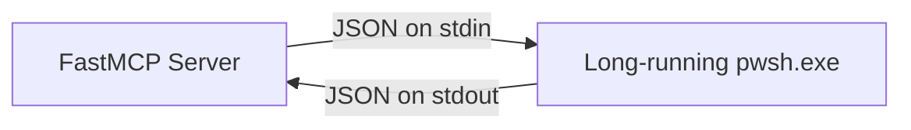

Listed directory pwsh_exec
Viewed server.py:1-99
Viewed README.md:1-158
Listed directory tests
Viewed test_server.py:1-215

Yes, **it is definitely possible** and would be a natural evolution for [pwsh_exec](file:///d:/aghado01/science-facility/mcp/pwsh_exec).

Here is a breakdown of how it can be implemented, the architecture options, and design considerations.

---

### 1. Current Architecture vs. Persistent Architecture

| Aspect | Current Architecture | Persistent Architecture |
| :--- | :--- | :--- |
| **Process Lifecycle** | Spawns a new `pwsh.exe` for every `run_powershell()` call and exits immediately. | Keeps one (or more) long-running `pwsh.exe` worker processes alive across tool calls. |
| **State Retention** | Zero. Variables (`$foo`), `$PWD` (current dir), functions, imported modules, and background jobs are discarded after each call. | Full. `$variables`, custom functions, working directory changes (`Set-Location`), and loaded modules persist across calls. |
| **Profile Overhead** | Dot-sources the profile on *every* tool invocation (~100–300ms overhead per call). | Dot-sources the profile **once** on session startup; subsequent commands run instantly with near-zero latency. |

---

### 2. Recommended Implementation Patterns

#### Option A: JSON-Framed PowerShell Worker Loop (*Recommended & Most Robust*)
Instead of sniffing raw stdout prompts with regex or delimiters, launch a long-running `pwsh.exe` worker executing a lightweight server loop:



1. **Python Side**: Spawns `pwsh.exe` with a dedicated loop script over stdin/stdout.
2. **PowerShell Side**: A persistent runspace listens on `[Console]::In.ReadLine()` for command payloads (e.g. `{"id": "...", "code": "..."}`).
3. **Execution**: Evaluates the code in the active session context via `[scriptblock]::Create($code).Invoke()`, captures `$OutputEncoding` text and `$Error` streams, and writes a single JSON line to stdout (e.g. `{"id": "...", "stdout": "...", "stderr": "...", "cwd": "...", "success": true}`).
4. **Benefits**:
   - Immune to prompt pollution, progress bars, or random unbuffered output breaking delimiters.
   - Clean separation of standard output vs. error stream.
   - Accurately tracks session state (e.g., changes in `$PWD` / working directory).

#### Option B: Stdio Sentinel Delimiters (REPL Style)
- Send commands followed by a unique GUID sentinel token (e.g. `Write-Output "__PWSH_MCP_DELIMITER_<UUID>__"`).
- Read stdout until the sentinel appears.
- Simpler to write initially, but trickier to handle syntax errors, interactive prompts, and multi-stream error output cleanly.

---

### 3. Proposed MCP Tool Design

To maintain backwards compatibility while adding persistence:

#### Strategy 1: Unified Tool with Session Support
```python
@mcp.tool()
def run_powershell(
    code: str, 
    session_id: str | None = None,
    reset: bool = False
) -> str:
    """
    Runs PowerShell code.
    If session_id is provided (e.g. 'default' or custom), runs in a persistent session.
    If session_id is None, runs as a stateless one-off process.
    """
```

#### Strategy 2: Dedicated Session Management Tools
If you want multi-session isolation and explicit lifecycle management:
- `run_powershell(code: str) -> str` *(one-off headless)*
- `run_powershell_session(code: str, session: str = "default") -> str` *(persistent)*
- `reset_powershell_session(session: str = "default") -> str` *(kills/restarts the session)*
- `list_powershell_sessions() -> list[str]`

---

### 4. Key Implementation Considerations

1. **Session Lifecycle & FastMCP Lifespan**:
   - Register a cleanup handler on FastMCP server shutdown to terminate any spawned child `pwsh.exe` processes cleanly so no orphan processes remain.
2. **Hang & Timeout Protection**:
   - If user code starts an infinite loop (`while ($true) {}`) or waits on blocking input, the Python side should support a timeout and provide a way to kill/restart the worker without crashing the MCP server.
3. **Working Directory & Environment**:
   - When a session changes directory (`cd ...`), it should either remain persistent in that session or allow the client to inspect the active `$PWD`.
4. **Profile Loading**:
   - The bundled/configured profile (`$PSHOME/profile.ps1` or `$env:MCP_POWERSHELL_PROFILE`) is loaded during session bootstrap, making all custom tooling/aliases instantly available for subsequent persistent commands.
