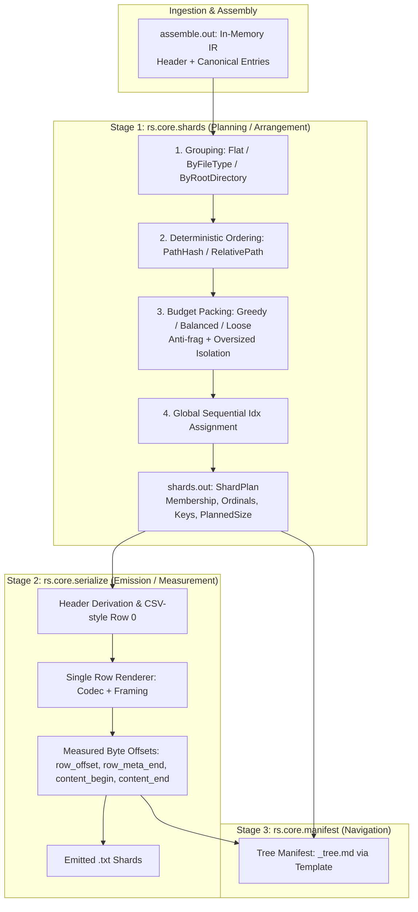

Viewed shard-container-brief.md:1-215
Viewed fable-shards-pre-brief.md:1-28
Viewed shard-format-notes.md:1-800
Viewed lts-v3-transfer-audit.md:1-178
Searched for "function "
Viewed rs.lts.sharding.psm1:1-100
Searched for "^function\s+"
Searched for "function [A-Za-z0-9-]+"
Ran command: `nu -c "open d:/aghado01/science-facility/utils/reposnapshot/rs.lts.sharding.psm1 | lines | find 'function '"`
Listed directory reposnapshot
Listed directory archaelogy
Listed directory briefs
Listed directory discussion
Listed directory design
Listed directory planning
Viewed opus-reposnapshotV3-LTS-updates.md:1-127
Viewed RepoSnapshotLts.psm1:930-1020
Viewed RepoSnapshotLts.psm1:2250-2560
Viewed rs.lts.sharding.psm1:100-300
Viewed rs.lts.sharding.psm1:301-600
Viewed rs.lts.sharding.psm1:601-900
Viewed rs.lts.sharding.psm1:901-1300
Viewed rs.lts.sharding.psm1:1301-1620
Listed directory reposnapshot
Listed directory reposnapshot-v3
Viewed AGENTS.md:1-226
Listed directory schema
Viewed assemble.schema.json:1-55
Listed directory tests
Viewed decisions-ledger.md:1-105
Viewed rs.core.numerics.psm1:1-60

# Archaeology & Design Extraction: `RepoSnapshotLts` $\rightarrow$ `rs.core.shards` (V3)

## 1. Executive Summary & The Architectural Seam

In the V3 pipeline, the **Export** phase is factored into three clean, non-circular stages:
$$\text{Assembly } (\text{IR}) \longrightarrow \mathbf{rs.core.shards} \text{ (Planning)} \longrightarrow \mathbf{rs.core.serialize} \text{ (Emission)} \longrightarrow \mathbf{rs.core.manifest} \text{ (Navigation)}$$



### The Iron Rule: Planning is Not Measurement
* **`rs.core.shards` is a Pure Planning Stage:** It takes the in-memory IR ([`assemble.schema.json`](file:///d:/aghado01/science-facility/utils/reposnapshot/reposnapshot-v3/schema/assemble.schema.json)) and decides **membership, arrangement, and global indexing** using planning-grade estimates (`Attributes.SpanBytes` or content UTF-8 byte count, bounded by `SizeBytes`). It executes **zero I/O**, **zero string serialization**, and **zero byte-offset calculations**.
* **`rs.core.serialize` is an Emission & Measurement Stage:** It receives ordered entry lists from the shard plan, renders the single canonical row grammar with the custom codec ([`shard-format-notes.md`](file:///d:/aghado01/science-facility/issues/reposnapshot/design/shard-format-notes.md)), streams the bytes, and records byte offsets as a **receipt of the write**.

---

## 2. Archaeology of LTS Sharding: Unearthing the Gaps

An analysis of [`RepoSnapshotLts.psm1`](file:///d:/aghado01/science-facility/utils/reposnapshot/RepoSnapshotLts.psm1) and [`rs.lts.sharding.psm1`](file:///d:/aghado01/science-facility/utils/reposnapshot/rs.lts.sharding.psm1) reveals why a verbatim port was refused:

| Area | LTS Implementation (`RepoSnapshotLts.psm1` / `rs.lts.sharding.psm1`) | Pathology / Defect | V3 Clean Design (`rs.core.shards`) |
| :--- | :--- | :--- | :--- |
| **Dual Code Paths** | `Flat` grouping rendered the whole corpus into a 4MB `StringBuilder`, measured cut positions on text, and sliced via `Buffer.BlockCopy` (`:2377-2412, :2475-2497`). Non-`Flat` called `Partition-Files` and opened individual `FileStream`s (`:2360, :2443-2473`). | Two independent grouping programs producing identical row outputs with two separate offset and emission engines. | **One emission engine.** `shards` outputs a uniform `ShardPlan[]`; `serialize` renders each shard identically regardless of strategy. |
| **Thrice-Rendered Grammar** | Formatted rows in 3 places: flat buffer (`:2318`), grouped stream (`:2461`), and prefix re-render to *measure* content offsets (`:2501`). | Six variants counting `includeAttributes` branches. If any format string drifts by 1 space, offsets corrupt. | **Single Renderer.** Row layout lives exclusively in `rs.core.serialize`. |
| **Offset Recovery** | `Get-EntryByteOffsets` (`:953`) used regex matching `'"content":"((?:[^"\\]|\\.)*)"'` on JSON text. | Threw away serializer state, then used regex char-indexing converted to UTF-8 bytes to reverse-engineer positions. | **Offsets as Receipts.** Offsets emitted during byte streaming via running cursor. |
| **Index Collision & Drift** | `tempIdx` stamped in path-sorted order upfront (`:2303-2339`), but grouped partitioning rearranged files, breaking sequentiality. | In grouped shards, file `Idx` values hopped around rather than following sequential reading order. | **Post-Partition Global Indexing.** Global `Idx` assigned sequentially `0..N-1` across shards in final reading order. |
| **Packing Inputs** | `Partition-Files` probed `$file.ByteSpan` (`:376`), which LTS populated with `$enc.GetByteCount($line)` (full rendered row text). | Conflated Layer 2 (content span) and Layer 3 (rendered row size) under a misleading name. | **Planning on `SpanBytes`.** Shards plans against `Attributes.SpanBytes` (or raw content length bounded by `SizeBytes`). |
| **Dead Strategies** | Legacy strategy auto-detection (`:2261`): `Auto`, `ContentBased`, `FileLevel`, `FixedSize`. | Dead wrappers masking `GroupingStrategy` (`Flat`, `ByFileType`, `ByRootDirectory`) and `PackingStrategy` (`Greedy`, `Balanced`, `Loose`). | **Clear Orthogonal Knobs.** Explicit `GroupingStrategy` $\times$ `PackingStrategy` $\times$ `Size` budget. |

---

## 3. Knob Inventory & V3 Taxonomy

Following the **Size vs. Span naming doctrine** ([`AGENTS.md`](file:///d:/aghado01/science-facility/utils/reposnapshot/AGENTS.md) / [Decisions Ledger #27](file:///d:/aghado01/science-facility/issues/reposnapshot/planning/decisions-ledger.md)):
* **`Size`** bounds a container (policy budgets, on-disk size).
* **`Span`** measures actual content length.

### Exhaustive Knob Roster

| LTS Name | V3 Target Name | Type / Allowed Values | Default | Disposition | Rationale & Behavioral Specification |
| :--- | :--- | :--- | :--- | :--- | :--- |
| `GroupingStrategy` | `Grouping` | `[string]` `Flat`, `ByFileType`, `ByRootDirectory` | `'Flat'` | **Keep & Rename** | Determines how files are partitioned into groups before packing. |
| `PackingStrategy` | `Packing` | `[string]` `Greedy`, `Balanced`, `Loose` | `'Greedy'` | **Keep & Rename** | **Greedy:** First-fit bin packing ($O(N)$).<br/>**Balanced:** Target $\approx \frac{\Sigma \text{Size}}{\lceil \Sigma \text{Size} / \text{Budget} \rceil}$, allowing 10% overflow.<br/>**Loose:** Packs to an effective max of 80% capacity. |
| `MaxShardSpanBytes` / `MaxShardSizeKB` | `MaxShardSizeBytes` | `[long]` | `2097152` (2MB) | **Consolidate & Rename** | Size-graded container budget. Drops KB unit ambiguity in favor of explicit byte counts. |
| `MaxFilesPerShard` | `MaxFilesPerShard` | `[int]` | `100000` | **Keep** | Hard ceiling on the number of entries allowed in a single shard. |
| `AllowOversizedShards` | `AllowOversizedShards` | `[switch]` | `$true` (V3 default) | **Keep & Invert Default** | If an entry's planning size exceeds `MaxShardSizeBytes`: when `$true`, it gets an isolated, dedicated shard (`IsOversized = $true`); when `$false`, throws an overflow error. |
| `Strategy` (`Auto`, `ContentBased`, etc.) | *None* | — | — | **Drop** | Legacy wrapper from early monolith; superseded by `Grouping` and `Packing`. |
| `ShardPrefix` / `Stem` | `ShardStem` | `[string]` | Derived from RunContext / Root | **Keep & Rename** | Base naming token for shards (e.g., `reposnapshot_s001_src.txt`). |
| `ExcludeAttributes` / `ExcludeShardBlocks` | *Writer-level knob* | — | — | **Relocate** | Belongs to `rs.core.serialize` (emission decision), never `rs.core.shards`. |
| `Format` (`JSONL`, `Piped`) | *Writer-level knob* | — | — | **Relocate** | Belongs to `rs.core.serialize`. |
| `Compress` | *Writer-level knob* | — | — | **Relocate** | Belongs to `rs.core.serialize`. |

---

## 4. V3 Stage Architecture: `rs.core.shards`

### 4.1 Input Contract (`shards.in` $\equiv$ `assemble.out`)
`rs.core.shards` consumes the IR generated by [`rs.core.assemble.psm1`](file:///d:/aghado01/science-facility/utils/reposnapshot/reposnapshot-v3/rs.core.assemble.psm1):
```json
{
  "Header": {
    "EntryCount": 42,
    "Elements": { "Attributes": { "Count": 42, "Total": 42 } }
  },
  "Entries": [
    {
      "RelativePath": "src/app.ts",
      "NodePath": "src/app.ts",
      "LastWriteUtc": "2026-08-16T00:00:00Z",
      "Content": "const x = 1;\n",
      "Attributes": { "SpanBytes": 13, "CharCount": 13, "WordCount": 4, "WhitespaceRatio": 0.2, "Entropy": 3.1 }
    }
  ],
  "Skipped": [],
  "Diagnostics": { "Routed": [], "Errors": [], "Warnings": [] }
}
```

### 4.2 Output Contract (`shards.out` $\equiv$ `serialize.in`)
`rs.core.shards` outputs a `ShardPlan`:
```json
{
  "Header": {
    "from": "assemble.out.header"
  },
  "Plan": {
    "TotalEntries": 42,
    "TotalPlannedSizeBytes": 154200,
    "ShardCount": 2,
    "OversizedCount": 0,
    "Grouping": "ByFileType",
    "Packing": "Greedy",
    "MaxShardSizeBytes": 2097152
  },
  "Shards": [
    {
      "Ordinal": 1,
      "Key": "s001_ts",
      "GroupKey": ".ts",
      "IsOversized": false,
      "PlannedSizeBytes": 84200,
      "EntryCount": 25,
      "Entries": [ /* Ordered references to assemble.out.entry */ ]
    },
    {
      "Ordinal": 2,
      "Key": "s002_md",
      "GroupKey": ".md",
      "IsOversized": false,
      "PlannedSizeBytes": 70000,
      "EntryCount": 17,
      "Entries": [ /* ... */ ]
    }
  ],
  "IdxMap": {
    "src/app.ts": { "GlobalIdx": 0, "ShardOrdinal": 1, "ShardKey": "s001_ts", "ShardIndex": 0 }
  }
}
```

### 4.3 Proposed Schema: `schema/shards.schema.json`
```json
{
  "stage": "shards",
  "module": "rs.core.shards.psm1 — New-ShardPlan(-IR [-Grouping] [-Packing] [-MaxShardSizeBytes] [-MaxFilesPerShard] [-AllowOversizedShards] [-ShardStem])",
  "$comment": "Arranges IR entries into a deterministic, budget-packed ShardPlan with global sequential indexing. Pure planning — no I/O, no byte-offset measurement.",
  "in": {
    "params": {
      "IR":                  { "type": "object", "note": "assemble.out.result" },
      "Grouping":            { "type": "Flat|ByFileType|ByRootDirectory", "default": "Flat" },
      "Packing":             { "type": "Greedy|Balanced|Loose", "default": "Greedy" },
      "MaxShardSizeBytes":   { "type": "long", "default": 2097152 },
      "MaxFilesPerShard":    { "type": "int", "default": 100000 },
      "AllowOversizedShards":{ "type": "bool", "default": true },
      "ShardStem":           { "type": "string", "optional": true }
    },
    "result": {
      "Header":  { "from": "assemble.out.result.Header" },
      "Entries": { "from": "assemble.out.result.Entries" }
    }
  },
  "out": {
    "result": {
      "Header":  { "from": "assemble.out.result.Header" },
      "Plan":    { "type": "plan_summary" },
      "Shards":  { "type": "shard_bucket[]" },
      "IdxMap":  { "type": "object", "note": "map of RelativePath -> @{ GlobalIdx, ShardOrdinal, ShardKey, ShardIndex }" }
    },
    "shard_bucket": {
      "Ordinal":          { "type": "int" },
      "Key":              { "type": "string" },
      "GroupKey":         { "type": "string" },
      "IsOversized":      { "type": "bool" },
      "PlannedSizeBytes": { "type": "long" },
      "EntryCount":       { "type": "int" },
      "Entries":          { "type": "entry[]", "note": "references to assemble.out.entry in deterministic shard order" }
    }
  }
}
```

---

## 5. The Pure Sharding Algorithm

The entire arrangement pipeline executes in memory through five strictly ordered phases:

```
[IR Entries]
     │
     ▼
Phase 1: Grouping (Partition into Group Buckets)
     │
     ▼
Phase 2: Group Sorting (Deterministic intra-group ordering)
     │
     ▼
Phase 3: Bin Packing (Greedy / Balanced / Loose with Anti-frag)
     │
     ▼
Phase 4: Shard Naming (Assign Ordinals & Shard Keys)
     │
     ▼
Phase 5: Global Indexing (Assign sequential GlobalIdx 0..N-1 across shards)
     │
     ▼
[ShardPlan Output]
```

### Phase 1: Grouping
Partition entries into an ordered dictionary `[ordered]@{}` based on `Grouping`:
* **`Flat`**: A single bucket `all` containing all entries.
* **`ByFileType`**: Group by `[IO.Path]::GetExtension($entry.RelativePath).ToLower()`. If empty, group key is `'.noext'`. Preserve first-observed extension order.
* **`ByRootDirectory`**: Split `RelativePath` on `[/\\]`. If multi-part, take `$parts[0]`; if single-part, assign to `'.root'`. If `'.root'` exists, force it to index 0.

### Phase 2: Ordering Within Groups
* **`Flat`**: Sort strictly by `Get-PathHash $entry.RelativePath` (from [`rs.core.numerics.psm1`](file:///d:/aghado01/science-facility/utils/reposnapshot/reposnapshot-v3/rs.core.numerics.psm1)). This provides uniform dispersion across shards while guaranteeing stability across runs.
* **`ByFileType` / `ByRootDirectory`**: Sort entries lexicographically by `RelativePath` (case-insensitive invariant / ordinal) to maintain top-to-bottom directory tree reading order.

### Phase 3: Bin Packing & Anti-Fragmentation
For each group, measure the entry planning size:
$$\text{EntryPlannedSize} = \begin{cases} \text{entry.Attributes.SpanBytes} & \text{if present} \\ \text{UTF8ByteCount}(\text{entry.Content}) & \text{if Content is string} \\ 0 & \text{otherwise} \end{cases}$$

1. **Oversized Isolation Rule:** If $\text{EntryPlannedSize} > \text{MaxShardSizeBytes}$:
   * If `-not $AllowOversizedShards`, throw error.
   * If `$AllowOversizedShards`, flush current shard (if non-empty) and place this entry into its own dedicated shard (`IsOversized = $true`).
2. **Anti-Fragmentation Rule:** If adding an entry causes $(\text{CurrentShardSize} + \text{EntryPlannedSize}) > \text{Budget}$ or $\text{Count} \ge \text{MaxFilesPerShard}$:
   * Flush `CurrentShard` to `Shards`.
   * Start a new `CurrentShard` containing this entry.
3. **Packing Strategies:**
   * **Greedy:** Budget = `MaxShardSizeBytes`.
   * **Balanced:** Calculate $\text{Target} = \frac{\Sigma \text{GroupSizes}}{\lceil \Sigma \text{GroupSizes} / \text{MaxShardSizeBytes} \rceil}$; flush when size exceeds $\text{Target} \times 1.1$ or hard max.
   * **Loose:** Budget = $\text{MaxShardSizeBytes} \times 0.8$.

### Phase 4: Shard Naming & Shard Keys
Iterate through the finalized list of shards ($i = 0 \dots M-1$):
* `Ordinal` = $i + 1$.
* Format label: `$shardLabel = "s{0:D3}" -f $Ordinal` (e.g. `s001`).
* If `Grouping -eq 'Flat'` or `GroupKey -eq '.root'`:
  * `Key` = `$shardLabel` (e.g. `s001`).
* Otherwise:
  * `$cleanGroup = ($GroupKey -replace '^[.]', '' -replace '[\\/]+', '_') -replace '[^A-Za-z0-9_-]', '_'`
  * `Key` = `"${shardLabel}_${cleanGroup}"` (e.g. `s002_src`, `s003_ts`).

### Phase 5: Global Sequential Indexing
Iterate through the ordered shards, and within each shard, iterate through its ordered entries:
```powershell
$globalIdx = 0
$idxMap = [ordered]@{}

foreach ($shard in $shards) {
    for ($entryIdx = 0; $entryIdx -lt $shard.Entries.Count; $entryIdx++) {
        $entry = $shard.Entries[$entryIdx]
        $idxMap[$entry.RelativePath] = [pscustomobject]@{
            GlobalIdx    = $globalIdx
            ShardOrdinal = $shard.Ordinal
            ShardKey     = $shard.Key
            ShardIndex   = $entryIdx
        }
        $globalIdx++
    }
}
```
This guarantees that **global index strictly matches corpus reading order across shards**.

---

## 6. Anti-Patterns Refused (What Must NOT Be Ported)

1. **No `ConvertTo-Json` string manipulation:** LTS serialized to JSON then stripped quotes to escape strings (`:2313`). V3 handles escaping exclusively in `rs.core.serialize` via direct character mapping.
2. **No Serialized Byte Measurements in Planning:** `Partition-Files` must not measure `$line` or rendered table widths. Planning is strictly based on IR content span metrics.
3. **No Dual Emission Engines:** The separate `Flat` `BlockCopy` stream and grouped `FileStream` code paths are eliminated. `rs.core.shards` emits a generic list of shards; `rs.core.serialize` writes them uniformly.
4. **No Regex Offset Recovery:** `Get-EntryByteOffsets` is completely discarded. Offsets are recorded by the writer as a receipt during stream emission.
5. **No File System I/O:** `rs.core.shards` neither reads from nor writes to disk. It receives objects in memory and yields an arrangement object in memory.

---

## 7. Implementation Roadmap & Verification Gates

### File Artifacts to Land

```
utils/reposnapshot/reposnapshot-v3/
├── schema/
│   └── shards.schema.json              <-- Stage I/O contract declaration
├── rs.core.shards.psm1                  <-- Implementation of New-ShardPlan
tests/
├── shards.tests.ps1                    <-- Pure unit & invariant tests
└── contracts.tests.ps1                 <-- Updated to assert shards.schema.json
```

### Verification Criteria (Exit Gates)
* **Contract Integrity:** `contracts.tests.ps1` verifies `shards.schema.json` cleanly resolves `from: assemble.out.*` with 0 join residues.
* **Deterministic Plans:** Identical IR input under identical knobs yields bit-exact identical `ShardPlan` objects.
* **Single Shard Coverage:** Every entry in `IR.Entries` appears in **exactly one** shard bucket; $\Sigma \text{Shard.EntryCount} \equiv \text{IR.Entries.Count}$.
* **Oversized Isolation:** A synthetic entry exceeding `MaxShardSizeBytes` is cleanly placed into its own dedicated shard when `-AllowOversizedShards` is active, and throws when `$false`.
* **Sequential Monotonic Idx:** `IdxMap` values progress $0, 1, \dots, N-1$ across shards without gaps or reversals.