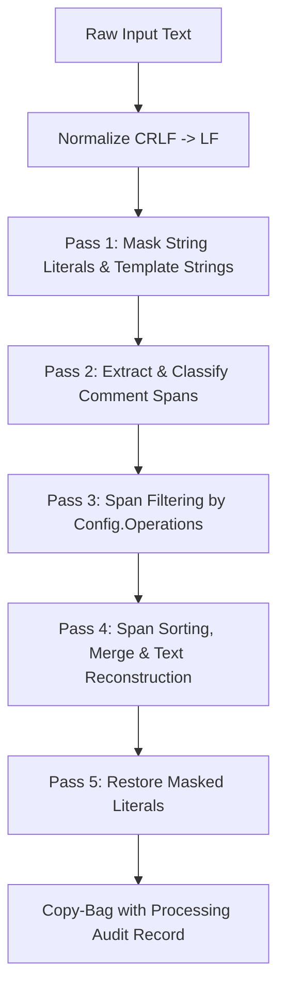

Based on your existing architecture and the design notes in [`gemini-stripper-lang-expansion.md`](file:///d:/aghado01/science-facility/issues/reposnapshot/design/gemini-stripper-lang-expansion.md), here is the concrete implementation plan and technical roadmap I propose.

---

### 1. Processor Topology & Strategy

I propose implementing **three discrete processor scripts** under [`reposnapshot-v3/processors/`](file:///d:/aghado01/science-facility/utils/reposnapshot/reposnapshot-v3/processors):

1. **[`rs.js.strip.ps1`](file:///d:/aghado01/science-facility/utils/reposnapshot/reposnapshot-v3/processors/rs.js.strip.ps1)** (`.js`, `.mjs`, `.cjs`, `.jsx`)
2. **[`rs.ts.strip.ps1`](file:///d:/aghado01/science-facility/utils/reposnapshot/reposnapshot-v3/processors/rs.ts.strip.ps1)** (`.ts`, `.mts`, `.cts`, `.tsx`, `.d.ts`)
3. **[`rs.py.strip.ps1`](file:///d:/aghado01/science-facility/utils/reposnapshot/reposnapshot-v3/processors/rs.py.strip.ps1)** (`.py`, `.pyw`, `.pyi`)

> **Why separate JS and TS processors rather than a shared wrapper?**
> - **Zero ISS runtime coupling**: Adheres to the closure rule and bare ISS safety.
> - **Distinct FrontMatter semantics**: TS requires handling `/// <reference path="..." />` and `/// <amd-dependency ... />` as non-strippable compiler directives / FrontMatter, whereas in pure JS, `///` can be standard lines or JSDoc variants.
> - **Exact receipt provenance**: The item’s `Processing` record honestly reports `Implementation = 'rs.ts.strip'` vs `'rs.js.strip'`, retaining exact dialect provenance.

---

### 2. Concrete Engine Design

#### A. JavaScript & TypeScript Mask-and-Span Pipeline (`rs.js.strip` & `rs.ts.strip`)



##### 1. Literals Masking (Preventing false positives)
Before scanning for comments, we replace string literals with private Unicode sentinels (`0xE000`–`0xE001`):
- **Template literals**: `` `(\\.|[^`\\])*` `` (handles multi-line template strings).
- **Single & Double Quoted strings**: `'(\\.|[^'\\])*'` and `"(\\.|[^"\\])*"`.
- **Regex literal heuristic**: `(?<=[=(,:[!&|?+\-*/\s]|^)\/(?!\/|\*)(?:\\.|[^\/\r\n\\])+\/[gimsuy]*` (distinguishes regex literals `/.../` from division `/` and comments `//`).

##### 2. Comment Span Classification
- **FrontMatter**:
  - Shebang: `\A#![^\n]*\n?`
  - TS Directives (TS only): `(?m)^[ \t]*///[ \t]*<(?:reference|amd-|ts-)[^\n]*\n?`
- **DocString**: JSDoc/TSDoc blocks `/\*\*(?!\/)[\s\S]*?\*/`
- **BlockComment / InteriorComment**: `/\*(?!\*)[\s\S]*?\*/`
  - Scans preceding/succeeding whitespace on the line:
    - Entire line is comment $\rightarrow$ `BlockComment` (eats line indent + trailing newline).
    - Code surrounds comment $\rightarrow$ `InteriorComment` (strips token only).
- **LineComment / CommentBlock / InlineComment**: `//[^\n]*`
  - Preceding non-whitespace $\rightarrow$ `InlineComment`.
  - Standalone single $\rightarrow$ `LineComment`.
  - Contiguous 2+ line runs $\rightarrow$ `CommentBlock`.

---

#### B. Python Mask-and-Span Pipeline (`rs.py.strip`)

Python comment syntax is simpler (`#`), but docstrings and triple-quotes require structural heuristics.

##### 1. FrontMatter Extraction
- **Shebang**: `\A#![^\n]*\n?` (line 1).
- **PEP 263 Encoding Cookies**: `(?m)^[ \t]*#[ \t]*(?:-\*-|coding[:=])[^\n]*\n?` on lines 1 or 2.

##### 2. Triple-Quote Classification (DocStrings vs Data Strings)
Triple-quoted blocks (`"""..."""` or `'''...'''`, including `r`, `f`, `b`, `u` prefixes):
- **Assigned / Data String**: Preceded on line by `=`, `(`, `[`, `{`, `,`, `return`, `yield`, `+`, etc. $\rightarrow$ **Mask as protected literal**.
- **DocString**:
  - File-level docstring (at index 0 or immediately following FrontMatter).
  - Function / Class docstring (immediately following `def ...:\s*` or `class ...:\s*`).
- **BlockComment**: Standalone triple-quoted expression statements not attached to a definition $\rightarrow$ classified as `BlockComment`.

##### 3. Single-Line Comments (`#`)
- `#` preceded by code $\rightarrow$ `InlineComment`.
- Standalone `#` line $\rightarrow$ `LineComment`.
- 2+ consecutive standalone `#` lines $\rightarrow$ `CommentBlock`.

---

### 3. File Updates & Sequencer Routing

#### A. External Config Files
Create [`rs.js.strip.json`](file:///d:/aghado01/science-facility/utils/reposnapshot/reposnapshot-v3/processors/configs/rs.js.strip.json), [`rs.ts.strip.json`](file:///d:/aghado01/science-facility/utils/reposnapshot/reposnapshot-v3/processors/configs/rs.ts.strip.json), and [`rs.py.strip.json`](file:///d:/aghado01/science-facility/utils/reposnapshot/reposnapshot-v3/processors/configs/rs.py.strip.json):
```json
{
  "Operations": [
    "block-comments",
    "doc-strings",
    "comment-blocks",
    "line-comments"
  ],
  "IncludeMeta": true
}
```

#### B. Updating [`default_sequencer.json`](file:///d:/aghado01/science-facility/utils/reposnapshot/reposnapshot-v3/processors/default_sequencer.json)
Wire the `StripComments` capability to route all language extensions:
```json
{
  "StripComments": {
    "Group": 2, "Rank": 0, "Default": false,
    "Requires": ["file_read"],
    "Routing": [
      { "File": "rs.ps.strip.ps1", "Extensions": ["ps1", "psm1", "psd1"] },
      { "File": "rs.cs.strip.ps1", "Extensions": ["cs", "csx"] },
      { "File": "rs.js.strip.ps1", "Extensions": ["js", "mjs", "cjs", "jsx"] },
      { "File": "rs.ts.strip.ps1", "Extensions": ["ts", "mts", "cts", "tsx", "d.ts"] },
      { "File": "rs.py.strip.ps1", "Extensions": ["py", "pyw", "pyi"] }
    ]
  }
}
```

---

### 4. Verification & Testing Suite

To ensure no regressions and strict adherence to the house testing standards:

1. **Unit Test Suites** (in [`reposnapshot-v3/processors/tests/`](file:///d:/aghado01/science-facility/utils/reposnapshot/reposnapshot-v3/processors/tests)):
   - `rs.js.strip.tests.ps1`: Tests unpacking, JSDoc, inline `//`, multiline `/* */`, template literal protection, JSX tags.
   - `rs.ts.strip.tests.ps1`: Tests `/// <reference>` preservation, type assertion comments, `.d.ts` declaration docstrings.
   - `rs.py.strip.tests.ps1`: Tests shebang/coding cookies, module/class/def docstrings vs multiline variables, inline `#`.

2. **Integration Verification**:
   - Update [`colonel-sequencing.tests.ps1`](file:///d:/aghado01/science-facility/utils/reposnapshot/tests/colonel-sequencing.tests.ps1#L375-L428) Section 9:
     Now that `.py` and `.ts` have strippers routed, assert:
     ```powershell
     Assert-True ($pyTrail -contains 'StripComments:rs.py.strip')
     Assert-True ($tsTrail -contains 'StripComments:rs.ts.strip')
     ```
   - Run the full test battery via [`tests/run-all.ps1`](file:///d:/aghado01/science-facility/utils/reposnapshot/tests/run-all.ps1) to confirm all suites pass cleanly.

---

### Proposed Execution Order

When you are ready to begin implementation:
1. **Phase 1: Configs & Sequencer** — Fill out the `.json` configs and update `default_sequencer.json`.
2. **Phase 2: JS / TS Strippers & Tests** — Write `rs.js.strip.ps1`, `rs.ts.strip.ps1`, and their test suites against fixtures + `tests/languages/javascript` and `tests/languages/typescript`.
3. **Phase 3: Python Stripper & Tests** — Write `rs.py.strip.ps1` and its test suite against fixtures + `tests/languages/python`.
4. **Phase 4: Multi-Language Heterogeneous Battery** — Update `colonel-sequencing.tests.ps1` and verify the entire battery with `run-all.ps1`.

How does this roadmap look to you?