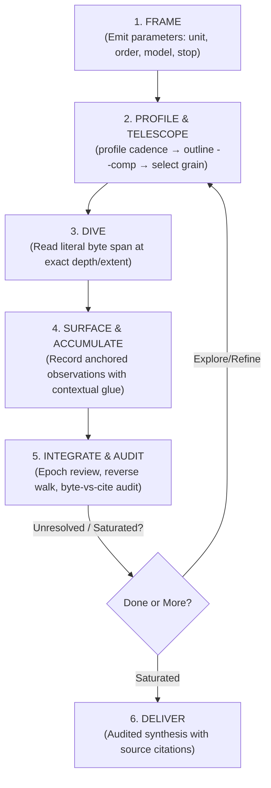

# doc-dive

`doc-dive` provides a disciplined, stateful method for investigating Markdown corpora without loading documents wholesale or reducing them to independent summaries.

**The Golden Invariant:** Attention is the investigative instrument. The tool exposes deterministic structure and literal source spans; the skill supplies reading discipline and audit trails; the reasoning agent retains semantic control.

---

## 1. The Three Layers

| Layer | Responsibility | What it Must Never Do |
|---|---|---|
| **Utility (`mdnav`)** | Deterministic byte indexing, half-open spans `[start, end)`, outlines, profiles, noise elision, literal reads | Never classify relevance, interpret meaning, or choose reading order |
| **Skill (`doc-dive`)** | Reading discipline, attention budgeting, coverage accounting, reversible state updates, audit loops | Never force a rigid sequence or mutate source files |
| **Reasoning Agent** | Document framing, semantic interpretation, hypothesis testing, cross-document synthesis | Never claim conclusions without anchored source evidence |

### The Admission Test
Before automating or delegating any investigative step, test it against these criteria:
1. Is it deterministic?
2. Does it eliminate repeated mechanical work?
3. Does it reduce tool calls or context noise?
4. Does it preserve literal source material?
5. **Does it avoid deciding what the material means?**

*If a proposed feature fails (5), it belongs in the reasoning procedure, not in the utility or workflow automation.*

---

## 2. Core Investigative Loop

The loop is scale-invariant (corpus → document → unit → concept) and triggered by state changes rather than fixed sequential stages.



### 1. `FRAME` — Parameterize the Investigation
Do not force an ontology before encountering the material. Emit parameters as open questions (each may legitimately start as `undetermined`):
- **Unit of analysis:** *Proposal* · *Mechanism* · *Claim* · *Entity* · *Undetermined*
- **Ordering:** *Chronological (load-bearing)* · *Dependency/Construction* · *None* · *Undetermined*
- **External model:** *None* (archaeology) · *Target architecture/codebase* (synthesis)
- **Termination:** *Trajectory reconstructed & swept* · *Constraints satisfied* · *Saturation*

### 2. `PROFILE & TELESCOPE` — Characterize Before Ingesting
Never dive blind into an unknown document:
1. `profile <ref>`: Inspect composition and gap coefficient of variation (`cv < 0.6` flags structural delimiters).
2. `outline <ref> --depth N --comp`: Inspect top constructs per unit (e.g. `[quote84 prose12]`, `[data100]`) to identify high-signal units and avoid token traps.
3. `marks <ref> --kind <construct>`: Locate exact runs of specific markup (blockquotes, `<details>`, fences) when headings are non-standard.

### 3. `DIVE` — Read at Deliberate Grain
- Read exact units or subtrees with `mdnav read <ref> --heading Hnnnn --extent unit|subtree`.
- Batch re-read supporting anchors for a concept in one call: `mdnav read <ref> --headings H0003,H0019`.
- Strip multi-kilobyte embedded assets (PNGs, presigned URLs): `--strip all`.

### 4. `SURFACE & ACCUMULATE` — Stateful Ledger Updates
- **Anchored Evidence:** Every finding must reference `Dnnn:Hnnnn[@digest]`.
- **Contextual Glue:** Write trails as causal prose embedding anchors (e.g., *“Proposed at D001:H0003; narrowed at D001:H0019 when edge case broke it; adopted at D002:H0007”*) rather than bare IDs or brittle dependency graphs.
- **Preserve History:** Reversible updates only—never overwrite previous formulations in place.

### 5. `INTEGRATE & AUDIT` — Epoch Reviews
At major boundaries (section, document, theme):
- Rebuild concepts from the observation ledger, not from the previous summary.
- **The Reverse Walk:** Walk surviving claims *backward* against their literal source anchors.
- **Coverage Arithmetic:** Compare bytes read vs bytes cited to catch silent attrition and ungrounded salience capture.

---

## 3. Analytical Notebook State

Maintain a concise, durable working notebook (e.g. `review-state.md` or `.doc-dive/review-state.md`):

```markdown
# Study Contract & FRAME Parameters
- Question / Scope: ...
- Unit of Analysis: [Proposal | Mechanism | Claim | Undetermined]
- Ordering: [Chronological | Dependency | None]
- External Model: [None | Target Project / System]

# Document Inventory & Working Grain
| ID   | Path            | Working Basis/Depth | Structural Role                       |
|------|-----------------|---------------------|---------------------------------------|
| D001 | chat-export.md  | depth 1             | H1 delimits turns (~3.5KB/unit)       |
| D002 | paper.md        | depth 2             | H2 major sections; descend selectively |

# Developing Concepts & Mechanisms
## C-001 — [Concept Name]
- Current Formulation: ...
- Development: Proposed at D001:H0002; refined at D001:H0014; grounded at D002:H0006.
- History: [prior formulations preserved]
- Anchors: D001:H0002@a1b2, D001:H0014@3c4d, D002:H0006@e5f6
- Counterevidence / Tensions: ...
- Status: [active | refined | retracted | split -> C-001a, C-001b]

# Proposal & Evidence Ledger
- [P-001] D001:H0003: [One-line proposal description] | Status: [adopted | refined | superseded | rejected | open]

# Unresolved Questions & Contradictions
- Q-001: ...
```

---

## 4. `mdnav` Quick Reference

Operates on literal byte spans, either directly via **MCP Tools** (recommended for zero-shell context economy) or the **CLI**.

### MCP Tool Interface (Preferred)

| Tool Call | Description & Usage |
|---|---|
| `mdnav_discover({ paths: ["./corpus"], recursive: true })` | Discovers, indexes, and caches documents in memory. Returns inventory table. |
| `mdnav_profile({ docId: "D001" })` | Reports construct shares, median gaps, and $cv$ for delimiter identification. |
| `mdnav_outline({ docId: "D001", depth: 2, comp: true })` | Hierarchical unit outline with sizes and construct composition tags (`[quote84 prose12]`). |
| `mdnav_marks({ docId: "D001", kind: "blockquote" })` | Enumerates exact byte spans and previews of specific constructs. |
| `mdnav_read({ docId: "D001", heading: "H0003", extent: "unit", strip: "all" })` | Reads literal Markdown span at exact depth/extent with optional binary noise stripping. |
| **`mdnav_batch_read({ requests: [...] })`** | **Native multi-document batch reading** (e.g. read 20+ abstracts/theorems across papers in 1 RPC). |
| `mdnav_coverage({ docIds: ["D001"], depth: 1 })` | Byte-exact read vs unread accounting and unread anchor listing. |
| `mdnav_locate({ pattern: "keyword", docIds: ["D001"] })` | Fast regex/string search returning anchor lines without dumping full bodies. |

### CLI Equivalents

```bash
# Discovery & Indexing
node mdnav.mjs discover ./corpus --recursive [--work-dir <path>]

# Triage & Structure
node mdnav.mjs profile D001                      # Composition, cadence & delimiter detection (cv)
node mdnav.mjs outline D001 --depth 2 --comp     # Unit outlines with component breakdowns
node mdnav.mjs marks D001 --kind blockquote      # List markup runs with start..end byte spans
node mdnav.mjs locate "keyword" D001 -i          # Anchors and line hits without dumping text

# Materialization
node mdnav.mjs read D001 --heading H0003 --extent unit [--strip all]
node mdnav.mjs read D001 --from H0003 --to H0007                      # Merge contiguous run
node mdnav.mjs read D001 --headings H0003,H0019,H0042                 # Multi-span batch read

# Audit & Accounting
node mdnav.mjs coverage D001 [--depth 1]         # Byte-exact coverage & unread anchors
```

### Grain Signatures Triage Table

| Grain (`discover` output) | Structural Reality | Initial Action |
|---|---|---|
| `62/219/221~3.29K` | Level-1 headings delimit records/turns | Outline `--depth 1`, read turns as units |
| `1/83/141~918B` | H1 is a document title; structure starts at H2 | Outline `--depth 2`, descend selectively |
| `1/1/38~746B` | Headings flattened/demoted upstream | Target `--depth 3` |
| `1/1/1~6.57K` | No usable headings | Try `--by breaks`, fallback to `--windows 4000` |
| `15/15/15~1.14K` | Flat records with no nesting | Read at depth 1 |

---

## 5. Reference Guides

Read the dedicated guide for specific domain workflows and audit mechanics:

| Reference Guide | Read when you need... |
|---|---|
| [chat-archaeology.md](file:///d:/aghado01/science-facility/mcp/mdnav/skills/doc-dive/references/chat-archaeology.md) | Deep-diving into long chat exports (Claude, Codex, Perplexity); tracking narrative/design evolution, proposal lifecycles, detecting silent attrition, triage of conversation markup/asides, and multi-thread chronology. |
| [technical-literature.md](file:///d:/aghado01/science-facility/mcp/mdnav/skills/doc-dive/references/technical-literature.md) | Reading research papers/technical specs transferred from LaTeX/PDF; concept reconciliation, evaluating methods/trade-offs, integrating literature into project architectures, stratified reading, and fan-out gating. |
| [state-and-audit.md](file:///d:/aghado01/science-facility/mcp/mdnav/skills/doc-dive/references/state-and-audit.md) | Deep specification of the reversible notebook, contextual glue, RJMCMC-style evidence conservation, the backward reverse walk, and byte-vs-cite audit diagnostics. |
