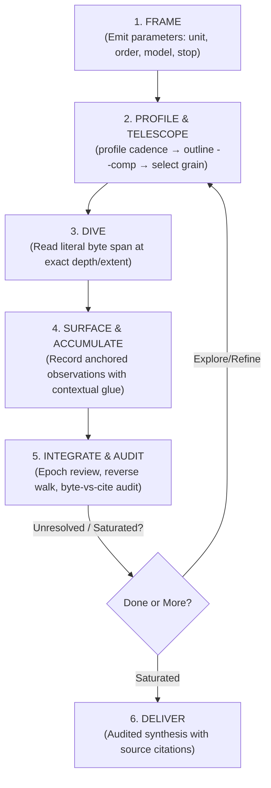

# doc-dive

`doc-dive` provides a disciplined, stateful method for investigating Markdown corpora without loading documents wholesale or reducing them to independent summaries.

**The Golden Invariant:** Attention is the investigative instrument. The tool exposes deterministic structure and literal source spans; the skill supplies reading discipline and audit trails; the reasoning agent retains semantic control.

---

## 1. The Three Layers

| Layer | Responsibility | What it Must Never Do |
|---|---|---|
| **Utility (`mdnav`)** | Deterministic byte indexing, half-open spans `[start, end)`, outlines, profiles, noise elision, literal reads | Never classify relevance, interpret meaning, or choose reading order |
| **Skill (`doc-dive`)** | Reading discipline, attention budgeting, coverage accounting, reversible state updates, audit loops | Never force a rigid sequence or mutate source files |
| **Reasoning Agent** | Document framing, semantic interpretation, hypothesis testing, cross-document synthesis | Never claim conclusions without anchored source evidence |

### The Admission Test
Before automating or delegating any investigative step, test it against these criteria:
1. Is it deterministic?
2. Does it eliminate repeated mechanical work?
3. Does it reduce tool calls or context noise?
4. Does it preserve literal source material?
5. **Does it avoid deciding what the material means?**

*If a proposed feature fails (5), it belongs in the reasoning procedure, not in the utility or workflow automation.*

---

## 2. Core Investigative Loop

The loop is scale-invariant (corpus → document → unit → concept) and triggered by state changes rather than fixed sequential stages.



### 1. `FRAME` — Parameterize the Investigation
Do not force an ontology before encountering the material. Emit parameters as open questions (each may legitimately start as `undetermined`):
- **Unit of analysis:** *Proposal* · *Mechanism* · *Claim* · *Entity* · *Undetermined*
- **Ordering:** *Chronological (load-bearing)* · *Dependency/Construction* · *None* · *Undetermined*
- **External model:** *None* (archaeology) · *Target architecture/codebase* (synthesis)
- **Termination:** *Trajectory reconstructed & swept* · *Constraints satisfied* · *Saturation*

### 2. `PROFILE & TELESCOPE` — Characterize Before Ingesting
Never dive blind into an unknown document:
1. The `discover`/`index` inventory already flags what the document costs to read — embedded payloads, whether its breaks and H1s agree, setext suspects. Act on those notes before anything else.
2. `mdnav_profile({ docId })`: composition and gap coefficient of variation (`cv < 0.6` flags structural delimiters).
3. `mdnav_outline({ docId, depth, comp: true })`: top constructs per unit (e.g. `[quote84 prose12]`, `[data100]`) to find high-signal units and avoid token traps.
4. `mdnav_marks({ docId, kind })`: exact runs of specific markup (blockquotes, `<details>`, fences) when headings are non-standard.

### 3. `DIVE` — Read at Deliberate Grain
- `mdnav_read({ docId, heading: "H0003@a1b2", extent: "unit" | "subtree" })` — exact units or subtrees.
- `mdnav_read({ docId, headings: ["H0003", "H0019"] })` — re-read a concept's supporting anchors together; each arrives with its own header.
- `mdnav_batch_read({ requests: [...] })` — the same across documents in one call.
- `strip: "all"`, or name the species (`strip: ["data-uri"]`), to drop multi-kilobyte assets.

### 4. `SURFACE & ACCUMULATE` — Stateful Ledger Updates
- **Anchored Evidence:** Every finding must reference `Dnnn:Hnnnn[@digest]`. Record it with `mdnav_journal_record` as you read, while the span is still in front of you.
- **Contextual Glue:** Write trails as causal prose embedding anchors (e.g., *“Proposed at D001:H0003; narrowed at D001:H0019 when edge case broke it; adopted at D002:H0007”*) rather than bare IDs or brittle dependency graphs.
- **Preserve History:** Reversible updates only—never overwrite previous formulations in place. In the journal this is structural: a reversal is a new entry (`retract`, `supersede`) that re-derives the parent's status, and the parent's own record is never touched.

### 5. `INTEGRATE & AUDIT` — Epoch Reviews
At major boundaries (section, document, theme):
- Rebuild concepts from the observation ledger (`mdnav_journal_read({ concept })`), not from the previous summary.
- **The Reverse Walk:** Walk surviving claims *backward* against their literal source anchors. Re-reading a cited anchor reports digest drift in-band, so Audit Check 4 answers itself.
- **Coverage Arithmetic:** Compare bytes read (`mdnav_coverage`) vs bytes cited (`mdnav_journal_read({ docId })`) to catch silent attrition and ungrounded salience capture.

---

## 3. Analytical Notebook State

State lives in two places, split by who does the work:

| | Holds | Kept by |
|---|---|---|
| **Journal** (`.doc-dive/journal.jsonl`) | The evidence chain: proposals, refinements, adoptions, retractions, and the anchors backing each | `mdnav_journal_*` — ids, timestamps, parent linkage and status are minted for you |
| **Notebook** (`review-state.md`) | The study contract, document inventory and working grain, causal glue prose, open questions | You, by hand |

Record as you read, not at the end — an entry costs one small write and its receipt:

```
mdnav_journal_record({ op: "propose", concept: "C-001",
                       body: "Median is scale-calibrated.",
                       anchors: ["D001:H0003@a1b2"] })
→ recorded | N001 (+28 B) | propose | - | C-001 | D001:H0003@a1b2

mdnav_journal_record({ op: "refine", concept: "C-001", refs: ["N001"],
                       body: "Only under bounded curvature — edge case at D001:H0019." })
→ recorded | N002 (+52 B) | refine | N001 | C-001 | -
```

`N001` now reads as `refined` without anything being rewritten. See [state-and-audit.md](references/state-and-audit.md) §4 for the ops table and the derivation rule.

The markdown notebook keeps what the journal deliberately does not:

```markdown
# Study Contract & FRAME Parameters
- Question / Scope: ...
- Unit of Analysis: [Proposal | Mechanism | Claim | Undetermined]
- Ordering: [Chronological | Dependency | None]
- External Model: [None | Target Project / System]

# Document Inventory & Working Grain
| ID   | Path            | Working Basis/Depth | Structural Role                       |
|------|-----------------|---------------------|---------------------------------------|
| D001 | chat-export.md  | depth 1             | H1 delimits turns (~3.5KB/unit)       |
| D002 | paper.md        | depth 2             | H2 major sections; descend selectively |

# Developing Concepts & Mechanisms
## C-001 — [Concept Name]
- Current Formulation: ...
- Development: Proposed as a general principle; narrowed when multi-file exports broke the flat assumption; formalized and named in the methods section.
- Counterevidence / Tensions: ...
- Split criterion (if split): ...

*History, anchors, and status are not restated here — `mdnav_journal_read({ concept: "C-001" })` holds them, and `mdnav_journal_tree({ concept: "C-001" })` charts the lineage. Keeping one copy is what keeps them from disagreeing.*

# Unresolved Questions & Contradictions
- Q-001: ...
```

---

## 4. `mdnav` Quick Reference

Operates on literal byte spans, either directly via **MCP Tools** (recommended for zero-shell context economy) or the **CLI**.

### MCP Tool Interface (Preferred)

| Tool Call | Description & Usage |
|---|---|
| `mdnav_discover({ paths: ["./corpus"], recursive: true })` | Discovers, indexes, and caches documents. Returns the inventory with triage flags (below). `run: "latest"` attaches to an earlier run instead of starting one, restoring its read ledger. |
| `mdnav_index({ docIds: ["D003"], refresh: true })` | Re-reports inventory rows for documents already indexed, without re-crawling. `refresh` forces a re-scan. |
| `mdnav_profile({ docId: "D001" })` | Reports construct shares, median gaps, and $cv$ for delimiter identification. |
| `mdnav_outline({ docId: "D001", depth: 2, comp: true })` | Hierarchical unit outline with sizes and construct composition tags (`[quote84 prose12]`). |
| `mdnav_marks({ docId: "D001", kind: "blockquote" })` | Enumerates exact byte spans and previews of specific constructs. |
| `mdnav_read({ docId: "D001", heading: "H0003@a1b2", extent: "unit", strip: "all" })` | Reads literal Markdown span at exact depth/extent with optional binary noise stripping. Every chunk arrives with a provenance header (see below). |
| **`mdnav_batch_read({ requests: [...] })`** | **Native multi-document batch reading** (e.g. read 20+ abstracts/theorems across papers in 1 RPC). |
| `mdnav_coverage({ docIds: ["D001"], depth: 1 })` | Bytes read **and bytes cited**, with the read-not-cited / cited-not-read diagnostics. `byBreaks: true` scores against the segment basis. |
| `mdnav_locate({ pattern: "keyword", docIds: ["D001"] })` | Fast regex/string search returning anchor lines without dumping full bodies. |
| **`mdnav_journal_record({ op, body, concept?, refs?, anchors? })`** | **Append one observation/hypothesis/decision to the notebook.** Returns a compact receipt — never an echo. |
| `mdnav_journal_read({ concept?, status?, docId?, anchor?, digest?, op? })` | Ledger view, filtered. `status: "active"` lists what nothing has yet superseded; `anchor`/`digest` traverse the citation graph. |
| `mdnav_journal_tree({ concept? })` | Lineage of ideas: what refined, superseded, adopted, or rejected what. |

### The Stream Is Framed

Material arrives inside a frame — metadata prefix, then the content, then a close:

```
address | span | bytes | content

D001 : H0002 @ d21b | 9 .. 60 | 51 |
## Abstract

A scale-calibrated geometric median.
|
```

` | ` separates **fields**; the operators join the components *within* one field — so the address is a single field, not three columns. **`bytes` is a length prefix**, and it is last for that reason: reading it closes the frame, and the next that-many bytes are the material. It counts what you were handed, not the span it came from, so `60 .. 735 | 78` says the unit is 675 bytes and 597 of them were elided. The trailing `|` closes the block; markdown content contains `|` itself (tables), so it is a boundary marker, never the parse mechanism.

**Why it earns the characters.** Attention binds on token identity. `D001` here is the same token sequence as `D001` in an outline row 30k tokens back and in a journal citation later, so those mentions link to each other without you re-deriving the connection. Fused as `D001:H0002@d21b` the components merge with the punctuation and tokenize differently depending on the digits around them — the link then has to be *inferred* from string similarity rather than seen. And because the stream only ever moves forward, an unframed block has no recoverable end: the framing is what keeps material and metadata told apart further down.

In practice:

- **Quote anchors exactly as given.** A restyled citation loses the binding.
- **One frame per span.** A multi-unit read frames each unit separately, never the outer bound — that would claim the gaps between them as read.
- Pass anchors *back* compact (`D014:H0003@a1b2`); only the stream spaces them out.
- `prefixFormat: false` per call, `MDNAV_PREFIX=off` per session.

**Anchor families** — one shared address space, all four accepted by `read`:

| Family | Minted by | Use when |
|---|---|---|
| `Hnnnn` | headings, always | The document has usable headings |
| `H0000` | `PREAMBLE` (prose before the first heading) or `BODY` (no headings at all) | Bytes would otherwise be unreachable by anchor |
| `Snnnn` | `outline({ byBreaks: true })` | Structure is carried by `---`, not headings |
| `Wnnnn` | `outline({ windows: 4000 })` | Neither headings nor breaks give usable grain |

**Two things the tools volunteer,** in-band, because stderr reaches the server log and not you:

- **A source that changed under you** — re-indexed and announced before the content. `mdnav_journal_read({ digest })` then lists which citations were pinned to the old version.
- **What `strip` removed** — each span leaves a marker naming its kind and byte cost (`mdnav elided | data-uri | 4030 B`), plus a total. Re-read the same anchor without `strip` to get the bytes back.

### Reading the Inventory

`discover` and `index` report what a document *costs* to read, never what it means:

```
doc | bytes | h1/h2/.. | grain | spine | notes | path
D001 | 9,091 B | 3 | 3/3/3~3.0K | 0.4% | embedded 8.8K (99%) breaks x2 (= h1-1) | .../chat.md
D002 |    90 B | 1/1 | 1/2/2~90B | 8.9% | breaks x2 (not h1-1) setext? x2 frontmatter | .../paper.md
```

| Note | What it means | What to do |
|---|---|---|
| `embedded 8.8K (99%)` | The document is almost entirely a base64 payload | Read with `strip: "all"`, or `strip: ["data-uri"]` to take only that species |
| `signed xN` · `imgref xN` · `html 4.2K` | Other machine furniture, counted separately — different problems, different remedies | Name the species you want gone |
| `breaks x2 (= h1-1)` | Thematic breaks correspond to H1 count — the two bases agree | Either basis works |
| `breaks x2 (not h1-1)` | They disagree. **Neither is privileged** | Inspect both: `outline({ depth: 1 })` and `outline({ byBreaks: true })` |
| `setext? x2` | Underlined headings the ATX scanner cannot see, so the real structure may be finer than `grain` suggests | Check with `marks`, or fall back to `byBreaks` / `windows` |
| `frontmatter` · `bom` · `crlf` | Structural facts that mislead naive offset arithmetic | Nothing — mdnav already accounts for them |
| `maxline 12K` | A very long line in an otherwise clean document: a blob, not prose | Expect an `unbroken` window there |

### Grain Signatures Triage Table

| Grain (`discover` output) | Structural Reality | Initial Action |
|---|---|---|
| `62/219/221~3.29K` | Level-1 headings delimit records/turns | Outline `--depth 1`, read turns as units |
| `1/83/141~918B` | H1 is a document title; structure starts at H2 | Outline `--depth 2`, descend selectively |
| `1/1/38~746B` | Headings flattened/demoted upstream | Target `--depth 3` |
| `1/1/1~6.57K` | No usable headings | Try `byBreaks: true` (Snnnn), fallback to `windows: 4000` (Wnnnn) |
| `0/0/0~4.3K` | No headings at all | The whole document is `H0000` (BODY); partition it with `windows` |
| `15/15/15~1.14K` | Flat records with no nesting | Read at depth 1 |

### CLI

The tools cover every CLI capability, so a doc-dive never needs to leave the tool surface. `node mdnav.mjs <discover|index|profile|outline|marks|read|coverage|locate>` remains for shell work — piping, scripting, a look without a session. `--help` lists the flags.

---

## 5. Reference Guides

Read the dedicated guide for specific domain workflows and audit mechanics:

| Reference Guide | Read when you need... |
|---|---|
| [chat-archaeology.md](file:///d:/aghado01/science-facility/mcp/mdnav/skills/doc-dive/references/chat-archaeology.md) | Deep-diving into long chat exports (Claude, Codex, Perplexity); tracking narrative/design evolution, proposal lifecycles, detecting silent attrition, triage of conversation markup/asides, and multi-thread chronology. |
| [technical-literature.md](file:///d:/aghado01/science-facility/mcp/mdnav/skills/doc-dive/references/technical-literature.md) | Reading research papers/technical specs transferred from LaTeX/PDF; concept reconciliation, evaluating methods/trade-offs, integrating literature into project architectures, stratified reading, and fan-out gating. |
| [state-and-audit.md](file:///d:/aghado01/science-facility/mcp/mdnav/skills/doc-dive/references/state-and-audit.md) | Deep specification of the reversible notebook, contextual glue, RJMCMC-style evidence conservation, the backward reverse walk, and byte-vs-cite audit diagnostics. |
