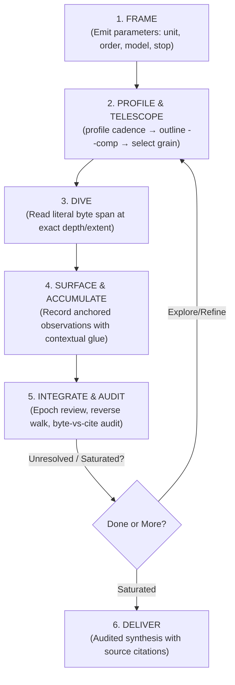

# doc-dive

`doc-dive` provides a disciplined, stateful method for investigating Markdown corpora without loading documents wholesale or reducing them to independent summaries.

**The Golden Invariant:** Attention is the investigative instrument. The tool exposes deterministic structure and literal source spans; the skill supplies reading discipline and audit trails; the reasoning agent retains semantic control.

---

## 1. The Three Layers

| Layer | Responsibility | What it Must Never Do |
|---|---|---|
| **Utility (`mdnav`)** | Deterministic byte indexing, half-open spans `[start, end)`, outlines, profiles, noise elision, literal reads | Never classify relevance, interpret meaning, or choose reading order |
| **Skill (`doc-dive`)** | Reading discipline, attention budgeting, coverage accounting, reversible state updates, audit loops | Never force a rigid sequence or mutate source files |
| **Reasoning Agent** | Document framing, semantic interpretation, hypothesis testing, cross-document synthesis | Never claim conclusions without anchored source evidence |

### The Admission Test
Before automating or delegating any investigative step, test it against these criteria:
1. Is it deterministic?
2. Does it eliminate repeated mechanical work?
3. Does it reduce tool calls or context noise?
4. Does it preserve literal source material?
5. **Does it avoid deciding what the material means?**

*If a proposed feature fails (5), it belongs in the reasoning procedure, not in the utility or workflow automation.*

---

## 2. Core Investigative Loop

The loop is scale-invariant (corpus → document → unit → concept) and triggered by state changes rather than fixed sequential stages.



### 1. `FRAME` — Parameterize the Investigation
Do not force an ontology before encountering the material. Emit parameters as open questions (each may legitimately start as `undetermined`):
- **Unit of analysis:** *Proposal* · *Mechanism* · *Claim* · *Entity* · *Undetermined*
- **Ordering:** *Chronological (load-bearing)* · *Dependency/Construction* · *None* · *Undetermined*
- **External model:** *None* (archaeology) · *Target architecture/codebase* (synthesis)
- **Termination:** *Trajectory reconstructed & swept* · *Constraints satisfied* · *Saturation*

### 2. `PROFILE & TELESCOPE` — Characterize Before Ingesting
Never dive blind into an unknown document:
1. The `discover`/`index` inventory already flags what the document costs to read — embedded payloads, whether its breaks and H1s agree, setext suspects. Act on those notes before anything else.
2. `mdnav_profile({ docId })`: composition and gap coefficient of variation (`cv < 0.6` flags structural delimiters).
3. `mdnav_outline({ docId, depth, comp: true })`: top constructs per unit (e.g. `[quote84 prose12]`, `[data100]`) to find high-signal units and avoid token traps.
4. `mdnav_marks({ docId, kind })`: exact runs of specific markup (blockquotes, `<details>`, fences) when headings are non-standard.

### 3. `DIVE` — Read at Deliberate Grain
- `mdnav_read({ docId, heading: "H0003@a1b2", extent: "unit" | "subtree" })` — exact units or subtrees.
- `mdnav_read({ docId, headings: ["H0003", "H0019"] })` — re-read a concept's supporting anchors together; each arrives with its own header.
- `mdnav_batch_read({ requests: [...] })` — the same across documents in one call.
- `strip: "all"`, or name the species (`strip: ["data-uri"]`), to drop multi-kilobyte assets.

### 4. `SURFACE & ACCUMULATE` — Stateful Ledger Updates
- **Anchored Evidence:** Every finding must reference its address, digest included. Record it with `mdnav_journal_record` as you read, while the span is still in front of you.
- **Contextual Glue:** Write trails as causal prose embedding anchors (e.g., *“Proposed at D001:H0003; narrowed at D001:H0019 when edge case broke it; adopted at D002:H0007”*) rather than bare IDs or brittle dependency graphs.
- **Preserve History:** Reversible updates only—never overwrite previous formulations in place. In the journal this is structural: a reversal is a new entry (`retract`, `supersede`) that re-derives the parent's status, and the parent's own record is never touched.

### 5. `INTEGRATE & AUDIT` — Epoch Reviews
At major boundaries (section, document, theme):
- Rebuild concepts from the observation ledger (`mdnav_journal_read({ concept })`), not from the previous summary.
- **The Reverse Walk:** Walk surviving claims *backward* against their literal source anchors. Re-reading a cited anchor reports digest drift in-band, so Audit Check 4 answers itself.
- **Coverage Arithmetic:** Compare bytes read (`mdnav_coverage`) vs bytes cited (`mdnav_journal_read({ scope })`) to catch silent attrition and ungrounded salience capture.

---

## 3. Analytical Notebook State

State lives in two places, split by who does the work:

| | Holds | Kept by |
|---|---|---|
| **Journal** (`.doc-dive/journal.jsonl`) | The evidence chain: proposals, refinements, adoptions, retractions, and the anchors backing each | `mdnav_journal_*` — ids, timestamps, parent linkage and status are minted for you |
| **Notebook** (`review-state.md`) | The study contract, document inventory and working grain, causal glue prose, open questions | You, by hand |

Record as you read, not at the end — an entry costs one small write and its receipt:

```
mdnav_journal_record({ op: "propose", concept: "C-001",
                       body: "Median is scale-calibrated.",
                       anchors: [{ scope: "D001", unit: "H0003", digest: "a1b2" }] })
→ recorded | N001 (+28 B) | propose | - | C-001 | D001 : H0003 @ a1b2

mdnav_journal_record({ op: "refine", concept: "C-001", refs: ["N001"],
                       body: "Only under bounded curvature — edge case at D001:H0019." })
→ recorded | N002 (+52 B) | refine | N001 | C-001 | -
```

`N001` now reads as `refined` without anything being rewritten. See [state-and-audit.md](references/state-and-audit.md) §4 for the ops table and the derivation rule.

The markdown notebook keeps what the journal deliberately does not:

```markdown
# Study Contract & FRAME Parameters
- Question / Scope: ...
- Unit of Analysis: [Proposal | Mechanism | Claim | Undetermined]
- Ordering: [Chronological | Dependency | None]
- External Model: [None | Target Project / System]

# Document Inventory & Working Grain
| ID   | Path            | Working Basis/Depth | Structural Role                       |
|------|-----------------|---------------------|---------------------------------------|
| D001 | chat-export.md  | depth 1             | H1 delimits turns (~3.5KB/unit)       |
| D002 | paper.md        | depth 2             | H2 major sections; descend selectively |

# Developing Concepts & Mechanisms
## C-001 — [Concept Name]
- Current Formulation: ...
- Development: Proposed as a general principle; narrowed when multi-file exports broke the flat assumption; formalized and named in the methods section.
- Counterevidence / Tensions: ...
- Split criterion (if split): ...

*History, anchors, and status are not restated here — `mdnav_journal_read({ concept: "C-001" })` holds them, and `mdnav_journal_tree({ concept: "C-001" })` charts the lineage. Keeping one copy is what keeps them from disagreeing.*

# Unresolved Questions & Contradictions
- Q-001: ...
```

---

## 4. `mdnav` Quick Reference

Operates on literal byte spans, either directly via **MCP Tools** (recommended for zero-shell context economy) or the **CLI**.

### MCP Tool Interface (Preferred)

| Tool Call | Description & Usage |
|---|---|
| **`mdnav_discover({ root: "./corpus" })`** | **Mount a corpus.** Indexes every Markdown file beneath the root in one call, addresses them by coordinate, reports paths relative to the root. Returns the inventory with triage flags (below). Calling it again continues the current run — see [Runs](#runs-and-the-reading-record). |
| `mdnav_discover({ paths: [...] })` | The same for individual files or directories, when there is no single root. |
| `mdnav_index({ docIds: ["D003"], refresh: true })` | Re-reports inventory rows for documents already indexed, without re-crawling. `refresh` forces a re-scan. |
| `mdnav_profile({ docId: "D001" })` | Reports construct shares, median gaps, and $cv$ for delimiter identification. |
| `mdnav_outline({ docId: "D001", depth: 2, comp: true })` | Hierarchical unit outline with sizes and construct composition tags (`[quote84 prose12]`). |
| `mdnav_marks({ docId: "D001", kind: "blockquote" })` | Enumerates exact byte spans and previews of specific constructs. |
| `mdnav_read({ docId: "D001", heading: "H0003@a1b2", extent: "unit", strip: "all" })` | Reads literal Markdown span at exact depth/extent with optional binary noise stripping. Every chunk arrives with a provenance header (see below). |
| **`mdnav_batch_read({ requests: [...] })`** | **Native multi-document batch reading** (e.g. read 20+ abstracts/theorems across papers in 1 RPC). |
| `mdnav_coverage({ docIds: ["D001"], depth: 1 })` | Bytes read **and bytes cited**, with the read-not-cited / cited-not-read diagnostics. `byBreaks: true` scores against the segment basis. |
| `mdnav_locate({ pattern: "keyword", docIds: ["D001"] })` | Fast regex/string search returning anchor lines without dumping full bodies. |
| **`mdnav_journal_record({ op, body, concept?, refs?, anchors? })`** | **Append one observation/hypothesis/decision to the notebook.** Each anchor is given as components — `{ scope, unit?, digest? }`. Returns a compact receipt. |
| `mdnav_journal_read({ concept?, status?, scope?, anchor?, digest?, op? })` | Ledger view, filtered. `status: "active"` lists what nothing has yet superseded; `scope`/`anchor`/`digest` traverse the citation graph, each naming one component of the address. |
| `mdnav_journal_tree({ concept? })` | Lineage of ideas: what refined, superseded, adopted, or rejected what. |

### The Stream Is Framed

Material arrives inside a frame — a metadata prefix, the content, then a close that repeats the address:

```
address | span | content

D0301 : H05 @ add7 | 9 .. 60 |
## Abstract

A scale-calibrated geometric median.
| D0301 : H05 @ add7
```

` | ` separates fields. The operators join components within one field, so the address is one field. The close repeats the address, bracketing the content so every token inside has its anchor before and after.

**Why it earns the characters.** Attention binds on token identity. `D0301` here is the same token sequence as `D0301` in an outline row 30k tokens back and in a journal citation later, so those mentions link to each other directly. The stream only moves forward, so the frame is what keeps material and metadata distinguishable further down.

In practice:

- **Quote anchors exactly as given.** A restyled citation loses the binding.
- **One frame per span.** A multi-unit read frames each unit separately.
- **Pass anchors back as components** — `{ scope: "D014", unit: "H0003", digest: "a1b2" }`. The stream already shows them decomposed; give them back the same way and nothing has to be inferred from punctuation. A string works too, spaced exactly as printed or compact: all three name one address and resolve identically. Spend no attention on the spacing.
- `prefixFormat: false` per call, `MDNAV_PREFIX=off` per session.

### Addressing

An address is a coordinate. Both axes are measured from the material and padded to a fixed width, so every atom of a kind is the same length and shares a literal prefix with its neighbours.

| Part | Scope | Reads as |
|---|---|---|
| `D0301` | corpus | group 3, document 1 — `D03xx` are all one directory |
| `H05` | that document | heading 5 of a document with tens of headings |
| `H007` | that document | heading 7 of a document with hundreds |
| `@a1b2` | that heading | its content when you cited it |

Width is itself signal: `H007` says the document has hundreds of headings without a lookup. A single-group corpus carries no group axis (`D01`). Input is tolerant — `H7`, `H07` and `H0007` all resolve to heading 7.

**Anchor families,** one shared address space, all accepted by `read`:

| Family | Minted by | Use when |
|---|---|---|
| `Hnn` | headings, always | The document has usable headings |
| `H00` | `PREAMBLE` (prose before the first heading) or `BODY` (no headings at all) | Bytes would otherwise be unreachable by anchor |
| `Snn` | `outline({ byBreaks: true })` | Structure is carried by `---` |
| `Wnn` | `outline({ windows: 4000 })` | Neither headings nor breaks give usable grain |

**Three things the tools volunteer,** in-band:

- **A source that changed under you** — re-indexed and announced before the content. `mdnav_journal_read({ digest })` then lists which citations were pinned to the old version.
- **What `strip` removed** — each span leaves a marker naming its kind and byte cost (`mdnav elided | data-uri | 4030 B`), plus a total. Re-read the same anchor without `strip` to get the bytes back.
- **A stale citation, at write time** — `journal_record` resolves every anchor whose scope is a document and whose unit is a chunk, as you record it, and reports drift then.

### Reading the Inventory

`discover` and `index` report what a document costs to read:

```
mount | D:\corpus\Bishop2006

doc | bytes | h1/h2/.. | grain | spine | notes | path
D0101 | 1,489 B | 1/3 | 1/4/4~1.5K | 1.0% | crlf | CONTENTS.md
D0303 | 176,641 B | 1/4/16/0/0/7 | 1/5/21~172.5K | — | setext? x1 crlf | Chapters/Chapter02.md
```

The root is stated once; paths are relative to it.

| Note | What it means | What to do |
|---|---|---|
| `embedded 8.8K (99%)` | The document is almost entirely a base64 payload | Read with `strip: "all"`, or `strip: ["data-uri"]` to take only that species |
| `signed xN` · `imgref xN` · `html 4.2K` | Other machine furniture, counted separately — different problems, different remedies | Name the species you want gone |
| `breaks x2 (= h1-1)` | Thematic breaks correspond to H1 count — the two bases agree | Either basis works |
| `breaks x2 (not h1-1)` | They disagree. **Neither is privileged** | Inspect both: `outline({ depth: 1 })` and `outline({ byBreaks: true })` |
| `setext? x2` | Underlined headings the ATX scanner cannot see, so the real structure may be finer than `grain` suggests | Check with `marks`, or fall back to `byBreaks` / `windows` |
| `frontmatter` · `bom` · `crlf` | Structural facts that mislead naive offset arithmetic | Nothing — mdnav already accounts for them |
| `maxline 12K` | A blob sits in an otherwise clean document | Expect an `unbroken` window there |

### Runs and the Reading Record

A **run** holds one investigation's artifacts under `<corpus>/.doc-dive/<stamp>/`: the index cache and `reads.jsonl`. The journal sits at the root instead, outside any run, and survives all of this.

| Call | What it does to the record |
|---|---|
| `discover` again, same corpus | **Continues the current run.** Adding a path or picking up a new file does not restart coverage; you are told when a record is being kept. |
| `discover({ newRun: true })` | Starts a separate run. Coverage begins at zero. |
| `discover({ run: "<stamp>" })` | Attaches to an earlier run and restores its `reads.jsonl` — how you resume an investigation, or look at one you left behind. Does not move `LATEST`. |
| `discover({ run: "latest" })` | The same, following the `LATEST` pointer. |

**Document ids are assigned once per path,** so an anchor cited early still names the same document after the corpus grows.

Coverage is **not merged across runs**. If a corpus was read across two of them, attach to each in turn and read the figures separately.

On the CLI every `discover` mints a run instead, and later verbs follow `LATEST` or an explicit `--run <stamp>` — so `coverage --run <stamp>` is the CLI way into an earlier one. The two surfaces differ here on purpose.

### Grain Signatures Triage Table

| Grain (`discover` output) | Structural Reality | Initial Action |
|---|---|---|
| `62/219/221~3.29K` | Level-1 headings delimit records/turns | Outline `--depth 1`, read turns as units |
| `1/83/141~918B` | H1 is a document title; structure starts at H2 | Outline `--depth 2`, descend selectively |
| `1/1/38~746B` | Headings flattened/demoted upstream | Target `--depth 3` |
| `1/1/1~6.57K` | No usable headings | Try `byBreaks: true` (Snnnn), fallback to `windows: 4000` (Wnnnn) |
| `0/0/0~4.3K` | No headings at all | The whole document is `H0000` (BODY); partition it with `windows` |
| `15/15/15~1.14K` | Flat records with no nesting | Read at depth 1 |

### CLI

The tools cover every CLI capability, so a doc-dive never needs to leave the tool surface. `node mdnav.mjs <discover|index|profile|outline|marks|read|coverage|locate>` remains for shell work — piping, scripting, a look without a session. `--help` lists the flags.

---

## 5. Reference Guides

Read the dedicated guide for specific domain workflows and audit mechanics:

| Reference Guide | Read when you need... |
|---|---|
| [chat-archaeology.md](file:///d:/aghado01/science-facility/mcp/mdnav/skills/doc-dive/references/chat-archaeology.md) | Deep-diving into long chat exports (Claude, Codex, Perplexity); tracking narrative/design evolution, proposal lifecycles, detecting silent attrition, triage of conversation markup/asides, and multi-thread chronology. |
| [technical-literature.md](file:///d:/aghado01/science-facility/mcp/mdnav/skills/doc-dive/references/technical-literature.md) | Reading research papers/technical specs transferred from LaTeX/PDF; concept reconciliation, evaluating methods/trade-offs, integrating literature into project architectures, stratified reading, and fan-out gating. |
| [state-and-audit.md](file:///d:/aghado01/science-facility/mcp/mdnav/skills/doc-dive/references/state-and-audit.md) | Deep specification of the reversible notebook, contextual glue, RJMCMC-style evidence conservation, the backward reverse walk, and byte-vs-cite audit diagnostics. |
