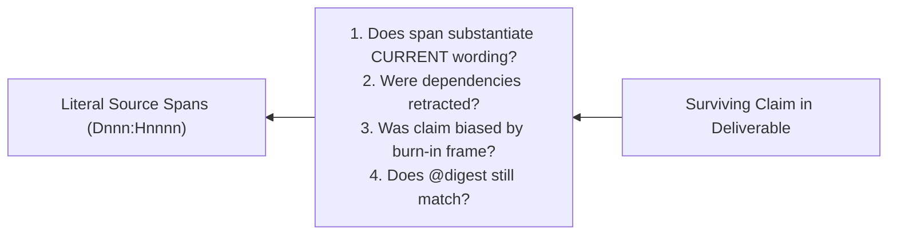

# Analytical State, Notebook Discipline, and Audit Loops

This reference provides the rigorous specification for maintaining state during a `doc-dive`, enforcing reversibility on interpretive moves, and executing audit procedures.

---

## 1. Observable Classification & Accumulation

Different analytical products require distinct data treatments. Do not collapse them into a single summary format:

| Information Type | Valid Treatment | Ledger / Notebook Mechanism |
|---|---|---|
| **Counts, Entities, Citations** | Commutative accumulation | Sets / tables; order invariant |
| **Chronology, Argument Evolution** | Ordered accumulation | Sequence-anchored chains with causal glue |
| **Definitions Changing Over Time** | Stateful replacement with history | Concept entries preserving prior formulations |
| **Contradictions & Tensions** | Deferred joins across observations | Explicit tension ledger pairing opposing anchors |
| **Emergent Themes, Assumptions** | Global interpretation | Checkpoints reconstructed from raw ledger |
| **Final Synthesis** | Deliverable generation | Permitted **only** after reverse walk & coverage audit |

---

## 2. Contextual Glue: Traceable Reasoning

Do not maintain isolated lists of anchors (`Development: D001:H0003, D001:H0019`) or brittle typed dependency graphs (`depends_on: [H0003]`).

> **Rule:** Write the development trail as causal prose with embedded anchors.

### Contrast:
- **Brittle Citation List:**
  ```markdown
  Development: D001:H0003, D001:H0019, D002:H0007
  ```
  *(Offers nothing to falsify; no rationale recorded.)*

- **Causal Contextual Glue:**
  ```markdown
  Development: Proposed at D001:H0003 as a general principle; narrowed at D001:H0019 when multi-file exports broke the flat assumption; formalized and named at D002:H0007.
  ```
  *(Audit-ready: an auditor can test whether `D001:H0019` actually broke the assumption.)*

Mentioning another note or concept ID (`C-002`) within the glue enables freeform cross-referencing via simple text search without committing to premature graph ontologies.

---

## 3. Reversibility as a Design Invariant

In stateful analysis, every forward interpretive move must have an admissible, computable reverse move. Overwriting formulations in place destroys history, creating irreversible drift.

### Interpretive Moves & Reversibility

| Forward Move | Reverse Move | Invariant / Requirement for Reversibility |
|---|---|---|
| **Split** a concept into two | Merge | The union of the children's anchor sets must equal the parent's anchors. |
| **Birth** a new concept from text | Retract | Retain the motivating anchor with a retraction reason. |
| **Refine** a formulation | Restore prior | Keep prior formulations in an explicit history block. |
| **Descend** to finer partition | Ascend | Half-open byte spans are depth-invariant. |
| **Adopt** a proposal | Un-adopt | The contextual glue records why it was adopted. |

### Conservation of Evidence
If concept `C-004` carries eight anchors and is split into `C-004a` and `C-004b`, the anchors must **partition** across the children.
- Never duplicate anchors across split concepts. Duplication artificially manufactures support, making two concepts appear robustly evidenced when there was only one set of observations.

### Dimension Matching: Record the Splitting Criterion
A concept cannot be split without a distinguishing criterion sourced from a literal span. Record the exact anchor that motivated the split:
```markdown
## C-004a — Fast Exact Matching
- Split from C-004 at D002:H0011 based on linear memory guarantee.
```

---

## 4. The Reverse Walk (Pre-Synthesis Audit)

Before producing a final deliverable or synthesis, walk every surviving claim **backward** against its supporting anchors.

### Why Backward?
- **Forward re-reading** re-runs the initial trajectory. You meet the evidence, then the claim, and rationalize the conclusion—reproducing any confirmation bias or drift.
- **Backward walking** holds the final claim first and tests whether the cited source anchors actually substantiate it.



### The 4 Audit Checks
For every claim surviving into the final deliverable:
1. **Wording Drift:** Does the source span support the claim *as currently stated*, or only as initially conceived?
2. **Retraction Cascades:** Were any supporting concepts or proposals subsequently retracted or superseded?
3. **Burn-in Bias:** Was the claim formed during early orientation under an ontology that was later discarded?
4. **Digest Validity:** Does `Dnnn:Hnnnn@digest` match the current source index (verifying source immutability)?

---

## 5. Computable Diagnostics: Read vs. Cited Bytes

`mdnav` maintains an exact ledger of byte spans read (`reads.jsonl`), and the notebook maintains an exact ledger of anchors cited.

Comparing the set of bytes read against the set of bytes cited reveals structural reading defects:

```
               ┌──────────────────────────────────────────────┐
               │              All Bytes in Corpus             │
               │   ┌──────────────────────────────────────┐   │
               │   │              Bytes Read              │   │
               │   │   ┌──────────────────────────────┐   │   │
               │   │   │         Bytes Cited          │   │   │
               │   │   └──────────────────────────────┘   │   │
               │   │   ▲                              ▲   │   │
               │   └───┼──────────────────────────────┼───┘   │
               └───────┼──────────────────────────────┼───────┘
                       │                              │
         [Read but Never Cited]            [Cited Without Reading Surroundings]
         • Silent attrition candidate?     • Salience capture hazard!
         • State why un-cited              • Re-read surrounding context
```

### Diagnostic 1: Read but Never Cited
- **Condition:** Large spans were read in `mdnav`, but zero anchors from those spans appear in the notebook.
- **Remedy:** Either explicitly log that the material was irrelevant/tangential, or identify it as a **silent attrition candidate** to be restored.

### Diagnostic 2: Cited Far Beyond What Was Read (Salience Capture)
- **Condition:** A claim relies on a single isolated anchor where none of the surrounding context was ever read.
- **Remedy:** The claim may be locally true but contextually wrong or superseded. Re-read the surrounding unit or subtree before finalizing.
