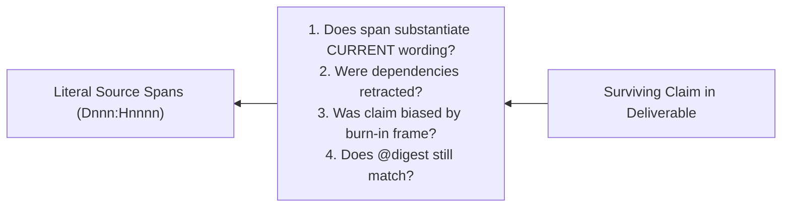

# Analytical State, Notebook Discipline, and Audit Loops

This reference provides the rigorous specification for maintaining state during a `doc-dive`, enforcing reversibility on interpretive moves, and executing audit procedures.

---

## 1. Observable Classification & Accumulation

Different analytical products require distinct data treatments. Do not collapse them into a single summary format:

| Information Type | Valid Treatment | Ledger / Notebook Mechanism |
|---|---|---|
| **Counts, Entities, Citations** | Commutative accumulation | Sets / tables; order invariant |
| **Chronology, Argument Evolution** | Ordered accumulation | Sequence-anchored chains with causal glue |
| **Definitions Changing Over Time** | Stateful replacement with history | Concept entries preserving prior formulations |
| **Contradictions & Tensions** | Deferred joins across observations | Explicit tension ledger pairing opposing anchors |
| **Emergent Themes, Assumptions** | Global interpretation | Checkpoints reconstructed from raw ledger |
| **Final Synthesis** | Deliverable generation | Permitted **only** after reverse walk & coverage audit |

---

## 2. Contextual Glue: Traceable Reasoning

Do not maintain isolated lists of anchors (`Development: D001:H0003, D001:H0019`) or brittle typed dependency graphs (`depends_on: [H0003]`).

> **Rule:** Write the development trail as causal prose with embedded anchors.

### Contrast:
- **Brittle Citation List:**
  ```markdown
  Development: D001:H0003, D001:H0019, D002:H0007
  ```
  *(Offers nothing to falsify; no rationale recorded.)*

- **Causal Contextual Glue:**
  ```markdown
  Development: Proposed at D001:H0003 as a general principle; narrowed at D001:H0019 when multi-file exports broke the flat assumption; formalized and named at D002:H0007.
  ```
  *(Audit-ready: an auditor can test whether `D001:H0019` actually broke the assumption.)*

Mentioning another note or concept ID (`C-002`) within the glue enables freeform cross-referencing via simple text search without committing to premature graph ontologies.

---

## 3. Reversibility as a Design Invariant

In stateful analysis, every forward interpretive move must have an admissible, computable reverse move. Overwriting formulations in place destroys history, creating irreversible drift.

### Interpretive Moves & Reversibility

| Forward Move | Reverse Move | Invariant / Requirement for Reversibility |
|---|---|---|
| **Split** a concept into two | Merge | The union of the children's anchor sets must equal the parent's anchors. |
| **Birth** a new concept from text | Retract | Retain the motivating anchor with a retraction reason. |
| **Refine** a formulation | Restore prior | Keep prior formulations in an explicit history block. |
| **Descend** to finer partition | Ascend | Half-open byte spans are depth-invariant. |
| **Adopt** a proposal | Un-adopt | The contextual glue records why it was adopted. |

### Conservation of Evidence
If concept `C-004` carries eight anchors and is split into `C-004a` and `C-004b`, the anchors must **partition** across the children.
- Never duplicate anchors across split concepts. Duplication artificially manufactures support, making two concepts appear robustly evidenced when there was only one set of observations.

### Dimension Matching: Record the Splitting Criterion
A concept cannot be split without a distinguishing criterion sourced from a literal span. Record the exact anchor that motivated the split:
```markdown
## C-004a — Fast Exact Matching
- Split from C-004 at D002:H0011 based on linear memory guarantee.
```

---

## 4. The Journal Ledger (`mdnav_journal_*`)

Sections 1–3 describe bookkeeping the reader would otherwise do by hand in prose: minting ids, stamping time, threading parents, tracking which formulation is still live. That work is deterministic, it repeats on every entry, and it decides nothing about meaning — so it belongs in the utility. The **journal** is that machinery. What it never does is choose the `op`, write the `body`, or pick the anchors; those are the reasoning agent's.

The notebook lives at `<corpus>/.doc-dive/journal.jsonl`. It sits at the **root**, beside `LATEST` — not inside a stamped run — so re-indexing the corpus never orphans it.

### Ops and what they settle

| Op | Meaning | Effect on the entries it refs |
|---|---|---|
| `propose` | Put a formulation on the record | — |
| `refine` | Narrow or sharpen a parent | parent → `refined` |
| `supersede` | Replace a parent outright | parent → `superseded` |
| `adopt` | Take a formulation into the deliverable | parent → `adopted` |
| `reject` | Rule a formulation out | parent → `rejected` |
| `retract` | Withdraw your own earlier entry | parent → `retracted` |
| `note` | Observation attached to nothing | — |

`refs` is a **list**. One parent is the ordinary case; two or more express a *merge*, which is how two lines of thought get reconciled into one statement. Splits go the other way — several children naming the same parent.

### Status is derived, never stored

No entry's record is ever rewritten. An entry's status is computed from the ops of its children each time the ledger is read:

- The file stays a pure event log, so rehydrating it reproduces the live session exactly.
- "Preserve history — never overwrite in place" (§3) holds **by construction** rather than by discipline.
- A decisive verdict outranks a refinement; among equals the most recent child wins.

This is what makes §3's reverse moves computable rather than aspirational: un-adopting is a new entry, not an edit, and the prior formulation is still sitting there to restore.

### The ledger line

`mdnav_journal_read` renders nine fields, every structural mark isolated by one space on both sides so it tokenizes identically wherever it appears:

```
id | ts | op | refs | concept | status | anchors | bytes | body
N003 | 20260828_194530Z | adopt | N002 | C-001 | active | D023 : H0006 @ e5f6 ; code : grassmann.py | 148 | Adopted for the tracker. \n \n See the method section.
```

Marks nest by rank: ` | ` separates fields, ` ; ` separates items within a field, and ` : ` / ` @ ` / ` .. ` separate the components of a single item.

- `-` holds a field open when it has no value, so the column count never varies.
- A body is flattened onto one line; each newline becomes an isolated `\n` mark. Body is the terminal field, so pipes inside it are left alone.
- Timestamps are stored as ISO-8601 UTC — directly comparable with `reads.jsonl` — and rendered compact.

### Anchors are paths, not identifiers

`D023 : H0006 @ e5f6` is not one opaque id. It is a document, a chunk inside it, and that chunk's content identity **at the moment it was cited** — three components, each an edge in the corpus graph.

**The first reason to isolate them is the context stream itself.** These lines are text the model reads, and every mdnav tool emits them — outlines, chunk prefixes, locate hits, coverage rows, drift warnings, journal lines. When `D023` is its own space-isolated item, it presents the *same tokens* in all of them, and self-attention can bind those mentions to each other directly. Fused into `D023:H0006@e5f6`, the leading component merges with the punctuation, its tokenization shifts with the width of the digits around it, and co-reference has to be inferred from string similarity instead of seen as token identity. The graph stops being legible from the stream and becomes reachable only by tool call.

This is why the rule is uniform across **every** emitter rather than local to the ledger: one tool rendering the chunk differently from the others reintroduces exactly the variability the isolation was bought to remove. `test/render-test.mjs` drives all eleven tools and fails on a fused anchor anywhere, warnings and error messages included.

The second reason is that each component becomes separately queryable:

| Ask | Query | Edge traversed |
|---|---|---|
| Everything citing this document | `journal_read({ scope: "D023" })` | entry → document |
| Every version of this chunk anyone cited | `journal_read({ anchor: { scope: "D023", unit: "H0006" } })` | entry → chunk, digest-agnostic |
| Only citations pinned to one version | `journal_read({ anchor: { scope: "D023", unit: "H0006", digest: "e5f6" } })` | entry → chunk at version |
| Everything cited at this content identity | `journal_read({ digest: "e5f6" })` | entry → version, across chunks |

The last two are what turn Audit Check 4 into a query. When a chunk drifts, the citations still pinned to the **old** digest are exactly the claims that need re-walking — and you can list them without re-reading a byte. Fusing the anchor into one token would collapse the path to a leaf and put every one of these edges out of reach.

Each filter names the component it is, so nothing is inferred from how you typed it: `{ scope: "H0006" }` asks for a *document* called `H0006` and correctly finds none. A plain string still works — `anchor: "H0006"` reads its lone component as the unit, and `"D023:H0006@e5f6"` or the spaced `"D023 : H0006 @ e5f6"` split the same way — but components are the form that cannot be misread.

Namespaces outside the corpus decompose identically: `code : grassmann.py` is scope `code`, unit `grassmann.py`, so `journal_read({ scope: "code" })` lists every entry grounded in source rather than in the documents.

### Writes are acknowledged, not echoed

`mdnav_journal_record` returns a receipt and nothing else:

```
recorded | N003 (+148 B) | adopt | N002 | C-001 | D023 : H0006 @ e5f6 ; code : grassmann.py
```

You just wrote the body; being read it back doubles what the note cost. The receipt carries the minted id, the byte cost, and where the entry attached.

### Anchors are checked at write time

Record an anchor as its components — `{ scope: "D023", unit: "H0006", digest: "e5f6" }`. A scope naming a document with a unit naming a chunk is resolved against the live index as it is recorded, and a digest that no longer matches is reported **then** — while the citation is still cheap to fix — rather than at the reverse walk, when it is not. Any other scope (`{ scope: "code", unit: "grassmann.py" }`, a URL, a bare tag) is your own vocabulary and is kept verbatim.

A string is accepted too, and the spaced form the stream prints resolves exactly like the compact one — you never need to restyle a citation to pass it back. Whatever form goes in, one canonical address is stored, so these entries all join on the same components later. A `ref` to an entry that does not exist is refused outright.

### What still belongs in the markdown notebook

The journal holds the **evidence chain**. The study contract from `FRAME`, the document inventory and working grain, the causal glue prose of §2, and unresolved-question lists stay in `review-state.md` — they are framing and interpretation, not ledger entries.

---

## 5. The Reverse Walk (Pre-Synthesis Audit)

Before producing a final deliverable or synthesis, walk every surviving claim **backward** against its supporting anchors.

### Why Backward?
- **Forward re-reading** re-runs the initial trajectory. You meet the evidence, then the claim, and rationalize the conclusion—reproducing any confirmation bias or drift.
- **Backward walking** holds the final claim first and tests whether the cited source anchors actually substantiate it.



### The 4 Audit Checks
For every claim surviving into the final deliverable:
1. **Wording Drift:** Does the source span support the claim *as currently stated*, or only as initially conceived?
2. **Retraction Cascades:** Were any supporting concepts or proposals subsequently retracted or superseded?
3. **Burn-in Bias:** Was the claim formed during early orientation under an ontology that was later discarded?
4. **Digest Validity:** Does `Dnnn:Hnnnn@digest` match the current source index (verifying source immutability)? Re-reading a cited anchor answers this in-band — and because every read re-stats the source, a corpus edited *during* the investigation is re-indexed and announced rather than served from a stale cache.

---

## 6. Computable Diagnostics: Read vs. Cited Bytes

`mdnav` maintains an exact ledger of byte spans read (`reads.jsonl`), and the journal (§4) maintains an exact ledger of anchors cited (`journal.jsonl`). Both halves of this arithmetic are now on disk in the same directory: `mdnav_coverage` reports the bytes read, and `mdnav_journal_read({ scope })` lists every entry citing that document.

Comparing the set of bytes read against the set of bytes cited reveals structural reading defects:

```
               ┌──────────────────────────────────────────────┐
               │              All Bytes in Corpus             │
               │   ┌──────────────────────────────────────┐   │
               │   │              Bytes Read              │   │
               │   │   ┌──────────────────────────────┐   │   │
               │   │   │         Bytes Cited          │   │   │
               │   │   └──────────────────────────────┘   │   │
               │   │   ▲                              ▲   │   │
               │   └───┼──────────────────────────────┼───┘   │
               └───────┼──────────────────────────────┼───────┘
                       │                              │
         [Read but Never Cited]            [Cited Without Reading Surroundings]
         • Silent attrition candidate?     • Salience capture hazard!
         • State why un-cited              • Re-read surrounding context
```

`mdnav_coverage` computes both sets and their difference:

```
doc | read | of | read % | cited | cited % | reads | entries
D001 | 8,420 B | 11,204 B | 75.2% | 3,180 B | 28.4% | 6 | 4
  read not cited | 5.12 KiB | silent attrition candidate — say why, or restore it
  cited not read | 0 B | salience capture hazard — re-read the surrounding unit
  unread | D001 : H0007 | 2.72 KiB | Appendix
```

Each cited anchor is resolved to the chunk it names, at that chunk's **own** grain — a citation means the unit it names, not whatever depth you happen to be scoring at. Anchors that no longer resolve cite no bytes; that drift is reported where it is actionable, at read and at record time.

### Diagnostic 1: Read but Never Cited
- **Condition:** `read not cited` is large — spans were read but no journal anchor covers them.
- **Remedy:** Either record a `note` saying the material was irrelevant or tangential, or treat it as a **silent attrition candidate** to be restored.

### Diagnostic 2: Cited Far Beyond What Was Read (Salience Capture)
- **Condition:** `cited not read` is non-zero — a claim rests on an anchor whose surroundings were never read.
- **Remedy:** The claim may be locally true but contextually wrong or superseded. Re-read the surrounding unit or subtree before finalizing.
