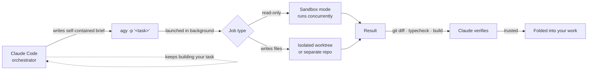

## How it works

Claude writes the brief, launches the job non-interactively (`agy -p "<task>"`), and immediately returns to your work. The sub-agent runs on its own. When it finishes, Claude reads the output and **verifies it** — `git diff`, typecheck, build — before any of it is trusted or merged.

## Usage

Just talk to Claude Code the way you already do. A few prompts that trigger the skill:

> "Have Antigravity review my current branch diff for bugs while you keep building the checkout flow."

> "Spin up a sub-agent to audit this repo's dependencies for known vulnerabilities and report back."

> "Get a second opinion from Gemini on this caching design, and keep working on the API in the meantime."

Claude decides the job type, picks the right isolation mode, launches it in the background, and reports back once it has collected and verified the result.

## Safety model

Delegation only helps if you can trust what comes back. One rule sits above everything else:

> **An Antigravity job never writes to the same files Claude Code is editing at that moment.**

That rule drives how every job runs:

| Job type                         | Writes files? | Isolation                | Concurrent with Claude? |
| -------------------------------- | ------------- | ------------------------ | ----------------------- |
| Code review                      | No            | Sandbox (read-only)      | Yes                     |
| Architecture / security analysis | No            | Sandbox (read-only)      | Yes                     |
| Research sweep                   | No            | Sandbox (read-only)      | Yes                     |
| Dependency / config audit        | No            | Sandbox (read-only)      | Yes                     |
| Second opinion (different model) | No            | Sandbox (read-only)      | Yes                     |
| Coding task                      | Yes           | Isolated git worktree    | Yes — on separate files |
| Large refactor                   | Yes           | Worktree / separate repo | Yes — on separate files |

**Everything is verified before it's trusted** — Claude inspects the `git diff` and runs the project's typecheck / build on any returned work before folding it in. No sub-agent change is taken on faith. Keep a task in Claude when it's small, tightly coupled to what you're editing right now, or needs live back-and-forth; delegation shines on the heavy, separable work.
