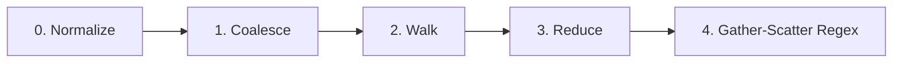

# Membrane & Glob Compilation

The membrane stage (`rs.core.membrane.psm1`) filters the filesystem graph to retain only eligible files.

## Two Semantics Modes

1. **`Ignore` Semantics (Default)**:
   - Evaluates `.gitignore`, `.snapignore`, and internal defaults (`IgnoreDefaults`).
   - Prunes directories early when entire subtrees match ignore patterns.
   - Sentinel files found during the walk are layered hierarchically.
2. **`Selection` Semantics**:
   - Matches strictly against user-supplied inclusion patterns.
   - Sentinel files are ignored.
   - Fails fast if the pattern set is empty or matches no files.

## GlobCompiler Pipeline

`GlobCompiler` processes patterns through five semantics-neutral stages:

- **0. Normalize**: Cleans pattern syntax, handles directory markers (`/`), and parses negation (`!`).
- **1. Coalesce**: Merges pattern files within each directory node.
- **2. Walk**: Propagates ancestor ignore patterns down the directory tree.
- **3. Reduce**: Eliminates shadowed or redundant pattern definitions.
- **4. Gather-Scatter**: Compiles effective per-node positive and negative regular expressions.

## Pre-Glob Eligibility Guards

Before applying glob regexes, the membrane enforces non-invertible eligibility checks directly against crawler metadata:
- `MaxSizeBytes`: Discards files exceeding the byte threshold (`FileTooLarge`).
- `ExtensionBlacklist`: Discards unsupported binary extensions (`ExtensionBlacklisted`).
