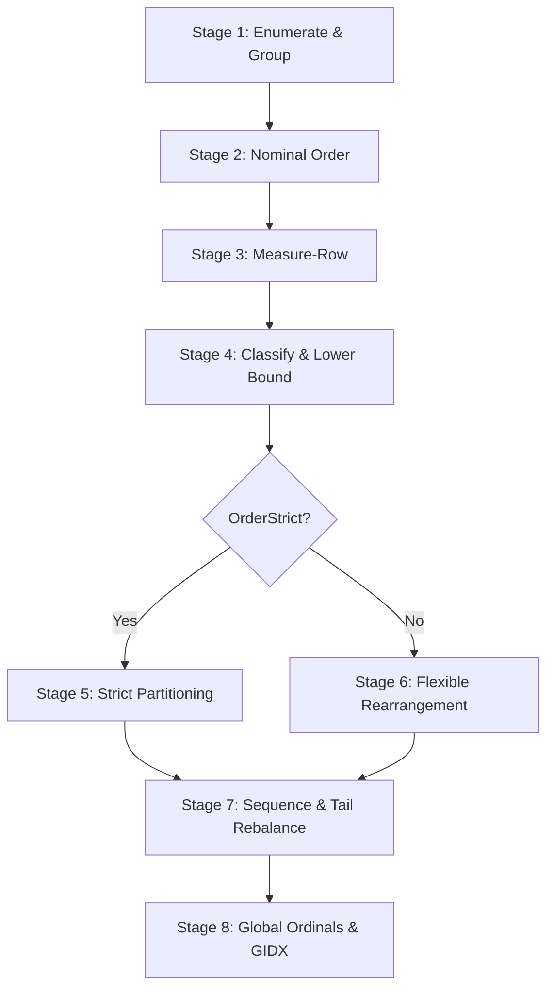

# Sharding & Bin Packing Architecture (`rs.core.shards.psm1`)

The sharding stage (`rs.core.shards.psm1`) partitions Intermediate Representation (IR) entries into deterministic, bounded shard files (`.txt`). It guarantees zero content copying during planning and ensures that serialized byte sizes match planned capacities with mathematical exactness.

---

## 1. Capacity Model & Boundary Invariants

Bins are sized against layout and quota boundaries:

- **$\text{Cap}_Q$ (Quota Capacity)**: $\text{ShardQuotaBytes} - \text{HeaderBytes}$
- **$\text{Cap}_C$ (Ceiling Capacity)**: $(\text{ShardQuotaBytes} + \text{ShardToleranceBytes}) - \text{HeaderBytes}$
- **Atomicity**: Records are never split across shards.
- **Classification Tiers**:
  - **Normal**: Multi-item bin within $[1, \text{Cap}_C]$.
  - **Singleton**: Single record fitting within $\text{Cap}_Q$.
  - **InBand**: Single record larger than $\text{Cap}_Q$ but fitting within $\text{Cap}_C$.
  - **Oversized (Pinned)**: Single record exceeding $\text{Cap}_C$. Allocated to its own dedicated overflow shard and excluded from general fill aggregates.

---

## 2. The 8-Stage Sharding Cascade

### Stage 1: Group Partitioning
Groups entries by partitioning strategy:
- `Flat`: Single partition across all files.
- `ByFileType`: Reads `Extension` from the `carried` entry tier (avoiding re-derivation from path).
- `ByRootDirectory`: Groups by first-level directory segment (placing `.root` first).

### Stage 2: Deterministic Nominal Ordering
Sorts items within each group using composite ordinal keys (`<primary>\0<RelativePath>`) to ensure absolute determinism across all environments:
- `PathAsc`: Lexicographical sort by relative path.
- `PathHash`: Hash-distributed sort via `Get-PathHash`.

### Stage 3: Measure-Row
Computes row byte sizes using `Measure-Row -Layout $Layout -Entry $Entry` once per entry without materializing text spans.

### Stage 4: Classification & Lower Bound
Pins oversized entries ($> \text{Cap}_C$) and computes the ceiling-anchored lower bound $K_{\min}$ for packable items:
$$K_{\min} = \max\left(\left\lceil \frac{\sum \text{Sizes}}{\text{Cap}_C} \right\rceil, \left\lceil \frac{N}{\text{MaxFilesPerShard}} \right\rceil\right) + N_{\text{oversized}}$$

### Stage 5: Strict Partitioning (`OrderStrict`)
Maintains exact input order without interleaving:
- **`FrontLoad`**: Packs maximal quota prefixes ($\le \text{Cap}_Q$), expanding into tolerance ($\le \text{Cap}_C$) only when the suffix is infeasible for remaining bins.
- **`Even`**: Lexicographic min-max linear partition. Performs binary search for the minimal maximum bound $B^*$, followed by dynamic programming over cut points with sorted-descending vector values.

### Stage 6: Flexible Rearrangement (`OrderStrict: $false`)
1. **First-Fit Decreasing (FFD)**: Initial baseline pack at $\text{Cap}_Q$.
2. **Tolerance-Bounded Bin Elimination**: Iteratively eliminates smallest bins by best-fitting their records into remaining bins under ceiling $\text{Cap}_C$.
3. **Even LPT Pass**: Longest Processing Time (LPT) redistribution over the established bin count.

### Stage 7: Shard Sequencing & Tail Rebalance
- Orders bins by the first nominal index of their contents.
- Restores nominal item order within each individual bin.
- Moves the minimum-fill non-oversized bin to the very tail of the shard list (ties broken toward later nominal position), minimizing trailing slack.

### Stage 8: Global Key Formatting & `gidx`
- Derives zero-padded shard keys: `s001`, `s002_ps1`, `s003_root`.
- Assigns global reading ordinals (`GlobalIdx` / `gidx`) sequentially across all serialized shard bins.
