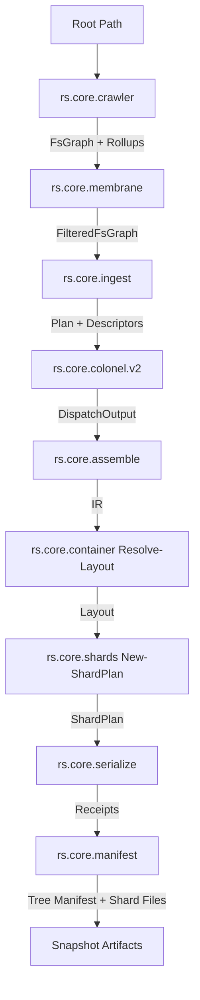

# Pipeline Stage Architecture

RepoSnapshot V3 structures repository ingestion and snapshot artifact creation as a pipeline of isolated stages.

## Stage Responsibilities & Ownership

| Stage | Module | Primary Role | Invariant / Boundary |
|---|---|---|---|
| **Crawl** | `rs.core.crawler.psm1` | Greedy BFS tree discovery | Stamps all facts free at filesystem vantage. Zero content reads. |
| **Membrane** | `rs.core.membrane.psm1` | Ingestion eligibility | Applies size/extension guards and 5-stage glob compilation (`Ignore` / `Selection`). |
| **Ingest** | `rs.core.ingest.psm1` | Ingest orchestration | Bridges Membrane to Colonel; translates profile configurations to compiled plans. |
| **Colonel** | `rs.core.colonel.v2.psm1` | Runspace dispatch | Compiles AST-validated processor scripts into ISS and dispatches items across worker pool. |
| **Assemble** | `rs.core.assemble.psm1` | In-memory collation | Collates dispatch results into IR; applies open element model and entry routing. |
| **Container** | `rs.core.container.psm1` | Wire formatting | Interprets `container.spec.jsonc`; measures and renders single-line `psr` rows. |
| **Shards** | `rs.core.shards.psm1` | Bin packing | Groups and packs entries into deterministic, bounded shards (`FrontLoad` or `Even`). |
| **Serialize** | `rs.core.serialize.psm1` | Disk emission | Writes shard files; enforces `Plan == File` size gate and records cursor receipts. |
| **Manifest** | `rs.core.manifest.psm1` | Manifest TOC emission | Renders Handlebars-lite TOC template with declarations and directory tree. |

## Core Principles

1. **Config Selects, Implementation Owns Sequence**:
   Callers configure which operations, stages, or columns are active; stage implementations own the execution sequence.
2. **Measurement at Point of Authority**:
   Facts are measured once by the component authoritative for that fact (e.g., offsets measured by serializer cursor, byte spans by container layout, file sizes by crawler).
3. **Open Element Model**:
   Payload elements attached by processor chains flow through assembly without requiring stage-specific schema modifications.
